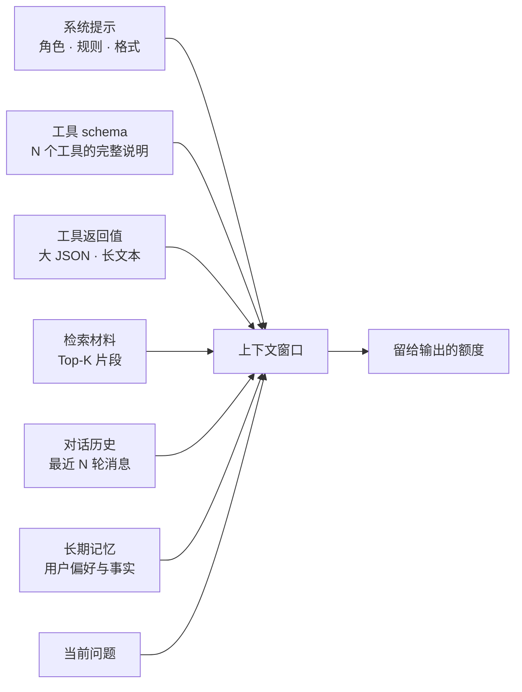
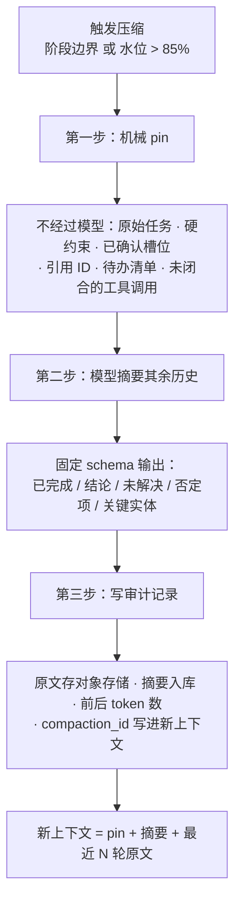
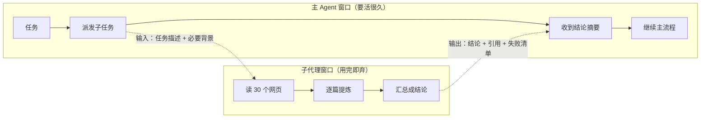

# 上下文工程：窗口预算、压缩与子代理隔离

> 工具写好了、图搭起来了、可靠性也兜住了，任务一长还是会崩——几十个信源、上百次工具调用、跨天接力，窗口先撑不住。这篇讲怎么把上下文窗口当成一种需要精细分配的稀缺资源来管，以及为什么顶开这个天花板的不是更大的模型，是更好的骨架。

## 窗口是新的天花板

单轮问答用不着这一篇：一个问题、三段检索、一个答案，窗口绰绰有余。撑不住是从"任务变长"开始的，症状有四种，它们的危险程度递增。

| 症状 | 表现 | 直接原因 | 危险在哪 |
|---|---|---|---|
| 溢出 | 报 context length exceeded，或被框架静默截断 | 装配时根本没算账 | 报错发生在生成节点，根因在几步之前 |
| 截断失忆 | 第 20 轮忘了第 1 轮说的"只寄公司地址" | 滑动窗口把老消息裁掉了 | 用户说过的话要反复说，体感极差 |
| 迷航 | 长任务跑到中段开始重复劳动、偏离原目标 | 原始任务描述被挤到很远的位置 | 步数和成本都上去了，结果还是错的 |
| 上下文中毒 | 一个早期的错误结论被反复引用，越用越确信 | 错的东西进了上下文、摘要或长期记忆 | 自我强化，越往后越难纠正 |



七个入口里，前端出身的人通常只盯着"历史"和"检索"，但实测下来**工具返回值往往是最大的那一桶**——它是唯一一个"你不设上限它就真的没有上限"的来源：一个订单列表接口返回 200 条 × 60 个字段，一次就能吃掉半个窗口。

**判断标准：** 只要任务会跨越 10 步以上、或者会跨会话接力，就必须显式管上下文；单轮问答不必。管的方式不是"想办法塞更多进去"，而是让每个 token 都值得占那个位置。

---

## 窗口更大不等于效果更好

"换个 200k 窗口的模型不就完了" 是最常见的第一反应。它能买到时间，但买不到效果，原因有四条，前两条是效果问题，后两条是成本问题。

| 变大之后 | 实际发生什么 | 为什么 |
|---|---|---|
| 中间信息丢失 | 放在上下文中段的关键事实，模型经常"看不见" | 注意力对开头和结尾更敏感，中段是低敏感区（lost in the middle） |
| 噪声稀释 | 塞 40 段材料的准确率低于精选 8 段 | 相关信号占比下降，模型要先在无关内容里做筛选，而它不擅长这件事 |
| 成本线性上涨 | 每一步都重发全量上下文，循环里乘以步数 | Agent 的每一轮决策都要带完整历史，这是循环结构的固有代价 |
| 首字延迟上涨 | 输入越长，prefill 越久，首字越慢 | 长输入的编码时间随长度增长，流式体验先受影响（见 [流式输出](./agent-streaming)） |

::: warning 一个反直觉的经验
同一个任务，把材料从 30 段砍到 8 段精选，准确率常常上升而不是下降。所以**"上下文塞不满"不是浪费，"塞满了"才需要解释**。窗口是预算不是目标。
:::

**生产推荐：** 大窗口模型留给两类场景——单份长文档必须整体理解（合同、财报），以及压缩摘要器本身需要一次读进很多历史。其余场景优先把材料做精，而不是把窗口做大。

---

## 上下文账本：先量出来再动手

优化上下文的第一步不是压缩，是**知道 token 花在哪了**。没有账本的优化都是猜——猜完往往去裁历史，而真正的大头在工具返回值。

计量要能换 tokenizer：本地开发用近似估算，上线前换成模型真实的 tokenizer，两者在中文长文本上能差 20% 以上。

```python
from dataclasses import dataclass, field
from typing import Protocol

class Tokenizer(Protocol):
    def count(self, text: str) -> int: ...

class Approx:
    """兜底估算：中文约 1.5 字/token，英文约 4 字符/token。只用于本地开发"""
    def count(self, text: str) -> int:
        cjk = sum(1 for c in text if "一" <= c <= "鿿")
        return int(cjk / 1.5 + (len(text) - cjk) / 4) + 1

BUCKETS = ("system", "tools_schema", "tool_results", "retrieved", "history", "memory", "query")

@dataclass
class ContextLedger:
    """上下文账本：按来源分桶计量，装配层每加一段就记一笔"""
    limit: int                       # 模型窗口
    reserve_out: int                 # 给输出预留的额度，不参与分配
    tk: Tokenizer
    used: dict[str, int] = field(default_factory=lambda: dict.fromkeys(BUCKETS, 0))

    def add(self, bucket: str, text: str) -> int:
        n = self.tk.count(text)
        self.used[bucket] += n
        return n

    @property
    def usable(self) -> int: return self.limit - self.reserve_out
    @property
    def total(self) -> int: return sum(self.used.values())
    @property
    def ratio(self) -> float: return self.total / max(self.usable, 1)

    def zone(self) -> str:
        r = self.ratio
        return "safe" if r < 0.6 else "warn" if r < 0.85 else "danger"

    def top(self, n: int = 3) -> list[tuple[str, int]]:
        return sorted(self.used.items(), key=lambda kv: -kv[1])[:n]   # 大头是谁
```

### 水位三区与各区的动作

| 区 | 水位 | 动作 | 谁触发 |
|---|---|---|---|
| 安全 | < 60% | 什么都不做，只记账 | —— |
| 警戒 | 60% - 85% | 工具返回值切引用模式、历史裁到近 N 轮、检索 Top-K 下调一档 | 装配层自动执行 |
| 危险 | > 85% | 触发压缩；压完仍超则外置到工作区，或把子任务外包给子代理 | 压缩节点 |
| 溢出 | > 100% | 不该出现。出现即 fail fast，别交给 SDK 去截断 | 装配层断言 |

最后一行是硬要求：**不要依赖框架或 SDK 的静默截断。** 它裁掉的通常是最前面的系统提示或最后面的当前问题，前者让约束失效、后者让模型答错题，两种都比直接报错更难查。

```python
def assemble(state, ledger: ContextLedger) -> list:
    """装配层：先记账再决定给多少。顺序很重要——先放不可裁的，再放可裁的"""
    parts = [("system", SYSTEM_PROMPT), ("query", state["question"])]      # 这两桶不裁
    for b, text in parts:
        ledger.add(b, text)

    zone = ledger.zone()
    keep_turns = {"safe": 12, "warn": 6, "danger": 3}[zone]
    top_k = {"safe": 8, "warn": 5, "danger": 3}[zone]
    tool_mode = "full" if zone == "safe" else "ref"                        # 见下一节
    ...
    if ledger.total > ledger.usable:            # 兜底断言：宁可报错也不静默截断
        raise ContextOverflow(f"账本 {ledger.total} > 可用 {ledger.usable}，大头：{ledger.top()}")
    return messages
```

一份典型的实测分布（比例会随业务大幅变化，但排序很稳定）：工具返回值 40%-55%、检索材料 15%-25%、对话历史 10%-20%、工具 schema 5%-15%、系统提示 3%-8%、长期记忆 1%-3%。**排序稳定这件事本身就是行动指南**：先动最大的那桶，别一上来就压历史。

对话历史那一桶在 [Multi-Agent](./agent-multi-agent) 里给过一张按优先级分配的预算表，可以直接当默认值用；本篇讲的是那张表撑不住之后怎么办。

---

## 工具返回值整形：性价比最高的一招

这一节放在最前面是因为它无损、可预测、改一处包装层就生效，而且往往一次砍掉三到五成。工具层的定义、错误处理、幂等见 [Tool Calling](./agent-tool-calling)，这里只讲"返回多少、怎么返"。

### 三板斧

| 手段 | 做法 | 适用 | 代价 |
|---|---|---|---|
| 字段裁剪 | 60 个字段只返模型真正要看的 6 个 | 几乎所有内部接口 | 无损，但要维护字段白名单 |
| 分页 | 只返第一页 + `next_cursor` + `total` | 列表类查询 | 模型要翻页时多一跳 |
| 引用 + 按需取全文 | 返 `ref_id` + 摘要 + 可取字段清单，要细节再调 `fetch(ref_id)` | 大 JSON、长文档、报表 | 多一跳，工具要成对设计 |

字段裁剪常常比截条数更划算，而且完全无损：先把 60 个字段砍到 6 个，很多时候连分页都不需要了。

### 省略必须显式，否则模型会替你谎报

```python
# 反例：静默掐尾
def shape_bad(rows: list[dict]) -> str:
    return json.dumps(rows[:20], ensure_ascii=False)     # 模型无从知道后面还有 197 条
```

模型拿到 20 条订单，回答"您近期共有 20 笔订单，其中 3 笔待发货"。实际有 217 笔、58 笔待发货。**它没有幻觉，它只是把你给它的当成了全部。** 这类 badcase 在评测里极难发现：格式正确、语气自然、数字看起来有据可依，只有对照真实数据才知道是错的。

```python
def shape(rows: list[dict], *, total: int, limit: int = 20,
          fields: tuple[str, ...] = ()) -> dict:
    """返回值必须自带完整性元信息：模型要能看出自己拿到的是不是全部"""
    page = [{k: r.get(k) for k in fields} if fields else r for r in rows[:limit]]
    truncated = total > len(page)
    return {
        "items": page,
        "returned": len(page), "total": total,          # 关键：总数一定要给
        "truncated": truncated, "omitted": max(total - len(page), 0),
        "next_cursor": rows[limit].get("id") if truncated else None,
        "hint": (f"仅返回前 {len(page)} 条，共 {total} 条。回答时不得把这 {len(page)} 条"
                 f"当作全部；需要总数或分类统计请调用 count_orders，需要更多明细请用 "
                 f"next_cursor 翻页。" if truncated else ""),
    }
```

`hint` 不是冗余的元数据，而是**给模型的行为约束**。光给 `truncated: true` 模型不一定会照做，要把"不得当作全部""要统计就调聚合工具"明确写出来。

**生产推荐：** 聚合类问题的根本解法不是让模型数列表，而是给它一个聚合工具。`count_orders(status="待发货")` 返回一个数字，比返回 217 条明细再让模型自己数既准又便宜几十倍。凡是发现模型在数东西，就该补一个聚合工具。

**踩坑：** 超长字符串（一段 500KB 的日志、一份 HTML 全文）不能只截断，还要**在工具层就设硬上限**并显式标注。截断标记要放在中间而不是尾部——`前 2000 字 + …[已省略 N 字符]… + 后 500 字`，这样堆栈的报错行和日志的结尾都还在。

---

## 压缩：什么时候压、压什么、怎么压

压缩（compaction）是把一段历史换成一段摘要。它能腾出最多空间，也是唯一**不可逆**的手段——所以它在本篇的优先级排最后。

### 什么时候压

| 触发方式 | 阈值 | 优点 | 风险 |
|---|---|---|---|
| 水位触发 | > 85% | 只在必要时才付摘要的钱 | 时机不可预测，可能压在关键推理的中途 |
| 轮数 / 步数触发 | 每 N 步 | 可预测，便于测试 | 可能压得过早，白花一次调用 |
| 阶段边界触发（推荐） | 子任务完成时 | 语义完整，摘要质量最高 | 需要流程里有明确的阶段划分 |

**生产推荐：** 阶段边界为主、水位为兜底。一个子任务刚做完的那一刻，"已完成什么、结论是什么"最容易说清楚；压在工具调用和结果之间是最糟的时机，会把成对的调用与返回拆散。

### 三步纪律：先 pin，再摘要，最后留审计



第一步是整套机制的关键：**关键信息用代码保留，不要交给摘要器**。摘要器是个模型，它会漏、会改写、会把"用户明确拒绝了方案 B"写成"讨论了几个方案"。凡是丢了就无法恢复的东西，都不该经过模型这一道。

```python
from langchain_core.messages import RemoveMessage, SystemMessage
from pydantic import BaseModel

PIN_KEYS = ("task", "constraints", "confirmed_slots", "citations", "todo", "open_tool_calls")

class Compaction(BaseModel):
    """摘要器的输出 schema。固定字段比自由文本可靠得多；
    negatives 是最容易被摘丢、丢了代价最大的一项"""
    done: list[str]                 # 已完成的子任务
    findings: list[str]             # 已得出的结论（带引用 ID）
    open_questions: list[str]       # 还没解决的问题
    negatives: list[str]            # 用户拒绝过的方案、已排除的可能性
    entities: dict[str, str]        # 关键实体 → 值（订单号、时间范围、金额口径）

async def compact(state: dict, *, keep_recent: int = 6) -> dict:
    pinned = {k: state[k] for k in PIN_KEYS if state.get(k)}       # 第一步：纯代码，不过模型
    old, recent = state["messages"][:-keep_recent], state["messages"][-keep_recent:]
    if len(old) < 4:
        return {}                                                  # 太短不值得压
    summary = await summarizer.with_structured_output(Compaction).ainvoke(render(old))
    audit_id = await save_audit(thread_id=state["thread_id"], raw=old,   # 第三步
                               summary=summary, pinned=list(pinned))
    return {
        "messages": [RemoveMessage(id=m.id) for m in old] +        # 真正删掉，见 ./agent-langgraph
                    [SystemMessage(content=render_context(pinned, summary, audit_id))],
        "compactions": [audit_id],
    }
```

### 压什么，不压什么

| 压 | 不压（pin 住或外置） |
|---|---|
| 已完成子任务的中间过程、工具调用的原始返回 | 原始任务描述与硬约束 |
| 被否决的中间尝试的细节 | 已确认的槽位（地址、时间范围、金额口径） |
| 重复出现的检索片段 | 引用 ID 列表（丢了引用就无法溯源，见 [引用与可溯源](./rag-citation)） |
| 闲聊、寒暄、确认性应答 | 待办清单与当前进度 |
| —— | 未闭合的工具调用（压掉会让消息成对关系断裂，多数模型会直接报错） |

**踩坑：** 摘要节点自己也吃 token，而且恰好在窗口最紧的时候吃。给它配一个独立的小模型 + 分段摘要（先分块各自摘要再合并），否则会出现"为了压缩而爆窗"这种很荒诞的失败。

### 无痕压缩等于篡改历史

审计记录不是锦上添花。线上来一个"Agent 忘了我说过要开专票"的投诉，没有审计你根本无法区分三种情况：用户其实没说过、摘要器把它丢了、pin 的字段列表漏了它。三种情况的修法完全不同。

```sql
CREATE TABLE agent_compaction (
    compaction_id  TEXT PRIMARY KEY,
    thread_id      TEXT NOT NULL,
    raw_ref        TEXT NOT NULL,       -- 原文在对象存储的 key，别塞进这张表
    summary        JSONB NOT NULL,      -- Compaction 的结构化结果
    pinned_keys    TEXT[] NOT NULL,     -- 当时 pin 了哪些字段
    tokens_before  INT NOT NULL,
    tokens_after   INT NOT NULL,        -- 压缩比 = after / before，要监控
    created_at     TIMESTAMPTZ NOT NULL DEFAULT now()
);
CREATE INDEX ON agent_compaction (thread_id, created_at DESC);
```

`tokens_before / tokens_after` 值得单独看一眼分布：压缩比长期高于 0.6 说明摘要器太啰嗦，白付了一次调用；长期低于 0.1 说明压得太狠，大概率在丢信息。

::: warning 摘要的摘要会逐代失真
一条跑了很久的轨迹如果反复压缩，第 5 代摘要和原文之间已经隔了五次模型改写。缓解办法是**始终从 pin + 上一代摘要 + 新增原文重新生成**，而不是"摘要上一份摘要"，并且把代数记进审计。代数超过阈值（比如 5）就该考虑换成任务账本 + 外置化，见后面两节。
:::

---

## 对话历史裁剪：四种策略的失败模式

| 策略 | 做法 | 成本 | 失败模式 |
|---|---|---|---|
| 全保留 | 什么都不删 | 线性上涨直到爆窗 | 长会话必炸；早期无关内容一直在付费 |
| 滑动窗口 | 只留最近 N 轮 | 恒定 | **截断失忆**：第 1 轮的"只寄公司地址"在第 20 轮消失了 |
| 摘要 + 近 N 轮（推荐） | 老的压成结构化摘要，近 N 轮保留原文 | 恒定 + 摘要调用 | 摘要漏掉否定项和已确认槽位；反复压缩逐代失真 |
| 向量召回相关历史 | 历史入库，按当前问题召回 Top-K | 恒定 + 一次检索 | 召回不到等于没有；跨话题跳转时召回错轮次，产生上下文错位 |

**生产推荐：** 三者叠加而不是三选一。摘要 + 近 N 轮打底；槽位、否定项、引用 ID 用 pin 机械保留，不依赖摘要；向量召回只作为"用户忽然提起很久以前那件事"的补充，且召回结果要标明来自第几轮。

---

## 记忆分层：短期、会话、长期

三层的存储、生命周期和写入方式完全不同，混在一起谈是很多设计事故的起点。

| 层 | 存在哪 | 生命周期 | 写入方式 | 写错的代价 |
|---|---|---|---|---|
| 短期（本轮上下文） | 提示词里 | 一次模型调用 | 装配层每次重新组装 | 本轮答错，下轮就没了 |
| 会话（thread） | Checkpointer | 一次会话，TTL 数小时到一天 | 每个节点后自动落库 | 过期即丢，可接受 |
| 长期（跨会话） | PostgreSQL + 向量库 | 长期保留，用户可删 | 显式抽取、过闸、可审计 | **长期污染之后所有会话** |

短期这一层就是前面几节讲的账本、整形、压缩。会话这一层的机制在 [LangGraph Checkpoint](./agent-langgraph) 和 [Multi-Agent 会话记忆](./agent-multi-agent) 里；本节只讲第三层，因为它是唯一一个"写错了会跨会话反复复用"的地方。

### 写入必须过闸：不是什么都记

```python
from typing import Literal

class MemoryCandidate(BaseModel):
    kind: Literal["preference", "fact", "constraint", "lesson"]
    key: str                     # 归一化后的槽位名，用于 upsert 去重
    text: str
    subject: str                 # 归属：user:123 / tenant:9，没有归属不能写
    confidence: float
    source_turn: str             # 来源消息 id，出问题能追到原话
    ttl_days: int | None = None

STABLE = {"preference", "fact", "constraint", "lesson"}

def admit(c: MemoryCandidate) -> tuple[bool, str]:
    """长期记忆四道闸。宁少写不错写——漏记一条只是少一点体验，
    错记一条会在后面每一次会话里复现"""
    if c.kind not in STABLE:                 return False, "not_stable"     # 一次性信息不进
    if c.confidence < 0.8:                   return False, "low_confidence" # 推测不进
    if contains_sensitive(c.text):           return False, "sensitive"      # 证件号、卡号、验证码
    if not c.subject.startswith(("user:", "tenant:")): return False, "no_subject"
    return True, "ok"
```

**该记：** 稳定偏好（"只寄公司地址"）、已确认且长期有效的事实（发票类型、常用收货地）、用户明确拒绝过的方案、历史问题的结论摘要。

**不该记：** 一次性验证码、完整证件号与卡号、临时优惠信息、模型的中间推理、未经确认的推测（"用户可能是学生"）。最后一类最容易混进来，因为它读起来和事实一模一样。

### 召回必须防污染

| 风险 | 表现 | 防法 |
|---|---|---|
| 错误记忆长期复用 | 一条写错的"该用户是 VIP"影响后面所有会话 | 每条带 `source_turn` 可追溯 + 用户可见可删 + 记命中次数与负反馈 |
| 记忆冲突 | 旧地址和新地址同时在库里，召回到哪条看运气 | 按 `(subject, kind, key)` 做 upsert 而不是 append；召回只取最新 |
| 过期记忆 | 去年的偏好当成今天的 | 写入给 TTL，召回按时间衰减打分 |
| 记忆挤占窗口 | 一次召回 20 条把窗口占满 | 硬上限 3-5 条，且只在意图相关时才召回 |
| 记忆被当权威 | 模型拿记忆里的金额做承诺 | 注入时标来源和时间：`[用户偏好·2026-03 记录]`，并在系统提示写明"记忆是线索不是权威，涉及金额、权限、时效必须实时校验" |

最后一行和 [Agent 生产可靠性](./agent-reliability) 里"降级数据不得作为承诺依据"是同一条规则的两个应用面：**凡是非实时、非权威的内容进上下文，都必须自带来源标注和使用限制。**

---

## 文件工作区：把窗口当 RAM 用

窗口里只留指针，正文放文件或数据库，模型需要时现读。这个模式和操作系统的虚拟内存几乎一一对应，用这个类比能一次讲清一整套机制。

| 操作系统 | Agent 里对应什么 | 性质 |
|---|---|---|
| RAM | 上下文窗口 | 快、贵、稀缺，每一步都要重新付费 |
| 磁盘 | 文件 / 数据库 / 对象存储 | 慢、便宜、几乎无限，必须显式读取 |
| 指针 / 虚拟地址 | `ref_id`、文件路径、`doc_id` | 窗口里只放它 |
| 缺页中断 | 模型主动调 `read(ref, start, lines)` | 用到才调进窗口 |
| swap | 压缩 | 换出去要付代价，换回来不保真 |
| 进程隔离 | 子代理 | 独立窗口，只通过返回值通信 |
| 懒加载 + 索引 | 渐进披露：先给目录，再给正文 | 常驻只放索引 |
| OOM Killer | 硬窗口断言 + fail fast | 越界显式失败，不静默截断 |

落地成两个工具就够了：一个 `write_workspace` 把大块内容存下来并返回引用，一个 `read_workspace` 按范围读回。模型看到的永远只是引用和摘要：

```python
# context/workspace.py
from pathlib import Path
import hashlib, json

WS = Path("./workspace")


def write_workspace(name: str, content: str) -> dict:
    """把大块内容落盘，只把引用和摘要返回给模型。"""
    WS.mkdir(exist_ok=True)
    ref = f"{name}-{hashlib.sha256(content.encode()).hexdigest()[:8]}"
    path = WS / f"{ref}.txt"
    path.write_text(content, encoding="utf-8")
    lines = content.count("\n") + 1
    return {                                    # 这个 dict 才进窗口，通常几十个 token
        "ref": ref, "lines": lines, "chars": len(content),
        "head": content[:200],                  # 给模型一点线索判断要不要读
    }


def read_workspace(ref: str, start: int = 0, limit: int = 80) -> dict:
    """按行区间读回，永不整篇灌进窗口。"""
    path = WS / f"{ref}.txt"
    if not path.exists():
        return {"status": "not_found", "ref": ref}      # 结构化失败，不是空字符串
    all_lines = path.read_text(encoding="utf-8").splitlines()
    window = all_lines[start:start + limit]
    return {
        "status": "ok", "ref": ref,
        "range": [start, start + len(window)], "total_lines": len(all_lines),
        "content": "\n".join(window),
        "truncated": start + limit < len(all_lines),    # 显式告诉模型后面还有
    }
```

**附带好处：崩溃可续跑。** 中间产物在磁盘上而不只在窗口里，进程被杀之后重启只需要重新读引用，已经做完的抓取和解析不用重做。这一点和[断点续跑](./agent-reliability)是同一套设计的两面——把状态放到进程外，窗口和进程都变成可丢弃的。

**踩坑：** 工作区必须按会话或线程隔离目录，否则多租户下 `ref` 可以被猜到，等于给了一个跨会话读文件的口子。引用里带上 `session_id` 前缀并在 `read_workspace` 里校验归属，参见[Prompt 注入攻防](./agent-security)里"动作参数来源校验"那一节。

---

## 子代理隔离：把脏活外包出去

有些活天生占窗口：读 30 个网页、扫一个目录下上百个文件、把一份长报告逐段核对。这些活的**过程**很脏（几十万 token 的原始材料），**结论**很干净（一段几百字的总结）。子代理的意义就是让过程发生在另一个窗口里，主上下文只收结论。



效果最直观的指标是**主窗峰值占用**：同样的任务，不外包时主窗峰值可能到几千甚至上万 token 并触发多次压缩；外包后主窗只涨几百 token，压缩机制根本不用启动。压缩是有损的，能不压比压得好更值。

### 什么时候该外包，什么时候不该

| 判断 | 该外包 | 不该外包 |
|---|---|---|
| 过程材料量 | 远大于结论量（读多写少） | 过程和结论差不多大 |
| 上下文依赖 | 任务能用一段自包含的描述讲清 | 需要主 Agent 的完整对话历史才能判断 |
| 交互需求 | 一次性交付，不需要中途来回确认 | 需要边做边跟用户澄清 |
| 结果形态 | 可结构化（清单、摘要、字段） | 需要保留全部细节供后续引用 |
| 延迟容忍 | 可以并行发多个子代理 | 链路已经很紧张，多一跳受不了 |

**踩坑（最容易犯的一个）：** 子代理拿不到主上下文。你以为它知道"用户刚才说只看 2025 年之后的"，它并不知道。所以派发时必须把约束显式写进子任务描述里，而不是指望它能猜到。

### 子代理失败必须返回结构化失败，不能返回空结论

这是个真实会造成错误答案的坑：子代理去查三个信源，两个超时，它返回"未找到相关信息"。主 Agent 收到这句话，合理地推断"这个信息不存在"，然后写进最终答案。**"没能看到"被当成了"不存在"。**

```python
# 反例：主 Agent 无法区分"查过没有"和"没查到"
return {"summary": "未找到相关信息"}

# 正例：把覆盖度和失败原因摊开
return {
    "status": "partial",                          # ok / partial / failed
    "summary": "在可访问的 1 个信源中未发现相关条款",
    "sources_attempted": 3,
    "sources_succeeded": 1,
    "failures": [
        {"source": "gov-portal", "error": "timeout", "retried": 2},
        {"source": "policy-db", "error": "http_503", "retried": 1},
    ],
    "confidence": "low",                          # 主 Agent 据此决定要不要重试或转人工
}
```

主 Agent 拿到 `status: partial` 就该做三件事之一：换信源重试、把不确定性写进答案、或者交给人。这和[引用溯源、拒答与降级](./rag-citation)里"证据不足必须拒答"是同一条原则在子代理边界上的应用。

拓扑层面的分工（谁派发、怎么路由、怎么移交）在[Multi-Agent 编排](./agent-multi-agent)里已经讲过，这里只补上下文视角：**子代理首先是一个上下文隔离装置，其次才是一个分工装置。**

---

## 渐进披露：指令也要分层

系统提示词和工具说明是**每一轮都要重新付费**的常驻开销。工具从 5 个涨到 30 个，光工具 schema 就能吃掉几千 token，而单轮真正用得上的往往只有一两个。渐进披露的做法是把指令拆成三层：

| 层级 | 内容 | 是否常驻 | 典型体积 |
|---|---|---|---|
| 核心 | 角色、硬性红线、输出格式约定 | 常驻 | 几百 token |
| 索引 | 能力清单：每项一行名字 + 一句话用途 | 常驻 | 每项 10 到 20 token |
| 正文 | 完整参数说明、示例、边界条件 | 按需加载 | 每项数百 token |

```python
# context/disclosure.py
from pathlib import Path

SKILLS = {
    "refund_policy": {
        "brief": "退款规则与时限判断",                    # 进索引
        "detail_path": "skills/refund_policy.md",        # 用到才读
    },
    "invoice_rules": {
        "brief": "发票开具与红冲流程",
        "detail_path": "skills/invoice_rules.md",
    },
}


def build_index() -> str:
    """常驻部分：只有名字和一句话。"""
    return "\n".join(f"- {k}: {v['brief']}" for k, v in SKILLS.items())


def load_skill(name: str) -> dict:
    """模型判断需要时才调，正文这一轮才进窗口。"""
    meta = SKILLS.get(name)
    if not meta:
        return {"status": "unknown_skill", "available": list(SKILLS)}
    return {"status": "ok", "name": name,
            "content": Path(meta["detail_path"]).read_text(encoding="utf-8")}
```

同一套思路适用于工具（按意图裁剪可用工具集，见[Tool Calling](./agent-tool-calling)）、领域知识（先给目录再给条款）、以及长文档（先给大纲再给章节）。

**生产推荐：** 先量再拆。用前面那套上下文账本看清系统提示和工具 schema 到底占了多少，占比不到一成就别急着上这套——它引入了"模型可能不去加载它需要的那份说明"的新失败模式，收益不够时不划算。

---

## 长任务：把进度放到窗口外

任务跨越几十步甚至几次会话时，"我做到哪了"必须落在窗口外，否则一次压缩或一次崩溃就把进度丢了。一个任务账本包含三样东西：

| 组成 | 内容 | 谁写 |
|---|---|---|
| TODO 树 | 子任务列表、依赖、每项状态（待办 / 进行中 / 完成 / 失败） | 规划节点写，执行节点更新 |
| 产出索引 | 每个已完成子任务的产物引用（工作区 `ref`） | 执行节点写 |
| 增量简报 | 相比上次的变化摘要，给人看也给下一轮的自己看 | 汇总节点写 |

窗口里只放"当前子任务 + TODO 树的压缩视图（比如 12 项已完成 8 项，当前第 9 项）+ 上一次的简报"，其余全在账本里。这样做还有个副作用：**账本本身就是给人看的进度报告**，不用额外做一套。

具体的持久化与恢复（任务注册表、孤儿回收、已完成节点不重做）在[Agent 生产可靠性](./agent-reliability)里，两者配合使用：账本管"做什么"，Checkpointer 管"做到哪一步的状态"。

---

## 超支了先动哪一刀

真正上线后，"上下文又爆了"是个高频问题。按性价比排序处理，不要一上来就折腾压缩——**压缩是最后一招，因为它是唯一有损的那一招。**

| 顺序 | 动作 | 典型收益 | 代价 | 什么信号提示该动这刀 |
|---:|---|---|---|---|
| 1 | 工具返回值整形（截断、分页、只返引用） | 很大，工具结果常占大头 | 几乎无损，需改工具实现 | 账本显示工具桶占比过半 |
| 2 | 对话历史裁剪（滑动窗口 + 摘要） | 中等，随轮次增长 | 丢远期细节 | 多轮长会话后期才爆 |
| 3 | 渐进披露（工具与指令分层） | 中等，且是常驻节省 | 多一次加载往返 | 工具或系统提示桶偏大 |
| 4 | 外置化到工作区（窗口只留指针） | 很大 | 多一次读取往返 | 单个材料就撑爆窗口 |
| 5 | 子代理隔离（过程外包） | 极大，能降一个量级 | 子代理拿不到主上下文 | 某一段流程稳定吃掉大量材料 |
| 6 | 压缩 | 兜底 | **有损**，且要留审计 | 以上都做完仍然逼近上限 |

::: warning 一个反直觉的顺序
很多人第一反应是"上压缩"或"换更大窗口的模型"。这两个都是把问题往后推：压缩会丢信息，更大窗口会同时带来更高成本、更高延迟和中间信息丢失。**先看账本，先砍工具返回值。** 这一刀通常能解决一半以上的超支，而且无损。
:::

---

## 面试高频问题

**1. 上下文窗口更大了，上下文工程是不是就不需要了？**

- 不是。窗口变大解决的是"塞不进去"，解决不了"塞进去了但用不好"。
- 三个不随窗口增大而消失的问题：中间信息丢失（关键内容在长上下文中间时召回率下降）、噪声稀释（无关材料拉低信噪比）、成本与延迟随输入线性上涨。
- 目标从"能不能装下"变成"每个 token 值不值得占位"——这是个经济问题，不是容量问题。
- 加分：可以指出跨会话记忆和长任务进度天生在窗口之外，无论窗口多大都需要外置化。

**2. 你怎么知道上下文里什么占了大头？**

- 按来源分桶计量：系统提示、工具返回、检索材料、对话历史、当前输入，各算 token 占比。
- 用可注入的 tokenizer 而不是估算字符数，中英文混排下字符数和 token 数偏差很大。
- 实测里工具返回值通常是最大的一桶，这也是为什么"整形工具返回值"是性价比最高的第一刀。
- 别踩的坑：只在出问题时临时打日志。账本应该常驻，作为每次运行的体检项之一（见[可观测性](./agent-observability)）。

**3. 压缩摘要怎么保证不丢关键信息？**

- 分两类处理：关键信息（原始任务、硬约束、已确认的结论、待办清单）用**机械 pin**，不经过模型，摘要器再糟也丢不掉；其余交给模型摘要。
- 压完必须留审计记录（压了哪些轮次、压缩前后 token、摘要全文），否则出问题无法复盘——无痕压缩等于篡改历史。
- 摘要后做一次校验：pin 的字段是否还在、待办数量是否一致。
- 加分：说清"能不压比压得好更值"，所以压缩之前应该先试外置化和子代理隔离。

**4. 子代理和 Multi-Agent 是一回事吗？**

- 有重叠但出发点不同。Multi-Agent 关注的是**分工与路由**（谁擅长什么、怎么移交）；子代理在上下文工程语境下关注的是**窗口隔离**（脏活的过程不要污染主窗口）。
- 一个子代理可以只是"同一个模型、同一套工具，但开一个干净窗口去读 30 个网页"，这里没有任何分工含义。
- 判断要不要外包看两点：过程材料是否远大于结论、任务能否用自包含的描述讲清。
- 别踩的坑：子代理失败返回空结论，主 Agent 会把"没能看到"当成"不存在"。必须返回结构化失败（尝试了几个源、成功几个、失败原因）。

**5. 跨会话的长期记忆怎么防止记错的东西一直被复用？**

- 写入侧设闸：只记稳定的偏好和事实，不记临时状态和推测；带来源和时间戳；同类记忆做去重与更新而不是无限追加。
- 召回侧防污染：召回结果标记为"历史记忆"而非"事实"，与本轮检索到的证据分开呈现，冲突时以当前证据为准。
- 记忆要可撤销：能按 ID 删除、能按时间失效，出现错误记忆时不用清库。
- 加分：提一句这和 RAG 的失效数据过滤是同一个问题（见[RAG 入库链路](./rag-pipeline)），只是数据源是自己写的。

**6. 长任务跑到一半进程被杀，怎么接着跑？**

- 进度落在窗口和进程之外：TODO 树 + 产出索引存库或存文件，节点状态交给 Checkpointer。
- 恢复时按账本找到第一个未完成子任务，已完成的产物用引用读回，不重做。
- 需要孤儿回收：扫描长时间处于"进行中"的任务并重新调度，见[Agent 生产可靠性](./agent-reliability)。
- 别踩的坑：把进度只写在 State 里而 State 又被压缩过——压缩必须 pin 住待办清单。

**7. 面试官问"你做过上下文工程吗"，该怎么答才不空？**

- 不要罗列名词。给一个具体的数字对比：某条链路原来主窗峰值多少、动了哪一刀、降到多少、答案质量有没有变差。
- 讲清你做的取舍：为什么先整形工具返回而不是先上压缩。
- 说明你怎么验证有效：开关矩阵跑同一批任务，对比 token 占用和答对率，确认没有为了省 token 牺牲质量（方法见[评测](./agent-eval)）。
- 加分：坦白哪一招你试过但收益不明显并说出原因——这比声称每招都有效可信得多。


