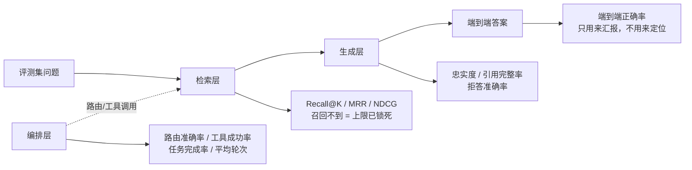
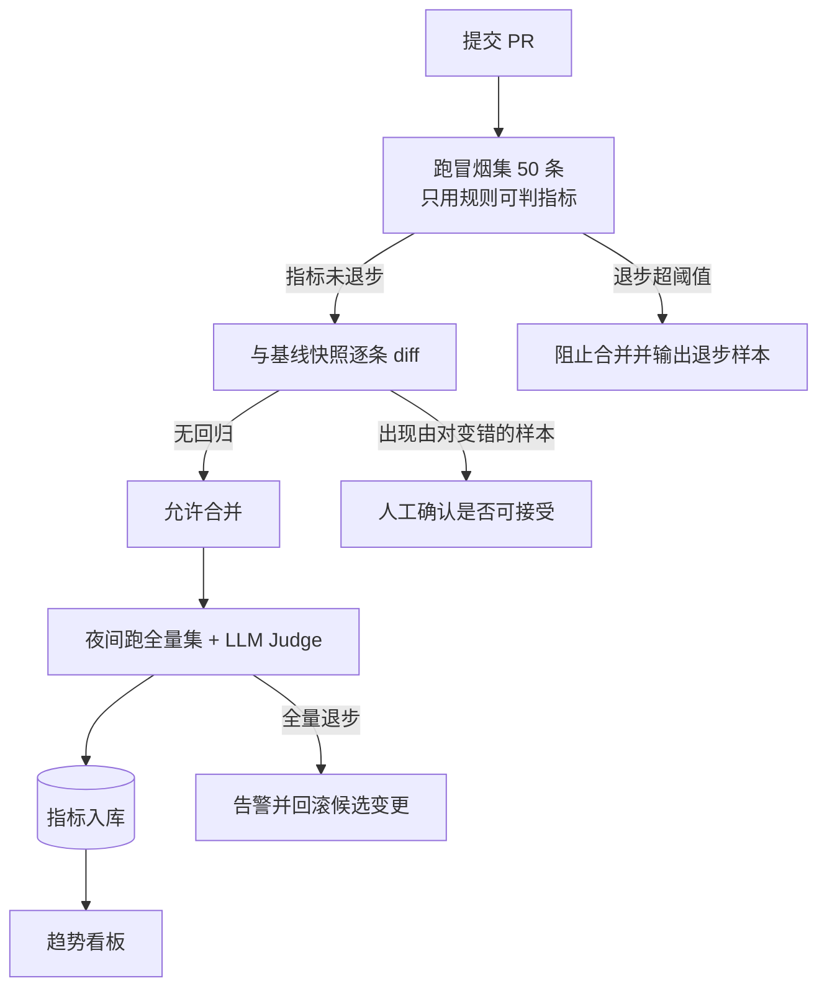

# Agent 与 RAG 的评测方法

> 大多数 AI 应用项目卡住的地方不是写不出功能，而是**说不清效果**。Prompt 改了一版，感觉好像好一点；换了个 embedding 模型，感觉好像差一点。感觉不是工程。这篇讲怎么把"感觉"变成可复现的数字。

## 没有评测集，调 Prompt 就是赌博

三种最常见的自欺欺人：

| 做法 | 为什么不成立 |
|---|---|
| 手工试三五条问题看输出 | 样本太少，模型输出本身有随机性，同一条问题跑两次结论可能相反 |
| 看着顺眼就发版 | 你只会检查自己想到的情况，恰好是模型最容易答对的那些 |
| 上线看用户有没有投诉 | 用户遇到错答案通常直接放弃，不会投诉；等有投诉时已经流失一批 |

有了评测集之后，工作方式变成：**改动 → 跑评测 → 看指标差异 → 决定是否合并**。这和后端改代码要跑单测是同一件事，只是断言从"精确相等"变成"指标不倒退"。

**踩坑：** 最坑的不是没有评测，而是**有评测但口径说不清**。见过的典型情况是团队报"准确率 92%"，追问下去发现：样本是开发自己写的 20 条、标准答案也是开发自己定的、判定标准是"看起来对"。这种数字没法用来做决策，也过不了面试追问。

面试里"你怎么知道效果好"是必问题。答"用户反馈还不错"基本等于承认没做过评测；能答出**分层指标 + 评测集口径 + 回归门禁**的候选人，在同一批人里会明显靠前。

---

## 评测集怎么建

不要等到"完美"再开始。**几十条真实问题的评测集，价值远超一个不存在的完美评测集。**

### 从真实问题采样，不要自己编

自己编的问题会不自觉地贴着系统能力写，评出来的分虚高。真实问题的来源按优先级：

| 来源 | 拿到什么 | 注意 |
|---|---|---|
| 线上真实提问日志 | 最真实的分布和表达方式 | 必须脱敏；口语化、错别字、半句话都要保留，别顺手改通顺 |
| 客服/运营工单 | 用户真正卡住的地方 | 往往集中在长尾，注意别让评测集全是难题 |
| 业务方访谈 | 上线后会被问但日志里还没有的问题 | 让业务方口述，不要给他们模板填 |
| 已知 badcase | 修复验证 | 单独打标签，控制在总量的 20% 到 30% |

### 覆盖度按三个维度分层

随机抽 100 条，大概率抽到 80 条同类简单问题。评测集要**刻意分层**，每层都要有足够样本，否则总分掩盖了局部退化。

| 维度 | 分层 | 建议占比 |
|---|---|---|
| 查询类型 | 事实查询 / 多跳推理 / 汇总归纳 / 对比分析 / 操作类 / 闲聊 / 超出范围 | 事实 40%，其余按业务分布 |
| 难度 | 简单（单文档单句可答）/ 中等（需要跨段落整合）/ 困难（需多文档或多跳） | 5 : 3 : 2 |
| 业务模块 | 按知识库主题域或业务线切 | 与线上流量分布对齐 |
| 特殊样本 | 应拒答（知识库里没有）/ 有歧义需澄清 / 敏感内容 | 各 5% 到 10% 必须有 |

**踩坑：** "应拒答"样本最容易被漏掉，而它恰恰是最能暴露问题的一层。只有正常问题的评测集，会让你把系统调成"什么都敢答"，上线后幻觉集中爆发。每次评测都要同时看**答对率**和**误拒率**。

### 多少条才够

| 规模 | 能做什么 | 不能做什么 |
|---|---|---|
| 20-30 条 | 冒烟测试，抓明显退化 | 比较两个接近的方案 |
| 50-100 条 | 单指标差异 5 个点以上可信 | 分层看每层只剩几条，层内结论不可信 |
| 200-500 条 | 分层结论可信，能做 A/B 决策 | 检测 1 个点以内的差异 |
| 1000 条以上 | 精细调参、模型选型 | 标注成本高，通常只在核心场景做到这个量级 |

先做 50 条能跑通全流程的，比攒半年 1000 条更有价值。**评测流程本身跑通了，扩样本只是时间问题。**

::: tip 指标差异多大才算真的变好
样本量 100 条时，一个指标的随机波动就有 3 到 5 个点。所以"Recall@5 从 78% 到 80%"在 100 条评测集上说明不了任何事。要么扩样本，要么固定随机种子并多跑几轮取均值和标准差，把波动范围一起报出来。
:::

### 标注规范、标注人和一致性

标注规范要写成文档，落到字段上。一条 RAG 评测样本长这样：

```json
{
  "id": "kb-0137",
  "question": "试用期离职需要提前多久提出",
  "category": "fact",
  "difficulty": "easy",
  "module": "hr_policy",
  "expected_answer": "试用期内提前 3 日以书面形式提出即可",
  "must_include": ["3 日", "书面"],
  "must_not_include": ["30 日"],
  "gold_docs": ["doc_hr_012"],
  "gold_evidence": "试用期内提前三日通知用人单位，可以解除劳动合同",
  "should_refuse": false,
  "annotator": "annotator_a",
  "reviewed_by": "annotator_b",
  "created_at": "2026-08-11",
  "source": "online_log"
}
```

几个字段的用意：`must_include` / `must_not_include` 让一部分判定不依赖模型（关键数字、关键条件必须出现），`gold_evidence` 存原文句子而不是 chunk id（下一节会讲为什么），`source` 区分线上回流和人工构造，方便按来源看分布。

**谁来标：** 必须是懂业务的人，不能是开发。开发标注的隐性偏差是"知道系统怎么实现的，倾向于标成系统能答对的样子"。可行做法是业务方标准答案 + 开发标注技术字段（`gold_docs`、`category`）。

**一致性怎么保证：** 抽 10% 到 20% 做双人独立标注，算一致率。不一致的条目集中过一遍，通常暴露的是规范本身有歧义（比如"部分正确"算不算对），改规范后重标。**一致率低于 80% 时，先修规范再继续标**，否则后面标的全是废数据。

### 评测集必须版本化

评测集是代码资产，进 Git，跟索引和 Prompt 一起打版本：

```txt
eval/
├── datasets/
│   ├── kb_qa_v3.jsonl          # 主评测集，一行一条样本
│   ├── kb_qa_smoke.jsonl       # 50 条子集，PR 上跑
│   └── text2sql_v2.jsonl
├── golden/                     # 上一次基线的逐条结果，用于快照对比
│   └── kb_qa_v3_baseline.json
├── runners/
│   ├── run_rag_eval.py
│   └── metrics.py
└── reports/                    # 每次运行的报告，CI 里作为构件上传
```

**踩坑：** 评测集改了但没升版本，是最难查的问题之一。指标从 82% 掉到 76%，你以为是代码退化，其实是有人往评测集加了 20 条难题。**每次修改评测集都要升版本号，报告里必须带上评测集版本。**

---

## 分层评测：只看端到端等于没测

"端到端准确率 68%" 这个数字唯一的作用是让你知道系统不够好，它不告诉你该改什么。同样的 68%，可能是检索没召回，也可能是召回了但生成时没用上，也可能是路由把问题发给了错误的工具。



定位逻辑很简单，从上游往下游查：

| 现象 | 检索层 | 生成层 | 结论 |
|---|---|---|---|
| 答错 | Recall@5 低 | — | 检索问题：切分、embedding、混合检索、rerank |
| 答错 | Recall@5 高 | 忠实度低 | 生成问题：Prompt 约束不够，或上下文太长被淹没 |
| 答错 | Recall@5 高 | 忠实度高 | 证据不足或问题需要多跳，考虑查询改写、多轮检索 |
| 该拒没拒 | Recall 低但有结果 | 忠实度高 | 相似度阈值太低，把弱相关内容当证据了 |

**生产推荐：** 每次评测都同时输出三层指标。只报端到端的报告，评审时一定会被问"那到底是哪一层的问题"，而你答不上来。检索层与生成层的具体优化手段见 [RAG 检索优化](./rag-retrieval) 和 [RAG 答案生成与引用](./rag-citation)。

---

## 检索层指标

检索层是**上限指标**：Top-K 里根本没有正确证据时，后面无论怎么调 Prompt 都救不回来。所以优化 RAG 的第一件事永远是把召回打上去。

| 指标 | 定义 | 计算 | 什么时候用它 |
|---|---|---|---|
| Recall@K | 前 K 个结果覆盖了多少比例的相关文档 | 命中相关数 / 全部相关数 | **RAG 的首要指标**，尤其是答案需要多篇文档拼起来时 |
| Precision@K | 前 K 个结果里相关的比例 | 命中相关数 / K | 上下文预算紧、要控噪声和 token 成本时 |
| Hit Rate@K | 至少命中一条相关文档的问题占比 | 命中问题数 / 总问题数 | 单一答案型场景（FAQ、单条政策） |
| MRR | 第一个相关结果排名的倒数均值 | 平均 1/rank | 只需要一个正确答案，且关心它排得够不够前 |
| NDCG@K | 带位置折损的增益，再用理想排序归一化 | DCG@K / IDCG@K | 相关性分等级（强相关/弱相关/无关）时 |
| MAP | 各命中位置上 Precision 的平均 | 平均 AP | 多相关文档且关心整体排序质量 |

**适用场景：** 知识库问答起步只看 Recall@K 和 MRR 两个就够；引入 rerank 之后再加 NDCG@K，因为 rerank 优化的正是排序质量，Recall 可能不动而 NDCG 明显提升。

```python
import math


def recall_at_k(retrieved: list[str], gold: set[str], k: int) -> float:
    """gold 为空时该样本不参与 Recall 统计，不要当成 0 分拉低均值"""
    if not gold:
        return float("nan")
    return len(set(retrieved[:k]) & gold) / len(gold)


def precision_at_k(retrieved: list[str], gold: set[str], k: int) -> float:
    return len(set(retrieved[:k]) & gold) / k if k else 0.0


def hit_rate_at_k(retrieved: list[str], gold: set[str], k: int) -> float:
    return 1.0 if set(retrieved[:k]) & gold else 0.0


def mrr(retrieved: list[str], gold: set[str]) -> float:
    for rank, doc in enumerate(retrieved, start=1):
        if doc in gold:
            return 1.0 / rank        # 只看第一个命中，后面的不影响
    return 0.0


def ndcg_at_k(retrieved: list[str], grades: dict[str, int], k: int) -> float:
    """grades: 文档 → 相关性等级（2 强相关 / 1 弱相关 / 0 无关）"""
    dcg = sum(grades.get(d, 0) / math.log2(i + 2) for i, d in enumerate(retrieved[:k]))
    ideal = sorted(grades.values(), reverse=True)[:k]
    idcg = sum(g / math.log2(i + 2) for i, g in enumerate(ideal))
    return dcg / idcg if idcg else 0.0
```

### ground truth 标到 chunk 还是标到文档

这是检索评测里最实际的一个选择，两种口径算出来的 Recall 不是一回事：

| 口径 | 标注成本 | 稳定性 | 问题 |
|---|---|---|---|
| 文档级（标 `doc_id`） | 低，标注人只需指出"答案在哪篇文档" | 高：改 chunk 大小、换切分策略都不用重标 | 粒度粗，一篇长文档里检索到无关段落也算命中 |
| chunk 级（标 `chunk_id`） | 高，要在切分结果里逐个挑 | **极差：重建索引后 chunk id 全变，评测集当场失效** | 只适合短期内调切分参数 |

**生产推荐：** 标**文档 id + 证据原文句子**（上面样本里的 `gold_docs` 和 `gold_evidence`）。评测时用证据句去匹配当前的 chunk，动态算出 chunk 级 ground truth——切分策略变了自动重算，评测集不用动。

```python
def resolve_gold_chunks(sample: dict, chunks: list[dict]) -> set[str]:
    """用证据原文反查当前索引下的 chunk id，让评测集不受切分策略影响"""
    evidence = normalize(sample["gold_evidence"])         # 去空白、统一全半角和标点
    hits = {c["id"] for c in chunks
            if c["doc_id"] in sample["gold_docs"] and evidence[:30] in normalize(c["text"])}
    if not hits:
        # 证据句被切分切断了，退回文档级口径，并记录下来提示切分策略有问题
        return {c["id"] for c in chunks if c["doc_id"] in sample["gold_docs"]}
    return hits
```

**踩坑：** 文档级和 chunk 级两个口径的数字通常差 10 个点以上，文档级明显更高。所以报 Recall@5 必须说明是哪种口径，否则跟别人的数字对比毫无意义——这也是面试里追问的常见切入点。

---

## 生成层指标

检索对了不等于答对。生成层要回答四个问题：**有没有瞎编、答没答到点上、引用能不能查、该不该拒答。**

| 指标 | 定义 | 怎么算 | 目标 |
|---|---|---|---|
| 忠实度 Faithfulness | 答案中的事实性陈述是否都能被检索到的证据支持 | 把答案拆成原子陈述，逐条判断能否被证据推出，得分 = 被支持数 / 总数 | 越接近 1 越好，低于 0.9 就有幻觉风险 |
| 答案相关性 | 答案是否回答了用户实际问的问题 | judge 打分，或反向由答案生成问题再算与原问题相似度 | 低说明答偏了或答得太笼统 |
| 引用完整率 | 含事实陈述的句子里带了有效引用的比例 | 有引用句数 / 应有引用句数 | 强合规场景要求接近 1 |
| 引用有效率 | 引用指向的 chunk 是否真的包含该陈述 | 抽样人工或 judge 校验 | 引用错位比没有引用更糟 |
| 拒答召回率 | 该拒的问题里真的拒了的比例 | TR / (TR + MR) | 与误拒率一起看 |
| 误拒率 | 能答的问题里被误拒的比例 | FR / (FR + 正常回答) | 越低越好 |

拒答这一对指标必须成对出现，因为**单看任何一个都能作弊**——全部拒答，拒答召回率就是 100%：

| | 应该拒答 | 应该回答 |
|---|---|---|
| 实际拒答了 | 正确拒答 TR | 误拒 FR（用户体验杀手） |
| 实际回答了 | 漏拒 MR（幻觉高发） | 正常回答 |

忠实度的实现思路是"拆句 + 逐条核对"，不要让模型对整段答案给一个笼统的分：

```python
async def faithfulness(answer: str, evidences: list[str]) -> float:
    """把答案拆成原子陈述后逐条判断，比整段打分稳定得多"""
    claims = await extract_claims(answer)          # 让模型输出陈述列表，一句一条
    if not claims:
        return float("nan")                        # 纯寒暄或纯拒答，不计入忠实度
    ctx = "\n".join(f"[{i+1}] {e}" for i, e in enumerate(evidences))
    supported = 0
    for c in claims:
        verdict = await judge.ainvoke(CLAIM_PROMPT.format(claim=c, context=ctx))
        # 只接受三态之一，避免模型输出模糊表述；unclear 一律记为未支持
        if verdict.label == "supported":
            supported += 1
    return supported / len(claims)
```

**踩坑：** 忠实度只衡量"答案是否忠于证据"，**不衡量答案是否正确**。证据本身是过期文档时，忠实度 1.0 但答案是错的。所以忠实度必须和端到端正确率一起看，而知识库的时效性要在数据管道层解决。

---

## 编排层指标

多节点、多工具的 Agent 还有一层要测：**流程本身有没有走对**。这层指标全部来自埋点，不需要模型判定，是最便宜也最容易被忽略的一层。

| 指标 | 定义 | 异常时说明什么 |
|---|---|---|
| 意图路由准确率 | 路由到正确分支的比例，按类别出混淆矩阵 | 只看总准确率会掩盖小类别全错；小类样本少，要单独看每类召回 |
| 工具调用成功率 | 成功返回 / 总调用，按工具分别统计 | 某个工具偏低，通常是它的描述或参数 schema 写得不清楚 |
| 参数校验失败率 | Pydantic 校验失败 / 总调用 | 直接反映工具入参描述质量，见 [工具调用与函数执行](./agent-tool-calling) |
| 任务完成率 | 达成用户目标的会话 / 总会话 | 端到端体验的核心指标，需要人工或 judge 判定 |
| 平均轮次 | 完成任务用掉的模型调用轮数 | 突然上涨说明模型在打转，往往是工具返回信息不足 |
| 循环中断率 | 触发最大轮次上限的比例 | 大于 2% 就要查是哪类问题在死循环 |
| 转人工率 | 转人工会话 / 总会话 | 客服类业务的核心指标，也是最容易向业务方解释的一个 |
| 澄清率 | 触发反问的比例 | 太高说明元数据或工具描述不足，用户会觉得啰嗦 |

路由准确率一定要出混淆矩阵，而不是只报一个总分：

```python
from collections import Counter


def routing_report(samples: list[dict]) -> dict:
    """按类别统计，找出"哪类被误判成了哪类"，这才是能指导改 Prompt 的信息"""
    confusion: Counter = Counter()
    per_class: dict[str, list[int]] = {}
    for s in samples:
        gold, pred = s["gold_intent"], s["pred_intent"]
        confusion[(gold, pred)] += 1
        per_class.setdefault(gold, []).append(1 if gold == pred else 0)
    recall = {k: sum(v) / len(v) for k, v in per_class.items()}
    overall = sum(sum(v) for v in per_class.values()) / sum(len(v) for v in per_class.values())
    return {"overall": overall, "recall_per_class": recall,
            "top_confusions": confusion.most_common(10)}
```

**生产推荐：** 每个节点入口出口都打结构化日志（会话 id、节点名、耗时、token、成功失败、错误类型）。编排层指标全都能从这份日志离线算出来，不需要额外的评测基建。多 Agent 场景下还要额外记录子 Agent 的委派链路，见 [多 Agent 协作](./agent-multi-agent)。

---

## Text2SQL 指标：为什么只有执行准确率算数

| 指标 | 定义 | 评价 |
|---|---|---|
| 执行准确率 EX | 生成 SQL 与标准 SQL 在同一份数据上执行，结果集一致的比例 | **主指标**，唯一和业务正确性直接挂钩的 |
| 精确匹配率 EM | SQL 文本（或规范化后的 AST）完全相同的比例 | 只能当辅助观测，数值必然远低于 EX |
| Schema Linking 召回率 | 标准 SQL 用到的表和字段被候选集覆盖的比例 | 上限指标，召回不到就一定生成错 |
| 校验拦截率 / 误拦率 | 被安全校验拦下的比例 / 其中本来正确的比例 | 拦截率高说明生成质量差；误拦率高说明规则过严 |

EM 不可用的原因很直接：同一个语义有无数种写法。`SUM(pay_amount)` 和 `SUM(o.pay_amount)`、有无表别名、`>=` 与 `BETWEEN`、子查询与 `JOIN`，文本都不同而结果一致。反过来 `>=` 写成 `>` 时文本几乎一样，结果却错了。**文本相似度和语义正确性没有稳定关系。**

```python
def result_set_equal(a: list[dict], b: list[dict], ordered: bool, tol: float = 1e-6) -> bool:
    """结果集比对：列名不参与比较，无 ORDER BY 时行序不敏感，浮点按容差比"""
    if len(a) != len(b):
        return False

    def norm(rows: list[dict]) -> list[tuple]:
        out = []
        for r in rows:
            # 只按列顺序取值，避免生成 SQL 的别名与标准答案不同导致误判
            out.append(tuple(round(v, 6) if isinstance(v, float) else v for v in r.values()))
        return out if ordered else sorted(out, key=lambda t: tuple(map(str, t)))

    for ra, rb in zip(norm(a), norm(b)):
        for va, vb in zip(ra, rb):
            if isinstance(va, float) and isinstance(vb, float):
                if abs(va - vb) > tol:
                    return False
            elif va != vb:
                return False
    return True
```

**踩坑：** EX 依赖测试数据。空表上任何 SQL 都返回空结果集，EX 会虚高到接近 100%。测试库必须准备**能区分对错的数据**：每个评测问题的标准答案结果集不能为空，也不能所有问题都返回相同结果。这份测试数据本身也要版本化。Text2SQL 链路的实现见 [Text2SQL：Schema Linking 与安全链路](./agent-text2sql)。

---

## LLM-as-Judge：能用，但必须先校准

有些判定没法用字符串匹配：答案质量、忠实度、任务是否完成、拒答是否得体。这时用另一个模型当评委是目前性价比最高的方案——但它是**有系统性偏差的测量工具**，用之前必须先量出偏差有多大。

评分 Prompt 的四个要点：给出可判别的档位定义、要求先写理由再给分、给示例、只输出结构化 JSON。

```python
JUDGE_PROMPT = """你是答案质量评审。根据提供的证据评估答案，先写理由再给分。

评分标准（1-5 分）：
5 = 完全正确，所有事实都能在证据中找到，没有多余推测
4 = 正确但表述不够完整，或包含一处无关但无害的补充
3 = 部分正确，关键信息缺失或有一处轻微事实偏差
2 = 大部分错误，或包含证据中不存在的关键事实
1 = 完全错误，或答非所问

问题：{question}
证据：{evidence}
待评答案：{answer}

先输出 reason（不超过 60 字，指出具体哪句话有问题），再输出 score（1-5 整数）。
只输出 JSON，字段为 reason 和 score，不要输出其他内容。
"""


class JudgeVerdict(BaseModel):
    reason: str
    score: int = Field(ge=1, le=5)
```

已知偏差和对应做法：

| 偏差 | 表现 | 缓解 |
|---|---|---|
| 位置偏见 | 成对比较时偏好排在前面的那个 | 交换 A/B 顺序各跑一次，两次结论不一致的记为平局 |
| 长度偏见 | 更长、更详细的答案得分偏高，哪怕含错误 | 限制答案长度差，或在标准里明确"冗长扣分" |
| 自我偏好 | 偏好与自己同族模型生成的输出 | judge 用与被测系统不同厂商的模型 |
| 宽松偏见 | 分数普遍集中在 4-5，区分度差 | 档位定义写得可判别；必要时改成成对比较 |
| 格式偏见 | 带 Markdown 列表的答案得分偏高 | 评分前统一去格式，只保留纯文本 |

### 用人工标注校准 judge 本身

**没校准过的 judge 分数不能当结论。** 校准流程：抽 100 条样本，人工按同一份标准打分，再算 judge 与人工的一致性。

| 一致性指标 | 用途 | 参考阈值 |
|---|---|---|
| 精确一致率 | 分数完全相同的比例 | 5 档评分下 60% 以上算可用 |
| 相邻一致率 | 分差不超过 1 分的比例 | 应在 90% 以上 |
| Cohen's kappa | 排除随机一致后的一致程度 | 0.6 以上较好；低于 0.4 只能看趋势不能看绝对值 |
| Spearman 相关 | 排序一致性 | 做方案 A/B 对比时看这个就够 |

```python
async def calibrate(samples: list[dict]) -> dict:
    judged = [await judge_one(s) for s in samples]        # judge 打分
    human = [s["human_score"] for s in samples]           # 人工打分
    exact = sum(j == h for j, h in zip(judged, human)) / len(human)
    adjacent = sum(abs(j - h) <= 1 for j, h in zip(judged, human)) / len(human)
    bias = sum(j - h for j, h in zip(judged, human)) / len(human)   # 正数=judge 偏松
    return {"exact": exact, "adjacent": adjacent, "mean_bias": bias,
            "kappa": cohen_kappa(judged, human)}
```

`mean_bias` 是最实用的一个数：judge 系统性偏松 0.4 分时，你至少知道报出去的分要打个折，也知道跨版本对比仍然有效（偏差恒定时差值仍可比）。

**踩坑：** judge 也要花钱，而且是评测里最大的成本项。可行策略是**分层判定**：能用规则判的先用规则（`must_include`、`must_not_include`、拒答与否、SQL 结果集比对），剩下的才交给 judge；全量评测每天一次，PR 上只跑规则可判的冒烟集。judge 的模型和 Prompt 也要版本化，换了 judge 就意味着历史分数不可直接比较。

---

## 工程化：评测跑进 CI，指标退步就拦住合并

评测只有自动化了才会真的被执行。手动跑的评测，第三次改 Prompt 时就没人跑了。



### 评测脚本骨架

```python
import asyncio, json, time
from pathlib import Path

CONCURRENCY = 8          # 并发要限流，评测把模型网关打挂就本末倒置了


async def run_one(sample: dict, sem: asyncio.Semaphore) -> dict:
    async with sem:
        t0 = time.perf_counter()
        try:
            out = await pipeline.ainvoke({"question": sample["question"]})
            err = None
        except Exception as e:                       # 单条失败不能中断整轮评测
            out, err = {}, repr(e)[:200]
        return {"id": sample["id"], "latency_ms": int((time.perf_counter() - t0) * 1000),
                "answer": out.get("answer", ""), "retrieved": out.get("retrieved", []),
                "refused": out.get("refused", False), "tokens": out.get("tokens", 0),
                "error": err}


async def main(dataset: Path, baseline: Path | None, out_dir: Path) -> int:
    samples = [json.loads(l) for l in dataset.read_text().splitlines() if l.strip()]
    sem = asyncio.Semaphore(CONCURRENCY)
    results = await asyncio.gather(*(run_one(s, sem) for s in samples))

    metrics = compute_metrics(samples, results)       # 三层指标一次算完
    report = {"dataset": dataset.name, "dataset_version": read_version(dataset),
              "commit": git_sha(), "prompt_version": PROMPT_VERSION,
              "judge_model": JUDGE_MODEL, "metrics": metrics,
              "ran_at": time.strftime("%Y-%m-%dT%H:%M:%S")}
    (out_dir / "report.json").write_text(json.dumps(report, ensure_ascii=False, indent=2))
    (out_dir / "report.md").write_text(render_markdown(report, results))  # CI 里贴到 PR 评论

    if baseline is None:
        return 0
    regressions = diff_against_baseline(results, json.loads(baseline.read_text()))
    return 1 if gate_failed(metrics, baseline, regressions) else 0   # 非 0 退出码 = 拦住合并
```

### 门禁阈值怎么定

阈值不能拍脑袋，要基于**同一版本连续跑三次的波动范围**：门禁线设在波动范围之外，否则天天误报，一周后所有人都学会跳过门禁。

| 指标 | 门禁 | 动作 |
|---|---|---|
| Recall@5 | 下降超过 2 个点 | 阻止合并 |
| 忠实度 | 下降超过 3 个点 | 阻止合并 |
| Text2SQL 执行准确率 | 下降超过 2 个点 | 阻止合并 |
| 误拒率 | 上升超过 1 个点 | 阻止合并 |
| 校验误拦率 | 上升超过 1 个点 | 阻止合并 |
| P95 延迟 | 上升超过 20% | 告警，不阻止 |
| 单次会话 token 成本 | 上升超过 30% | 告警，不阻止 |
| 逐条快照 | 出现由对变错的样本 | 必须人工确认，即使总分没降 |

最后一条最有价值。**总分不变可能是"修好 3 条、弄坏 3 条"**，这种改动看总分完全无害，看逐条 diff 一眼就发现问题。所以每次运行都要把逐条结果存成快照：

```sql
CREATE TABLE eval_run (
  id              BIGINT UNSIGNED PRIMARY KEY AUTO_INCREMENT,
  dataset         VARCHAR(64)  NOT NULL,
  dataset_version VARCHAR(32)  NOT NULL COMMENT '评测集版本，缺了就无法跨期比较',
  commit_sha      VARCHAR(40)  NOT NULL,
  prompt_version  VARCHAR(32)  NOT NULL,
  judge_model     VARCHAR(64)           COMMENT '换 judge 后历史分数不可直接比',
  metrics         JSON         NOT NULL COMMENT '三层指标快照',
  sample_count    INT          NOT NULL,
  ran_at          DATETIME     NOT NULL,
  KEY idx_dataset_time (dataset, ran_at)
) ENGINE=InnoDB DEFAULT CHARSET=utf8mb4 COMMENT='评测运行记录，用于趋势图';
```

**生产推荐：** PR 只跑冒烟集（50 条、纯规则判定、两三分钟出结果），全量集加 LLM Judge 放夜间定时任务跑，用后台任务队列执行并把报告推到群里（[Worker 与异步任务](./background-worker)）。把 judge 放到 PR 流程里，等待时间和成本都会让人放弃使用它。

---

## 线上监控与离线评测的闭环

离线评测回答"改动有没有让系统变好"，线上监控回答"真实用户那里到底怎么样"。两者的分布永远不同，缺一个都不行。

| 线上指标 | 为什么看它 | 异常信号 |
|---|---|---|
| 拒答率 | 最灵敏的健康度指标 | 突然上升通常是索引出问题或阈值配置被改动 |
| 转人工率 | 业务方最认的指标 | 上升说明有一类新问题没覆盖 |
| 失败类型分布 | 定位问题 | 某类错误占比突增，直接指向具体节点 |
| P95 / P99 延迟 | 体验与超时 | 首字延迟比总延迟更影响体验，见 [流式输出与前端对接](./agent-streaming) |
| 单次会话 token 成本 | 成本可控性 | 上涨常见原因是上下文没裁剪或重试在打转 |
| 点踩率与重问率 | 用户视角的效果 | 同一用户换个说法重问，等于上一次没答好，这是最好的负样本来源 |

回流闭环的四步：**采集 → 人工确认 → 进评测集 → 回归验证。**

1. 线上把点踩、转人工、重问、校验失败的会话完整落库（问题、检索结果、答案、节点耗时）
2. 每周固定时间人工过一遍，确认是真 badcase 还是用户表达问题
3. 真 badcase 补上标准答案进评测集，`source` 标为 `online_log`，并归类到对应分层
4. 修复后跑评测确认这批样本转正，同时确认没有引入新的回归

::: warning 不要把线上 badcase 全灌进评测集
badcase 占比过高会让评测集分布严重偏离真实流量，指标变成"专挑难题的考试成绩"，而且你会开始为了难题过度调优，把简单问题做坏。**控制 badcase 在总量的 20% 到 30%**，其余保持按真实流量分布采样。每次扩充评测集都要升版本并记录扩充了什么。
:::

---

## 面试里怎么讲效果数据

任何一个指标，都必须能同时说清六件事，缺一个就会被追问到答不上来：

| 要素 | 要说什么 |
|---|---|
| 口径定义 | 这个指标怎么算的，分子分母分别是什么 |
| 样本量 | 多少条，分层怎么分的 |
| 采样方式 | 从哪来的，是否覆盖真实分布 |
| 标注方式 | 谁标的，一致率多少 |
| 基线 | 和什么比的，基线本身是什么配置 |
| 波动范围 | 同配置多跑几次的波动有多大 |

反面例子（几乎必然被追问到崩）：

> "我们的知识库问答准确率做到了 86%。"

追问一句"怎么算的"就答不上来了：86% 是端到端还是检索？多少条样本？谁标的？比什么基线？

正面例子：

> "我们建了 220 条评测集，从三个月线上提问日志里按查询类型分层采样，事实类 40%、多跳 20%、汇总 20%、应拒答 10%、歧义 10%，业务同学标标准答案和证据文档，20% 双标一致率 88%。
>
> 分三层看：检索层文档级 Recall@5 从 71% 提到 89%，主要来自向量加关键词的混合检索和 rerank；生成层忠实度（拆原子陈述后逐条核对，judge 与人工相邻一致率 93%）从 0.82 到 0.94；端到端正确率 68% 到 84%。同时误拒率控制在 3% 以内——只提召回不看误拒是不成立的，全拒答也能让拒答召回到 100%。
>
> 基线是最初的纯向量检索加基础 Prompt。这套评测跑在 CI 里，Recall 掉 2 个点或忠实度掉 3 个点就阻止合并；同配置连跑三次波动在 1.5 个点以内，所以门禁线设在 2 个点。"

第二个版本长一些，但**每个数字都能追下去**。面试官真正在评估的不是数字大小，而是你有没有建立可复现的度量能力。

**踩坑：** 千万不要编数字。面试官只要追问"那你们 Recall 是标到文档还是标到 chunk"、"judge 校准过吗"、"误拒率多少"，编的数据立刻露馅，而且比直接说"这块我们当时做得比较粗"糟糕得多。**做得粗但知道粗在哪、知道该怎么补，本身就是可以拿分的回答。**

---

## 面试高频问题

**1. 你怎么知道你的 RAG 系统效果好？**

- 先说分层：检索层（Recall@K、MRR）、生成层（忠实度、引用完整率、拒答准确率）、端到端正确率，端到端只用来汇报不用来定位
- 再说评测集口径：多少条、怎么采样分层、谁标注、一致率多少、有没有版本化
- 再说对比：和什么基线比、提升多少、同配置的波动范围是多少
- 最后说工程化：评测在 CI 里跑，指标退步超阈值阻止合并，逐条快照 diff 抓"修好几条又弄坏几条"

**2. Recall@K 和 Precision@K 分别在什么时候用？**

- Recall@K 是 RAG 的首要指标：Top-K 里没有正确证据，生成层无论怎么调都救不回来
- Precision@K 在上下文预算紧、噪声影响生成质量、token 成本敏感时才成为约束
- 只需要一个正确答案时用 MRR（关心它排第几）或 Hit Rate（关心有没有）
- 有相关性等级、或引入了 rerank 时用 NDCG@K，因为 rerank 优化的是排序而不是召回集合

**3. 检索的 ground truth 标到 chunk 还是文档？**

- 推荐标文档 id + 证据原文句子：标注成本低，且改切分策略后不用重标
- chunk 级 ground truth 在索引重建后 chunk id 全变，评测集直接失效
- 评测时用证据句反查当前 chunk，动态得到 chunk 级 ground truth
- 两种口径的 Recall 通常差 10 个点以上，报数字必须说明口径

**4. LLM-as-Judge 靠不靠得住？怎么用？**

- 只用在无法规则判定的地方：答案质量、忠实度、任务完成判定；能规则判的先用规则
- Prompt 要给可判别的档位定义、要求先理由后打分、只输出结构化 JSON
- 已知偏差：位置偏见（双向跑取平均）、长度偏见、自我偏好（换厂商模型做 judge）、宽松偏见、格式偏见
- **必须用人工标注抽样校准**：算精确一致率、相邻一致率、kappa 和平均偏置；kappa 低于 0.4 时只能看趋势不能报绝对值
- judge 模型和 Prompt 也要版本化，换了就意味着历史分数不可直接比较

**5. 忠实度怎么算？它等于答案正确吗？**

- 把答案拆成原子陈述，逐条判断能否由检索到的证据推出，得分 = 被支持数 / 总数
- 不要让模型对整段答案给一个笼统分数，拆句后判定稳定得多
- **忠实度不等于正确**：证据本身过期或错误时，忠实度可以是 1.0 而答案是错的
- 所以忠实度必须和端到端正确率一起看，知识时效性在数据管道层解决

**6. Text2SQL 为什么不能用 SQL 文本匹配算准确率？**

- 同一语义有无数种等价写法（别名、`BETWEEN` 与 `>=`、子查询与 JOIN），文本不同结果相同
- 反过来 `>=` 写成 `>` 文本几乎一样，语义已经错了
- 主指标用执行准确率 EX：同一份数据上比对结果集，忽略列名、无 `ORDER BY` 时忽略行序、浮点按容差
- EX 依赖测试数据质量：空表上 EX 会虚高到接近 100%，测试数据必须能区分对错，且要版本化

**7. 线上监控和离线评测的关系是什么？**

- 离线回答"改动有没有让系统变好"，线上回答"真实用户那里怎么样"，分布永远不同
- 线上重点看拒答率、转人工率、失败类型分布、P95 延迟、单会话 token 成本、点踩与重问率
- 闭环：线上负样本落库 → 每周人工确认 → 补标准答案进评测集 → 修复后回归验证
- 关键约束：badcase 占比控制在 20% 到 30%，否则评测集分布偏离真实流量，会为了难题把简单问题做坏

