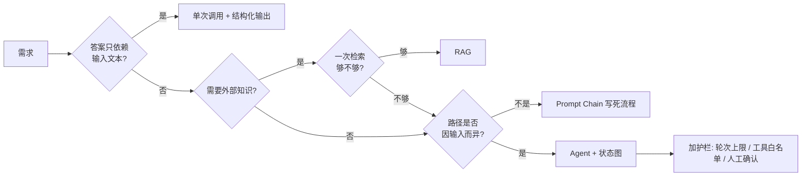
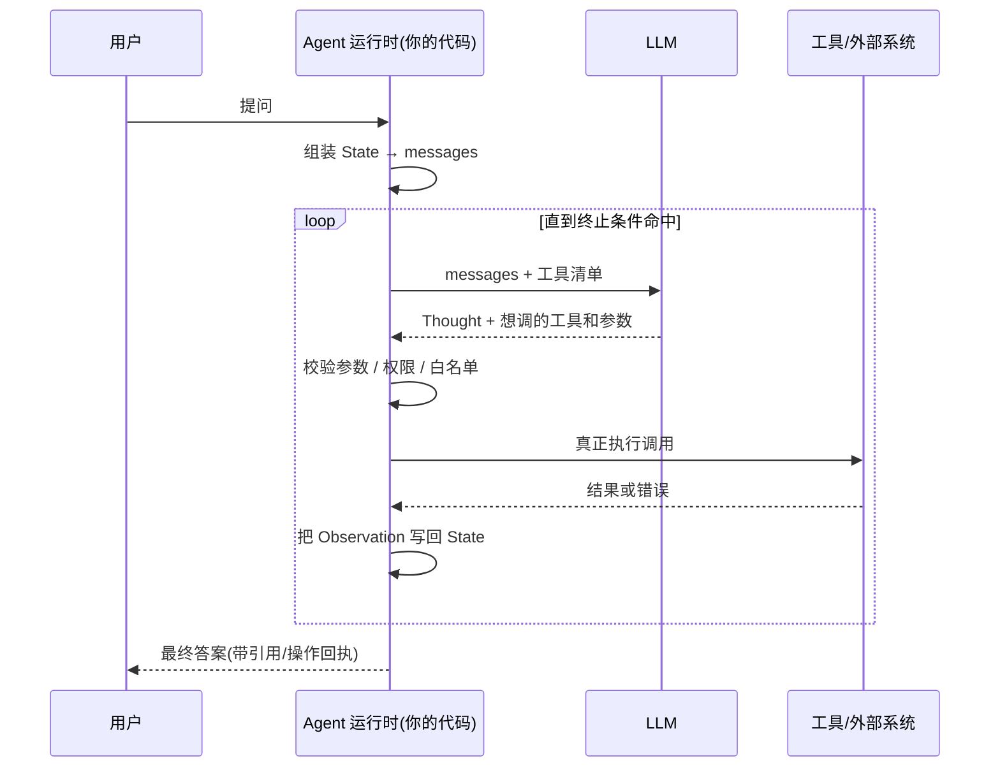
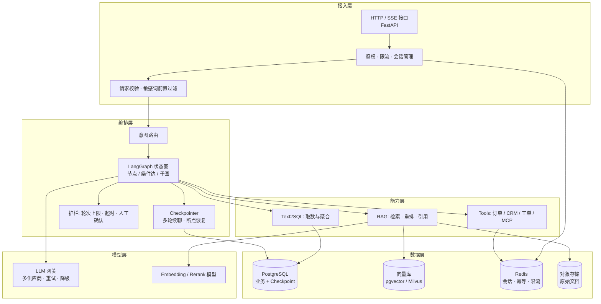

# Agent 工程总览

> "Agent" 这个词被用得太宽泛：有人把带 `while` 循环的脚本叫 Agent，也有人把一次 RAG 问答叫 Agent。这篇先把能力阶梯排清楚，再回答一个更值钱的问题——你手上这个需求，到底需不需要 Agent。

## 从 API 调用到 Agent：四级能力阶梯

如果你写过前端，可以这样类比这四级：直接调 API 像一次 `fetch`；Prompt Chain 像把几个 `fetch` 串成固定的 `then` 链；RAG 像在请求前先查一次数据库补齐上下文；Agent 则像把整个流程交给一个带状态的运行时，由它自己决定下一步调哪个接口、什么时候收工。

每上一级，能力更强，但**不确定性、延迟和排查成本同时上升**。工程上的判断标准从来不是"哪级更先进"，而是"最低哪一级能稳定解决问题"。

### 第 0 级：直接调用 LLM API

一问一答，没有外部数据，没有工具，无状态。

```python
# 输入 = 系统提示 + 用户问题，输出 = 一段文本，整个过程不依赖任何外部状态
resp = client.chat.completions.create(
    model="qwen-plus",
    messages=[
        {"role": "system", "content": "你是一个技术文档润色助手，只输出改写后的正文"},
        {"role": "user", "content": "把这段话改写得更简洁：……"},
    ],
    temperature=0.3,
    timeout=30,          # 必须显式给超时，SDK 默认值通常远大于你的网关容忍度
)
print(resp.choices[0].message.content)
```

**适用场景：** 润色、翻译、分类、摘要——所有"答案只依赖输入文本本身"的任务。

**代价：** 几乎为零。一次网络请求，延迟可控，成本可预估，出错只有一个点。

### 第 1 级：Prompt Chain（固定流水线）

把任务拆成几步，**每一步的顺序由代码写死**，模型只在每步内部做一件小事。

```python
async def summarize_ticket(raw_text: str) -> dict:
    """工单摘要：清洗 → 抽要素 → 生成摘要。三步顺序固定，模型不参与流程决策"""
    cleaned = strip_signature(raw_text)                    # 第 1 步：纯代码，去签名和引用历史
    fields = await extract_fields(cleaned)                  # 第 2 步：LLM 抽结构化字段
    summary = await write_summary(cleaned, fields)          # 第 3 步：LLM 写摘要
    return {"fields": fields, "summary": summary}           # 流程图在代码里，一眼能读完
```

**适用场景：** 流程本身是确定的，只是每一环需要语言理解能力。绝大多数"AI 功能"都属于这一级。

**代价：** 多了几次模型调用，延迟叠加；需要处理中间步骤失败。但**流程可读、可测试、可复现**——出问题时你知道是第几步坏了。

### 第 2 级：RAG（检索增强生成）

在生成之前先去外部知识里找证据，把证据拼进提示词。它解决的是"模型不知道你公司的事"这个问题。

```python
async def answer_with_rag(question: str) -> str:
    """一次检索、一次生成，没有循环，所以行为是可预测的"""
    docs = await retriever.asearch(question, top_k=5)        # 向量 + 关键词混合检索
    context = "\n\n".join(f"[{i}] {d.text}" for i, d in enumerate(docs, 1))
    prompt = f"只依据下列资料回答，无法回答就说不知道，并标注引用编号。\n\n{context}\n\n问题：{question}"
    return await llm.ainvoke(prompt)
```

**适用场景：** 知识问答、文档助手、政策查询。问题能被"一次检索"覆盖。

**代价：** 引入了检索链路（切分、向量化、索引、重排），排查面从"模型答错"变成"检索没召回 / 重排排错 / 提示词丢了证据"。检索质量的工程细节见 [RAG 检索与重排](./rag-retrieval)。

### 第 3 级：Agent（模型参与流程决策）

关键分界线在这里：**流程不再写死，下一步做什么由模型在运行时决定**。

```python
# 同一个 Agent，面对不同问题会走出完全不同的调用序列：
# "订单 A1001 到哪了" → get_order → 回答
# "我买的生鲜能退吗，订单 A1001"→ search_policy → get_order → 判断 → 回答
# "帮我把这单退掉"        → get_order → check_refund_rule → 需要确认 → 转人工
```

**适用场景：** 请求需要多步、且步数与路径**因输入而异**；需要调用多个系统并根据中间结果改变策略。

**代价：** 最高。不确定的调用次数（成本和延迟都不可预估）、不确定的失败模式、难以写断言的测试。加上循环，一个 bug 可能表现为"偶发地多花 20 秒和 10 倍 token"。

### 四级对照表

| 级别 | 流程由谁决定 | 典型延迟 | 可复现性 | 排查难度 | 什么时候选它 |
|---|---|---|---|---|---|
| 直接调 API | 代码 | 1 次调用 | 高 | 低 | 任务只依赖输入文本 |
| Prompt Chain | 代码 | N 次调用（固定） | 高 | 低 | 流程确定，每步需要语言能力 |
| RAG | 代码 | 检索 + 1 次生成 | 中 | 中 | 需要外部知识，一次检索能覆盖 |
| Agent | 模型 | 不确定 | 低 | 高 | 路径因输入而异，需多工具协作 |

::: tip 工程直觉
把"模型是否参与流程决策"当成分界线，比数"有没有 while 循环"靠谱。写死顺序的多步调用不是 Agent，它只是流水线——这是好事，流水线更容易上线。
:::

---

## 什么时候不该上 Agent

这一节是反过来说的，但它比任何"Agent 十大优势"都更有用。

**核心判断：能用确定性代码或一次 RAG 解决的需求，上 Agent 是净亏损。** 你付出了不可预估的成本和延迟，换来的只是"看起来很智能"。

### 三个应该退回上一级的信号

**信号一：你能画出完整流程图，并且分支不超过三个。**
能画出来就说明流程是确定的，那它就该写在代码里。用条件判断表达"如果订单未发货则可退"，比让模型在运行时"推理"出这条规则可靠一万倍——规则会变，但它变的时候你改的是一行代码和一个单元测试，不是提示词加祈祷。

**信号二：Agent 每次都走同一条路径。**
上线后把调用序列打点统计，如果 90% 的会话都是 `retrieve → generate`，那这个 Agent 的本质就是一次 RAG，循环只是在浪费钱。

**信号三：任务对错误零容忍。**
转账、开票、批量删除、对外发消息。这类操作可以让模型**提议**，但绝不能让模型**独自决定并执行**。见 [工具安全分级](./agent-tool-calling#工具安全分级)。

### 常见需求的正确落点

| 需求 | 很多人的做法 | 更该用的方案 | 原因 |
|---|---|---|---|
| 从合同里抽取 12 个字段 | Agent 带工具反复读 | 一次调用 + 结构化输出 | 字段固定，无需决策 |
| 查内部制度、政策问答 | Agent 自主检索 | 一次 RAG + 引用标注 | 一次检索足够覆盖 |
| 用户改密码 / 改地址 | Agent 调写接口 | 表单 + 后端校验 | 确定性操作，别引入不确定性 |
| 报表数值计算 | 让模型算 | SQL / 代码算 | 模型不做算术，只做取数意图理解 |
| 数据看板自然语言查询 | 让模型直接吐数字 | Text2SQL + 数据库执行 | 见 [Text2SQL 工程实践](./agent-text2sql) |
| 客服会话（查单+政策+工单） | Prompt 里塞所有分支 | Agent（这个确实该上） | 路径因输入而异，需多系统协作 |

### 一个更务实的演进路径



**生产推荐：** 先用 Prompt Chain 或 RAG 上线拿到真实数据，把高频路径固化成确定性代码，只对**剩下那部分真正需要动态决策的长尾**开 Agent。反过来（先做通用 Agent 再收敛）几乎必然经历一轮成本失控。

---

## Agent 的最小构成

剥掉所有框架，一个 Agent 只有五个零件。任何框架（LangGraph、Agno、自研）都只是在这五件事上加语法糖。

| 零件 | 作用 | 前端类比 | 没有它会怎样 |
|---|---|---|---|
| LLM | 决策器：读状态，产出下一步动作 | 事件处理函数 | 只剩固定流水线 |
| 工具（Tools） | 与外部世界交互的唯一出口 | 可调用的 API 层 | 只能空谈，无法查数据、无法落库 |
| 状态（State） | 承载历史、中间结果、计数器 | Redux store | 每轮都失忆，无法多步推理 |
| 循环（Loop） | 把"决策 → 执行 → 观测"反复跑 | 事件循环 | 只能做一步，不能纠错 |
| 终止条件 | 决定什么时候停 | 循环出口 / 超时 | 死循环烧钱，这是线上最常见事故 |

::: warning 终止条件是五个零件里最容易被忽略的
真实 Agent 至少需要三重出口同时存在：模型主动给出最终答案、硬性轮次上限、整体墙钟超时。只依赖模型自己说"我答完了"，遇到工具连续报错时它会一直重试到你的账单变红。
:::

### 一轮循环内部发生了什么



注意图里"真正执行调用"这一步在 `A`（你的代码）里，不在 `M` 里。这是整个 Agent 工程最重要的一条认知，详见 [Tool Calling 协议真相](./agent-tool-calling)。

---

## ReAct 范式：Thought → Action → Observation

ReAct 的全部思想只有一句话：**让模型把"想法"和"动作"分开输出，把动作的结果再喂回去，让它基于新事实继续想。**

- **Thought（思考）**：模型解释自己打算干什么、为什么。这段文本不执行，但它显著提升后续动作的正确率，也是你排查时最有用的日志。
- **Action（动作）**：结构化的工具名 + 参数。这是唯一会被执行的部分。
- **Observation（观测）**：工具返回的真实结果，由你的代码写回对话历史。

一个健康的 ReAct 轨迹长这样：

```txt
Thought: 用户问生鲜能不能退，我需要先查退换货政策，再看这单的商品类目
Action: search_policy("生鲜 退货")
Observation: 命中 2 条：7 天无理由退货；生鲜类不支持无理由退货
Thought: 政策明确不支持，但要确认该订单是否生鲜类
Action: get_order("A1001")
Observation: {"status":"已发货","category":"生鲜","eta":"2026-09-05"}
Thought: 类目为生鲜，按政策不支持无理由退货，给出结论和替代方案
Final Answer: 这单商品属于生鲜类，按平台政策不支持 7 天无理由退货……
```

### 不依赖框架，手写一个极简 ReAct 循环

下面这段代码可以直接跑（换成你的网关地址和模型名），它把五个零件都占齐了。看完这 40 行，再去看 LangGraph 会轻松很多。

```python
import json
from openai import OpenAI

client = OpenAI(base_url="https://your-gateway/v1", api_key="sk-***")

# ---- 零件二：工具表。Agent 能做的一切动作都在这里，模型只能"点菜"，做菜归代码 ----
ORDERS = {"A1001": {"status": "已发货", "category": "生鲜", "eta": "2026-09-05"}}

def search_policy(query: str) -> str:          # 只读工具：查政策库
    return "命中 2 条：7 天无理由退货；生鲜类不支持无理由退货"

def get_order(order_id: str) -> str:           # 只读工具：查订单
    order = ORDERS.get(order_id)
    return json.dumps(order, ensure_ascii=False) if order else "订单不存在"

TOOLS = {"search_policy": search_policy, "get_order": get_order}

SYSTEM = """你是电商客服助手。每轮只输出一个 JSON 对象，二选一：
{"thought": "推理过程", "action": "工具名", "action_input": "参数字符串"}
{"thought": "推理过程", "final_answer": "给用户的最终回答"}
可用工具：search_policy(查退换货政策)、get_order(按订单号查状态和类目)"""

def react(question: str, max_steps: int = 5) -> str:
    # ---- 零件三：状态。这里用最朴素的 messages 列表承载全部历史 ----
    messages = [{"role": "system", "content": SYSTEM},
                {"role": "user", "content": question}]

    for step in range(max_steps):              # ---- 零件四+五：循环 + 硬性轮次上限 ----
        resp = client.chat.completions.create(
            model="qwen-plus", messages=messages, temperature=0, timeout=30,
            response_format={"type": "json_object"},   # 强制 JSON，省掉脆弱的正则解析
        )
        raw = resp.choices[0].message.content
        messages.append({"role": "assistant", "content": raw})
        try:
            data = json.loads(raw)
        except json.JSONDecodeError:           # 输出不合法：把错误喂回去让它自己修
            messages.append({"role": "user", "content": "输出不是合法 JSON，请重新输出"})
            continue

        if "final_answer" in data:             # 出口一：模型认为信息已足够
            return data["final_answer"]

        name, arg = data.get("action"), data.get("action_input", "")
        if name not in TOOLS:                  # 幻觉工具名：不要抛异常，告诉它有哪些工具
            obs = f"错误：不存在工具 {name}，可用工具为 {list(TOOLS)}"
        else:
            try:
                obs = TOOLS[name](arg)         # ---- 执行永远发生在你的进程里 ----
            except Exception as exc:           # 工具异常转成可读文本，让模型有机会换策略
                obs = f"工具执行失败：{type(exc).__name__}: {exc}"
        messages.append({"role": "user", "content": f"Observation: {obs}"})

    return "已达到最大推理轮次，请转人工处理。"   # 出口二：兜底，必须存在
```

**踩坑：** 上面的 `messages` 每轮都在变长，第 5 轮的输入 token 可能是第 1 轮的六七倍。生产里必须做上下文裁剪——保留最近 N 轮完整内容，更早的 Observation 只保留摘要。这也是为什么真实项目要把状态从"一个 list"升级成"有 reducer 的结构化 State"，见 [LangGraph 状态机与 Checkpoint](./agent-langgraph)。

**踩坑：** 别用正则去抠 `Thought:` / `Action:` 这种纯文本格式。改用 JSON 模式或原生 Tool Calling，解析失败率会从百分之几降到几乎为零。

---

## 确定性规则 vs 模型推理：职责边界

这是区分"做过 Demo"和"上过生产"的分水岭。判断标准很简单：

> **只要一条规则你能用 if 写出来、并且写错了要担责任，它就必须写在代码里。**

模型擅长的是"理解模糊输入"和"生成自然语言"，不擅长"稳定地遵守规则"。同一条约束，提示词里写十遍仍有几个百分点的违背率；写成代码则是 0%。

| 事项 | 归属 | 理由 |
|---|---|---|
| 字段格式与类型校验 | 代码 | 有确定答案的事不要投票 |
| 权限、数据可见范围（租户/部门） | 代码 | 越权是安全事故，不能靠提示词 |
| 文档有效期 / 已废止过滤 | 代码 | 过滤条件属于检索层，不属于生成层 |
| 数值计算、金额汇总、比例 | 代码 / SQL | 模型算术不可靠 |
| 状态机流转（能否退款、能否改单） | 代码 | 规则会变，要能单测 |
| 输出格式合法性（JSON Schema） | 代码校验 + 失败重试 | 校验不通过就不要放行 |
| 意图识别、槽位抽取 | 模型 | 输入模糊，规则枚举不完 |
| 查询改写、同义词扩展 | 模型 | 语言问题交给语言模型 |
| 多篇证据的归纳与总结 | 模型 | 这是它的主场 |
| 语气、追问话术 | 模型 | 同上 |

### 一个具体例子：有效期过滤该写在哪

某企业知识库场景里，制度文档会作废。经常见到的错误做法是在提示词里写"请忽略已过期的文档"：

```python
# 反面示例：把过滤条件交给模型，等于允许它偶尔违规
prompt = f"以下资料中有些已过期，请只使用未过期的：\n{context}"
```

正确做法是把它降级成检索条件，模型根本看不到过期文档：

```python
from datetime import date
from sqlalchemy import select, and_, or_

async def search_valid_docs(session, tenant_id: int, dept_ids: list[int], query_vec):
    """有效期与权限都是硬条件，在 SQL 层就过滤掉，模型无从违反"""
    today = date.today()
    stmt = (
        select(DocChunk)
        .where(and_(
            DocChunk.tenant_id == tenant_id,                    # 租户隔离：安全边界
            DocChunk.dept_id.in_(dept_ids),                     # 部门可见性
            DocChunk.status == "published",                      # 排除草稿/已废止
            or_(DocChunk.expire_at.is_(None), DocChunk.expire_at >= today),  # 有效期
        ))
        .order_by(DocChunk.embedding.cosine_distance(query_vec))  # pgvector 向量排序
        .limit(20)
    )
    return (await session.execute(stmt)).scalars().all()
```

**生产推荐：** 把"安全与正确性相关的一切"（鉴权、租户隔离、状态机、金额）放在工具函数内部再校验一遍，而不是依赖调用方（模型）传对参数。模型传来的参数应当被视为**不可信的用户输入**。

---

## LLM 调用的工程化

模型调用本质上就是一次不稳定的 HTTP 请求。你在后端处理第三方接口时的那套功夫——超时、重试、熔断、幂等、成本控制——全都要原样搬过来。

### OpenAI 兼容 API：一套代码接多家模型

现在主流厂商（阿里、智谱、DeepSeek、月之暗面、vLLM 自建）都提供 OpenAI 兼容端点，所以生产上通常只维护一份客户端，通过配置切换供应商。

```python
from openai import AsyncOpenAI
from pydantic_settings import BaseSettings

class LLMSettings(BaseSettings):
    """配置化而不是硬编码，方便在测试环境切到便宜模型"""
    base_url: str = "https://dashscope.aliyuncs.com/compatible-mode/v1"
    api_key: str
    model: str = "qwen-plus"
    timeout: float = 30.0            # 单次请求超时
    connect_timeout: float = 5.0     # 建连超时单独设，快速失败

    class Config:
        env_prefix = "LLM_"
        env_file = ".env"

settings = LLMSettings()
llm = AsyncOpenAI(
    base_url=settings.base_url,
    api_key=settings.api_key,
    timeout=settings.timeout,
    max_retries=0,      # 关掉 SDK 内置重试，改由我们自己控制策略（下面）
)
```

**踩坑：** SDK 默认 `max_retries=2` 且不区分错误类型。对已经写入过数据的请求盲目重试会造成重复副作用，所以宁可自己接管。

### 超时预算与重试

超时必须**自上而下分配**，而不是每层各拍一个数。假设网关给用户的总预算是 60 秒：

| 层级 | 预算 | 说明 |
|---|---|---|
| 网关 / Nginx | 65s | 比业务层略大，避免它先断开 |
| 接口整体（Agent 一次会话） | 55s | 超出直接返回"处理中/转人工" |
| 单个节点 | 20s | 检索 3s + 生成 15s 左右 |
| 单次 LLM 请求 | 15s | 流式场景看首 token 时间 |
| 单个工具 HTTP 调用 | 3~5s | 内部接口应当很快，慢就是异常 |
| 重试后总耗时 | ≤ 节点预算 | 重试次数受剩余预算约束，不是固定 3 次 |

```python
from tenacity import (retry, stop_after_attempt, wait_exponential_jitter,
                      retry_if_exception_type)
from openai import APITimeoutError, APIConnectionError, RateLimitError, InternalServerError

@retry(
    # 只重试"再试一次可能会好"的错误：超时、连接失败、限流、5xx
    retry=retry_if_exception_type(
        (APITimeoutError, APIConnectionError, RateLimitError, InternalServerError)
    ),
    wait=wait_exponential_jitter(initial=0.5, max=8),   # 指数退避 + 抖动，避免同时重试打爆上游
    stop=stop_after_attempt(3),
    reraise=True,                                       # 最终失败原样抛出，让上层决定降级
)
async def call_llm(messages: list[dict], **kw) -> str:
    resp = await llm.chat.completions.create(
        model=settings.model, messages=messages, temperature=0, **kw
    )
    return resp.choices[0].message.content
```

**踩坑：** 参数错误（400 / `BadRequestError`）和内容审核拒绝**不要重试**，重试一百次结果一样，只是把故障放大成雪崩。抖动（jitter）也不能省——固定退避会让所有失败请求在同一毫秒集体回访。

**生产推荐：** 重试之外再加一层降级。第一次用主力模型，重试仍失败则切备用供应商；备用也失败则返回"仅检索结果 + 提示稍后再试"，而不是抛 500。

### 结构化输出：让模型的返回值能被代码消费

只要模型的输出要进入代码逻辑（而不是直接展示给人），就必须走结构化输出 + 校验。Pydantic v2 在这里同时充当"给模型的 Schema"和"给代码的校验器"。

```python
from typing import Literal
from pydantic import BaseModel, Field, ValidationError

class IntentResult(BaseModel):
    """字段的 description 会进 JSON Schema，模型看得见，所以要当成提示词来写"""
    intent: Literal["查订单", "退换货", "开发票", "投诉", "闲聊"] = Field(
        description="用户本轮的主要意图，只能取枚举值之一"
    )
    order_id: str | None = Field(
        default=None, description="订单号，形如 A1001；用户未提供时必须为 null，不要编造"
    )
    need_clarify: bool = Field(
        default=False, description="信息不足以执行意图时为 true"
    )
    clarify_question: str | None = Field(
        default=None, description="need_clarify 为 true 时给出的一句追问"
    )

async def classify(user_text: str) -> IntentResult:
    resp = await llm.chat.completions.create(
        model=settings.model,
        messages=[{"role": "user", "content": user_text}],
        temperature=0,
        response_format={                       # 让服务端按 Schema 约束解码
            "type": "json_schema",
            "json_schema": {
                "name": "intent_result",
                "schema": IntentResult.model_json_schema(),   # 直接从模型生成 Schema
                "strict": True,
            },
        },
    )
    try:
        return IntentResult.model_validate_json(resp.choices[0].message.content)
    except ValidationError:
        # 校验失败不要让脏数据流入下游，退回一个安全默认值并打点告警
        return IntentResult(intent="闲聊", need_clarify=True,
                            clarify_question="能再具体说一下你的问题吗？")
```

::: details 如果网关不支持 json_schema 怎么办
退化到 `response_format={"type": "json_object"}`，把 Schema 塞进系统提示词，然后**照样用 Pydantic 校验**。校验失败时把 `ValidationError` 的文本原样回灌给模型让它修一次，两次不过就走默认值。LangChain 的 `llm.with_structured_output(IntentResult)` 内部就是这套逻辑的封装。
:::

### Token 成本与上下文预算

上下文不是免费的。多轮 Agent 里，输入 token 通常是输出 token 的十几倍，账单的主要来源是**被反复重发的历史**。

| 优化手段 | 典型收益 | 代价 |
|---|---|---|
| 检索结果只取 top-k 并截断每片长度 | 输入减少 30%~60% | 召回覆盖略降 |
| 历史消息滑动窗口（保留最近 N 轮） | 长会话减少 50%+ | 早期细节丢失 |
| 早期轮次用摘要替代原文 | 长会话减少 60%+ | 多一次摘要调用 |
| 命中相同问题走语义缓存 | 高频问答省 90%+ | 需要处理缓存失效 |
| 前置轻量模型做意图分流 | 简单请求成本降一个数量级 | 分类错了会走错分支 |
| 提示词前缀稳定以复用 Prefix Cache | 输入单价下降 | 要求系统提示词不随请求变化 |

```python
def trim_messages(messages: list[dict], max_chars: int = 12000) -> list[dict]:
    """从后往前累计字符数，超预算就丢弃更早的历史，但永远保留 system"""
    system = [m for m in messages if m["role"] == "system"][:1]
    rest, total = [], 0
    for msg in reversed([m for m in messages if m["role"] != "system"]):
        size = len(msg["content"] or "")
        if total + size > max_chars:
            break                      # 触到预算就停，剩下的历史不再发送
        rest.append(msg)
        total += size
    return system + list(reversed(rest))
```

**踩坑：** 用字符数近似 token 数在中文场景够用（中文约 1 字 ≈ 0.6~1 token），但如果要精确计费，用 `tiktoken` 之类的分词器实测。更重要的是**给单次会话设 token 硬上限并记账**，否则一个异常长的上传文档就能把当天预算烧完。

---

## Agent 应用的分层架构

真实系统不是"一个 Agent"，而是一套分层服务。分层的目的是让**每层可以独立替换和独立压测**：换模型不影响编排，换向量库不影响接口。



各层的关注点和常见错误：

| 层 | 关注点 | 常见错误 |
|---|---|---|
| 接入层 | 流式协议、鉴权、限流、超时 | 把 Agent 逻辑写在路由函数里，无法复用和测试 |
| 编排层 | 状态、分支、恢复、护栏 | 没有轮次上限；State 里塞大文本 |
| 能力层 | 工具契约、检索质量、引用 | 工具直接返回原始 HTTP 报文，模型看不懂 |
| 模型层 | 多供应商、重试、成本 | 到处 `new OpenAI()`，换模型要改十个文件 |
| 数据层 | 隔离、幂等、TTL | Checkpoint 无限增长，没有清理策略 |

**生产推荐：** 编排层必须能脱离 HTTP 单独跑（一个函数进、一个结构出）。这样你才能写离线评测集批量回归，见 [Agent 效果评测](./agent-eval)。接入层的流式与超时细节见 [FastAPI 进阶](./fastapi-advanced) 和 [Agent 流式输出](./agent-streaming)。

---

## 本板块学习路径

建议按下面顺序读，每一篇都假设你已经读过前一篇。

| 顺序 | 文章 | 解决什么问题 |
|---|---|---|
| 1 | 本篇 | 能力阶梯、最小构成、ReAct、职责边界 |
| 2 | [LangGraph 状态机与 Checkpoint](./agent-langgraph) | 状态怎么设计、分支怎么写、断点怎么恢复 |
| 3 | [Tool Calling、工具安全与 MCP](./agent-tool-calling) | 工具怎么定义、怎么防止误操作、MCP 是什么 |
| 4 | [多 Agent 协作与人工介入](./agent-multi-agent) | 什么时候拆多 Agent、人工审批怎么接 |
| 5 | [Agent 流式输出](./agent-streaming) | SSE、逐 token 推送、中断与背压 |
| 6 | [RAG 全流程](./rag-pipeline) | 文档切分、索引、检索、生成的完整链路 |
| 7 | [RAG 检索与重排](./rag-retrieval) | 混合检索、Rerank、召回率调优 |
| 8 | [RAG 引用与可信输出](./rag-citation) | 引用标注、拒答、幻觉抑制 |
| 9 | [Text2SQL 工程实践](./agent-text2sql) | 自然语言取数的正确做法与护栏 |
| 10 | [Agent 效果评测](./agent-eval) | 怎么量化"改好了没有" |

后端基础没打牢的部分，配合这几篇一起看：

- 接口、依赖注入、流式响应：[FastAPI 基础](./fastapi-basics) · [FastAPI 进阶](./fastapi-advanced)
- 异步、类型、工程化：[Python 工程进阶](./python-engineering)
- 长耗时任务（文档入库、批量向量化）：[Worker 与异步任务](./background-worker) · [消息队列](./message-queue)
- 会话、幂等、限流：[Redis 深入](./redis-deep)
- 并发写入与一致性：[并发、事务与一致性](./concurrency-transaction)
- 表结构设计（会话表、文档表、审计表）：[MySQL 表设计](./mysql-table-design)

---

## 面试高频问题

### 1. 你怎么判断一个需求该不该做成 Agent？

- 分界线：**流程是否由模型在运行时决定**。写死顺序的多步调用是 Prompt Chain，不是 Agent。
- 三个退回信号：流程图能画完且分支 ≤ 3；线上打点发现路径高度单一；任务对错误零容忍。
- 判断顺序：单次调用 → Prompt Chain → RAG → Agent，取"能稳定解决问题的最低一级"。
- 成本论证：Agent 的调用次数不确定，等于延迟和账单都不可预估，还要额外投入护栏和评测。
- 落地策略：先用低阶方案上线拿真实分布，把高频路径固化成代码，只给长尾开 Agent。

### 2. Agent 的最小构成是什么？哪个零件最容易被忽略？

- 五件：LLM（决策）、工具（唯一外部出口）、状态（历史与中间结果）、循环、终止条件。
- 最容易忽略的是终止条件，也是线上事故最多的地方。
- 三重出口要同时存在：模型给出最终答案、硬性轮次上限、整体墙钟超时。
- 补充护栏：连续工具失败达到阈值直接转人工；单会话 token 上限。
- 可以顺势提一句"没有终止条件的 Agent 等于一个会花钱的 while true"。

### 3. ReAct 是什么？手写实现要注意什么？

- 思想：把 Thought 与 Action 分离输出，Observation 回灌，让下一步基于新事实。
- Thought 不执行，但显著提升动作正确率，并且是排查时最有价值的日志。
- 解析别用正则抠文本，用 JSON 模式或原生 Tool Calling，解析失败率量级下降。
- 幻觉工具名、参数缺失、工具异常都要转成 Observation 喂回去，而不是抛异常中断。
- 历史会线性膨胀，必须裁剪：近 N 轮保留原文，更早的只留摘要。

### 4. 哪些逻辑绝对不能交给模型？

- 能用 `if` 写出来且写错要担责的规则，全部写进代码。
- 具体清单：字段校验、权限与租户隔离、有效期与状态过滤、金额与数值计算、状态机流转。
- 关键做法：把过滤条件下沉到检索层/SQL，让模型**看不到**不该用的数据，而不是提示它"请忽略"。
- 工具内部要对模型传来的参数再校验一次——模型输出等同于不可信用户输入。
- 模型负责：意图识别、槽位抽取、查询改写、多证据归纳、语气与追问。

### 5. LLM 调用的可靠性怎么保障？

- 超时自上而下分配预算（网关 > 接口 > 节点 > 单次请求 > 单个工具），不是各层各拍一个数。
- 重试只针对超时/连接失败/限流/5xx；400 和内容审核拒绝不重试。
- 指数退避必须带抖动，否则失败请求会同时回访上游。
- 关掉 SDK 内置重试自己接管，避免对有副作用的请求重复执行。
- 重试之外还要有降级链：主力模型 → 备用供应商 → 仅返回检索结果 + 提示稍后再试。

### 6. 结构化输出怎么做才可靠？

- Pydantic v2 模型同时充当"给模型的 Schema"和"给代码的校验器"，字段 `description` 就是提示词。
- 优先用服务端 `json_schema` + `strict`；不支持时退化到 `json_object` + 提示词内嵌 Schema。
- 无论哪种方式，**返回后一定要用 Pydantic 再校验一遍**，校验失败不放行。
- 修复策略：把 `ValidationError` 文本回灌让模型改一次，仍失败则走安全默认值并告警。
- 可选字段要在描述里明确"未提供时必须为 null，不要编造"，能显著降低瞎填率。

### 7. 多轮 Agent 的成本主要花在哪，怎么控？

- 主要花在被反复重发的历史输入上，输入 token 常是输出的十几倍。
- 手段排序：裁剪检索片段 → 历史滑动窗口 → 早期轮次摘要化 → 语义缓存 → 轻量模型前置分流。
- 保持系统提示词前缀稳定，才能吃到服务端 Prefix Cache 的折扣。
- 一定要按会话记账并设硬上限，防止单个超长文档打穿当天预算。
- 顺带说清取舍：每一项优化都在牺牲一点上下文完整性，要用评测集验证效果没掉。
