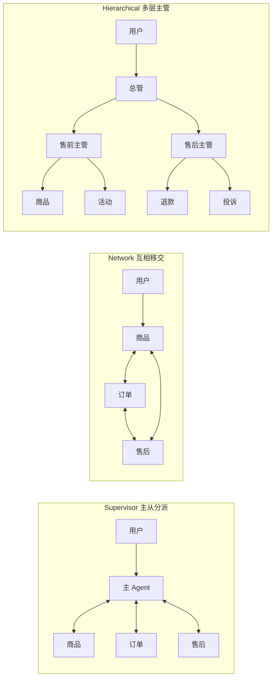
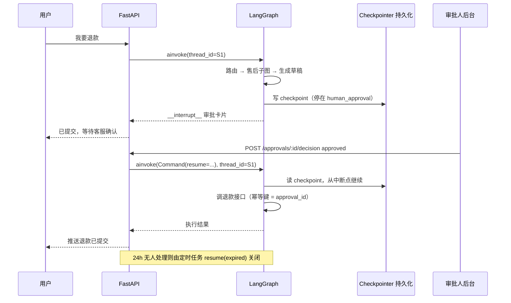

# Multi-Agent 编排、路由与人工兜底

> 拆 Multi-Agent 的理由通常不是"一个 Agent 不够聪明"，而是三件很具体的工程问题：工具太多导致选错、多个领域的规则写在一份 Prompt 里互相打架、有些操作必须由人签字才能执行。这三件事分别对应编排、路由和人工兜底，也是本篇的三条主线。

## 单 Agent 什么时候不够用

单 Agent 的结构很简单：一份系统 Prompt，一组工具，模型自己决定调哪个。它能撑很久，撑不住的时候症状也很典型。

### 信号一：工具清单本身变成了噪声

工具的名称、描述、参数 schema 每一轮都要进 Prompt。工具从 5 个涨到 25 个，你会同时踩到成本和准确率两个问题。

| 工具数量 | 典型现象 |
|---|---|
| 1-8 | 选择基本准确，schema 占用可以忽略 |
| 8-15 | 近义工具开始混淆（`query_order` 和 `query_shipment`），要在描述里补一句"什么时候不要用我" |
| 15 以上 | 每轮多花几千 token，选错率明显上升，新增一个工具会拉低旧工具的准确率 |

这和前端里那个越写越长的 `switch` 是同一种病：分支多到一定程度，写的人和读的人都开始靠猜。

### 信号二：领域流程互相污染

售后的规则是"先查订单状态，再判断能不能退"；商品咨询的规则是"不要查订单，直接回答参数"。两条规则写在同一份 Prompt 里，模型会把它们混着用——用户只想问尺码，它先去查了订单。

### 信号三：Prompt 成了规则堆积场

每修一个 badcase 就加一句"如果……则……"，三个月后 Prompt 里有 40 条规则，其中若干条互相矛盾。你既不敢删，也不知道删了会坏掉哪个用例。

**先别急着拆。** 上面三个信号里，只有第二和第三个真正需要拆分。工具太多优先试这几招：

| 手段 | 做法 | 成本 |
|---|---|---|
| 工具分组 | 按当前意图只注入相关工具（5-8 个） | 低，改一段装配代码 |
| 工具检索 | 把工具描述向量化，按 query 召回 Top-K 再注入 | 中，多一次检索 |
| 参数收敛 | 合并近义工具，用一个枚举参数区分行为 | 低，但要改调用方 |

::: tip
工具本身的可靠性问题（schema 设计、参数校验、幂等、重试）在 [Tool Calling 与结构化输出](./agent-tool-calling) 里单独讲。本篇假设单个工具已经是可靠的，只讨论"谁来调它"。
:::

---

## 什么时候不该拆成 Multi-Agent

拆分不是免费的。每多一层编排，下面这些成本会同时上涨：

| 代价 | 具体表现 | 量级参考 |
|---|---|---|
| 延迟叠加 | 路由一次 LLM，子 Agent 再一次，汇总可能还有一次 | 每多一跳 +0.5 到 2 秒 |
| 状态传递 | 上下文要序列化、裁剪、跨节点传递。传多了串味，传少了子 Agent 缺信息 | 每次移交都是一次信息损耗 |
| 调试与运维 | 错误答案要先判断是路由错还是子 Agent 错；每个子 Agent 的 Prompt、工具、模型版本都要单独管 | 排查时间大致翻倍，发布面变宽 |
| 评测面积 | 路由准确率、每个子 Agent 的完成率都要单独建集 | 用例数量按子 Agent 数量线性增长 |

**不该拆的几种情况：**

- 只有一个领域，规则总量在 20 条以内，补几个 few-shot 示例就能修掉 badcase。
- 延迟预算很紧（要求 3 秒内出首字），而路由本身就要花 1 秒。
- 子 Agent 之间需要共享大量状态。如果大部分精力花在"怎么把状态传过去"，那说明它本来就是一个流程。
- 团队还没有可回归的评测集。没有评测集时拆分等于在黑箱上再套一层黑箱。

::: warning
一个常见的错误动机是"拆开以后每个 Prompt 都变短了，看起来干净多了"。整洁不是收益，准确率、可回归性和可控性才是。如果拆完之后端到端指标没变好，那只是把复杂度从 Prompt 搬到了编排代码里，还多付了延迟。
:::

**判断标准：** 当两个领域的工具集合和处理流程都几乎不重叠，且各自都需要 10 条以上专有规则时，拆分才开始划算。

---

## 三种主流拓扑



| 维度 | Supervisor | Network | Hierarchical |
|---|---|---|---|
| 控制流 | 主 Agent 集中决策，子 Agent 执行完回到主 Agent | 子 Agent 之间直接移交，没有中心 | 多层主管，每层只管自己的下级 |
| 可预测性与调试 | 高，路径可枚举，两级日志即可定位 | 低，容易 A→B→A 循环，要看完整移交链 | 中，层内可预测，跨层要按层看 |
| 上下文传递 | 主图 State 集中管理，子图字段隔离 | 每次移交都要显式打包上下文 | 逐层裁剪，越往下上下文越窄 |
| 延迟 | 路由一跳 + 执行一跳 | 移交次数不可控，最坏情况很深 | 至少两跳路由 |
| 适用场景 | 领域清晰、彼此并列的客服 / 问答 / 工单系统 | 需要专家来回协商的调研、方案评审 | 子 Agent 超过 8-10 个，或有明显业务分组 |
| 主要代价 | 主 Agent 是单点，路由错则全错 | 循环与失控，必须设移交上限 | 层数带来的延迟与调试成本 |

**生产推荐：** 从 Supervisor 起步。它的路径可枚举，出问题能一眼定位在哪一跳，而且升级到 Hierarchical 只是把某个子 Agent 换成一张子图，改动局部。Network 只在"必须让两个专家来回讨论"时才有价值，且一定要设移交次数上限。

---

## Supervisor 的职责边界

主 Agent 只做三类事，其余一概不碰：

| 主 Agent 负责 | 主 Agent 不负责 |
|---|---|
| 意图识别（这句话属于哪个领域） | 查数据库、调外部接口 |
| 任务拆解（一句话里有两个诉求就拆成有序步骤） | 生成面向用户的业务话术 |
| 条件路由（按意图和权限选择子 Agent） | 判断"这个订单能不能退"这类领域规则 |
| 澄清、转人工、汇总子 Agent 的结论 | 拼接检索证据、保存子 Agent 的中间状态 |

这和前端路由是同一种分工：`router` 只做路径匹配和守卫，页面组件自己取数据、自己渲染。你不会在路由配置里写业务逻辑，主 Agent 同理。

**为什么必须守住这条边界：** 一旦主 Agent 开始"顺手查一下订单"，它就需要订单领域的工具和规则，Prompt 会重新长回去。你等于绕一圈回到单 Agent，还多付了一次路由延迟。

**踩坑：** 主 Agent 用自然语言写"分派指令"给子 Agent，是 Multi-Agent 里最容易漏的一处信息损耗。分派要用结构化字段（`intent` + `slots` + `permission`），子 Agent 直接读字段，不要让子 Agent 再去理解主 Agent 的措辞。

---

## 用 LangGraph 子图实现：父子 State 隔离

核心设计只有一句：**主图 State 只放跨领域必须共享的字段，领域中间态一律留在子图内部。** 主图 State 越薄，子 Agent 之间越不会串味。

```python
# state.py
from typing import Annotated, Literal, TypedDict
from langchain_core.messages import AnyMessage
from langgraph.graph.message import add_messages

Intent = Literal["product", "order", "aftersale", "chitchat", "unknown"]

class ParentState(TypedDict):
    """主图 State：只放路由结果和最终产出，不放任何领域中间态"""
    messages: Annotated[list[AnyMessage], add_messages]  # 用户可见的对话
    intent: Intent                 # 路由结果
    route_confidence: float        # 路由置信度，决定是否澄清 / 转人工
    user_permission: list[str]     # 当前用户权限位，如 ["refund:apply"]
    final_answer: str              # 汇总后返回给用户的文本
    handoff_count: int             # 已移交次数，防循环

class AftersaleState(TypedDict):
    """售后子图 State：快照、证据、草稿都留在子图内部，主图看不到"""
    task: str                      # 由主图映射进来的任务描述
    user_permission: list[str]     # 只读映射，子图内还要再校验一次
    order_snapshot: dict
    evidence: list[dict]           # 检索证据
    refund_draft: dict             # 退款草稿，等待人工确认
    answer: str                    # 回给主图的唯一出口
```

字段映射要显式写出来，不要依赖"同名自动共享"这种隐式行为：

| 字段 | 方向 | 是否共享 | 原因 |
|---|---|---|---|
| `messages` | 父 → 子（裁剪后） | 部分 | 子 Agent 只需要最近几轮，不需要全量历史 |
| `intent` / `task` | 父 → 子 | 是 | 子 Agent 靠它决定做什么 |
| `user_permission` | 父 → 子（只读） | 是 | 权限判断必须在子图内再做一次 |
| `order_snapshot` / `evidence` | 子图内部 | 否 | 领域中间态，暴露给主图只会污染其他子 Agent |
| `refund_draft` | 子图内部 | 否 | 只有售后领域理解它的语义 |
| `answer` → `final_answer` | 子 → 父 | 是 | 子图唯一出口 |

子图自己编译，可以脱离主图单独跑测试：

```python
# aftersale_agent.py
from langgraph.graph import StateGraph, START, END

def build_aftersale_subgraph():
    g = StateGraph(AftersaleState)
    for name, fn in [
        ("load_order", load_order),            # 查订单快照
        ("retrieve_policy", retrieve_policy),  # 检索退换政策
        ("draft_refund", draft_refund),        # 生成退款草稿
        ("human_approval", human_approval),    # HITL 挂起点，见后文
        ("compose", compose_answer),
    ]:
        g.add_node(name, fn)

    g.add_edge(START, "load_order")
    g.add_edge("load_order", "retrieve_policy")
    g.add_edge("retrieve_policy", "draft_refund")
    g.add_conditional_edges(                   # 只有真要动钱才挂起
        "draft_refund",
        lambda s: "human_approval" if s["refund_draft"].get("amount", 0) > 0 else "compose",
        {"human_approval": "human_approval", "compose": "compose"},
    )
    g.add_edge("human_approval", "compose")
    g.add_edge("compose", END)
    return g.compile()

aftersale_graph = build_aftersale_subgraph()
```

父图里用一个 wrapper 节点做字段映射，父子两边都不需要知道对方的字段名：

```python
# parent.py
async def aftersale_node(state: ParentState) -> dict:
    sub_input: AftersaleState = {                       # 父 → 子：只传必要字段
        "task": rewrite_task(state["messages"][-3:]),   # 消解指代后的单句诉求
        "user_permission": state["user_permission"],
        "order_snapshot": {}, "evidence": [], "refund_draft": {}, "answer": "",
    }
    result = await aftersale_graph.ainvoke(sub_input)    # 子图内部字段不会写回父图
    return {                                            # 子 → 父：只回写出口字段
        "final_answer": result["answer"],
        "handoff_count": state["handoff_count"] + 1,
    }
```

::: details 为什么不直接把子图当节点挂进父图
LangGraph 支持 `g.add_node("aftersale", aftersale_graph)` 直接挂子图，前提是父子 State 有共享键名。这种写法更短，但会让父图 State 被迫包含子图需要的所有字段——子 Agent 一多，父图 State 就成了所有领域字段的并集，隔离性没了。用 wrapper 显式映射多写十行，换来字段边界清晰、子图可独立测试、改子图不影响父图。
:::

---

## 路由：三种做法与置信度处理

| 做法 | 实现 | 延迟 | 可解释性 | 新增意图 | 适用 |
|---|---|---|---|---|---|
| LLM 自由分类 | Prompt 里列出意图，让模型输出名称 | 0.5-1.5s | 中，只有一个名字 | 改 Prompt 即可 | 意图少、还在变的原型阶段 |
| 结构化输出 + 枚举约束 | 绑定 Pydantic schema，字段用 `Literal` | 0.5-1.5s | 高，带置信度和理由 | 改枚举 + 跑回归 | 生产默认 |
| 向量相似度匹配 | 意图样例向量化，query 取最近邻 | 20-80ms | 高，能看到命中的样例 | 加样例即可，不用改代码 | 延迟敏感、意图稳定、样例充足 |

**生产推荐：** 结构化输出 + 枚举约束打底，高频短句（"我的快递到哪了"）先走向量匹配做快速通道，命中阈值就直接路由，省掉一次 LLM 调用。

```python
from typing import Literal
from pydantic import BaseModel, Field

class RouteDecision(BaseModel):
    intent: Literal["product", "order", "aftersale", "chitchat", "unknown"] = Field(
        description="用户这句话所属领域；无法判断时必须返回 unknown，不要硬猜"
    )
    confidence: float = Field(ge=0, le=1, description="0-1 的置信度")
    reason: str = Field(description="一句话说明判断依据，只进日志不给用户")
    slots: dict[str, str] = Field(default_factory=dict, description="已抽到的槽位，如 order_id")
    sub_tasks: list[str] = Field(default_factory=list, description="一句话含多诉求时拆成有序任务")

router_llm = llm.with_structured_output(RouteDecision)   # 约束输出结构，不解析自由文本

async def route_node(state: ParentState) -> dict:
    hit = vector_router.match(state["messages"][-1].content)   # 先试向量快速通道
    if hit and hit.score >= 0.88:
        return {"intent": hit.intent, "route_confidence": hit.score}
    decision = await router_llm.ainvoke(build_router_prompt(state))
    log_route(state, decision)               # reason / slots 全量落日志，供混淆矩阵分析
    return {"intent": decision.intent, "route_confidence": decision.confidence}
```

置信度不够时不要硬猜，用三级兜底：

| 置信度 | 动作 | 说明 |
|---|---|---|
| >= 0.75 | 直接分派到子 Agent | 正常路径 |
| 0.45 - 0.75 | 反问澄清，最多一次 | 连续反问两次以上比直接转人工更糟 |
| < 0.45 | 转人工 | 附对话摘要与路由 `reason` |
| 子 Agent 判定不属于自己 | 退回主 Agent 重路由 | 重路由超过 2 次转人工 |

**踩坑：**

- 枚举里必须有 `unknown`。不给兜底类别，模型会把无法归类的句子硬塞进最像的那个领域，然后子 Agent 一路错到底。
- 一句话两个诉求（"帮我查下物流，顺便把那件退了"）要在路由阶段拆成有序任务列表，而不是让某个子 Agent 硬扛。
- 阈值不要拍脑袋定。用带标注的样本跑一遍，看不同阈值下"误分派率"和"转人工率"的曲线，选业务能接受的平衡点。

---

## Handoff：传什么，不传什么

移交的本质是把下一个 Agent 需要的最小信息打包。传多了串味且涨成本，传少了子 Agent 缺上下文反复追问。

| 上下文项 | 是否传递 | 理由 |
|---|---|---|
| 重写后的用户诉求（已消解指代） | 传 | 子 Agent 的输入主体 |
| 结构化槽位（订单号、商品 ID、时间范围） | 传 | 避免子 Agent 重新抽一次，也避免抽出不一样的值 |
| 最近 2-3 轮对话 | 传（裁剪） | 保留必要的上下文 |
| 用户权限位与会话 ID | 传 | 权限要在子图内二次校验 |
| 全量对话历史 | 不传 | 成本高，且会把上一个领域的表述带进来 |
| 上一个子 Agent 的检索证据与推理过程 | 不传 | 领域不同，证据无效，还会让新 Agent 沿错误路径继续 |
| 工具返回的原始大 JSON | 不传，传摘要 + 引用 ID | 真需要时按 ID 重新取 |

在 LangGraph 里用 `Command` 表达移交，payload 用结构化字段（`task` / `slots` / `recent_turns` / `reason`）显式打包，不要靠一句自然语言描述：

```python
from langgraph.types import Command

async def aftersale_agent(state: AftersaleState) -> Command:
    if not belongs_to_me(state["task"]):
        return Command(
            goto="route",                   # 退回主 Agent 重路由，而不是自己转给别人
            update={"handoff_reason": "领域不匹配：这是商品咨询"},
            graph=Command.PARENT,           # 跳到父图的节点
        )
    ...
```

**踩坑：** Network 拓扑下最容易出现"A 转 B，B 又转回 A"。必须在 State 里放 `handoff_count`，超过阈值（一般 3 次）直接转人工，并把整条移交链写进日志——否则线上只能看到一次超时，看不到它在两个 Agent 之间来回弹了 6 次。

---

## 人工兜底：哪些节点必须挂起

判断标准只有三条：**是否写外部系统、是否不可逆、出错是否要赔钱或影响信誉。** 命中任意一条，就不该让模型独自决定。

| 操作 | 写外部系统 | 可逆 | 策略 |
|---|---|---|---|
| 查商品参数、查物流、解释退换政策 | 否 | — | 全自动（政策解释必须带引用） |
| 提交退款申请 | 是 | 否 | 强制人工确认，展示金额、原因、依据条款 |
| 投诉升级 | 是 | 否 | 强制人工，附完整对话摘要 |
| 创建工单 / 修改用户资料 | 是 | 部分 | 用户二次确认 + 抽样人工复核 |
| 发放补偿、优惠 | 是 | 否 | 强制人工，按金额分级审批 |
| 主动触达用户（短信、外呼） | 是 | 否 | 强制人工 |

区分两种"人"很重要：

- **用户确认（Confirm）**：把 Agent 拼好的参数摊开给用户看，用户点确认才执行。它解决的是"参数抽错"。
- **人工审批（Approve）**：转给客服或风控人员，他们有权改参数或直接拒绝。它解决的是"策略判断错、权限不够"。

**生产推荐：** 敏感写操作两道都要。用户确认负责意图对齐，人工审批负责权限与风控，二者不能互相替代。

---

## interrupt() + Checkpointer：暂停、恢复与拒绝

`interrupt()` 会在节点执行中间打断，把当前 State 连同"停在哪个节点"一起写进 Checkpointer，然后把中断值返回给调用方。之后用同一个 `thread_id` 加 `Command(resume=...)` 恢复，图从中断点继续，**不会从头重跑**——这是它和"自己存个状态再重新调一遍"的本质区别。

```python
from datetime import timedelta
from langgraph.types import interrupt

async def human_approval(state: AftersaleState) -> dict:
    draft = state["refund_draft"]
    # 1. 先落一条审批单（业务表，带 TTL），返回审批人后台用的 ID
    approval_id = await approvals.create(
        thread_id=state["thread_id"],
        action="refund.apply",
        payload=mask(draft),                              # 脱敏后再落库
        expires_at=utcnow() + timedelta(hours=24),
    )
    # 2. 挂起。入参会作为中断值返回给调用方，用于渲染审批卡片
    decision = interrupt({
        "type": "approval_required",
        "approval_id": approval_id,
        "summary": f"订单 {draft['order_id']} 退款 {draft['amount']} 元",
        "evidence": state["evidence"][:3],                # 让审批人看到依据条款
    })
    # 3. 恢复后从这一行继续，decision 就是 Command(resume=...) 传进来的值
    if decision["result"] == "rejected":
        return {"answer": f"申请未通过：{decision.get('comment', '不符合退款条件')}"}
    if decision["result"] == "expired":
        return {"answer": "审批超时已自动关闭，如仍需处理请重新发起。"}

    patched = {**draft, **decision.get("patch", {})}      # 审批人可以改金额或原因
    await refund_api.submit(patched, idempotency_key=approval_id)  # 幂等键防重复提交
    return {"answer": "退款已提交，预计 3 个工作日到账。"}
```

调用和恢复是两个独立入口，可能相隔几小时、落在不同进程，全靠 `thread_id` 接上：编译图时必须挂 Checkpointer，提问时用 `ainvoke` 的返回值里的 `result["__interrupt__"][0].value` 渲染审批卡片，审批人决策后再用 `Command(resume=...)` 打同一个 `thread_id`（完整代码见文末示例）。整条链路是这样跑的：



---

## 挂起态的 TTL、持久化与多实例恢复

挂起会引入一类新的线上问题：**任务停在那里，没有人来推动它。** 用户关掉了页面，审批人当天没上班，这条 thread 就永远停在 `human_approval`。

审批单要独立建业务表，而不是只依赖 Checkpointer。Checkpointer 是图的执行快照，结构随图变化，不适合用来做查询、分配和统计。

| 字段 | 类型 | 说明 |
|---|---|---|
| `approval_id` | UUID | 主键，同时作为下游写操作的幂等键 |
| `thread_id` / `checkpoint_id` | string | 恢复图执行必需，后者便于精确回放 |
| `action` | string | `refund.apply` / `complaint.escalate`，用于审批路由与权限判断 |
| `payload` | JSONB | 待确认参数（脱敏后） |
| `status` | enum | `pending` / `approved` / `rejected` / `expired` / `failed` |
| `expires_at` | timestamptz | TTL，到点由定时任务关闭 |
| `assignee` / `decided_by` | string | 分配给谁、最终谁决策 |
| `decided_at` / `comment` | timestamptz / text | 决策时间与备注 |

过期关闭交给定时任务，扫描逻辑要幂等、能并发：

```python
# 每分钟跑一次；Worker 的领取、重试、死信设计见 ./background-worker
async def close_expired_approvals():
    rows = await approvals.claim_expired(limit=100)   # SELECT ... FOR UPDATE SKIP LOCKED
    for row in rows:
        try:
            # 关键：不是简单标记失败，而是恢复图走"超时关闭"分支，给用户一个明确结论
            await graph.ainvoke(
                Command(resume={"result": "expired"}),
                {"configurable": {"thread_id": row.thread_id}},
            )
            await approvals.mark(row.approval_id, "expired")
            await notify_user(row.thread_id, "审批超时已自动关闭")
        except Exception as e:
            await approvals.mark_failed(row.approval_id, str(e))   # 留给下一轮重试
```

**多实例部署下的四条硬约束：**

| 约束 | 做法 | 违反后的现象 |
|---|---|---|
| Checkpointer 必须外部化，恢复只依赖 `thread_id` | Postgres / Redis，不能用 `MemorySaver`，进程内不留状态 | 恢复请求落到另一个副本就接不上，滚动发布后挂起任务全部失效 |
| 同一 thread 的恢复要串行 | 按 `thread_id` 加 Redis 分布式锁，见 [Redis 深入](./redis-deep) | 用户和审批人同时触发恢复，写操作执行两次 |
| 下游写操作必须幂等 | 用 `approval_id` 作幂等键 | 任何一次重试都可能导致重复退款 |

::: warning
不要用"内存字典 + 定时清理"实现挂起。单副本本地开发能跑通，一上多副本就会出现"审批通过了但任务还挂着"。这类问题在压测里几乎测不出来，只在滚动发布和扩缩容时集中爆发。
:::

---

## 审批审计日志

审批是会被追责的动作，日志要能独立回答"谁在什么时候基于什么信息批准了什么"。它和普通请求日志分开存，保留期通常远长于普通日志。

| 字段 | 示例 | 为什么需要 |
|---|---|---|
| `trace_id` / `thread_id` | `tr_9f2…` / `S1` | 串起整条会话与图执行 |
| `approval_id` / `action` / `resource` | `ap_7c1…` / `refund.apply` / `order:2024…` | 定位唯一审批与操作对象 |
| `payload_before` / `payload_after` | 金额 100 → 80 | 审批人是否改动了参数 |
| `decision` / `comment` | `approved` / "按运费补偿" | 结果与理由 |
| `decided_by` / `role` | `staff_042` / `售后二线` | 责任人与权限来源 |
| `decided_at` / `wait_ms` | 时间戳 / 挂起时长 | 时效考核与 TTL 调优 |
| `evidence_refs` | `["policy#12", "order_api#detail"]` | 决策依据可回溯，只存引用不存全文 |
| `model_version` / `prompt_version` | `v2024-x` / `aftersale@7` | 出问题时能定位是哪一版逻辑生成的草稿 |
| `auto_closed` | `true` / `false` | 区分人工决策与 TTL 自动关闭 |

**踩坑：** 不要把 `payload` 原样落库。证件号、手机号、卡号要脱敏或只存哈希；审批人需要看到的是"后四位 + 金额 + 依据条款"，不是完整的敏感字段。

---

## 会话记忆：短期与长期

| 维度 | 短期记忆 | 长期记忆 |
|---|---|---|
| 存在哪 | Checkpointer / Redis 会话 Key | 数据库 + 向量库 |
| 生命周期 | 一次会话，TTL 30 分钟到 24 小时 | 跨会话长期保留，用户可删除 |
| 内容 | 最近若干轮对话、当前槽位、挂起态 | 稳定偏好、地址标签、历史工单摘要 |
| 读写方式 | 每个节点执行后自动写，读时全量加载（已裁剪） | 显式抽取校验后才写，读时按意图检索 Top-K |
| 写错的代价 | 过期即丢，可接受 | 长期污染后续所有会话 |

**该记的：** 稳定偏好（"只寄到公司地址"）、已确认的身份与权限、历史问题的结论摘要、用户明确拒绝过的方案。

**不该记的：** 一次性验证码、完整证件号与卡号、临时优惠信息、模型的中间推理、未经确认的推测（"用户可能是学生"）。长期记忆宁少写不错写，写入前过一层校验。

上下文窗口是有预算的，按优先级分配：

| 分区 | 预算占比 | 裁剪策略 |
|---|---|---|
| 系统 Prompt + 当前子 Agent 规则 | 15% | 固定，不裁 |
| 工具 schema | 10% | 只注入当前意图相关的工具 |
| 检索证据 | 35% | 重排后取 Top-K，长文档只保留命中段 |
| 对话历史 | 25% | 最近 3-5 轮原文 + 滚动摘要；摘要里必须显式保留否定项与已确认槽位，否则 Agent 会反复推荐用户拒绝过的方案 |
| 长期记忆 | 5% | 按意图检索，最多 3-5 条结构化事实 |
| 输出预留 | 10% | 预算不足时先砍历史，再砍证据条数，永远不砍引用 ID |

---

## 可观测与回归分析

Multi-Agent 的排障成本主要来自"不知道错在哪一跳"。一次会话至少要能还原下面这条链：

| 记录项 | 字段 | 用途 |
|---|---|---|
| 路由 | `intent` / `confidence` / `reason` / `router_type` | 区分路由错还是执行错 |
| 子 Agent 执行 | `agent` / `node_path` / `duration_ms` | 找出慢在哪个节点 |
| 工具调用 | `tool` / `args_hash` / `status` / `retry_count` / `latency_ms` | 工具成功率与超时分布 |
| 参数校验 | `schema_error` / `field` | 结构化输出的失败模式 |
| 人工环节 | `interrupt_node` / `approval_id` / `decision` / `wait_ms` | 挂起率与审批时效 |
| 转人工与结果 | `escalation_reason` / `task_completed` / `user_feedback` | 归因（路由不明 / 工具连续失败 / 用户主动）与端到端指标 |

有了这些字段，最有用的是三张分析表：

- **意图混淆矩阵**：真实意图 × 路由结果，对角线之外就是要修的样例。改完 Prompt 或补完向量样例后重跑，看混淆是不是只是搬了个家。
- **工具失败类型分布**：`参数错 / 权限错 / 上游超时 / 返回空` 四类的修法完全不同——前两类改 Agent，后两类改重试与降级。
- **按意图分组的任务完成率与转人工率**：某个意图的转人工率突然上升，往往是上游接口变了，而不是模型变差了。

**生产推荐：** 每次改 Prompt、换模型、加工具都跑固定回归集，指标写进发布记录。评测集怎么建、怎么打分、线上样本怎么回流，见 [Agent 评测](./agent-eval)。

---

## 完整示例：主 Agent + 两个子 Agent + 退款 HITL

把前面的部件装起来：`route_node` 和 `aftersale_node` 沿用上文，`clarify_node` 只负责反问一句，`escalate_node` 建人工会话并只递交对话摘要。

```python
# graph.py —— 主图装配
from langgraph.graph import StateGraph, START, END

MAX_HANDOFF = 3

def pick_branch(state: ParentState) -> str:
    if state["handoff_count"] >= MAX_HANDOFF:
        return "escalate"                          # 来回移交太多次，直接交给人
    conf = state["route_confidence"]
    if conf < 0.45:
        return "escalate"
    if conf < 0.75:
        return "clarify"
    if state["intent"] == "aftersale" and "refund:apply" not in state["user_permission"]:
        return "escalate"                          # 权限不足就别让子 Agent 白跑一趟
    return {
        "product": "product", "order": "product",
        "aftersale": "aftersale", "chitchat": "clarify",
    }.get(state["intent"], "clarify")

def build_parent_graph():
    g = StateGraph(ParentState)
    g.add_node("route", route_node)
    g.add_node("product", product_node)            # 商品 / 订单查询子图 wrapper
    g.add_node("aftersale", aftersale_node)        # 售后子图 wrapper（内含 HITL）
    g.add_node("clarify", clarify_node)
    g.add_node("escalate", escalate_node)

    g.add_edge(START, "route")
    g.add_conditional_edges("route", pick_branch, {
        "product": "product", "aftersale": "aftersale",
        "clarify": "clarify", "escalate": "escalate",
    })
    for node in ("product", "aftersale", "clarify", "escalate"):
        g.add_edge(node, END)
    return g
```

```python
# api.py —— 两个入口：对话与审批决策
from fastapi import APIRouter, Depends, HTTPException
from langgraph.types import Command

router = APIRouter()

@router.post("/chat")
async def chat(body: ChatIn, user=Depends(current_user)):
    config = {"configurable": {"thread_id": body.session_id}}
    async with session_lock(body.session_id):          # 按会话加分布式锁，防并发恢复
        result = await graph.ainvoke({
            "messages": [{"role": "user", "content": body.text}],
            "user_permission": user.permissions,
            "handoff_count": 0,
        }, config)
    if "__interrupt__" in result:                      # 命中挂起，前端渲染确认卡片
        return {"status": "awaiting_approval", "card": result["__interrupt__"][0].value}
    return {"status": "done", "answer": result["final_answer"]}

@router.post("/approvals/{approval_id}/decision")
async def decide(approval_id: str, body: DecisionIn, reviewer=Depends(current_reviewer)):
    ap = await approvals.get(approval_id)
    if ap.status != "pending":                         # 幂等：重复提交不会执行第二次
        raise HTTPException(409, "该审批已处理或已过期")
    if not reviewer.can(ap.action, ap.payload.get("amount", 0)):
        raise HTTPException(403, "审批权限不足")        # 权限按操作 + 金额分级

    await approvals.mark(approval_id, body.result, decided_by=reviewer.id)
    await audit.write_approval(ap, body, reviewer)     # 审计日志单独落，与业务表解耦
    async with session_lock(ap.thread_id):
        await graph.ainvoke(
            Command(resume={"result": body.result, "patch": body.patch,
                            "comment": body.comment}),
            {"configurable": {"thread_id": ap.thread_id}},
        )
    return {"ok": True}
```

这个骨架里有四处是生产必需、原型阶段最容易省掉的：按 `thread_id` 的分布式锁、审批状态前置校验（幂等）、审批权限二次校验、审计日志与业务表分离。四处都省掉的系统，上线后一定会出现重复退款。

接口本身的组织方式（依赖注入、鉴权、异常处理）见 [FastAPI 进阶](./fastapi-advanced#依赖注入-depends)，定时扫描与重试见 [Worker 与异步任务](./background-worker)。

---

## 面试高频问题

**1. 什么时候该从单 Agent 拆成 Multi-Agent？**

- 触发信号：领域流程互相污染、Prompt 规则超过 20 条且互相矛盾、工具数超过 15 个。
- 先做便宜的：按意图分组注入工具、工具描述向量检索、合并近义工具。
- 真正的拆分门槛：两个领域的工具集与流程几乎不重叠，各自有 10 条以上专有规则。
- 代价要主动说出来：每跳 +0.5 到 2 秒延迟、状态传递损耗、评测集随 Agent 数量线性膨胀。

**2. Supervisor、Network、Hierarchical 怎么选？**

- Supervisor：中心决策，路径可枚举，最好调试，客服 / 问答类默认选它。
- Network：专家互相移交，适合需要来回协商的任务，必须设移交上限防循环。
- Hierarchical：子 Agent 超过 8-10 个或有明显业务分组时用，代价是多一跳路由延迟。
- 补一句演进路径：Supervisor 起步，某个子 Agent 变复杂就把它换成子图，自然长成 Hierarchical。

**3. 父子 State 怎么设计才不串味？**

- 主图只放 `intent`、`route_confidence`、`user_permission`、`final_answer`、`handoff_count`。
- 领域中间态（订单快照、检索证据、草稿）留在子图，主图看不到。
- 用 wrapper 节点显式做字段映射，而不是依赖同名键自动共享。
- 子图单独编译，可以脱离主图跑单测；换子 Agent 不动主图。

**4. 路由不确定时怎么处理？**

- 结构化输出带 `confidence`，枚举里必须有 `unknown` 兜底类别。
- 三级策略：高置信直接分派、中置信反问一次澄清、低置信或澄清失败转人工。
- 子 Agent 判定领域不匹配就退回主 Agent 重路由，重路由超过 2 次转人工。
- 高频短句用向量匹配做快速通道，省一次 LLM 调用；阈值靠标注样本的误分派率曲线定。

**5. HITL 具体怎么实现？挂起态怎么保证不丢、不卡死？**

- `interrupt()` 把 State 和中断点写进 Checkpointer，`Command(resume=...)` 从中断点继续，不重跑。
- Checkpointer 必须外部化（Postgres / Redis），否则恢复请求落到别的副本就接不上。
- 审批单独建业务表：`approval_id`（兼作幂等键）、`thread_id`、`status`、`expires_at`。
- 同一 `thread_id` 的恢复加分布式锁，下游写操作用幂等键，两者缺一都可能重复退款。
- 没人处理的挂起靠定时 Worker 扫 `expires_at`，用 `resume={"result": "expired"}` 走关闭分支给用户明确结论，而不是简单标记失败。

**6. Multi-Agent 出错怎么定位？**

- 按跳记录：路由结果与置信度、子 Agent 节点路径、工具调用与失败类型、人工环节与转人工原因。
- 三张分析表：意图混淆矩阵、工具失败类型分布、按意图分组的完成率与转人工率。
- 区分模型问题和上游问题：某意图转人工率突增，先查接口变更，再怀疑模型。
- 每次改动跑固定回归集，指标进发布记录，避免"修一个坏两个"。

