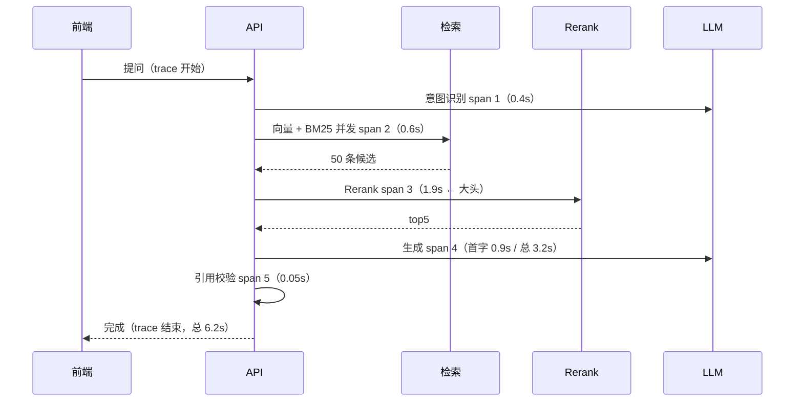

# 可观测性、成本与性能

> 普通接口出故障会返回 500，Agent 出故障往往返回 200 加一段像样的胡话。加上一次请求内部有十几次模型和工具调用、每次调用都在花钱，"看不见内部发生了什么"就等于既修不了 bug 也控不住成本。这一篇讲怎么把黑盒变成可查询的事件流，以及在此之上做成本、延迟和容量。

## 为什么 Agent 比普通接口难观测

| 维度 | 普通 CRUD 接口 | Agent 请求 |
|---|---|---|
| 内部调用数 | 1 次 DB 查询 | 意图识别 + 检索 + rerank + 生成 + 校验，还可能有多轮工具调用 |
| 确定性 | 同样输入同样路径 | 同样输入可能走不同分支、调不同工具 |
| 失败形态 | 抛异常、5xx | **HTTP 200 但答得不对**：漏检索、引用错、拒答该答的问题 |
| 耗时 | 几十毫秒 | 3 到 15 秒，且方差极大 |
| 成本 | 与请求数线性 | 与 token 数和调用次数相关，同一个接口两次请求成本可能差 10 倍 |
| 排障线索 | 一条日志 + 堆栈 | 需要完整调用树：每段耗时、每段 token、每次工具的入参出参 |

结论：**必须先有 trace，然后才谈得上优化。** 没有调用树时，"这个接口有点慢"这句话你连往下问一层都做不到——是模型排队、检索慢、rerank 慢，还是工具在重试，全靠猜。

::: tip 三样东西各管一件事，缺一不可
**日志**回答"这一次到底发生了什么"（复盘单个 case）；**Trace**回答"时间和 token 花在哪一段"（定位瓶颈）；**指标**回答"整体趋势和异常"（发现问题）。很多团队只有零散的 print，于是只能回答第一个问题的一小部分。
:::

---

## 结构化日志：从 print 到可查询的事件流

第一步是把日志从"给人读的字符串"变成"给机器查的 JSON 事件"。字段规范定下来之后，排障就变成写查询：

| 分组 | 字段 | 作用 |
|---|---|---|
| 链路 | `trace_id`、`span_id`、`parent_span_id` | 串起一次请求的完整调用树 |
| 身份 | `session_id`、`user_id`、`tenant_id`、`channel` | 按会话、用户、租户、渠道下钻 |
| 位置 | `node`、`event`（`llm_call` / `tool_call` / `retrieve` / `guard`） | 知道是哪一段发生的什么事 |
| 耗时 | `duration_ms`、`first_token_ms`、`queue_ms` | 延迟拆解的原始数据 |
| 成本 | `model`、`input_tokens`、`cached_input_tokens`、`output_tokens`、`cost_micro` | 成本归集的原始数据 |
| 结果 | `status`、`error_code`、`retry_count`、`finish_reason` | 成功率、重试、截断 |
| 业务 | `refused`、`refuse_reason`、`degraded`、`cache_hit`、`tool_name` | 质量指标与降级归因 |
| 版本 | `prompt_version`、`app_version`、`index_version` | 出问题时能对上是哪次变更 |

`trace_id` 要在整条异步链路里自动可得，否则每个函数都得多传一个参数，两周后就没人传了。Python 的解法是 `contextvars`——它和线程本地变量的区别在于**每个 asyncio task 有独立副本**，天然按请求隔离：

```python
# obs/context.py
import contextvars, uuid

trace_id_var: contextvars.ContextVar[str] = contextvars.ContextVar("trace_id", default="-")
span_id_var: contextvars.ContextVar[str] = contextvars.ContextVar("span_id", default="-")
session_id_var: contextvars.ContextVar[str] = contextvars.ContextVar("session_id", default="-")
user_id_var: contextvars.ContextVar[int] = contextvars.ContextVar("user_id", default=0)


def new_id() -> str:
    return uuid.uuid4().hex[:16]
```

FastAPI 中间件负责生成并绑定，请求结束后必须 `reset`：

```python
# obs/middleware.py
from starlette.middleware.base import BaseHTTPMiddleware


class TraceMiddleware(BaseHTTPMiddleware):
    async def dispatch(self, request, call_next):
        tid = request.headers.get("x-trace-id") or new_id()   # 复用上游透传的 id，跨服务才能串
        token = trace_id_var.set(tid)
        try:
            resp = await call_next(request)
            resp.headers["x-trace-id"] = tid   # 回给前端：用户报障时直接把这个 id 给你
            return resp
        finally:
            trace_id_var.reset(token)          # 不 reset，复用的事件循环里会串味
```

日志侧用一个 `Filter` 自动把上下文补进每条记录，业务代码里就不用再手动带 `trace_id`：

```python
# obs/logging.py
import json, logging, time


class ContextFilter(logging.Filter):
    def filter(self, record: logging.LogRecord) -> bool:
        record.trace_id = trace_id_var.get()
        record.span_id = span_id_var.get()
        record.session_id = session_id_var.get()
        record.user_id = user_id_var.get()
        return True


class JsonFormatter(logging.Formatter):
    def format(self, record: logging.LogRecord) -> str:
        base = {"ts": time.strftime("%Y-%m-%dT%H:%M:%S", time.localtime(record.created)),
                "level": record.levelname, "logger": record.name, "event": record.getMessage(),
                "trace_id": record.trace_id, "span_id": record.span_id,
                "session_id": record.session_id, "user_id": record.user_id}
        base.update(getattr(record, "fields", {}))     # 业务字段走 extra={"fields": {...}}
        return json.dumps(base, ensure_ascii=False)
```

业务代码里发一条事件就只剩一行：

```python
log.info("llm_call", extra={"fields": {
    "node": "generate", "model": "glm-4", "duration_ms": 1840,
    "input_tokens": 3120, "output_tokens": 260, "status": "ok",
}})
```

**踩坑：** 在 `run_in_executor`、`asyncio.to_thread` 或第三方线程池里，`contextvars` 的副本是在提交任务那一刻拷贝的，之后主协程再 `set` 也不会影响它。需要在提交前把值取出来显式传进去。

---

## Trace 与 Span：把一次问答摊成调用树

一条 `trace` 是一次完整问答，里面每个可计时的动作是一个 `span`，span 靠 `parent_span_id` 组成树。这棵树才是排障的主界面：



一个 span 落成日志大致是这样，`fields` 里的东西决定了你事后能问出什么问题：

```json
{
  "ts": "2026-09-02T14:03:11", "level": "INFO", "event": "span_end",
  "trace_id": "9f2c41ab77e0d3b1", "span_id": "c14e", "parent_span_id": "root",
  "session_id": "s-8812", "user_id": 3301,
  "node": "rerank", "duration_ms": 1893,
  "model": "rerank-base", "input_tokens": 0, "output_tokens": 0,
  "candidates_in": 50, "candidates_out": 5,
  "status": "ok", "retry_count": 0
}
```

有了这棵树，"慢"这个模糊描述立刻变成"rerank 占了总耗时的 30%，候选从 50 降到 5"，下一步该做什么就明确了（降候选数、换更小的 rerank 模型、或者干脆按查询类型跳过 rerank，见[混合检索](./rag-retrieval)）。

### 工具选型

| 方案 | 适合规模 | 优点 | 代价 |
|---|---|---|---|
| 结构化日志 + SQL / ClickHouse 查询 | 起步到中等 | 零额外依赖、字段完全自定义、数据在自己手里 | 调用树要自己拼，没有现成 UI |
| Langfuse（可自托管） | 中小团队 | 对 LLM 场景开箱即用：token、成本、prompt 版本、人工标注 | 多一个服务要运维 |
| LangSmith | 用 LangChain / LangGraph 的团队 | 与框架深度集成，几行接入 | 托管为主，数据出境需评估 |
| OpenTelemetry + Jaeger / Tempo | 已有微服务可观测体系 | 和现有 trace 打通，标准协议不锁定 | LLM 语义（token、成本）要自己建约定 |
| Phoenix / 自建评估看板 | 偏离线分析 | 便于把 trace 和评测结果放一起看 | 线上实时性弱 |

**生产推荐：** 先把结构化日志和字段规范做扎实，再考虑上平台。字段规范是资产，平台是工具——规范定好了换平台只是换消费端；规范没定，接了平台也只是把混乱搬了个家。

::: tip 一个便宜且非常有用的动作
把 `trace_id` 通过响应头回给前端并在界面上可复制。用户报障时直接给你一个 id，比"我刚才问了个问题它答错了"节省的时间超过你为可观测性做的其它所有工作。
:::

---

## 成本可观测：token 从哪读，怎么分摊

成本失控几乎从来不是单价问题，而是**调用次数和输入长度悄悄涨了**没人发现。要看见它，先把 token 落到每个 span 上。

token 的来源按优先级：模型响应里的 usage 字段（最准，是计费依据）→ LangChain 的 `response_metadata` / `usage_metadata` → 本地 tokenizer 估算（只在流式且供应商不返回 usage 时兜底，要标记为估算值）。

```python
# obs/cost.py
from decimal import Decimal

# 单价按每百万 token 计，输入输出分开；缓存命中的输入通常另有折扣价
PRICING = {
    "glm-4":       {"in": Decimal("50"), "cached_in": Decimal("10"), "out": Decimal("50")},
    "glm-4-flash": {"in": Decimal("0.5"), "cached_in": Decimal("0.1"), "out": Decimal("0.5")},
    "rerank-base": {"in": Decimal("2"),  "cached_in": Decimal("2"),  "out": Decimal("0")},
}


def cost_micro(model: str, usage: dict) -> int:
    """返回微元（整数），避免浮点累加误差；未知模型记 0 并单独告警。"""
    p = PRICING.get(model)
    if not p:
        return 0
    cached = Decimal(usage.get("cached_input_tokens", 0))
    fresh = Decimal(usage.get("input_tokens", 0)) - cached
    out = Decimal(usage.get("output_tokens", 0))
    yuan = (fresh * p["in"] + cached * p["cached_in"] + out * p["out"]) / Decimal(1_000_000)
    return int(yuan * 1_000_000)
```

**四个维度分摊**，缺一个就有排查不了的问题：

| 维度 | 回答什么问题 | 典型发现 |
|---|---|---|
| 按模型 | 钱花在哪个模型上 | 意图识别在用大模型，换小模型立省一半 |
| 按节点 | 哪一段最贵 | 检索材料没裁剪，生成节点输入 token 是别人三倍 |
| 按会话 / 用户 | 谁在烧钱 | 少数长会话贡献大部分成本；或某个租户在滥用 |
| 按天 / 版本 | 什么时候开始涨的 | 上周改了 prompt 之后单次成本涨了 40% |

落一张宽表就够用了，不必上数仓：

```sql
CREATE TABLE llm_usage (
  id          BIGSERIAL PRIMARY KEY,
  ts          TIMESTAMPTZ NOT NULL DEFAULT now(),
  trace_id    VARCHAR(32) NOT NULL,
  session_id  VARCHAR(64),
  user_id     BIGINT,
  tenant_id   VARCHAR(64),
  node        VARCHAR(64)  NOT NULL,      -- intent / retrieve / rerank / generate
  model       VARCHAR(64)  NOT NULL,
  input_tokens        INT NOT NULL DEFAULT 0,
  cached_input_tokens INT NOT NULL DEFAULT 0,
  output_tokens       INT NOT NULL DEFAULT 0,
  cost_micro  BIGINT NOT NULL DEFAULT 0,  -- 微元，整数累加
  prompt_version VARCHAR(32),
  estimated   BOOLEAN NOT NULL DEFAULT false  -- true 表示 token 是本地估算的
);
CREATE INDEX ON llm_usage (ts);
CREATE INDEX ON llm_usage (trace_id);
CREATE INDEX ON llm_usage (tenant_id, ts);
```

```sql
-- 每次会话的平均成本，按节点看大头（最常用的一条排查查询）
SELECT node,
       count(*)                                   AS calls,
       round(avg(input_tokens))                   AS avg_in,
       round(avg(output_tokens))                  AS avg_out,
       sum(cost_micro) / 1000000.0                AS total_yuan,
       round(100.0 * sum(cost_micro) / sum(sum(cost_micro)) OVER (), 1) AS pct
FROM llm_usage
WHERE ts >= now() - interval '7 days'
GROUP BY node
ORDER BY total_yuan DESC;
```

**踩坑：** 只记总成本不记 `input_tokens`。成本涨了却看不出是"调用变多"还是"每次输入变长"，而这两者的处理办法完全不同——前者查链路是不是多转了圈（见[生产可靠性](./agent-reliability)），后者查上下文是不是没裁剪（见[上下文工程](./agent-context)）。

---

## 延迟拆解：为什么必须看 P95

平均值会骗人。Agent 请求的耗时分布是长尾的：大部分 4 秒，少部分因为多轮工具调用或供应商排队变成 20 秒。均值 5 秒看着还行，但那些 20 秒的用户已经关掉页面了。

| 指标 | 意义 | 用途 |
|---|---|---|
| P50 | 一半用户的体验 | 看常态是否可接受 |
| P95 | 最慢那 5% 的门槛 | **SLO 应该定在这里**，它代表"糟糕但仍需承诺"的体验 |
| P99 | 极端长尾 | 排查偶发问题，不适合做承诺（样本少、抖动大） |
| 首字延迟 TTFT | 用户看到第一个字的时间 | 流式场景下感知延迟的真正决定因素 |

把总延迟拆到段，才知道该优化谁：

| 段 | 常见占比 | 优化手段 |
|---|---|---|
| 供应商排队 / 限流等待 | 波动极大 | 换通道、并发降级、重试退避（不是你的代码问题，但要能证明） |
| 意图识别 | 5% - 10% | 换小模型、加缓存、规则前置 |
| 检索（向量 + BM25） | 10% - 20% | 索引参数、并发两路、限制候选数 |
| **Rerank** | **20% - 40%** | 降候选数、换小模型、按查询类型跳过 |
| 生成（TTFT + 输出） | 30% - 50% | 流式、裁剪输入、限制输出长度 |
| 工具调用 | 波动极大 | 并发、超时、缓存（**多轮工具是第二大头**） |
| 校验与后处理 | < 5% | 一般不用管 |

给一条链路定预算比事后优化有效得多：

| 段 | 预算 | 超了怎么办 |
|---|---|---|
| 意图识别 | 0.5s | 超时直接走默认意图，不阻塞 |
| 检索 | 0.8s | 单路超时就用另一路结果（降级不中断） |
| Rerank | 1.5s | 超时跳过精排，直接用融合结果 |
| 生成首字 | 1.5s | 这条是硬指标，超了用户会以为卡死 |
| 生成完成 | 4.0s | 流式下可放宽，非流式必须收紧 |
| **总预算** | **8.0s** | 超过就该触发降级路径而不是继续等 |

::: tip 感知延迟和真实延迟是两件事
同一条 6 秒的链路，一次性返回和流式返回的用户体验差距巨大。流式把注意力锚在首字延迟上，所以**优化 TTFT 的性价比通常高于优化总耗时**。做法见[SSE 流式与阶段事件协议](./agent-streaming)：先推"正在检索"这类阶段事件，用户就知道系统在干活。
:::

---

## 语义缓存：同义问法也能命中

精确缓存（问题字符串哈希）在真实流量里命中率很低——"年假几天""年假多少天""请问年假有多少天呀"是三个 key。语义缓存改用 Embedding 相似度判命中：

```python
# obs/semantic_cache.py
import json, hashlib

SIM_THRESHOLD = 0.94          # 高阈值：宁可不命中，也不要答错
CACHE_TTL = 3600


class SemanticCache:
    def __init__(self, redis, embed, vec_store):
        self.redis, self.embed, self.vec = redis, embed, vec_store

    async def get(self, question: str, scope: str):
        """scope 必须包含知识库 ID 和权限指纹，否则会跨租户串答案。"""
        vec = await self.embed(question)
        hit = await self.vec.search(vec, scope=scope, top_k=1)
        if not hit or hit[0]["score"] < SIM_THRESHOLD:
            return None
        payload = await self.redis.get(f"sc:{scope}:{hit[0]['key']}")
        return json.loads(payload) if payload else None

    async def set(self, question: str, scope: str, answer: dict):
        vec = await self.embed(question)
        key = hashlib.sha256(question.encode()).hexdigest()[:16]
        await self.vec.upsert(key, vec, scope=scope)
        # 连引用一起缓存，否则命中后答案有出处、界面却点不开
        await self.redis.setex(f"sc:{scope}:{key}", CACHE_TTL, json.dumps(answer, ensure_ascii=False))
```

**阈值怎么定：** 不要拍脑袋。用评测集里的问题两两算相似度，找出"语义相同"和"语义相近但答案不同"两组的分界，取分界偏保守的一侧。语义缓存答错的代价远高于没命中，所以宁高不低。

**绝对不能缓存的四类：**

| 类型 | 原因 |
|---|---|
| 涉及实时数据 | 库存、余额、订单状态，缓存等于给错数据 |
| 涉及用户私有数据 | 缓存 scope 一旦漏了权限指纹就是越权（见[Prompt 注入攻防](./agent-security)） |
| 时间敏感 | "最新政策""本月"，同样问法不同时间答案不同 |
| 知识库刚更新 | 文档变更必须失效相关缓存，按 `index_version` 纳入 scope 最省事 |

**踩坑：** 缓存 scope 只放知识库 ID，忘了权限。A 用户问过的答案被 B 用户命中，这是数据泄露级别的 bug，而且测试环境通常发现不了（只有一个账号）。

其它降本手段，按性价比排序：

| 手段 | 收益 | 代价 |
|---|---|---|
| 分环节选模型（意图识别 / 改写用小模型） | 通常能降三到五成，最划算 | 需要分别评测确认质量没掉 |
| 裁剪检索材料与历史 | 直接降输入 token | 裁太狠会掉召回，见[上下文工程](./agent-context) |
| 提示词缓存（供应商侧） | 长系统提示的场景很明显 | 要求前缀稳定，prompt 一改就失效 |
| 批量 Embedding | 入库阶段省调用数 | 需要改成批处理，见[RAG 入库链路](./rag-pipeline) |
| 限制输出长度 | 输出 token 通常单价更高 | 答案可能被截断，要处理 `finish_reason` |
| 语义缓存 | 高频重复问法场景明显 | 有答错风险，要设禁区 |

---

## 压测：瓶颈通常不在你的代码里

Agent 压测和 CRUD 接口压测有三个本质区别，照搬 CRUD 的做法会得出错误结论：

| 差异 | 后果 |
|---|---|
| 单请求耗时几秒到几十秒 | QPS 很低但并发很高，别用 QPS 当主指标 |
| 上游模型 API 有速率限制 | 压到一定并发后 429 而不是变慢，瓶颈在外部 |
| 每次请求成本真金白银 | **压测会产生账单**，必须先估算再跑 |

关键关系是 `并发数 ≈ QPS × 平均耗时`。单请求 6 秒、目标 10 QPS，就需要约 60 个并发在途——先确认供应商的并发额度够不够，再谈自己的服务扛不扛得住。

压测该分三轮，不要一次压到底：

1. **单请求基线**：并发 1，跑够样本量，拿到各段耗时的 P50/P95。这是后面所有对比的基准。
2. **阶梯加压**：并发 1 → 5 → 10 → 20 → 50，每档观察 P95 和错误率。找到 P95 开始明显上翘的那一档，那就是容量。
3. **定位瓶颈归属**：把上游 API 换成本地 mock（固定延时、不限流）再压一遍。如果曲线立刻变好，瓶颈在供应商；如果没变，瓶颈在自己（连接池、事件循环阻塞、数据库、rerank 服务）。

::: warning 压测前先做的两件事
一是把并发上限和成本上限设好，别把测试环境的 key 打爆或者刷出一笔意外账单。二是确认压测流量在日志里可识别（比如带 `channel=loadtest`），否则线上指标和成本统计会被污染。
:::

一份能用的压测结论长这样，光有"能扛 20 并发"是不够的：

| 项 | 内容 |
|---|---|
| 场景 | 单知识库问答，检索 + rerank + 生成，流式 |
| 基线 | 并发 1：TTFT P95 `1.4s`，总耗时 P95 `6.2s` |
| 容量 | 并发 20 时总耗时 P95 `9.8s`，错误率 `0.3%`；并发 50 时 429 占 `12%` |
| 瓶颈 | 换 mock 上游后并发 50 的 P95 降到 `6.9s` → **瓶颈在模型供应商限流** |
| 结论 | 当前额度下安全并发约 20，对应约 3 QPS；要提容量先谈额度，不是加机器 |
| 成本 | 本轮压测消耗约 `<按实际填>` 元，单请求平均 `<按实际填>` 元 |

**踩坑：** 在同一个进程里做了 CPU 密集的操作（比如同步的 tokenizer 计算、大 JSON 序列化），会阻塞事件循环，导致压测曲线在低并发就崩。这类问题在单请求测试里完全看不出来。相关排查思路见[FastAPI 进阶](./fastapi-advanced)。

---

## 看板与告警

一块看板只需要这些，多了没人看：

| 指标 | 异常时先查什么 |
|---|---|
| 请求量 / 并发 | 是否有异常流量或重试风暴 |
| 错误率与错误类型分布 | 哪一类错误在涨：模型超时、工具 5xx、校验失败 |
| **拒答率** | 突然上涨通常意味着检索出了问题（索引重建、Embedding 换了、权限配置错） |
| **转人工率** | 上涨看意图路由和工具成功率；**下跌也要看**，可能是该转的没转 |
| P95 延迟（分段） | 哪一段变慢了，对照延迟预算表 |
| 单次会话成本 | 涨了先看 `input_tokens` 还是调用次数 |
| 工具成功率（按工具名） | 单个工具失败率飙升往往是下游发布导致 |
| 缓存命中率 | 突然掉零通常是 scope 里混进了变化的字段 |
| 引用完整率 | 掉了说明生成或校验环节退化，见[引用溯源](./rag-citation) |

告警的原则是**只对"需要人立刻做动作"的事告警**。其余进日报。

| 该告警 | 不该告警 |
|---|---|
| 错误率超过基线数倍且持续几分钟 | 单次请求失败 |
| P95 超过 SLO 并持续 | P99 抖了一下 |
| 拒答率或转人工率突变（双向） | 缓慢的日常波动 |
| 日成本超过预算的设定比例 | 单次请求成本偏高 |
| 心跳缺失（定时任务没跑） | 定时任务跑得比平时慢 |

::: tip 阈值怎么定
不要拍脑袋定绝对值，用历史分位数做相对阈值（例如"超过过去 7 天同时段 P95 的 1.5 倍"）。绝对阈值在业务量变化后必然误报，然后就被静音，然后就等于没有。
:::

**和离线评测的分工：** 线上监控回答"现在有没有变糟"，离线评测回答"这次改动是变好还是变坏"。两者靠一条闭环连起来——线上抓到的异常样本（拒答的、转人工的、用户点了负反馈的）定期回流进评测集，下次改动前先跑一遍回归。完整方法见[Agent 与 RAG 评测方法](./agent-eval)。

轨迹级的"一次运行一行体检报告"（步数、成本、触发了哪些保护、最终状态）属于可靠性视角，见[Agent 生产可靠性](./agent-reliability)；这一篇的 trace 是请求视角，两者层级不同，配合使用。

---

## 面试高频问题

**1. Agent 的可观测性和普通接口的有什么不同？**

- 普通接口一次请求一条链路，Agent 一次请求内部十几次模型和工具调用，必须有调用树才排得了障。
- 失败形态不同：普通接口失败会 5xx，Agent 常常返回 200 但答得不对，所以要记业务级信号（拒答、降级、引用完整性），不能只记 HTTP 状态。
- 成本是一等公民。同一个接口两次请求成本可能差一个数量级，必须把 token 落到每个 span 上。
- 加分：指出"日志答复盘、trace 答瓶颈、指标答趋势"三者分工，缺一个就会有问不出来的问题。

**2. `trace_id` 在异步代码里怎么贯穿，不靠层层传参？**

- Python 用 `contextvars`：和线程本地变量的区别是每个 asyncio task 有独立副本，天然按请求隔离。
- FastAPI 中间件生成并 `set`，`finally` 里 `reset`；同时复用上游传来的 `x-trace-id`，跨服务才串得起来。
- 日志侧用 `logging.Filter` 自动注入，业务代码不用手动带。
- 别踩的坑：丢进线程池或 `to_thread` 的任务拿到的是提交那一刻的副本快照，之后主协程再 set 不会生效，要显式传。

**3. 为什么看 P95 不看平均值？**

- Agent 耗时分布长尾：均值 5 秒可能掩盖了 5% 的用户等了 20 秒，而那批人已经流失了。
- P95 适合做 SLO（代表"糟糕但仍需承诺"的体验）；P99 样本少、抖动大，适合排查不适合承诺。
- 流式场景下还要单独看 TTFT，因为感知延迟由首字决定，优化 TTFT 往往比优化总耗时性价比更高。
- 加分：能说出延迟拆解里 rerank 和多轮工具调用通常是两个大头。

**4. 成本涨了，你怎么定位？**

- 先分清是"调用次数涨了"还是"每次输入变长了"——两者处理办法完全不同，所以必须同时记 `input_tokens` 和调用数，不能只记总金额。
- 按四个维度下钻：模型、节点、会话/用户、时间与 prompt 版本。第四个维度能直接对上是哪次变更引入的。
- 常见结论：意图识别这类简单任务在用大模型；检索材料没裁剪导致生成节点输入膨胀；链路多转了圈（循环没兜住）。
- 别踩的坑：用浮点累加金额。用整数微元存，避免长期累加误差。

**5. 语义缓存怎么避免答错？**

- 阈值宁高不低，用评测集里"语义相同"和"语义相近但答案不同"两组的相似度分布反推分界，别拍脑袋。
- 设禁区：实时数据、用户私有数据、时间敏感问题、知识库刚更新的内容都不缓存。
- **scope 必须包含知识库 ID、权限指纹和索引版本**，否则会跨租户串答案或返回过期内容——这是数据泄露级别的 bug，单账号测试发现不了。
- 加分：提一句引用也要一起缓存，否则命中后答案有出处但界面点不开。

**6. 压 Agent 接口和压普通接口有什么不一样？**

- 单请求几秒到几十秒，QPS 很低但并发很高，主指标应该是并发数和 P95 而不是 QPS；关系是并发 ≈ QPS × 平均耗时。
- 上游模型 API 有速率限制，压到一定程度是 429 而不是变慢，瓶颈常在外部。定位办法是把上游换成固定延时的 mock 再压一遍对比。
- 压测会产生真实账单，跑之前要设成本和并发上限，流量还要在日志里可识别，别污染线上指标。
- 加分：提醒同进程里的 CPU 密集操作会阻塞事件循环，这类问题只有在并发压测下才暴露。

**7. 线上监控和离线评测怎么分工？**

- 线上监控回答"现在有没有变糟"（拒答率、转人工率、P95、成本、工具成功率）；离线评测回答"这次改动是变好还是变坏"（在固定评测集上跑指标对比）。
- 闭环在于回流：线上的拒答样本、转人工样本、负反馈样本定期补进评测集，下次改动前跑回归。
- 告警只留"需要人立刻动作"的项，阈值用历史分位数做相对值，绝对阈值在业务量变化后必然误报然后被静音。
- 加分：能指出转人工率**下降也要告警**——可能是该转的没转，这是事故不是优化。
