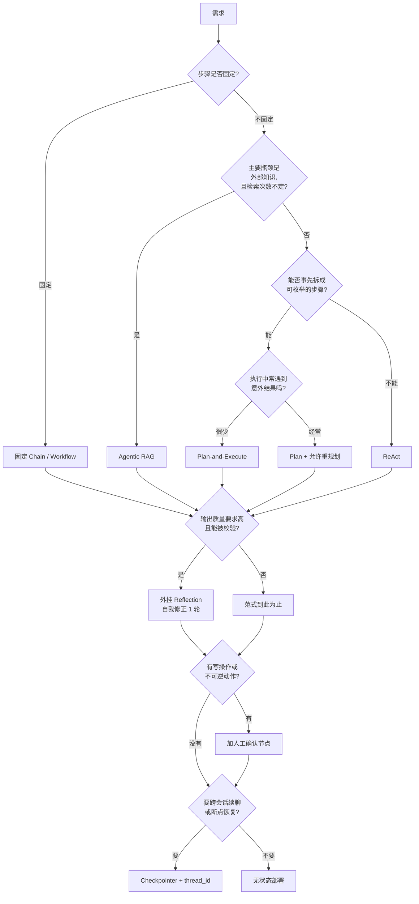
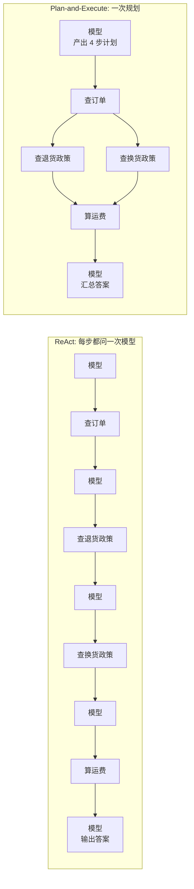
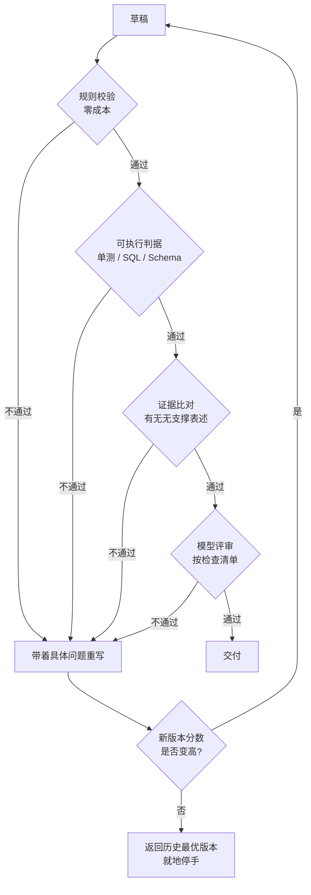

# Agent 范式与框架选型

> 面试里关于 Agent 最常问的两个问题都是选型题："为什么用这个范式不用那个""为什么用 LangGraph 不用 CrewAI"。答不好的人背特性列表，答得好的人先说需求特征，再说这个特征逼出了哪个选择，最后诚实报出代价。这篇就是那份决策手册。

## 一张决策树先把范式定下来

选范式不是从"哪个更先进"出发，而是从五个需求特征出发：**步骤固定吗、中途要改计划吗、工具多吗、要人工确认吗、要跨会话吗**。



这张图有意把五个特征拆成了两段：上半段决定**主范式**（只能选一个），下半段决定**外挂机制**（可以叠加）。很多人把它们混在一起讨论，于是得出"Reflection 和 ReAct 选哪个"这种没有答案的问题——Reflection 是给任意范式加的一层质检，不是 ReAct 的替代品。

| 需求特征 | 指向 | 为什么 |
|---|---|---|
| 流程图能画完，分支 ≤ 3 | 固定 Chain | 流程写在代码里就该写在代码里，见 [Agent 工程总览](./agent-intro#什么时候不该上-agent) |
| 步数因输入而异，无法预先枚举 | ReAct | 只有"看到上一步结果才知道下一步"时才需要每步都问模型 |
| 步骤可枚举，但要跑 5 步以上 | Plan-and-Execute | 一次规划省掉 N-1 次决策调用，还能按依赖并行 |
| 知识型问题，一次检索有时不够 | Agentic RAG | 让模型决定检索几次、用什么查询 |
| 输出长、有客观校验标准 | 外挂 Reflection | 长文和代码的错误可被规则或执行结果发现 |
| 有写操作、退款、对外发消息 | 人工确认 | 见 [工具安全分级](./agent-tool-calling#工具安全分级) |
| 多轮续聊、审批挂起后恢复 | Checkpointer | 见 [LangGraph 状态图](./agent-langgraph#checkpointer-多轮续聊与断点恢复) |

::: tip 决策树的入口条件
"步骤是否固定"的判断标准别靠感觉。写下流程图，如果能画完且分支不超过三个，它就是固定的——这条判据和 [Agent 工程总览](./agent-intro#什么时候不该上-agent) 里的三个退回信号是同一件事，不重复展开。
:::

---
## 五种范式横向对比

这两张表建议直接背下来，面试里问"你知道哪些 Agent 范式"时，能按维度答的和只能报名字的差距非常明显。

第一张看**代价**：

| 范式 | 一句话定义 | 单次任务的模型调用次数 | 可控性 | 总延迟 | 成本量级（以一次 RAG 为 1） |
|---|---|---|---|---|---|
| 固定 Chain / Workflow | 步骤和顺序写死在代码里，模型只在每步内部干活 | 固定 N 次（N 由代码决定） | 最高，可单测可复现 | 最低且可预估 | 1～3 |
| ReAct | 每步都让模型看历史再决定下一个动作 | 不定，实测常 3～10 次 | 最低 | 最高，串行累加 | 3～15，长尾无上界 |
| Plan-and-Execute | 先一次性出完整计划，再按计划逐步执行 | 1 次规划 + 1 次汇总，中间不问模型 | 中高，计划本身可审计 | 中，可按依赖并行 | 2～5 |
| Reflection / 自我修正 | 生成后先自评，不合格就带着批评意见重写 | 基础范式 × (1 + 反思轮数 × 2) | 中，取决于评判依据 | 至少翻倍 | 2～4 倍于基础范式 |
| Agentic RAG | 把检索包成工具，让模型决定要不要检索、检索几次 | 1～4 次决策 + 若干次检索 | 中低 | 中高 | 2～6 |

第二张看**边界**：

| 范式 | 适用场景 | 不适用场景 | 典型失败模式 |
|---|---|---|---|
| 固定 Chain | 文档摘要、字段抽取、工单分类、审核流水线 | 路径因输入而异的任务 | 需求变了就得改代码；遇到没设计过的输入直接走错分支 |
| ReAct | 排障、跨系统查询、探索性分析、路径不可枚举 | 简单问答、对延迟敏感的同步接口 | 原地打转（反复调同一个工具）、被一次工具报错带偏、轮次打满仍没结论 |
| Plan-and-Execute | 报告生成、批量数据处理、多系统编排、步数 5～15 | 中途高概率出意外的环境 | **计划错了一路错**——第 2 步取错了字段，后面 6 步全在处理错数据 |
| Reflection | 长文生成、代码生成、结构化报告、翻译润色 | 单句事实问答、分类打标 | 空转（改来改去没实质变化）、越改越差、成本翻倍收益为零 |
| Agentic RAG | 比较型问题、多跳问题、需要拆成多个子查询的问题 | "年假几天"这类一次检索必然覆盖的事实问答 | 跳过检索直接凭记忆编、同一个查询反复检索、检索预算被打满 |

**核心判断：** 这五行从上到下是"把决策权交给模型"的程度递增。每往下一步，你换来的是适应性，付出的是可预测性、成本和排查难度。**取能稳定解决问题的最上面那一行**，而不是最下面那一行。

固定 Chain 在这五个里是最容易被轻视的，但它应该是你的默认选项：绝大多数"AI 功能"的流程本身是确定的，只是每一环需要语言理解能力。这一级的完整讨论在 [Agent 工程总览](./agent-intro#第-1-级-prompt-chain-固定流水线)，这里不重复。

::: warning 别把范式当成技术品味
线上跑一段时间后，把每个会话的工具调用序列打点统计。如果 ReAct Agent 的 90% 会话都走同一条固定路径，说明你选的范式比需求复杂了一档——把那条路径固化成 Chain，剩下的长尾才留给 ReAct。范式选型是可以被数据推翻的。
:::

---
## ReAct vs Plan-and-Execute：同一个任务的两种写法

用同一个任务对比最有说服力。任务：**"我上周买的两件商品，一件想退一件想换，分别怎么处理，运费谁承担？"** 需要的动作是查订单、查退货政策、查换货政策、算运费，四步。



ReAct 是 5 次模型调用、4 次工具调用，全程串行。Plan-and-Execute 是 2 次模型调用，其中第 2、3 步没有依赖关系可以并发。

### ReAct 实现

```python
from langchain_core.messages import SystemMessage
from langgraph.graph import END, MessagesState, StateGraph
from langgraph.prebuilt import ToolNode, tools_condition

TOOLS = [get_order, search_policy, calc_freight]
llm = ChatOpenAI(model="qwen-plus", temperature=0).bind_tools(TOOLS)
SYS = SystemMessage("你是售后助手。信息不足就调用工具，足够就直接给结论并说明依据。")


def agent(state: MessagesState) -> dict:
    # 关键：每一轮都把完整历史重新交给模型，由它决定下一个动作
    # 代价也在这里——历史线性增长，第 5 轮的输入 token 是第 1 轮的好几倍
    return {"messages": [llm.invoke([SYS] + state["messages"])]}


g = StateGraph(MessagesState)
g.add_node("agent", agent)
g.add_node("tools", ToolNode(TOOLS))               # 自动执行 tool_calls 并回填 ToolMessage
g.add_conditional_edges("agent", tools_condition)   # 有 tool_calls 走 tools，否则结束
g.add_edge("tools", "agent")                       # 回环：观察结果回灌，模型重新决策
g.set_entry_point("agent")
react_app = g.compile()
```

这段的循环骨架和手写版本是同一个东西，手写实现见 [ReAct 范式](./agent-intro#react-范式-thought-→-action-→-observation)。用图来写多出来的收益是终止条件、状态快照和流式事件都由框架接住了。

**踩坑：** `tools_condition` 只判断"模型这次有没有要调工具"，它不管轮次。必须自己加轮次上限——在 `agent` 节点里读一个 `step` 计数，超限时强制返回一条"信息不足，请转人工"的消息走向 `END`，否则模型完全有能力在两个工具之间来回调二十次。

### Plan-and-Execute 实现

计划必须是**结构化对象**，不能是模型写的一段自然语言。理由很实际：自然语言计划没法校验工具名、没法算依赖、没法在前端展示成进度条。

```python
import asyncio
from pydantic import BaseModel, Field

TOOL_MAP = {t.name: t for t in TOOLS}


class Step(BaseModel):
    id: int = Field(ge=1)
    tool: str = Field(description=f"必须是以下之一：{list(TOOL_MAP)}")
    args: dict = Field(default_factory=dict)
    depends_on: list[int] = Field(default_factory=list)   # 依赖哪些前序步骤的结果


class Plan(BaseModel):
    goal: str = Field(description="用一句话复述用户的最终目标")
    steps: list[Step] = Field(max_length=8)               # 硬上限，防止规划出 30 步


planner = llm.with_structured_output(Plan)                # 见结构化输出一节


async def run_plan(question: str) -> str:
    plan = await planner.ainvoke(PLAN_PROMPT.format(q=question, tools=tool_spec()))

    # 规划幻觉必须在执行前拦住：出现未注册工具直接失败，不要"猜一个最像的"
    for s in plan.steps:
        if s.tool not in TOOL_MAP:
            raise ValueError(f"计划中出现未注册工具：{s.tool}")

    results: dict[int, str] = {}
    for batch in topo_batches(plan.steps):                # 按 depends_on 分层，同层可并发
        done = await asyncio.gather(*(exec_step(s, results) for s in batch))
        results.update(dict(done))

    # 整个执行过程不再问模型，只在最后汇总一次
    return await summarize(question, plan, results)


async def exec_step(step: Step, results: dict[int, str]) -> tuple[int, str]:
    ctx = {i: results[i] for i in step.depends_on}         # 只注入它声明依赖的结果
    out = await TOOL_MAP[step.tool].ainvoke({**step.args, "_ctx": ctx})
    return step.id, out
```

`topo_batches` 就是一次朴素拓扑分层：把 `depends_on` 已全部就绪的步骤收成一批，执行完再收下一批。这是 Plan-and-Execute 相对 ReAct 的一个常被忽略的优势——**ReAct 天生串行**，因为它必须看到上一步结果才能决定下一步；有了显式计划，无依赖的步骤可以并发。

### 关键差异

| 维度 | ReAct | Plan-and-Execute |
|---|---|---|
| 模型调用 | 每步一次，N 步就是 N+1 次 | 规划 1 次 + 汇总 1 次 |
| 适应意外 | 强。工具报错、返回空、数据和预期不符，下一轮就能改策略 | 弱。计划是在"什么都还没看到"时定的 |
| 延迟 | 高，且随步数线性增长 | 低，无依赖步骤可并发 |
| 成本可预估性 | 差，长尾会话可能花掉均值的十倍 | 好，上限就是 `max_length` 那 8 步 |
| 失败传播 | 局部。某一步错了，下一轮模型看到就能补救 | **全局。第 2 步取错数据，后面全在处理错数据** |
| 可观测性 | 要靠回放整条消息历史 | 计划本身就是一份可审计、可展示、可人工修改的产物 |
| 前端体验 | 只能播报"正在查询…" | 能直接渲染成带勾选状态的步骤条 |

**适用场景（ReAct）：** 排障、跨系统追查、"先看看再说"的探索型任务——路径本身不可枚举，你也说不清要几步。

**适用场景（Plan-and-Execute）：** 步骤能枚举但比较多（5～15 步）的编排型任务，比如"生成一份月度报告：取数、算三个指标、画两张图、写结论"。这类任务用 ReAct 是纯亏——每步都花一次模型调用去"决定"一件本来就确定的事。

### 混合做法：先规划，执行中允许重规划

生产上真正好用的是折中版：**保留计划的效率，保留 ReAct 的适应性**，代价是复杂度。

```python
class Revision(BaseModel):
    keep_results: bool = True                  # 已完成步骤的结果是否还可信
    revised_steps: list[Step] = Field(max_length=6)   # 只给"剩余步骤"的新版本


async def run_with_replan(question: str, max_replan: int = 2) -> str:
    plan = await planner.ainvoke(PLAN_PROMPT.format(q=question, tools=tool_spec()))
    queue, results, replans, i = list(plan.steps), {}, 0, 0

    while i < len(queue):
        step = queue[i]
        try:
            _, out = await exec_step(step, results)
            check_step_output(step, out)        # 确定性校验：空结果、字段缺失、明显越界
            results[step.id] = out
            i += 1
        except StepFailed as e:
            if replans >= max_replan:           # 重规划次数必须有上限，否则退化成无界循环
                return await degrade_answer(question, results, reason=str(e))
            replans += 1
            # 只重规划"剩余部分"，已完成结果保留，避免全盘重来把钱花两遍
            rev = await replanner.ainvoke(
                REPLAN_PROMPT.format(goal=plan.goal, done=results, failed=step, err=str(e))
            )
            queue = queue[:i] + rev.revised_steps
            if not rev.keep_results:            # 模型认为前面的结果也不可信，才回退
                results, i = {}, 0

    return await summarize(question, plan, results)
```

**生产推荐：** 默认走一次性计划，只有 `check_step_output` 判定失败时才触发重规划，并把 `max_replan` 设成 1～2。这样正常路径的成本等于纯 Plan-and-Execute，只有出意外的少数会话才付 ReAct 那份钱。把重规划次数打点上报，它是一个非常好的"计划质量"监控指标——重规划率突然上涨，通常意味着某个工具的返回格式变了。

---
## Agentic RAG vs 一次性 RAG

区别只有一句话：**一次性 RAG 是"必然检索一次"，Agentic RAG 是"模型判断要不要检索、用什么查询、够不够再来一次"。**

| 维度 | 一次性 RAG | Agentic RAG |
|---|---|---|
| 检索次数 | 恒定 1 次 | 0～N 次，由模型决定 |
| 延迟 | 检索 + 一次生成，可预估 | 每多一轮检索多一次决策 + 一次检索，通常是前者的 2～4 倍 |
| 成本 | 低且恒定 | 决策调用 + 多次检索的上下文叠加 |
| 召回质量（简单事实问答） | 已经够用 | **没有提升**，还多花了钱 |
| 召回质量（比较型 / 多跳） | 差。一次检索拿不到两个对象的资料 | 明显提升，这是它唯一真正的价值区 |
| 可预测性 | 高，能写断言测试 | 低，同一个问题两次跑可能检索次数不同 |
| 新增失败模式 | 检索没召回 | **模型判断"不需要检索"然后凭记忆编** |

### 最小实现

核心就一件事：把检索包成工具，再给它一个预算。

```python
from langchain_core.tools import tool


class RagState(MessagesState):
    search_count: int                          # 检索预算计数，必须进 State 才能跨轮累加


@tool
def search_kb(query: str, top_k: int = 5) -> str:
    """检索企业知识库。query 用陈述式关键词，不要带疑问词；
    一次只查一个主题，需要比较两个对象时分两次调用。"""
    hits = retriever.search(query, top_k=top_k)
    return "\n\n".join(f"[{h.chunk_id}] {h.content}" for h in hits)


SYS_AGENTIC = SystemMessage(
    "回答企业知识库范围内的问题时，必须先调用 search_kb，不允许凭记忆回答。\n"
    "如果检索结果不足以回答，可以换一个查询词再检索一次，最多 3 次。\n"
    "3 次仍不足，就明确说无法回答，不要推测。"
)


def agent(state: RagState) -> dict:
    used = state.get("search_count", 0)
    if used >= 3:
        # 预算用完就把工具摘掉，模型此时只能基于已有证据作答或拒答
        return {"messages": [llm_no_tools.invoke([SYS_AGENTIC] + state["messages"])]}
    msg = llm.invoke([SYS_AGENTIC] + state["messages"])
    inc = sum(1 for c in msg.tool_calls if c["name"] == "search_kb")
    return {"messages": [msg], "search_count": used + inc}
```

**踩坑：** 上面系统提示第一句"必须先调用 search_kb，不允许凭记忆回答"不是废话，它堵的是 Agentic RAG 最典型的事故——模型觉得自己知道答案，跳过检索直接输出一段听起来很像内部制度的内容，而且**没有任何引用可以暴露它在编**。更稳的做法是代码兜底：第一轮如果模型没发起检索，直接强制插一次检索再让它重答。

### 什么时候不要上 Agentic RAG

这一节比上面的实现重要。**简单事实问答上 Agentic RAG 纯属浪费**：问"年假有几天"，一次检索必然命中制度里那一条，你却先花一次模型调用让它"决定要不要检索"，延迟和成本都涨了，答案一模一样。

| 问题类型 | 例子 | 该用什么 |
|---|---|---|
| 单点事实 | "年假有几天""住宿费限额多少" | 一次性 RAG |
| 条件判断 | "我这种情况能不能报销" | 一次性 RAG + 完整条款进上下文 |
| 比较型 | "A 方案和 B 方案的差旅标准差在哪" | Agentic RAG，两个对象分两次检索 |
| 多跳 | "我们部门归哪个事业部管，那个事业部的报销标准是多少" | Agentic RAG，第二跳查询依赖第一跳结果 |
| 汇总型 | "把去年所有安全通报的整改要求列一下" | 都不合适，走结构化查询，见 [Text2SQL](./agent-text2sql) |

**生产推荐：** 不要让模型每次都自己判断，用一个便宜得多的前置分流——规则或轻量分类器判断问题类型，事实型直接走一次性 RAG，只有比较型和多跳型才进 Agentic 分支。这条路线的成本比"全量 Agentic"低一个档，效果几乎不掉。查询类型路由的具体做法见 [RAG 检索与重排](./rag-retrieval#按查询类型路由)。

::: tip 一个更省的中间态
在上 Agentic RAG 之前先试 Multi-Query：用一次模型调用把原问题改写成 2～3 个子查询，并发检索后融合。它拿到了"多次检索"的大部分收益，但没有循环，延迟只多一次改写，可预测性完全保留。见 [Multi-Query 与 HyDE](./rag-retrieval#multi-query-与-hyde)。
:::

---

## Reflection：什么任务值得自我修正

Reflection 的形态是"生成 → 自评 → 带着批评意见重写"。它是这五种范式里**收益方差最大**的一个：用在对的任务上质量提升非常明显，用在错的任务上就是把账单乘以二。

| 任务 | 值得吗 | 原因 |
|---|---|---|
| 长文 / 报告生成 | 值得 | 结构缺失、前后矛盾、要求漏项，都能在自评时被发现 |
| 代码生成 | 最值得 | 有**客观判据**：能不能跑、单测过不过、类型检查通不通 |
| Text2SQL | 值得 | 语法错误、表名错误、执行报错都是硬信号，见 [Text2SQL](./agent-text2sql) |
| 结构化抽取 | 部分值得 | 用 Schema 校验来"反思"就够了，不必再问一次模型 |
| 简单事实问答 | 不值得 | 答案对不对取决于检索到没有，模型自己再看一遍不会变对 |
| 分类 / 打标 | 不值得 | 一次调用就定了，自评基本是在复述第一次的判断 |

**核心判断：任务有客观判据，Reflection 才成立。** 没有判据的自评等于让模型给自己打分，而它几乎总是给自己打及格。



前三道闸门都不花模型调用，能拦住的问题就不该走到第四道。很多"Reflection 成本翻倍"的抱怨，本质是把规则校验能解决的事交给了模型评审。

### 反思必须基于证据，不是基于感觉

| 反思依据 | 可靠性 | 实现方式 | 例子 |
|---|---|---|---|
| 确定性规则校验 | 最高 | 纯代码，不花 token | 必填章节在不在、数字是否越界、有没有用禁用词 |
| 执行结果 | 高 | 真跑一遍 | 单测、SQL 执行、JSON Schema 校验、编译 |
| 检索证据比对 | 中高 | 把草稿的每句话拿回去和证据核对 | 答案里的数字在证据里找不到就标出来 |
| 换一个模型 / 换一个角色评审 | 中 | 多花一次调用 | 用"审稿人"角色 + 检查清单打分 |
| 让模型空想"我答得好不好" | 最低，接近零 | 一句话 Prompt | 基本只会回答"整体不错，可以更详细" |

```python
class Critique(BaseModel):
    passed: bool
    problems: list[str] = Field(default_factory=list, max_length=5)
    fix_hint: str = ""


async def reflect(draft: str, evidence: list[str]) -> Critique:
    """反思分三级，越便宜的先跑，能拦住就不必花模型调用"""
    # 第 1 级：确定性规则，零成本，先跑
    if errs := check_rules(draft):                   # 必填项、数值范围、禁用词、格式
        return Critique(passed=False, problems=errs, fix_hint="按规则逐条修正，不要改动其余部分")

    # 第 2 级：可执行判据（代码类任务在这里跑单测；报告类任务在这里核对引用）
    if unsupported := find_unsupported_claims(draft, evidence):
        return Critique(passed=False, problems=unsupported,
                        fix_hint="删除或改写没有证据支撑的表述，不要补充新的推测")

    # 第 3 级：才轮到模型评审，并且给的是检查清单而不是"你觉得怎么样"
    return await critic_llm.with_structured_output(Critique).ainvoke(
        CRITIC_PROMPT.format(draft=draft, checklist=CHECKLIST, evidence=evidence)
    )


async def generate_with_reflection(task: str, max_rounds: int = 2) -> str:
    draft = await writer.ainvoke(task)
    best, best_score = draft, score_of(draft)         # 必须留住每一版并可比较

    for _ in range(max_rounds):
        c = await reflect(draft, evidence=task_evidence(task))
        if c.passed:
            return draft
        revised = await writer.ainvoke(REVISE_PROMPT.format(
            task=task, draft=draft, problems=c.problems, hint=c.fix_hint))
        s = score_of(revised)
        if s <= best_score:        # 改坏了就地停手，返回历史最优版本
            return best
        draft, best, best_score = revised, revised, s

    return best
```

**踩坑：** 上面 `if s <= best_score: return best` 这两行是 Reflection 最容易漏的护栏。第二轮、第三轮"改坏了"是真实存在的常见现象——模型为了回应批评而加入不必要的修饰，或者把原本正确的表述改成模糊表述。没有可比较的分数就不要开多轮。

### 收敛几轮

| 轮数 | 典型边际收益 | 成本 |
|---|---|---|
| 1 轮 | 最大，多数问题（漏项、结构、格式）在这一轮被解决 | 2 倍 |
| 2 轮 | 明显递减，主要修的是第一轮引入的新问题 | 3 倍 |
| 3 轮及以上 | 接近零，且"改坏"概率上升 | 4 倍起 |

**生产推荐：** 默认 1 轮，只有代码生成这类有硬判据（单测能跑）的任务才允许到 3 轮——因为那里的"是否变好"是客观可测的，不是模型说了算。

### 怎么证明它真的有用

面试问"Reflection 提升了多少"，只回答"感觉好了很多"是不合格的。标准做法是**消融实验**：同一套评测集、同一个模型、同一份 Prompt，只切换 `max_rounds=0/1/2`，跑三次并排出下面这张表。

| 配置 | 端到端正确率 | 平均 token | P95 延迟 | 结论 |
|---|---|---|---|---|
| 无 Reflection | 基线 | 基线 | 基线 | — |
| 1 轮 | 涨幅够不够抵消 2 倍成本 | 约 2 倍 | 约 2 倍 | 通常这里就该停 |
| 2 轮 | 涨幅通常明显收窄 | 约 3 倍 | 约 3 倍 | 除非有硬判据，否则不开 |

三个数必须一起看：只报正确率涨了就上线，等于隐瞒了延迟翻倍。评测集怎么建、门禁怎么设，见 [Agent 效果评测](./agent-eval#工程化-评测跑进-ci-指标退步就拦住合并)。

---
## 框架选型横向对比

先纠一个常见误解：**LangChain 和 LangGraph 不是竞品**。LangChain 是组件层（模型、工具、检索器、消息抽象、LCEL 链），LangGraph 是编排层（状态图、检查点、中断）。生产上最常见的组合就是"LangChain 的组件 + LangGraph 的图"。面试里能把这层关系说清，比背哪个更强有用得多。

| 框架 | 定位 | 控制粒度 | 状态管理 | HITL 支持 | 可观测性 | 学习曲线 | 锁定风险 | 适合的团队 |
|---|---|---|---|---|---|---|---|---|
| 手写（直接调模型 SDK） | 没有抽象，全靠自己 | 最细，每一行都是你的 | 自己设计，通常一个 dict | 自己实现挂起与恢复 | 自己打点，但结构最清楚 | 最低，只要会 HTTP | 无 | 链路固定、工具少、要完全掌控 |
| LangChain（LCEL） | 组件库 + 声明式链 | 中。链内可控，链的编排偏声明式 | 弱，链是无状态的，记忆靠外挂 | 弱 | 有回调体系，可接 trace | 低到中 | 中。抽象层多，业务容易长进链里 | 快速搭标准 RAG / 单链应用 |
| LangGraph | 状态图编排 | 细。节点、条件边、回环都由你写 | 强。显式 State + Reducer + Checkpointer | 一等公民，`interrupt` + 检查点恢复 | 强。每步状态可快照可回放 | 中高。要先理解 State 与 Reducer | 中。图的定义有框架特征，但节点是纯函数 | 有多分支、要审批、要断点恢复的生产系统 |
| CrewAI | 角色驱动，声明式多智能体 | 粗。你定义角色和任务，协作过程由框架推动 | 中。任务上下文自动传递，但不透明 | 有限，靠回调与人工输入任务 | 弱到中，过程日志不够细 | 最低，几十行就能跑起来 | 高。协作逻辑写在框架语义里 | 演示、内部工具、快速验证想法 |
| AutoGen | 对话驱动，多智能体群聊 | 粗到中。靠消息路由与终止条件控制 | 中。以消息历史为主 | 有 `human_input_mode` 这类开关 | 中，能看完整对话但不易做结构化归因 | 中 | 高。整个心智模型就是"群聊" | 研究、代码解释器类探索、需要专家来回讨论 |
| 云平台托管 Agent | 托管运行时 + 内置工具 | 最粗，配置驱动 | 平台托管 | 看平台能力 | 看平台能力 | 最低 | 最高，数据与流程都在平台上 | 没有后端团队、可接受数据出域 |

**踩坑：** "锁定风险"这一列在面试里几乎不会被主动问，但主动提到会显著加分。真正的降低锁定的办法不是选某个框架，而是**分层**：业务逻辑全部写在普通函数（工具）里，编排层只做流程控制。这样换框架时改的是几百行编排代码，几千行业务代码一行不动。

---

## "为什么选 LangGraph"的标准答案骨架

四条，每条都是**先说需求，再说这个框架的哪个机制接住了它**，最后诚实说代价。

**第一条：需要显式状态。** 会话里要携带的东西不止消息历史——检索到的证据、已确认的槽位、重试计数、审批状态。这些必须是**可读可断言的字段**，而不是散在一段对话文本里。LangGraph 的 State 是 TypedDict + Reducer，谁写哪个字段、怎么合并都是明确的。声明式框架把上下文藏在框架内部，你没法对它写断言。见 [State 设计](./agent-langgraph#state-设计-整个-agent-最该认真做的事)。

**第二条：需要条件回环。** "校验没通过就回去重新检索，最多两次"这种回环，条件必须写在我的代码里（读 State 字段 + 返回下一个节点名），而不是交给角色之间的自然语言协商。CrewAI 和 AutoGen 也能循环，但循环的**触发条件**不完全在你手上，这是核心差别。

**第三条：需要中断恢复。** 退款、开票这类动作必须挂起等人工审批，而审批可能几小时后才来，中间进程会重启、请求会打到另一个实例。`interrupt` + `PostgresSaver` 让"挂起"变成数据库里的一行状态，恢复时从断点继续而不是从头重跑。这一条是很多框架的真实短板。见 [interrupt 与 Checkpointer](./agent-multi-agent#interrupt-checkpointer-暂停、恢复与拒绝)。

**第四条：需要审计每一步。** 政务、金融类场景要能回答"这个结论是哪一步、依据哪条证据得出的"。状态图的每一步都有输入输出快照，可回放、可存证。对话驱动的框架只能给你一长串聊天记录。

**代价（一定要主动说）：**

| 代价 | 具体表现 |
|---|---|
| 样板代码多 | 一个三节点的图也要写 State、节点函数、边、编译，比一个 LCEL 链长三倍 |
| 心智负担重 | Reducer 写错会静默覆盖字段，State 膨胀会拖慢检查点写入 |
| 简单场景过度设计 | 只有"检索 + 生成"两步却搭了状态图，纯负收益 |
| 版本演进快 | API 有过不兼容调整，依赖必须锁版本，升级要跑回归 |

::: warning 面试里最容易被追问的一句
"CrewAI 也能循环，也能多 Agent，为什么不用它？" 别答"LangGraph 更强"。答：区别在**控制权的位置**——循环条件、状态字段、中断点都写在我的代码里，所以它们可以被单测覆盖、被评测集回归、被审计。声明式框架把这些放进框架语义，出问题时我只能改 Prompt 和调参数。
:::

---
## 什么时候干脆不用框架

有一类需求，手写几十行比引入框架更清晰。判断清单：

| 判断项 | 手写 | 上框架 |
|---|---|---|
| 工具数量 | 2～3 个 | 5 个以上，且要按权限分组 |
| 流程分支 | 线性或一个分支 | 多分支 + 回环 |
| 是否要断点恢复 | 不要，单次请求内跑完 | 要，跨请求挂起 |
| 是否要多轮续聊 | 不要，或只需一个 Redis key 存历史 | 要，且要能改写历史状态 |
| 维护人数 | 1～2 人 | 多人协作、多条链路 |
| 部署环境 | 内网离线，依赖要最小化 | 常规环境，依赖体积不敏感 |
| 延迟预算 | 极紧，不想要任何抽象层开销 | 正常 |

手写版的骨架很短，关键是三重终止和工具白名单一个都不能省：

```python
import time


async def mini_agent(question: str, tools: dict, max_steps: int = 6,
                     deadline_s: float = 30.0) -> str:
    """线性 ReAct 的最小可用版本：三重出口 + 工具白名单 + 异常回灌"""
    msgs = [{"role": "system", "content": SYS}, {"role": "user", "content": question}]
    started = time.monotonic()

    for _ in range(max_steps):                                   # 出口 1：轮次上限
        if time.monotonic() - started > deadline_s:              # 出口 2：墙钟超时
            return "处理超时，请稍后重试或转人工"
        msg = await call_llm(msgs, tools=[t.schema for t in tools.values()])
        msgs.append(msg)
        if not msg.get("tool_calls"):                            # 出口 3：模型给出结论
            return msg["content"]
        for call in msg["tool_calls"]:
            fn = tools.get(call["name"])
            # 模型幻觉出的工具名不要抛异常，转成观察结果喂回去，让它自己改
            out = await safe_call(fn, call["args"]) if fn else f"工具 {call['name']} 不存在"
            msgs.append({"role": "tool", "tool_call_id": call["id"], "content": str(out)})

    return "超过最大步数仍未得出结论，已转人工"
```

不到 25 行，没有任何依赖，每一行的行为都能读懂。完整版（含 Thought 解析、历史裁剪、错误分类）在 [Agent 工程总览](./agent-intro#agent-的最小构成)，这里只是为了让你有个体量参照。

**反过来说，出现下面任何一条就别硬扛**：需要挂起审批后恢复、需要把中间状态展示给前端做进度条、需要多人维护五条以上不同链路、需要现成的流式事件与调用链追踪。这些都是框架已经解决过一遍的问题，自己重写一版通常会做得更差。流式与可观测的工程细节见 [流式输出](./agent-streaming) 和 [Agent 可观测性](./agent-observability)。

---

## 范式和拓扑是两个正交维度

最后消除一个常见混淆：**范式讲单个 Agent 怎么想，拓扑讲多个 Agent 怎么配合，两者可以自由组合。**

| 场景 | 拓扑 | 每个 Agent 内部用什么范式 |
|---|---|---|
| 单领域知识问答 | 单 Agent | 一次性 RAG，或 Agentic RAG |
| 客服（查单 + 政策 + 工单） | Supervisor | 主 Agent 只做路由（不用范式）；订单子 Agent 用固定 Chain；政策子 Agent 用一次性 RAG |
| 报告生成流水线 | 单 Agent | Plan-and-Execute + 末尾一轮 Reflection |
| 方案评审、需要来回讨论 | Network | 每个专家 Agent 内部 ReAct |
| 大型工单系统 | Hierarchical | 上层只路由，最下层各自用最简范式 |

三种拓扑的完整对比（控制流、上下文传递、延迟、失控风险）已经在 [Multi-Agent 协作](./agent-multi-agent#三种主流拓扑) 讲过，不重复。这里只强调一句：**先把单 Agent 的范式选对，再考虑要不要拆多 Agent。** 顺序反了的话，你会把"范式选复杂了"的问题错误地归因成"Agent 拆得不够细"，然后越拆越乱。

::: tip 上线后怎么验证范式选对了
三个监控指标就够：每会话的**工具调用次数分布**（长尾说明该收紧）、**路径去重后的种类数**（种类极少说明该降级成 Chain）、**每会话 token 的 P95 / P50 比值**（比值大说明成本不可预估，要设预算上限）。范式选型不是一次性决策，它应该被线上数据持续校正。可靠性护栏见 [Agent 生产可靠性](./agent-reliability)，上下文预算见 [上下文工程](./agent-context)。
:::

---
## 面试高频问题

### 1. 你怎么选 Agent 范式？

- 从五个需求特征出发：步骤是否固定、中途是否要改计划、工具多不多、要不要人工确认、要不要跨会话。
- 主范式只能选一个（Chain / ReAct / Plan-and-Execute / Agentic RAG），Reflection 和 HITL 是可叠加的外挂机制。
- 原则是**取能稳定解决问题的最简范式**，因为每往复杂走一档，付出的是可预测性、成本和排查难度。
- 默认选项是固定 Chain，不是 Agent：多数"AI 功能"流程确定，只是每一环需要语言理解。
- 选完不算结束，用线上的工具调用次数分布和路径种类数反向校正。

### 2. ReAct 和 Plan-and-Execute 的区别，你会选哪个？

- ReAct 每步都问一次模型，N 步就是 N+1 次调用；Plan-and-Execute 只在规划和汇总时各问一次。
- ReAct 强在适应意外（工具报错、返回空、数据和预期不符，下一轮就能改策略），弱在慢、贵、成本不可预估。
- Plan-and-Execute 强在快（无依赖步骤可并发）、成本有上限、计划本身可审计可展示，弱在**计划错了一路错**。
- 判据：步骤能不能事先枚举。能枚举且步数多 → 规划；说不清要几步 → ReAct。
- 生产上用混合：默认一次规划，只有步骤输出校验失败才触发重规划，`max_replan` 设 1～2。

### 3. Agentic RAG 什么时候值得上？

- 区别只有一句：一次性 RAG 必然检索一次，Agentic RAG 由模型决定要不要检索、用什么查询、够不够再来一次。
- 真正的价值区只有两类问题：比较型（两个对象要分两次检索）和多跳型（第二跳查询依赖第一跳结果）。
- 单点事实问答上了是净亏损——多花一次决策调用，答案完全一样。
- 最大的新增风险是模型判断"不需要检索"然后凭记忆编，且没有引用能暴露它；要在系统提示里硬性约束，并用代码兜底强制首轮检索。
- 更省的做法是前置分流：规则或轻量分类器判断问题类型，只把比较型和多跳型放进 Agentic 分支；再往前还可以先试 Multi-Query。

### 4. Reflection 真的有用吗，你怎么证明？

- 成立的前提是**任务有客观判据**：能不能跑、单测过不过、数字在证据里找不找得到。没有判据的自评等于让模型给自己打分。
- 反思依据按可靠性排序：确定性规则校验 > 执行结果 > 检索证据比对 > 换模型评审 > 让模型空想。前两级不花 token，要先跑。
- 收敛轮数默认 1 轮，边际收益在第 2 轮就明显递减；只有代码这类有硬判据的任务才允许到 3 轮。
- 必须保留每一版并可比较，"改坏了"就返回历史最优版本——这是最容易漏的护栏。
- 证明方式是消融实验：只切换反思轮数跑同一套评测集，正确率、平均 token、P95 延迟三个数一起报，只报正确率涨了等于隐瞒延迟翻倍。

### 5. 为什么用 LangGraph，不用 CrewAI 或 AutoGen？

- 先纠一句：LangChain 是组件层，LangGraph 是编排层，两者常一起用，不是竞品。
- 四条真实理由：需要显式状态（可断言的字段而不是一段对话）、需要条件回环（条件写在我的代码里）、需要中断恢复（审批挂起几小时后从断点继续）、需要审计每一步。
- 相对 CrewAI（角色驱动）和 AutoGen（对话驱动）的本质差别是**控制权的位置**：循环条件和状态字段在我手上，所以能被单测、评测和审计覆盖。
- 代价要主动说：样板代码多、Reducer 和 State 的心智负担、简单场景过度设计、API 演进快要锁版本。
- 降低锁定风险靠分层而不是选框架：业务逻辑写在工具函数里，换框架只改编排层。

### 6. 什么情况下你会不用框架，直接手写？

- 清单：工具只有两三个、流程线性、不需要断点恢复和多轮状态改写、维护只有一两人、依赖要最小化或延迟预算极紧。
- 手写的最小可用版本不到 25 行，但三重出口（轮次上限、墙钟超时、模型给出结论）和工具白名单一个都不能省。
- 工具幻觉、参数缺失、工具异常都要转成观察结果回灌，而不是抛异常中断整个请求。
- 出现下面任一条就别硬扛：要挂起审批后恢复、要给前端做进度条、要维护五条以上链路、要现成的流式与调用链追踪。
- 手写的最大隐性成本不是写，是补齐可观测性和重试降级——这些框架已经解决过一遍。

### 7. 范式选错了，线上会有什么表现？

- 选复杂了：路径去重后种类数极少（比如 90% 会话都是同一条序列），说明循环在白烧钱，该降级成 Chain。
- 选复杂了的第二个信号：每会话 token 的 P95 远高于 P50，成本不可预估，账单被少数长尾会话拉高。
- 选简单了：拒答率和转人工率偏高，或者用户高频追问"那另一个方案呢"——说明单次检索覆盖不了，该上多查询或 Agentic RAG。
- 计划型范式选错的特征信号是重规划率上涨，通常意味着某个工具返回格式变了，而不是模型变差了。
- 结论口径：范式是可被数据推翻的工程决策，要先埋点（调用序列、轮次、token、重规划次数），再谈调整。

