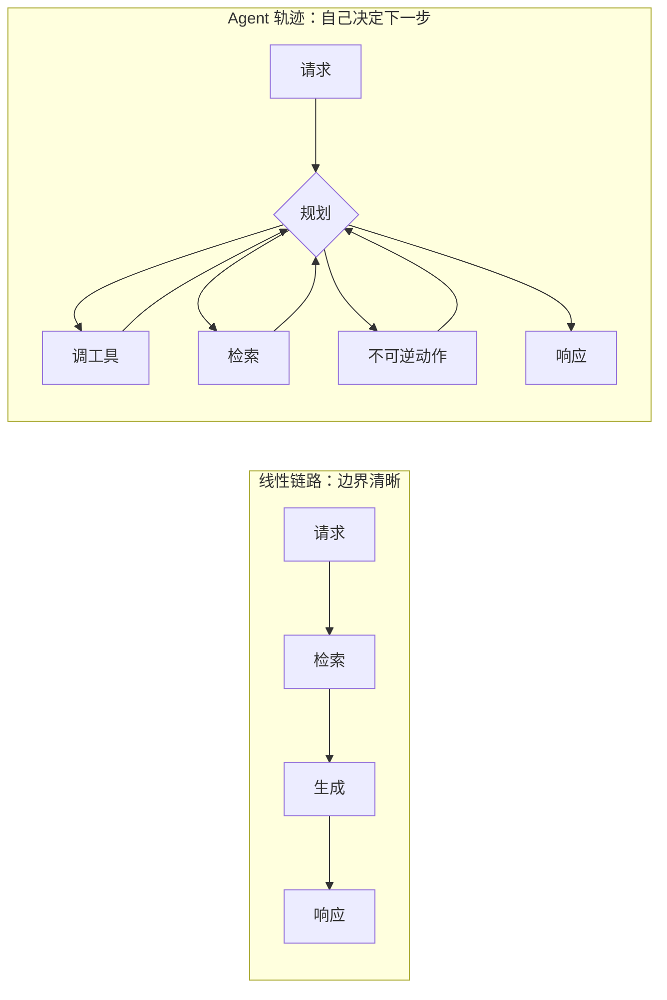
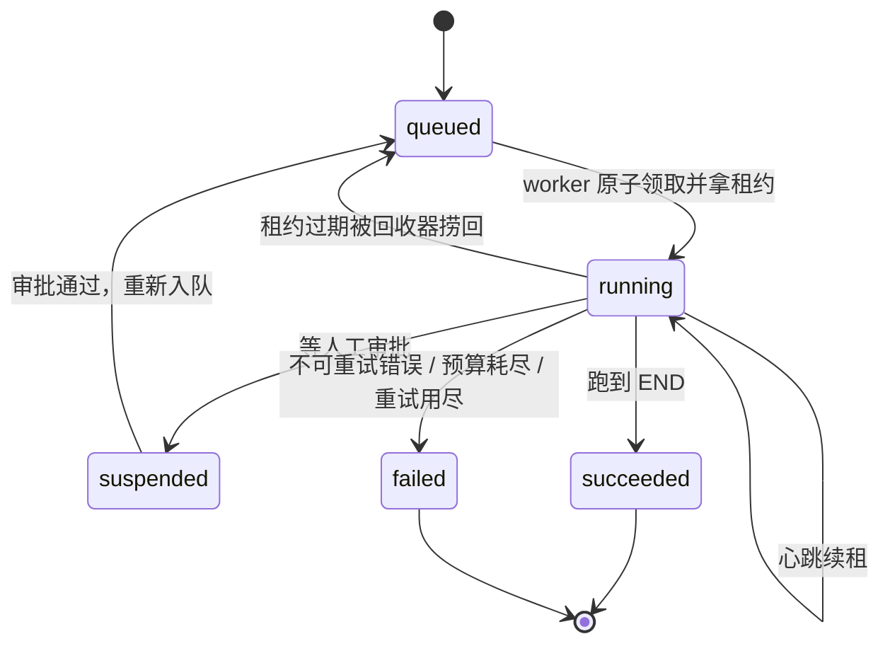

# Agent 生产可靠性：预算、熔断与断点续跑

> 普通接口的可靠性目标是"这次请求要么成功、要么干净地失败"。Agent 不是这样：它自己决定下一步、自己决定还要不要再来一次，一次调用背后是一条会分叉、会回环、会花钱、会动真实数据的轨迹。这篇讲怎么给这条轨迹装闸，以及每道闸各自换走了什么。

## 一次请求 vs 一条轨迹

写过 Node.js 接口的人对可靠性已经很熟：超时、重试、限流、熔断、幂等。这些机制的保护对象是**一次确定的调用**——路径写死在代码里，你知道它会调几个下游、大概花多久。Agent 把这个前提拆掉了：调几次模型、调哪些工具、要不要再检索一遍，是模型在运行时决定的。

| 维度 | 普通接口 | Agent 轨迹 |
|---|---|---|
| 执行路径 | 代码写死，可枚举 | 模型运行时决定，不可枚举 |
| 调用次数 | 已知（1 次 DB + 2 次 RPC） | 未知，可能 3 步也可能 30 步 |
| 单位成本 | 基本恒定 | 步数 × 上下文长度，方差极大 |
| 失败面 | 下游挂了 | 下游挂了 + 选错工具 + 自己转圈 + 把失败信息当成事实 |
| 副作用 | 代码里能数清有几处写操作 | 模型决定调不调那个退款工具 |
| 中断代价 | 重试一次即可 | 前面几十步的成本与中间结果全丢 |
| 可靠性单位 | 一次请求 | **一条轨迹** |



右边那三条**回到决策节点的边**，就是本篇所有风险的来源。线性 RAG 链路（[RAG 工程链路](./rag-pipeline) 里的检索 → 重排 → 生成）步数固定、成本可估、没有自主副作用，普通接口那套超时加重试就够了，这篇的机制大半用不上。

**判断标准：** 图里只要有一条边能回到决策节点，这套机制就必须上；一条都没有，上了就是过度设计。这个不对称本身就是"该不该上"的依据，不用先去讨论"我们的 Agent 复杂不复杂"。

---

## 爆炸半径：五种失控与对应的闸

"爆炸半径"是这篇的组织方式：**先问每种失控在没有约束时能扩散到多大，再问用什么把它压成一个有界的数**。有界不等于不出事，但出事的规模你事先知道，这就是可运维和不可运维的分界线。

| 失控类型 | 无界时的半径 | 压到有界的手段 | 有界后的最坏结果 |
|---|---|---|---|
| 循环 | 步数无上限，同一个工具被调几十次直到撞框架保险 | 步数预算 + 动作签名去重 + 诚实收尾 | 最多 N 步，带部分结果退出 |
| 成本 | 单条轨迹费用无上限，一个 badcase 吃掉当天预算 | 轨迹级 token 钱包，软预算降级 / 硬预算收尾 | 单条轨迹费用 ≤ 预算上限 |
| 故障 | 一个坏依赖被反复调用，占满并发拖慢全部请求 | 三层超时 + 按依赖分键的熔断器 | 该依赖降级，其余能力正常 |
| 副作用 | 循环与节点重放导致重复退款、重复外发 | 副作用分级 + 幂等注册表 + 单轨迹不可逆动作配额 | 每个动作至多执行一次 |
| 崩溃 | 进程被杀，轨迹永久卡住，没人知道它存在过 | 任务注册表 + Checkpointer 续跑 + 孤儿回收 | 换副本续跑，已完成节点不重做 |

还有第六种不算失控但同样致命的情况：**看不见**。上面五种都发生过而你不知道，等于闸没装。所以后面还有轨迹体检报告和混沌评估两节——一个负责事后能看清，一个负责事前能验证。

::: tip 这篇假设你已经有的东西
单个工具的重试、错误分类、参数校验见 [Tool Calling 与结构化输出](./agent-tool-calling)；图结构、State、Checkpointer 基础见 [LangGraph 状态机与 Checkpoint](./agent-langgraph)；人工审批的挂起与恢复见 [Multi-Agent 编排与人工兜底](./agent-multi-agent)。本篇讲的是**架在这些之上的轨迹级治理**，重复的地方一句话带过。
:::

---

## 步数预算：让轨迹知道自己跑了多久

`recursion_limit` 是框架给的最后一道保险，它统计超步数、触发时抛异常，你无法从中拿到部分结果，也无法区分"正常的复杂任务"和"路由写错了"（细节见 [循环与终止](./agent-langgraph)）。业务上真正可控的那道闸必须是**你自己放在 State 里的计数器**。

| | `recursion_limit` | 业务步数预算 |
|---|---|---|
| 语义 | 图执行了多少个超步 | 这条轨迹做了多少个有意义的动作 |
| 触发结果 | 抛 `GraphRecursionError` | 走收尾节点，带部分结果返回 |
| 能否分级 | 不能 | 能（不同意图给不同预算） |
| 能否观测 | 只能看异常计数 | 每条轨迹都有实际步数，可做分布 |
| 定位 | 兜底保险，触发即告警 | 主要手段，触发是正常业务分支 |

### 计数器放进 State，用 reducer 累加

```python
import operator, hashlib, json, time
from typing import Annotated, Literal
from typing_extensions import TypedDict
from langgraph.graph.message import add_messages

class StepRecord(TypedDict):
    node: str; action_sig: str; duration_ms: int; cost_usd: float   # action_sig 见下一节

class Budget(TypedDict):
    max_steps: int; max_tool_calls: int           # 工具调用上限通常小于步数上限
    max_cost_usd: float; max_wall_ms: int
    max_irreversible: int                         # 不可逆动作次数，多数业务是 1

class TrajState(TypedDict):
    messages: Annotated[list, add_messages]
    budget: Budget                                # 入口写一次，之后只读
    steps: Annotated[int, operator.add]           # 节点返回 {"steps": 1}，reducer 累加
    tool_calls: Annotated[int, operator.add]
    spent_usd: Annotated[float, operator.add]
    trace: Annotated[list[StepRecord], operator.add]
    guards: Annotated[list[str], operator.add]    # 触发过哪些保护，最后进体检报告
    stop_reason: str | None
    answer: str
```

用 reducer 累加而不是每个节点读旧值加一，原因和并行有关：并行扇出的几个节点如果都写一个无 reducer 的 `steps`，会直接报 `InvalidUpdateError`；用 `operator.add` 才能正确合并。

### 动作签名去重：转圈的定义是"重复同一个动作"

步数用尽只是结果，更早的信号是**同一个动作反复出现**。模型转圈通常长这样：用同样的参数查同一个订单三次，或者在两个工具之间来回摆动。把动作规范化成一个签名，检测就变成几行字符串比较。

```python
VOLATILE = {"ts", "timestamp", "request_id", "nonce", "attempt", "trace_id"}

def action_signature(tool: str, args: dict) -> str:
    """动作签名 = 工具名 + 规范化参数指纹。
    必须剔除易变字段：带上时间戳，每次签名都不同，去重直接失效"""
    stable = {k: v for k, v in sorted(args.items()) if k not in VOLATILE}
    blob = json.dumps(stable, sort_keys=True, ensure_ascii=False, separators=(",", ":"))
    return f"{tool}:{hashlib.sha1(blob.encode()).hexdigest()[:12]}"

def detect_spin(trace: list[StepRecord], repeat: int = 3) -> str | None:
    """两种转圈都要认：连续重复同一动作，以及 A-B-A-B 双动作摆动"""
    sigs = [s["action_sig"] for s in trace if s["action_sig"]]
    if len(sigs) >= repeat and len(set(sigs[-repeat:])) == 1:
        return f"spin:repeat:{sigs[-1]}"
    if len(sigs) >= 4 and (a := sigs[-4]) == sigs[-2] and (b := sigs[-3]) == sigs[-1] and a != b:
        return f"spin:oscillate:{a}|{b}"           # A-B-A-B 摆动
    return None
```

**踩坑：** 阈值不要设成 2。合法的重复很常见——分页拉第二页、审批通过后重查状态确认、并行检索命中同一个文档。`repeat=3` 加上"必须连续"这两个条件一起用，误伤率才降得下来。上线后拿纯净跑的样本验证一遍，见后面的零税回归。

### 达到上限时诚实收尾

到了上限有三种做法，只有一种能用：

| 收尾方式 | 用户看到 | 排障 | 问题 |
|---|---|---|---|
| 抛异常 | 500 / "系统异常" | 有堆栈 | 前面几十步的钱全白花，用户什么都没拿到 |
| 让模型硬编一个答案 | 一个像样的答案 | 无迹可寻 | **最危险**：预算耗尽时答案质量最差，却看起来最正常 |
| 诚实收尾（推荐） | 部分结论 + 卡在哪 + 下一步建议 | `stop_reason` 一眼定位 | 要提前设计"部分结果"怎么表达 |

```python
HANDOFF_REASONS = ("spin:", "breaker_open", "budget_hard_stop")

def honest_stop(state: TrajState, reason: str) -> dict:
    """带着已经拿到的东西退出，并说清缺什么。
    不抛异常（那是把成本变成 500），也不让模型补全（那是把成本变成幻觉）"""
    done = [s for s in state["trace"] if s["action_sig"]]
    return {"stop_reason": reason, "guards": [reason],
            "needs_human": reason.startswith(HANDOFF_REASONS),
            "answer": ("我已经确认到这些信息：\n" + render_confirmed(state) +
                       f"\n\n这次没有查完（{REASON_TEXT.get(reason, reason)}），已完成 {len(done)} 步。"
                       "缺少的部分是：" + render_missing(state) +
                       "\n你可以补充信息后重试，我会从当前进度接着查。")}
```

最后一句"我会从当前进度接着查"不是话术：轨迹的 checkpoint 还在，`thread_id` 也还在，后面的断点续跑一节会把这句话变成真的。

预算检查不要散在每个节点，散了必漏。收到决策节点后面那个路由函数里，一处判断全图受益：

```python
def guard_router(state: TrajState) -> Literal["act", "answer", "stop"]:
    """所有预算判断的唯一入口。返回 'stop' 就走收尾节点，不再调模型"""
    b = state["budget"]
    if (detect_spin(state["trace"]) or state["steps"] >= b["max_steps"]
            or state["tool_calls"] >= b["max_tool_calls"]
            or state["spent_usd"] >= b["max_cost_usd"]):
        return "stop"                             # 转圈判断放最前：能比步数用尽更早止损
    return "act" if has_pending_tool_calls(state) else "answer"

builder.add_conditional_edges("plan", guard_router,
                              {"act": "tools", "answer": "compose", "stop": "wrap_up"})
```

**生产推荐：** 预算按意图分级，别全局一个值。"查订单状态"给 6 步，"跨月账单对账"给 25 步。一个值同时满足这两类需求，结果一定是简单任务放行太宽、复杂任务砍得太早。

---

## 成本预算：轨迹级 token 钱包

成本失控的形态不是"平均单价涨了"，而是**长尾极重**：99% 的轨迹几分钱，0.5% 的轨迹因为转圈或上下文膨胀花掉几百倍。看均值永远发现不了，必须给每条轨迹配一个钱包。

### 用量要从 usage_metadata 拿，不要估

```python
PRICE = {"big": {"in": 3.00, "out": 15.00},        # 每 1M token 美元单价，放配置中心
         "small": {"in": 0.25, "out": 1.25}}

def call_cost(msg, tier: str) -> float:
    """AIMessage.usage_metadata 里是真实用量，还能区分缓存命中。
    自己用 len(text)/4 估，长上下文下偏差很大，且完全漏掉推理 token"""
    u, p = getattr(msg, "usage_metadata", None) or {}, PRICE[tier]
    cached = u.get("input_token_details", {}).get("cache_read", 0)   # 缓存命中部分更便宜
    fresh = max(u.get("input_tokens", 0) - cached, 0)
    return (fresh * p["in"] + cached * p["in"] * 0.1 + u.get("output_tokens", 0) * p["out"]) / 1e6
```

### 软预算降级，硬预算收尾

一档不够用。只有硬上限的话，一条轨迹在 99% 处被砍掉，前面的钱全浪费；加一档软预算，它可以换个便宜的模型把剩下的活干完。

| 档位 | 阈值 | 动作 | 用户体感 |
|---|---|---|---|
| 正常 | < 70% | 用主模型 | 无感 |
| 软预算 | 70% - 100% | 降级到小模型，同时收紧检索 Top-K 和历史轮数 | 答案略粗，任务仍完成 |
| 硬预算 | ≥ 100% | 不再调模型，诚实收尾 | 拿到部分结果和明确说明 |

```python
SOFT_RATIO = 0.7

async def plan(state: TrajState) -> dict:
    """决策节点：先看钱包，再决定用哪个模型"""
    spent, cap = state["spent_usd"], state["budget"]["max_cost_usd"]
    if spent >= cap:
        return honest_stop(state, "budget_hard_stop")
    tier = "small" if spent >= cap * SOFT_RATIO else "big"     # tier 同时决定上下文预算
    t0 = time.monotonic()
    msg = await MODELS[tier].ainvoke(assemble(state, tier))
    cost, ms = call_cost(msg, tier), int((time.monotonic() - t0) * 1000)
    return {"messages": [msg], "steps": 1, "spent_usd": cost,
            "guards": ["cost_soft_degrade"] if tier == "small" else [],
            "trace": [{"node": "plan", "action_sig": "", "duration_ms": ms, "cost_usd": cost}]}
```

### 按节点分摊，找出成本大头

`trace` 里每条记录都带 `node` 和 `cost_usd`，按 `node` 聚合求和就知道钱花在哪。这一步经常给出反直觉的结论：花钱最多的往往不是生成答案的节点，而是那个**每次循环都要重新带上全部工具 schema 和历史的决策节点**。

| 现象 | 大头节点 | 通常的真实原因 | 先动哪一刀 |
|---|---|---|---|
| 决策节点占 60%+ | `plan` | 每轮重发全部工具 schema + 未裁剪的历史 | 工具按意图分组、历史裁剪 |
| 工具节点占大头 | `tools` | 工具返回大 JSON 直接进上下文 | 返回值整形（见 [上下文工程](./agent-context)） |
| 生成节点占大头 | `compose` | 检索证据没收敛，Top-K 给太多 | 重排后取 Top-K，见 [检索与重排](./rag-retrieval) |
| 总步数正常但很贵 | 分布均匀 | 上下文本身太长，每步都贵 | 上下文账本，同上 |

成本口径、埋点和看板怎么做，见 [可观测与追踪](./agent-observability)。这里只强调一点：**钱包必须在轨迹内部实时可读**，事后从日志里算出来的成本只能做报表，不能做闸。

---

## 超时与熔断

### 三层超时，各管一件事

只设一层一定漏。三层的保护对象完全不同：

| 层级 | 保护对象 | 典型值 | 实现 | 超时后 |
|---|---|---|---|---|
| 单次模型调用 | 一次 HTTP 挂住不返回 | 非流式 60s；流式按首字 10s + 空闲 20s | SDK 的 `timeout` / `request_timeout` | 归类 `TIMEOUT`，按失败矩阵退避重试 |
| 单个节点 | 节点内多次调用累积变慢 | 90s | `asyncio.wait_for` 包住节点函数 | 节点返回结构化失败，图走降级边继续 |
| 整条轨迹 | 每步都不慢但总量超了 | 同步接口 55s；异步任务 15min | 外层 `wait_for` + deadline 往下传 | 诚实收尾，落 checkpoint 供续跑 |

关键细节是**往下传截止时间而不是超时时长**。整条轨迹只剩 8 秒而节点超时写死 90 秒，这层保护在此刻等于不存在。实现上把一个 `expire_at`（`time.monotonic()` 基准）放进 `RunnableConfig` 的 `configurable`，每层取 `min(剩余时间, 本层上限)` 当超时值，剩余 ≤ 0 直接抛轨迹超时。它不能放进 State——绝对时刻序列化进 Checkpoint 后跨进程毫无意义，续跑时必须重建。

### 三态熔断器

超时只保护单次调用，熔断保护的是**别一直去撞一个已经死了的依赖**。这件事在 Agent 里比在普通接口里更要紧：模型看到失败会倾向于"换个参数再试一次"，于是一条轨迹能把一个挂掉的接口调七八次。三态的含义是 `closed` 正常放行、`open` 冷却期直接拒绝、`half_open` 放一个探针试水，探针再失败则冷却时间翻倍。

```python
from dataclasses import dataclass, field

@dataclass
class CircuitBreaker:
    """按【依赖】分键，不要全局一个——订单接口挂了不该让知识库检索也降级"""
    fail_threshold: int = 5; window_s: float = 60.0
    cooldown_s: float = 30.0; max_cooldown_s: float = 300.0
    _fails: list[float] = field(default_factory=list)
    _state: str = "closed"; _open_until: float = 0.0; _cooldown: float = 0.0

    def allow(self) -> bool:
        if self._state == "open":
            if time.monotonic() < self._open_until:
                return False                # 冷却中：直接拒绝，连超时时间都不消耗
            self._state = "half_open"       # 冷却到了：放一个探针进去
        return True                         # closed 与 half_open 都放行

    def on_success(self) -> None:
        self._fails.clear(); self._state, self._cooldown = "closed", 0.0

    def on_failure(self) -> None:
        now = time.monotonic()
        if self._state == "half_open":      # 探针失败：冷却翻倍，防抖动
            self._cooldown = min(max(self._cooldown, self.cooldown_s) * 2, self.max_cooldown_s)
        else:
            self._fails = [t for t in self._fails if now - t < self.window_s] + [now]
            if len(self._fails) < self.fail_threshold:
                return
            self._cooldown = self.cooldown_s
        self._state, self._open_until = "open", now + self._cooldown

BREAKERS: dict[str, CircuitBreaker] = {}          # 按依赖名分键
def breaker(dep: str) -> CircuitBreaker:
    return BREAKERS.setdefault(dep, CircuitBreaker())
```

只有**超时和 5xx 才算失败**。参数错误、业务拒绝、权限不足都是"依赖正常工作并明确回答了你"，把它们计入失败会让熔断器被业务逻辑打开——用户连着问五个超出退款期的订单，退款接口就被熔断了。分类口径直接沿用 [失败处理矩阵](./agent-tool-calling)。

::: warning 多副本下内存熔断器只是局部视图
每个副本独立计数，10 个副本意味着坏依赖要挨 50 次失败才全部熔断。要全局视图就把滑动计数放 Redis（`INCR` + `EXPIRE` 做分钟桶，或直接 `ZADD` 时间戳做滑动窗口），代价是每次判断多一次网络往返。折中做法：本地熔断做快速反应，Redis 计数做全局告警，见 [Redis 深入](./redis-deep)。
:::

---

## 结构化降级协议：失败必须长得像失败

这一节是全篇最容易被忽略、代价又最直接的一条。普通接口降级，返回值给的是调用方的代码，代码看得懂错误码。Agent 降级，返回值给的是**模型**，而模型对"这段文字是事实还是错误说明"没有任何天然的分辨能力。你返回一段自然语言的报错，它会当成上下文里的一条事实继续往下推。

### 反例与正例

```python
# 反例：把异常拼成一句话丢回上下文
async def get_order_bad(order_id: str) -> str:
    try:
        data = await api.get(f"/orders/{order_id}", timeout=5)
        return f"订单信息：{data}"
    except Exception as e:
        return f"查询订单时出错了：{e}"     # 模型接着说："您的订单当前状态正常，预计三天内送达。"
```

模型不是在幻觉，它是在**把你给它的字符串当输入用**。这类 badcase 在评测里极难发现，因为输出格式完全正确、语气完全自然，只有对照真实数据才看得出是编的。

```python
from pydantic import BaseModel, Field

class ToolResult(BaseModel):
    """成功和失败共用一个 schema，靠 ok 区分——模型的解析路径才唯一"""
    ok: bool
    code: str                              # OK / TIMEOUT / NOT_FOUND / FORBIDDEN / ...
    data: dict | None = None               # 失败时必须是 None，不能给空壳
    degraded: bool = False                 # 这是降级数据，不是权威数据
    as_of: str | None = None               # 降级数据的时间点，让模型能说"截至 X 时"
    message: str = ""                      # 给模型和用户看的人话
    next_action: str = ""                  # retry / clarify / handoff / stop

async def get_order(order_id: str) -> ToolResult:
    bk = breaker("order_api")
    if not bk.allow():
        return ToolResult(ok=False, code="DEP_UNAVAILABLE", next_action="handoff",
                          message="订单系统暂时不可用，无法确认订单状态。不要推测状态。")
    try:
        data = await api.get(f"/orders/{order_id}", timeout=5)
        bk.on_success()
        return ToolResult(ok=True, code="OK", data=pick(data, ORDER_FIELDS))
    except asyncio.TimeoutError:
        bk.on_failure()
        if snap := await cache.get(f"order:{order_id}"):       # 有旧值就降级返回
            return ToolResult(ok=True, code="STALE", data=snap, degraded=True,
                              as_of=snap["cached_at"],
                              message="这是缓存快照，非实时状态，涉及承诺前必须复核。")
        return ToolResult(ok=False, code="TIMEOUT", next_action="retry",
                          message="订单系统超时，本次未获取到状态。")
```

### 三条硬规则

| 规则 | 违反后会发生什么 |
|---|---|
| 失败与成功**结构同形**，只靠 `ok` / `code` 区分 | 模型要走两套解析路径，失败分支的 few-shot 覆盖不到，行为不可控 |
| 失败时 `data` 必须是 `null`，不能给"看起来像数据"的空壳 | `{"status": "unknown"}` 会被当成状态真的是 unknown，然后写进答案 |
| 降级数据必须打 `degraded` + `as_of`，并在系统提示里写死用法 | 缓存里三天前的物流状态被当成实时状态承诺给用户 |

系统提示里对应的那句约束要写得没有解释空间：

```text
工具返回 ok=false 时，你没有获得该信息，禁止推测其取值，只能向用户说明未获取到。
工具返回 degraded=true 时，回答里必须带上 as_of 时间，且不得基于它做任何承诺（时效、金额、可否办理）。
```

### 静默空列表是最毒的一种

`ok=true` + `data={"items": []}` 在语义上说的是"我查了，确实没有"。但检索层出故障时返回空列表、权限过滤后剩零条、查询条件拼错命中零行，产生的也是同一个值。模型看到没有证据，就会退回参数记忆里编一个答案。

**生产推荐：** 空结果必须能区分三种来源——`EMPTY_RESULT`（查了没有）、`EMPTY_AFTER_FILTER`（有但被权限过滤）、`RETRIEVER_ERROR`（检索本身失败）。前者可以正常回答"没有查到"，后两者必须走降级或转人工。引用与"无证据不作答"的具体做法见 [引用与可溯源](./rag-citation)。

---

## 副作用与幂等：轨迹级的一致性

单个工具怎么写幂等键、怎么用 Redis 加数据库唯一索引兜底，[Tool Calling](./agent-tool-calling) 已经讲过。这一节讲的是**轨迹这一层多出来的三个问题**：一条轨迹里能做几次不可逆动作、节点重放时怎么知道动作已经做过了、崩溃恢复时"状态未知"该怎么处理。

### 副作用三级分类

分级不是为了好看，是为了让恢复策略有依据。恢复的时候你只需要问一句"这个节点是几级"。

| 级别 | 定义 | 例子 | 重放策略 | 崩溃恢复策略 | 要不要人工 |
|---|---|---|---|---|---|
| L0 只读 | 不改变任何外部状态 | 查订单、检索、算价、算运费 | 随便重放 | 直接重跑，最多多花点钱 | 否 |
| L1 可重放 | 改状态但幂等或可撤销 | 更新草稿、打标签、写缓存、记日志 | 带幂等键重放 | 幂等键兜底重跑 | 否 |
| L2 不可逆 | 动钱、外发、删除、对外公开 | 退款、下单、发短信、删数据、发工单 | **禁止自动重放** | 先查幂等注册表确认是否已执行 | 是 |

三条随之而来的工程约束：

- **L2 动作独占一个节点。** 节点边界前后各写一次 checkpoint，恢复时才能精确区分"卡在执行前"和"卡在执行后"。把退款和"更新会话状态"塞进同一个节点，这个区分就消失了。
- **L2 节点之前不能有 `interrupt`。** 恢复时当前节点从头重跑，`interrupt` 之前的副作用会执行两遍（细节见 [Multi-Agent 人工兜底](./agent-multi-agent)）。
- **单轨迹 L2 配额也是预算的一部分。** `max_irreversible: 1` 拦住的是"模型在循环里连着退了三次款"——这类事故里每一次退款单独看都是幂等的、参数都不同，只有轨迹级配额拦得住。判断很简单：统计 `trace` 里 `action_sig` 以 `L2:` 开头的条数，到顶就返回 `IRREVERSIBLE_QUOTA_EXCEEDED` 并转人工。

### 幂等键：不含时间戳，不含随机数

```python
def idem_key(*, thread_id: str, action: str, payload: dict) -> str:
    """轨迹级幂等键 = 线程 ID + 动作名 + 业务内容指纹。
    含时间戳/随机数/重试次数 = 每次都是新键 = 等于没有幂等"""
    stable = {k: v for k, v in sorted(payload.items()) if k not in VOLATILE}
    blob = json.dumps(stable, sort_keys=True, ensure_ascii=False).encode()
    return f"idem:{thread_id}:{action}:{hashlib.sha256(blob).hexdigest()[:16]}"
```

`thread_id` 进键的含义是"同一条轨迹里的同一个动作只做一次"。要不要跨轨迹去重看业务：退款用**业务键**（`refund:order_id:amount`）跨轨迹也只能成功一次，发通知这类可以按轨迹隔离。两种键的取舍那张表在 [幂等设计](./agent-tool-calling) 里。

### 幂等注册表：两阶段写库

```sql
CREATE TABLE agent_side_effect (
    idem_key    TEXT PRIMARY KEY,                  -- 唯一约束是最终防线
    thread_id   TEXT NOT NULL,
    action      TEXT NOT NULL,
    level       SMALLINT NOT NULL,                 -- 0 / 1 / 2
    state       TEXT NOT NULL,                     -- pending / done / failed
    result      JSONB,
    created_at  TIMESTAMPTZ NOT NULL DEFAULT now(),
    updated_at  TIMESTAMPTZ NOT NULL DEFAULT now()
);
CREATE INDEX ON agent_side_effect (thread_id, created_at DESC);
CREATE INDEX ON agent_side_effect (updated_at) WHERE state = 'pending';  -- 扫悬挂
```

```python
PENDING_STALE_S = 120

async def execute_effect(conn, *, key: str, action: str, level: int, fn) -> ToolResult:
    """两阶段：先落 pending 再执行再改 done。
    ON CONFLICT DO NOTHING 让并发和重放都只有一个赢家"""
    row = await conn.fetchrow(
        """INSERT INTO agent_side_effect (idem_key, thread_id, action, level, state)
           VALUES ($1, $2, $3, $4, 'pending')
           ON CONFLICT (idem_key) DO NOTHING RETURNING idem_key""",
        key, thread_id_of(key), action, level)

    if row is None:                                    # 已存在：读上次的结局
        prev = await conn.fetchrow(
            "SELECT state, result, updated_at FROM agent_side_effect WHERE idem_key = $1", key)
        if prev["state"] == "done":
            return ToolResult(**prev["result"])        # 幂等命中：返回完全相同的结果
        if prev["state"] == "failed":
            return ToolResult(ok=False, code="PREVIOUSLY_FAILED", next_action="handoff",
                              message="同样的操作上次已失败，不自动重试。")
        if (now_utc() - prev["updated_at"]).total_seconds() < PENDING_STALE_S:
            return ToolResult(ok=False, code="IN_PROGRESS", next_action="retry",
                              message="同样的操作正在处理，请稍候。")
        return ToolResult(ok=False, code="EFFECT_UNKNOWN", next_action="handoff",
                          message="上次操作结果未知，已转人工对账，不重复执行。")
    try:
        result = await fn()                            # 真正执行
        await conn.execute("""UPDATE agent_side_effect SET state = 'done', result = $2,
                              updated_at = now() WHERE idem_key = $1""", key, result.model_dump())
        return result
    except Exception:
        await conn.execute("""UPDATE agent_side_effect SET state = 'failed',
                              updated_at = now() WHERE idem_key = $1""", key)
        raise
```

`EFFECT_UNKNOWN` 是分布式里最难、也最不该被糊过去的一格：进程在 `fn()` 执行中被杀，下游可能收到了请求也可能没收到，你无从判断。**唯一正确的处理是既不重放也不当失败，转人工或走对账**——当失败会漏掉一笔已发生的退款，当成功会漏掉一笔没发生的。事务边界与隔离级别的取舍见 [并发、事务与一致性](./concurrency-transaction)。

### dry-run 模式

```python
async def execute(action: str, payload: dict, *, level: int, ctx: dict) -> ToolResult:
    """所有副作用的唯一出口。dry-run 判断必须在这里；
    让每个工具自己判断，漏一个就等于整个机制没有"""
    if ctx["dry_run"] and level >= 1:
        return ToolResult(ok=True, code="DRY_RUN", degraded=True,
                          data={"would_execute": action, "payload": redact(payload)},
                          message="演练模式：本次未真正执行，返回的是计划动作。")
    if level >= 2 and (blocked := check_quota(ctx["state"], action)):
        return blocked                                 # L2 配额，见上一节
    return await execute_effect(ctx["conn"], key=idem_key(**ctx["idem"]), action=action,
                                level=level, fn=lambda: REGISTRY[action](payload, ctx))
```

| dry-run 的用途 | 为什么需要它 |
|---|---|
| 评测集跑真实轨迹 | 想测"模型会不会该退款时退款"，又不能真的退。缺了它，涉及写操作的用例只能靠人工看 |
| 上线前灰度观察 | 先跑一周只看它"打算做什么"，比看单测更能暴露 Prompt 问题 |
| 线上问题复现 | 拿同一条轨迹的输入重跑，看决策是否一致，不污染数据 |

**踩坑：** dry-run 的返回值也要走结构化协议（`degraded=True` + 明确 message）。返回一句"操作成功"，模型会告诉用户退款已到账。

---

## 断点续跑：Checkpointer 只解决一半问题

Checkpointer 能让你用同一个 `thread_id` 调 `ainvoke(None, config)` 从失败节点继续（做法见 [LangGraph Checkpoint](./agent-langgraph)）。但它有个前提没人替你满足：**得有人知道这条轨迹还没跑完，并且去调这一句。** 进程被 `SIGKILL` 之后，checkpoint 静静躺在库里，没有任何东西会去唤醒它。补上这一半需要一张任务注册表。

| | Checkpointer | 任务注册表 |
|---|---|---|
| 存什么 | 每个节点后的 State 快照 | 任务生命周期、归属副本、租约、预算余额、图版本 |
| 谁读 | LangGraph 运行时 | 调度器、回收器、运维面板 |
| 恢复时的作用 | 决定从哪个节点接着跑 | 决定这条轨迹该不该被恢复、由谁恢复 |
| 缺了会怎样 | 只能从头重跑，钱白花 | 崩溃后没人知道有任务卡着，用户永远等不到结果 |



```sql
CREATE TABLE agent_task (
    task_id         TEXT PRIMARY KEY,
    thread_id       TEXT NOT NULL UNIQUE,          -- 与 Checkpointer 一一对应
    graph_version   TEXT NOT NULL,                 -- 灰度期防止用新图恢复旧 State
    state           TEXT NOT NULL,                 -- queued/running/suspended/succeeded/failed
    owner           TEXT, lease_expire_at TIMESTAMPTZ,   -- 归属副本 + 租约，靠心跳续
    attempt         SMALLINT NOT NULL DEFAULT 0, max_attempt SMALLINT NOT NULL DEFAULT 3,
    budget_left     JSONB NOT NULL,                -- 续跑不能重置预算，否则上限失效
    stop_reason     TEXT,
    updated_at      TIMESTAMPTZ NOT NULL DEFAULT now()
);
CREATE INDEX ON agent_task (state, lease_expire_at);
```

`budget_left` 这一列容易漏。续跑时如果重新发一份完整预算，一条不断崩溃重启的轨迹就能无限花钱——预算必须跟着任务走，而不是跟着"这次执行"走。

### 恢复：已完成的节点不重做

```python
WORKER_ID = f"{socket.gethostname()}:{os.getpid()}"

async def claim(conn, task_id: str, *, lease_s: int = 120) -> dict | None:
    """原子领取：带条件的 UPDATE 是唯一的互斥点，LangGraph 层不做互斥"""
    return await conn.fetchrow(
        """UPDATE agent_task SET state = 'running', owner = $2, attempt = attempt + 1,
                  lease_expire_at = now() + ($3 || ' seconds')::interval, updated_at = now()
            WHERE task_id = $1 AND state = 'queued'
        RETURNING task_id, thread_id, graph_version, budget_left, attempt""",
        task_id, WORKER_ID, str(lease_s))

async def resume(conn, task_id: str) -> None:
    task = await claim(conn, task_id)
    if task is None:
        return                                          # 别人领走了，或者已经结束了
    if task["graph_version"] != CURRENT_GRAPH_VERSION:   # 图变了，旧 State 可能反序列化失败
        await mark(conn, task_id, "failed", stop_reason="needs_migration"); return
    cfg = {"configurable": {"thread_id": task["thread_id"], "budget": task["budget_left"]},
           "recursion_limit": 40}
    if (await graph.aget_state(cfg)).next == ():        # 其实已跑完，只是没来得及改任务状态
        await mark(conn, task_id, "succeeded"); return
    async with heartbeat(conn, task_id, every_s=30):     # 续租，否则会被回收器抢走
        await graph.ainvoke(None, cfg)                   # None = 从 checkpoint 继续
    await mark(conn, task_id, "succeeded")
```

`.next == ()` 那一行是真实会遇到的竞态：图跑完了，改任务状态的那条 UPDATE 还没提交进程就死了。不判断这一格，任务会被回收器反复捞起来，每次都发现无事可做。

### 孤儿回收：判据必须是租约过期

```sql
-- 回收器每 30 秒一次：租约过期说明持有者已经死了
UPDATE agent_task
   SET state = CASE WHEN attempt >= max_attempt THEN 'failed' ELSE 'queued' END,
       stop_reason = CASE WHEN attempt >= max_attempt THEN 'max_attempt' ELSE NULL END,
       owner = NULL, lease_expire_at = NULL, updated_at = now()
 WHERE state = 'running' AND lease_expire_at < now()
RETURNING task_id, thread_id, attempt;
```

**踩坑：** 判据不能写成"running 超过 10 分钟就回收"。Agent 长任务本来就可能跑半小时，按绝对时长回收会把正常任务反复打断，而且每次打断都要重跑当前节点。心跳 + 租约的完整实现（含优雅停止时主动释放租约）见 [后台任务与 Worker](./background-worker)，那边的机制这里直接复用，唯一区别是恢复动作从"重跑整个任务"换成了"从 checkpoint 继续"。

### 多副本部署的四个坑

| 问题 | 症状 | 做法 |
|---|---|---|
| 两个副本同时恢复同一 thread | State 互相覆盖，副作用执行两次 | 领取用带条件的原子 `UPDATE`，只有一个赢家；Checkpointer 自己不提供互斥 |
| 恢复后节点重放导致重复副作用 | 重复退款 | L2 动作独占节点 + 幂等注册表，见上一节 |
| 副本有本地状态 | 恢复后找不到中间产物文件 | 工作区放共享卷或对象存储，见 [上下文工程](./agent-context) 的文件工作区一节 |
| 灰度期新旧图共存 | 反序列化失败或节点名找不到 | 任务表记 `graph_version`，不匹配就标 `needs_migration` 而不是硬恢复 |

**生产推荐：** 优雅停止时主动把自己持有的任务改回 `queued` 并清空租约，别等回收器超时。滚动发布时这一步能把恢复延迟从"租约时长"降到"秒级"。

---

## 轨迹体检报告：一次运行输出一行结论

前面所有闸都会留下痕迹，但痕迹散在日志里等于没有。**一条轨迹结束时写一行结构化记录**，排障方式就从"翻 500 行日志找线索"变成"看一行知道这条轨迹为什么慢、为什么贵、被哪道闸拦了"。

```python
from datetime import datetime

class TrajectoryReport(BaseModel):
    trace_id: str; thread_id: str; task_id: str | None = None
    graph_version: str; intent: str | None = None    # 按意图分组看指标比看总体有用得多
    started_at: datetime; wall_ms: int
    steps: int; llm_calls: int; tool_calls: int
    tokens_in: int; tokens_out: int; cost_usd: float
    node_ms: dict[str, int]; node_cost: dict[str, float]   # 节点 → 耗时 / 花费
    guards_fired: list[str]        # cost_soft_degrade / spin:repeat / breaker:billing_api ...
    degraded_tools: list[str]      # 返回过 degraded=true 的工具
    empty_results: list[str]       # 返回过空结果的工具，幻觉的高发前置条件
    side_effects: list[dict]       # [{action, level, idem_key, state}]
    retries: dict[str, int]        # 依赖 → 重试次数
    stop_reason: str               # completed / budget_* / spin:* / timeout / handoff / error
    final_state: str               # answered / partial / handoff / failed
    error: dict | None = None
```

::: details 一条典型的体检报告（软预算降级 + 一个依赖熔断）
```json
{
  "trace_id": "tr_01HQ...", "thread_id": "th_8842", "task_id": "tk_311",
  "graph_version": "v7", "intent": "对账", "wall_ms": 41830,
  "steps": 14, "llm_calls": 8, "tool_calls": 11, "cost_usd": 0.612,
  "tokens_in": 186420, "tokens_out": 4310,
  "node_ms": {"plan": 18240, "tools": 19100, "compose": 4490},
  "node_cost": {"plan": 0.474, "compose": 0.138},
  "guards_fired": ["cost_soft_degrade", "breaker:billing_api"],
  "degraded_tools": ["query_invoice"], "empty_results": [], "retries": {"billing_api": 3},
  "side_effects": [{"action": "create_ticket", "level": 1, "state": "done"}],
  "stop_reason": "completed", "final_state": "partial"
}
```
从这一行能直接读出：钱主要花在 `plan`（每轮重发上下文），`billing_api` 熔断导致发票数据是降级的，所以最终状态是 `partial` 而不是 `answered`。不需要打开任何日志。
:::

三张最常用的分析，都只查这一张表：

| 分析 | 查什么 | 看出什么 |
|---|---|---|
| `stop_reason` 分布 | 按意图分组计数 | 哪道闸在开火。某个意图 `budget_hard_stop` 占 8%，说明它的预算给少了 |
| 成本分位数 | `cost_usd` 的 P50 / P95 / P99 + `node_cost` 排序 | P99 是 P50 的 50 倍就是长尾问题，配合 `node_cost` 直接定位 |
| badcase 池 | `guards_fired` 含 `spin:*`，或 `empty_results` 非空 | 前者是路由/工具描述要修，后者是幻觉高危样本，直接进评测集 |

span 怎么埋、怎么接 OpenTelemetry 或 Langfuse、采样率怎么定，见 [可观测与追踪](./agent-observability)。这里只强调体检报告和 trace 的分工：**trace 用来看一条轨迹的细节，体检报告用来在几十万条轨迹里找出该看哪一条。**

---

## 混沌评估：主动注入故障，量化每道闸的收益

装了闸不等于闸有用。验证方式是**故意把故障造出来**，跑两遍——保护全关和保护全开——看差多少。

### 六类注入

| 故障 | 注入方式 | 期望行为 | 不该发生 |
|---|---|---|---|
| 模型超时 | 代理层按概率 sleep 超过 timeout | 退避重试，仍失败则降级小模型或诚实收尾 | 无限重试、请求堆积把并发占满 |
| 工具 5xx | mock 依赖返回 502 | 熔断打开，后续跳过该依赖走降级 | 每一步都去重试同一个死依赖 |
| 工具返回垃圾 | 返回半截 JSON、空对象、超长字符串 | schema 校验拒绝，`code=BAD_RESPONSE` | 垃圾进上下文被当成事实；超长字符串把窗口撑爆 |
| 检索为空 | 检索层返回 `[]` | 显式 `EMPTY_RESULT`，回答"没有查到" | 无证据硬答 |
| 限流 | 返回 429 + `Retry-After` | 按 `Retry-After` 退避，超预算则收尾 | 忽略 `Retry-After` 抖动重试，把限流拖长 |
| 进程被杀 | 随机步数后 `SIGKILL` | 回收器重新入队，续跑且不重复副作用 | 任务永久卡 `running`；退款执行两次 |

```python
@dataclass
class ChaosSpec:
    target: str                # "llm" / "tool:query_order" / "retriever" / "process"
    mode: str                  # timeout / http_500 / garbage / empty / rate_limit / kill
    p: float = 1.0             # 概率注入，用于压力场景
    at_step: int | None = None # 定点注入：指定第几步，保证可复现
    seed: int = 0
```

注入器包在统一执行层外面（模型客户端、工具分发器、检索器各一个钩子），按 `target` 匹配后返回 `mode` 让被包装的调用抛出对应故障。**可复现是关键**：随机注入只能证明"有时会挂"，定点注入才能验证"这道闸生效了"。所以每个用例固定 `seed` 和 `at_step`，失败时能一模一样地重放。

### 收益矩阵

同一批评测用例跑两遍，保护全关（`GUARDS_OFF`）和全开，对比四个指标。下面是矩阵的**形状**，数字必须用你自己的评测集跑出来填，口径写清楚（用例数、模型版本、注入概率）：

| 注入场景 | 关：完成率 | 关：均成本 | 关：P95 延迟 | 关：重复副作用 | 开：完成率 | 开：均成本 | 开：P95 延迟 | 开：重复副作用 |
|---|---|---|---|---|---|---|---|---|
| 模型超时 p=0.3 | ↓↓ | ↑↑↑ | ↑↑↑ | 0 | ↓ | ↑ | ↑ | 0 |
| 工具 5xx p=1.0 | ↓↓↓ | ↑↑↑ | ↑↑↑ | 0 | ↓（降级作答） | ≈ | ≈ | 0 |
| 返回垃圾 p=1.0 | 假高（答案是编的） | ≈ | ≈ | 0 | ↓（明确说未获取） | ≈ | ≈ | 0 |
| 检索为空 p=1.0 | 假高 | ≈ | ≈ | 0 | ↓（明确说没查到） | ≈ | ≈ | 0 |
| 限流 p=0.5 | ↓↓ | ↑↑ | ↑↑↑ | 0 | ≈ | ↑ | ↑ | 0 |
| 随机 kill | ↓↓↓（永久卡住） | 白花 | ∞ | **> 0** | ≈（续跑） | ↑（重跑部分节点） | ↑ | 0 |

::: warning "完成率"在故障场景下会误导人
第三、四行的关键：保护关闭时完成率**更高**，因为模型在没有数据的情况下也编出了一个完整答案。所以混沌评估的主指标不能只有完成率，必须配一个**正确率或忠实度**指标（答案是否被证据支持）。只看完成率，你会得出"保护机制让效果变差了"的错误结论。指标怎么建见 [Agent 效果评测](./agent-eval)。
:::

### 零税回归：无故障时必须什么都不变

装完闸还要跑一遍**完全不注入故障**的纯净集，确认三件事：

| 检查项 | 判据 | 不达标说明 |
|---|---|---|
| 行为一致 | 与不带保护时的答案一致率 ≥ 99%，不是"看起来差不多" | 某道闸在正常轨迹上也在改变行为 |
| 延迟无感 | P95 增幅 ≤ 5%。计数、签名、报告都是 O(1) 本地开销，本来就该看不出来 | 熔断器或幂等注册表放在了同步热路径上，或每步都在写库 |
| **闸全不响** | `guards_fired` 在纯净集上应当全空 | 阈值设错了，正在误伤正常轨迹 |

第三条最容易被跳过。上了保护就只盯着故障场景看，结果 `spin` 检测把"合法的连续两次分页查询"当成转圈掐断，线上表现是某类问题偶发地答一半——而这类问题在故障场景的评测里永远不会出现。

**生产推荐：** 把纯净集 + 两三个高价值注入场景做成 CI 门禁，和效果评测跑在一起。改熔断阈值、改预算、改降级文案都属于会改变行为的变更，必须过这道门禁。

---

## 保护机制的代价

每道闸都在拿**自主性、延迟或人力**换安全，没有一道是免费的。闸太紧 Agent 变成一个只会说"我查不到"的废物，太松等于把生产数据交给一个概率模型。

| 闸 | 换来 | 代价 | 设太紧的症状 | 设太松的症状 |
|---|---|---|---|---|
| 步数预算 | 不会转圈烧钱 | 复杂任务可能被中途砍断 | 多跳任务完成率明显低于单跳 | 出现 30 步以上的长尾轨迹 |
| 转圈检测 | 早于步数用尽就止损 | 合法重复会被误判 | 分页、复核类操作偶发被掐断 | 同一个动作重复五六次才停 |
| 成本硬上限 | 账单可预测 | 高价值请求也会被砍 | 重要客户的复杂问题答不完 | `cost_usd` 的 P99 是 P50 的几十倍 |
| 熔断 | 故障不扩散 | 依赖恢复后有一段恢复延迟 | 抖动一下就整体降级 | 一个坏依赖拖垮整条轨迹 |
| L2 配额 + 人工审批 | 不会误退款、不会重复退款 | 需要人力，延迟从秒级变分钟级 | 审批队列积压，用户等不起 | 一个 badcase 就是资金损失 |
| dry-run 默认开 | 上线期安全 | 演练与真实行为有偏差 | 忘记关，线上什么都没执行 | —— |

### 这道闸该紧还是松

不要按"这个功能重不重要"来定，按**动作的可逆性、金额、影响面**分档，标准才稳定：

| 动作特征 | 可逆性 | 金额 / 影响面 | 建议闸位 |
|---|---|---|---|
| 只读查询 | 完全可逆 | 无 | 最松：不设审批，只计成本与步数 |
| 可撤销写（草稿、标签、备注） | 撤销成本低 | 单用户 | 松：幂等键 + 审计日志，不设审批 |
| 小额且可追回 | 需人工操作可撤 | 低于金额阈值，单用户 | 中：置信度门槛 + 事后抽审 + 单轨迹配额 1 |
| 大额 / 不可追回 | 不可逆 | 高于金额阈值 | 紧：强制人工审批 + 单轨迹配额 1 + 双人复核 |
| 外发不可撤回（短信、邮件、对外发布） | 不可逆 | 多用户 / 对外 | 紧：审批 + 频次限流 + 内容审核，见 [Prompt 注入与安全](./agent-security) |
| 批量 / 全量操作（批改、批删） | 视操作 | 影响面 N | 最紧：**不给执行权，只给生成权** |

最后一行是一条值得写进规范的原则：**批量操作不让 Agent 执行，只让它生成一份待人工执行的操作单。** 单条动作出错影响一个用户，批量动作出错影响一批用户，而模型出错的概率对两者是一样的。

闸位也不是一次定死。上线初期全部往紧的方向设，随着 badcase 收敛、评测覆盖率上升，逐档放松——**放松的依据是评测数据，不是"跑了两周没出事，感觉可以了"**。反过来，任何一次线上事故之后收紧闸位，同时要在评测集里加上对应用例，否则下次放松时还会踩回去。

---

## 面试高频问题

### 1. Agent 的可靠性和普通接口的可靠性有什么不同？

- 保护单位不同：普通接口护"一次请求"，Agent 护"一条轨迹"。轨迹的路径由模型运行时决定，不可枚举。
- 因此多出五种失控：循环、成本、故障扩散、危险副作用、中途崩溃。前四种线性链路都没有。
- 判断要不要上这套机制看一件事：图里有没有边能回到决策节点。线性 RAG 链路（检索 → 生成）不需要，带循环的 Agent 必须要。
- 组织方式用"爆炸半径"：先问每种失控无界时能扩散到多大，再问用什么把它压成一个有界的数。有界不等于不出事，但规模事先知道。

### 2. 怎么防止死循环和成本失控？`recursion_limit` 够不够？

- 不够。它统计超步数、触发抛异常，拿不到部分结果，也无法区分"复杂任务"和"路由写错"，只能当最后一道保险并配告警。
- 主要手段是 State 里的业务计数器，用 `Annotated[int, operator.add]` 累加（并行扇出时无 reducer 字段会报冲突）。预算按意图分级，别全局一个值。
- 更早的信号是动作签名去重：工具名 + 规范化参数指纹，连续 3 次相同、或 A-B-A-B 摆动就是转圈。签名必须剔除时间戳、随机数这类易变字段。
- 成本用轨迹级钱包，从 `usage_metadata` 取真实用量。两档：软预算（70%）降级到小模型继续跑，硬预算（100%）诚实收尾。只有硬上限会让轨迹在 99% 处被砍，前面的钱全浪费。
- 到上限时三种收尾里只有"诚实收尾"能用：带部分结果 + 说明卡在哪。抛异常等于把成本变成 500，让模型补全等于把成本变成幻觉。

### 3. 工具失败了，失败信息要怎么给模型？

- 最常见的错误是返回一段自然语言报错。模型对"这段文字是事实还是错误说明"没有分辨能力，会当成上下文事实继续推理，然后编出一个完整答案。
- 正确做法是结构化降级协议：成功和失败共用一个 schema，靠 `ok` / `code` 区分；失败时 `data` 必须是 `null`；降级数据打 `degraded` + `as_of`。
- 空壳数据（`{"status": "unknown"}`）比 `null` 危险，会被当成状态真的是 unknown。
- 静默空列表最毒：检索故障、权限过滤、条件写错都产生空列表，模型看到没证据就凭记忆编。要区分 `EMPTY_RESULT` / `EMPTY_AFTER_FILTER` / `RETRIEVER_ERROR`。
- 系统提示里要有对应的硬约束：`ok=false` 时禁止推测取值，`degraded=true` 时不得做任何承诺。

### 4. 不可逆操作怎么保证不重复执行？

- 先分级：L0 只读随便重放，L1 可重放（带幂等键），L2 不可逆禁止自动重放。恢复策略直接由级别决定。
- 幂等键 = `thread_id + 动作名 + 业务内容指纹`，必须剔除时间戳、随机数、重试次数——含了就等于没有幂等；指纹要用 `sort_keys=True` 规范化后的 JSON。
- 幂等注册表两阶段写库：先 `INSERT ... ON CONFLICT DO NOTHING` 落 pending，再执行，再改 done。主键唯一约束是最终防线，Redis 只是第一道闸。
- 三条工程约束：L2 动作独占一个节点（恢复时才能区分"执行前"和"执行后"）；L2 之前不能有 `interrupt`（恢复时节点从头重跑）；单轨迹要有 L2 配额，拦住"循环里连着退三次款"这种每次单独看都幂等的事故。
- 最难的一格是 pending 悬挂超时：进程在执行中被杀，下游可能收到也可能没收到，既不能重放也不能当失败，只能转人工对账。
- dry-run 判断必须在统一执行层（每个工具自己判断，漏一个就等于没有），返回值也要打 `degraded`，否则模型会告诉用户已到账。

### 5. 进程崩溃后怎么续跑？多副本部署要注意什么？

- Checkpointer 只解决一半：它能让你从失败节点继续，但没人告诉你"有条轨迹还没跑完"。另一半是任务注册表，记生命周期、归属副本、租约、剩余预算、图版本。缺前者只能从头重跑，缺后者崩溃后没人知道任务卡着。
- 剩余预算必须存在任务表里跟着任务走。续跑时重发完整预算，一条反复崩溃的轨迹就能无限花钱。
- 领取用带条件的原子 `UPDATE`（`WHERE state='queued'`），这是唯一的互斥点，LangGraph 层不提供互斥。
- 孤儿回收的判据必须是**租约过期**而不是"running 超过 N 分钟"：长任务本来就跑很久，按绝对时长回收会反复打断正常任务。
- 多副本四个坑：并发恢复靠原子领取；重复副作用靠幂等注册表；本地工作区要外置到共享存储；灰度期用 `graph_version` 拦住"用新图恢复旧 State"。还有个真实竞态是图跑完但状态没提交就崩了，恢复时判断 `.next == ()` 直接标成功。

### 6. 怎么验证这套保护机制真的有用？

- 混沌评估：主动注入六类故障（模型超时 / 工具 5xx / 返回垃圾 / 检索为空 / 限流 / 进程被杀），保护全关和全开各跑一遍，比完成率、成本、P95 延迟、重复副作用四个指标。
- 注入必须可复现（固定 seed + 指定注入步数）。随机注入只能证明"有时会挂"，定点注入才能验证"这道闸生效了"。
- 陷阱：返回垃圾和检索为空这两类场景下，保护关闭时完成率反而**更高**，因为模型编出了完整答案。所以主指标必须配一个忠实度或正确率，只看完成率会得出"保护让效果变差"的错误结论。
- 还要跑零税回归（完全不注入故障）：答案一致率 ≥ 99%、P95 延迟增幅 ≤ 5%、`guards_fired` 全空。第三条最容易漏——纯净集上有闸开火，说明阈值在误伤正常轨迹。
- 一次运行输出一行结构化体检报告。它和 trace 分工不同：trace 看一条轨迹的细节，报告用来在几十万条里找出该看哪一条。

### 7. 保护机制会不会把 Agent 变废？阈值怎么定？

- 会。每道闸都在拿自主性、延迟或人力换安全，要能说清每道闸设太紧和设太松各自的症状。
- 阈值不按"功能重不重要"定，按**可逆性、金额、影响面**分档：只读最松，可撤销写加幂等和审计，小额可追回加置信度门槛和事后抽审，大额不可逆强制审批加单轨迹配额。
- 批量操作是特例：不给 Agent 执行权，只给生成权，让它产出待人工执行的操作单。单条动作出错影响一个用户，批量出错影响一批，而模型出错概率一样。
- 闸位是动态的：上线初期全部往紧设，随 badcase 收敛和评测覆盖率上升逐档放松，**放松的依据是评测数据而不是"跑了两周没出事"**；反过来，事故后收紧闸位的同时必须往评测集里加对应用例，否则下次放松还会踩回去。
