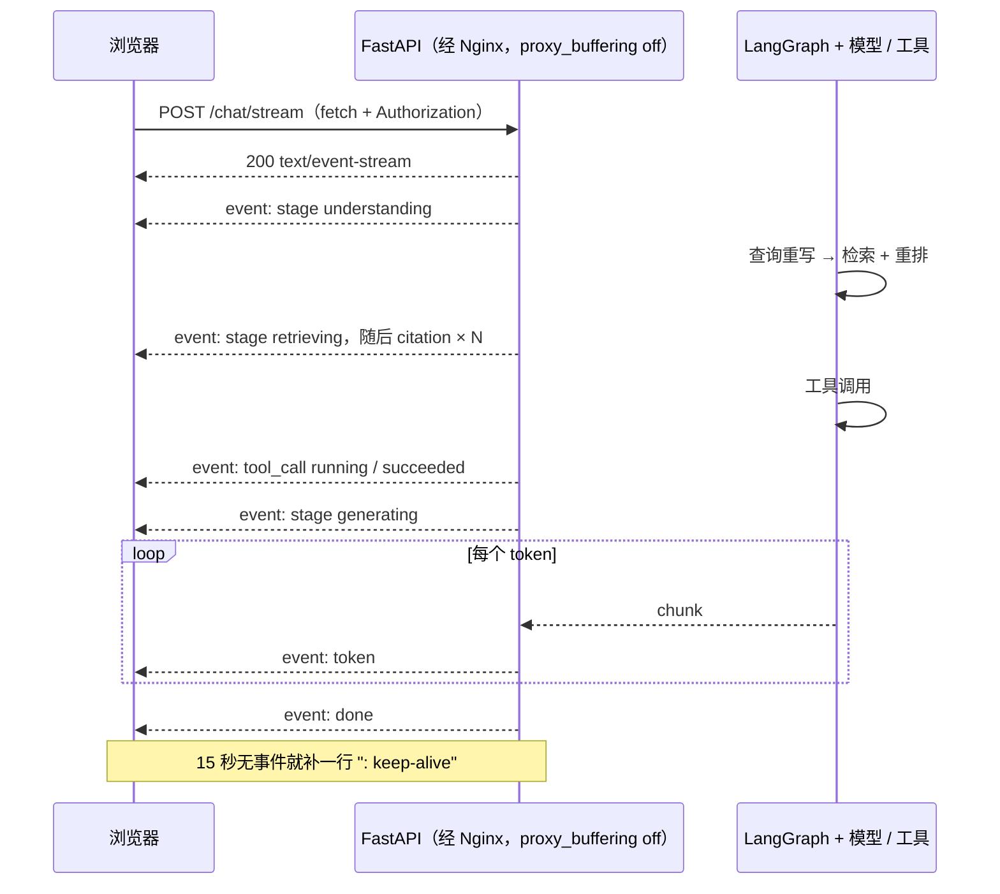
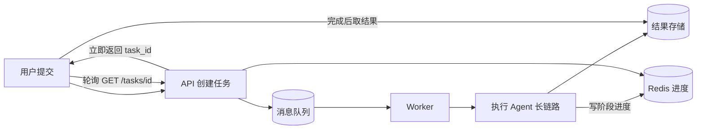

# SSE 流式与阶段事件协议

> 一次带检索和工具调用的 Agent 回答，端到端 10 到 30 秒是常态。不流式的话，用户面对的是一个转了半分钟的按钮，他会以为服务挂了然后刷新——于是你收到两倍的请求和一半的完成率。流式在 Agent 场景不是体验优化，是可用性底线。

## 为什么 Agent 必须流式

把一次"检索 + 工具 + 生成"的链路按阶段拆开看耗时：

| 阶段 | 典型耗时 | 用户此刻能看到什么 |
|---|---|---|
| 意图识别 / 查询重写 | 0.3-1s | 无 |
| 检索（向量 + 关键词）与重排 | 0.5-1.4s | 无 |
| 工具调用（订单、库存等外部接口） | 0.5-3s，可能串行多次 | 无 |
| 答案生成，之后还有引用校验 / 内容过滤 | 4-15s + 0.2-1s | 首 token 之后才有 |

不流式，用户等 15 秒看到全部内容，中间是纯空白。流式，0.8 秒看到"正在检索知识库"，2 秒看到引用来源，3 秒开始逐字出文，15 秒结束。**总耗时一点没变，感知完全不同。** 首 token 时间（TTFT）才是用户判断"这个系统是不是活的"的依据，总耗时只影响他愿不愿意读完。

Agent 比纯 Chat 更依赖流式：纯 Chat 的等待几乎全在生成，首 token 本来就快；Agent 有一半时间花在生成之前的检索和工具上，这段时间如果不往外吐东西，用户看到的就是彻底的空白。**踩坑：** 只流 token 是不够的——检索和工具阶段一个 token 都不会产生，用户仍然要盯着空屏等 3-5 秒。真正要设计的是"阶段事件协议"，而不是"把模型输出转成流"。

---

## SSE、WebSocket 与轮询

| 维度 | SSE | WebSocket | 短轮询 |
|---|---|---|---|
| 连接方向 | 服务端 → 客户端单向 | 全双工 | 客户端主动拉 |
| 底层协议与开销 | 普通 HTTP 一次长响应，文本帧几乎零开销 | 独立协议，需 `Upgrade` 握手，要维护心跳和状态机 | 每次都是完整请求 + 响应头 |
| 断线重连 | `EventSource` 自动重连，带 `Last-Event-ID` | 自己写重连、退避、状态恢复 | 天然无状态 |
| 代理 / Nginx 兼容 | 要关掉 buffering，其余按普通 HTTP 处理 | 要显式配 `Upgrade`，部分企业代理直接拦 | 最好，无需特殊配置 |
| 鉴权 | 走 Cookie，或用 `fetch` 自己带 Header | 握手阶段只能用 Cookie / query，Token 常在连上后首帧发 | 标准 Header |
| 中间件复用 | 限流、日志、鉴权、灰度全部复用现有 HTTP 链路 | 另一套链路，中间件基本要重写 | 完全复用 |
| 适用场景 | 单向推送：Agent 问答、日志尾随、任务进度 | 双向协作：多人编辑、实时白板、语音 | 低频状态查询、长任务结果拉取 |

**生产推荐：** Agent 问答场景默认 SSE。理由不是它更快，而是它就是普通 HTTP——鉴权、限流、日志、链路追踪、灰度全部复用现有中间件，出问题能用一条 `curl` 复现。只有当客户端需要在生成过程中持续发消息（打断、多端同步、协同编辑、语音双向）才值得上 WebSocket。

**适用场景：** 如果一次请求是"提交后等几分钟出结果"，两个都不合适，见文末"什么时候不该用 SSE"。这套单向流的心智模型和 Node 的可读流是一回事：服务端 `write` 一段，客户端 `on('data')` 收一段，只是多了一层文本协议格式。基础概念见 [Node.js 流](./node-stream) 和 [Node.js HTTP](./node-http)。

---

## SSE 协议本身

响应头是 `Content-Type: text/event-stream`，body 是纯文本。一条消息由若干字段行组成，**以一个空行（`\n\n`）结束**。

```txt
event: stage
data: {"stage":"retrieving","label":"正在检索知识库"}

id: 42
event: token
data: {"text":"根据"}

: 这是注释行，客户端会忽略，常用来做心跳保活

```

| 字段 | 作用 | 注意 |
|---|---|---|
| `data:` | 消息体，唯一必需字段 | 多个 `data:` 行按 `\n` 拼成一个字符串；值里不能有裸换行，所以固定用 JSON 编码 |
| `event:` | 事件类型，对应前端 `addEventListener(type)` | 不写时前端只能在 `onmessage` 里统一收 |
| `id:` / `retry:` | 消息 ID（浏览器记为 `Last-Event-ID`）与重连间隔（毫秒） | 前者是断点续传的基础，后者由服务端下发控制客户端退避 |
| `:` 开头 | 注释行 | 心跳保活靠它，防止代理因空闲断连 |

`EventSource` 的自动重连规则要知道：连接异常中断后，浏览器按 `retry`（默认约 3 秒）自动重连，并在请求头带上 `Last-Event-ID`。服务端返回 `204` 或客户端调 `close()` 则不再重连。

::: warning
自动重连是把双刃剑。如果服务端在流中途抛异常导致连接断开，`EventSource` 会不停重连，每次都重新触发一整轮 Agent 执行——一次失败被放大成持续的模型开销。所以服务端出错时**不要断开连接**，而要在同一条流里发 `event: error` 加 `event: done`，让客户端主动 `close()`。
:::

**踩坑：** `data` 里出现 `\n` 会被解析成消息内容换行，出现空行会被当成消息结束。模型输出里换行极其常见，所以永远不要把裸文本塞进 `data:`，一律 `json.dumps` / `JSON.stringify`。

---

## FastAPI 服务端实现

```python
import asyncio, json
from fastapi import APIRouter, Request
from fastapi.responses import StreamingResponse

router = APIRouter()
SSE_HEADERS = {
    "Cache-Control": "no-cache, no-transform",   # 禁止缓存，也禁止中间层改写内容
    "Connection": "keep-alive",
    "X-Accel-Buffering": "no",                   # 关键：让 Nginx 不缓冲这条响应
}

def sse(event: str, data: dict, event_id: int | None = None) -> str:
    """把一个事件序列化成 SSE 报文；data 必须 JSON 编码，避免裸换行破坏协议"""
    head = f"id: {event_id}\n" if event_id is not None else ""
    # 结尾必须是空行，否则客户端认为这条消息还没结束
    return f"{head}event: {event}\ndata: {json.dumps(data, ensure_ascii=False)}\n\n"

@router.post("/chat/stream")
async def chat_stream(body: ChatIn, request: Request):
    async def gen():
        seq = 0
        try:
            async for ev in run_agent(body.text, body.session_id):   # 业务事件流
                # 每写一段都检查客户端是否还在，避免 Agent 在无人接收时继续烧钱
                if await request.is_disconnected():
                    await cancel_agent(body.session_id)
                    break
                seq += 1
                yield sse(ev["event"], ev["data"], seq)
        except asyncio.CancelledError:
            await cancel_agent(body.session_id)   # 服务端主动取消也要收尾
            raise
    return StreamingResponse(gen(), media_type="text/event-stream", headers=SSE_HEADERS)
```

| 响应头 | 值 | 不设的后果 |
|---|---|---|
| `Content-Type` | `text/event-stream` | 浏览器不按 SSE 解析，`EventSource` 直接报错 |
| `Cache-Control` | `no-cache, no-transform` | 中间层缓存整条响应，或压缩改写内容 |
| `X-Accel-Buffering` | `no` | Nginx 攒满缓冲区才转发，前端几秒收不到东西 |
| `Connection` | `keep-alive` | HTTP/1.1 下连接可能被提前关闭 |

Agent 在检索和工具阶段可能十几秒没有任何输出，中间的代理或负载均衡会因为空闲把连接掐掉。解决办法是给事件流叠一层心跳：

```python
async def with_heartbeat(source, interval: float = 15.0):
    """超过 interval 秒没有业务事件，就补一行注释保活"""
    queue: asyncio.Queue = asyncio.Queue()

    async def pump():
        async for item in source:
            await queue.put(item)
        await queue.put(None)                     # 结束哨兵

    task = asyncio.create_task(pump())
    try:
        while True:
            try:
                item = await asyncio.wait_for(queue.get(), timeout=interval)
            except asyncio.TimeoutError:
                yield ": keep-alive\n\n"          # 注释行，前端自动忽略
                continue
            if item is None:
                return
            yield item
    finally:
        task.cancel()                             # 客户端断开时别把 pump 留在后台
```

**踩坑：** 生成器结束前一定要发 `done` 事件。前端无法区分"服务端正常结束"和"连接被中间层掐断"，只能靠一个显式结束事件；缺了 `done`，loading 状态就永远清不掉。

---

## 阶段事件协议设计

只流 token 的接口，前端只能做一件事：把字符往 div 里追加。而一个 Agent 产品至少要展示：现在在做什么、引用了哪些资料、调了什么工具、哪里出了错。这些都得在协议里有位置。

| event | 时机 | payload 字段 | 前端动作 |
|---|---|---|---|
| `stage` | 进入新阶段 | `stage`（枚举）、`label`、`seq` | 更新进度条与状态文案 |
| `token` | 生成增量文本 | `text` | 追加渲染 |
| `citation` | 确定引用来源 | `id`、`title`、`source`、`snippet`、`score` | 渲染引用卡片，给正文角标建索引 |
| `tool_call` | 工具开始 / 结束 | `id`、`name`、`status`、`summary`、`duration_ms` | 渲染工具执行卡片 |
| `interrupt` | 需要用户或人工确认 | `approval_id`、`action`、`summary` | 弹确认卡片，锁住输入框 |
| `error` | 出错（可重试或不可重试） | `code`、`message`、`retryable`、`stage` | 行内提示，保留已输出内容 |
| `done` | 流结束 | `finish_reason`、`message_id`、`usage` | 收 loading，落库消息 ID |

`stage` 的枚举值要固定，前端才能做文案映射：

| stage | 展示文案 | 对应环节 |
|---|---|---|
| `understanding` | 正在理解问题 | 意图识别 / 查询重写 |
| `retrieving` | 正在检索知识库 | 向量 + 关键词召回，见 [检索与重排](./rag-retrieval) |
| `tool_calling` | 正在查询业务系统 | 外部接口调用 |
| `generating` | 正在生成回答 | 首个 `token` 之前发出 |
| `verifying` | 正在校验引用 | 引用一致性检查，见 [引用与溯源](./rag-citation) |

一次完整回答的报文长这样（省略了开头的 `understanding`、引用卡片和后续 token）：

```txt
event: stage
data: {"stage":"retrieving","label":"正在检索知识库","seq":2}

event: tool_call
data: {"id":"t1","name":"query_order","status":"succeeded","duration_ms":412}

event: stage
data: {"stage":"generating","label":"正在生成回答","seq":3}

event: token
data: {"text":"根据退换货政策"}

event: done
data: {"finish_reason":"stop","message_id":"m_88","usage":{"total_tokens":812}}

```

用 Pydantic v2 的可辨识联合把协议钉死，服务端就发不出前端不认识的结构：

```python
from typing import Annotated, Literal, Union
from pydantic import BaseModel, Field

class StageEvent(BaseModel):
    event: Literal["stage"] = "stage"
    stage: Literal["understanding", "retrieving", "tool_calling", "generating", "verifying"]
    label: str
    seq: int

class ErrorEvent(BaseModel):
    event: Literal["error"] = "error"
    code: str                      # 稳定错误码，前端按它决定文案与重试策略
    message: str                   # 面向用户的说明，不要泄漏堆栈
    retryable: bool = False

# 其余事件同样写法，字段见上表
AgentEvent = Annotated[
    Union[StageEvent, TokenEvent, CitationEvent, ToolCallEvent, ErrorEvent, DoneEvent],
    Field(discriminator="event"),  # 按 event 判别，序列化和校验共用一套定义
]
```

**生产推荐：** 协议要带版本（响应头 `X-Stream-Protocol: 1`，或 `done` 里带 `protocol`），并在前端约定"**未知 event 一律忽略**"。有这两条，后端加新事件类型就不必等前端发版。

---

## 从 LangGraph 事件映射到协议

LangGraph 有两套流式接口，粒度不同：

| 接口 | 粒度 | 能拿到什么 | 适合 |
|---|---|---|---|
| `astream(stream_mode="values")` | 每个节点执行后 | 完整 State 快照 | 调试，或前端需要全量状态 |
| `astream(stream_mode="updates")` | 每个节点执行后 | 该节点的增量更新 | 映射 `stage` 事件 |
| `astream(stream_mode="messages")` | token 级 | `(chunk, metadata)` 元组 | 映射 `token` 事件 |
| `astream(stream_mode="custom")` | 任意 | 节点内用 `get_stream_writer()` 主动写 | 业务自定义事件（进度、命中数） |
| `astream_events(version="v2")` | 最细 | 链 / 模型 / 工具 / 检索器的开始、结束、流 | 一次拿全，统一转换 |

`stream_mode` 可以传列表同时开多种，但要一次覆盖工具、检索和 token，`astream_events` 更省事：

```python
NODE_TO_STAGE = {                      # 节点名到阶段的映射集中放一处，改图只改这里
    "route": ("understanding", "正在理解问题"),
    "retrieve": ("retrieving", "正在检索知识库"),
    "tools": ("tool_calling", "正在查询业务系统"),
    "generate": ("generating", "正在生成回答"),
    "verify": ("verifying", "正在校验引用"),
}

async def run_agent(question: str, session_id: str):
    seq = 0
    config = {"configurable": {"thread_id": session_id}}
    async for ev in graph.astream_events(
        {"messages": [{"role": "user", "content": question}]}, config, version="v2"
    ):
        kind, name, tags = ev["event"], ev.get("name", ""), ev.get("tags") or []

        # 1. 节点开始 → stage
        if kind == "on_chain_start" and name in NODE_TO_STAGE:
            stage, label = NODE_TO_STAGE[name]
            seq += 1
            yield {"event": "stage", "data": {"stage": stage, "label": label, "seq": seq}}

        # 2. 模型 token → token；用 tag 过滤，只流最终生成那次调用
        elif kind == "on_chat_model_stream" and "final" in tags:
            text = ev["data"]["chunk"].content
            if text:
                yield {"event": "token", "data": {"text": text}}

        # 3. 检索结束 → citation
        elif kind == "on_retriever_end":
            for i, doc in enumerate(ev["data"]["output"][:5]):
                yield {"event": "citation", "data": {
                    "id": f"c{i + 1}",
                    "title": doc.metadata.get("title", ""),
                    "source": doc.metadata.get("source", ""),
                    "snippet": doc.page_content[:120],
                    "score": doc.metadata.get("score"),
                }}

        # 4. 工具开始 / 结束 → tool_call，只发摘要不发原始返回
        elif kind == "on_tool_start":
            yield {"event": "tool_call", "data": {
                "id": ev["run_id"], "name": name, "status": "running",
                "summary": summarize_args(ev["data"].get("input")),
            }}
        elif kind in ("on_tool_end", "on_tool_error"):
            yield {"event": "tool_call", "data": {
                "id": ev["run_id"], "name": name,
                "status": "succeeded" if kind == "on_tool_end" else "failed",
            }}
```

上面这段能工作的前提是给"最终生成"那次模型调用打了 tag：`answer_llm = llm.with_config(tags=["final"])`，而路由、查询重写用 `tags=["internal"]`。

**踩坑：**

- 工具原始返回可能带手机号、地址、内部字段，`tool_call` 只发摘要，别把 `output` 直接丢出去。
- `on_chain_start` 对每个可运行对象都会触发，必须用映射表白名单过滤，否则前端会收到一堆无意义的 stage。

整条链路串起来是这样：



---

## 前端消费：EventSource 的局限与 fetch 方案

| 能力 | `EventSource` | `fetch` + `ReadableStream` |
|---|---|---|
| 请求方法 / 自定义 Header / 请求体 | 只有 GET，不能带 Header，不能发 body | 任意方法，Header 和 JSON body 都可以 |
| 自动重连（`Last-Event-ID`）与中断 | 重连内置，中断用 `close()` | 都要自己实现：重连记 ID，中断用 `AbortController` |
| SSE 解析 | 内置 | 要自己写解析器，多几十行 |

**生产推荐：** 需要 Bearer Token，或需要提交长内容（多轮历史、附件 ID）时用 `fetch`，也就是绝大多数 Agent 应用。只有纯 Cookie 鉴权且参数很短的场景，才值得用 `EventSource` 省这几十行。

```ts
// sse.ts —— 手写 SSE 解析器
export interface SSEMessage { id?: string; event: string; data: string }

/** 按空行分帧，按前缀取字段 */
export async function* parseSSE(res: Response): AsyncGenerator<SSEMessage> {
  const reader = res.body!.pipeThrough(new TextDecoderStream()).getReader()
  let buffer = ''
  while (true) {
    const { value, done } = await reader.read()
    if (done) break
    buffer += value.replace(/\r\n/g, '\n')      // 统一换行，简化分帧
    let sep = buffer.indexOf('\n\n')
    for (; sep !== -1; sep = buffer.indexOf('\n\n')) {
      const frame = buffer.slice(0, sep)
      buffer = buffer.slice(sep + 2)
      const msg = parseFrame(frame)
      if (msg) yield msg                        // 注释帧返回 null，直接跳过
    }
  }
}

function parseFrame(frame: string): SSEMessage | null {
  const msg: SSEMessage = { event: 'message', data: '' }
  const dataLines: string[] = []
  for (const line of frame.split('\n')) {
    if (line.startsWith(':')) continue          // 心跳 / 注释行
    const colon = line.indexOf(':')
    const field = colon === -1 ? line : line.slice(0, colon)
    const value = colon === -1 ? '' : line.slice(colon + 1).replace(/^ /, '')
    if (field === 'data') dataLines.push(value)
    else if (field === 'event') msg.event = value
    else if (field === 'id') msg.id = value
  }
  if (!dataLines.length) return null            // 纯注释帧
  return { ...msg, data: dataLines.join('\n') } // 多行 data 用 \n 拼接
}
```

消费端把消息分发成带类型的回调，并保留中断能力：

```ts
// client.ts
type AgentEvent =
  | { event: 'stage'; stage: string; label: string; seq: number }
  | { event: 'token'; text: string }
  | { event: 'citation'; id: string; title: string; source: string; snippet?: string }
  | { event: 'tool_call'; id: string; name: string; status: 'running' | 'succeeded' | 'failed' }
  | { event: 'error'; code: string; message: string; retryable: boolean }
  | { event: 'done'; finish_reason: string; message_id?: string }

type Handlers = { [K in AgentEvent['event']]?: (e: Extract<AgentEvent, { event: K }>) => void }

export function streamChat(body: unknown, h: Handlers) {
  const ac = new AbortController()
  let lastId: string | undefined
  const run = async () => {
    const res = await fetch('/api/chat/stream', {
      method: 'POST',
      headers: {
        'Content-Type': 'application/json',
        Authorization: `Bearer ${getToken()}`,
        ...(lastId ? { 'Last-Event-ID': lastId } : {}),   // 续传时带上已收到的最后一条
      },
      body: JSON.stringify(body), signal: ac.signal,
    })
    if (!res.ok || !res.body) throw new Error(`stream failed: ${res.status}`)
    for await (const msg of parseSSE(res)) {
      if (msg.id) lastId = msg.id
      let payload: AgentEvent
      try { payload = { event: msg.event, ...JSON.parse(msg.data) } as AgentEvent }
      catch { continue }                       // 脏帧直接丢，不要炸掉整条流
      h[payload.event]?.(payload as never)     // 未注册的 event 自动忽略，协议向后兼容
      if (payload.event === 'done') return
    }
  }

  const done = run().catch((err) => {
    if (ac.signal.aborted) return              // 用户主动中断，不算错误
    h.error?.({ event: 'error', code: 'network', message: String(err), retryable: true })
  })

  return { abort: () => ac.abort(), done }
}
```

增量渲染要批处理。模型每秒可能吐几十个 token，每个都触发一次 `setState` 会让长回答明显掉帧：

```ts
/** 用 rAF 把一帧内的 token 合并成一次提交 */
export function createTokenBuffer(commit: (text: string) => void) {
  let pending = '', scheduled = false
  return (chunk: string) => {
    pending += chunk
    if (scheduled) return
    scheduled = true
    requestAnimationFrame(() => { commit(pending); pending = ''; scheduled = false })
  }
}
```

**踩坑：** 用户切走页面或点"停止生成"，一定要 `abort()` 并让服务端感知（`request.is_disconnected()` 或显式发一个取消请求）。前端单方面停止渲染，后端仍在生成，token 照样计费。

---

## 生产环境三大坑

### 1. 反向代理缓冲

Nginx 默认缓冲上游响应，攒够缓冲区才转发。典型表现是本地直连 uvicorn 一切正常，上了环境就变成"等十几秒然后一次性全出来"。

```nginx
location /api/chat/stream {
    proxy_pass http://backend;
    proxy_http_version 1.1;          # 必须 1.1，默认 1.0 不支持流式 keep-alive
    proxy_buffering off;             # 关掉响应缓冲
    gzip off;                        # 压缩同样会攒块，这个路径直接关
    proxy_read_timeout 300s;         # 要大于最长一次 Agent 执行时间
    proxy_send_timeout 300s;
    proxy_set_header Connection '';  # 清掉 Connection: close
}
```

后端返回 `X-Accel-Buffering: no` 可以按响应粒度关闭缓冲，比改 Nginx 更推荐——它保证只对流式接口生效，不会顺手影响别的路径。

| 现象 | 原因 | 处理 |
|---|---|---|
| 内容一次性到达 | 代理 / CDN 缓冲 | `proxy_buffering off` 或 `X-Accel-Buffering: no` |
| 每段内容固定延迟几秒 | gzip 压缩缓冲 | 该路径关 gzip |
| 连接稳定在 60 秒断开 | `proxy_read_timeout` 默认 60s | 调大，并配心跳 |
| 偶发 502 | 上游 worker 被回收 | 检查 gunicorn / uvicorn 的 `timeout` 与 `graceful_timeout` |

### 2. 超时链路不止一层

一条流式请求要穿过：浏览器 → CDN → 负载均衡 → Nginx → gunicorn → uvicorn。任意一层的空闲超时小于最长执行时间，连接就断。**排查顺序：** 先用 `curl -N` 直连后端确认后端没问题，再逐层加代理；`-N` 关闭输出缓冲，能看到 token 逐个到达。

```bash
curl -N -H "Authorization: Bearer $TOKEN" -H "Content-Type: application/json" \
     -d '{"text":"退货政策是什么","session_id":"s1"}' https://example.com/api/chat/stream
```

### 3. 多副本下的会话粘性

SSE 本身是"一次请求一条连接"，不需要粘性。但有两类状态会把你拖进粘性问题：

| 状态 | 放在进程内的后果 | 正确做法 |
|---|---|---|
| 会话历史 / 图 checkpoint | 下一个请求落到别的副本就丢上下文 | 外部化到 Redis / Postgres，多实例约束见 [部署与交付](./agent-deploy#水平扩展的四个硬约束) |
| "停止生成"信号与断线续传内容 | 取消请求或重连落到别的副本，取消不掉、接不上 | 取消标记写 Redis 各副本自查；生成时按 `message_id` + `seq` 写 Redis，重连按 `Last-Event-ID` 补发 |

**踩坑：** 灰度发布会直接切断老副本上的流式连接。给 uvicorn 配足够的 `graceful_timeout`，并让前端把"连接中断但没收到 `done`"当成可重试状态，而不是失败——否则每次发布都会有一批用户看到半截回答。

---

## 错误与降级：流中途失败怎么办

HTTP 状态码在第一个字节发出时就定了（200）。之后模型超时、工具挂掉、内容审核拦截，都不能再改状态码。**唯一正确的做法是在同一条流里发结构化错误事件，然后正常结束流。**

| 失败场景 | 已输出内容 | 流内动作 | 前端表现 |
|---|---|---|---|
| 检索为空 | 无 | 照常 `generating`，答"没找到相关资料" | 正常回答，不算错误 |
| 单个工具失败 | 可能有 | `tool_call: failed`，继续生成 | 工具卡片标红，回答继续 |
| 模型生成中途超时 | 有部分 | `error{code:"model_timeout",retryable:true}` + `done{finish_reason:"error"}` | 保留已输出，给"重新生成" |
| 上游全部不可用 | 无 | `error{code:"upstream_down",retryable:true}` + `done` | 提示稍后重试或转人工 |
| 命中内容安全策略 | 可能有 | `error{code:"content_filtered",retryable:false}` + `done` | 撤回已输出，替换固定文案 |
| 用户主动中断 | 有部分 | `done{finish_reason:"cancelled"}` | 保留已输出，允许继续追问 |

已输出内容怎么处理，取决于错误性质：

- **可重试的技术错误**（超时、限流）：保留已输出，前端提供"继续"或"重新生成"。重新生成用新的 `message_id`，不要覆盖历史记录。
- **内容策略错误**：必须撤回已输出。高风险场景可以延迟 flush——先缓存前若干 token 过一遍审核再开始推。**引用校验失败**属于另一类：不撤回正文，追加一条"以下内容未能核对到来源"的提示，见 [引用与溯源](./rag-citation)。

实现上用一层包装把异常统一转成流内事件，业务生成器自己不发 `done`：

```python
ERROR_TEXT = {"model_timeout": "生成超时，可以重试", "internal": "服务暂时不可用"}

async def guarded(source):
    """任何异常都转成 error + done，绝不裸抛导致连接被中断"""
    produced, failed = False, False
    try:
        async for ev in source:
            produced = produced or ev["event"] == "token"
            yield ev
    except Exception as exc:
        failed = True
        logger.exception("stream failed")          # 堆栈进日志，不进响应体
        code = "model_timeout" if isinstance(exc, asyncio.TimeoutError) else "internal"
        yield {"event": "error", "data": {"code": code, "retryable": True,
                                          "message": ERROR_TEXT[code], "partial": produced}}
    # 正常结束和已捕获异常都要补 done。注意别写在 finally 里：被取消时在 finally 中 yield 会报错
    yield {"event": "done", "data": {"finish_reason": "error" if failed else "stop"}}
```

::: tip
错误码要稳定且可枚举，前端按 `code` 决定文案和重试策略，绝不解析 `message`。`message` 是给用户看的，随时可能改文案。
:::

---

## 什么时候不该用 SSE

流式的前提是"用户在等，且等待时间可接受"。超过一两分钟，长连接的性价比就崩了：一次网络抖动就要从头重来，服务端还要为等待的用户占着连接。

| 任务时长 | 方案 | 理由 |
|---|---|---|
| 60 秒以内 | SSE 直接流 | 用户在场，长连接成本可接受 |
| 1-5 分钟 | SSE + 服务端断点续传（增量写 Redis，按 `Last-Event-ID` 补发） | 抖动不至于从头重跑 |
| 5 分钟以上 / 批量任务 | 提交任务 + 轮询或推送状态 | 用户可以关掉页面，服务端可重试 |



这条路径上的任务表设计、幂等、重试与死信、Worker 生命周期，见 [Worker 与异步任务](./background-worker) 和 [消息队列](./message-queue)。**适用场景：** 批量文档入库、跨多数据源的深度调研、定时生成的分析报告都属于这一类。前端仍然可以用 SSE，但流的内容变成"任务进度"，数据来自 Redis 而不是直接连着 Agent 执行。

---

## 端到端示例

装配清单：图是最小三节点链 `route → retrieve → generate`（见 [LangGraph 编排](./agent-langgraph)），只给 `generate` 里那次模型调用打 `tags=["final"]`；端点在前面 `chat_stream` 的基础上换一下事件源，前端沿用 `parseSSE` + `streamChat` + `createTokenBuffer`，只剩状态接线。

```python
# api.py —— 事件源换成「心跳 + 兜底」包装后的 run_agent
async def gen():
    seq = 0
    async for ev in with_heartbeat(guarded(run_agent(body.text, body.session_id))):
        if isinstance(ev, str):                   # 心跳注释行，原样透传
            yield ev
            continue
        if await request.is_disconnected():
            await cancel_agent(body.session_id)
            break
        seq += 1
        yield sse(ev["event"], ev["data"], seq)   # seq 作为 id，供 Last-Event-ID 续传
```

```ts
// useChatStream.ts —— 消费端接线（React）
export function useChatStream() {
  const [stage, setStage] = useState('')
  const [answer, setAnswer] = useState('')
  const [status, setStatus] = useState<'idle' | 'streaming' | 'error' | 'done'>('idle')
  const ctrl = useRef<{ abort(): void } | null>(null)
  const append = useMemo(() => createTokenBuffer((t) => setAnswer((p) => p + t)), [])

  const send = (text: string, sessionId: string) => {
    setAnswer(''); setStatus('streaming')
    ctrl.current = streamChat({ text, session_id: sessionId }, {
      stage: (e) => setStage(e.label),
      token: (e) => append(e.text),
      citation: (e) => pushCitationCard(e),
      error: (e) => { setStatus('error'); toast(messageOf(e.code)) },   // 按错误码出文案
      done: () => { setStage(''); setStatus('done') },
    })
  }

  useEffect(() => () => ctrl.current?.abort(), [])   // 卸载即中断，否则后端继续计费
  return { stage, answer, status, send, stop: () => ctrl.current?.abort() }
}
```

这套接线里有三处"看起来可以省、实际不能省"：服务端的 `is_disconnected` 检查、`guarded` 兜底的 `done` 事件、前端的 `abort`。它们分别对应"用户跑了后端还在烧钱""loading 永远转圈""切页面后仍在计费"三个线上问题。

---

## 面试高频问题

**1. Agent 为什么必须流式？只流 token 够不够？**

- TTFT 决定用户判断系统"是不是活的"，总耗时只决定他愿不愿意读完；Agent 有一半时间花在生成之前（重写、检索、重排、工具），只流 token 那段时间仍然是空屏。
- 所以要流阶段事件：`stage` / `citation` / `tool_call`，让空白期也有可见进展，顺带降低中途放弃和重复提交。

**2. SSE 和 WebSocket 怎么选？**

- SSE 是普通 HTTP 单向流，复用现有鉴权、限流、日志、追踪，`curl -N` 就能复现问题；WebSocket 是双向独立协议，中间件要重写，部分企业代理会拦。
- 判断标准：客户端是否需要在生成过程中持续发消息。只是"提问 → 看回答"就用 SSE；超过几分钟的长任务两者都不合适，改成提交任务 + 轮询 / 推送进度。

**3. 事件协议怎么设计才不用频繁改前端？**

- 固定事件类型集合：`stage`、`token`、`citation`、`tool_call`、`interrupt`、`error`、`done`。
- `stage` 用枚举，前端按枚举映射文案，不直接展示后端字符串。
- 协议带版本号，前端约定"未知 event 一律忽略"，后端加事件不必等前端发版；服务端用 Pydantic 可辨识联合定义，避免手拼字典拼错字段。

**4. 流到一半模型超时或工具失败怎么办？**

- 状态码在首字节就定了，之后只能在流内表达错误，不能改 HTTP 状态。
- 发 `error{code, retryable}` 再发 `done`，绝不裸抛异常断连接——`EventSource` 会不停重连，一次失败放大成持续开销。
- 已输出内容按错误性质处理：技术错误保留并允许重试，内容策略错误撤回替换；错误码要稳定可枚举，前端按 `code` 决定文案，不解析 `message`。

**5. 上线后前端收不到流，怎么排查？**

- 先 `curl -N` 直连后端：能逐字出就是代理问题，不能就是后端问题。
- 代理三件套：`proxy_buffering off`、`proxy_http_version 1.1`、该路径关 gzip；更推荐后端返回 `X-Accel-Buffering: no`。
- 固定 60 秒断开基本是 `proxy_read_timeout` 默认值，调大并加 15 秒心跳注释行；灰度发布会切断老副本连接，前端要把"没收到 done 的中断"当可重试而不是失败。

**6. LangGraph 的流怎么接到自己的协议上？**

- `astream_events(version="v2")` 一次拿到链、模型、工具、检索器事件，统一映射。
- `on_chain_start` 用节点名白名单映射 `stage`；`on_chat_model_stream` 用 tag 过滤，只流打了 `final` 的那次调用，否则用户会看到路由和查询重写的内部输出；`on_retriever_end` 映射 `citation`，`on_tool_start` / `on_tool_end` 映射 `tool_call` 且只发摘要。

**7. 前端为什么不直接用 EventSource？**

- 只支持 GET、不能带自定义 Header、不能发 body，Bearer Token 和多轮历史都放不进去。
- 用 `fetch` + `ReadableStream` 自己解析：按 `\n\n` 分帧、按前缀取字段、忽略 `:` 注释行；代价是要自己实现重连（记 `Last-Event-ID`）和中断（`AbortController`）。
- 渲染要用 rAF 合并 token，否则每个 token 一次 setState，长回答会掉帧。

