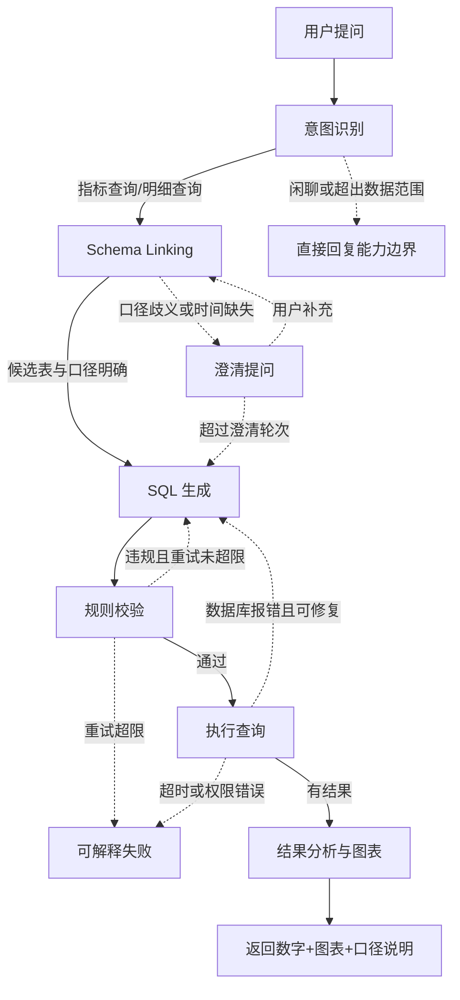
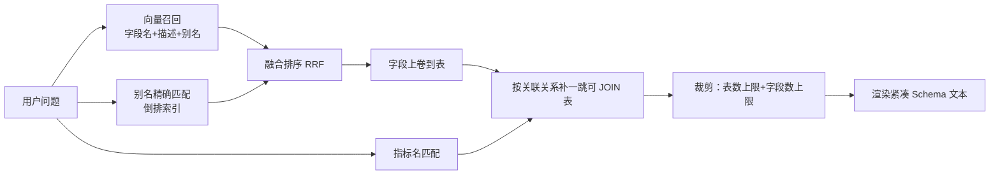

# Text2SQL：Schema Linking 与安全链路

> 让模型写出一句能跑的 SQL，半小时就能演示。让它在一个有三百张表、十几套指标口径、还挂着行级权限的数仓上稳定回答业务问题，是另一回事。这篇拆的是后者。

## 难点不在生成，在前后两端

企业 BI 自助分析的典型需求：运营在对话框里问"上个月华东区的 GMV 环比涨了多少"，系统直接返回数字和图表，不用再找数据分析师排期。

把这个需求拆开，模型负责的"写 SQL"只是中间一小段，真正决定成败的是三件事：

| 环节 | 要解决的问题 | 做不好的后果 |
|---|---|---|
| Schema Linking | 从几百张表里定位这个问题该用哪几张表、哪几个字段 | 模型用错表，SQL 能跑但数字是错的 |
| 口径对齐 | GMV 算不算退款、活跃用户按登录还是按下单、时间用创建还是支付 | 数字和财务报表对不上，业务方从此不信这个工具 |
| 安全校验 | 生成的 SQL 不能改数据、不能全表扫描、不能越权 | 一次 `DELETE`、一次没有 `LIMIT` 的多表关联，就是生产事故 |

**踩坑：** 最容易被低估的是第二件。SQL 语法错误会立刻抛异常，你马上知道；口径错误会安静地返回一个看起来很合理的数字，等月底对账才被发现——而那时候没人记得是哪次对话生成的。

所以 Text2SQL 的工程重心不是"把模型换成更强的"，而是**把企业内部只存在于口头、Wiki 和分析师脑子里的知识，变成模型能检索到的结构化数据**，再用确定性代码兜住输出。这两件事都不需要模型能力上的突破，只需要老老实实做工程。

---

## 为什么裸给模型一堆建表语句一定会失败

最直觉的做法是把 `SHOW CREATE TABLE` 的结果全部拼进 Prompt。这个做法在 demo 里（5 张表）效果很好，在真实数仓上会同时踩到六个坑。

| 现象 | 根因 | 对应的解法 |
|---|---|---|
| Prompt 装不下 / 成本爆炸 | 300 张表 × 平均 25 个字段，光 DDL 就十几万 token，还没算注释 | Schema Linking 动态裁剪 |
| 塞得下也选不准 | 上下文里无关表越多，注意力越稀释，模型倾向选表名字面最像的那张 | 候选表控制在 3 到 8 张 |
| 字段名不说人话 | 数仓里大量 `f_amt_1`、`stat`、`is_del`、`ext_json`，模型只能靠猜 | 字段业务名 + 描述 + 业务别名 |
| 枚举值猜错 | `status = 'paid'` 还是 `status = 2`？DDL 里看不出来 | 枚举字典进元数据并注入 Prompt |
| 同一指标各部门口径不同 | 财务的 GMV 扣退款，运营的不扣；两边都管它叫 GMV | 指标定义表 + 口径歧义时澄清 |
| 模型编造不存在的字段 | DDL 里没有 `refund_amount`，但模型见过太多电商表，会补一个出来 | 字段存在性校验，AST 层面直接拦掉 |

::: warning 幻觉字段里最危险的不是报错那种
模型编一个不存在的字段，数据库报 `Unknown column`，你还有机会重试。真正危险的是它选了一个**存在但语义不对**的字段——比如把 `order_amount`（应付）当成 `pay_amount`（实付）。SQL 执行成功、结果看着正常、数字偏差 3%。这类问题只能靠字段描述和指标口径在生成前规避，事后校验拦不住。
:::

---

## 完整链路与失败分支

一条能上生产的 Text2SQL 链路，节点不多，但**每个节点都要有失败出口**。下图里实线是主路径，虚线是失败分支：



值得注意的是三条虚线：**澄清回到 Schema Linking**（补充信息会改变候选表），**校验失败回到生成**（把违规原因回灌给模型），**执行报错回到生成**（把数据库错误回灌）。这三条边构成了整条链路的容错能力，而它们都需要状态在节点之间流转——这正是用 LangGraph 而不是手写 `if/else` 的理由，详见 [Agent 编排：LangGraph 实战](./agent-langgraph)。

### 状态定义与条件边

```python
from typing import Literal, TypedDict
from langgraph.graph import StateGraph, END


class Text2SQLState(TypedDict, total=False):
    question: str                 # 当前轮用户问题
    history: list[dict]           # 多轮上下文，澄清时要带上
    user_id: int                  # 行级权限的依据，绝不能从模型输出里取
    intent: str                   # metric_query / detail_query / out_of_scope / chitchat
    linked: dict                  # Schema Linking 结果：候选表、指标口径、歧义项
    sql: str
    assumptions: list[str]        # 模型做的假设，要展示给用户
    violations: list[str]         # 校验不通过的原因，回灌给模型
    repair_rounds: int            # 已重试次数
    clarify_rounds: int           # 已澄清轮次
    clarify: dict | None          # 澄清问题与候选选项
    rows: list[dict]
    error: dict | None            # 结构化错误，供可解释失败节点使用
```

条件边负责路由，每个路由函数只做一件事：读状态、返回下一个节点名。**不要在路由函数里调模型**，否则一次路由多一次不确定性。

```python
MAX_REPAIR = 2          # SQL 修复最多 2 次，超了就老实认错
MAX_CLARIFY = 2         # 澄清最多问 2 轮，再问用户就烦了


def route_after_linking(state: Text2SQLState) -> Literal["clarify", "generate"]:
    # 有歧义且还有澄清预算 → 反问；预算用完 → 用默认口径硬上，但结果里必须标注假设
    if state["linked"]["ambiguities"] and state.get("clarify_rounds", 0) < MAX_CLARIFY:
        return "clarify"
    return "generate"


def route_after_validate(state: Text2SQLState) -> Literal["execute", "generate", "explain"]:
    if not state.get("violations"):
        return "execute"
    if state.get("repair_rounds", 0) < MAX_REPAIR:
        return "generate"          # 把 violations 回灌给模型重写
    return "explain"               # 反复改不对，转人话解释，别再烧 token


def route_after_execute(state: Text2SQLState) -> Literal["analyze", "generate", "explain"]:
    err = state.get("error")
    if err is None:
        return "analyze"
    # 只有"模型能改对"的错误才值得重试：字段不存在、语法错、类型不匹配
    if err["retryable"] and state.get("repair_rounds", 0) < MAX_REPAIR:
        return "generate"
    return "explain"               # 超时、权限不足、连接失败，重试只会雪上加霜


graph = StateGraph(Text2SQLState)
for name, fn in [("classify", classify_intent), ("linking", schema_linking_node),
                 ("clarify", make_clarify_question), ("generate", generate_sql),
                 ("validate", validate_sql), ("execute", execute_sql),
                 ("analyze", analyze_result), ("explain", explain_failure)]:
    graph.add_node(name, fn)

graph.set_entry_point("classify")
graph.add_conditional_edges("classify", route_after_classify,
                            {"linking": "linking", "out_of_scope": "explain"})
graph.add_conditional_edges("linking", route_after_linking,
                            {"clarify": "clarify", "generate": "generate"})
graph.add_conditional_edges("validate", route_after_validate,
                            {"execute": "execute", "generate": "generate", "explain": "explain"})
graph.add_conditional_edges("execute", route_after_execute,
                            {"analyze": "analyze", "generate": "generate", "explain": "explain"})
graph.add_edge("generate", "validate")
graph.add_edge("clarify", END)     # 澄清问题抛给用户后本轮就结束，等下一轮输入
graph.add_edge("analyze", END)
graph.add_edge("explain", END)
app = graph.compile(checkpointer=checkpointer)   # checkpointer 让澄清后能续上同一个 thread
```

---

## BI 元数据知识库：要沉淀什么

这是整个项目里最花时间、也最值钱的部分。它不是"把 DDL 导出来存一份"，而是把**人才知道的东西**写下来。

需要沉淀五类信息：

| 类别 | 内容 | 缺了会怎样 |
|---|---|---|
| 表说明 | 这张表存什么、粒度是什么（一行是一个订单还是一个订单行）、量级、是否允许被查 | 模型对订单行表直接 `SUM` 金额，重复计算 |
| 字段说明 | 业务名、含义、单位（分还是元）、业务别名 | 把"实付"写成 `order_amount`，金额差一个折扣 |
| 枚举值字典 | `status = 2` 表示已支付，`channel = 'H5'` 等 | `WHERE status = 'paid'` 查出 0 行 |
| 表间关联 | 哪两个字段能 JOIN、基数关系、是否要带分区条件 | JOIN 条件写错，笛卡尔积炸库 |
| 指标定义与口径 | 计算表达式、过滤条件、时间字段、排除项、归属部门 | 数字和财务报表对不上 |

### 表与字段元数据

```sql
-- 表级元数据：一张表是什么、能不能被 Text2SQL 用
CREATE TABLE meta_table (
  id            BIGINT UNSIGNED PRIMARY KEY AUTO_INCREMENT,
  db_name       VARCHAR(64)  NOT NULL,
  table_name    VARCHAR(64)  NOT NULL,
  display_name  VARCHAR(128) NOT NULL COMMENT '业务名称，如"订单主表"',
  description   TEXT                  COMMENT '存什么、怎么产出、更新频率',
  grain         VARCHAR(64)           COMMENT '数据粒度：一行代表什么，决定能不能直接聚合',
  domain        VARCHAR(32)  NOT NULL COMMENT '主题域：order/user/product/finance',
  row_count_est BIGINT                COMMENT '量级估算，用于提示模型必须带时间条件',
  partition_col VARCHAR(64)           COMMENT '分区字段，大表查询强制要求带上',
  is_queryable  TINYINT      NOT NULL DEFAULT 1 COMMENT '是否允许被查，白名单的唯一来源',
  UNIQUE KEY uk_table (db_name, table_name)
) ENGINE=InnoDB DEFAULT CHARSET=utf8mb4 COMMENT='表级元数据';

-- 字段级元数据：Schema Linking 的主要召回对象
CREATE TABLE meta_column (
  id            BIGINT UNSIGNED PRIMARY KEY AUTO_INCREMENT,
  table_id      BIGINT UNSIGNED NOT NULL,
  column_name   VARCHAR(64)  NOT NULL,
  data_type     VARCHAR(32)  NOT NULL COMMENT 'MySQL 类型，生成时做类型对齐',
  display_name  VARCHAR(128) NOT NULL COMMENT '业务名，如"实付金额"',
  description   TEXT                  COMMENT '含义 + 单位（分/元）+ 注意事项',
  aliases       JSON                  COMMENT '业务别名：["实付","实收","支付金额"]',
  enum_values   JSON                  COMMENT '枚举字典：[{"value":2,"label":"已支付"}]',
  is_time_field TINYINT NOT NULL DEFAULT 0,
  is_metric     TINYINT NOT NULL DEFAULT 0 COMMENT '是否度量（可聚合）',
  is_dimension  TINYINT NOT NULL DEFAULT 0 COMMENT '是否维度（可分组）',
  is_sensitive  TINYINT NOT NULL DEFAULT 0 COMMENT '手机号等，禁止出现在 SELECT 列表',
  UNIQUE KEY uk_col (table_id, column_name)
) ENGINE=InnoDB DEFAULT CHARSET=utf8mb4 COMMENT='字段级元数据';
```

### 关联关系与指标定义

```sql
-- 表间关联：模型自己猜 JOIN 条件是事故高发区，必须显式给出
CREATE TABLE meta_relation (
  id           BIGINT UNSIGNED PRIMARY KEY AUTO_INCREMENT,
  left_table   VARCHAR(128) NOT NULL COMMENT 'db.table',
  left_column  VARCHAR(64)  NOT NULL,
  right_table  VARCHAR(128) NOT NULL,
  right_column VARCHAR(64)  NOT NULL,
  cardinality  VARCHAR(16)  NOT NULL COMMENT '1:1 / 1:N / N:N，N:N 要警告重复计算',
  note         VARCHAR(255)          COMMENT '如"必须同时限制两边分区日期"',
  KEY idx_left (left_table)
) ENGINE=InnoDB DEFAULT CHARSET=utf8mb4 COMMENT='表间关联关系';

-- 指标定义：整个知识库的核心，业务口径的唯一事实来源
CREATE TABLE meta_metric (
  id           BIGINT UNSIGNED PRIMARY KEY AUTO_INCREMENT,
  code         VARCHAR(64)  NOT NULL COMMENT '唯一编码，如 gmv_paid',
  display_name VARCHAR(128) NOT NULL COMMENT '如"GMV（支付口径）"',
  aliases      JSON                  COMMENT '["GMV","成交额"]，用于命中歧义检测',
  definition   TEXT         NOT NULL COMMENT '一句人话说清算什么，给用户看',
  base_table   VARCHAR(128) NOT NULL,
  sql_expr     VARCHAR(255) NOT NULL COMMENT '度量表达式，如 SUM(o.pay_amount)',
  filter_expr  VARCHAR(512)          COMMENT '固定过滤，如 o.status = 2 AND o.is_test = 0',
  time_column  VARCHAR(64)  NOT NULL COMMENT '时间口径字段，如 o.pay_time',
  unit         VARCHAR(16)           COMMENT '元/个/百分比',
  exclude_note VARCHAR(512)          COMMENT '明确排除了什么，如"不扣退款"',
  owner_dept   VARCHAR(64)           COMMENT '口径归属部门，有分歧时找谁确认',
  version      INT NOT NULL DEFAULT 1 COMMENT '口径变更必须升版本，历史结果才可复现',
  status       VARCHAR(16) NOT NULL DEFAULT 'active',
  UNIQUE KEY uk_code_ver (code, version)
) ENGINE=InnoDB DEFAULT CHARSET=utf8mb4 COMMENT='指标口径定义';
```

同名不同口径是常态，元数据里就要允许它们并存，而不是硬选一个：

| code | display_name | sql_expr | filter_expr | time_column | 差异 |
|---|---|---|---|---|---|
| `gmv_paid` | GMV（支付口径） | `SUM(o.pay_amount)` | `o.status >= 2` | `o.pay_time` | 不扣退款，运营看趋势用 |
| `gmv_net` | GMV（净额口径） | `SUM(o.pay_amount - o.refund_amount)` | `o.status >= 2` | `o.pay_time` | 扣退款，财务对账用 |
| `uv_active` | 活跃用户（登录口径） | `COUNT(DISTINCT l.user_id)` | 无 | `l.login_date` | 登录即活跃 |
| `uv_buyer` | 活跃用户（下单口径） | `COUNT(DISTINCT o.user_id)` | `o.status >= 2` | `o.pay_time` | 只算成交用户 |

**生产推荐：** 指标口径变更走"新增版本 + 旧版本置为 deprecated"，不要原地改 `sql_expr`。否则同一个问题上周和这周返回不同数字，你无法向业务方解释，也无法复现历史评测结果。

::: tip 元数据从哪来
字段名、类型、注释可以从 `information_schema` 自动同步；业务别名、枚举含义、指标口径必须人工补。实践中的可行路径是：先用模型基于表名字段名和抽样数据生成初稿，再让数据负责人在管理后台上审核确认。**自动生成的元数据不经人审不能启用**——错误的元数据比没有元数据更危险，因为它会被模型当成权威事实。
:::

---

## Schema Linking：把元数据做成可检索的

Schema Linking 的目标：给定一个问题，从全库元数据里裁剪出**3 到 8 张候选表、每张表 10 到 20 个候选字段、命中的指标口径**，再喂给模型。本质上这是一次检索任务，做法和 RAG 一致，只是被检索的对象是元数据而不是文档。



两路召回都不能省：

| 召回路 | 擅长 | 短板 |
|---|---|---|
| 向量召回 | "华东区卖得最好的品类"这类没有字面重合的表达 | 短词（"实付"、"UV"）向量区分度差，容易召回一堆金额字段 |
| 别名精确匹配 | 业务黑话、缩写、指标简称，命中即高可信 | 只能覆盖已经录入的别名，说法一变就失效 |

混合检索的融合策略、权重与 rerank 细节见 [RAG 检索优化](./rag-retrieval)，这里直接复用同一套基建。

### 实现

两路召回结果用倒数排名融合合并（`rrf_fuse`，累加 `1/(k+rank)`）——只用排名不用原始分数，避免向量距离和关键词得分量纲不一致。返回的 `LinkedSchema` 有四部分：候选表及其候选字段（`ColumnCard`，即 `meta_column` 的一行）、可用 JOIN 条件、命中的指标口径、需要澄清的歧义项。

```python
MAX_TABLES = 6
MAX_COLS_PER_TABLE = 18


async def schema_linking(question: str, user_id: int) -> LinkedSchema:
    # 1) 双路召回。向量库里每条记录是"表业务名 + 字段业务名 + 描述 + 别名"拼成的短文本
    vec_ids = await vector_store.search(question, namespace="meta_column", top_k=60)
    kw_ids = await alias_index.match(question)      # 别名倒排，命中即高可信
    metric_hits = await metric_index.match(question)
    fused = rrf_fuse(kw_ids, vec_ids)               # 别名路排在前面，RRF 里贡献更大
    cards = await load_column_cards(sorted(fused, key=fused.get, reverse=True)[:80])

    # 2) 字段上卷到表：一张表被命中的字段越多、分数越高，越可能是主表
    table_score: dict[str, float] = {}
    for c in cards:
        table_score[c.table] = table_score.get(c.table, 0.0) + fused[f"{c.table}.{c.name}"]
    for m in metric_hits:                           # 3) 指标命中的主表权重最高
        table_score[m["base_table"]] = table_score.get(m["base_table"], 0.0) + 1.0

    picked = [t for t, _ in sorted(table_score.items(), key=lambda kv: -kv[1])][:MAX_TABLES]
    picked = await filter_queryable(picked, user_id)   # 过掉 is_queryable=0 和无权访问的表

    # 4) 按关联关系补一跳：只召回主表模型写不出 JOIN；补太多跳又会污染上下文
    joins = await load_relations(picked)
    for j in joins:
        for side in (j["left_table"], j["right_table"]):
            if side not in picked and len(picked) < MAX_TABLES + 2:
                picked.append(side)

    # 5) 每张表裁剪字段：命中字段 + 主键 + 分区/时间字段 + 高频维度，其余丢掉
    tables = {}
    for t in picked:
        hit = sorted([c for c in cards if c.table == t], key=lambda c: -c.score)
        tables[t] = dedup_by_name(await load_essential_columns(t) + hit)[:MAX_COLS_PER_TABLE]

    return LinkedSchema(tables=tables, joins=joins, metrics=metric_hits,
                        ambiguities=detect_ambiguities(question, metric_hits))
```

歧义检测是个纯规则函数，不要交给模型判断：

```python
TIME_HINT = ("今天", "昨天", "本周", "上周", "本月", "上月", "今年", "最近", "季度", "年", "月", "日")


def detect_ambiguities(question: str, metric_hits: list[dict]) -> list[str]:
    amb = []
    by_alias: dict[str, list[str]] = {}
    for m in metric_hits:                       # 同一别名命中多个口径 → 必须问，猜错就是数字错
        for a in m["aliases"]:
            if a in question:
                by_alias.setdefault(a, []).append(m["display_name"])
    for alias, names in by_alias.items():
        if len(names) > 1:
            amb.append(f'"{alias}" 命中多个口径：{"、".join(names)}')
    if not any(h in question for h in TIME_HINT):   # 没有时间线索 → 问，或用默认并声明
        amb.append("未指定时间范围")
    return amb
```

**踩坑：** 不要用"字段召回分数低于阈值就澄清"这种做法。向量分数的绝对值不可解释，阈值调不出来，最后要么全在问要么全不问。**歧义判定必须基于确定性事实**：指标别名命中多个、时间线索缺失、维度值在枚举字典里查不到。

---

## Prompt 侧约束与结构化输出

裁剪出来的 Schema 不要直接把 DDL 拼进去，渲染成紧凑文本，把业务名、枚举值、关联关系和指标口径都放在字段旁边：

```txt
表 dws.order_fact  // 订单事实表，一行 = 一个订单，日分区，约 8 亿行
  - order_id BIGINT // 订单号
  - pay_amount DECIMAL(12,2) // 实付金额，单位元，已扣优惠未扣退款
  - status TINYINT // 订单状态，取值：0=待支付，2=已支付，4=已完成，9=已取消
  - region_code VARCHAR(8) // 大区编码，取值：EC=华东，NC=华北，SC=华南
  - pay_time DATETIME // 支付时间【时间过滤字段】
  - dt DATE // 分区字段，查询必须带
  - buyer_phone VARCHAR(20) // 下单手机号【敏感字段，禁止出现在 SELECT 中】

可用关联关系（只能用这里列出的条件做 JOIN）
  - dws.order_fact.shop_id = dws.shop_dim.shop_id（N:1）

指标口径（命中的指标必须严格按下面的表达式计算）
  - GMV（支付口径）：度量 SUM(o.pay_amount)，固定过滤 o.status >= 2，
    时间字段 o.pay_time，不扣退款，不含测试店铺
```

三个细节决定这段文本的效果：**枚举值必须写全**（否则 `status = 'paid'` 查出 0 行）、**敏感字段显式标注**（Prompt 与校验器双重约束）、**JOIN 条件必须穷举**（不许模型自己发明关联字段）。

系统提示里的硬性规则要写得像校验器的镜像——**Prompt 里约束的每一条，后面都必须有代码校验兜底**，因为 Prompt 只是降低违规概率，不能消除。

```python
SYSTEM_PROMPT = """你是企业 BI 的 SQL 生成器。根据候选表结构和指标口径，把用户问题翻译成一条 MySQL 查询。

硬性规则：
1. 方言为 MySQL 8.0，只能生成一条 SELECT 语句，不带分号，不写注释。
2. 只能使用下面列出的表和字段，禁止使用未列出的任何字段名，宁可澄清也不要猜。
3. 所有字段必须带表别名限定（如 o.pay_amount），禁止裸字段名。
4. 命中指标时，度量表达式、固定过滤条件、时间字段必须与给定口径完全一致。
5. JOIN 只能使用给定的关联关系；基数为 N:N 时先聚合再关联，避免重复计算。
6. 必须带时间范围过滤，未指定时默认最近 30 天，并写进 assumptions。
7. 必须带 LIMIT，明细查询不超过 1000 行。
8. 无法在给定字段范围内回答时，need_clarify 置为 true 并给出要问的问题。

今天是 {today}。
"""
```

用 Pydantic v2 约束输出结构，把能在解析阶段拦掉的问题提前拦掉：

```python
from typing import Literal
from pydantic import BaseModel, Field, field_validator


class SqlDraft(BaseModel):
    sql: str = Field(default="", description="单条 SELECT 语句，不含分号")
    used_tables: list[str] = Field(default_factory=list, description="模型自述用到的表")
    assumptions: list[str] = Field(default_factory=list, description="做了哪些默认假设")
    confidence: Literal["high", "medium", "low"] = "medium"
    need_clarify: bool = False
    clarify_question: str | None = None

    @field_validator("sql")
    @classmethod
    def _single_statement(cls, v: str) -> str:
        v = v.strip().rstrip(";").strip()
        if ";" in v:                       # 去掉尾分号后还有分号 = 多语句嫌疑，直接拒
            raise ValueError("SQL 中不允许出现分号")
        if v and not v.lower().lstrip("(").startswith(("select", "with")):
            raise ValueError("只允许 SELECT 或 WITH 开头的查询")
        return v
```

::: warning used_tables 不能当作校验依据
`used_tables` 是模型自己报的，它完全可能写着用了 `dws.order_fact`，SQL 里实际查的是别的表。这个字段只用来做**观测和归因**（统计哪些表被高频使用、和 AST 解析结果不一致时告警），白名单校验必须从 AST 里自己解析真实表引用。同理，`assumptions` 是给用户看的，不能拿来做逻辑判断。
:::

---

## SQL 安全校验链路

这一节是 Text2SQL 能不能上生产的分界线。原则只有一条：**模型的输出是不可信输入，和用户提交的表单字段同等对待。**

### 为什么不能用正则和关键字黑名单

几乎所有人的第一版都是 `if re.search(r"drop|delete|update", sql, re.I): reject()`。它同时有假阴性和假阳性：

```sql
-- 1. 关键字藏在版本条件注释里：MySQL 会真实执行，而"去掉注释再匹配"的实现容易漏
SELECT * FROM orders WHERE id = 1 /*!50000 UNION SELECT user, authentication_string FROM mysql.user */;

-- 2. 写操作藏在子查询 / CTE 里，只检查语句开头的实现直接放过
WITH t AS (SELECT 1) SELECT * FROM orders WHERE id IN (SELECT id FROM t);

-- 3. 假阳性：字面量里出现关键字，正常查询被误杀
SELECT id FROM tickets WHERE action_type = 'delete' AND remark LIKE '%drop%';

-- 4. 表名白名单用正则匹配，被反引号、库名前缀、大小写轻易绕开
SELECT * FROM `MyDB`.`ORDERS`;

-- 5. 文件写入，整句里没有任何 DML 关键字
SELECT * FROM orders INTO OUTFILE '/tmp/x.csv';
```

根因是**正则在做词法层面的模糊匹配，而 SQL 的语义在语法树上**。正确做法是把 SQL 解析成 AST，在结构上判断。这里用 `sqlglot`：纯 Python、支持 MySQL 方言、能改写 AST 再输出，比自己写解析器实际得多。

### 第一层：只读校验

```python
import sqlglot
from sqlglot import exp


class SqlRejected(Exception):
    """校验不通过。message 是给用户看的人话，detail 回灌给模型"""

    def __init__(self, message: str, detail: str = ""):
        super().__init__(message)
        self.message = message
        self.detail = detail or message


ALLOWED_ROOT = (exp.Select, exp.Union, exp.Subquery)   # 只允许查询类根节点
FORBIDDEN = (
    exp.Insert, exp.Update, exp.Delete, exp.Merge,      # DML
    exp.Create, exp.Drop, exp.Alter, exp.TruncateTable, # DDL
    exp.Grant, exp.Set, exp.Use, exp.Transaction,       # 会话与权限
    exp.Into,                                           # SELECT ... INTO OUTFILE
    exp.Command,                                        # sqlglot 无法识别的裸命令，一律拒
)


def parse_readonly(sql: str, dialect: str = "mysql") -> exp.Expression:
    try:
        stmts = [s for s in sqlglot.parse(sql, read=dialect) if s is not None]
    except Exception as e:
        raise SqlRejected("生成的查询语法有误", f"parse error: {e}") from e
    if len(stmts) != 1:                                 # 多语句会被解析成多个元素
        raise SqlRejected("一次只能执行一条查询", f"检测到 {len(stmts)} 条语句")

    tree = stmts[0]
    root = tree.this if isinstance(tree, exp.Subquery) else tree   # WITH 包裹时取 this
    if not isinstance(root, ALLOWED_ROOT):
        raise SqlRejected("只支持数据查询", f"语句类型 {type(root).__name__} 不在允许范围")
    # find_all 递归子查询和 CTE 内部，藏在里面的写操作一样能揪出来
    bad = next(tree.find_all(*FORBIDDEN), None)
    if bad is not None:
        raise SqlRejected("查询中包含不允许的操作", f"命中禁止节点 {type(bad).__name__}")
    return tree
```

**踩坑：** `exp.Command` 这一条很容易被忽略。sqlglot 遇到解析不了的语句会退化成 `Command` 节点原样保留，如果不拦，等于给未知语法开了后门。**解析器不认识的东西，一律拒绝执行。**

### 第二层：表白名单与字段存在性

这一层专门治幻觉：模型编的表、编的字段、以及不该查的敏感字段，都在这里拦掉，**在 SQL 到达数据库之前**。

```python
def check_tables_and_columns(
    tree: exp.Expression,
    catalog: dict[str, dict[str, ColumnCard]],   # "db.table" → {列名: 元数据}
    allowed_tables: set[str],                    # 本次请求允许访问的表（已含用户权限过滤）
    default_db: str,
) -> list[str]:
    violations: list[str] = []
    # CTE 名不是物理表，先排除，否则会被误判成"表不存在"
    cte_names = {c.alias_or_name.lower() for c in tree.find_all(exp.CTE)}

    alias2table: dict[str, str] = {}
    for t in tree.find_all(exp.Table):
        if t.name.lower() in cte_names:
            continue
        full = f"{(t.db or default_db).lower()}.{t.name.lower()}"   # 补全库名，防前缀绕过
        if full not in allowed_tables:
            violations.append(f"表 {full} 不在本次可用范围内")
            continue
        alias2table[(t.alias or t.name).lower()] = full             # 别名 → 真实表

    for col in tree.find_all(exp.Column):
        qualifier = (col.table or "").lower()
        if not qualifier:
            # Prompt 已要求必须带别名限定；多表下裸字段无法可靠归属，直接要求重写
            if len(alias2table) != 1:
                violations.append(f"字段 {col.name} 缺少表别名限定，多表查询下无法校验")
                continue
            qualifier = next(iter(alias2table))

        table = alias2table.get(qualifier)
        if table is None:
            violations.append(f"字段 {qualifier}.{col.name} 引用了未定义的表别名")
            continue

        meta = catalog[table].get(col.name.lower())
        if meta is None:
            # 幻觉字段的主要拦点：附上真实字段列表，回灌时模型才改得对
            violations.append(f"表 {table} 不存在字段 {col.name}，"
                              f"可用字段包括：{', '.join(list(catalog[table])[:15])}")
        elif meta.is_sensitive and in_select_list(col):
            violations.append(f"字段 {table}.{col.name} 为敏感字段，不允许出现在查询结果中")

    return violations
```

`in_select_list` 从字段节点向上回溯到最近的 `Select`，判断它是在投影列表里还是只出现在 `WHERE` / `JOIN` 条件里。

**踩坑：** 敏感字段只在 SELECT 列表里禁止，WHERE 里通常要允许（否则"查这个手机号的订单"就没法做）。但要注意：允许在 WHERE 里等值过滤，禁止 `LIKE '138%'` 这类前缀扫描——否则等于开放了一个批量枚举接口。这类细节要写成规则表，不要留给模型判断。

### 第三层：强制 LIMIT、行数上限、执行超时

改写 AST 而不是拼字符串——拼字符串在有 `UNION`、有 `ORDER BY`、已经带 `LIMIT` 的情况下几乎一定会出错。

```python
MAX_ROWS = 5000
MAX_JOINS = 4
QUERY_TIMEOUT_MS = 5000


def enforce_guards(tree: exp.Expression, max_rows: int = MAX_ROWS) -> exp.Expression:
    # JOIN 数量上限：不限制的话模型偶尔会关联七八张表，优化器直接跑飞
    if len(list(tree.find_all(exp.Join))) > MAX_JOINS:
        raise SqlRejected("查询涉及的表过多，请把问题拆细一些", f"JOIN 超过 {MAX_JOINS}")
    for j in tree.find_all(exp.Join):                # 有 JOIN 没 ON 就是笛卡尔积
        if not j.args.get("on") and not j.args.get("using"):
            raise SqlRejected("查询存在无关联条件的表连接", "detected cross join")

    limit = tree.args.get("limit")
    if limit is None:
        return tree.limit(max_rows)                  # sqlglot 直接挂到正确的层级上
    try:
        n = int(limit.expression.name)
    except (AttributeError, ValueError):
        return tree.limit(max_rows)                  # LIMIT 后不是常量就直接覆盖
    return tree.limit(max_rows) if n > max_rows else tree
```

聚合查询"结果本来就几行"不是不加 `LIMIT` 的理由：`GROUP BY user_id` 在千万级表上照样返回千万行。**LIMIT 是无条件加的。**

超时必须由数据库侧终止。应用层的 `asyncio.wait_for` 只是放弃等待，MySQL 那边的查询还在继续跑、继续占连接和 CPU：

```python
from sqlalchemy import event, text
from sqlalchemy.ext.asyncio import create_async_engine

bi_engine = create_async_engine(
    settings.bi_readonly_dsn,        # 独立只读账号，见下一节
    pool_size=5, max_overflow=5,     # 独立小连接池：BI 查询打满也不影响主业务
    pool_timeout=3,                  # 拿不到连接快速失败，不要排队堆积
)


@event.listens_for(bi_engine.sync_engine, "connect")
def _init_readonly_session(dbapi_conn, _rec) -> None:
    """每条新连接建立时设一次会话参数，比每条 SQL 拼 hint 可靠"""
    cur = dbapi_conn.cursor()
    cur.execute("SET SESSION TRANSACTION READ ONLY")        # 会话级只读，写操作数据库侧报错
    cur.execute(f"SET SESSION MAX_EXECUTION_TIME = {QUERY_TIMEOUT_MS}")  # 毫秒，仅对 SELECT 生效
    cur.close()
```

::: details 为什么不把超时写成 SQL 里的 optimizer hint
`SELECT /*+ MAX_EXECUTION_TIME(5000) */ ...` 也能生效，但它只对最外层 `SELECT` 有效，遇到 `WITH`、`UNION` 时位置容易放错，而且需要正则改写 SQL 文本——刚才才说过不要用正则处理 SQL。会话级参数一次设定、全局生效。需要按查询区分超时时长时，再单独 `SET SESSION` 覆盖。
:::

行数还要在读取侧再兜一层：`LIMIT 5000` 挡不住"5000 行 × 每行一个大 JSON 字段"把内存打满。执行时用 `conn.stream(text(sql))` 拿流式游标逐行读，**行数和累计字节数任一超限就 break**，并在响应里明确标注"结果已截断"，而不是静默返回半份数据。

### 第四层：行级权限强制注入

用户能看哪些区域、哪些门店，不能靠 Prompt 里写"请只查询华东区"。**权限条件由代码注入到 AST，模型无从干预。**

```python
# 表 → 行级过滤模板。alias 占位符在注入时替换为该表在当前查询里的别名
ROW_FILTERS: dict[str, str] = {
    "dws.order_fact": "{alias}.region_code IN :allowed_regions",
    "dws.shop_dim": "{alias}.shop_id IN :allowed_shops",
}


def inject_row_filters(tree: exp.Expression, scope_values: dict) -> exp.Expression:
    for t in list(tree.find_all(exp.Table)):
        tpl = ROW_FILTERS.get(f"{(t.db or DEFAULT_DB).lower()}.{t.name.lower()}")
        select = t.parent_select              # 关键：注入到该表所在的那一层 SELECT
        if tpl is None or select is None:
            continue
        cond = sqlglot.condition(tpl.format(alias=t.alias or t.name), dialect="mysql")
        join = t.find_ancestor(exp.Join)
        if join is not None:
            # 表在 LEFT JOIN 右侧时条件必须进 ON；放 WHERE 会把 LEFT JOIN 退化成 INNER JOIN
            on = join.args.get("on")
            join.set("on", exp.and_(on, cond) if on else cond)
        else:
            select.where(cond, copy=False)
    return tree
```

三个必须注意的点：

| 问题 | 错误做法 | 正确做法 |
|---|---|---|
| 子查询里的同一张表 | 只给最外层 `WHERE` 加条件 | 遍历每个 `Table` 节点，注入到它各自所在的 `SELECT` 作用域 |
| 内层先聚合再外层过滤 | 外层加 `WHERE region_code IN (...)` | 内层子查询就要过滤，否则聚合值包含了越权数据，数字错且泄漏 |
| `LEFT JOIN` 右表 | 条件写进 `WHERE` | 写进 `ON`，否则连接语义被改变 |
| 权限值拼进 SQL 文本 | f-string 拼 `IN ('east','north')` | 保留 `:allowed_regions` 占位符，执行时参数绑定 |

**生产推荐：** 应用层注入是第二道防线，不是唯一防线。如果数据平台支持，把行级安全做成**数据库视图 + 按角色授权**，Text2SQL 只允许查视图。这样即使应用层注入逻辑有 bug，数据库层也不会返回越权数据。

### 第五层：独立只读账号

数据库层的兜底最不容易被绕过，因为它不依赖任何应用代码正确性。

```sql
-- 专用账号，只绑内网网段，只授 SELECT，只授 BI 汇总层
CREATE USER 'bi_agent_ro'@'10.%' IDENTIFIED BY '<从密钥管理服务读取>';
GRANT SELECT ON dws.* TO 'bi_agent_ro'@'10.%';   -- 明细层 ods/dwd 一律不给

-- 不授予 FILE（SELECT ... INTO OUTFILE 落盘的前提）、PROCESS（看别人的 SQL）、SUPER
-- 资源限额把"某个查询把库拖垮"的影响面锁在这个账号内
ALTER USER 'bi_agent_ro'@'10.%'
  WITH MAX_USER_CONNECTIONS 20      -- 并发连接上限
       MAX_QUERIES_PER_HOUR 20000;  -- 防止循环调用刷爆数据库
```

再配上从库或专用 BI 实例，让分析查询彻底离开主业务库。事务隔离与主从相关的坑见 [并发与事务](./concurrency-transaction)。

### 风险与防护对照表

面试里被问"你怎么保证安全"，直接讲这张表比讲一堆代码更有说服力——它体现的是**分层防御**思路：

| 风险 | 应用层防护 | 数据库层兜底 |
|---|---|---|
| 生成 `DELETE` / `UPDATE` / `DROP` | AST 根节点类型白名单 + 禁止节点递归检查 | 账号只有 `SELECT` 权限；会话 `TRANSACTION READ ONLY` |
| 多语句注入 | `sqlglot.parse` 语句数必须为 1；Pydantic 拦分号 | 驱动默认关闭 multi-statements |
| 注释绕过（含 `/*! */` 版本注释） | 解析成 AST 后按结构判断，注释不参与语义 | 只读账号 |
| `SELECT ... INTO OUTFILE` 落盘 | 禁止 `exp.Into` 节点 | 不授予 `FILE` 权限 |
| 模型幻觉出不存在的字段/表 | 表白名单 + 字段存在性校验，附真实字段列表回灌 | 数据库报 `Unknown column`（已浪费一次执行） |
| 查到无权限的行 | 行级过滤强制注入到每个作用域 | 只授权受限视图；按角色分账号 |
| 敏感字段外泄 | `is_sensitive` 禁止进 SELECT，禁止前缀 `LIKE` | 视图层直接脱敏 |
| 全表扫描 / 笛卡尔积 | 强制 `LIMIT`、JOIN 数上限、无 `ON` 直接拒、大表强制分区条件 | `MAX_EXECUTION_TIME`、`MAX_USER_CONNECTIONS`、独立小连接池 |
| 结果集打爆内存 | 流式读取 + 行数与字节数双上限 | 网关响应体大小限制 |
| 被循环调用刷爆数据库 | 用户级 QPS 限流（[Redis 深入](./redis-deep) 里的滑动窗口） | `MAX_QUERIES_PER_HOUR` |

::: tip 校验顺序也很重要
先做 `parse_readonly`（拒绝非查询），再做白名单和字段校验（拒绝越权和幻觉），最后做改写（`LIMIT`、行级过滤）。顺序颠倒的话，你会在一棵还没确认合法的 AST 上做改写，等于给攻击者多一次机会。改写完成后，**再用改写后的 AST 重新跑一遍只读校验**，确保注入过程本身没引入问题。
:::

```python
def validate_and_rewrite(draft: SqlDraft, ctx: RequestContext) -> str:
    tree = parse_readonly(draft.sql)                            # 1. 只读
    violations = check_tables_and_columns(
        tree, ctx.catalog, ctx.allowed_tables, ctx.default_db,
    )                                                            # 2. 白名单 + 存在性
    if violations:
        raise SqlRejected("查询用到了不可用的表或字段", "；".join(violations))
    tree = enforce_guards(tree)                                  # 3. LIMIT / JOIN 限制
    tree = inject_row_filters(tree, ctx.scope_values)             # 4. 行级权限
    final = tree.sql(dialect="mysql")
    parse_readonly(final)                                        # 5. 改写后复检
    return final
```

---

## 澄清分支：不确定就反问，但别没完没了

用户不会把问题问全。"华东区上月销售情况怎么样"缺了指标、缺了明确日期范围、"华东区"到底是 `region_code = 'EC'` 还是几个省份的集合也不确定。这时候瞎猜的代价是**给出一个错的数字，而用户不知道它是错的**。

四类必须澄清的情况：

| 触发条件 | 判定方式 | 澄清问法 |
|---|---|---|
| 时间范围缺失 | 问题里没有时间词，且未命中默认区间规则 | 给选项：最近 7 天 / 最近 30 天 / 上个月 / 自定义 |
| 指标口径歧义 | 一个别名命中多个 `meta_metric` | 列出候选口径及其定义，让用户点选 |
| 维度值不在字典里 | "华东"在枚举字典和维表里都查不到 | 给最相近的几个可选值 |
| 粒度不明 | 问"销售情况"但没说按天还是按月、要总数还是明细 | 给选项：汇总 / 按天 / 按品类 |

澄清问题**用选项而不是开放式提问**：用户点一下就走，而且选项值可以直接映射回查询参数，不需要再解析一遍自然语言。

```python
class ClarifyOption(BaseModel):
    label: str                      # 展示给用户的文案
    value: str                      # 回传的参数值，直接可用
    hint: str | None = None         # 口径说明，帮用户判断该选哪个


class ClarifyRequest(BaseModel):
    field: Literal["time_range", "metric", "dimension_value", "granularity"]
    question: str
    options: list[ClarifyOption]
    allow_free_text: bool = True    # 选项没覆盖到时允许自由输入
```

`make_clarify_question` 节点按优先级挑**一个**最关键的歧义来问（口径歧义 > 时间范围 > 维度值 > 粒度），把 `meta_metric` 里的 `display_name` 和 `definition` 直接渲染成选项和提示。一口气抛四个问题，用户会直接放弃。

轮次用完了怎么办：**用默认口径继续，但把假设明确写在结果旁边，并提供一键修改入口。** 默认值集中配置（如时间范围默认最近 30 天、指标默认支付口径），响应结构里带上 `assumptions` 数组，UI 渲染成"统计口径：最近 30 天、支付口径 GMV【修改】"。这比继续追问体验好得多，也比静默猜测诚实得多。

澄清状态跨轮次保存靠 LangGraph 的 checkpointer（同一个 `thread_id` 续上，见 [Agent 编排：LangGraph 实战](./agent-langgraph)）；澄清卡片和后续 SQL 生成过程的流式推送见 [流式输出与前端对接](./agent-streaming)。

---

## 失败要能解释，重试要有上限

绝对不要把数据库原始报错透给前端。`(1054, "Unknown column 'o.refund_amt' in 'field list'")` 对用户毫无意义，还顺手泄漏了表结构和内部命名。

错误分类决定两件事：**给用户看什么话**、**要不要重试**。判定依据是驱动抛出的 MySQL 错误码，不要去匹配错误文案。

| 错误类型 | 错误码示例 | 典型来源 | 可重试 | 给用户的话 |
|---|---|---|---|---|
| 字段不存在 | 1054 | 模型幻觉 | 是（带真实字段列表回灌） | 正在换个方式查询… |
| 语法错误 | 1064 | 生成质量波动 | 是 | 同上 |
| 聚合/类型误用 | 1140 / 1366 | 没 `GROUP BY` 就混用聚合列 | 是 | 同上 |
| 表不在白名单 | 应用层拦截 | 问题超出数据覆盖范围 | 否 | 当前数据范围里没有相关的表，可查的主题有：订单、商品、用户 |
| 查询超时 | 3024 | 时间范围太大 / 缺分区条件 | 否 | 数据量太大没跑完，把时间范围缩小到一个月内再试 |
| 权限不足 | 1142 | 越权访问 | 否 | 你当前的权限范围内没有这部分数据 |
| 结果被截断 | 应用层截断 | 命中行数上限 | 否 | 结果超过 5000 行，已展示前 5000 行，建议增加筛选条件 |

原始异常信息只进日志和回灌给模型的 `detail` 字段，**绝不出网关**。

重试的关键不是次数，而是**每次重试都必须带入新信息**。把上一版 SQL 和具体违规原因一起回灌，模型才有可能改对；只是重新采样一次，大概率原地打转还多花一倍 token。

```python
REPAIR_PROMPT = """上一次生成的 SQL 未通过校验，请修正后重新输出。

上一版 SQL：{last_sql}
具体问题：
{violations}

要求：只修正上述问题，不要改变查询意图；仍然只能使用给定的表和字段。
"""


async def generate_sql(state: Text2SQLState) -> Text2SQLState:
    messages = [{"role": "system", "content": SYSTEM_PROMPT.format(today=today())},
                {"role": "user", "content": build_user_prompt(state)}]
    rounds = state.get("repair_rounds", 0)
    if state.get("violations"):                       # 修复轮：把违规原因原样回灌
        messages.append({"role": "user", "content": REPAIR_PROMPT.format(
            last_sql=state.get("sql", ""),
            violations="\n".join(f"- {v}" for v in state["violations"]))})
        rounds += 1
    draft = await llm.with_structured_output(SqlDraft).ainvoke(messages)
    return {**state, "sql": draft.sql, "assumptions": draft.assumptions,
            "repair_rounds": rounds, "violations": []}
```

**踩坑：** 重试上限设 2 次，且要有**总耗时预算**。见过的真实故障是：某类问法稳定触发校验失败，重试逻辑没有全局超时，单个请求跑了 40 秒、调了 6 次模型，网关超时后前端重发，把队列彻底堵死。重试次数、累计 token、累计耗时三个上限，任一触发就停。

每一次校验失败和执行失败都应该落库存下来（问题、SQL、违规原因、命中的候选表），这是评测集最好的来源，见 [Agent 与 RAG 的评测方法](./agent-eval)。

---

## 结果分析与呈现

拿到结果集之后还有三件事：选对图表、生成摘要、留下钻入口。

### 图表类型从 AST 推断，不要靠猜列名

维度和度量在 SQL 里是有明确结构的：含聚合函数的投影项是度量，`GROUP BY` 里的一定是维度。用 `tree.find(exp.Select)` 把这两组列名解析出来，再结合首个维度的基数（`len({r[dim] for r in rows})`）和它是不是时间字段，就能按下表选型——比根据列名关键字猜准得多。

| 结构特征 | 图表 | 理由 |
|---|---|---|
| 0 维度 + 1 度量 | 指标卡 | 一个数字，画图是浪费 |
| 时间维度 + N 度量 | 折线图 | 时间必须连续呈现 |
| 1 类别维度（基数 ≤ 7）+ 1 度量 | 饼图 | 只在表达占比且分类少时可读 |
| 1 类别维度（基数 ≤ 30）+ N 度量 | 柱状图 | 类别间比较 |
| 2 维度 + 1 度量 | 分组柱 / 热力图 | 双维度交叉 |
| 无聚合函数（明细查询） | 表格 | 明细就该用表格，别硬画图 |
| 维度基数 > 30 | 表格 + 排序 | 图上挤不下，也读不出信息 |

### 摘要只描述数据，不解释原因

摘要环节的提示词只需要四条约束：只描述结果里出现的数字、变化和排序；不推测原因、不给建议；明确写出统计口径；结果为空时说明可以放宽哪个条件。

**踩坑：** 不加"不要推测原因"这条，模型会写出"华东区增长主要得益于促销活动带动"这种句子。数据里根本没有促销信息，这是纯编造，但业务方会当成结论往上汇报。摘要环节的模型只允许**转述**，归因必须由人来做。

摘要用采样行而不是全量结果：5000 行塞进 Prompt 既贵又超限，而且模型对长表格的数值处理并不可靠。聚合类结果直接给全部（本来就几十行），明细类结果给前 50 行加上合计值。

### 下钻复用同一套校验

下钻不是重新生成 SQL，而是在已有 AST 上追加条件：用户点了柱状图上的"华东"，就把 `region_code = 'EC'`（参数化绑定）`AND` 进对应作用域的 `WHERE`，再把 `GROUP BY` 换成更细一层的维度，最后**走完全相同的 `validate_and_rewrite`**。

**生产推荐：** 下钻、导出、定时订阅这些入口都必须走同一个校验函数。旁路是安全事故的常见来源——主链路防得严严实实，导出接口直接把前端传来的 SQL 执行了。

---

## 效果怎么衡量

先说一个必踩的坑：**用"生成的 SQL 和标准 SQL 字符串是否相同"当准确率，这个指标没有意义。**

```sql
-- 标准答案
SELECT SUM(o.pay_amount) AS gmv FROM dws.order_fact o WHERE o.pay_time >= '2026-08-01';

-- 模型输出：字符串完全不同，结果完全一样
SELECT SUM(pay_amount) AS gmv FROM dws.order_fact WHERE DATE(pay_time) >= '2026-08-01';
```

字符串比对会把上面这个判成错误，而它其实是对的（虽然 `DATE()` 包裹字段会让索引失效，那是性能问题不是正确性问题）。反过来，两条 SQL 长得很像但一个 `>=` 写成 `>`，字符串相似度很高，结果却是错的。

所以 Text2SQL 的主指标是**执行准确率（Execution Accuracy）**：在同一份测试数据上分别执行生成 SQL 和标准 SQL，比对结果集是否一致（列名可忽略、行序在无 `ORDER BY` 时忽略、浮点数按精度容差比较）。

配套还要看这几个：

| 指标 | 定义 | 关注什么 |
|---|---|---|
| 执行准确率 EX | 结果集与标准 SQL 一致的比例 | 主指标 |
| Schema Linking 召回率 | 标准 SQL 用到的表/字段，被候选集覆盖的比例 | 上限指标：链接不到，生成一定错 |
| 校验拦截率 | 被校验层拦下的比例 | 太高说明生成质量差，太低要怀疑校验形同虚设 |
| 校验误拦率 | 本来正确却被拦下的比例 | 校验规则过严会毁掉可用性 |
| 澄清率 | 触发澄清的比例 | 太高说明元数据不足，用户会觉得啰嗦 |

指标口径、评测集构建、CI 门禁的完整做法见 [Agent 与 RAG 的评测方法](./agent-eval)。

---

## 面试高频问题

**1. 为什么不能把全库建表语句直接塞进 Prompt？Schema Linking 具体怎么做？**

- 三个层次的问题：上下文装不下（几百张表十几万 token）、装得下也选不准（无关表稀释注意力）、DDL 里没有业务语义（字段名不说人话、枚举值看不出来）
- Schema Linking = 一次针对元数据的检索：把"表业务名 + 字段业务名 + 描述 + 别名"做成可检索单元
- 双路召回：向量召回覆盖语义表达，别名精确匹配覆盖业务黑话；用 RRF 融合，别名路权重更高
- 字段命中上卷到表打分 → 按 `meta_relation` 补一跳可 JOIN 表 → 表数和字段数双重裁剪
- 关键点：候选表控制在 3 到 8 张；Schema Linking 召回率是整条链路的**上限指标**

**2. 怎么防止模型生成危险 SQL？为什么正则不够？**

- 正则是词法层匹配，SQL 语义在语法树上：版本条件注释 `/*! */`、CTE 和子查询里的写操作、反引号与库名前缀、`INTO OUTFILE` 都能绕过；同时字面量里的关键字会造成误杀
- 正确做法是 sqlglot 解析成 AST：根节点类型白名单、递归查找禁止节点、解析器不认识的 `Command` 一律拒
- 分层防御：应用层（AST 校验 + 白名单 + 强制 LIMIT + 行级过滤注入）+ 数据库层（只读账号、会话只读、`MAX_EXECUTION_TIME`、资源限额、受限视图）
- 顺序：先只读校验 → 再白名单校验 → 最后改写 → 改写后复检

**3. 行级权限怎么实现？只在 Prompt 里说"只查华东区"行不行？**

- 不行，Prompt 是软约束，模型可能忽略，用户也可能通过提问绕过
- 代码在 AST 上强制注入过滤条件，用户身份只从会话里取，绝不从模型输出里取
- 三个坑：必须注入到每个出现该表的 `SELECT` 作用域（子查询里也有）；内层先聚合的情况必须在内层过滤，否则聚合值本身就含越权数据；`LEFT JOIN` 右表的条件要进 `ON` 而不是 `WHERE`
- 权限值参数化绑定，不要拼进 SQL 文本
- 兜底：数据库视图 + 按角色授权，应用层注入只是第二道防线

**4. 同一个指标各部门口径不同，工程上怎么解决？**

- 建指标定义表：编码、别名、度量表达式、固定过滤、时间字段、排除项、归属部门、版本号
- 同名不同口径并存，不要硬选一个默认值
- 命中多个口径时走澄清分支，让用户点选，并把选择结果连同定义一起展示
- 口径变更走新增版本 + 旧版本 deprecated，保证历史结果可复现
- 元数据可以模型生成初稿，但**必须人工审核后才能启用**

**5. 生成的 SQL 执行报错怎么办？重试策略怎么设计？**

- 先分类错误：字段不存在、语法错、类型不匹配可重试；超时、权限不足、表不在范围内不可重试
- 重试必须带入新信息：上一版 SQL + 具体违规原因（附该表真实字段列表）一起回灌，单纯重新采样是浪费
- 三个上限：重试次数（2 次）、累计 token、累计耗时，任一触发就停并转人话解释
- 数据库原始报错不能透给前端，映射成用户能理解的话，原始信息只进日志

**6. 怎么评价 Text2SQL 的效果？**

- 主指标是执行准确率 EX：比对结果集而不是 SQL 文本，因为等价 SQL 写法很多、相似 SQL 也可能语义相反
- 比对时要处理列名差异、无 `ORDER BY` 时的行序、浮点精度容差
- 辅助指标：Schema Linking 召回率（上限）、校验拦截率与误拦率、澄清率
- 报数据时必须交代口径：评测集多少条、怎么采样、谁标注、对比的基线是什么

**7. 用户问得含糊时怎么处理？一直反问不是很烦吗？**

- 澄清触发条件必须是确定性事实（别名命中多个指标、无时间线索、维度值不在字典里），不要用向量分数阈值
- 一次只问一个最关键的点，用选项而不是开放式提问，选项值可直接映射为查询参数
- 轮次上限 2 轮，用完就用默认口径继续，但把假设显式写在结果旁边并提供修改入口
- 判断标准：静默猜测最差，无限追问次差，"带假设回答 + 可一键修正"最好

