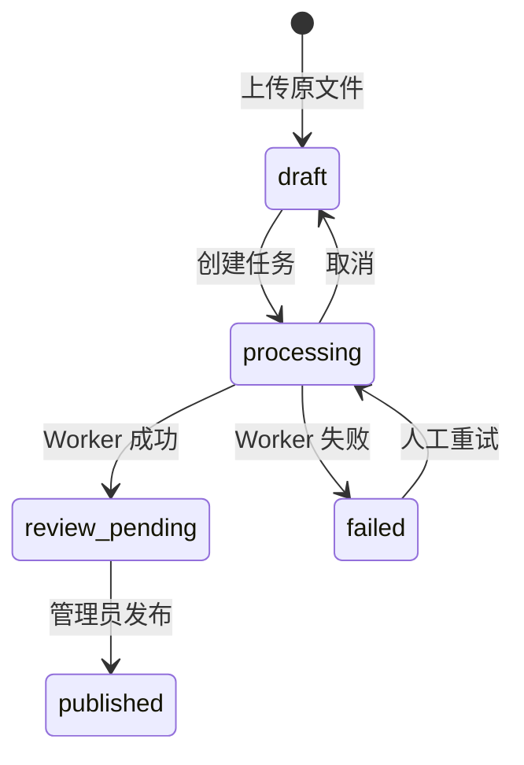
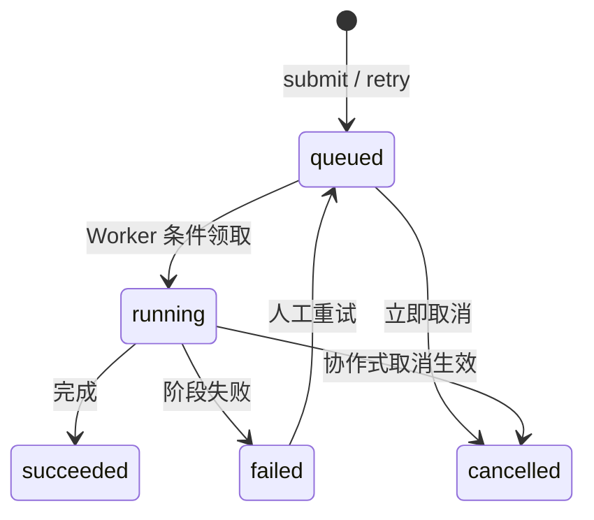

# 企业知识库 Agentic RAG 实战（六）：异步入库与任务状态

> 多格式解析和向量化可能持续几十秒。它们放在上传请求中，会把客户端超时、进程重启和失败重试混进同一条 HTTP 连接。本章让接口只创建任务，由独立 Worker 执行入库。

## 本章交付与边界

本章的配套项目实现了以下最小闭环：

- 上传接口创建 `draft` 文档；提交接口返回 `202 Accepted` 和持久化的任务 ID；
- `ingestion_tasks` 记录任务状态、阶段、进度、尝试次数和稳定错误码；
- `python -m app.worker [task_id]` 领取一个任务，下载原文件、解析、将 Chunk 写入数据库，再把文档推进到 `review_pending`；
- 客户端可查询、取消失败前的任务，也能将 `failed` 任务重新排队；
- 领取使用条件更新，两个 Worker 不能同时领取同一个 `queued` 任务。

当前实现从 SQLite 任务表领取任务，适合本地演示和单机开发。它还没有 Redis 投递、租约续期、阶段产物复用或自动退避；这些是第 14 章可靠投递与生产部署要补齐的能力，不能把它们说成已经实现。MQ 与 Worker 的通用概念见 [消息队列](./message-queue)、[Worker 与异步任务](./background-worker)；FastAPI 侧的后台任务边界见 [FastAPI 进阶](./fastapi-advanced)。

## 接口先快速结束

上传后，提交文档返回任务，而不是等待解析：

```http
POST /api/documents/{document_id}/submit
HTTP/1.1 202 Accepted

{
  "task_id": "...",
  "document_id": "...",
  "status": "queued",
  "stage": "download",
  "completed": 0,
  "total": 0,
  "attempt": 0,
  "error_code": null,
  "error_detail": null
}
```

任务状态回答“一次处理执行到哪里”，文档状态回答“这个版本能否供检索使用”。在候选版本到达 `review_pending` 前，检索接口不会使用它。发布操作仍受第 4 章的角色与乐观锁约束，见 [文件存储、审核与文档生命周期](./agentic-rag-project-lifecycle)。

## 任务与文档双状态机

文档状态机决定业务可见性；任务状态机决定一次入库执行的生命周期。两套状态必须对照着看，不能用其中一个代替另一个。



任务侧的转移是另一张图：



对照关系如下：

| 任务状态 | 文档状态 | 含义 |
|---|---|---|
| `queued` | `processing` | 已提交，等待 Worker |
| `running` | `processing` | Worker 正在执行某一阶段 |
| `succeeded` | `review_pending` | Chunk 已落库，待人工发布 |
| `failed` | `failed` | 稳定错误码可查询，等待人工决策 |
| `cancelled` | `draft` | 用户放弃本次入库，可重新提交 |

`retry_wait` 出现在领取条件里，是为将来自动退避预留的中间态；本章本地演示不会主动写入它，但条件更新必须把它和 `queued` 一并纳入可领取集合，避免以后接入退避时改领取语义。

API 必须拒绝非法转移。典型例子：

- 对已经 `succeeded` 的任务再 `DELETE /ingestion-tasks/{id}`：取消接口只接受 `queued` / `running` / `retry_wait`，否则返回 `409 conflict`。成功任务对应的文档已在 `review_pending`，取消没有业务含义。
- 对仍是 `draft`、尚未产生失败任务的文档直接 `POST .../retry`：重试只接受任务与文档都是 `failed`。草稿应走提交接口，而不是重试接口。
- 对 `running` 任务再 `submit`：文档已不在 `draft`，创建任务会返回 `409 conflict`。

这些拒绝不是礼貌性校验，而是防止界面或脚本把状态机推到无法解释的组合。

## 数据库是当前任务事实来源

任务记录与文档记录分开保存。最小字段足以回答运维和界面需要的问题：

```python
class IngestionTaskRow(Base):
    id: Mapped[str]
    document_id: Mapped[str]
    status: Mapped[str]       # queued/running/succeeded/failed/cancelled
    stage: Mapped[str | None] # download/parse/embedding/indexing/finalizing
    completed: Mapped[int]
    total: Mapped[int]
    attempt: Mapped[int]
    error_code: Mapped[str | None]
    error_detail: Mapped[str | None]
    worker_id: Mapped[str | None]
```

创建任务时，文档与任务在同一事务里一起改：

```python
document.status = "processing"
task = IngestionTaskRow(
    id=str(uuid4()),
    document_id=document_id,
    status="queued",
    stage="download",
)
```

客户端随后只读任务表就能画进度条；文档表回答“能不能发布 / 能不能检索”。不要把进度字段塞进文档行——一次文档可能对应多次失败与重试，任务行才是执行历史的载体。

## 领取与互斥

Worker 领取任务时不能先读状态、再无条件写状态。两个进程可能同时读到 `queued`，各自以为自己拿到了执行权。项目使用带状态条件的更新：

```python
claimed = await session.execute(
    update(IngestionTaskRow)
    .where(
        IngestionTaskRow.id == task_id,
        IngestionTaskRow.status.in_({"queued", "retry_wait"}),
    )
    .values(
        status="running",
        stage="parse",
        worker_id=worker_id,
        attempt=IngestionTaskRow.attempt + 1,
    )
)
if claimed.rowcount != 1:
    return None
```

`rowcount != 1` 的含义很具体：

- `0`：任务不存在，或状态已经不是可领取集合。另一个 Worker 刚领走、任务已被取消、任务已失败，都会落到这里。
- 绝不应出现 `> 1`：条件里带了主键 `id`。若真出现，说明领取语句写错了范围，必须立刻修，而不是“取第一条继续跑”。

没有更新到行的 Worker 直接退出。它不会再次解析或覆盖索引。

单机多 Worker 演示可以这样断言：

```python
first = await documents.claim_ingestion_task(task_id, "worker-one")
second = await documents.claim_ingestion_task(task_id, "worker-two")
assert first is not None and first.status == "running"
assert first.worker_id == "worker-one"
assert second is None
```

命令行上开两个终端同时跑同一 `task_id`，预期日志大致是：

```text
# terminal A
claimed task=... worker=worker-one status=running attempt=1
stage=download 0/1
stage=parse 0/1
...

# terminal B
claim missed task=... worker=worker-two  # rowcount == 0，进程退出码 0
```

配套测试 `test_only_one_worker_can_claim_a_queued_task` 覆盖了这条互斥。手工演示时务必让两个进程打同一数据库文件；各自一套临时目录等于没有竞争。

当前互斥只保证“同一时刻只有一个领取成功”。它**不**解决 Worker 领取后崩溃、任务永久停在 `running` 的问题。生产上还要租约与超时回收，见 [入库可靠性与索引一致性](./agentic-rag-project-reliability)。本章故意不引入心跳，避免把“能跑通的最小闭环”和“生产级租约”混成同一交付物。

## 阶段进度与错误码

Worker 在每个可观察边界调用 `report_ingestion_progress`。界面不应猜测“跑了多久”，而应读 `stage` / `completed` / `total`。

| stage | completed / total 写什么 | 说明 |
|---|---|---|
| `download` | `0/1` → 成功后进入下一阶段 | 从对象存储取原文件 |
| `parse` | `0/1` | 解析与切分；失败多落在这里 |
| `embedding` | `0/N`，N 为 Chunk 数 | 本章教学实现仍以持久化 Chunk 为主；进度先按 Chunk 总数占位 |
| `indexing` | `N/N` | Chunk 已写入数据库，内存索引缓存同步更新 |
| `finalizing` | 完成时写入 | 文档切到 `review_pending`，任务切到 `succeeded` |

进度更新本身也带状态守卫：只有 `running` 任务会接受新的 `stage`。若取消已经生效，后续 `report_ingestion_progress` 是空操作，不会把已取消任务改回“看起来还在跑”。

失败时写入稳定 `error_code`，详情截断到有限长度：

| error_code | 何时出现 | 客户端能否依赖 |
|---|---|---|
| `parse_error` | 解析器抛错，例如损坏 PDF | 可以。提示用户检查文件格式 |
| `object_read_error` | 对象存储读取失败 | 可以。提示稍后重试或检查对象是否存在 |
| `empty_document` | 解析成功但没有可索引文本 | 可以。提示内容为空 |
| `document_not_found` | 任务指向的文档行不存在 | 可以。属于数据不一致，应报警 |
| `internal_error` | 未分类执行异常 | 可以展示码；详情只给类型名 |
| `provider_unavailable` | 预留：Embedding / LLM 提供方不可用 | 本章未写入；接入外部提供方后再启用 |

客户端可以依赖这些码做分支文案和重试按钮，**不能**依赖堆栈、SQL 原文或对象存储内部路径。`error_detail` 目前写入异常类型名并截断到 500 字符，足够排障分类，又不把敏感路径送进任务接口。

## Worker 把可失败步骤放在 HTTP 之外

实际 Worker 的主流程在 `app/ingestion.py`：

```python
task = await documents.claim_ingestion_task(task_id, worker_id)
raw = await object_store.get(document.object_key)
chunks = parse_document(document.filename, raw)
if await self._cancelled(task.id):
    return await documents.get_ingestion_task(task.id)
await documents.replace_chunks(document.id, chunks)
await documents.report_ingestion_progress(task.id, "indexing", len(chunks), len(chunks))
if await self._cancelled(task.id):
    await documents.discard_chunks(document.id)
    return await documents.get_ingestion_task(task.id)
completed = await documents.complete_ingestion_task(task.id)
```

解析器错误会写入 `parse_error`，对象读取失败写入 `object_read_error`，未知执行错误写入 `internal_error`。对普通客户端只返回稳定错误码和受限长度的详情；堆栈不应放进任务接口。

`replace_chunks` 在一个事务中先删除同一文档的旧 Chunk 再插入新结果，因此相同文档再次执行不会累积重复记录。API 在查询前从这些持久化 Chunk 重建教学用内存向量索引，保证 API 和 Worker 分进程运行时仍能看到同一份数据。这个每次查询重建的做法只适合本章的小数据集；第 7 章会用持久化向量索引替代它。生产索引仍需要以 `document_id + index_version` 设计唯一性约束。

启动方式：

```bash
# API 和 Worker 必须使用相同的 DATABASE_URL 与 OBJECT_STORE_ROOT。
set -a && source .env && set +a
uv run uvicorn app.main:app --reload

# 另开终端，执行一条已创建的任务；不带 task_id 时领取最早的 queued 任务。
set -a && source .env && set +a
uv run python -m app.worker <task_id>
```

## 取消与人工重试

### 取消窗口

取消分两种时机，项目对它们的处理不同：

| 时机 | 行为 | 原因 |
|---|---|---|
| `queued` / `retry_wait` | API 立即把任务标为 `cancelled`，文档回到 `draft` | 尚未有 Worker 持有执行权，可以同步收尾 |
| `running` | API 同样把任务标为 `cancelled`，文档回到 `draft`；Worker **协作式**检查标志后退出 | 解析或写库可能已开始，强杀进程会留下半成品且难以归因 |

本项目选择协作式取消，而不是向 Worker 进程发信号强杀。理由有三条：

1. 本地演示的 Worker 是短生命周期命令，强杀会把“取消”和“进程崩溃”混成同一种现象，不利于教学。
2. Worker 在写 Chunk 前后检查 `_cancelled`；若取消发生在 `replace_chunks` 之后、`complete` 之前，会调用 `discard_chunks` 清掉候选结果，避免 `draft` 文档残留半套索引。
3. 真正的强制回收属于租约超时范畴，放到第 14 章与心跳一起做。

查询与取消：

```bash
curl http://127.0.0.1:8000/api/ingestion-tasks/<task_id> \
  -H "Authorization: Bearer $TOKEN"

curl -X DELETE http://127.0.0.1:8000/api/ingestion-tasks/<task_id> \
  -H "Authorization: Bearer $TOKEN"
```

对 `succeeded` / `failed` / 已 `cancelled` 的任务再次取消，得到 `409 conflict`。

### 人工重试

修正源文件或确认临时故障后，具有写权限的用户可以重新排队失败任务：

```bash
curl -X POST http://127.0.0.1:8000/api/ingestion-tasks/<task_id>/retry \
  -H "Authorization: Bearer $TOKEN"
```

重试实现刻意保持“同一条任务记录回队列”，而不是再插一条新任务：

```python
# 仅 failed → queued；文档 failed → processing
task.status = "queued"
task.stage = "download"
task.completed = 0
task.total = 0
task.error_code = None
task.error_detail = None
task.worker_id = None
```

要点：

- **attempt 在领取时自增**，不在 retry 接口里自增。这样“点了重试但还没被 Worker 拿走”不会虚增尝试次数；真正开始执行才算一次 attempt。
- **不必在 retry 时预先清 Chunk**。下一次成功路径的 `replace_chunks` 会在同一事务里删旧插新；若上次失败发生在解析阶段，本来也可能没有 Chunk。
- **损坏 PDF 重试仍会失败**，并再次得到 `parse_error`。重新排队不是自动重试策略；把它改成自动循环只会消耗 CPU 和对象存储流量。用户需要先替换原文件，或确认提供方故障已恢复，再点重试。
- **取消后的任务不能 retry**。取消把文档送回 `draft`，正确入口是再次 `submit`，必要时先换文件再提交。把 cancel 与 retry 混用，会让审计日志里的“失败原因”失去意义。

一次失败 → 重试 → 再失败的预期轨迹：

```text
submit            task=queued     doc=processing  attempt=0
worker claim      task=running    doc=processing  attempt=1
parse_error       task=failed     doc=failed      error_code=parse_error
retry             task=queued     doc=processing  attempt=1   # 尚未再领
worker claim      task=running    doc=processing  attempt=2
parse_error       task=failed     doc=failed      error_code=parse_error
```

界面应展示 `attempt` 与 `error_code`，而不是只显示“失败”。运维据此判断是坏文件、对象丢失，还是偶发内部错误。

## 与 MQ 的演进路径

本章把数据库任务表同时当作事实来源和可运行队列。这是有意的本地形态，不是生产终态。

```text
现在（第 6 章）
  API 写 ingestion_tasks(status=queued)
  Worker 条件 UPDATE 领取
  查询 / 取消 / 重试都打在同一张表

下一步
  DB 继续存事实状态与进度
  Redis（或其它 MQ）只传递 task_id
  Worker 收到消息后再按 task_id 做条件领取

第 14 章
  同一事务写入 Outbox
  Relay 投递 MQ，消除“库已提交、消息未发出”窗口
  租约、幂等阶段、索引版本切换一起补齐
```

创建任务时，本地代码已经在同一事务里插入一条 Outbox 事件，作为第 14 章的脚手架；本章 Worker **并不**消费这条 Outbox，仍然直接按 `task_id` 或“最早 queued”领取。不要把“表里有 Outbox 行”理解成“可靠投递已经完成”。

概念层继续读：

- [消息队列](./message-queue)：ACK、幂等、死信、积压
- [Worker 与异步任务](./background-worker)：并发上限、心跳、租约
- [入库可靠性与索引一致性](./agentic-rag-project-reliability)：Outbox、至少一次投递、候选索引

## 验证点

按下面清单自检；每条都能在配套测试或手工步骤里复现。

- [ ] `POST /api/documents/{id}/submit` 返回 `202`，body 含 `task_id`，任务 `status=queued`、`stage=download`
- [ ] `GET /api/ingestion-tasks/{id}` 能读到与提交时一致的字段
- [ ] `queued` 任务可立即取消；文档回到 `draft`
- [ ] 对 `succeeded` 任务再取消得到 `409 conflict`
- [ ] 损坏 PDF 跑 Worker 后得到 `failed` + `parse_error`；文档状态为 `failed`
- [ ] 对失败任务 `POST .../retry` 回到 `queued`；`attempt` 在下一次领取前不变
- [ ] 对 `draft` 文档或非 `failed` 任务调用 retry 得到 `409 conflict`
- [ ] 两个 Worker 抢同一 `task_id`，只有一个得到 `running`，另一个领取结果为 `None`
- [ ] Worker 成功后文档进入 `review_pending`，检索在发布前仍不可见该版本
- [ ] API 与 Worker 分进程、共用同一 `DATABASE_URL` 与对象目录时，问答仍能读到持久化 Chunk

运行：

```bash
cd projects/agentic-rag
uv run ruff check .
uv run pytest
```

与本章直接相关的测试包括：

- `test_ingestion_task_is_observable_and_cancellable`
- `test_failed_ingestion_can_be_requeued_by_an_authorized_user`
- `test_only_one_worker_can_claim_a_queued_task`
- `test_api_can_answer_after_a_separate_worker_persists_chunks`

本章完成后，入库不再依赖一条脆弱的长 HTTP 请求。下一章把教学用的内存向量扫描替换为混合召回、RRF、Rerank 和相邻块合并，并用固定问题集比较检索质量。

继续阅读[第 7 章：混合召回与 Rerank](./agentic-rag-project-retrieval)。
