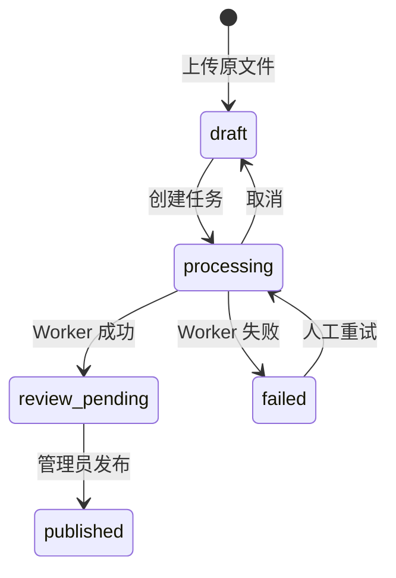

# 企业知识库 Agentic RAG 实战（六）：异步入库与任务状态

> 多格式解析和向量化可能持续几十秒。它们放在上传请求中，会把客户端超时、进程重启和失败重试混进同一条 HTTP 连接。本章让接口只创建任务，由独立 Worker 执行入库。

## 本章交付与边界

本章的配套项目实现了以下最小闭环：

- 上传接口创建 `draft` 文档；提交接口返回 `202 Accepted` 和持久化的任务 ID；
- `ingestion_tasks` 记录任务状态、阶段、进度、尝试次数和稳定错误码；
- `python -m app.worker [task_id]` 领取一个任务，下载原文件、解析、将 Chunk 写入数据库，再把文档推进到 `review_pending`；
- 客户端可查询、取消失败前的任务，也能将 `failed` 任务重新排队；
- 领取使用条件更新，两个 Worker 不能同时领取同一个 `queued` 任务。

当前实现从 SQLite 任务表领取任务，适合本地演示和单机开发。它还没有 Redis 投递、租约续期、阶段产物复用或自动退避；这些是第 14 章可靠投递与生产部署要补齐的能力，不能把它们说成已经实现。

## 接口先快速结束

上传后，提交文档返回任务，而不是等待解析：

```http
POST /api/documents/{document_id}/submit
HTTP/1.1 202 Accepted

{
  "task_id": "...",
  "document_id": "...",
  "status": "queued",
  "stage": "download",
  "completed": 0,
  "total": 0,
  "attempt": 0,
  "error_code": null,
  "error_detail": null
}
```

任务状态回答“一次处理执行到哪里”，文档状态回答“这个版本能否供检索使用”。当前版本的状态转换是：



在候选版本到达 `review_pending` 前，检索接口不会使用它。发布操作仍受第 4 章的角色与乐观锁约束。

## 数据库是当前任务事实来源

任务记录与文档记录分开保存。最小字段足以回答运维和界面需要的问题：

```python
class IngestionTaskRow(Base):
    id: Mapped[str]
    document_id: Mapped[str]
    status: Mapped[str]       # queued/running/succeeded/failed/cancelled
    stage: Mapped[str | None] # download/parse/embedding/indexing/finalizing
    completed: Mapped[int]
    total: Mapped[int]
    attempt: Mapped[int]
    error_code: Mapped[str | None]
    error_detail: Mapped[str | None]
    worker_id: Mapped[str | None]
```

Worker 领取任务时不能先读状态、再无条件写状态。两个进程可能同时读到 `queued`。项目使用带状态条件的更新：

```python
claimed = await session.execute(
    update(IngestionTaskRow)
    .where(
        IngestionTaskRow.id == task_id,
        IngestionTaskRow.status.in_({"queued", "retry_wait"}),
    )
    .values(status="running", worker_id=worker_id)
)
if claimed.rowcount != 1:
    return None
```

没有更新到行的 Worker 直接退出。它不会再次解析或覆盖索引。

## Worker 把可失败步骤放在 HTTP 之外

实际 Worker 的主流程在 `app/ingestion.py`：

```python
task = await documents.claim_ingestion_task(task_id, worker_id)
raw = await object_store.get(document.object_key)
chunks = parse_document(document.filename, raw)
await documents.replace_chunks(document.id, chunks)
completed = await documents.complete_ingestion_task(task.id)
```

解析器错误会写入 `parse_error`，对象读取失败写入 `object_read_error`，未知执行错误写入 `internal_error`。对普通客户端只返回稳定错误码和受限长度的详情；堆栈不应放进任务接口。

`replace_chunks` 在一个事务中先替换同一文档的旧 Chunk，因此相同文档再次执行不会累积重复记录。API 在查询前从这些持久化 Chunk 重建教学用内存向量索引，保证 API 和 Worker 分进程运行时仍能看到同一份数据。这个每次查询重建的做法只适合本章的小数据集；第 7 章会用持久化向量索引替代它。生产索引仍需要以 `document_id + index_version` 设计唯一性约束。

## 查询、取消和重试

```bash
# API 和 Worker 必须使用相同的 DATABASE_URL 与 OBJECT_STORE_ROOT。
set -a && source .env && set +a
uv run uvicorn app.main:app --reload

# 另开终端，执行一条已创建的任务；不带 task_id 时领取最早的 queued 任务。
set -a && source .env && set +a
uv run python -m app.worker <task_id>
```

查询进度：

```bash
curl http://127.0.0.1:8000/api/ingestion-tasks/<task_id> \
  -H "Authorization: Bearer $TOKEN"
```

取消尚未完成的任务：

```bash
curl -X DELETE http://127.0.0.1:8000/api/ingestion-tasks/<task_id> \
  -H "Authorization: Bearer $TOKEN"
```

修正源文件或确认临时故障后，具有写权限的用户可以重新排队失败任务：

```bash
curl -X POST http://127.0.0.1:8000/api/ingestion-tasks/<task_id>/retry \
  -H "Authorization: Bearer $TOKEN"
```

重新排队不是自动重试策略。损坏 PDF 仍会再次失败；将其改为自动重试只会消耗资源。未来接入 Redis 时，数据库任务表仍应保存事实状态，队列只传递任务 ID；第 14 章再用 Outbox 处理“事务提交后、消息投递前”进程崩溃的窗口。

## 验证点

配套测试覆盖了：提交返回 `202`、任务状态可查询、取消让文档回到 `draft`、损坏 PDF 得到 `parse_error` 后可重新排队，以及一个任务只能被一个 Worker 领取。运行：

```bash
cd projects/agentic-rag
uv run ruff check .
uv run pytest
```

本章完成后，入库不再依赖一条脆弱的长 HTTP 请求。下一章把教学用的内存向量扫描替换为混合召回、RRF、Rerank 和相邻块合并，并用固定问题集比较检索质量。

继续阅读[第 7 章：混合召回与 Rerank](./agentic-rag-project-retrieval)。
