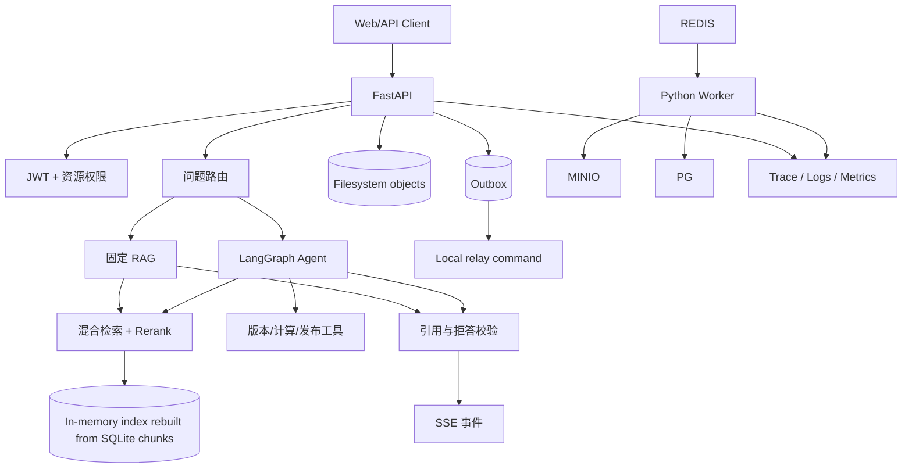

# 企业知识库 Agentic RAG 实战（十七）：项目复盘与求职表达

> 这一章不再增加框架和中间件。目标是把前十六章形成的系统整理成一个别人能快速看懂、可以现场运行、经得住连续追问的项目，而不是把技术名词堆进简历。

## 先区分已实现与规划项

当前仓库已验证的能力包括：FastAPI 文档上传、SQLite 持久化任务、独立 Worker、多格式解析、权限内混合检索、引用校验、确定性路由、LangGraph 有界检索、版本工具、会话摘要、发布提案、SSE、Outbox 记录、健康探针和本地评测。Redis Relay、持久化 Checkpoint、租约索引切换、OpenTelemetry、真实 PostgreSQL/MinIO 拓扑和跨副本恢复仍是规划项；简历只能写前一组，后一组应标成设计或待实现。

## 先形成一句准确的项目介绍

可以这样介绍：

> 我用 Python 和 FastAPI 实现了一套企业知识库 Agentic RAG 本地项目。系统支持多格式文档入库、审核发布、权限过滤、混合检索和可定位引用；简单问题走固定 RAG，比较和多跳问题进入 LangGraph 的有限多轮检索；本地任务使用持久化状态、条件领取、事务内 Outbox 记录和失败重排队，并用固定数据集评估路由、来源召回、拒答和越权来源。

这段介绍先说明业务和行为，再说关键技术。每个能力都能指向对应接口、Trace、测试或评测报告。

不要写“企业级”“高并发”“准确率提升 40%”这类没有证据的词。做的是个人实战项目就如实说明，技术深度来自可运行实现和取舍，不来自虚构用户规模。

## 用八分钟完成一次演示

### 第一分钟：说明业务边界

展示三名用户和三个知识库：Alice 只能读公共制度，Bob 还能读研发内部手册，Carol 管理版本。强调普通问答只使用已发布文档。

### 第二、三分钟：上传和发布

上传一份制度，观察异步任务从解析、切分、Embedding 到候选索引完成。发布前提问没有结果，Carol 审核发布后可以召回，并能点击页码或表格区域查看原文。

### 第四分钟：权限对照

Bob 询问 P1 故障响应时间，命中研发手册。Alice 使用相同问题和 Prompt Injection 语句，候选与来源都为空。展示权限条件位于检索 SQL，而不是 Prompt。

### 第五、六分钟：Agentic RAG

询问上海住宿上限、报销期限和材料。SSE 展示 Plan、两次检索、Evidence Assess、答案生成和引用校验。再问北京与成都差值，展示确定计算工具。

### 第七分钟：当前边界

展示任务表中的失败状态、重排队和 Outbox 事件，再说明 Redis Relay、租约和候选索引切换还没有在本地版本实现。演示只报告已经运行过的行为，不把设计图当作故障实验结果。

### 第八分钟：评测和 Trace

打开固定评测报告，说明 Recall@K、MRR、引用、拒答、越权率、延迟和 Token 口径；再打开一次慢请求 Trace，定位耗时节点。

演示按“用户结果 → 设计原因 → 运行证据”展开，不在终端里逐个介绍目录。

## 一张图讲清系统



讲图时沿一条请求走，不要逐个念组件：身份形成 SearchScope，路由选择固定或 Agent 链路，检索只读权限范围内的本地索引，生成后校验引用，通过 SSE 返回；入库则由 SQLite 任务、Outbox 记录和 Worker 形成可重复执行的本地链路。生产 PostgreSQL、pgvector、Redis 和 MinIO 是迁移方向，不是本地演示的依赖。

## 准备五个关键设计取舍

### 1. 为什么不是所有请求都走 Agent

简单事实用固定 RAG 延迟更低、步骤更少、容易评测。比较和多跳问题才需要规划、证据判断与再次检索。路由错误时默认降级到安全短链路。

### 2. 为什么权限在检索前过滤

先全库 Top K 再过滤会污染候选、日志、缓存和 Rerank，还会因删除结果降低召回。项目让向量与关键词 SQL 共用 SearchScope，模型从未看到无权内容。

### 3. 为什么用父子 Chunk

小 Chunk 适合准确召回，大 Chunk 保留完整条件。子 Chunk 参与向量和 Rerank，命中后回填父节或完整表格，引用仍定位原文。

### 4. 为什么记录 Outbox 而不是只依赖内存队列

数据库提交和外部投递之间有故障窗口。当前任务记录与 Outbox 同事务，`app.outbox_relay` 可以标记已发布事件；真正的 Redis 至少一次投递和租约需要后续生产扩展。

### 5. 为什么需要引用服务端校验

Prompt 要求 `[S1]` 不能保证模型遵守。服务端分配来源 ID，验证 Claim 只引用本次 Evidence，并检查关键数字，失败时修复一次或拒答。

这些取舍比“用了哪些库”更能体现 AI 应用开发能力。

## 简历描述从真实证据生成

项目完成后，可以按实际实现写成：

```text
企业知识库 Agentic RAG 平台｜个人实战

- 基于 FastAPI、SQLAlchemy/SQLite、文件对象存储与 LangGraph 实现文档入库和问答链路，支持多格式结构化解析、混合召回、Rerank 和请求级引用。
- 设计 JWT、团队与知识库资源权限，将过滤条件下推到向量和关键词检索，使用越权与 Prompt Injection 样例验证无权文档不会进入候选、上下文和流式响应。
- 为复杂问题实现有限多轮检索状态机，加入执行预算、证据完整性判断、发布提案、人工确认和 SSE 事件协议；当前还没有持久化 Checkpoint。
- 使用事务内 Outbox 记录、条件领取、Chunk 替换和失败重排队处理本地重复与中断；任务租约、候选索引切换和故障注入仍待实现。
- 建立覆盖路由、来源召回、拒答和越权率的本地离线评测，当前结果见 `uv run python -m evals.run`；延迟、Token 和成本尚未接入。
```

最后一句中的指标应替换成仓库实际报告结果。没有运行报告时只描述“建立了评测”，不能填写一个估计提升值。

## 建立证据索引

README 为每项能力提供入口：

| 能力 | 证据 |
|---|---|
| 权限下推 | 检索 Repository、Alice/Bob 对照场景、安全报告 |
| 多格式与引用 | Parser、Chunk 预览、来源定位演示 |
| Agent 状态机 | Graph 定义、Run Trace、预算退出样例 |
| 人工确认 | 提案表、审批接口、暂停恢复事件 |
| 入库可靠性 | Outbox 记录、条件领取、失败重排队测试 |
| 效果评测 | 数据集、Runner、版本化 JSON/HTML 报告 |
| 部署恢复 | Compose、迁移、备份与恢复记录 |

面试官追问时打开对应证据，不靠背诵回答。仓库结构也围绕运行入口、架构、演示和报告组织，避免把关键内容藏在十几篇聊天记录里。

## 坦诚说明当前限制

个人实战项目应该明确边界：

- 固定样例规模小，评测结果不能代表所有企业文档。
- 中文表格、扫描 PDF 和复杂版式仍可能解析失败。
- LLM Judge 只辅助评审，不能证明事实绝对正确。
- Docker Compose 验证单机服务边界，没有声称完成多区域高可用。
- 模型供应商兼容层需要按实际 API 继续适配。

说明限制后接上已经设计的改进路径，例如扩充失败样例、增加人工标注、使用对象存储事件校验、做负载与恢复演练。坦诚边界不会削弱项目，反而说明你知道证据能支持到哪里。

## 从已有经验连接到 AI 应用岗位

如果原本是前端或全栈开发，可以突出能力迁移：

- API、鉴权、数据库事务和异步任务仍是可靠 AI 应用的基础。
- 新增能力是把非确定模型放进有状态、有预算、可校验的系统。
- 前端经验可以用于 SSE 事件消费、引用交互和人工确认界面。
- 后端经验可以用于权限下推、Outbox、幂等、索引一致性和可观测性。

不要把过去经验描述成“已经过时”。这个项目展示的是如何把成熟工程能力用在模型不确定性上。

## 最终交付结构

完成后的仓库至少提供：

```text
README.md                  项目效果、快速启动和演示入口
app/                       API、领域服务、Graph、Worker 和本地 Relay
fixtures/                  去敏样例文档和用户场景
evals/                     数据集、Runner 和确定性评分器
reports/                   本地基线与逐条失败记录
tests/                     关键边界验证
Dockerfile                 本地 API/Worker 镜像
compose.yaml               本地 API、Worker 和 Relay 入口
```

新读者按 README 能启动服务、导入样例、完成一条固定 RAG、一条 Agentic RAG 和一条越权对照。所有命令与报告都来自当前提交。

## 系列完成后的能力边界

这套项目已经覆盖 AI 应用开发的主要本地链路：数据进入系统、结构化解析、索引、检索、上下文、生成、引用、Agent 控制流、工具、人工介入、流式协议、安全、Outbox 记录、评测、健康检查和容器启动。生产 Checkpoint、共享队列、完整观测后端和多副本恢复仍需要继续建设。

继续深入可以选择一个方向，而不是再次横向堆技术：复杂文档解析、检索算法、Agent 工作流、模型网关、评测平台或生产可靠性。此时新增组件应该由真实失败样例推动，并继续使用同一套证据和评测方法判断是否值得。
