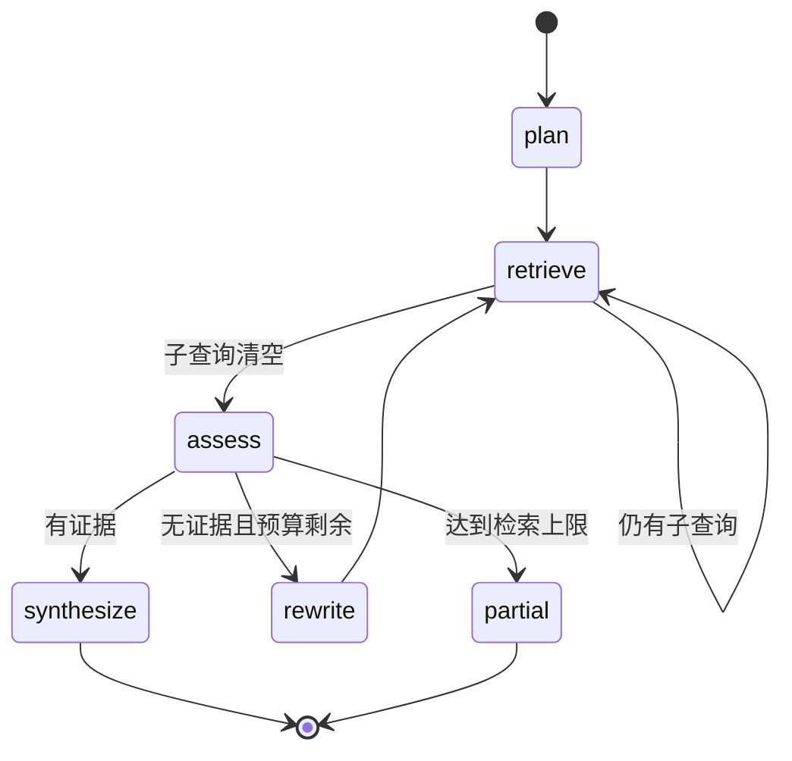

# 企业知识库 Agentic RAG 实战（十）：LangGraph 多轮检索状态机

> 第 9 章的路由已经能识别“这不是一次检索能稳定完成的问题”，但识别之后只会降级回固定 RAG。本章把这条入口接进一个有节点、条件边和检索预算的 LangGraph 状态机。先说清本章定位：这是一个**确定性的编排骨架**——节点内部还没有 LLM，规划用规则、评估是占位。先把状态转移、权限边界和终止条件做对，再让模型进入决策点，这是本章最重要的取舍。

## 本章完成后的可见结果

启动项目后，向 `/api/chat` 提出一个跨两份文档的问题：

```bash
curl -s -X POST http://127.0.0.1:8000/api/chat \
  -H "Authorization: Bearer $ALICE_TOKEN" \
  -H 'Content-Type: application/json' \
  -d '{"question": "我去上海出差，住宿上限是多少？出差回来多久内要提交报销？"}'
```

响应中的控制字段：

```json
{
  "route": "agentic_rag",
  "intent": "multi_fact",
  "route_reason": "evidence_sufficient",
  "route_degraded": false,
  "partial": false,
  "agent_trace": ["plan", "retrieve", "retrieve", "assess", "synthesize"]
}
```

`agent_trace` 就是本章新增的可见性：`plan` 把问题拆成两个子查询，`retrieve` 执行两轮，`assess` 判定已有证据，`synthesize` 交给合成。第 9 章在多事实问题上只能返回一次检索的结果，现在你能看到系统“分几步、每步做了什么、为什么停”。

## 当前系统的缺口

第 9 章的路由表把多事实问题标为 `agentic_rag`，但当时没有 Agentic 实现，只能带 `route_degraded=true` 降级到固定 RAG。降级的代价在“我去上海出差，住宿上限是多少？回来多久提交报销？”这类问题上立刻可见：

- 一次检索的 top_k 被“住宿上限”和“报销时限”两个主题分摊，每个主题分到的证据都变弱；
- 证据只覆盖一半时，模型要么拒答（第 8 章会正确地拒答），要么用常识补另一半——两者都不是用户要的“两个事实都有出处”。

需要的不是更大的 `top_k`，而是**有限次补充检索**：先查一个主题，再查另一个主题，每轮都在同一权限范围内。这正是 Agent 要解决的控制流问题。

## 方案与取舍：先确定性骨架，再让模型进入决策点

| 方案 | 优点 | 代价与风险 |
|---|---|---|
| 直接让 LLM 做规划与评估 | 一步到位，演示效果好 | 编排错误和模型错误混在一起；测试不确定；权限边界难验证 |
| **确定性骨架，决策点留接口**（本章） | 全离线可测；两类失败分开修；权限边界可被攻击测试 | 演示效果朴素；多事实规划靠规则覆盖有限 |
| 手写 while 循环，不引入框架 | 依赖最少 | 状态隐式分布在变量里；加 Checkpoint/人工介入要重写 |

选择骨架路线的三个理由：

1. **失败隔离**。死循环、状态污染、越权是编排错误；拆错问题、误判证据充分是模型错误。骨架阶段前者由测试锁死，之后接入 LLM 时只需要处理后者。
2. **权限是数据不变量**。第 13 章的越权攻击测试要求“任何一轮检索都不可能扩大范围”，这条性质在零 LLM 的图里最容易证明。
3. **LangGraph 相对手写循环**：State 显式（每步可断言）、条件边是纯函数可单测、后续替换 Checkpointer 或加 `interrupt` 不需要改节点代码——对照[LangGraph 状态机](./agent-langgraph)的概念篇。

本章的三个“占位”先摆在明面上：`_plan` 是关键词规则，`_assess` 不做真实评估，`_rewrite` 是机械改写。它们都是接口已留好的决策点，最后会给出各自接入模型时的契约。

## State 设计：哪些东西该进状态

```python
class AgentState(TypedDict, total=False):
    question: str
    actor_id: str
    scope: SearchScope
    pending_queries: list[str]
    queried: list[str]
    hits: list[SearchHit]
    rounds: int
    max_rounds: int
    exit_reason: str
    node_trace: list[str]
```

| 字段 | 为什么进 State |
|---|---|
| `question` | 原始诉求全程不变，`rewrite` 节点要基于它重新组织查询 |
| `scope` | 权限范围是本次执行的**数据不变量**：图启动时由服务端生成一次，之后任何节点只能引用不能扩大 |
| `pending_queries` / `queried` | 待检索队列与已检索记录，多轮执行的记忆 |
| `hits` | 跨轮累积的命中，按 `chunk.id` 去重合并 |
| `rounds` / `max_rounds` | 业务层检索预算 |
| `exit_reason` | 结构化退出原因，直接映射到响应字段 `route_reason` |
| `node_trace` | 节点轨迹，既是调试信息，也是响应契约的一部分 |

`total=False` 配合“节点只返回增量”的纪律：每个节点函数只返回它改变了的字段，LangGraph 负责合并。State 里刻意**不放**模型消息列表（当前没有 LLM 对话）和可变配置——放进 State 的每样东西都会参与多轮合并与断言，放得越多，行为越难预测。

## 完成这条纵向链路

### 图的装配

```python
graph = StateGraph(AgentState)
graph.add_node("plan", self._plan)
graph.add_node("retrieve", self._retrieve)
graph.add_node("assess", self._assess)
graph.add_node("rewrite", self._rewrite)
graph.add_node("synthesize", self._synthesize)
graph.add_edge(START, "plan")
graph.add_edge("plan", "retrieve")
graph.add_conditional_edges("retrieve", self._after_retrieve)
graph.add_conditional_edges("assess", self._after_assess)
graph.add_edge("rewrite", "retrieve")
self._graph = graph.compile()
```



一个值得注意的实现细节：`run_agentic_rag` 目前**每次请求都构建一个新图**。没有 Checkpointer 时图的构建成本可以忽略，这是教学取舍；生产部署应把编译好的图提升为模块级单例，接入 Checkpoint 后更必须如此（图结构变化要能对上已持久化的轨迹）。

### plan：只创建可检索的子问题

```python
def _plan(self, state: AgentState) -> AgentState:
    question = state["question"]
    if "住宿" in question and ("报销" in question or "材料" in question):
        queries = ["差旅 住宿 标准 城市 上限", "出差 报销 提交期限 材料"]
    else:
        queries = [question]
    return {
        "pending_queries": queries,
        "node_trace": [*state["node_trace"], "plan"],
    }
```

规则规划只覆盖 fixture 里验证过的多事实组合，其余问题原样透传。两条设计约束比“拆得准”更重要：

- **子查询不包含预期答案**。把“650 元”写进检索词会造成自我实现——检索命中只证明查询词匹配，不证明答案正确。
- **规划输出必须是受限的子问题对象**，不是自由文本行动计划。未来接入 LLM 规划器时的契约：结构化输出（如 Pydantic 的 `QueryPlan`）、子查询数量上限、解析失败回退到本章的规则实现。

### retrieve：一次一查、跨轮去重、权限继承

```python
async def _retrieve(self, state: AgentState) -> AgentState:
    query = state["pending_queries"][0]
    pending = state["pending_queries"][1:]
    hits, _ = await self._rag.retriever.retrieve(query, state["scope"])
    by_id = {hit.chunk.id: hit for hit in state["hits"]}
    by_id.update({hit.chunk.id: hit for hit in hits})
    return {
        "pending_queries": pending,
        "queried": [*state["queried"], query],
        "hits": list(by_id.values()),
        "rounds": state["rounds"] + 1,
        "node_trace": [*state["node_trace"], "retrieve"],
    }
```

三个动作各管一件事：FIFO 消费一个子查询；命中按 `chunk.id` 去重合并（同一 Chunk 被两个子查询命中只算一次）；`rounds` 递增。检索本身完全复用[第 7 章的混合召回](./agentic-rag-project-retrieval)，Profile 仍是 `hybrid-v1`——Agent 不拥有第二套检索实现。

权限继承是本章的安全核心：图启动时由服务端从 JWT 身份生成 `SearchScope` 并写入 State，`retrieve` 只把这个范围传给检索器。它没有“搜索全部文档”的工具，也没有任何节点能改写 `scope`。Alice 提出研发与住宿混合的问题，任意一轮都不会拿到 `kb-engineering` 的 Chunk。

### 两条条件边

```python
@staticmethod
def _after_retrieve(state: AgentState) -> Literal["retrieve", "assess"]:
    return "retrieve" if state["pending_queries"] else "assess"

@staticmethod
def _after_assess(state: AgentState) -> Literal["synthesize", "rewrite", "partial"]:
    if state["hits"]:
        return "synthesize"
    if state["rounds"] >= state["max_rounds"]:
        return "partial"
    return "rewrite"
```

条件边是纯函数，这正是它能被直接单测的原因。必须诚实地标注：`_after_assess` 的“有证据”只是**可运行的停机条件**——有一条命中就会合成，并不判断证据是否覆盖了全部子问题。真正的充分性评估需要理解“问题问了几个事实、每个事实有没有出处”，那是模型决策点，属于生产扩展方向；在第 15 章之前，完整性由标注题集离线衡量，不靠图内自评。

### rewrite 与两个出口

```python
def _rewrite(self, state: AgentState) -> AgentState:
    rewritten = f"{state['question']} 制度规定 第 {state['rounds'] + 1} 次检索"
    return {
        "pending_queries": [rewritten],
        "node_trace": [*state["node_trace"], "rewrite"],
    }
```

改写只在**没有任何证据**时发生——有部分证据就直接合成，避免为残缺答案继续烧预算。当前改写是机械的（换一种措辞重试），它证明的是“回环路径可达”，语义化改写（哪个子主题没查到、换什么词）是接模型后的事。

| `exit_reason` | 触发条件 | 响应表现 |
|---|---|---|
| `evidence_sufficient` | 走到 `synthesize` | `partial=false`，正常返回答案与引用 |
| `retrieval_budget_exhausted` | 预算内未取得任何证据 | `partial=true`，`missing_information` 说明缺口 |

一个容易忽略的细节：预算耗尽但合成本身发生了拒答时（第 8 章判定证据不足），`partial` 会被拒答语义覆盖为 `false`——“明确拒绝”优先于“部分完成”，两者同时报告会让客户端无所适从。

### 双层终止保险

```python
state = await self._graph.ainvoke({...初始 State...}, {"recursion_limit": 12})
```

- **业务层 `max_rounds=3`**：语义上限——最多补充检索三次，之后承认拿不全。
- **框架层 `recursion_limit=12`**：代码错误的保险丝。条件边写错（比如忘了 `partial` 出口）会造成死循环，业务预算根本没机会生效，框架层的步数上限保证进程不会被拖死。

两层缺一不可：只有业务层，代码 bug 会绕过它；只有框架层，正常的多轮检索会在 LangGraph 的通用报错里终止，客户端拿到的是无法解释的异常而不是 `partial=true`。

### 合成复用固定 RAG 的安全边界

图结束后，最终命中交给第 8 章的 `answer_from_hits`：构建 Evidence、分配请求内来源编号、生成 Claim、校验来源与数字——Agent 只改变控制流，不拥有另一套引用或权限实现。这是有意的设计：安全与引用逻辑单点维护，Agent 层的行为变化不会绕过它们。

demo 回答器的限制在本章再次显形：它只摘取一条直接证据，不能把多个子问题的证据合成为一段自然语言。接入真实模型时必须走第 8 章准备好的结构化输出与逐 Claim 校验契约，并为“多来源合成”补契约测试。

## 运行和观察

```bash
cd projects/agentic-rag
uv run uvicorn app.main:app --reload

# 另一个终端：获取 Alice 的开发 Token
curl -s -X POST http://127.0.0.1:8000/api/auth/dev-token \
  -H 'Content-Type: application/json' \
  -d '{"user_id": "user-finance-alice"}'
# {"access_token": "...", "token_type": "bearer"}
```

把 Token 存入 `ALICE_TOKEN` 后执行本章开头的 `/api/chat` 请求，重点观察三处：

- `agent_trace` 是否为 `["plan", "retrieve", "retrieve", "assess", "synthesize"]`——两个子查询、两次检索；
- `sources` 是否同时覆盖差旅与报销两份文档；
- `route_reason` 与 `partial` 的取值是否与证据情况一致。

节点轨迹也可以不经 HTTP 直接观察：

```bash
uv run pytest tests/test_agent_graph.py -q
```

测试精确断言了轨迹路径和权限范围，是理解状态转移最便宜的入口。

## 失败与边界验证

**预算耗尽**。问一个第二主题在知识库中无证据的组合问题，观察兜底路径：

```text
问题示例：“上海住宿上限是多少？公司育儿假有几天？”
预期：agent_trace 以 partial 结束；partial=true；
     missing_information 非空；exit_reason=retrieval_budget_exhausted
```

系统返回“部分完成 + 缺口说明”，而不是用常识补上育儿假的答案——这正是第 1 章验收表里“不使用模型常识补答案”的执行路径。

**权限边界**。Alice 提出研发与住宿混合的问题：轨迹正常走完，但 `sources` 不含 `kb-engineering` 的任何文档。测试断言的不是“最终答案没提研发内容”，而是**每一轮检索传给检索器的 scope 都相同且来自服务端**——引用层隐藏是过滤不了向量里的信息的，第 13 章会系统性攻击这条边界。

**死循环防线**。`recursion_limit=12` 的存在使得即使未来某次修改把条件边写错，最坏结果是一次受控异常，而不是进程挂死。

```bash
uv run ruff check .
uv run pytest
```

## 当前边界与下一步

本章交付的是一个**有界的只读编排骨架**，边界与扩展方向如下：

- `plan` / `assess` / `rewrite` 三个决策点目前是规则与占位。接入 LLM 的顺序建议是先规划（收益最大、失败可回退），再评估（需要子问题-证据配对的标注数据），最后改写。
- 图内没有 Checkpointer，状态随请求生灭；每请求重建图和内存索引是第 7 章以来一贯的教学取舍。跨进程恢复、暂停与人工介入的过渡形态在[第 11 章](./agentic-rag-project-tools-memory)，持久化属于生产迁移。
- “有证据即合成”不等于“证据充分”，完整性由[第 15 章](./agentic-rag-project-evaluation)的标注题集衡量。

## 本章小结

现在，多事实问题有了一条真实的 Agentic 链路：规划拆子查询、受限多轮检索、预算兜底、结构化退出原因和可观察的节点轨迹；权限范围作为数据固化在 State 里，任何一轮都不能扩大。你同时带走了三个 LangGraph 的工程习惯：State 只放需要跨节点合并的数据、条件边写成可单测的纯函数、业务预算与框架步数上限双层终止。

继续阅读[第 11 章：工具、记忆与人工介入](./agentic-rag-project-tools-memory)，给这条链路加上受控的工具调用和人工确认。
