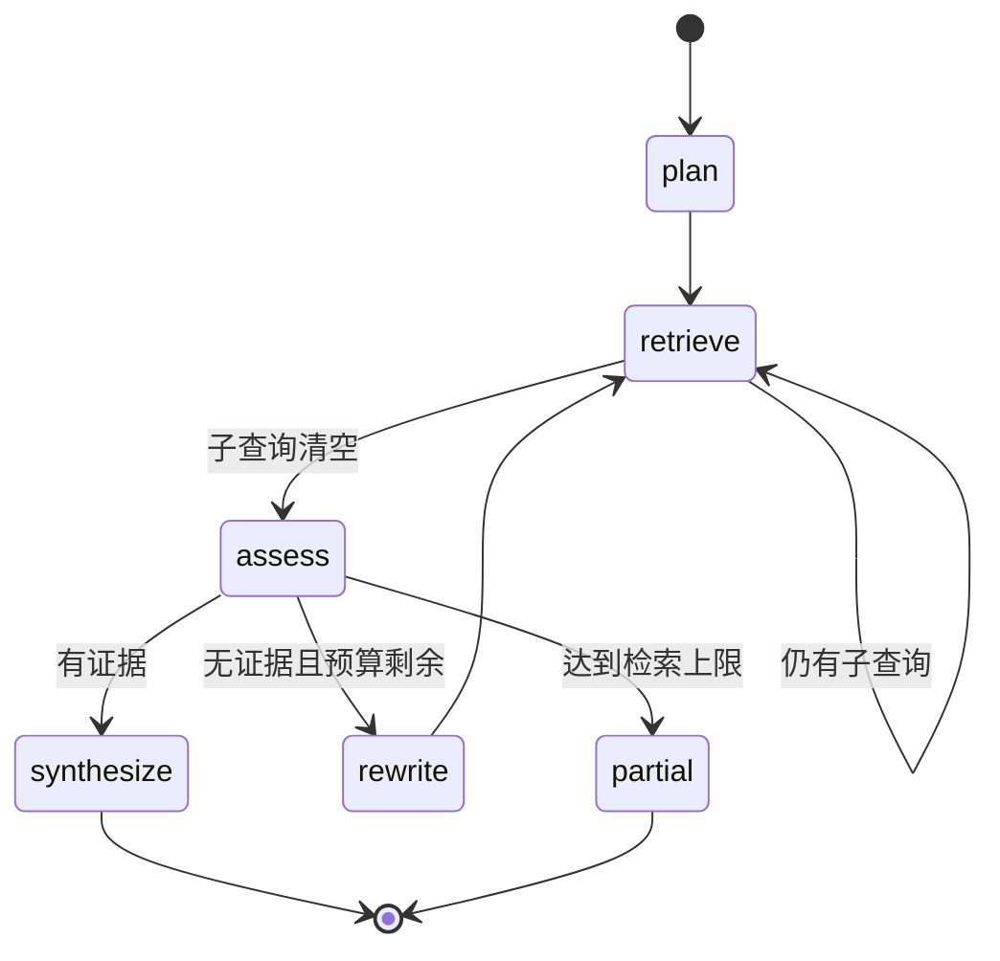

# 企业知识库 Agentic RAG 实战（十）：LangGraph 多轮检索状态机

> 第 9 章已经能识别“这不是一次检索能稳定完成的问题”，但当时只会降级到固定 RAG。本章把这条入口接到一个有明确节点、循环上限和退出原因的 LangGraph。

## 本章实际交付

`app/agent_graph.py` 使用 `StateGraph` 构建只读 Agent：



它的状态包含原问题、固定的 `SearchScope`、待检索查询、已执行查询、去重后的命中、轮数、最大轮数、退出原因和节点轨迹。当前图不写数据库、不调用外部工具，也没有 Checkpointer；第 11 章才会处理暂停、恢复与人工介入。因此状态中暂时包含内存中的 `SearchHit`，不能把本章说成已经支持跨进程恢复。

多事实问题现在真实走 `agentic_rag`，不再保留第 9 章的降级标记。接口会返回：

```json
{
  "route": "agentic_rag",
  "route_degraded": false,
  "partial": false,
  "agent_trace": ["plan", "retrieve", "retrieve", "assess", "synthesize"]
}
```

## Plan 只创建可检索的子问题

当前离线版本没有把规划委托给模型。对于“住宿 + 报销/材料”的组合问题，代码生成两个不含预期答案的查询：

```python
queries = [
    "差旅 住宿 标准 城市 上限",
    "出差 报销 提交期限 材料",
]
```

其余多事实问题先保留原问题作为一个查询。这样能先验证状态转移、权限边界和预算，再引入一个会出错的 LLM 规划器。未来的结构化规划器应输出受限的子问题对象，而不是自由文本行动计划；它也不能把“650 元”之类预期答案写进查询。

## 每次检索都继承同一权限范围

图开始时由服务端从 JWT 身份创建 `SearchScope`，并将它保存到 State：

```python
"scope": directory.normal_search_scope(actor)
```

`retrieve` 节点只将这个不可扩大的范围传给既有混合检索器。它没有“搜索所有文档”的工具。因此 Alice 即使提出研发和值班混合问题，任意一轮也不会得到 `kb-engineering` 的 Chunk。测试覆盖了这一边界。

## 有限循环和退出语义

当前最大检索轮数是 3，框架层还设置 `recursion_limit=12` 作为最后保险：

```python
if state["hits"]:
    return "synthesize"
if state["rounds"] >= state["max_rounds"]:
    return "partial"
return "rewrite"
```

改写只在没有任何证据时发生，并明确记录在 `agent_trace` 中。达到上限会返回 `partial=true` 和 `retrieval_budget_exhausted`，而不是继续重复同一个查询。这里的“有证据”只是本章的可运行停机条件，不等于所有子问题都得到完整支持；第 15 章会用标注题集衡量完整性。当前退出状态只在响应轨迹中返回，尚未持久化为 Checkpoint。

## 合成仍复用固定 RAG 的安全边界

Graph 的最终命中交给第 8 章的 `answer_from_hits`：它仍会构建 Evidence、分配请求内来源 ID、生成 Claim 并校验来源与数字。Agent 只改变控制流，不拥有另一套检索、引用或权限实现。

这也说明当前 demo 回答器的限制：它只摘取一条直接证据，不能承诺将多个子问题合成为自然语言答案。真实多事实合成需使用结构化模型输出并逐 Claim 校验；这一接口已经在第 8 章准备好，接入模型时必须增加契约测试。

## 验证点

新增测试验证多事实问题经过 `plan → retrieve → retrieve → assess → synthesize`，并验证 Agent 的每轮检索不会扩大 Alice 的 `SearchScope`。运行：

```bash
cd projects/agentic-rag
uv run ruff check .
uv run pytest
```

继续阅读[第 11 章：工具、记忆与人工介入](./agentic-rag-project-tools-memory)。
