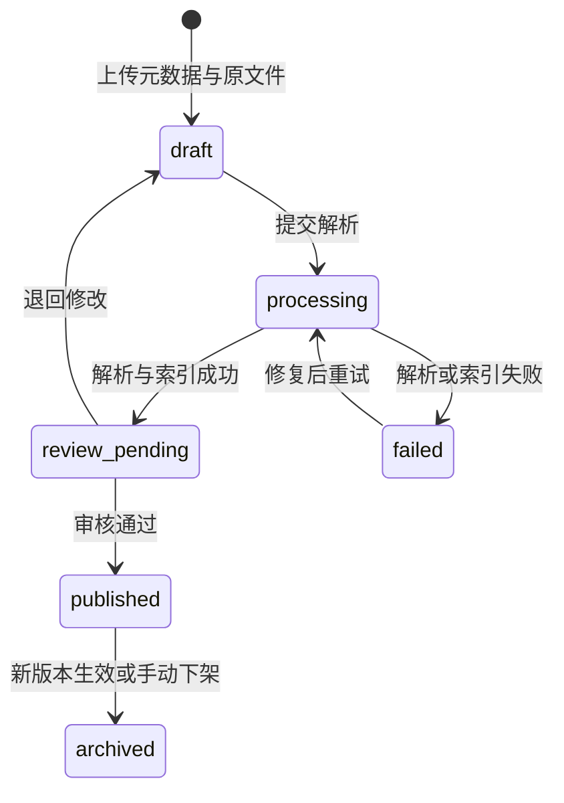

# 企业知识库 Agentic RAG 实战（四）：文件存储、审核与文档生命周期

> 上一章控制了用户能够访问哪些知识库，但上传后的内容仍然立刻可检索。本章把“文件已经上传”和“内容可以回答问题”拆成两个状态，并让版本切换成为可审计的业务操作。

## 先看一份销售政策怎样上线

销售人员上传《渠道折扣政策 V2》后，接口先返回草稿：

```json
{
  "document_id": "doc-sales-price-v2",
  "status": "draft",
  "version": 2,
  "object_key": "kb-sales/doc-sales-price-v2/original.md"
}
```

此时 Carol 在管理页面能看到文件，普通问答却不能用它。即使 Carol 自己提问“年合同额 100 万元可以打几折”，结果仍是拒答。

文档解析完成、审核通过后，Carol 执行发布：

```http
POST /api/documents/doc-sales-price-v2/publish
If-Match: 4
Authorization: Bearer <carol-token>
```

发布事务会把 V2 改成 `published`，把同一文档族的 V1 改成 `archived`，并递增记录版本。之后普通问答只使用 V2。历史版本还在，但只能通过版本管理入口读取。

## 为什么不能用一个 `is_active`

文档会经历上传、解析、审核、发布和下架。一个布尔值无法表达“尚未解析”和“审核未通过”的差别，也无法告诉运维人员应该重试任务还是等待业务审核。

本项目使用显式状态：



`published` 是普通问答唯一允许的状态。不要让检索器猜测“看起来解析完成”的文档能否使用，也不要用 MinIO 中是否存在文件来推断业务状态。

## PostgreSQL 管业务事实，MinIO 管原始文件

原文件和业务元数据有不同的访问方式：

| 数据 | 存储 | 原因 |
|---|---|---|
| 用户、知识库、文档、版本、状态 | PostgreSQL | 需要事务、约束、条件更新和审计查询 |
| Markdown、PDF、Word、PPT、Excel 原文件 | MinIO | 文件体积大，需要流式上传、对象版本和独立扩容 |
| Chunk 与向量 | PostgreSQL | 后续使用 pgvector，让权限条件和向量过滤处于同一查询 |

数据库保存 `object_key`，不保存开发机路径，也不把 MinIO URL 直接暴露给模型：

```python
class Document(Base):
    __tablename__ = "documents"

    id: Mapped[UUID] = mapped_column(primary_key=True)
    knowledge_base_id: Mapped[UUID] = mapped_column(ForeignKey("knowledge_bases.id"))
    document_family_id: Mapped[UUID] = mapped_column(index=True)
    title: Mapped[str]
    filename: Mapped[str]
    object_key: Mapped[str] = mapped_column(unique=True)
    status: Mapped[DocumentStatus]
    version: Mapped[int]
    lock_version: Mapped[int] = mapped_column(default=1)
```

`document_family_id` 表示“差旅制度”这份逻辑文档，数据库主键表示某个具体版本。这样 V1 和 V2 可以同时存在，引用也能准确落到产生答案的版本。

## 上传采用“先对象、后元数据”的补偿边界

跨 PostgreSQL 和 MinIO 无法依靠一条本地事务完成原子提交。本章使用容易理解的补偿流程：

1. 服务端检查知识库 `editor/owner` 权限和文件限制。
2. 生成不可变 `document_id` 与 `object_key`。
3. 流式写入 MinIO 临时对象。
4. 在 PostgreSQL 创建 `draft` 文档记录。
5. 将临时对象移动为正式对象。
6. 如果第 4 步失败，删除临时对象；如果第 5 步失败，把文档标记为 `failed`，等待修复。

```python
temporary_key = f"tmp/{upload_id}"
await object_store.put_stream(temporary_key, file)

try:
    document = await documents.create_draft(...)
except Exception:
    await object_store.delete(temporary_key)
    raise

await object_store.promote(temporary_key, document.object_key)
```

真正严谨的最终一致性会在第 14 章用 Outbox、幂等任务和补偿扫描补齐。本章先把失败状态保留下来，避免接口成功但数据库完全不知道文件去了哪里。

## 文件对象不可覆盖

不要把对象键设计成：

```text
kb-sales/channel-discount-policy.md
```

如果用户上传同名文件，旧内容会被覆盖，历史引用再也无法定位原文。本项目使用包含知识库、文档版本主键的不可变键：

```text
knowledge-bases/{kb_id}/documents/{document_id}/original/{safe_filename}
```

新版本创建新对象和新数据库记录。发布只切换业务状态，不覆盖旧对象。下载时通过后端鉴权后签发短期 URL，Bucket 本身不公开。

## 审核和发布必须是条件更新

Carol 打开审核页时文档的 `lock_version` 是 4。她审核期间，编辑者可能重新提交了内容。如果发布接口无条件更新，Carol 会把没看过的版本发布出去。

因此发布请求带 `If-Match: 4`，数据库执行条件更新：

```sql
UPDATE documents
SET status = 'published', lock_version = lock_version + 1
WHERE id = :document_id
  AND status = 'review_pending'
  AND lock_version = :expected_version;
```

影响行数为 0 时返回 `409 Conflict`，提示审核者重新加载。这个乐观锁解决的是“审核依据已经变化”，不是数据库行锁性能问题。

发布新版本需要一个事务：

```python
async with session.begin():
    await documents.archive_published_family_version(
        family_id=document.document_family_id,
        exclude_id=document.id,
    )
    await documents.publish(
        document.id,
        expected_lock_version=expected_lock_version,
    )
    session.add(DocumentAudit(action="publish", actor_id=actor.id, ...))
```

事务提交后，同一个文档族最多只有一个普通检索版本。数据库还应增加部分唯一索引，防止应用 Bug 产生两个 `published` 版本。

## 外键怎样处理删除

这个项目不会因为“工作中常常不加外键”就完全放弃关系约束，也不会给所有关系设置级联删除。

业务上最危险的例子是删除知识库。如果 `documents.knowledge_base_id` 配置 `ON DELETE CASCADE`，一次误删可能继续删除文档、Chunk、引用和审核记录。SQL 执行很成功，业务证据却一起消失。

本项目采用以下策略：

| 关系 | 策略 | 理由 |
|---|---|---|
| 知识库 → 文档 | `RESTRICT` | 有文档时拒绝硬删除知识库 |
| 文档 → Chunk | 后台清理任务显式删除 | 需要先撤出索引并记录审计 |
| 文档 → 审核记录 | `RESTRICT` 或长期保留 | 审计不能随业务对象消失 |
| 临时上传 → 临时分片 | `CASCADE` | 纯技术临时数据可整体清理 |

正常下架使用 `archived/deleted_at`，不是物理删除。真正清理要经过保留期、权限检查、对象存储删除和审计记录。这样虽然操作步骤更多，但每一步可观察、可重试，也不会把数据库级联当成业务流程引擎。

## 检索只读取已发布的索引版本

文档状态过滤继续位于检索层：

```sql
SELECT c.*
FROM chunks c
JOIN documents d ON d.id = c.document_id
JOIN knowledge_bases kb ON kb.id = d.knowledge_base_id
WHERE d.status = 'published'
  AND d.active_index_version = c.index_version
  AND /* 当前用户的知识库权限条件 */
ORDER BY c.embedding <=> :query_embedding
LIMIT :top_k;
```

草稿可以提前解析和建立候选索引，但在审核通过前没有 `active_index_version`，不会进入普通问答。发布时切换指针比逐行修改 Chunk 状态更快，也为第 14 章的原子索引切换留下接口。

## 运行一次完整的状态变化

启动 PostgreSQL 和 MinIO 后，依次执行：

```text
上传销售政策 V2
  -> draft
提交处理
  -> processing
解析完成
  -> review_pending
Carol 审核发布
  -> published
旧版本
  -> archived
```

每一步都可以通过 `GET /api/documents/{id}` 读取当前状态、失败原因、锁版本和最近审核记录。普通问答只在最后一步之后出现该文档来源。

需要重点观察两个边界：

- 在 `review_pending` 时提问折扣政策，任何用户都不能召回草稿。
- 两个审核者拿相同 `If-Match` 同时发布，只有第一个成功，第二个得到 `409`。

## 本章小结

现在，原文件保存在不可公开的对象存储中，PostgreSQL 记录文档族、具体版本、状态和审计。上传不再等于发布，新版本通过条件更新和事务替换旧版本，普通检索始终只读当前生效的索引版本。

继续阅读[第 5 章：多格式解析与结构化切分](./agentic-rag-project-parsing)，把 Markdown 之外的 PDF、Word、PPT 和 Excel 转成统一的结构块，并比较固定长度切分与结构化切分为什么会得到不同的检索结果。
