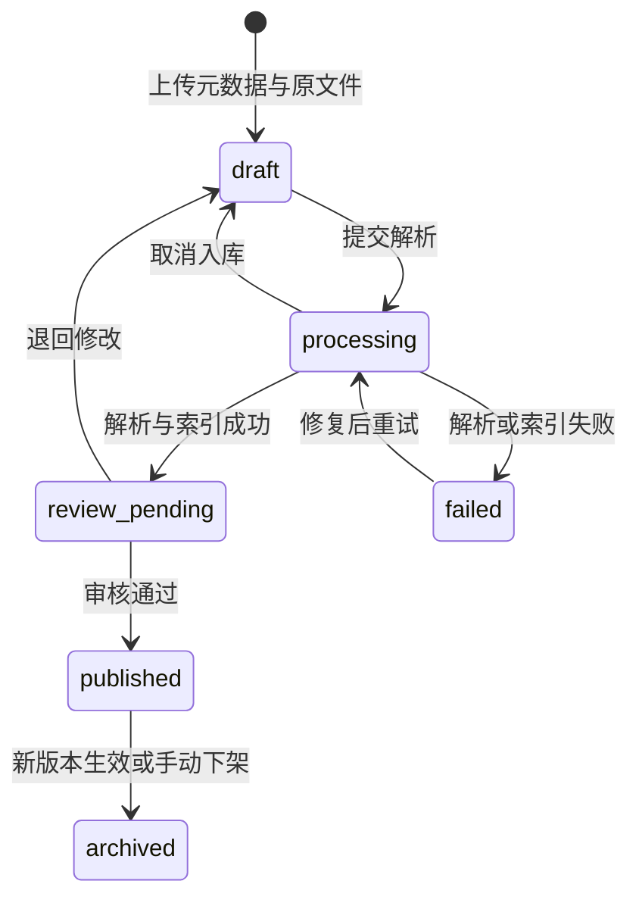

# 企业知识库 Agentic RAG 实战（四）：文件存储、审核与文档生命周期

> 上一章控制了用户能够访问哪些知识库，但上传后的内容仍然立刻可检索。本章把“文件已经上传”和“内容可以回答问题”拆成两个状态，并让版本切换成为可审计的业务操作。

## 先看一份销售政策怎样上线

销售人员上传《渠道折扣政策 V2》后，接口先返回草稿：

```json
{
  "document_id": "doc-sales-price-v2",
  "status": "draft",
  "version": 2,
  "object_key": "kb-sales/doc-sales-price-v2/original.md"
}
```

此时 Carol 在管理页面能看到文件，普通问答却不能用它。即使 Carol 自己提问“年合同额 100 万元可以打几折”，结果仍是拒答。

文档解析完成、审核通过后，Carol 执行发布：

```http
POST /api/documents/doc-sales-price-v2/publish
If-Match: 4
Authorization: Bearer <carol-token>
```

发布事务会把 V2 改成 `published`，把同一文档族的 V1 改成 `archived`，并递增记录版本。之后普通问答只使用 V2。历史版本还在，但只能通过版本管理入口读取。

## 为什么不能用一个 `is_active`

文档会经历上传、解析、审核、发布和下架。一个布尔值无法表达这些需求：

| 需求 | `is_active=true/false` 的问题 | 显式状态怎么表达 |
|---|---|---|
| 区分“尚未解析”与“审核未过” | 两者都是 false，运维不知该重试还是等审核 | `processing` vs `review_pending` / `failed` |
| 多版本共存 | 同一文档族只能有一个 true，无法保留可回滚的旧版原文 | `document_family_id` + 每版本独立行 |
| 草稿预解析 | 解析完就 true 会立刻进检索 | 解析成功只到 `review_pending`，发布才 `published` |
| 审核与回滚 | false 无法区分“下架”与“被新版本取代” | `archived` + 审计记录 |
| 失败可观测 | false 不告诉你错误码 | `failed` + 任务 `error_code` |

本项目使用显式状态，而不是布尔开关。通用入库里偶见的 `is_active` 字段（见 [RAG 入库管线](./rag-pipeline)）适合“chunk 是否参与检索”的细粒度标记；**文档级可见性**必须用状态机，否则审核、版本和失败会挤在同一个开关上。

多个布尔列更糟——每个组合都要手写解释：

| `is_parsed` | `is_approved` | `is_active` | 运维实际含义？ |
|---|---|---|---|
| false | false | false | 刚上传？解析挂了？被关掉？ |
| true | false | false | 等审核？退回？忘了开 active？ |
| true | true | false | 未上线？下架？发布写了一半？ |
| true | true | true | 正常 published——仍无法表达“被新版取代的旧版” |

三列布尔最多 8 种组合，却没有 `failed`、没有文档族、没有“同族只能一个生效”。类比：与其维护三个互相依赖的 UI 开关，不如一个 `status` 枚举。

职责分工：

| 层级 | 字段 | 管什么 |
|---|---|---|
| 文档行 | `status` 枚举 | 上传→解析→审核→发布→归档的业务可见性 |
| Chunk 行 | `is_active` 或等价标记 | 已发布版本内某块是否参与召回 |
| 检索指针 | `active_index_version` | 对外生效的索引世代，见[检索章](./agentic-rag-project-retrieval) |

## 状态机与非法转移



合法转移一览：

| 从 | 到 | 触发 | 谁可执行 |
|---|---|---|---|
| `draft` | `processing` | 提交入库任务 | 有写权限的编辑者 |
| `processing` | `review_pending` | Worker 成功 | 系统 |
| `processing` | `failed` | Worker 失败 | 系统 |
| `processing` | `draft` | 取消任务 | 有写权限者 |
| `failed` | `processing` | 人工重试 | 有写权限者 |
| `review_pending` | `published` | 审核发布（条件更新） | 审核角色 |
| `review_pending` | `draft` | 退回修改 | 审核角色 |
| `published` | `archived` | 同族新版本发布 / 手动下架 | 系统或管理员 |

API 必须拒绝非法转移。非法转移与 HTTP 语义建议对齐：

| 请求意图 | 当前状态 | HTTP | 原因 |
|---|---|---|---|
| `POST .../publish` | `draft` | `409` | 跳过解析与审核 |
| `POST .../submit` | `published` | `409` | 已上线版本不原地重解析；应上传新版本 |
| `POST .../publish` | `archived` | `409` | 回滚通过发布另一版本或专门回滚接口，不直接“复活”行 |
| `POST .../submit` | `review_pending` | `409` | 已在审核队列；应退回 `draft` 再改 |
| `POST .../publish` | `processing` | `409` | Worker 尚未结束，审核依据不完整 |

守卫写在领域层，按**当前 status** 拒绝，而不是先改再回滚：

```python
ALLOWED = {
    ("draft", "processing"),
    ("processing", "review_pending"),
    ("processing", "failed"),
    ("processing", "draft"),
    ("failed", "processing"),
    ("review_pending", "published"),
    ("review_pending", "draft"),
    ("published", "archived"),
}

def assert_transition(current: DocumentStatus, target: DocumentStatus) -> None:
    if (current.value, target.value) not in ALLOWED:
        raise Conflict(f"cannot transition {current} -> {target}")
```

前端类比：带 `version` 的 PATCH 之前再加状态白名单——状态不对直接 409。

`published` 是普通问答唯一允许的状态。不要让检索器猜测“看起来解析完成”的文档，也不要用对象是否存在推断业务状态。任务侧状态机对照见[第 6 章](./agentic-rag-project-async-ingestion)。

### 状态字段放哪里

一张状态枚举 + 可选失败码/审核意见即可：

```python
class DocumentStatus(str, Enum):
    draft = "draft"
    processing = "processing"
    review_pending = "review_pending"
    published = "published"
    failed = "failed"
    archived = "archived"
```

辅助字段（`error_code`、`review_comment`、`active_index_version`、`deleted_at`）解释停在某态的原因或哪个索引生效，但不替代状态。普通问答只认 `status = published`，再叠加索引版本与权限。

## PostgreSQL 管业务事实，MinIO 管原始文件

原文件和业务元数据有不同的访问方式：

| 数据 | 存储 | 原因 |
|---|---|---|
| 用户、知识库、文档、版本、状态 | PostgreSQL | 需要事务、约束、条件更新和审计查询 |
| Markdown、PDF、Word、PPT、Excel 原文件 | MinIO | 文件体积大，需要流式上传、对象版本和独立扩容 |
| Chunk 与向量 | PostgreSQL | 后续使用 pgvector，让权限条件和向量过滤处于同一查询 |

数据库保存 `object_key`，不保存开发机路径，也不把 MinIO URL 直接暴露给模型：

```python
class Document(Base):
    __tablename__ = "documents"

    id: Mapped[UUID] = mapped_column(primary_key=True)
    knowledge_base_id: Mapped[UUID] = mapped_column(ForeignKey("knowledge_bases.id"))
    document_family_id: Mapped[UUID] = mapped_column(index=True)
    title: Mapped[str]
    filename: Mapped[str]
    object_key: Mapped[str] = mapped_column(unique=True)
    status: Mapped[DocumentStatus]
    version: Mapped[int]
    lock_version: Mapped[int] = mapped_column(default=1)
    active_index_version: Mapped[str | None] = mapped_column(default=None)
```

`document_family_id` 表示“差旅制度”这份逻辑文档，数据库主键表示某个具体版本。这样 V1 和 V2 可以同时存在，引用也能准确落到产生答案的版本。`active_index_version` 是发布后检索指针；草稿即使有候选 Chunk，也不应设置它（或设置后检索仍要求 `status = published`）。

职责边界：

- **PostgreSQL**：谁能看、哪个版本生效、审核是否通过、审计谁点了发布。
- **MinIO / 对象存储**：字节在哪、能否流式读、对象键是否可覆盖。
- **检索层**：只读 `published` + 当前 `active_index_version` 的 Chunk，不读对象路径。

**对象在桶里 ≠ 业务可检索。** 控制台或本地对象根看到字节，都不构成“可以回答问题”的证据。`object_key` 只存在数据库供后端下载与审计；**不要把对象路径、预签名 URL 或本地绝对路径塞进 Prompt**。

## 上传采用“先对象、后元数据”的补偿边界

跨 PostgreSQL 和 MinIO 无法依靠一条本地事务完成原子提交。本章使用容易理解的补偿流程：

1. 服务端检查知识库 `editor/owner` 权限和文件限制。
2. 生成不可变 `document_id` 与 `object_key`。
3. 流式写入 MinIO 临时对象。
4. 在 PostgreSQL 创建 `draft` 文档记录。
5. 将临时对象移动为正式对象。
6. 如果第 4 步失败，删除临时对象；如果第 5 步失败，把文档标记为 `failed`，等待修复。

```python
temporary_key = f"tmp/{upload_id}"
await object_store.put_stream(temporary_key, file)

try:
    document = await documents.create_draft(...)
except Exception:
    await object_store.delete(temporary_key)
    raise

await object_store.promote(temporary_key, document.object_key)
```

失败矩阵：

| 失败点 | 对象存储 | PostgreSQL | 补偿 |
|---|---|---|---|
| 权限 / 校验失败 | 未写 | 无行 | 直接拒请求 |
| `put_stream` 失败 | 无或半截临时对象 | 无行 | 清理临时前缀（定时 GC） |
| `create_draft` 失败 | 临时对象已在 | 无行 | **立即删除临时对象**；接口对外失败 |
| `promote` 失败 | 临时在、正式键未就绪 | 已有 `draft` 行 | 标 `failed`（如 `object_promote_error`）或幂等重试 promote；勿假装成功 |
| 进程在 promote 后崩溃 | 正式对象已在 | `draft` 已在 | 无补偿必要：状态诚实，后续走 submit |
| 客户端超时但服务已成功 | 正式对象在 | `draft` 在 | 客户端按 `document_id` 查询；勿重复上传同内容当新版本除非业务需要 |

临时键 → 正式键的 promote 是改名/拷贝后删临时，不是覆盖正式键。正式 `object_key` 一旦写入文档行，后续版本也不复用。

最终一致性（Outbox、幂等任务、补偿扫描）见[第 14 章可靠性](./agentic-rag-project-reliability)。本章先把失败状态留下来，避免接口成功但数据库不知道文件去向。

本地可用文件系统对象根代替 MinIO；**补偿语义不变**：先有字节、再有元数据，元数据失败就删临时对象。没有 `draft` 行，就没有可审核、可提交的业务对象。

## 文件对象不可覆盖

不要把对象键设计成：

```text
kb-sales/channel-discount-policy.md
```

如果用户上传同名文件，旧内容会被覆盖，历史引用再也无法定位原文。本项目使用包含知识库、文档版本主键的不可变键：

```text
knowledge-bases/{kb_id}/documents/{document_id}/original/{safe_filename}
```

两种常见不可覆盖方案：

| 方案 | 键形态 | 优点 | 代价 |
|---|---|---|---|
| 版本化主键键（本项目） | `.../documents/{document_id}/original/...` | 与 DB 主键一一对应，易审计 | 同内容重复上传会存两份 |
| Content-addressed | `blobs/{sha256}` + DB 引用计数 | 去重、天然不可变 | 删除要引用计数；泄露哈希需防枚举 |

错误 vs 正确：

| | 键 | 上传同名 V2 时 |
|---|---|---|
| 错误 | `kb-sales/channel-discount-policy.md` | 覆盖 V1；历史引用原文消失 |
| 正确（本项目） | `.../documents/{doc_v2_id}/original/...` | 新对象；V1 键仍在；发布只改状态 |
| 正确（内容寻址） | `blobs/{sha256}` | 同内容复用 blob；DB 指向 blob |

新版本创建新对象和新库记录。**发布只切换业务状态，不覆盖旧对象字节**。下载经后端鉴权后签发短期 URL，Bucket 不公开。本地对象根同样禁止同路径 overwrite。

## 审核和发布必须是条件更新

Carol 打开审核页时文档的 `lock_version` 是 4。她审核期间，编辑者可能重新提交了内容。如果发布接口无条件更新，Carol 会把没看过的版本发布出去。

因此发布请求带 `If-Match: 4`，数据库执行条件更新：

```sql
UPDATE documents
SET status = 'published',
    lock_version = lock_version + 1,
    active_index_version = :candidate_index_version
WHERE id = :document_id
  AND status = 'review_pending'
  AND lock_version = :expected_version;
```

影响行数为 0 时返回 `409 Conflict`。乐观锁解决的是“审核依据已变”，不是行锁性能。

发布新版本在同一事务中完成：

```python
async with session.begin():
    await documents.archive_published_family_version(
        family_id=document.document_family_id,
        exclude_id=document.id,
    )
    updated = await documents.publish(
        document.id,
        expected_lock_version=expected_lock_version,
    )
    if updated == 0:
        raise Conflict("document changed during review")
    session.add(DocumentAudit(action="publish", actor_id=actor.id, ...))
```

事务提交后，同一个文档族最多只有一个普通检索版本。数据库还应增加部分唯一索引，防止应用 Bug 产生两个 `published` 版本：

```sql
CREATE UNIQUE INDEX ux_documents_one_published_per_family
ON documents (document_family_id)
WHERE status = 'published';
```

`archive` 与 `publish` 必须在**同一事务**：先把同族旧 `published` 改成 `archived`，再条件更新当前行。若只做后半段，部分唯一索引会挡住第二份 `published`——这是保险，不是正常流程。

并发审核（两人持同一 `If-Match`）：

```mermaid
sequenceDiagram
    participant A as Reviewer A
    participant B as Reviewer B
    participant API as API
    participant DB as PostgreSQL
    A->>API: POST /publish If-Match: 4
    B->>API: POST /publish If-Match: 4
    API->>DB: BEGIN; archive; UPDATE ... lock_version=4
    DB-->>API: updated=1
    API->>DB: COMMIT
    API-->>A: 200 (lock_version=5)
    API->>DB: BEGIN; UPDATE ... lock_version=4
    DB-->>API: updated=0
    API->>DB: ROLLBACK
    API-->>B: 409 Conflict
```

影响行数 0 → `409`。乐观锁 ≈ 带 `version` 的 PATCH；解决的是“审核依据已变”，不是行锁性能。

## 外键怎样处理删除：软删与索引 GC

这个项目不会放弃关系约束，也不会给所有关系设级联删除。若 `documents.knowledge_base_id` 配 `ON DELETE CASCADE`，误删知识库会连带抹掉文档、Chunk、引用和审核记录。

| 关系 | 策略 | 理由 |
|---|---|---|
| 知识库 → 文档 | `RESTRICT` | 有文档时拒绝硬删知识库 |
| 文档 → Chunk | 后台 GC 显式删除 | 先撤出索引并记审计 |
| 文档 → 审核记录 | `RESTRICT` 或长期保留 | 审计不能随业务对象消失 |
| 临时上传 → 临时分片 | `CASCADE` | 纯技术临时数据可整体清理 |

正常下架用 `archived` / `deleted_at`，不是物理删除。时间线：

```text
t0  文档 → archived（或软删）        检索立即不可见
t1  保留期（审计 / 紧急回滚窗口）
t2  GC：确认无运行中引用、缓存、评测快照
t3  按 document_id（及过期 index_version）删 Chunk / 向量
t4  删对象存储原文件；失败可重试
t5  审计记录保留；知识库行仍在（除非已空且管理员硬删）
```

知识库→文档用 `RESTRICT` 而非 `ON DELETE CASCADE`：级联会把“删库”变成静默抹掉文档、Chunk、引用和审核证据。`RESTRICT` 强迫先归档/迁移文档再删空库。GC 是显式后台任务，不是外键副作用。回滚窗口与 GC 约束见[第 14 章可靠性](./agentic-rag-project-reliability)。

## 检索只读取已发布的索引版本

文档状态过滤继续位于检索层，与权限条件同一查询：

```sql
SELECT c.*
FROM chunks c
JOIN documents d ON d.id = c.document_id
JOIN knowledge_bases kb ON kb.id = d.knowledge_base_id
WHERE d.status = 'published'
  AND d.active_index_version = c.index_version
  AND /* 当前用户的知识库权限条件 */
ORDER BY c.embedding <=> :query_embedding
LIMIT :top_k;
```

草稿可提前解析并建候选索引，但审核通过前没有生效的 `active_index_version`（或检索强制要求 `published`），不会进入普通问答：

```sql
-- 普通问答硬条件（权限条件另加）
d.status = 'published'
AND d.active_index_version = c.index_version
-- 禁止：仅凭 c.is_active / 对象是否存在 / 解析是否成功 放行
```

发布时切换指针比逐行改 Chunk 状态更快，也为第 14 章原子索引切换留接口。本地可能用内存向量缓存代替持久化 `index_version`；**不变式仍成立**：未发布文档不得出现在普通问答来源。双版本热切换是生产能力，见[可靠性](./agentic-rag-project-reliability)。混合召回与权限预过滤见[第 7 章](./agentic-rag-project-retrieval)。

## 运行一次完整的状态变化

启动 PostgreSQL（或本地 SQLite）和对象存储后，用同一条文档跑完生命周期。下面以销售政策 V2 为例（Token 与 ID 换成你环境里的值）：

```bash
# 1. 上传 → draft
curl -s -X POST http://127.0.0.1:8000/api/knowledge-bases/$KB_ID/documents \
  -H "Authorization: Bearer $EDITOR_TOKEN" \
  -F "file=@fixtures/documents/channel-discount-v2.md"
# 期望：status=draft，记下 document_id 与 lock_version

# 2. 提交处理 → processing + 任务 queued
curl -s -X POST http://127.0.0.1:8000/api/documents/$DOC_ID/submit \
  -H "Authorization: Bearer $EDITOR_TOKEN"
# 期望：202，返回 task_id；文档 status=processing

# 3. Worker 执行（另开终端）
uv run python -m app.worker $TASK_ID
# 成功：文档 → review_pending；失败：→ failed + error_code（如 parse_error）

# 4. 确认仍不可检索（任意用户）
curl -s -X POST http://127.0.0.1:8000/api/chat \
  -H "Authorization: Bearer $ALICE_TOKEN" \
  -H 'Content-Type: application/json' \
  -d '{"question":"年合同额 100 万元可以打几折？"}'
# 期望：不出现 V2 来源

# 5. 审核发布（带乐观锁）
curl -s -X POST http://127.0.0.1:8000/api/documents/$DOC_ID/publish \
  -H "Authorization: Bearer $CAROL_TOKEN" \
  -H "If-Match: $LOCK_VERSION"
# 期望：status=published；同族旧版 → archived

# 6. 再次问答 → 仅 V2
# 期望：答案可引用 V2；V1 不再作为普通来源

# 7. 并发边界：两个审核者同 If-Match 同时发布
# 期望：一个 200，一个 409 Conflict
```

失败路径也要跑一遍：

```bash
# F1. 损坏文件 → failed + parse_error；旧 published 仍可问答
# submit + worker 后：status=failed，error_code=parse_error；V1 仍可命中

# F2. 错误 If-Match → 409；文档仍 review_pending
curl -s -o /tmp/pub.json -w "%{http_code}" \
  -X POST http://127.0.0.1:8000/api/documents/$DOC_ID/publish \
  -H "Authorization: Bearer $CAROL_TOKEN" \
  -H "If-Match: 999"

# F3. review_pending 期间问答仍无 V2（步骤 4 已覆盖）
```

状态轨迹：

```text
上传 V2 → draft → submit → processing → review_pending → publish → published
旧版 → archived
损坏文件 → processing → failed(parse_error)
错误 If-Match → 仍 review_pending + 409
```

用 `GET /api/documents/{id}` 核对状态、失败码、锁版本。三个边界：`review_pending` 时任何用户召不回草稿；同 `If-Match` 并发发布一个 200 一个 409；Worker 失败时旧 `published` 继续服务。

### 验收清单

| # | 检查 | 通过标准 |
|---|---|---|
| 1 | 上传后问答 | 任何角色都召不回该草稿 |
| 2 | Worker 成功 | 文档 `review_pending`，仍不可检索 |
| 3 | 损坏文件 | 文档 `failed`，任务 `parse_error`，旧 published 仍可检索 |
| 4 | 发布乐观锁 | 错误 `If-Match` → `409`；正确则同族仅一个 `published` |
| 5 | 对象键 | 新版本新 key；旧对象仍可按历史引用下载（鉴权后） |
| 6 | 下架 / 归档 | 立即离开普通检索；Chunk GC 延后且可审计 |
| 7 | 非法转移 | `draft→publish` / `published→submit` 等返回 `409` |
| 8 | 上传补偿 | `create_draft` 失败后临时对象被删；无孤儿正式键 |
| 9 | 检索不变式 | SQL/查询层同时要求 `published` + `active_index_version` |

本地若用 SQLite + 本地目录对象存储，上述业务不变式仍应成立；不要因为存储实现简化就跳过状态与锁检查。

## 本章小结

原文件在不可公开的对象存储中，PostgreSQL 记录文档族、版本、状态和审计。上传 ≠ 发布：多布尔列会互相打架，文档级用显式状态机，Chunk 级 `is_active`（见 [RAG 入库管线](./rag-pipeline)）只管块是否参与召回。合法转移有白名单，非法转移统一 `409`。对象键不可覆盖，发布只切状态；“先对象后元数据”用临时键 promote 与失败矩阵处理跨存储边界，Outbox 留给[可靠性](./agentic-rag-project-reliability)。审核靠 `If-Match` / `lock_version`，同族 archive+publish 同一事务，部分唯一索引兜底。删除走软删与后台 GC，知识库→文档用 `RESTRICT`。普通检索只读 `published` + `active_index_version`（见[检索](./agentic-rag-project-retrieval)）。

继续阅读[第 5 章：多格式解析与结构化切分](./agentic-rag-project-parsing)，把 PDF、Word、PPT、Excel 转成统一结构块，并比较固定长度与结构化切分的检索差异。
