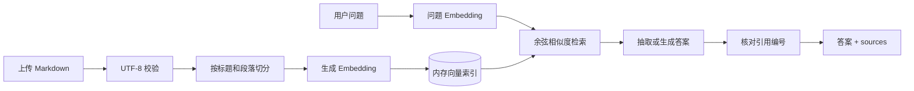

# 企业知识库 Agentic RAG 实战（二）：跑通最小 RAG 闭环

> 上一章确定了最终产品和系统边界。这一章开始写代码，只做一条最短但完整的链路：上传 Markdown 制度，切成带标题的片段，建立向量索引，然后根据问题返回答案和原文来源。

## 先看运行结果

启动服务并上传《员工差旅管理制度 V2》后，向接口提问：

```json
{
  "question": "上海住宿每晚最多多少钱？"
}
```

本地演示模式返回：

```json
{
  "answer": "根据当前知识库找到的原文：\n- 一线城市 | 北京、上海、广州、深圳 | 650 元 [S1]",
  "refused": false,
  "provider": "demo",
  "sources": [
    {
      "filename": "travel-policy-v2.md",
      "heading": "住宿标准",
      "content": "住宿标准\n| 城市类别 | 示例 | 每人每晚上限 |\n...",
      "score": 0.154258
    }
  ]
}
```

这个答案还没有经过真正的大语言模型润色，但它已经证明了 RAG 最关键的数据闭环：问题命中了正确片段，回答中的 `[S1]` 可以回到服务端实际返回的来源，而不是模型自己编出的文件名。

如果还没上传文档，接口不会让模型凭常识回答：

```json
{
  "answer": "当前知识库还没有可检索内容，请先上传文档。",
  "refused": true,
  "provider": "demo",
  "sources": []
}
```

## 为什么第二章先做一个内存版本

最终架构需要 PostgreSQL、pgvector、MinIO 和后台 Worker，但如果现在同时引入数据库迁移、对象存储、队列和模型供应商，链路出错时很难判断问题在哪一层。

这一章先保留完整职责，暂时简化实现：

| 职责 | 本章实现 | 后续替换 |
|---|---|---|
| 原始文件 | 读取上传内容，不持久化 | 第 4 章存入 MinIO |
| 文档与 Chunk | Python 内存对象 | 第 3、4 章进入 PostgreSQL |
| Embedding | 可重复的本地哈希向量 | 接入真实 Embedding 模型 |
| 向量检索 | 内存余弦相似度 | 第 7 章使用 pgvector 和混合检索 |
| 回答生成 | 从证据中抽取相关行 | 可切换 OpenAI-compatible LLM |
| 后台任务 | 请求内同步执行 | 第 6 章交给 Worker |

被简化的是基础设施，不是数据流。上传、切分、向量化、检索、回答和引用仍然经过独立模块，后续可以逐层替换而不用重写接口。



这条链路对应[RAG 入库链路](./rag-pipeline)讲过的最小职责划分。这里关注的是这些职责怎样在一个 FastAPI 项目里衔接。

## 项目结构

第 2 章完成后的核心目录如下：

```text
projects/agentic-rag/
├── app/
│   ├── main.py          # FastAPI 路由和 HTTP 边界
│   ├── config.py        # 环境配置
│   ├── schemas.py       # 请求与响应模型
│   ├── chunking.py      # Markdown 切分
│   ├── embeddings.py    # 本地与远程 Embedding
│   ├── store.py         # 本章的内存向量索引
│   ├── answering.py     # 本地与远程回答生成
│   └── rag.py           # 整条 RAG 链路的编排
├── fixtures/            # 贯穿系列的企业样例文档
├── tests/
├── .env.example
├── pyproject.toml
└── uv.lock
```

路由没有直接计算向量，向量库也不负责拼回答。这样的分层不是为了让文件数量变多，而是让后续替换有明确边界：换 pgvector 只改存储实现，换模型供应商只改 Embedding 和 Answerer，HTTP 契约保持稳定。

## 建立 Python 环境

项目使用 Python 3.12 和 `uv`。进入配套项目后同步锁定依赖：

```bash
cd projects/agentic-rag
uv sync
```

核心依赖只有四类：

```toml
dependencies = [
    "fastapi>=0.141.1",
    "httpx>=0.28.1",
    "python-multipart>=0.0.32",
    "uvicorn[standard]>=0.52.4",
]
```

`python-multipart` 用来解析文件上传的 `multipart/form-data`。FastAPI 的 [`UploadFile`](https://fastapi.tiangolo.com/tutorial/request-files/) 会使用可滚动到磁盘的临时文件，比直接声明 `bytes` 更适合以后接收大文件；这一章仍主动限制上传大小，避免一次性 `read()` 吃掉过多内存。

## 先定义不会频繁变化的接口

系统现在只有三个接口：

| 方法与路径 | 用途 | 成功结果 |
|---|---|---|
| `GET /health` | 检查服务和当前索引状态 | 模式与 Chunk 数量 |
| `POST /api/documents` | 上传 `.md` 或 `.txt` | 文档 ID 与 Chunk 数量 |
| `POST /api/chat` | 根据知识库回答问题 | 答案、拒答状态和来源 |

问答响应没有只返回一个字符串，而是把答案和来源分开：

```python
class SourceResponse(BaseModel):
    id: str
    document_id: str
    filename: str
    heading: str | None
    content: str
    score: float


class ChatResponse(BaseModel):
    answer: str
    refused: bool
    provider: str
    sources: list[SourceResponse]
```

这里的 `sources` 是服务端根据实际命中的 Chunk 组装的。以后即使 LLM 在答案中输出一个不存在的 `[S9]`，服务端也不能顺手伪造第九条来源。第 8 章会把这条约束升级成完整的引用校验。

问题字段还需要拒绝只有空格的字符串：

```python
class ChatRequest(BaseModel):
    question: str = Field(min_length=1, max_length=2000)
    top_k: int | None = Field(default=None, ge=1, le=10)

    @field_validator("question")
    @classmethod
    def question_must_have_content(cls, value: str) -> str:
        stripped = value.strip()
        if not stripped:
            raise ValueError("question must not be blank")
        return stripped
```

`min_length=1` 只能挡住空字符串，挡不住三个空格，所以这里必须先 `strip()`。

## 上传时把 HTTP 边界守住

本章只支持 Markdown 和纯文本。PDF、Word、PPT 和 Excel 的结构解析留到第 5 章：

```python
@app.post("/api/documents", status_code=201)
async def upload_document(request: Request, file: UploadFile):
    rag = get_rag(request)
    filename = file.filename or "unnamed"

    if Path(filename).suffix.lower() not in {".md", ".txt"}:
        raise HTTPException(status_code=415, detail="当前只支持 .md 和 .txt")

    raw = await file.read(rag.settings.max_upload_bytes + 1)
    if len(raw) > rag.settings.max_upload_bytes:
        raise HTTPException(status_code=413, detail="文件超过上传大小限制")

    try:
        text = raw.decode("utf-8")
    except UnicodeDecodeError as exc:
        raise HTTPException(status_code=422, detail="文件必须使用 UTF-8 编码") from exc

    return await rag.upload(filename=filename, text=text)
```

代码读取“限制值加一个字节”。如果恰好读到多出的那个字节，就能确定文件超限，不需要把整个大文件读完。后续接入 MinIO 时，上传会改成分块流式写入，这里的大小、格式和编码检查仍然属于 HTTP 边界。

## 切分时保留标题上下文

如果把 Markdown 每 600 字硬切一次，“650 元”所在的 Chunk 可能丢掉“住宿标准”这个标题。我们的最小切分器先识别标题，再按空行分段，并把当前标题写回 Chunk：

```python
def split_markdown(text: str, max_chars: int = 600) -> list[ChunkDraft]:
    current_heading: str | None = None
    buffer: list[str] = []
    chunks: list[ChunkDraft] = []

    for line in normalize_lines(text):
        if heading := match_heading(line):
            flush(buffer, current_heading, chunks, max_chars)
            current_heading = heading
        elif line.strip():
            buffer.append(line)
        elif buffer:
            flush(buffer, current_heading, chunks, max_chars)

    flush(buffer, current_heading, chunks, max_chars)
    return chunks
```

实际实现还会把超过上限的段落继续切开，并保留最多 80 个字符的重叠。上传差旅制度后生成 7 个 Chunk，其中住宿表格所在片段仍带有 `住宿标准` 标题。

这只是最小策略。它还不会识别 PDF 页码、合并跨页段落，也没有父子 Chunk；第 5 章会用同一份制度文档比较这些策略，不会在这里提前堆解析器。

## 用可重复的离线向量验证链路

读者不应该因为没有 API Key 就无法完成第二章，所以默认 `APP_PROVIDER=demo`。本地 Embedding 的思路是：

1. 将英文、数字和中文字符及双字组合切成 token。
2. 用稳定哈希把 token 映射到 384 维向量。
3. 对向量做归一化。
4. 问题和文档使用同一算法，点积就是余弦相似度。

```python
for token in tokenize(text):
    digest = hashlib.blake2b(token.encode("utf-8"), digest_size=8).digest()
    index = int.from_bytes(digest[:4], "big") % dimensions
    sign = 1.0 if digest[4] & 1 else -1.0
    vector[index] += sign

norm = math.sqrt(sum(value * value for value in vector)) or 1.0
return [value / norm for value in vector]
```

这不是生产级语义模型。它能识别相同词和部分字符重合，足够验证“切分 → 写入 → 查询 → 排序”的代码路径，但无法理解丰富的同义表达。把这个限制写清楚很重要，否则本地 Demo 检索不准时，读者会错误地去调整 Prompt。

真实模型实现同一个接口：

```python
class Embedder(Protocol):
    name: str

    async def embed(self, texts: list[str]) -> list[list[float]]: ...
```

因此切换 OpenAI-compatible `/embeddings` 接口时，RAG 编排和存储层不用改。

## 检索层只返回命中，不生成答案

文档上传时，存储层为每个 Chunk 分配稳定的来源身份：

```text
document_id:chunk-1
document_id:chunk-2
...
```

提问时先生成问题向量，再对所有 Chunk 计算点积并取 Top K：

```python
hits = [
    SearchHit(
        chunk=chunk,
        score=sum(
            left * right
            for left, right in zip(query_vector, chunk.embedding, strict=True)
        ),
    )
    for chunk in chunks
]
hits.sort(key=lambda hit: hit.score, reverse=True)
return hits[:top_k]
```

内存全量扫描的复杂度是 `O(N × D)`，只适合当前的少量 Chunk。它的价值是让检索契约先稳定下来：输入问题和 Top K，输出带分数的 `SearchHit`。第 7 章接入 pgvector 后，上层依旧调用同一个语义接口。

## 答案中的引用必须来自命中结果

本地模式不会假装自己是大模型，它只从命中 Chunk 中选择得分最高的一条事实，并标上 `[S1]`：

```python
answer = "根据当前知识库找到的原文：\n" + "\n".join(
    f"- {line} [{source_id}]" for line, source_id in selected
)
```

这里只取一条，是有意限制演示模式的能力。需要综合多条证据时应切换真实 LLM；后续 Agentic RAG 还会负责拆分问题和多轮检索，不能让一个基于词面重合的抽取器假装已经完成这些工作。

服务端随后解析实际被引用的编号，只返回对应来源：

```python
cited_ids = set(result.cited_chunk_ids)
sources = [
    to_source_response(hit)
    for hit in hits
    if hit.chunk.id in cited_ids
]
```

如果回答没有任何合法引用，响应中的 `refused` 会变成 `true`。这还不是完整的事实一致性校验，但已经建立了一条重要边界：回答文本不能决定数据库里存不存在某个来源。

## 运行完整链路

启动服务：

```bash
uv run uvicorn app.main:app --reload
```

打开 `http://127.0.0.1:8000/docs` 可以直接使用 Swagger。也可以用命令行完成整条链路。

检查状态：

```bash
curl http://127.0.0.1:8000/health
```

```json
{"status":"ok","provider":"demo","indexed_chunks":0}
```

上传样例文档：

```bash
curl -X POST http://127.0.0.1:8000/api/documents \
  -F file=@fixtures/documents/travel-policy-v2.md
```

返回的 `document_id` 每次运行会变化，实测这份文档切出了 7 个 Chunk：

```json
{
  "document_id": "<本次生成的 UUID>",
  "filename": "travel-policy-v2.md",
  "chunk_count": 7
}
```

提问：

```bash
curl -X POST http://127.0.0.1:8000/api/chat \
  -H 'content-type: application/json' \
  -d '{"question":"上海住宿每晚最多多少钱？"}'
```

响应中应同时出现 `650 元`、`住宿标准` 和 `travel-policy-v2.md`。不要只检查答案文字，`sources` 才是系统能够溯源的证据。

## 切换真实模型

默认模式不访问外部服务：

```env
APP_PROVIDER=demo
```

要使用支持 OpenAI API 格式的模型服务，复制配置文件并填写：

```bash
cp .env.example .env
```

```env
APP_PROVIDER=openai_compatible
OPENAI_BASE_URL=https://你的模型服务/v1
OPENAI_API_KEY=你的密钥
EMBEDDING_MODEL=你的向量模型
CHAT_MODEL=你的对话模型
```

应用会调用 `/embeddings` 和 `/chat/completions`。缺少密钥或模型名时，启动阶段直接报错，而不是等第一次请求才失败。

启动时显式加载这份配置：

```bash
uv run uvicorn app.main:app --reload --env-file .env
```

注意：不同供应商即使声称兼容 OpenAI，也可能在鉴权头、Embedding 响应或模型参数上存在差异。当前实现覆盖标准格式；接入具体供应商时，应根据其官方文档调整适配器，不能把供应商差异泄漏到 RAG 编排层。

## 验证正常路径和失败路径

运行测试：

```bash
uv run pytest
```

当前测试覆盖：

- 服务启动时索引为空。
- 未上传文档时明确拒答。
- 上传差旅制度后，答案包含 `650` 和真实来源。
- 空白问题被 Pydantic 拒绝。
- PDF 在当前章节返回 `415`，没有假装解析成功。
- 空文档返回 `422`。
- Markdown 切分保留标题，并能处理超长段落。
- 真实模型模式缺少密钥时启动失败。

静态检查：

```bash
uv run ruff check .
uv run ruff format --check .
```

FastAPI 官方也推荐使用 `TestClient` 对接口发请求，测试写法与普通 `httpx` 调用接近，参见[官方测试文档](https://fastapi.tiangolo.com/tutorial/testing/)。

## 当前版本刻意留下的问题

这条链路可以运行，但还不能叫企业知识库：

1. **重启即丢数据**：文档和向量都在进程内存中。
2. **没有用户身份**：所有人看到同一份索引。
3. **上传请求耗时**：切分和 Embedding 仍在 HTTP 请求内执行。
4. **检索能力弱**：本地哈希模型不理解同义词，只有向量一路召回。
5. **拒答能力有限**：有文档时，本地抽取器可能选中弱相关内容。
6. **还不是 Agent**：流程完全固定，没有查询改写、工具调用和多轮检索。

这些缺口决定了后续章节的顺序。下一章先加入用户、团队、知识库和资源级权限，让同一个问题在 Alice 与 Bob 身上得到不同的可见结果；随后再解决持久化、异步入库和检索质量。

## 本章小结

我们已经有了第一条真实可运行的 RAG 链路：FastAPI 接收文档，切分器保留标题，本地或远程 Embedding 生成向量，检索层返回 Top K，回答层只引用实际命中的来源。

这一版故意使用内存和离线模型，使数据流可以在没有外部账号的环境中被完整验证。它的限制也很清楚：没有持久化、权限、异步任务和 Agent 决策。下一章将在这套代码上加入企业知识库最先绕不开的用户与数据权限。
