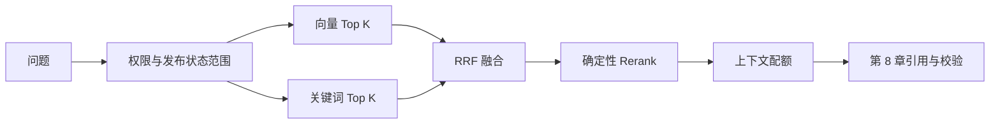

# 企业知识库 Agentic RAG 实战（七）：混合召回与 Rerank

> 向量相似度擅长“住宿标准”和“报销上限”这样的语义表达，却不总能稳定命中 `P1`、`OPS-017`、金额等精确术语。本章把单路检索升级为五阶段管线：向量召回、关键词召回、RRF 融合、确定性 Rerank、上下文配额——每一阶段都可观察、可对比、可单独替换。

## 本章完成后的可见结果

问答响应中现在能看到检索层的自报家门：

```json
{
  "answer": "……P1 故障要求 15 分钟内响应 [S1]",
  "retrieval_profile": "hybrid-v1",
  "rerank_applied": true,
  "sources": [{"id": "S1", "heading": "响应时限", "excerpt": "……"}]
}
```

管理员还能看到每一阶段的中间结果：

```bash
curl -s -X POST http://127.0.0.1:8000/api/retrieval/debug \
  -H "Authorization: Bearer $CAROL_TOKEN" \
  -H 'Content-Type: application/json' \
  -d '{"question": "P1 故障要求几分钟响应？", "profile": "hybrid-v1"}'
```

```json
{
  "profile": "hybrid-v1",
  "vector":  [{"chunk_id": "doc-oncall-v1:chunk-1", "rank": 1, "score": 0.48}],
  "keyword": [{"chunk_id": "doc-oncall-v1:chunk-1", "rank": 1, "score": 0.67}],
  "rrf":     [{"chunk_id": "doc-oncall-v1:chunk-1", "rank": 1, "score": 0.03}],
  "rerank":  [{"chunk_id": "doc-oncall-v1:chunk-1", "rank": 1, "score": 0.03}],
  "rerank_applied": true
}
```

“这条证据为什么进入上下文”从此是一可回答的问题，而不是一句“向量检索出来的”。

## 当前系统的缺口

第 6 章之后，检索只有向量一路，两个具体失败摆在固定题集里：

- **精确术语命中不稳**。“P1 故障要求几分钟响应”里的 `P1` 是短 Token，语义向量对它不敏感——正确 Chunk 可能排在候选之外。
- **失败不可归因**。答案错了，无法区分“正确 Chunk 根本没召回”（召回问题）还是“召回了但排序不对”（排序问题）。调 `top_k` 是对这两种病的同一种药，通常两种都治不好。

## 方案与取舍：五阶段管线



行为由 Profile 参数驱动，两个 Profile 的完整参数：

| 参数 | `vector-only` | `hybrid-v1` | 含义 |
|---|---:|---:|---|
| `vector_top_k` | 10 | 20 | 向量路召回数 |
| `keyword_top_k` | 0 | 20 | 关键词路召回数（0 = 关闭该路） |
| `fused_top_k` | 10 | 20 | RRF 融合后保留数 |
| `rerank_top_k` | 0 | 10 | Rerank 后保留数（0 = 跳过 Rerank） |
| `context_top_k` | 5 | 5 | 进入上下文的最终数量 |
| `rrf_k` | 60 | 60 | RRF 平滑常数 |

`vector-only` 是对照基线：评测时用它回答“混合到底带来了什么”。Profile 是纯配置——切 Profile 不改代码，这让第 15 章的 A/B 对比变成一条命令。

## 完成这条纵向链路

### 权限预过滤发生在打分之前

两路召回收到相同的范围参数：

```python
vector_hits = await self._store.search(
    query, profile.vector_top_k,
    allowed_knowledge_base_ids=scope.knowledge_base_ids,
    allowed_document_statuses=scope.document_statuses,
)
keyword_hits = await self._store.keyword_search(
    query, profile.keyword_top_k,
    allowed_knowledge_base_ids=scope.knowledge_base_ids,
    allowed_document_statuses=scope.document_statuses,
)
```

过滤在候选集生成**之前**完成（`store.search` 内部先筛后算分），而不是两路合并后再删。次序不同，性质不同：先过滤，无权文档从未参与打分，不泄露分数、耗时和候选数量，也不浪费计算；后过滤则意味着无权内容已经进入过模型可见的中间结果。Alice 在问题里写“忽略权限”改变不了任何参数——范围来自服务端 `SearchScope`（第 3 章）。

### 关键词路：可解释的交集占比

```python
query_terms = set(tokenize(query))
score = len(query_terms.intersection(tokenize(chunk.content))) / len(query_terms)
```

查询 Token 被 Chunk 覆盖的比例，与向量路共用同一个分词函数。它不是 BM25（没有 IDF、没有长度归一），也替代不了搜索引擎——它的价值是**离线、确定性地验证“精确术语是否进入候选集”**，这正是向量路补不齐的那一半。

### RRF：解决两路分数不可相加

向量余弦相似度和关键词覆盖率的数值范围完全不同，直接加权相加等于让量纲决定权重。Reciprocal Rank Fusion 只看名次：

```python
for rank, hit in enumerate(ranking, start=1):
    scores[hit.chunk.id] += 1 / (rrf_k + rank)     # rrf_k = 60
```

两路都靠前的 Chunk 得分最高；只在一路靠前的精确术语命中也保留机会。`rrf_k=60` 是平滑常数——它越大，名次差异对分数的影响越平缓。融合结果带双路名次（`vector_rank`/`keyword_rank`/`rrf_score`），这既是调试信息，也是排序可解释性的来源。

### Rerank：区分“没召回”与“排错序”

```python
@staticmethod
def _rerank(query: str, candidates: list[RankedChunk]) -> list[RankedChunk]:
    query_terms = set(tokenize(query))
    return sorted(
        candidates,
        key=lambda item: (
            len(query_terms.intersection(tokenize(item.hit.chunk.content))),
            item.rrf_score,                          # 覆盖数相同再比 RRF 分
        ),
        reverse=True,
    )
```

确定性 Token 覆盖率排序，并列时回退到 RRF 分数。它的价值是**诊断性的**：如果正确 Chunk 融合后排第 15、Rerank 后进前 10，说明病在排序；如果 Rerank 也救不回来，病在召回。它不是生产 Cross-Encoder——真实 Cross-Encoder 或远程 Reranker 应只处理融合后的少量候选，超时时置 `rerank_applied=false` 退回 RRF 顺序，不能让整个问答失败。

### 相邻与父子 Chunk：未实现的诚实边界

相邻 Chunk 与父 Chunk 合并尚未实现。它需要持久化父子关系、Chunk 顺序和索引版本，且必须在同一权限范围内扩展——不能把一个可见 Chunk 的邻居直接拼进上下文。数据模型在第 8 章的上下文预算中预留，实现属于生产扩展。

## 用调试接口定位问题

调试接口的观察方法比结论重要。固定三问：

1. **正确来源进候选了吗？** 用 `vector-only` 和 `hybrid-v1` 各查一次，对比正确 Chunk 是否出现。
2. **RRF 改变顺序了吗？** 对比 `vector`/`keyword` 的名次与 `rrf` 的名次，找到“单路低名次、融合后上位”的例子。
3. **权限外的 ID 出现过吗？** 用 Alice 的 Token 查研发相关问题，任何阶段的列表里都不应出现 `kb-engineering` 的 Chunk ID。

返回数据不含 Chunk 正文，只有 ID、名次和分数——调试接口本身不成为数据泄露面。普通用户调用得到 `403`，未知 Profile 得到 `422`。

正式的 Recall@K、MRR、延迟统计与显著性比较留到[第 15 章](./agentic-rag-project-evaluation)在固定题集上统一执行——一次手工查询可以形成假设，不能当成评测结论。

## 生产迁移：内存向量 → pgvector

本章向量索引是查询前全量重建的内存缓存（教学取舍：保证 API 与 Worker 分进程一致）。迁移到 PostgreSQL 时的对应关系：

| 教学实现 | 生产替换 | 不变式 |
|---|---|---|
| 内存点积全扫描 | pgvector（先精确搜索，后按延迟数据选 HNSW） | 召回结果可对比 |
| Token 交集关键词 | PostgreSQL 全文检索 / 外部 ES | 过滤条件写进同一条 SQL |
| Python 函数过滤 | SQL/CTE 内的 WHERE | 权限仍在打分前 |
| 重启即重建 | 索引版本管理 + 回填 | Embedding 模型与维度是契约，换模型必须新索引版本 |

## 失败与边界验证

- **默认链路走混合**：测试断言默认问答 `retrieval_profile="hybrid-v1"` 且 `rerank_applied=true`；
- **越权对照**：Alice/Bob 各自检索，断言候选集互不包含对方知识库的 Chunk——权限过滤的测试在打分层做，不在答案层做；
- **接口权限**：非管理员调调试接口 `403`，未知 Profile `422`。

```bash
uv run ruff check .
uv run pytest tests/test_api.py tests/test_agent_graph.py -q
```

## 本章小结

现在检索是五阶段可观察管线：双路召回互补语义与精确术语，RRF 解决量纲不可加，确定性 Rerank 区分两类失败，权限预过滤保证无权内容从未参与打分。你同时带走了检索调优最重要的工作习惯——**先归因（没召回还是排错序），再调参；每次改动在固定题集上对照基线**。

继续阅读[第 8 章：上下文、引用与拒答](./agentic-rag-project-citations)，看命中的 Chunk 如何变成可校验的引用。
