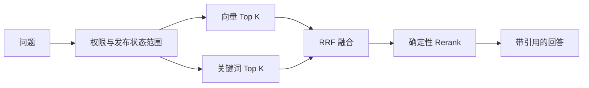

# 企业知识库 Agentic RAG 实战（七）：混合召回与 Rerank

> 向量相似度擅长“住宿标准”和“报销上限”这样的语义表达，却不总能稳定命中 `P1`、`OPS-017`、金额等精确术语。本章先实现一条可验证的混合检索基线，再说明它怎样迁移到 pgvector。

## 本章交付与边界

配套项目新增 `app/retrieval.py`，提供两个可选 Profile：

| Profile | 向量 | 关键词 | RRF | Rerank | 用途 |
|---|---:|---:|---:|---:|---|
| `vector-only` | 10 | 0 | 否 | 否 | 对照基线 |
| `hybrid-v1` | 20 | 20 | 是 | 是 | 默认问答链路 |

每一路检索都先使用调用者的知识库与已发布文档范围；RRF 合并名次；随后用基于查询 Token 覆盖率的确定性 Rerank 重新排序。管理员可调用 `POST /api/retrieval/debug` 查看各阶段的 Chunk ID、名次和分数，普通用户不能访问该接口。

本章的向量索引仍是上一章的教学用内存缓存，持久化的只是原始 Chunk。它会在每次查询前重建，因此能保证 API 和 Worker 分进程一致，却不适合生产数据量或真实 Embedding 服务。PostgreSQL + pgvector、持久化向量、异步 Reranker 和相邻 Chunk 扩展是下一阶段的生产迁移方向，不是本章已经交付的能力。

## 为什么混合而不是只调 Top K

固定题集中有三类问题：

```text
去上海出差，住宿费每晚最多报销多少？
P1 故障要求几分钟响应？
北京和成都的住宿标准相差多少？
```

第一类通常依赖语义相近；第二类包含精确代码；第三类要求多个条件同时进入上下文。增大单一路的 `top_k` 会带来更多噪声，不能解释是哪一种能力补回了正确证据。混合检索让每一阶段都有可观察的职责。



权限过滤不能放到两个召回结果合并之后。先召回全库、再过滤会泄露无权文档的分数、耗时和候选数量，并浪费计算。

## 关键词与向量共用范围

当前关键词召回使用同一个分词函数，将查询 Token 与 Chunk Token 交集占查询 Token 的比例作为分数：

```python
query_terms = set(tokenize(query))
score = len(query_terms.intersection(tokenize(chunk.content))) / len(query_terms)
```

它不是搜索引擎的最终方案，却可以离线验证“精确术语是否进入候选集”。向量路与关键词路收到相同的 `allowed_knowledge_base_ids` 和 `allowed_document_statuses`，因此 Alice 即使在问题中写“忽略权限”，也没有机会从检索层拿到研发知识库的 Chunk。

生产迁移到 PostgreSQL 时，应将同一过滤条件写进向量和全文检索的 SQL/CTE。`pgvector` 的维度、Embedding 模型和索引版本必须是同一个契约；更换模型时创建新索引版本并回填，不能混合不同向量空间。开始时用精确搜索建立正确性基线，再依据延迟和召回数据选择 HNSW 等近似索引。

## RRF 解决分数不可直接相加

向量相似度与关键词相关度的数值范围不同。第一版使用 Reciprocal Rank Fusion，只关心每一路中的名次：

```python
for rank, hit in enumerate(ranking, start=1):
    scores[hit.chunk.id] += 1 / (rrf_k + rank)
```

两路都排在前面的 Chunk 会得到更高分；只有一路命中的精确术语也保留机会。Trace 会保留 `vector_rank`、`keyword_rank` 与 `rrf_score`，从而能解释一个候选为什么进入上下文。

## Rerank 的角色与降级边界

本章的 Rerank 是确定性 Token 覆盖率排序：

```python
len(set(tokenize(query)).intersection(tokenize(chunk.content)))
```

它的价值是把“候选已召回、排序仍不对”的问题与“正确 Chunk 根本没进入候选”的问题区分开，而不是伪装成生产 Cross-Encoder。真实 Cross-Encoder 或远程 Reranker 应只处理融合后的少量候选；超时时记录 `rerank_applied=false` 并退回 RRF 顺序，不能让整个问答失败。

相邻 Chunk 与父 Chunk 合并还未实现。它需要持久化父子关系、Chunk 顺序和索引版本，并且必须在同一权限范围内扩展，不能把一个可见 Chunk 的邻居直接拼进上下文。第 8 章先建立上下文预算与引用校验，再为这一扩展补齐数据模型。

## 用调试接口定位问题

Carol 可以调用：

```http
POST /api/retrieval/debug
Authorization: Bearer <carol-token>

{"question":"P1 故障要求几分钟响应？","profile":"hybrid-v1"}
```

返回数据不含 Chunk 正文，只含每个阶段的 Chunk ID、排名和分数：

```json
{
  "profile": "hybrid-v1",
  "vector": [{"chunk_id": "doc-oncall-v1:chunk-1", "rank": 1, "score": 0.48}],
  "keyword": [{"chunk_id": "doc-oncall-v1:chunk-1", "rank": 1, "score": 0.67}],
  "rrf": [{"chunk_id": "doc-oncall-v1:chunk-1", "rank": 1, "score": 0.03}],
  "rerank": [{"chunk_id": "doc-oncall-v1:chunk-1", "rank": 1, "score": 0.03}],
  "rerank_applied": true
}
```

分别运行 `vector-only` 与 `hybrid-v1`，检查正确来源是否进入候选、RRF 是否改变顺序，以及权限外的 ID 是否从未出现。正式的 Recall@K、MRR、延迟统计和显著性比较留到第 15 章统一执行，避免把一次手工查询当作评测结论。

## 验证点

配套测试验证默认问答使用 `hybrid-v1`、管理员可以看到调试排名、非管理员收到 `403`、未知 Profile 收到 `422`，并保留 Alice/Bob 的越权检索对照。运行：

```bash
cd projects/agentic-rag
uv run ruff check .
uv run pytest
```

继续阅读[第 8 章：上下文、引用与拒答](./agentic-rag-project-citations)。
