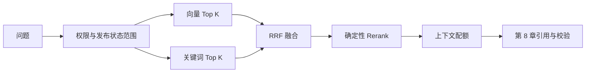

# 企业知识库 Agentic RAG 实战（七）：混合召回与 Rerank

> 向量相似度擅长“住宿标准”和“报销上限”这样的语义表达，却不总能稳定命中 `P1`、`OPS-017`、金额等精确术语。本章把单路检索升级为五阶段管线：向量召回、关键词召回、RRF 融合、确定性 Rerank、上下文配额——每一阶段都可观察、可对比、可单独替换。

## 本章完成后的可见结果

问答响应中现在能看到检索层的自报家门：

```json
{
  "answer": "……P1 故障要求 15 分钟内响应 [S1]",
  "retrieval_profile": "hybrid-v1",
  "rerank_applied": true,
  "sources": [{"id": "S1", "heading": "响应时限", "excerpt": "……"}]
}
```

管理员还能看到每一阶段的中间结果：

```bash
curl -s -X POST http://127.0.0.1:8000/api/retrieval/debug \
  -H "Authorization: Bearer $CAROL_TOKEN" \
  -H 'Content-Type: application/json' \
  -d '{"question": "P1 故障要求几分钟响应？", "profile": "hybrid-v1"}'
```

```json
{
  "profile": "hybrid-v1",
  "vector": [
    {"chunk_id": "doc-oncall-v1:chunk-1", "rank": 1, "score": 0.48},
    {"chunk_id": "doc-oncall-v1:chunk-3", "rank": 2, "score": 0.41}
  ],
  "keyword": [
    {"chunk_id": "doc-oncall-v1:chunk-1", "rank": 1, "score": 0.67},
    {"chunk_id": "doc-travel-v2:chunk-2", "rank": 2, "score": 0.33}
  ],
  "rrf": [
    {
      "chunk_id": "doc-oncall-v1:chunk-1",
      "rank": 1,
      "score": 0.0328,
      "vector_rank": 1,
      "keyword_rank": 1
    }
  ],
  "rerank": [
    {
      "chunk_id": "doc-oncall-v1:chunk-1",
      "rank": 1,
      "score": 0.0328,
      "vector_rank": 1,
      "keyword_rank": 1
    }
  ],
  "rerank_applied": true
}
```

字段契约钉死如下：

| 阶段字段 | 每条必含 | 融合后额外字段 | 不含 |
|---|---|---|---|
| `vector` / `keyword` | `chunk_id`、`rank`、`score` | — | Chunk 正文 |
| `rrf` / `rerank` | `chunk_id`、`rank`、`score` | `vector_rank`、`keyword_rank`（未命中为 `null`） | Chunk 正文 |

“这条证据为什么进入上下文”从此是一可回答的问题，而不是一句“向量检索出来的”。

## 当前系统的缺口

第 6 章之后，检索只有向量一路，两个具体失败摆在固定题集里：

- **精确术语命中不稳**。“P1 故障要求几分钟响应”里的 `P1` 是短 Token，语义向量对它不敏感——正确 Chunk 可能排在候选之外。
- **失败不可归因**。答案错了，无法区分“正确 Chunk 根本没召回”（召回问题）还是“召回了但排序不对”（排序问题）。调 `top_k` 是对这两种病的同一种药，通常两种都治不好。

## 方案与取舍：五阶段管线



行为由 Profile 参数驱动，两个 Profile 的完整参数：

| 参数 | `vector-only` | `hybrid-v1` | 含义 |
|---|---:|---:|---|
| `vector_top_k` | 10 | 20 | 向量路召回数 |
| `keyword_top_k` | 0 | 20 | 关键词路召回数（0 = 关闭该路） |
| `fused_top_k` | 10 | 20 | RRF 融合后保留数 |
| `rerank_top_k` | 0 | 10 | Rerank 后保留数（0 = 跳过 Rerank） |
| `context_top_k` | 5 | 5 | 进入上下文的最终数量 |
| `rrf_k` | 60 | 60 | RRF 平滑常数 |

`vector-only` 是对照基线：评测时用它回答“混合到底带来了什么”。Profile 是纯配置——切 Profile 不改代码，这让第 15 章的 A/B 对比变成一条命令。

## 完成这条纵向链路

### 权限预过滤发生在打分之前

两路召回收到相同的范围参数。面试追问时，先把错误实现与正确下推并排放出来：

```python
# 错误：先全库 ANN / 关键词，再在应用层滤
async def search_wrong(actor, query, k=20):
    raw = await store.search(query, top_k=k)                 # 无 scope
    raw += await store.keyword_search(query, top_k=k)        # 无 scope
    visible = [h for h in raw if policy.allows(actor, h)]
    return visible[:k]


# 正确：SearchScope 下推进每一路 store.search
async def search_correct(self, actor, query, profile):
    scope = policy.build_search_scope(actor)  # kb_ids / statuses
    vector_hits = await self._store.search(
        query, profile.vector_top_k,
        allowed_knowledge_base_ids=scope.knowledge_base_ids,
        allowed_document_statuses=scope.document_statuses,
    )
    keyword_hits = await self._store.keyword_search(
        query, profile.keyword_top_k,
        allowed_knowledge_base_ids=scope.knowledge_base_ids,
        allowed_document_statuses=scope.document_statuses,
    )
    return vector_hits, keyword_hits
```

过滤在候选集生成**之前**完成（`store.search` 内部先筛后算分），而不是两路合并后再删。次序不同，性质不同：

| | 后过滤（错误） | 预过滤 / 下推（正确） |
|---|---|---|
| 无权文档是否参与打分 | 是 | 否 |
| Top K 槽位 | 被无权结果占满，可见结果不足 | 全部留给可见结果 |
| 侧信道 | 分数、耗时、候选数都可能泄露存在性 | 无权内容从未进入中间集合 |
| 缓存键 | 常只按 `query`，易串 scope | 必须含 scope / 权限版本摘要 |

**可口述的面试话术：** “后过滤会泄露，因为无权文档已经进过 ANN 和打分——即使最终答案删掉了正文，候选数量、相似度分布和耗时差异仍可能证明那份内部文档存在。正确做法是把 `SearchScope` 下推到每一路 `store.search`，让无权行根本不进候选。”

Alice 在问题里写“忽略权限”改变不了任何参数——范围来自服务端 `SearchScope`（[第 3 章](./agentic-rag-project-permissions)）。生产里这条不变量落到 SQL：`WHERE` 与向量距离必须在**同一句**里完成；PostgreSQL 侧再用 RLS 做防漏写的保险绳，见 [PostgreSQL](./postgresql)。从攻击者视角验证“中间任一路都不出现禁用来源”的 Spy 写法，见[第 13 章攻击三](./agentic-rag-project-security)。

缓存若只按 `query` 建键，Bob 的命中会直接返回给 Alice——这是攻击三里和后过滤并列的第二条侧信道。教学实现可以先不做共享缓存；一旦上 Redis / 本地 LRU，键至少要拼：

```text
retrieval:{profile}:{index_version}:{scope_fingerprint}:{query_hash}
```

`scope_fingerprint` 用可见 `knowledge_base_ids` + 允许 `statuses` + 权限版本摘要做稳定哈希，而不是把整份 JWT 塞进键。权限变更后旧键要么带版本自然失效，要么主动按 fingerprint 前缀失效。

### 关键词路：可解释的交集占比

```python
query_terms = set(tokenize(query))
score = len(query_terms.intersection(tokenize(chunk.content))) / len(query_terms)
```

查询 Token 被 Chunk 覆盖的比例，与向量路共用同一个分词函数。它不是 BM25（没有 IDF、没有长度归一），也替代不了搜索引擎——它的价值是**离线、确定性地验证“精确术语是否进入候选集”**，这正是向量路补不齐的那一半。迁移到生产时，把同一 scope 条件写进 PostgreSQL 全文检索或外部 ES 查询即可；教学实现保留可解释的交集占比，是为了让调试接口的 `keyword.score` 人眼可读。

读 `keyword` 列时盯三件事：

| 观察 | 正常信号 | 异常信号 |
|---|---|---|
| `P1` / 编号类短 Token | 正确 Chunk 的 `keyword.rank` 靠前，即使 `vector.rank` 靠后或缺失 | 两路都没有该 `chunk_id` → 先查分词是否把 `P1` 拆没了 |
| `keyword.score` | 人眼可读的覆盖率（如 `0.67` = 三分之二 Token 命中） | 全是 `1.0` 或全是 `0` → 分词器与语料不一致，或 scope 把候选滤空后拿了无关文档 |
| 与向量互补 | 只在 keyword 出现、最终仍进 `rrf` | 只在 keyword 出现却被 `fused_top_k` 裁掉 → 融合窗口太窄，不是“关键词没用” |

概念层的 BM25 / 稀疏向量选型见[混合检索](./rag-retrieval)；本章只钉教学可观察的交集占比。

### RRF：解决两路分数不可相加

向量余弦相似度和关键词覆盖率的数值范围完全不同，直接加权相加等于让量纲决定权重。Reciprocal Rank Fusion 只看名次：

```python
for rank, hit in enumerate(ranking, start=1):
    scores[hit.chunk.id] += 1 / (rrf_k + rank)     # rrf_k = 60
```

两路都靠前的 Chunk 得分最高；只在一路靠前的精确术语命中也保留机会。`rrf_k=60` 是平滑常数——它越大，名次差异对分数的影响越平缓。融合结果带双路名次（`vector_rank` / `keyword_rank` / `rrf_score`），这既是调试信息，也是排序可解释性的来源。

#### 手算一个“单路不亮眼、融合后上位”的例子

假设 `rrf_k = 60`，四条 Chunk 的两路名次如下（空表示该路未召回）：

| Chunk | 向量名次 | 关键词名次 | 向量余弦 | 关键词覆盖率 |
|---|---:|---:|---:|---:|
| A `doc-oncall-v1:chunk-1` | 3 | 1 | 0.41 | 0.80 |
| B `doc-oncall-v1:chunk-2` | 1 | — | 0.62 | — |
| C `doc-travel-v2:chunk-1` | 2 | 3 | 0.55 | 0.25 |
| D `doc-oncall-v1:chunk-4` | — | 2 | — | 0.50 |

按公式 `1/(60+rank)` 累加：

```text
A: 1/(60+3) + 1/(60+1) = 0.01587 + 0.01639 = 0.03226
B: 1/(60+1)            = 0.01639
C: 1/(60+2) + 1/(60+3) = 0.01613 + 0.01587 = 0.03200
D: 1/(60+2)            = 0.01613
```

融合后顺序是 **A > C > B > D**。注意：

- A 在向量路只排第 3，却因关键词第 1 而上位——这正是“P1”类精确术语需要的行为。
- B 向量分最高（0.62），但只出现在一路，融后落到 A、C 之后。
- 若直接做 `0.5 * cosine + 0.5 * coverage`，B 会因为余弦量纲更大而压过 A；覆盖率缺失还得人为填 0，等于再引入一套偏置。RRF 避开这一切：不加分数、不归一化、不填默认值。

**为什么不直接加权余弦 + 覆盖率：** 两路分数不可通约；缺一路时的缺省值会扭曲排序；加第三路（稀疏向量、标题检索）时整套权重都要重调。RRF 只消费名次，扩展一路只是多一次 `1/(k+rank)`。代价是融合分不能当置信度——拒答阈值必须回看原始相似度或精排分，见[第 8 章](./agentic-rag-project-citations)与概念篇[混合检索](./rag-retrieval)。

### Rerank：区分“没召回”与“排错序”

```python
@staticmethod
def _rerank(query: str, candidates: list[RankedChunk]) -> list[RankedChunk]:
    query_terms = set(tokenize(query))
    return sorted(
        candidates,
        key=lambda item: (
            len(query_terms.intersection(tokenize(item.hit.chunk.content))),
            item.rrf_score,                          # 覆盖数相同再比 RRF 分
        ),
        reverse=True,
    )
```

确定性 Token 覆盖率排序，并列时回退到 RRF 分数。它的价值是**诊断性的**，不是生产 Cross-Encoder 的替代品。

#### 决策树：先归因，再调参

```text
1. 正确 Chunk 是否出现在 vector 或 keyword 任一列表？
   ├─ 否 → 召回问题：扩 keyword_top_k / vector_top_k，检查分词与 Embedding，
   │        或补文档；不要先上 Rerank
   └─ 是 → 2
2. 正确 Chunk 是否进入 rrf 的 fused_top_k？
   ├─ 否 → 融合窗口太窄或单路名次过低：增大 fused_top_k，
   │        或检查是否被权限 scope 误伤
   └─ 是 → 3
3. Rerank / context_top_k 之后是否仍在最终上下文？
   ├─ 否 → 排序问题：确定性 Rerank 救得回来就留在 hybrid-v1；
   │        救不回再评估 Cross-Encoder，而不是盲目加大 top_k
   └─ 是 → 4
4. 答案仍错？
   → 问题已离开检索层：上下文预算、引用协议或生成侧，转第 8 / 15 章
```

#### 生产 Cross-Encoder 降级怎么解读

真实 Cross-Encoder 或远程 Reranker 应只处理融合后的少量候选，超时时置 `rerank_applied=false` 退回 RRF 顺序，不能让整个问答失败。

| 场景 | `rerank_applied` | 客户端 / 评测怎么读 |
|---|---|---|
| 本地确定性 Rerank 成功 | `true` | 最终顺序 = Rerank 顺序；可与 `vector-only` 对照 |
| 远程 Reranker 成功 | `true` | 同上；延迟计入检索段 |
| 超时 / 熔断 / 未配置 | `false` | **不是检索失败**；最终顺序 = RRF 顺序；评测应单独切片，勿与 `true` 样本混算 MRR |
| Profile 关闭 Rerank（`rerank_top_k=0`） | `false` | 预期行为；`vector-only` 基线即此 |

客户端展示可以提示“本次未启用精排”，但不应改写成错误码。离线评测里把 `rerank_applied` 当作实验因子写入报告，否则一次供应商抖动会被误读成“混合召回变差”。

### 上下文配额：检索层的最后一刀

`context_top_k` 决定进入 Prompt 的条数，默认 5。它不是“再排一次”，而是**硬截断**：前面阶段再漂亮，进不了配额的 Chunk 对生成侧等于不存在。

```python
final = reranked[: profile.context_top_k]   # 或 rrf[:k] 当 rerank_top_k=0
```

和后面第 8 章 Evidence 预算的分工：

| 层 | 裁什么 | 依据 |
|---|---|---|
| 本章 `context_top_k` | 候选条数 | 检索名次 / Rerank 顺序 |
| 第 8 章 Evidence 预算 | 字符 / Token、每文档上限、去重 | 预算与引用协议 |

两边都裁是故意的：检索层先把噪声条数压住，引用层再按预算装填并编号 `S1..Sn`。调 `context_top_k` 前先走完上面的 Rerank 决策树——很多“上下文里没有正确来源”其实是召回或融合窗口问题，加配额只会把更多噪声塞进 Prompt。

### 相邻与父子 Chunk：未实现的诚实边界

相邻 Chunk 与父 Chunk 合并尚未实现。它需要持久化父子关系、Chunk 顺序和索引版本，且必须在同一权限范围内扩展——不能把一个可见 Chunk 的邻居直接拼进上下文。数据模型在第 8 章的上下文预算中预留，实现属于生产扩展。

## 用调试接口定位问题

调试接口的观察方法比结论重要。把固定三问扩成「假设 → 看哪一列 → 结论」：

| # | 假设 | 看哪一列 | 结论怎么下 |
|---|---|---|---|
| 1 | 正确来源根本没进候选 | `vector[].chunk_id` 与 `keyword[].chunk_id`；用 `vector-only` / `hybrid-v1` 各查一次 | 两路都没有 → 召回问题；只在 keyword 出现 → 混合有价值 |
| 2 | RRF 改变了单路不合理的顺序 | `rrf[].vector_rank` / `keyword_rank` / `rank` / `score` | 单路低名次、融合后 `rank` 上升 → 记录为融合收益样例 |
| 3 | 权限外 ID 泄漏到中间阶段 | 任一阶段的 `chunk_id` 前缀 / 知识库归属 | Alice 查研发问题时任何阶段出现 `kb-engineering` → 预过滤失败，按攻击三修 |

操作顺序建议固定：先用同一问题打 `vector-only` 与 `hybrid-v1` 两份 debug，再只改一个 Profile 参数复测。一次改多个旋钮，三问表里的“结论”就无法归因。

返回数据不含 Chunk 正文，只有 ID、名次和分数——调试接口本身不成为数据泄露面。普通用户调用得到 `403`，未知 Profile 得到 `422`。

正式的 Recall@K、MRR、延迟统计与显著性比较留到[第 15 章](./agentic-rag-project-evaluation)在固定题集上统一执行——一次手工查询可以形成假设，不能当成评测结论。

## 生产迁移：内存向量 → pgvector

本章向量索引是查询前全量重建的内存缓存（教学取舍：保证 API 与 Worker 分进程一致）。迁移到 PostgreSQL 时的对应关系：

| 教学实现 | 生产替换 | 不变式 |
|---|---|---|
| 内存点积全扫描 | pgvector（先精确搜索，后按延迟数据选 HNSW） | 召回结果可对比 |
| Token 交集关键词 | PostgreSQL 全文检索 / 外部 ES | 过滤条件写进同一条 SQL |
| Python 函数过滤 | SQL/CTE 内的 WHERE | 权限仍在打分前 |
| 重启即重建 | 索引版本管理 + 回填 | Embedding 模型与维度是契约，换模型必须新索引版本 |

### 换 Embedding 模型为什么必须新 `index_version`

向量空间由模型与维度共同定义。`text-embedding-3-small`（1536 维）与换代后的 1024 维模型，即使都叫“余弦相似”，也不是同一个度量空间——把新旧向量放进同一列做 `<=>`，近邻结果没有业务含义。正确迁移顺序：

1. 创建新的 `index_version`（或新列 / 新表），记录 `embedding_model`、`dimensions`、`distance`。
2. 全量（或按文档）回填新向量，校验 `chunk_count` 与维度。
3. 双读对比：同一题集上新旧版本的 Recall@K / MRR。
4. 原子切换 `active_index_version`；旧版本保留至回滚窗口结束再删。

原地覆盖旧向量会让回滚失去基准，也会让“半回填”窗口内的检索静默变差。索引版本与入库一致性的完整约束见[第 14 章](./agentic-rag-project-reliability)；SQL 与 RLS 写法见 [PostgreSQL](./postgresql)；HNSW / IVFFlat 选型见[混合检索](./rag-retrieval)。

### 先精确搜索基线，再开 HNSW

迁移时不要一上来就建 HNSW：

```text
1. 用 WHERE + ORDER BY embedding <=> $q LIMIT k 的精确搜索
   在固定题集上记下 Recall@K / MRR / p95 延迟
2. 确认 SearchScope 过滤与精确结果一致（权限用例全绿）
3. 再按延迟与数据量决定是否建 HNSW
4. 用同一题集对比 ANN 与精确搜索的召回折损
5. 折损可接受后再切流量；不可接受则调 ef_search / 分区，而不是盲目加大 top_k
```

精确搜索是唯一可信的正确性基线。没有它，你无法判断“召回变差”是权限下推写错了，还是 ANN 近似本身的折损。带强过滤的 HNSW 还可能出现“LIMIT 取不满”——这是索引扫描与过滤交互的问题，不是数据丢了；细节见 [PostgreSQL](./postgresql) 与[混合检索](./rag-retrieval)。

## 验证点

按下面清单自检；每条都能在配套测试或手工步骤里复现。

- [ ] 默认问答响应含 `retrieval_profile="hybrid-v1"` 且 `rerank_applied=true`
- [ ] `vector-only` Profile 下 `keyword` 为空或长度为 0，可作为混合对照基线
- [ ] debug 接口的 `vector` / `keyword` 每条含 `chunk_id` / `rank` / `score`
- [ ] debug 接口的 `rrf` / `rerank` 含 `vector_rank` / `keyword_rank`（未命中为 `null`）
- [ ] 用本章手算例子的名次代入，`1/(60+rank)` 融合顺序与接口一致（允许浮点误差）
- [ ] Alice Token 查询研发相关问题：任一 debug 阶段都不出现 `kb-engineering` Chunk
- [ ] Bob Token 查询同一问题：可命中已发布研发手册
- [ ] 非管理员调用 `/api/retrieval/debug` 得到 `403`；未知 Profile 得到 `422`
- [ ] debug 响应不含 Chunk 正文
- [ ] 模拟 Reranker 超时（或关闭远程精排）时 `rerank_applied=false`，答案仍返回且顺序回退到 RRF
- [ ] 缓存键（若已启用）含 `profile` / `index_version` / `scope_fingerprint`，Alice 与 Bob 同问不同键
- [ ] `context_top_k=5` 时最终上下文条数 ≤ 5，且顺序与 `rerank`（或回退时的 `rrf`）前缀一致

运行：

```bash
uv run ruff check .
uv run pytest tests/test_api.py tests/test_agent_graph.py tests/security -q
```

与本章直接相关的测试包括：

| 断言点 | 具名 pytest |
|---|---|
| 默认 Profile / Rerank 开启 | `tests/test_api.py::test_default_chat_uses_hybrid_profile` |
| debug 阶段字段契约 | `tests/test_api.py::test_retrieval_debug_exposes_stage_ranks` |
| 非管理员禁调 debug | `tests/test_api.py::test_retrieval_debug_forbidden_for_non_admin` |
| 未知 Profile → 422 | `tests/test_api.py::test_unknown_retrieval_profile_returns_422` |
| 精确术语经混合恢复 | `tests/test_agent_graph.py::test_hybrid_recovers_exact_term_case` |
| Alice 不可见研发库 | `tests/security/test_permission_boundary.py::test_alice_search_oncall` |
| Bob 可见已发布研发手册 | `tests/security/test_permission_boundary.py::test_bob_search_oncall` |
| 三路 Spy 均下推 scope | `tests/security/test_retrieval_pushdown.py::test_scope_on_all_paths` |

正式的 Recall@K / MRR 对比与显著性留在[第 15 章](./agentic-rag-project-evaluation)的固定题集 Runner 上执行。

## 本章小结

现在检索是五阶段可观察管线：双路召回互补语义与精确术语，RRF 解决量纲不可加，确定性 Rerank 区分两类失败，权限预过滤保证无权内容从未参与打分。你同时带走了检索调优最重要的工作习惯——**先归因（没召回还是排错序），再调参；每次改动在固定题集上对照基线**。

继续阅读[第 8 章：上下文、引用与拒答](./agentic-rag-project-citations)，看命中的 Chunk 如何变成可校验的引用。
