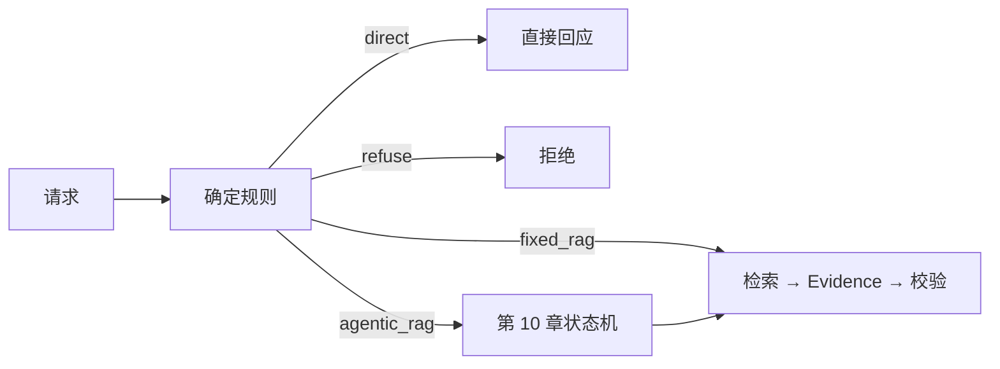

# 企业知识库 Agentic RAG 实战（九）：问题分类与执行路线

> Agent 不是所有请求的默认包装。一个问题如果下一步可以在收到请求时确定，就应继续使用短、便宜、可评测的固定链路；只有需要根据证据决定下一步的任务才进入 Agent。

## 本章实际交付

配套项目新增 `app/routing.py`。当前分类器是可读、可测的确定规则，返回受限的 `RouteDecision`：

| 输入形状 | 决策 | 当前行为 |
|---|---|---|
| 问候、能力询问 | `direct` | 直接说明服务边界，不检索 |
| 单一事实 | `fixed_rag` | 走第 8 章检索、Evidence、引用校验 |
| 显式绕过权限 | `refuse` | 拒绝，不检索 |
| 历史版本比较 | `version_tool` | 仅管理员可选择；第 11 章实现工具 |
| 总结、多事实或比较 | `summary` / `agentic_rag` | 多事实进入第 10 章有界状态机；总结暂时保留固定 RAG 并标记降级 |

`POST /api/chat` 的响应新增 `route`、`intent`、`route_reason` 和 `route_degraded`。管理员可使用 `POST /api/routing/debug` 查看决策；普通用户得到 `403`。

这是一份清晰的过渡实现，不是声称已经完成 LLM 分类器或自动摘要器；历史版本工具已在第 11 章以独立受权接口落地。它的目的在于让控制流替换时保留同一权限和引用边界。

## 为什么先做规则

下列情况不应交给模型“猜”：绕过权限的请求、历史版本读取和明确的协议字段。它们有安全或授权后果，应由服务端代码决定。

```python
if "忽略" in question and "权限" in question:
    return RouteDecision("refuse", "policy_bypass", "permission_bypass")
if "v1" in question or "历史版本" in question:
    return require_knowledge_admin(...)
```

规则只覆盖高确定性边界，不试图用关键词理解全部自然语言。未来接入低温度结构化分类器时，它应输出受限枚举，且分类失败默认回退到 `fixed_rag`；敏感规则仍必须优先执行。

## 路由不改变权限

无论决策是 `fixed_rag` 还是未来的 `agentic_rag`，底层仍使用同一份 JWT、`SearchScope`、混合检索、Evidence 和引用校验。路由器只选择控制流，不能授予访问范围。



比较和多文档本身不是必须 Agent 的理由。如果系统能稳定提取实体，并能预先写出固定扇出查询和计算，就应继续使用确定链路。只有第一次检索暴露出缺失实体、版本冲突或语义歧义，下一步才依赖本轮 Evidence，需要状态机来决定改写、拆分或停止。

## 如何观察降级

当前总结请求仍会得到显式降级；多事实请求已经进入 LangGraph：

```json
{
  "route": "summary",
  "intent": "summary",
  "route_reason": "summary_requested; agentic route not required",
  "route_degraded": true
}
```

这比悄悄把总结请求当作普通事实更诚实：前端、日志和评测能区分原始意图与降级行为。多事实路由已由第 10 章替换为有限轮数的 Agent 图；历史版本则通过第 11 章的独立工具接口读取。

## 验证点

测试覆盖：绕过权限在检索前拒绝、问候不检索、比较任务被识别为 `agentic_rag`、历史版本读取要求知识库管理员。运行：

```bash
cd projects/agentic-rag
uv run ruff check .
uv run pytest
```

继续阅读[第 10 章：LangGraph 多轮检索状态机](./agentic-rag-project-langgraph)。
