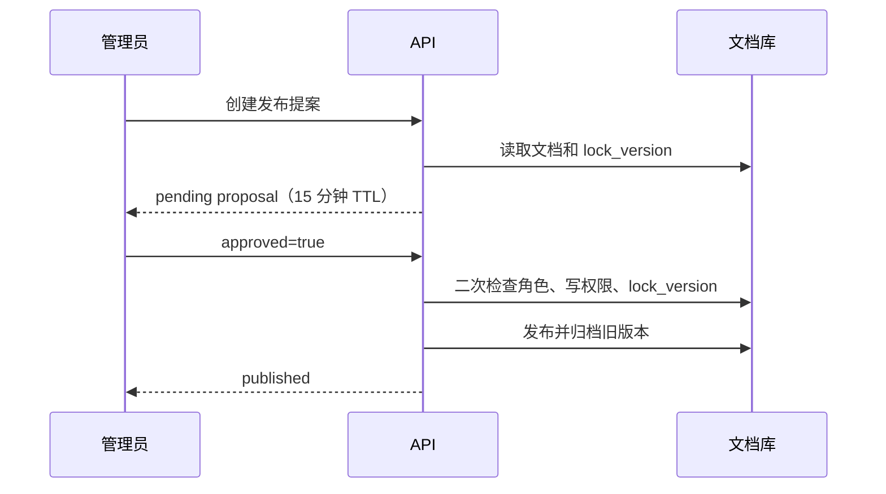

# 企业知识库 Agentic RAG 实战（十一）：工具、记忆与人工介入

> Agent 可以建议操作，不能把聊天中的一句“确认”当成写权限。本章把读取历史版本、保存会话摘要和发布确认做成三个明确的领域接口，每个都回答同一个问题：**权限由谁决定、边界画在哪里、越界时返回什么**。

## 本章完成后的可见结果

三个能力都可以用 curl 演示。管理员 Carol 读取归档的历史版本：

```bash
curl -s http://127.0.0.1:8000/api/tools/document-versions/doc-travel-v1 \
  -H "Authorization: Bearer $CAROL_TOKEN"
# {"document_id": "doc-travel-v1", "version": 1, "status": "archived", "content": "..."}

# 同一请求换成 Alice 的 Token：404（不是 403）
```

带 `conversation_id` 的对话会产生可查询的会话摘要：

```bash
curl -s -X POST .../api/chat -H "Authorization: Bearer $ALICE_TOKEN" \
  -H 'Content-Type: application/json' \
  -d '{"question": "上海住宿上限是多少？", "conversation_id": "conv-1"}'

curl -s .../api/conversations/conv-1/memory -H "Authorization: Bearer $ALICE_TOKEN"
# {"summary": "上海住宿上限……", "updated_at": "..."}（最长 500 字符）
```

发布走两阶段：先创建提案，再独立确认。流式场景下，确认等待会以 `run.waiting_for_human` 事件出现（见[第 12 章](./agentic-rag-project-streaming)）。

## 当前系统的缺口

第 10 章的图只会检索 `published` 文档并回答。三个真实业务需求还无法满足：

- 管理员在问答界面比较“制度 V1 和 V2 差在哪”，但普通检索永远过滤已归档版本——**没有受控的历史读取通道**。
- 用户追问“那报销呢”，系统不知道上一轮聊过什么——**没有会话连续性**。
- 发布是写操作，一旦执行就替换全员看到的制度——**没有人工闸门**。

这三个缺口的共同点是：都不能靠“给模型更多权限”解决，要给的是**窄能力 + 明确边界**。对照[Tool Calling 与 MCP](./agent-tool-calling)：模型输出的是意图，执行永远在你的代码里；身份参数必须由服务端注入，不能让模型填。

## 方案与取舍

**工具不是数据库连接。** 不要把数据库 Session、文件路径或任意 SQL 交给模型。工具表达一个很窄的业务能力，权限由服务端运行上下文决定，模型无权通过参数扩大范围。

**历史版本与普通检索分开。** 历史读取是管理动作，不能做成 `search(include_archived=true)` 这样的万能开关。路径分开后，审计能区分“日常问答”与“版本管理”，也收窄了模型意外接触旧制度的面。

**记忆是线索，不是事实源。** 会话摘要最多帮助理解下一轮的指代，不能覆盖知识库里的现行制度。

**确认是独立请求，不是文本提取。** 从聊天里解析“我确认”是危险的——提示词注入可以让模型把任何一句话当确认。[第 13 章](./agentic-rag-project-security)会把这条边界放进攻击矩阵。

**按路线暴露工具，而不是按“模型想要什么”。** 第 9 章选出的 `route` 决定本轮可见工具集合；集合之外的名字对模型不可见，从源头缩小误调用面。

## 工具注册表：每条路线可见的工具集合

把“系统里实现了哪些工具”和“这一轮模型能看见哪些工具”拆开：

```python
TOOL_REGISTRY: dict[str, ToolSpec] = {
    "search_knowledge": ToolSpec(...),
    "read_document_version": ToolSpec(sensitivity="sensitive_read", ...),
    "create_publish_proposal": ToolSpec(sensitivity="write", ...),
}

ROUTE_TOOL_ALLOWLIST: dict[str, frozenset[str]] = {
    "direct": frozenset(),
    "refuse": frozenset(),
    "fixed_rag": frozenset({"search_knowledge"}),
    "agentic_rag": frozenset({"search_knowledge"}),
    "summary": frozenset({"search_knowledge"}),
    "version_tool": frozenset({"search_knowledge", "read_document_version"}),
    # 写工具不进入任何自动问答路线的 allowlist
}
```

| 路线 | 可见工具 | 设计意图 |
|---|---|---|
| `direct` / `refuse` | 无 | 短路与拒绝不需要工具 |
| `fixed_rag` / `summary` | `search_knowledge` | 单次检索即可 |
| `agentic_rag` | `search_knowledge` | 多轮检索仍是只读检索，不自动升级到历史/写工具 |
| `version_tool` | `search_knowledge` + `read_document_version` | 仅管理员路线才看见历史读取 |
| 任意自动路线 | **不含** `create_publish_proposal` | 写操作只通过独立 HTTP / 人工确认入口触发 |

绑定给模型时只传入 allowlist 交集：

```python
def tools_for_route(route: str) -> list[Tool]:
    names = ROUTE_TOOL_ALLOWLIST.get(route, frozenset())
    return [TOOL_REGISTRY[name].to_langchain() for name in sorted(names)]
```

效果：

1. 普通问答的提示词里根本没有“历史版本工具”的 schema，模型更难被注入话术诱导去调用它。
2. 即使模型幻觉出一个不在列表里的工具名，执行器在分发前就会拒绝——白名单是第二道门。
3. 多 Agent / 分工场景下，也可以按角色再收窄一次集合，见[多智能体协作](./agent-multi-agent)；本项目单图阶段先按路线收窄就够。

本地演示里，版本工具目前主要通过独立 HTTP 端点验证权限边界；注册表与路线 allowlist 是把同一原则接到 Agent 循环时的必做项，避免“HTTP 守住了、图里却把全家桶 bind 给模型”。

## 工具执行器：模型提案 ≠ 已授权

执行器是工具层唯一入口。它不信任模型填的身份，也不信任“路由曾经放行过”这一历史事实——**每次调用重新鉴权**。

```python
async def execute_tool(
    name: str,
    args: dict,
    *,
    actor: User,
    route: str,
    run_id: str,
) -> ToolResult:
    if name not in ROUTE_TOOL_ALLOWLIST.get(route, frozenset()):
        return ToolResult.error("tool_not_allowed", retryable=False)

    spec = TOOL_REGISTRY[name]
    # 身份与范围只从 actor / 会话注入，剥离模型可能伪造的字段
    safe_args = strip_identity_fields(args)

    if spec.sensitivity in {"sensitive_read", "write"}:
        if not await authorize(spec, actor, safe_args):
            return ToolResult.error("permission_denied", retryable=False)

    return await spec.handler(actor=actor, run_id=run_id, **safe_args)
```

与[概念篇](./agent-tool-calling)对齐的三条硬规则：

1. `user_id` / `tenant_id` / `roles` 绝不来自工具参数。
2. `permission_denied` 与 `not_found` 对调用方不可枚举区分（HTTP 统一 `404`；图内用稳定错误码，但不回传“文档存在但你没权限”的细节）。
3. `permission_denied` **不可重试**：换参数再试只会变成权限探测。

### `permission_denied` 之后图怎么走

对应[第 13 章攻击五](./agentic-rag-project-security)：诱导工具扩大权限时，执行器返回稳定错误，图不得把错误原文丢回模型让它“换个文档 ID 再试”。

```python
if result.error_code == "permission_denied":
    return Command(
        goto="safe_refusal",
        update={
            "security_event": "tool_permission_denied",
            "exit_reason": "permission_denied",
        },
    )

if result.error_code == "tool_not_allowed":
    return Command(
        goto="safe_refusal",
        update={"security_event": "tool_not_in_route_allowlist"},
    )
```

| 错误码 | 是否可重试 | 下一跳 | 原因 |
|---|---|---|---|
| `permission_denied` | 否 | `safe_refusal` | 再试即探测权限 |
| `tool_not_allowed` | 否 | `safe_refusal` | 路线外工具，属配置/注入问题 |
| `not_found` | 否（只读查询） | 合成拒答或追问 | 避免枚举 |
| 超时 / 依赖 5xx | 是（有限次） | 同节点退避或降级 | 瞬时故障，见[可靠性](./agent-reliability) |

## 版本工具：双重 404 防枚举

```python
async def read_document_version(
    rag: RagContainer, actor: User, document_id: str
) -> DocumentVersion | None:
    if "knowledge_admin" not in actor.global_roles:
        return None
    document = await rag.documents.get(document_id)
    knowledge_base = (
        rag.directory.get_knowledge_base(document.knowledge_base_id)
        if document is not None else None
    )
    if knowledge_base is None or not rag.directory.can_read(actor, knowledge_base):
        return None
    ...
```

权限检查分两层：全局角色（`knowledge_admin`）加资源级可读（`can_read` 对知识库），缺一返回 `None`。端点把 `None` 和“资源不存在”统一映射成 `404`——如果无权限返回 `403`，攻击者就能借状态码差异枚举哪些文档 ID 存在。这是[第 13 章](./agentic-rag-project-security)要系统性展开的防枚举原则，这里先落地。

工具执行时会重新解析原始文件（`parse_document`），而不是从检索索引里取——索引里只有 Chunk，历史版本工具承诺的是**完整原文**。代价是每次调用都有解析开销，对管理动作可以接受。

## 写工具与敏感读：人工确认状态机

只读检索可以自动执行；敏感读（历史全文）至少要审计，产品上也可以要求确认；写操作（发布）必须人工确认。三类工具的闸门强度不同：

| 工具灵敏度 | 示例 | 是否自动执行 | 人工介入 |
|---|---|---|---|
| `read` | `search_knowledge` | 是（受路线 allowlist） | 否 |
| `sensitive_read` | `read_document_version` | 可配置：自动但强审计，或先确认 | 建议对“全文导出 / 批量历史”开确认 |
| `write` | `create_publish_proposal` / `apply_publish_decision` | 否 | **必须** interrupt → 独立决策 |

确认链路的状态统一为：

```text
tool 提案
  → interrupt()
  → 对外事件 run.waiting_for_human
  → 独立 HTTP 决策（approved / cancelled）
  → resume(thread_id, decision)
  → 执行器再次鉴权后执行或终止
```

敏感读若选择“先确认”，等待卡片应只展示**元数据**（文档 ID、版本号、知识库名），不要把待确认的全文提前塞进 SSE——否则确认前就已经泄漏。写工具同理：提案阶段只暴露 diff 摘要或标题，真正副作用发生在 `approved=true` 且执行器二次鉴权之后。

### 发布提案：两阶段 + 图内等待

HTTP 形态（本地已实现）把写操作拆成两个请求：

```text
POST /api/documents/{document_id}/publish-proposals   → 创建 pending 提案
POST /api/publish-proposals/{proposal_id}/decisions   → 同一管理员提交决定
```



提案记录创建时的 `lock_version`；决策端点在执行前**重新**检查角色、资源写权限和锁版本，然后才调用既有的 `rag.publish`。这保证三件事：确认来自独立、认证后的 HTTP 请求而非聊天文本；审批期间文档被他人更新时发布失败（乐观锁 409），不会把旧审阅结果发出去；提案 15 分钟未决策自动失效，过期审批不能执行。

若把同一闸门接进 LangGraph，节点里使用 `interrupt`，流式层翻译为 `run.waiting_for_human`（概念篇的 `interrupt` 事件在本项目中的映射，见[第 12 章](./agentic-rag-project-streaming)）：

```python
decision = interrupt({
    "kind": "publish_confirmation",
    "proposal_id": proposal.id,
    "document_id": document.id,
    "ttl_seconds": 900,
})
# 恢复后 decision 来自 resume payload，不是模型新话轮
if not decision.get("approved"):
    return Command(goto="cancelled", update={"exit_reason": "human_cancelled"})
await execute_tool("apply_publish_decision", decision, actor=actor, route=route, run_id=run_id)
```

| 步骤 | 可信来源 | 不可信来源 |
|---|---|---|
| 是否需要确认 | 工具灵敏度配置 | 模型说“用户已经同意” |
| 确认结果 | 带鉴权的 `decisions` / `resume` | 聊天里的“确认”“OK” |
| 执行时权限 | 当前 JWT + 目录服务 | Checkpoint 里缓存的旧角色 |

前端只渲染等待卡片并提交决策；**确认链路不经过模型**。这与概念篇[写入操作的确认前置](./agent-tool-calling)同一模式：预演 / 提案与真正执行拆开，一次性令牌或提案 ID 都有 TTL。对应[第 13 章攻击五](./agentic-rag-project-security)：即便文档或用户话术要求“直接发布”，执行器与人工闸门仍决定是否发生副作用。

提案库同样是进程内教学实现，不能在多副本或重启后作为生产审批系统使用；运行与审计状态的持久化在第 14 章。

## 会话记忆：按 actor 隔离的进程内存储

```python
def get(self, conversation_id: str, actor_id: str) -> ConversationMemory | None:
    item = self._items.get(conversation_id)
    return item if item and item.actor_id == actor_id else None

def save(self, conversation_id, actor_id, summary) -> ConversationMemory:
    item = ConversationMemory(..., summary=summary[:500], ...)
```

三个刻意的边界：摘要截断到 500 字符（成本与上下文污染的双重护栏，对照[上下文工程](./agent-context)的压缩纪律）；读取按 `(conversation_id, actor_id)` 双键校验，其他用户读同一 ID 得到 `404`；**存储是进程内的**——重启即失，多副本各存一份。它没有被拼回回答 Prompt，也不会被当成企业事实：用户上一轮说“住宿标准是 800 元”，不能覆盖当前文档里的 650 元上限。

记忆与 Checkpoint 容易被混为一谈，下一节把边界写死。

## Checkpoint / 记忆边界：存什么、不存什么

第 10 章的 LangGraph 尚未配置 Checkpointer，也没有 `interrupt()` 后的跨进程恢复接口，因此**不能把当前演示称为“可恢复工作流”**。本章的提案 ID 只证明人工确认的接口边界。生产若引入 Checkpoint，必须先分清三类状态：

| 种类 | 存什么 | 不存什么 | 恢复时要做什么 |
|---|---|---|---|
| 会话记忆 | 短摘要、指代线索 | 制度原文、权限结论、工具密钥 | 仅作 Prompt 线索；事实仍以检索为准 |
| Run Checkpoint | `thread_id`、节点位置、pending 提案 ID、已规划查询 | 未重过滤的 Evidence 正文当作长期事实 | 恢复前重鉴权；Evidence 重过滤 |
| 审批事件 | 不可变决策日志（谁、何时、对哪个提案） | 可改写的“当前意见” | 只追加，不对账成功不执行副作用 |

生产实现需要把 `thread_id`、运行状态、提案和不可变审批事件持久化，并在恢复前重新验证当前访问权限；同时要记住[生产可靠性](./agent-reliability)的提醒：Checkpointer 只保存状态，不能代替任务领取、租约和副作用幂等。

### 撤权后恢复会话：必须重过滤 Evidence

最容易漏的安全洞是：“Bob 有权限时跑到一半，Checkpoint 里留下了研发手册片段；后来 Bob 被移出研发库，再 resume。”

错误做法：直接把 Checkpoint 里的 `hits` / Evidence 喂回模型。  
正确做法：

```python
async def resume_run(thread_id: str, actor: User, decision: dict) -> None:
    ckpt = await checkpointer.load(thread_id)
    if ckpt.actor_id != actor.id:
        raise HTTPException(404)  # 不可区分

    # 1) 角色与资源权限按【当前】目录服务重算
    scope = await build_search_scope(actor)
    if not scope.allows(ckpt.resource_fingerprint):
        return reject_or_refilter(ckpt, reason="scope_changed")

    # 2) Evidence 按当前 scope 重过滤；无权片段丢弃
    evidence = refilter_evidence(ckpt.evidence, scope)

    # 3) 写工具决策仍要走执行器重新鉴权
    await graph.ainvoke(
        Command(resume=decision),
        config={"configurable": {"thread_id": thread_id}},
        context={"scope": scope, "evidence": evidence, "actor": actor},
    )
```

验收口径与[第 13 章 Canary](./agentic-rag-project-security)一致：撤权后的 `resume` 不得在答案、事件、工具结果或恢复后的 Evidence 中泄漏 Canary。本地演示尚未接入持久化 Checkpoint；把本段当成迁移清单，而不是声称 Demo 已可跨进程恢复。

## 运行和观察

```bash
# 版本工具：Carol 成功 / Alice 404
curl -s .../api/tools/document-versions/doc-travel-v1 -H "Authorization: Bearer $CAROL_TOKEN"
curl -s -o /dev/null -w "%{http_code}" .../api/tools/document-versions/doc-travel-v1 \
  -H "Authorization: Bearer $ALICE_TOKEN"        # 404

# 记忆隔离：Bob 读 Alice 的会话
curl -s -o /dev/null -w "%{http_code}" .../api/conversations/conv-1/memory \
  -H "Authorization: Bearer $BOB_TOKEN"          # 404

# 两阶段发布：创建提案 → 确认（或被第二位管理员的更新打断，观察 409）
curl -s -X POST .../api/documents/doc-travel-v2/publish-proposals \
  -H "Authorization: Bearer $CAROL_TOKEN"
curl -s -X POST .../api/publish-proposals/<proposal_id>/decisions \
  -H "Authorization: Bearer $CAROL_TOKEN" -H 'Content-Type: application/json' \
  -d '{"approved": true}'

# 确认取消：approved=false，文档仍保持原状态
curl -s -X POST .../api/publish-proposals/<proposal_id>/decisions \
  -H "Authorization: Bearer $CAROL_TOKEN" -H 'Content-Type: application/json' \
  -d '{"approved": false}'
```

流式侧观察（生产接线后）：创建写提案后应收到 `run.waiting_for_human`，取消或批准后再收到终态 `run.completed`（`finish_reason` 区分 `cancelled` / `success`）。当前 Demo 的流式生成器尚未挂上完整审批等待，事件名与 Envelope 以第 12 章为准。

## 失败与边界验证

三条验收必须单独成测，不能只靠“发布 happy path”：

### 1. 无权限工具

- HTTP：Alice 调 `document-versions` → `404`，与不存在的文档不可区分。
- 图内：模型提案 `read_document_version` 或不在路线 allowlist 的名字 → 执行器返回 `permission_denied` / `tool_not_allowed` → 进入 `safe_refusal`，**不重试**、不把“换个 ID 再试”回灌给模型。
- 对应[攻击五](./agentic-rag-project-security)：诱导工具扩大权限时，答案、工具结果、SSE 事件均不得出现 Canary。

### 2. 确认取消

- `approved=false`（或 resume 取消）后：不调用 `rag.publish`；文档 `lock_version` 不变；流式终态 `finish_reason=cancelled`（接线后，见[第 12 章](./agentic-rag-project-streaming)）。
- 聊天里出现“我确认发布”文本，**不得**被当成决策；只有独立 `decisions` / `resume` payload 有效。

### 3. Checkpoint 恢复后权限变化

- 恢复前按**当前**目录服务重算 `SearchScope`，对 Checkpoint 内 Evidence 重过滤。
- 撤权用户 resume：拒绝或仅保留仍可见片段；Canary 不得出现在恢复后的 Evidence / 事件 / 工具结果。
- 本地 Demo 尚无持久化 Checkpointer——本项是迁移清单，安全套件在生产接线后补行。

| 场景 | 预期 |
|---|---|
| Alice 调版本工具 | `404`，与不存在的文档不可区分 |
| 无权限工具名出现在 Agent 提案中 | 执行器 `permission_denied` 或 `tool_not_allowed`，图进入 `safe_refusal`，不重试 |
| Bob 读 Alice 的会话摘要 | `404` |
| 确认取消（`approved=false`） | 不调用 `rag.publish`；文档 `lock_version` 不变 |
| 15 分钟后决策提案 | 拒绝执行（过期） |
| 审批期间文档被更新 | 锁版本失效，`409`，发布不执行 |
| Checkpoint 恢复时角色已撤 | 拒绝或重过滤；Canary 不出现在恢复后的 Evidence / 事件 |
| 服务重启 | 记忆与提案清空（进程内实现的教学边界，非缺陷） |

```bash
uv run ruff check .
uv run pytest tests/test_tools_memory.py -q
# 安全延伸（有则跑）：
# uv run pytest tests/security -q
```

测试覆盖摘要截断与用户隔离、版本工具的管理员边界，以及发布必须经过独立提案与确认。无权限工具与 Checkpoint 撤权用例在安全套件中延伸（见第 13 章矩阵）；本地未实现的持久化恢复测试，迁移时按上表补行。

## 本章小结

现在 Agent 有了三个受控的能力出口：窄权限的版本读取工具、按用户隔离的会话记忆、带 TTL 与乐观锁的两阶段发布。它们的共同设计模式值得记住：

1. **按路线注册工具**，缩小误调用面；
2. **执行器每次重新鉴权**，模型提案不等于授权；
3. **`permission_denied` 走向安全拒答，不走向重试**；
4. **写操作走 interrupt → waiting_for_human → resume**，确认不经过模型；
5. **Checkpoint 可恢复控制流，不可恢复过期权限**——撤权后必须重过滤 Evidence。

继续阅读[第 12 章：SSE 流式事件协议](./agentic-rag-project-streaming)，把等待、工具与终态以稳定事件流推送给前端；安全对抗与 Canary 验收见[第 13 章](./agentic-rag-project-security)。
