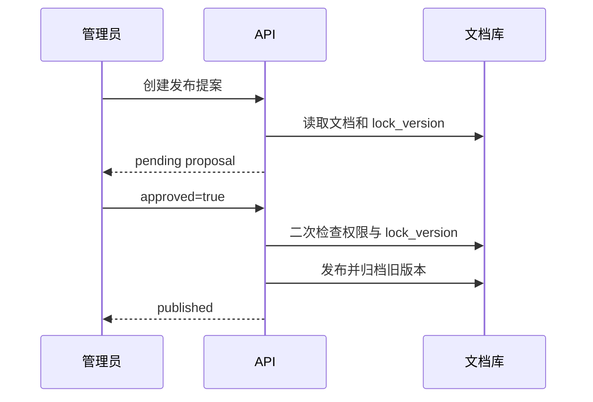

# 企业知识库 Agentic RAG 实战（十一）：工具、记忆与人工介入

> Agent 可以建议操作，不能把聊天中的一句“确认”当成写权限。本章把读取历史版本、保存会话摘要和发布确认做成明确的领域接口。

第 10 章的图只会检索和回答。本章在配套项目中加入三个可运行能力：管理员可读取一份指定文档版本；聊天响应可保存为归属用户的短摘要；发布要先创建提案，再由同一位管理员通过独立请求确认。

## 工具不是数据库连接

不要把数据库 Session、文件路径或任意 SQL 交给模型。工具应表达一个很窄的业务能力；权限由服务端的运行上下文决定，模型无权通过参数扩大范围。

项目里的历史版本读取工具在 [tools.py](../projects/agentic-rag/app/tools.py) 中：

```python
async def read_document_version(
    rag: RagContainer, actor: User, document_id: str
) -> DocumentVersion | None:
    if "knowledge_admin" not in actor.global_roles:
        return None
    document = await rag.documents.get(document_id)
    knowledge_base = rag.directory.get_knowledge_base(
        document.knowledge_base_id
    ) if document else None
    if knowledge_base is None or not rag.directory.can_read(actor, knowledge_base):
        return None
    raw = await rag.object_store.get(document.object_key)
    content = "\n".join(
        chunk.content for chunk in parse_document(document.filename, raw)
    )
    return DocumentVersion(...)
```

`GET /api/tools/document-versions/{document_id}` 只是这个领域工具的调试入口。普通用户和不存在的资源都返回 `404`，避免借由 `403` 枚举受保护文档。生产中应把它注册为 Agent 可调用工具，但仍由同一服务端实现执行，不把权限判断移进 Prompt。

## 历史版本与普通检索分开

普通问答只检索 `published` 文档。历史版本读取是管理动作，不能变成 `search(include_archived=true)` 这样的万能开关。两条路径分开后，审计记录能区分“日常问答”与“版本管理”，也减少模型意外接触旧制度的范围。

测试覆盖了 Carol 可以读取 `doc-travel-v1`、Alice 得到 `404`：

```bash
cd projects/agentic-rag
uv run pytest tests/test_tools_memory.py
```

## 会话记忆只是线索

`ConversationMemoryStore` 按 `(conversation_id, actor_id)` 读取并限制摘要为 500 个字符：

```python
memory = rag.conversation_memory.get(conversation_id, current_user.id)
rag.conversation_memory.save(conversation_id, current_user.id, response.answer)
```

`POST /api/chat` 可选传入 `conversation_id`，随后通过 `GET /api/conversations/{conversation_id}/memory` 读取自己的摘要。其他用户读取同一个 ID 会得到 `404`。本章为便于本地运行使用进程内存，所以重启服务后会丢失；它没有被拼回回答 Prompt，也不会被当成企业事实。

真实企业事实仍来自受审核的知识库和本轮 Evidence。用户上一轮说“住宿标准是 800 元”最多帮助理解下一轮的指代，不能覆盖当前文档里的 650 元上限。

## 发布使用两阶段确认

发布仍是现有的受锁保护业务动作。新增接口把“提议”和“执行”拆开：

```text
POST /api/documents/{document_id}/publish-proposals
POST /api/publish-proposals/{proposal_id}/decisions
```

第一步只允许有 `knowledge_admin` 角色且拥有知识库写权限的用户。提案保存目标文档、创建者、当时的 `lock_version`、状态和 15 分钟过期时间。第二步必须由同一创建者显式提交 `{ "approved": true }`；执行前重新检查角色、资源写权限和锁版本，然后调用已有的 `rag.publish`。



这不是把“确认无误”从聊天文本中提取出来。确认是独立、认证后的 HTTP 请求；乐观锁防止审批期间有人更新文档后仍发布旧审阅结果。当前提案库同样是进程内的教学实现，因而不能在多副本或重启后作为生产审批系统使用；第 14 章会把运行和审计状态持久化。

## Checkpoint 的边界

第 10 章的 LangGraph 已有有界状态图，但尚未配置 LangGraph Checkpointer，也没有 `interrupt()` 后的跨进程恢复接口。因此不能把当前演示称为“可恢复工作流”。本章的提案 ID 仅证明了人工确认的接口边界。

生产实现需要把 `thread_id`、运行状态、提案和不可变审批事件持久化，并在恢复前再次验证当前访问权限；Checkpointer 只保存状态，不能代替任务领取、租约和副作用幂等。相关可靠性设计在第 14 章补齐。

## 本章验证

```bash
cd projects/agentic-rag
uv run ruff check .
uv run pytest tests/test_tools_memory.py
```

测试验证内存摘要的长度与用户隔离、历史版本工具的管理员边界，以及发布必须经过独立提案和确认。

继续阅读[第 12 章：SSE 流式事件协议](./agentic-rag-project-streaming)，把检索、工具、引用和错误以稳定事件推送给前端。
