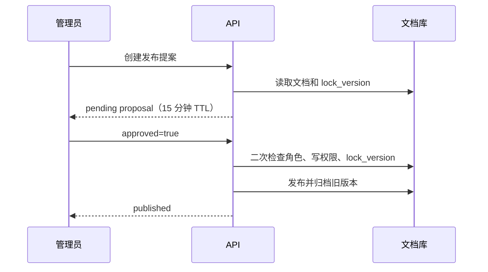

# 企业知识库 Agentic RAG 实战（十一）：工具、记忆与人工介入

> Agent 可以建议操作，不能把聊天中的一句“确认”当成写权限。本章把读取历史版本、保存会话摘要和发布确认做成三个明确的领域接口，每个都回答同一个问题：**权限由谁决定、边界画在哪里、越界时返回什么**。

## 本章完成后的可见结果

三个能力都可以用 curl 演示。管理员 Carol 读取归档的历史版本：

```bash
curl -s http://127.0.0.1:8000/api/tools/document-versions/doc-travel-v1 \
  -H "Authorization: Bearer $CAROL_TOKEN"
# {"document_id": "doc-travel-v1", "version": 1, "status": "archived", "content": "..."}

# 同一请求换成 Alice 的 Token：404（不是 403）
```

带 `conversation_id` 的对话会产生可查询的会话摘要：

```bash
curl -s -X POST .../api/chat -H "Authorization: Bearer $ALICE_TOKEN" \
  -H 'Content-Type: application/json' \
  -d '{"question": "上海住宿上限是多少？", "conversation_id": "conv-1"}'

curl -s .../api/conversations/conv-1/memory -H "Authorization: Bearer $ALICE_TOKEN"
# {"summary": "上海住宿上限……", "updated_at": "..."}（最长 500 字符）
```

发布走两阶段：先创建提案，再独立确认。

## 当前系统的缺口

第 10 章的图只会检索 `published` 文档并回答。三个真实业务需求还无法满足：

- 管理员在问答界面比较“制度 V1 和 V2 差在哪”，但普通检索永远过滤已归档版本——**没有受控的历史读取通道**。
- 用户追问“那报销呢”，系统不知道上一轮聊过什么——**没有会话连续性**。
- 发布是写操作，一旦执行就替换全员看到的制度——**没有人工闸门**。

这三个缺口的共同点是：都不能靠“给模型更多权限”解决，要给的是**窄能力 + 明确边界**。

## 方案与取舍

**工具不是数据库连接。** 不要把数据库 Session、文件路径或任意 SQL 交给模型。工具表达一个很窄的业务能力，权限由服务端运行上下文决定，模型无权通过参数扩大范围——对照[Tool Calling 与 MCP](./agent-tool-calling)的身份参数注入原则。

**历史版本与普通检索分开。** 历史读取是管理动作，不能做成 `search(include_archived=true)` 这样的万能开关。路径分开后，审计能区分“日常问答”与“版本管理”，也收窄了模型意外接触旧制度的面。

**记忆是线索，不是事实源。** 会话摘要最多帮助理解下一轮的指代，不能覆盖知识库里的现行制度。

**确认是独立请求，不是文本提取。** 从聊天里解析“我确认”是危险的——提示词注入可以让模型把任何一句话当确认。第 13 章会攻击这条边界。

## 完成这条纵向链路

### 版本工具：双重 404 防枚举

```python
async def read_document_version(
    rag: RagContainer, actor: User, document_id: str
) -> DocumentVersion | None:
    if "knowledge_admin" not in actor.global_roles:
        return None
    document = await rag.documents.get(document_id)
    knowledge_base = (
        rag.directory.get_knowledge_base(document.knowledge_base_id)
        if document is not None else None
    )
    if knowledge_base is None or not rag.directory.can_read(actor, knowledge_base):
        return None
    ...
```

权限检查分两层：全局角色（`knowledge_admin`）加资源级可读（`can_read` 对知识库），缺一返回 `None`。端点把 `None` 和“资源不存在”统一映射成 `404`——如果无权限返回 `403`，攻击者就能借状态码差异枚举哪些文档 ID 存在。这是[第 13 章](./agentic-rag-project-security)要系统性展开的防枚举原则，这里先落地。

工具执行时会重新解析原始文件（`parse_document`），而不是从检索索引里取——索引里只有 Chunk，历史版本工具承诺的是**完整原文**。代价是每次调用都有解析开销，对管理动作可以接受。

### 会话记忆：按 actor 隔离的进程内存储

```python
def get(self, conversation_id: str, actor_id: str) -> ConversationMemory | None:
    item = self._items.get(conversation_id)
    return item if item and item.actor_id == actor_id else None

def save(self, conversation_id, actor_id, summary) -> ConversationMemory:
    item = ConversationMemory(..., summary=summary[:500], ...)
```

三个刻意的边界：摘要截断到 500 字符（成本与上下文污染的双重护栏，对照[上下文工程](./agent-context)的压缩纪律）；读取按 `(conversation_id, actor_id)` 双键校验，其他用户读同一 ID 得到 `404`；**存储是进程内的**——重启即失，多副本各存一份。它没有被拼回回答 Prompt，也不会被当成企业事实：用户上一轮说“住宿标准是 800 元”，不能覆盖当前文档里的 650 元上限。

### 发布提案：两阶段状态机

```text
POST /api/documents/{document_id}/publish-proposals   → 创建 pending 提案
POST /api/publish-proposals/{proposal_id}/decisions   → 同一管理员提交决定
```



提案记录创建时的 `lock_version`；决策端点在执行前**重新**检查角色、资源写权限和锁版本，然后才调用既有的 `rag.publish`。这保证三件事：确认来自独立、认证后的 HTTP 请求而非聊天文本；审批期间文档被他人更新时发布失败（乐观锁 409），不会把旧审阅结果发出去；提案 15 分钟未决策自动失效，过期审批不能执行。

提案库同样是进程内教学实现，不能在多副本或重启后作为生产审批系统使用；运行与审计状态的持久化在第 14 章。

## Checkpoint 的边界

第 10 章的 LangGraph 尚未配置 Checkpointer，也没有 `interrupt()` 后的跨进程恢复接口，因此**不能把当前演示称为“可恢复工作流”**。本章的提案 ID 只证明人工确认的接口边界。

生产实现需要把 `thread_id`、运行状态、提案和不可变审批事件持久化，并在恢复前重新验证当前访问权限；同时要记住[生产可靠性](./agent-reliability)的提醒：Checkpointer 只保存状态，不能代替任务领取、租约和副作用幂等。

## 运行和观察

```bash
# 版本工具：Carol 成功 / Alice 404
curl -s .../api/tools/document-versions/doc-travel-v1 -H "Authorization: Bearer $CAROL_TOKEN"
curl -s -o /dev/null -w "%{http_code}" .../api/tools/document-versions/doc-travel-v1 \
  -H "Authorization: Bearer $ALICE_TOKEN"        # 404

# 记忆隔离：Bob 读 Alice 的会话
curl -s -o /dev/null -w "%{http_code}" .../api/conversations/conv-1/memory \
  -H "Authorization: Bearer $BOB_TOKEN"          # 404

# 两阶段发布：创建提案 → 确认（或被第二位管理员的更新打断，观察 409）
curl -s -X POST .../api/documents/doc-travel-v2/publish-proposals \
  -H "Authorization: Bearer $CAROL_TOKEN"
curl -s -X POST .../api/publish-proposals/<proposal_id>/decisions \
  -H "Authorization: Bearer $CAROL_TOKEN" -H 'Content-Type: application/json' \
  -d '{"approved": true}'
```

## 失败与边界验证

| 场景 | 预期 |
|---|---|
| Alice 调版本工具 | `404`，与不存在的文档不可区分 |
| Bob 读 Alice 的会话摘要 | `404` |
| 15 分钟后决策提案 | 拒绝执行（过期） |
| 审批期间文档被更新 | 锁版本失效，`409`，发布不执行 |
| 服务重启 | 记忆与提案清空（进程内实现的教学边界，非缺陷） |

```bash
uv run ruff check .
uv run pytest tests/test_tools_memory.py -q
```

测试覆盖摘要截断与用户隔离、版本工具的管理员边界，以及发布必须经过独立提案与确认。

## 本章小结

现在 Agent 有了三个受控的能力出口：窄权限的版本读取工具、按用户隔离的会话记忆、带 TTL 与乐观锁的两阶段发布。它们的共同设计模式值得记住：**能力收窄到业务动作、权限在服务端执行、越界返回不可区分的 404、写操作走独立确认**。

继续阅读[第 12 章：SSE 流式事件协议](./agentic-rag-project-streaming)，把这些能力以稳定事件流推送给前端。
