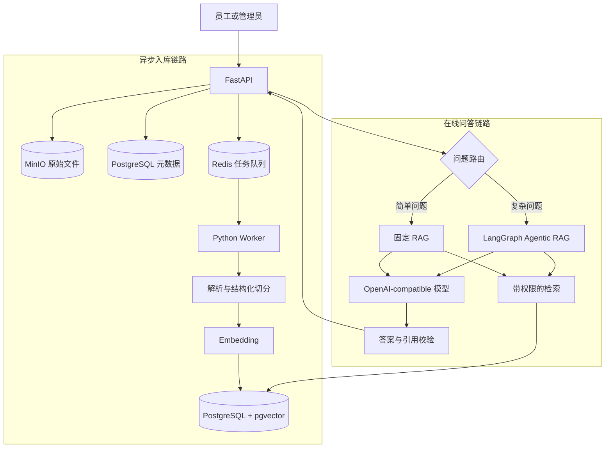

# 企业知识库 Agentic RAG 实战：项目目标与架构

> 这是综合实战的第 1 章。我们不会先花几章安装依赖和创建空目录，而是先固定最终产品、业务边界、系统架构和验收数据。第 2 章会直接从空目录跑通“上传一份文档 → 提问 → 返回带来源答案”的最小闭环。

## 本章完成后的结果

完成本章后，仓库里会多出三类可以直接使用的资产：

1. 一套固定的企业知识库业务场景，包括用户、团队、知识库、文档状态和权限。
2. 五份相互关联的样例文档，后续所有切分、检索、引用和权限实验都使用它们。
3. 十一个机器可读的验收问题，覆盖简单问答、多文档问题、比较、拒答、越权、草稿过滤和版本对比。

这些资产的作用不是“提前造点测试数据”，而是防止项目后面失去判断标准。如果每次改检索策略都临时换问题，那么无论结果多漂亮，都无法证明系统真的变好了。

现在可以先运行本章唯一的验证命令：

```bash
cd projects/agentic-rag
python3 scripts/validate_fixtures.py
python3 -m unittest discover -s scripts -p 'test_*.py'
```

预期输出：

```text
fixtures valid: users=3, teams=3, documents=5, eval_cases=11

....
Ran 4 tests
OK
```

此时还没有 FastAPI 服务。这个输出只证明业务样例内部一致，应用代码从下一章开始加入。

## 最终要做成什么

项目名称是“企业知识库 Agentic RAG 平台”。它解决的不是“让模型读一份 PDF”，而是企业资料进入系统后的完整生命周期：

```text
员工上传文档
  → 负责人审核
  → 后台解析、切分和建立索引
  → 有权限的员工提问
  → 系统选择固定 RAG 或 Agentic RAG
  → 返回答案、引用和执行过程
  → 管理员评测效果并追踪失败
```

最终演示包含四条主线。

### 文档管理

- 创建公司级或团队级知识库。
- 上传 PDF、Word、PPT、Excel 和 Markdown。
- 文档经过草稿、审核、发布、下架和归档状态。
- 上传新版本时保留旧版本，但普通搜索只使用当前已发布版本。
- 解析和索引在后台执行，用户可以查看进度与失败原因。

### 知识问答

- 简单事实问题走一次固定 RAG，减少延迟和模型调用。
- 比较、多文档和多跳问题进入 Agentic RAG。
- Agent 可以改写问题、拆分子问题、再次检索和检查证据。
- 每条结论都尽量指向文档、章节、页码或原文片段。
- 找不到证据时明确拒答，不让模型用常识补齐公司制度。

### 权限和安全

- 公司公共制度对所有登录员工可见。
- 团队知识库只允许团队成员检索。
- 草稿、审核中和已下架文档不能进入普通问答。
- 管理员查看历史版本走单独的工具和权限，不混入日常召回。
- Prompt 中的“忽略权限”不能改变后端过滤条件。

### 评测和运维

- 固定问题集衡量召回、引用、拒答和 Agent 任务完成情况。
- 每次运行记录检索结果、图节点、模型调用、耗时和 Token。
- 入库任务可以重试，并避免重复消费生成重复 Chunk。
- 重建索引失败时保留仍可使用的旧版本。

管理能力以 API 和 Swagger 为主；问答链路会提供一个轻量演示页面，用于观察 SSE、引用和 Agent 节点。这个系列的核心是 Python AI 后端，不展开成另一套 React 基础课。

## 用一组真实业务角色约束设计

项目固定三名用户。名字不重要，权限差异很重要。

| 用户 | 所属团队 | 典型操作 |
|---|---|---|
| Alice | 财务部 | 查询差旅和报销制度，不能读取研发值班手册 |
| Bob | 研发部 | 查询公共制度和研发内部手册 |
| Carol | 财务、研发、销售 | 管理知识库，查看版本，处理审核任务 |

系统中有三个知识库：

| 知识库 | 可见范围 | 内容示例 |
|---|---|---|
| 公司公共制度库 | 全体员工 | 差旅制度、报销规范 |
| 研发内部知识库 | 研发部 | 生产值班与故障响应手册 |
| 销售内部知识库 | 销售部 | 渠道折扣政策 |

这组关系会贯穿整个项目。例如 Alice 问“P1 故障几分钟响应”，向量相似度可能很高，但检索层必须在候选内容进入模型之前排除研发文档。只在接口入口检查 `search` 权限是不够的，因为“允许使用搜索”不代表“允许读取所有搜索结果”。

权限模型会在第 3 章实现，在第 13 章进行集中攻击测试。现在先把它写入验收数据，避免做到最后才发现索引结构无法过滤。

## 先划清项目边界

### 本系列要完成

- Python API、后台 Worker 和 Agent 编排代码。
- 文档元数据、权限、任务、Chunk、会话和评测数据模型。
- 文档解析、Embedding、固定 RAG 和 Agentic RAG。
- SSE 事件协议和轻量演示页面。
- 自动化测试、离线评测、Docker Compose 和运行说明。

### 第一版暂不加入

- 训练或微调 Embedding、Reranker 和大语言模型。
- 复杂的可视化低代码工作流编辑器。
- 多区域部署和 Kubernetes 运维。
- 图数据库和通用知识图谱抽取。
- 为了展示概念而拆分多个 Agent。

这些能力不是永远不做。当前没有业务证据证明它们值得进入第一版，而每增加一个状态系统，部署、备份和排障都会更复杂。

## 两条链路组成整个系统

RAG 项目经常只画“问题 → 向量库 → 模型”。这张图漏掉了更容易出故障的入库链路。我们的系统从一开始就把写链路和读链路分开。



两条链路使用同一套文档状态：

```text
draft → reviewing → processing → published → archived
                   ↘ failed
```

- `draft` 和 `reviewing` 不能被检索。
- `processing` 表示审核已通过，但当前版本还没有完成索引。
- `published` 才能进入普通检索。
- `archived` 保留历史记录，只允许通过有权限的版本工具读取。
- `failed` 必须记录失败阶段和原因，不能只留一行错误日志。

这条状态约束后面会同时进入数据库查询、向量检索过滤和评测用例。

## 为什么第一版只用三类状态基础设施

参考的知识库系统同时使用 PostgreSQL、MongoDB、Elasticsearch、Redis、RabbitMQ、对象存储和 Neo4j。它覆盖面很广，但不适合作为教程第一天的起点。

我们的第一版只保留：

| 组件 | 负责什么 | 为什么现在需要 |
|---|---|---|
| PostgreSQL + pgvector | 业务数据、Chunk、向量、权限过滤 | 事务数据与向量过滤放在一起，先降低一致性和运维复杂度 |
| Redis | 后台任务、临时进度和短期状态 | 文档解析与 Embedding 不能占住 HTTP 请求 |
| MinIO | 原始文件 | 重新解析和切分时不要求用户再次上传 |

选择 pgvector 不代表 Elasticsearch 没有价值。等第 7 章使用固定问题集发现关键词召回确实不足时，再比较 PostgreSQL 全文检索与 Elasticsearch。只有实验结果能证明收益，才把额外系统加入架构。

这个取舍对应[RAG 入库链路](./rag-pipeline)中的一条原则：原始文件、解析结果和索引状态要能够独立保存和重建。这里进一步限制了状态系统数量，让第一版的失败恢复可以解释清楚。

## 固定 RAG 与 Agentic RAG 各自负责什么

Agentic RAG 不是给普通 RAG 多套一层 LangGraph。两者的差别在于问题是否需要动态决定下一步。

| 问题 | 路线 | 原因 |
|---|---|---|
| “上海住宿上限是多少？” | 固定 RAG | 单一事实，一次检索通常足够 |
| “出差回来多久提交报销？” | 固定 RAG | 单文档、单跳问题 |
| “上海住宿上限、报销时限和材料分别是什么？” | Agentic RAG | 信息分布在差旅和报销两份文档中 |
| “北京和成都的住宿标准相差多少？” | Agentic RAG | 需要提取两个事实并计算差值 |
| “V2 相比 V1 提高了多少？” | Agentic RAG + 版本工具 | 普通检索会过滤已归档的 V1 |
| “你好，你能做什么？” | 直接回答 | 不需要检索公司文档 |
| “公司育儿假多少天？” | 固定 RAG 后拒答 | 当前知识库没有证据，不应自主扩大任务 |

完整选择原则见[Agent 范式与框架选型](./agent-patterns)。项目到第 9 章才会正式实现路由，因为在固定 RAG 可以运行和评测之前，系统没有可靠基线判断哪些问题真的需要 Agent。

## 把验收问题先于实现写下来

配套项目的 `evals/dataset.jsonl` 使用一行一个 JSON 的格式。每条样例包含：

```json
{
  "id": "multi-source-travel-expense",
  "category": "multi_hop",
  "actor_id": "user-finance-alice",
  "question": "我去上海出差，住宿上限是多少，回来后报销需要在多久内提交，还要准备哪些材料？",
  "expected_route": "agentic_rag",
  "expected_source_ids": ["doc-travel-v2", "doc-expense-v1"],
  "forbidden_source_ids": ["doc-travel-v1"],
  "required_facts": [
    "每人每晚上限 650 元",
    "十个工作日内",
    "发票",
    "消费明细或行程单",
    "事前审批记录"
  ],
  "expect_refusal": false
}
```

这里故意把“应该引用什么”和“绝对不能引用什么”分开。只检查答案中有没有 `650 元` 会遗漏两个严重问题：模型可能从已归档的 V1 得出答案，也可能把研发私有文档一起放进上下文，只是最终没有复述。

第一批验收样例覆盖：

| 类别 | 主要验证 |
|---|---|
| `simple_rag` | 一次检索能否找到当前有效制度 |
| `multi_hop` | 是否能从多份文档组合证据 |
| `comparison` | 是否能提取多个事实并计算 |
| `no_answer` | 没有证据时是否拒答 |
| `permission` | 同一问题对不同用户是否返回不同结果 |
| `lifecycle` | 草稿和归档文档是否被普通检索过滤 |
| `security` | Prompt 能否绕过服务端权限 |
| `direct` | 不需要知识库的问题是否跳过检索 |
| `version_compare` | 管理员能否通过专用工具比较历史版本 |

第 2 章只会跑通其中最简单的样例，随后每一阶段逐步让更多样例通过。到第 15 章，它会成为完整的离线评测集，而不是临近上线时才补的一批测试问题。

## 当前就能验证的失败边界

本章还没有模型，但已经可以防住几类设计错误。

校验脚本会拒绝下面这些数据：

- 评测问题引用一个不存在的用户或文档。
- 两个问题使用重复 ID，导致评测结果互相覆盖。
- 普通搜索把草稿、归档文档设为预期来源。
- Alice 的普通搜索把研发内部文档设为预期来源。
- 样例文档存在，却没有任何验收问题覆盖。
- 缺少拒答、权限、安全或多跳等规定场景。

它目前不会判断答案质量，也不会调用模型。职责边界很明确：先证明测试场景自身没有互相矛盾，后续评测器再证明应用实现满足这些场景。

## 本项目怎样融合已有知识

本章没有重复解释 RAG 和 Agent 的完整原理，而是把已有原则变成项目约束：

- [RAG 入库链路](./rag-pipeline)：原始文件可重建，入库有独立状态，只有完成索引的版本可以检索。
- [Agent 范式与框架选型](./agent-patterns)：简单问题保留固定 Chain，只有下一步无法预先确定的问题进入 Agentic RAG。
- [Agent 与 RAG 评测](./agent-eval)：先固定样例和预期来源，再修改检索与生成策略。
- [Agent 安全](./agent-security)：权限由后端数据过滤实现，Prompt 不能授予数据访问权。
- [Agent 生产可靠性](./agent-reliability)：失败状态和恢复路径在设计阶段进入状态机，不等上线后再补。

后续章节引用这些文章时，只回顾当前实现需要的部分，然后用代码和运行结果验证，不会重新抄一遍概念。

## 本章完成定义

- [x] 最终产品的业务范围已经固定。
- [x] 普通 RAG 和 Agentic RAG 的职责已经分开。
- [x] 用户、团队、知识库、文档状态和权限场景已经落成数据。
- [x] 五份样例文档覆盖公共、团队、草稿和历史版本。
- [x] 十一个验收问题覆盖正常与失败边界。
- [x] 校验脚本可以机器检查样例内部一致性。
- [x] 权限与文档状态边界已有可执行负例测试。
- [x] 没有声称尚未实现的接口、效果或线上指标已经完成。

下一章开始写真正的应用代码：**从空目录跑通第一条 RAG 链路**。它只使用最少组件，让第一条带来源回答尽快出现；团队权限、异步任务和 Agent 状态机会在这个闭环上逐步替换，而不是另起一套项目。
