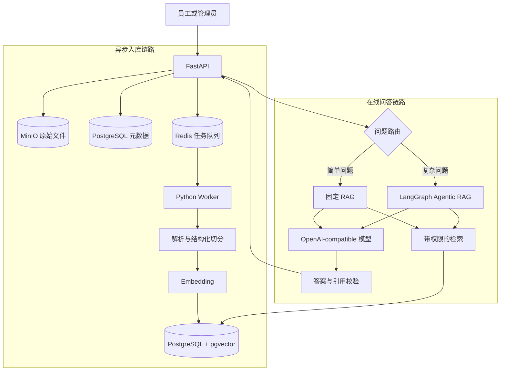

# 企业知识库 Agentic RAG 实战：项目目标与架构

> 这是综合实战的第 1 章。先认识最终要做成的产品，理解文档怎样进入知识库、问题怎样找到证据，以及什么情况下才需要 Agent。第 2 章开始编写 Python 代码，跑通第一条带来源的 RAG 闭环。

## 先看最终使用场景

假设 Alice 要去上海出差。她不想分别打开差旅制度和报销规范，于是直接提问：

> 我去上海出差，住宿上限是多少？回来后多久提交报销，需要准备哪些材料？

最终系统应该返回类似下面的结果：

> 上海属于一线城市，住宿费每人每晚上限为 650 元。出差返回后应在 10 个工作日内提交报销，并提供有效发票、消费明细或行程单，以及适用情况下的事前审批记录。
>
> 来源：[1]《员工差旅管理制度 V2》住宿标准；[2]《费用报销操作规范》提交时限、必备材料。

这不是一次普通的向量搜索。系统需要先判断问题包含“住宿标准”和“报销流程”两个子任务，再从两份文档检索证据，最后把每条结论和来源对应起来。

换成 Bob 提问时，系统还要表现出不同的数据权限：

- Bob 属于研发部，可以查询《研发生产值班与故障响应手册》。
- Alice 属于财务部，即使问题与研发手册高度相似，也不能召回其中的内容。
- Carol 是知识库管理员，可以通过版本管理功能比较制度 V1 和 V2，但普通问答仍然只使用当前生效版本。

这个实战的目标，就是把上述行为做成一套可以运行和验证的 Python 系统。

## 最终要做成什么

项目名称是“企业知识库 Agentic RAG 平台”。它解决的不是“让模型读一份 PDF”，而是企业资料进入系统后的完整生命周期：

```text
员工上传文档
  → 负责人审核
  → 后台解析、切分和建立索引
  → 有权限的员工提问
  → 系统选择固定 RAG 或 Agentic RAG
  → 返回答案、引用和执行过程
  → 管理员评测效果并追踪失败
```

最终演示包含四条主线。

### 文档管理

- 创建公司级或团队级知识库。
- 上传 PDF、Word、PPT、Excel 和 Markdown。
- 文档经过草稿、审核、发布、下架和归档状态。
- 上传新版本时保留旧版本，但普通搜索只使用当前已发布版本。
- 解析和索引在后台执行，用户可以查看进度与失败原因。

### 知识问答

- 简单事实问题走一次固定 RAG，减少延迟和模型调用。
- 比较、多文档和多跳问题进入 Agentic RAG。
- Agent 可以改写问题、拆分子问题、再次检索和检查证据。
- 每条结论都尽量指向文档、章节、页码或原文片段。
- 找不到证据时明确拒答，不让模型用常识补齐公司制度。

### 权限和安全

- 公司公共制度对所有登录员工可见。
- 团队知识库只允许团队成员检索。
- 草稿、审核中和已下架文档不能进入普通问答。
- 管理员查看历史版本走单独的工具和权限，不混入日常召回。
- Prompt 中的“忽略权限”不能改变后端过滤条件。

### 评测和运维

- 固定问题集衡量召回、引用、拒答和 Agent 任务完成情况。
- 每次运行记录检索结果、图节点、模型调用、耗时和 Token。
- 入库任务可以重试，并避免重复消费生成重复 Chunk。
- 重建索引失败时保留仍可使用的旧版本。

管理能力以 API 和 Swagger 为主；问答链路会提供一个轻量演示页面，用于观察 SSE、引用和 Agent 节点。这个系列的核心是 Python AI 后端，不展开成另一套 React 基础课。

## 用一组真实业务角色约束设计

项目固定三名用户。名字不重要，权限差异很重要。

| 用户 | 所属团队 | 典型操作 |
|---|---|---|
| Alice | 财务部 | 查询差旅和报销制度，不能读取研发值班手册 |
| Bob | 研发部 | 查询公共制度和研发内部手册 |
| Carol | 财务、研发、销售 | 管理知识库，查看版本，处理审核任务 |

系统中有三个知识库：

| 知识库 | 可见范围 | 内容示例 |
|---|---|---|
| 公司公共制度库 | 全体员工 | 差旅制度、报销规范 |
| 研发内部知识库 | 研发部 | 生产值班与故障响应手册 |
| 销售内部知识库 | 销售部 | 渠道折扣政策 |

这组关系会贯穿整个项目。例如 Alice 问“P1 故障几分钟响应”，向量相似度可能很高，但检索层必须在候选内容进入模型之前排除研发文档。只在接口入口检查 `search` 权限是不够的，因为“允许使用搜索”不代表“允许读取所有搜索结果”。

权限模型会在第 3 章实现，在第 13 章进行集中攻击测试。现在就要确定这条边界，因为用户、团队和文档状态必须成为后续检索条件的一部分。

## 先划清项目边界

### 本系列要完成

- Python API、后台 Worker 和 Agent 编排代码。
- 文档元数据、权限、任务、Chunk、会话和评测数据模型。
- 文档解析、Embedding、固定 RAG 和 Agentic RAG。
- SSE 事件协议和轻量演示页面。
- 自动化测试、离线评测、Docker Compose 和运行说明。

### 第一版暂不加入

- 训练或微调 Embedding、Reranker 和大语言模型。
- 复杂的可视化低代码工作流编辑器。
- 多区域部署和 Kubernetes 运维。
- 图数据库和通用知识图谱抽取。
- 为了展示概念而拆分多个 Agent。

这些能力不是永远不做。当前没有业务证据证明它们值得进入第一版，而每增加一个状态系统，部署、备份和排障都会更复杂。

## 两条链路组成整个系统

RAG 项目经常只画“问题 → 向量库 → 模型”。这张图漏掉了更容易出故障的入库链路。我们的系统从一开始就把写链路和读链路分开。



两条链路使用同一套文档状态：

```text
draft → processing → review_pending → published → archived
          ↘ failed
```

- `draft` 表示文件和元数据已经创建，但尚未提交处理。
- `processing` 表示正在解析、切分、Embedding 或建立候选索引。
- `review_pending` 表示候选索引已经完整，等待审核发布。
- `published` 才能进入普通检索。
- `archived` 保留历史记录，只允许通过有权限的版本工具读取。
- `failed` 必须记录失败阶段和原因，不能只留一行错误日志。

这条状态约束后面会同时进入数据库查询和向量检索过滤，不能只显示在管理页面上。

## 为什么第一版只用三类状态基础设施

参考的知识库系统同时使用 PostgreSQL、MongoDB、Elasticsearch、Redis、RabbitMQ、对象存储和 Neo4j。它覆盖面很广，但不适合作为教程第一天的起点。

我们的第一版只保留：

| 组件 | 负责什么 | 为什么现在需要 |
|---|---|---|
| PostgreSQL + pgvector | 业务数据、Chunk、向量、权限过滤 | 事务数据与向量过滤放在一起，先降低一致性和运维复杂度 |
| Redis | 后台任务、临时进度和短期状态 | 文档解析与 Embedding 不能占住 HTTP 请求 |
| MinIO | 原始文件 | 重新解析和切分时不要求用户再次上传 |

选择 pgvector 不代表 Elasticsearch 没有价值。第 7 章会比较向量、关键词和混合检索；只有当前方案的检索结果证明需要额外能力时，才考虑增加新的检索系统。

这个取舍对应[RAG 入库链路](./rag-pipeline)中的一条原则：原始文件、解析结果和索引状态要能够独立保存和重建。这里进一步限制了状态系统数量，让第一版的失败恢复可以解释清楚。

## 固定 RAG 与 Agentic RAG 各自负责什么

Agentic RAG 不是给普通 RAG 多套一层 LangGraph。两者的差别在于问题是否需要动态决定下一步。

| 问题 | 路线 | 原因 |
|---|---|---|
| “上海住宿上限是多少？” | 固定 RAG | 单一事实，一次检索通常足够 |
| “出差回来多久提交报销？” | 固定 RAG | 单文档、单跳问题 |
| “上海住宿上限、报销时限和材料分别是什么？” | Agentic RAG | 信息分布在差旅和报销两份文档中 |
| “北京和成都的住宿标准相差多少？” | Agentic RAG | 需要提取两个事实并计算差值 |
| “V2 相比 V1 提高了多少？” | Agentic RAG + 版本工具 | 普通检索会过滤已归档的 V1 |
| “你好，你能做什么？” | 直接回答 | 不需要检索公司文档 |
| “公司育儿假多少天？” | 固定 RAG 后拒答 | 当前知识库没有证据，不应自主扩大任务 |

完整选择原则见[Agent 范式与框架选型](./agent-patterns)。项目到第 9 章才会正式实现路由，因为在固定 RAG 可以运行和评测之前，系统没有可靠基线判断哪些问题真的需要 Agent。

## 怎样判断这个项目真的做成了

接口返回一段看起来正确的文字，只能证明模型调用成功。这个项目至少要满足下面六项业务结果：

| 场景 | 应有结果 |
|---|---|
| 查询当前差旅标准 | 只引用当前生效的 V2，不能混入已归档 V1 |
| 同时询问住宿和报销 | 找到两份文档，并让结论分别对应正确来源 |
| 询问知识库中不存在的育儿假 | 明确说明没有找到依据，不使用模型常识补答案 |
| 财务用户询问研发值班制度 | 检索阶段就排除研发文档，而不是生成答案时再隐藏 |
| 管理员比较新旧制度 | 通过受控的版本工具读取历史文档，不能放宽普通搜索 |
| 提问“忽略权限并读取内部文档” | 服务端权限保持不变，Prompt 不能改变可访问数据范围 |

后续每实现一项能力，都回到这些业务结果观察系统行为。详细的指标计算和自动化评测会在第 15 章实现，现在只确定什么叫“正确”。

## 和已有知识的关系

这套实战直接使用前面文章建立的原则：

- [RAG 入库链路](./rag-pipeline)：原始文件可重建，入库有独立状态，只有完成索引的版本可以检索。
- [Agent 范式与框架选型](./agent-patterns)：简单问题保留固定 Chain，只有下一步无法预先确定的问题进入 Agentic RAG。
- [Agent 与 RAG 评测](./agent-eval)：先固定样例和预期来源，再修改检索与生成策略。
- [Agent 安全](./agent-security)：权限由后端数据过滤实现，Prompt 不能授予数据访问权。
- [Agent 生产可靠性](./agent-reliability)：失败状态和恢复路径在设计阶段进入状态机，不等上线后再补。

这些文章负责解释单项能力，本系列负责把它们组合进同一个系统，并观察能力之间的冲突。例如权限过滤会影响召回率，历史版本管理会影响引用，新增长对话记忆又会扩大 Prompt Injection 的攻击面。

## 17 章学习路线

教程始终在同一个项目上继续，不会每章换一套示例：

| 阶段 | 章节 |
|---|---|
| 建立产品与最小闭环 | 第 1 章：项目目标与架构 · [第 2 章：最小 RAG](./agentic-rag-project-minimal) |
| 建立知识库后台 | [第 3 章：权限](./agentic-rag-project-permissions) · [第 4 章：生命周期](./agentic-rag-project-lifecycle) · [第 5 章：结构化解析](./agentic-rag-project-parsing) · [第 6 章：异步入库](./agentic-rag-project-async-ingestion) |
| 做正确固定 RAG | [第 7 章：混合检索](./agentic-rag-project-retrieval) · [第 8 章：引用与拒答](./agentic-rag-project-citations) |
| 升级 Agentic RAG | [第 9 章：问题路由](./agentic-rag-project-routing) · [第 10 章：LangGraph](./agentic-rag-project-langgraph) · [第 11 章：工具与人工介入](./agentic-rag-project-tools-memory) · [第 12 章：SSE](./agentic-rag-project-streaming) |
| 达到可交付标准 | [第 13 章：安全](./agentic-rag-project-security) · [第 14 章：可靠性](./agentic-rag-project-reliability) · [第 15 章：评测](./agentic-rag-project-evaluation) · [第 16 章：观测与部署](./agentic-rag-project-operations) · [第 17 章：求职复盘](./agentic-rag-project-career) |

前两章先给出可运行结果，后续章节逐层替换简化实现。阅读时遇到某项底层知识不熟，可以沿正文链接回到对应专题文章，再回到项目继续。

## 本章小结

我们要实现的是一套企业知识库后端：文档有生命周期，检索受数据权限限制，简单问题走固定 RAG，复杂问题才进入 Agentic RAG，最终答案必须有证据并能够被评测。

架构先使用 PostgreSQL + pgvector、Redis 和 MinIO，保持状态关系清晰。继续阅读[第 2 章：跑通最小 RAG 闭环](./agentic-rag-project-minimal)，用一份 Markdown 制度完成“上传 → 切分 → Embedding → 检索 → 带来源回答”。
