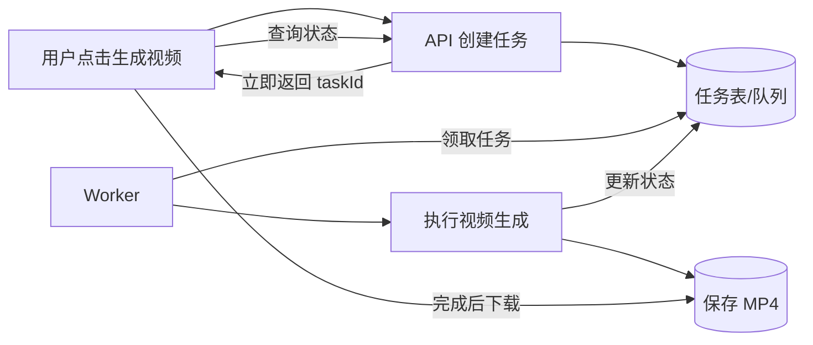
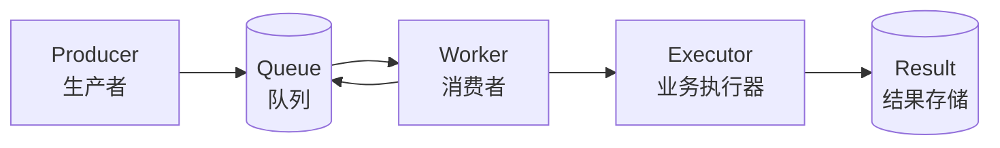
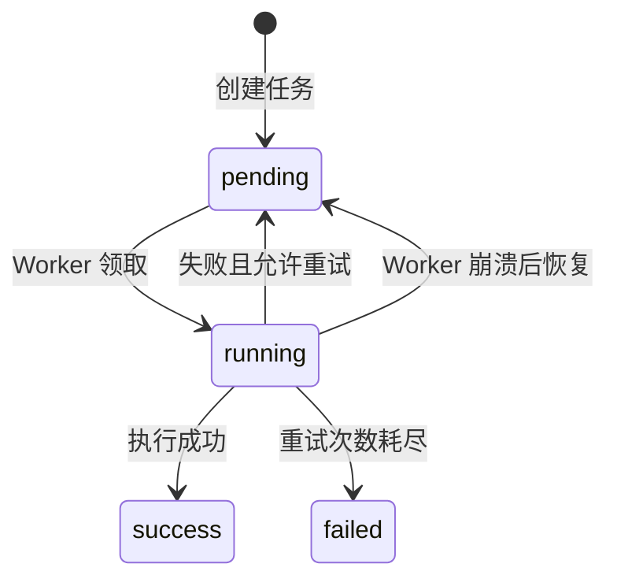
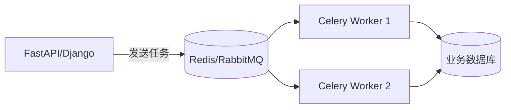

# 从视频导出超时，理解 Worker 与异步任务

> Worker 不是什么神秘组件。它本质上是一个长期运行的后台消费者：不断领取任务、执行任务、记录结果。真正困难的不是写出循环，而是让任务在并发、失败和重启之后仍然正确。

## 先看一个真实问题

假设系统支持把网页录屏生成 MP4。

最直接的实现是：

```txt
用户点击“导出视频”
  → 浏览器提交录屏数据
  → 后端启动 Chromium 回放
  → 持续截图
  → FFmpeg 合成 MP4
  → 后端返回视频
  → 浏览器下载
```

如果视频需要十分钟才能生成，这个 HTTP 请求也要保持十分钟。

于是会出现：

- 页面按钮一直转圈。
- Nginx、网关或浏览器可能超时。
- 用户刷新或关闭页面后，下载链路中断。
- 多人同时导出时，每个请求都启动 Chromium 和 FFmpeg。
- 为了“不超时”不断调大超时时间，但问题并没有消失。

把 Nginx 超时从 60 秒改成 30 分钟，只是让同步请求等待得更久。

更合理的流程是：



用户请求只负责“登记任务”，Worker 负责“真正干活”。

## Worker 到底是什么

可以把整个系统想象成一家餐厅：

| 软件系统 | 餐厅 |
|---|---|
| 用户请求 | 顾客下单 |
| API | 前台服务员 |
| 任务队列 | 订单小票 |
| Worker | 后厨工作人员 |
| 任务执行结果 | 做好的菜 |

API 收到请求后，不自己去厨房做菜，而是生成一张订单。

Worker 一直做四件事：

```txt
领取一张订单
  → 标记为处理中
  → 执行业务
  → 记录成功或失败
```

最简化的伪代码只有一个循环：

```python
while service_is_running:
    task = claim_next_task()

    if task is None:
        sleep(2)
        continue

    try:
        mark_running(task)
        execute(task)
        mark_success(task)
    except Exception as error:
        mark_failed(task, error)
```

所谓“自动调度”，并不是系统产生了意识，而是：

1. 应用启动时，框架自动启动 Worker。
2. Worker 进入长期循环。
3. Worker 定期查询队列。
4. 有任务就执行，没有任务就等待。

应用停止，Worker 也会停止。它不是永远存在的魔法进程。

## 异步函数不等于异步任务

这是最容易混淆的地方。

下面的接口虽然使用了 `async/await`，但用户仍然要等视频生成：

```python
@app.post("/exports")
async def export_video():
    video = await generate_video()
    return Response(video, media_type="video/mp4")
```

`async/await` 主要解决线程等待 I/O 时的利用率问题，不会自动把工作转移到另一个后台任务中。

真正的异步任务是：

```python
@app.post("/export-tasks")
async def create_export_task():
    task = await task_repository.create(status="pending")
    return {"task_id": task.id, "status": task.status}
```

API 已经返回，但 Worker 仍在另一个执行路径中处理任务。

```txt
async/await：
  当前请求仍然等待结果

后台任务：
  当前请求先结束
  任务由 Worker 独立执行
```

## 一个完整任务系统有哪些角色



### Producer：生产者

创建任务的一方，通常是 API：

```txt
POST /video-export-tasks
→ 创建一条 pending 任务
→ 返回 taskId
```

### Queue：队列

保存尚未处理的任务。

它可以是：

- PostgreSQL/MySQL 任务表。
- Redis。
- RabbitMQ。
- Kafka。
- 云厂商的消息队列。

“队列”是一种职责，不一定是一款独立中间件。

### Worker：消费者

不断领取任务并调用业务执行器。

### Executor：执行器

真正完成业务：

- 生成视频。
- 解析 PDF。
- 发送邮件。
- 生成 Excel。
- 调用 AI 模型。
- 批量同步数据。

### Result：结果

结果可能保存在：

- 数据库状态字段。
- 本地磁盘。
- 对象存储。
- 业务表。

大型文件不要直接塞进 Redis。Redis 更适合保存任务调度信息，MP4、Excel、PDF 应保存在磁盘或对象存储。

## 数据库也能当任务队列

如果任务量不大、只有一台 Worker，没必要一开始就引入 Redis。

一张任务表已经可以完成：

- 持久化任务。
- 按创建时间排队。
- 保存状态。
- 控制重复提交。
- 失败重试。
- 服务重启恢复。

一个简化的 PostgreSQL 表：

```sql
CREATE TABLE background_task (
    id uuid PRIMARY KEY,
    task_type varchar(50) NOT NULL,
    business_key varchar(100) NOT NULL,
    status varchar(20) NOT NULL,
    payload jsonb,
    result jsonb,
    error_message varchar(2000),
    retry_count integer NOT NULL DEFAULT 0,
    max_retry_count integer NOT NULL DEFAULT 1,
    worker_id varchar(100),
    created_at timestamptz NOT NULL DEFAULT now(),
    started_at timestamptz,
    heartbeat_at timestamptz,
    finished_at timestamptz,
    updated_at timestamptz NOT NULL DEFAULT now(),
    CONSTRAINT ck_background_task_status
        CHECK (status IN ('pending', 'running', 'success', 'failed'))
);

CREATE INDEX ix_background_task_pending
ON background_task (created_at)
WHERE status = 'pending';
```

典型状态流转：



## 不能先 SELECT，再慢慢 UPDATE

下面的代码在只有一个 Worker 时似乎没问题：

```python
task = await db.fetch_one(
    "SELECT * FROM background_task WHERE status = 'pending' LIMIT 1"
)

await db.execute(
    "UPDATE background_task SET status = 'running' WHERE id = :id",
    {"id": task["id"]},
)
```

如果两个 Worker 同时查询，它们可能拿到同一条任务。

```txt
Worker A：查到任务 100
Worker B：也查到任务 100
Worker A：开始执行
Worker B：也开始执行
```

发送两封重复邮件可能只是尴尬，重复扣款就是事故。

PostgreSQL 可以使用 `FOR UPDATE SKIP LOCKED` 原子领取：

```sql
WITH next_task AS (
    SELECT id
    FROM background_task
    WHERE status = 'pending'
    ORDER BY created_at
    FOR UPDATE SKIP LOCKED
    LIMIT 1
)
UPDATE background_task AS task
SET status = 'running',
    worker_id = :worker_id,
    started_at = COALESCE(started_at, now()),
    heartbeat_at = now(),
    updated_at = now()
FROM next_task
WHERE task.id = next_task.id
RETURNING task.*;
```

`SKIP LOCKED` 的含义是：

- 某条任务已被其他事务锁定，就跳过它。
- 不等待另一名 Worker。
- 不重复领取同一任务。

即使现在只有一个 Worker，也建议把领取动作设计正确，为未来扩容留出空间。

## 并发上限是怎么实现的

如果 Worker 每次只领取一条任务，并且等待它完成后再领取下一条，并发就是 1：

```python
while True:
    task = await claim_next_task()
    if task is None:
        await asyncio.sleep(2)
        continue

    await execute_task(task)
```

五个用户同时提交视频任务：

```txt
任务 A：running
任务 B：pending
任务 C：pending
任务 D：pending
任务 E：pending
```

A 完成后才执行 B。

这对 Chromium、FFmpeg、图片处理和模型推理非常重要，因为它们会大量消耗 CPU、内存或显存。

并发不是越大越好：

| 任务类型 | 并发策略 |
|---|---|
| 等待 HTTP、数据库等 I/O | 可以适当提高并发 |
| Chromium、FFmpeg、图片处理 | 从 1～2 开始压测 |
| CPU 密集计算 | 使用独立进程并限制进程数 |
| GPU 推理 | 根据显存和模型实例严格限制 |

## .NET：使用 BackgroundService

.NET 的 `BackgroundService` 是实现应用内 Worker 的直接方式。

先注册：

```csharp
builder.Services.AddHostedService<VideoExportWorker>();
```

然后实现后台循环：

```csharp
public sealed class VideoExportWorker : BackgroundService
{
    private readonly IServiceScopeFactory _scopeFactory;
    private readonly ILogger<VideoExportWorker> _logger;

    public VideoExportWorker(
        IServiceScopeFactory scopeFactory,
        ILogger<VideoExportWorker> logger)
    {
        _scopeFactory = scopeFactory;
        _logger = logger;
    }

    protected override async Task ExecuteAsync(
        CancellationToken stoppingToken)
    {
        using var timer = new PeriodicTimer(TimeSpan.FromSeconds(2));

        while (!stoppingToken.IsCancellationRequested)
        {
            try
            {
                await ProcessOneTask(stoppingToken);
            }
            catch (OperationCanceledException)
                when (stoppingToken.IsCancellationRequested)
            {
                break;
            }
            catch (Exception ex)
            {
                _logger.LogError(ex, "Worker loop failed");
            }

            await timer.WaitForNextTickAsync(stoppingToken);
        }
    }

    private async Task ProcessOneTask(
        CancellationToken cancellationToken)
    {
        await using var scope = _scopeFactory.CreateAsyncScope();
        var processor = scope.ServiceProvider
            .GetRequiredService<VideoExportProcessor>();

        await processor.ProcessNextAsync(cancellationToken);
    }
}
```

为什么每次要创建 Scope？

`BackgroundService` 本身通常作为单例运行，而数据库上下文一般是 Scoped 生命周期。长期持有同一个数据库上下文会带来连接、缓存和并发问题，因此每轮工作创建独立 Scope。

这个方案的特点：

- 不需要 Redis。
- Worker 跟随 Web API 一起启动和停止。
- 部署简单。
- API 停止时，Worker 也停止。
- 适合单机、低频任务。

如果希望 API 和 Worker 独立扩容，可以把同一个 Processor 放进独立的 .NET Worker Service 进程。

## Python：先写一个数据库 Worker

Python 不使用 Celery，也能实现 Worker：

```python
import asyncio
import logging

logger = logging.getLogger(__name__)


async def worker_loop(repository, processor, stop_event):
    while not stop_event.is_set():
        task = await repository.claim_next()

        if task is None:
            await asyncio.sleep(2)
            continue

        try:
            await processor.execute(task)
            await repository.mark_success(task.id)
        except asyncio.CancelledError:
            raise
        except Exception as exc:
            logger.exception("task failed", extra={"task_id": task.id})
            await repository.mark_failed_or_retry(task.id, str(exc))
```

FastAPI 可以在 lifespan 中启动它：

```python
from contextlib import asynccontextmanager
import asyncio

from fastapi import FastAPI


@asynccontextmanager
async def lifespan(app: FastAPI):
    stop_event = asyncio.Event()
    worker = asyncio.create_task(
        worker_loop(repository, processor, stop_event)
    )

    yield

    stop_event.set()
    await worker


app = FastAPI(lifespan=lifespan)
```

这仍然是“应用内 Worker”：

- FastAPI 进程启动，Worker 启动。
- FastAPI 进程停止，Worker 停止。
- 如果启动多个 Web 进程，必须依赖数据库原子领取，防止重复处理。

## Python：什么时候使用 Celery

Celery 是 Python 生态中成熟的分布式任务队列。

典型架构：



一个简化示例：

```python
from celery import Celery

app = Celery(
    "tasks",
    broker="redis://127.0.0.1:6379/0",
    backend="redis://127.0.0.1:6379/1",
)


@app.task(
    bind=True,
    autoretry_for=(ConnectionError,),
    retry_backoff=True,
    retry_kwargs={"max_retries": 1},
)
def generate_video(self, task_id: str):
    task = load_business_task(task_id)

    try:
        mark_running(task_id)
        file_path = render_video(task.order_no)
        mark_success(task_id, file_path)
    except Exception as exc:
        mark_failed(task_id, str(exc))
        raise
```

API 投递任务：

```python
generate_video.delay(str(task.id))
```

启动一个并发数为 1 的 Worker：

```bash
celery -A tasks worker --loglevel=INFO --concurrency=1
```

Celery 帮你处理：

- Broker 消息收发。
- 多 Worker 消费。
- 重试和退避。
- 路由到不同队列。
- 定时任务。
- Worker 监控生态。

但业务状态仍建议保存在自己的任务表中。不要只依赖 Celery 的 result backend 来表达“视频是否还能下载”“文件何时过期”等业务语义。

## Node.js：什么时候使用 BullMQ

BullMQ 是 Node.js 常用的 Redis 任务队列。

创建队列并添加任务：

```ts
import { Queue } from 'bullmq'

const connection = {
  host: '127.0.0.1',
  port: 6379,
}

const videoQueue = new Queue('video-export', { connection })

await videoQueue.add(
  'generate',
  { taskId, orderNo },
  {
    jobId: taskId,
    attempts: 2,
    backoff: {
      type: 'exponential',
      delay: 1000,
    },
  },
)
```

启动 Worker：

```ts
import { Worker } from 'bullmq'

const worker = new Worker(
  'video-export',
  async job => {
    const { taskId, orderNo } = job.data

    await markRunning(taskId)
    const filePath = await generateVideo(orderNo)
    await markSuccess(taskId, filePath)
  },
  {
    connection,
    concurrency: 1,
  },
)

worker.on('failed', async (job, error) => {
  if (!job) return

  const maxAttempts = job.opts.attempts ?? 1

  if (job.attemptsMade >= maxAttempts) {
    await markFailed(job.data.taskId, error.message)
  } else {
    await markPendingForRetry(job.data.taskId, error.message)
  }
})
```

BullMQ 的 Queue 和 Worker 都连接 Redis：

```txt
API → BullMQ Queue → Redis → BullMQ Worker
```

视频生成属于资源密集任务。即使 BullMQ 支持很高的 I/O 并发，也不应该把 Chromium 和 FFmpeg 并发直接调到几十。应让 Worker 启动子进程执行，并从并发 1 开始压测。

## 三种实现怎么选

| 方案 | 基础设施 | 优点 | 局限 | 适合场景 |
|---|---|---|---|---|
| 数据库任务表 + 应用内 Worker | 现有数据库 | 简单、持久化、部署少 | API 与 Worker 同生命周期 | 单机、低频任务 |
| Celery | Redis/RabbitMQ | Python 生态成熟、分布式能力完整 | 多一个 Broker，部署更复杂 | Python 多 Worker、任务类型多 |
| BullMQ | Redis | Node 体验好、重试和调度完善 | 依赖 Redis | Node 分布式任务 |
| 独立 Worker Service | 数据库或 MQ | API 与任务执行独立扩容 | 多一个部署单元 | 长任务、资源隔离要求高 |

一个实用判断：

```txt
只有一台服务器、任务不多
  → 数据库任务表 + Worker

已经有 Redis，需要 Node 多 Worker
  → BullMQ

Python 项目，需要成熟分布式任务系统
  → Celery

任务执行会拖垮 API，需要独立资源限制
  → 独立 Worker 服务
```

不要因为“以后可能有很多任务”，一开始就部署完整分布式队列。先让复杂度和当前流量匹配。

## Worker 可靠性的七个关键点

### 1. 任务必须持久化

只把任务放在进程内数组里：

```js
const tasks = []
```

进程一重启，任务全部丢失。数据库、Redis 或消息队列的意义之一，就是让任务脱离进程内存。

### 2. 领取任务必须原子

多个 Worker 不能同时领取同一任务。使用：

- 数据库行锁或原子更新。
- 消息队列 ACK。
- 唯一约束。
- 分布式锁。

### 3. 任务处理必须幂等

多数队列追求的是“至少执行一次”，而不是绝对“只执行一次”。

任务可能因为 Worker 崩溃而被重新投递，因此执行器要能安全重试：

```txt
先检查目标文件是否已经生成
同一业务键使用唯一约束
外部调用携带幂等键
状态不是 pending 时拒绝重复执行
```

### 4. 区分可重试和不可重试错误

适合重试：

- 网络临时失败。
- 依赖服务短暂不可用。
- 数据库连接中断。

不适合重试：

- 输入文件不存在。
- 参数格式错误。
- events 为空。
- 业务权限不允许。

确定性错误重复一百次仍然会失败。

### 5. running 任务需要心跳

Worker 领取任务后突然断电，数据库会永远留下 `running`。

可以定期更新：

```txt
heartbeat_at = 当前时间
```

恢复程序发现心跳长时间未更新，就把任务重新设为 `pending` 或标记 `failed`。

### 6. 要支持优雅停止

服务收到停止信号时：

- 不再领取新任务。
- 给当前任务一定时间完成。
- 超时后安全终止子进程。
- 保留可恢复的任务状态。

### 7. 文件和临时资源必须清理

视频任务往往产生大量截图和临时文件：

```txt
任务成功 → 清理截图
任务失败 → 清理截图和 .part 文件
视频过期 → 清理 MP4
服务重启 → 扫描遗留临时文件
```

任务表解决状态问题，不会自动解决磁盘爆满。

## 前端应该怎么展示

后端可以有完整状态：

```txt
pending → running → success / failed
```

前端不一定要把所有技术状态暴露给用户。

视频生成场景可以简化为：

```txt
生成视频 → 生成中 → 下载视频
```

映射关系：

| 后端状态 | 前端展示 |
|---|---|
| 无任务 | 生成视频 |
| pending | 生成中 |
| running | 生成中 |
| success 且文件有效 | 下载视频 |
| failed 或文件过期 | 重新生成 |

用户离开页面后：

- Worker 继续执行。
- 页面停止轮询。
- 再次进入页面时重新查询任务表。
- 任务完成则显示“下载视频”。

不一定需要全局任务中心、强提醒、自动下载和精确进度条。低频功能先把状态恢复做好，比增加复杂交互更重要。

## 常见误区

### “把接口 timeout 调大就行”

只能缓解，不能解决页面断开、网络波动和多人并发。

### “用了 async/await 就不会阻塞用户”

只要接口还在等待最终结果，用户请求就没有结束。

### “用了队列就不会重复执行”

队列可能重新投递，消费者仍然需要幂等。

### “并发越高处理越快”

对 FFmpeg、Chromium 和模型推理来说，并发过高可能让所有任务一起变慢甚至崩溃。

### “Worker 一定要单独部署”

低频任务可以先使用应用内 Worker。需要资源隔离或独立扩容时再拆。

### “Redis 里可以保存视频”

任务消息只保存任务 ID 和必要参数。大文件放磁盘或对象存储。

## 面试怎么说

> Worker 是长期运行的后台消费者。API 创建任务并快速返回，任务进入数据库或消息队列，Worker 按并发限制领取并执行，再更新任务状态。可靠性上我会考虑原子领取、幂等、失败重试、心跳恢复、优雅停止和临时文件清理。单机低频任务可以用数据库任务表加应用内 Worker；Python 分布式任务可以用 Celery，Node.js 可以用 BullMQ。对于 Chromium、FFmpeg 这类资源密集任务，并发不会盲目调高，而是从 1 开始压测。

## 练习

1. 设计一个 Excel 导出任务表，并画出状态机。
2. 使用 PostgreSQL `FOR UPDATE SKIP LOCKED` 实现任务领取。
3. 编写一个 Worker，每次只处理一个任务。
4. 在任务执行中强制结束进程，观察 `running` 状态如何恢复。
5. 为任务增加一次自动重试，并区分可重试错误。
6. 将应用内 Worker 改为 Celery 或 BullMQ。
7. 设计视频文件 24 小时过期清理机制。

## 延伸阅读

- [Microsoft：ASP.NET Core 中的后台任务](https://learn.microsoft.com/aspnet/core/fundamentals/host/hosted-services)
- [Celery：First Steps](https://docs.celeryq.dev/en/stable/getting-started/first-steps-with-celery.html)
- [BullMQ 官方指南](https://docs.bullmq.io/)
- [本站：消息队列基础](/guide/message-queue)
- [本站：并发、事务与一致性](/guide/concurrency-transaction)
