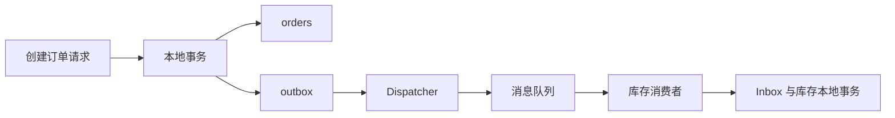

# 分布式一致性与可靠消息

> 前置：[事务与一致性](./concurrency-transaction)、[锁机制](./locking)、[消息队列](./message-queue)。本章从订单跨服务流转解释可靠性；SQL 默认 MySQL 8.0 / InnoDB，消息确认以 RabbitMQ 为例。SQL 中的 `?` 由应用参数绑定，流程伪代码需要接入项目的数据库和消息客户端。

## 先看问题：订单存在，库存却没处理

```txt
订单服务：INSERT order → COMMIT → 发 OrderCreated
库存服务：收到事件 → 预留库存 → 返回结果事件
```

订单提交后，进程恰好崩溃，消息就没有发出。用户看到了订单，库存服务却完全不知道它存在。

把顺序倒过来也不行：先发消息，库存已经预留，订单事务却回滚了。两边操作交换顺序，只是交换了故障窗口。

单库事务只能原子提交它管理的数据。把 HTTP 调用或 MQ publish 放进事务函数，并不会把远端资源加入同一事务。网络请求期间持有数据库锁还会放大等待。

首先定义业务承诺：创建接口返回的是“订单已受理”，订单处于 `pending_inventory`；只有收到库存预留成功的结果，才能进入 `confirmed`。不能把本地写库成功展示成整个跨服务流程成功。

## 先分清四种保证

| 保证 | 意义 | 不能推出什么 |
| --- | --- | --- |
| 本地事务原子性 | 订单和待发送事件一起提交 | 远端已经处理 |
| 至少一次投递 | 在约定故障模型和恢复条件下持续尝试，可能重复 | 无条件永远不丢、绝不重复 |
| 幂等业务效果 | 重复处理同一操作不重复产生业务结果 | 处理函数只运行一次 |
| 最终一致性 | 故障恢复后，经重试、补偿等机制收敛 | 不需要期限、监控和人工处理 |

“Exactly once”必须说明范围：某个消息系统内部的事务保证，不会自动覆盖独立 MySQL 数据库或第三方支付接口。

## Outbox：把发送意图变成本地数据

在订单数据库里增加一张 outbox（待发事件表），创建订单和写事件使用同一连接、同一事务。事务提交后，独立 dispatcher 读取已提交事件并发送。



Outbox 解决的是“业务提交了，但没有留下可靠的发送意图”。它不把数据库和队列变成一个原子系统，重复发送窗口仍存在。参见 [AWS Transactional outbox](https://docs.aws.amazon.com/prescriptive-guidance/latest/cloud-design-patterns/transactional-outbox.html)。

### 事件需要什么字段

```sql
CREATE TABLE outbox_events (
  event_id CHAR(36) CHARACTER SET ascii COLLATE ascii_bin PRIMARY KEY,
  aggregate_id BIGINT UNSIGNED NOT NULL,
  aggregate_version BIGINT UNSIGNED NOT NULL,
  event_type VARCHAR(80) NOT NULL,
  schema_version INT UNSIGNED NOT NULL DEFAULT 1,
  payload JSON NOT NULL,
  status VARCHAR(16) NOT NULL DEFAULT 'pending',
  attempts INT UNSIGNED NOT NULL DEFAULT 0,
  next_attempt_at DATETIME(6) NOT NULL DEFAULT CURRENT_TIMESTAMP(6),
  claim_token CHAR(36) CHARACTER SET ascii COLLATE ascii_bin NULL,
  lease_until DATETIME(6) NULL,
  created_at DATETIME(6) NOT NULL DEFAULT CURRENT_TIMESTAMP(6),
  sent_at DATETIME(6) NULL,
  KEY ix_dispatch (status, next_attempt_at, created_at),
  KEY ix_expired (status, lease_until)
) ENGINE=InnoDB;
```

`event_id` 在创建事件时生成一次，重投时不变。`aggregate_id` 表示订单等业务实体；`aggregate_version` 用于检测业务顺序，不能简单用创建时间替代。`schema_version` 用于载荷升级。

事件应包含消费者需要的不可变事实，例如订单号、商品、数量，而不是让消费者重新查询一份可能已经变化的订单。只携带必要字段，避免把完整用户资料广播给所有订阅者。

```txt
BEGIN
  按客户端幂等键创建订单（数据库唯一约束）
  写入 OrderCreated outbox 事件
COMMIT
返回订单 ID 与 pending_inventory 状态
```

同一客户端请求重试时返回已有订单，不再创建新业务事件。事件去重与请求去重是两层：新的 event_id 不能帮助识别两次其实相同的下单请求。

### 多个 dispatcher 怎么认领

在一个短事务中认领任务：

```sql
START TRANSACTION;
SELECT event_id, payload, event_type, aggregate_id, aggregate_version
FROM outbox_events
WHERE status = 'pending' AND next_attempt_at <= NOW(6)
ORDER BY created_at, event_id
LIMIT 20
FOR UPDATE SKIP LOCKED;
-- 应用保留选中的 ID；为本次认领生成新的 token
-- 只更新选中的 ID，随后提交；空结果直接提交
UPDATE outbox_events
SET status = 'sending', claim_token = ?,
    lease_until = TIMESTAMPADD(SECOND, 30, NOW(6)),
    attempts = attempts + 1
WHERE event_id IN (?, ?) AND status = 'pending';
COMMIT;
```

`IN` 参数数量必须与选中结果匹配，不能照抄固定两个占位符。锁定与更新共用同一连接。提交后才在事务之外发网络消息。

`SKIP LOCKED` 适合任务认领，但它会跳过被锁住的行，不能用来获取完整一致的业务查询结果，也不保证实体事件按顺序投递。[MySQL 锁定读文档](https://dev.mysql.com/doc/refman/8.0/en/innodb-locking-reads.html)说明了这一边界。

### 什么时候标记 sent

下面是协议顺序，不绑定具体 SDK：

```txt
for 每个已认领事件:
  发布持久化消息，message_id = event_id
  等待有期限的 publisher confirm，并处理不可路由返回
  确认该事件达到配置的 broker 接收要求
  按 event_id + claim_token + status 条件标记 sent
```

```sql
UPDATE outbox_events
SET status = 'sent', sent_at = NOW(6),
    claim_token = NULL, lease_until = NULL
WHERE event_id = ? AND status = 'sending' AND claim_token = ?;
```

必须检查影响行数。为 0 表示认领已改变或状态已改变，旧 worker 不能覆盖新状态。它仍可能已经发出重复消息，token 并不能阻止这次网络副作用。

RabbitMQ 中，publisher confirm 与消费者 ACK 是两种独立确认。不可路由消息也可能被 confirm；需要结合路由配置、`mandatory` 返回等判断。还要配置适当的 durable 队列、消息持久化与复制策略，不能把 publish 函数返回当作业务完成。[RabbitMQ 确认机制](https://www.rabbitmq.com/docs/confirms)

### 崩溃之后怎么恢复

| 中断点 | 已有状态 | 恢复方式 |
| --- | --- | --- |
| 本地事务提交前 | 订单与事件都未提交 | 请求重试，由幂等键保护 |
| 提交后、认领前 | pending 事件存在 | dispatcher 后续扫描 |
| 认领后、发送前 | sending 且有租约 | 租约过期后重新排队 |
| broker 接收后、confirm 丢失 | 是否发送成功不确定 | 使用原 event_id 重投 |
| confirm 后、sent 更新前 | 消息已经发送 | 恢复后可能再次投递 |
| sent 后、消费前 | broker 已接收 | 依赖 broker 保留、消费者恢复及业务对账 |

恢复任务以数据库时间检测过期租约，分批把过期 `sending` 改回 `pending`，清空 token；更新条件必须仍包含过期状态与时间条件。失败重试也按认领 token 条件更新。

批次过大或发送很慢时，未处理的任务可能已经过期。应控制批量、发送期限，必要时按 token 续租；租约长度不是随便写个 30 秒就结束设计。

永久失败进入 `failed` 并报警，不能静默删除。`sent` 只表示发送阶段完成；消费者是否完成，需要结果事件或对账证明。

## Inbox：业务修改与去重记录一起提交

消费者接收到同一个事件两次，不能做“先查是否存在，没有就处理”：两个消费者可以同时查到没有。

```sql
CREATE TABLE consumer_inbox (
  consumer_name VARCHAR(80) CHARACTER SET ascii COLLATE ascii_bin NOT NULL,
  event_id CHAR(36) CHARACTER SET ascii COLLATE ascii_bin NOT NULL,
  processed_at DATETIME(6) NOT NULL DEFAULT CURRENT_TIMESTAMP(6),
  PRIMARY KEY (consumer_name, event_id)
) ENGINE=InnoDB;
```

`consumer_name` 区分不同订阅者。同一个事件允许“库存服务”和“通知服务”各处理一次；不能用全系统共用的 event_id 唯一表挡住所有订阅者。

```txt
校验事件结构和版本
BEGIN
  INSERT consumer_inbox(consumer_name, event_id)
  执行库存条件扣减 / 预留业务
  写入本服务的结果事件 outbox
COMMIT
ACK 消息
```

仅当确认是 inbox 主键重复时，回滚当前尝试，再 ACK 已处理的事件。不能把业务表重复键、数据库断连等所有错误都当作“已经成功”。

竞争的 INSERT 会受到唯一约束协调：先处理者若回滚，后处理者仍可能成功插入；若提交，后处理者得到重复键。去重记录和业务效果因此共同存在或共同回滚。

库存不足是可预期的业务结果：记录拒绝状态并写 `InventoryRejected` 结果事件，然后提交和 ACK。数据库暂时不可用则是技术失败，应回滚后重试，不能假装业务拒绝。

### 三个 ACK 坑

1. **先 ACK 再提交**：进程崩溃后消息已经移除，业务却没落库。
2. **提交后 ACK 丢失**：会重新投递，用 inbox 抑制重复业务效果。
3. **只写去重记录，再单独处理业务**：中间崩溃后，后续请求会被错误地判定为已完成。

外部支付、邮件、文件写入无法加入这个数据库事务。可再用本服务的 outbox 驱动外部调用，并使用对方的幂等键和状态查询；没有这些能力时，不应承诺跨系统恰好一次。

## 重复、乱序与重试是不同问题

### 去重解决不了乱序

同一订单的 `Created(v1)` 与 `Cancelled(v2)` 是两个不同事件，inbox 都会接受。若先消费 v2，再消费 v1，仍可能让已取消订单复活。

按订单 ID 分区或串行处理可以减少乱序，但要考虑多发布者、重试队列、并发消费和补投。递增版本也需要在业务写入时按实体串行分配；自增事件 ID 不等于事务提交顺序。

处理策略取决于事件语义：

- **完整状态快照**：可在业务允许时只接受更新版本，忽略过期快照。
- **增量事件**：不能跳过缺失版本直接应用。持久化等待、查询权威服务或触发修复；设等待期限和告警。
- **状态迁移命令**：使用合法前置状态的条件更新，不允许 cancelled 回到 created。

需要等待的事件不能直接作为“业务已完成”写进 inbox 再丢弃；应保留可恢复的等待任务。

### 有限重试与死信

| 失败类型 | 处理 |
| --- | --- |
| 短暂断连、限流、可重试数据库冲突 | 有限次数、退避加抖动、遵守总期限 |
| 非法载荷、不支持的事件版本 | 隔离并告警，修复兼容性后再处理 |
| 库存不足、订单已取消 | 业务拒绝事件，不循环重试 |
| 外部调用超时、结果未知 | 先用业务键查询状态，再决定是否重试 |

不要无限立即 requeue，持续坏消息会形成热循环，占满消费者。退避可按 `min(cap, base × 2^attempt)` 计算上限后加入随机抖动，具体次数依据业务期限设置。

死信不是垃圾桶：保存 event_id、失败原因、首次/最后失败时间、重试次数和可检索载荷。重投仍使用原事件 ID；如果确实需要发起新的纠正操作，应分配新事件 ID，并记录它与原事件的关系。

## Saga：补偿是一笔新业务

```txt
创建待确认订单
  → 预留库存
  → 扣款
  → 确认订单
```

扣款明确失败后，释放库存并取消订单，这是补偿；已经扣款后要取消，需要退款，它是一笔新交易。已发送邮件、已发货商品无法像数据库回滚一样擦除。

编排式 Saga 由协调器持久化步骤、结果、超时与补偿进度；事件协作式由服务响应事件推进。前者便于看全局流程，后者减少中心协调，但事件链变长后追踪和恢复更难。

必须回答：

- 正向操作与补偿操作分别用什么幂等键？
- 扣款超时结果未知时，如何查询，而不是直接取消？
- 库存租约到期释放后，迟到的扣款成功如何处理？
- 补偿失败谁重试，超过业务时限谁接管？

这些规则应进入持久化状态机；进程重启后能从记录恢复，不能只靠内存里的一串 `await`。

## 对账：验证业务闭环

只看队列积压为零不够：消息可能路由错误、被过早 ACK，或者下游记录了错误状态。

从权威业务数据找异常，例如订单超过允许时限仍处于 `pending_inventory`；批量查询对应库存预留和支付状态，区分未发送、未消费、结果事件缺失和真正失败。

修复要复用有幂等保障的业务入口，带 repair_id、证据和审计记录。不要对所有超时订单盲目再扣一次款。跨服务时间可能不一致，对账要留合理宽限窗口，并处理扫描期间状态继续变化。

| 指标 | 能发现什么 |
| --- | --- |
| 最老 pending 事件年龄 | 发送是否长期停滞 |
| 过期租约与重复投递量 | dispatcher 崩溃、批次或期限不合理 |
| 消费延迟、死信数量 | 下游跟不上或载荷不兼容 |
| 未闭环订单年龄 | 业务流程卡住，即便队列为空 |
| 补偿失败量、对账差异量 | 自动恢复是否真正收敛 |

保留期也是正确性边界：过早清理 inbox 会让历史重放再次产生效果；永久不清理则持续增长。按可重放窗口、业务唯一约束与审计要求共同设计归档。

## 本地故障实验：先定义断言

只用独立测试数据库、测试队列和假的支付接口。将以下位置设成可控暂停点或一次性故障开关，避免靠随机 sleep 碰运气。数据库提交断点要真的提交，不能被测试框架的外层事务掩盖。

| 实验 | 注入位置 | 恢复后必须成立 |
| --- | --- | --- |
| 原子提交 | 写订单后、写 outbox 前抛异常 | 订单与事件均不存在 |
| 发送恢复 | 提交后停止 dispatcher，再启动 | 原事件最终投递 |
| 重复窗口 | confirm 后、更新 sent 前停止进程 | 可重复投递，但库存只预留一次 |
| 消费恢复 | 业务 SQL 后、提交前抛异常 | inbox 与库存变化一起回滚 |
| ACK 丢失 | 消费事务提交后关闭 channel，不 ACK | 重投后业务效果不增加 |
| 并发重复 | 两个独立连接同时处理同一 event_id | 仅一笔业务效果、一个 inbox 记录 |
| 租约过期 | A 暂停，B 重新认领，再恢复 A | A 无权覆盖 B 的任务状态 |
| 乱序 | 先送取消，再送创建 | 订单不复活，增量缺口有恢复记录 |

每次实验记录订单、outbox、inbox、库存记录的前后状态，以及 event_id 和消费次数。`SELECT COUNT(*)` 只能证明记录数量，还要检查数量、金额、业务状态和是否出现多余副作用。

练习验收：能明确说出每个故障窗口由哪个约束或恢复任务处理；仅收到一次 HTTP 200、仅看到日志“发送成功”不算通过。

继续阅读 [Worker 与异步任务](./background-worker) 理解认领与执行模型，[Agent 生产可靠性](./agent-reliability) 查看长流程恢复场景。本章的 SQL 与实验是教学方案，落地时需接入实际 SDK 并运行真实数据库/队列测试。

---

## 面试问答

**1. 为什么「先写库再发消息」和「先发消息再写库」都不行？**

- 先写库：订单事务提交后、消息发出前进程崩溃，订单存在而库存服务完全不知道
- 先发消息：库存已经预留，订单事务却回滚了，白白预留
- 交换顺序只是交换了故障窗口：单库事务只能原子提交它管理的数据，HTTP 调用和 MQ publish 不会被拉进同一事务
- 解法是 Outbox：订单和待发事件在同一连接、同一事务里落库，事务提交后由独立 dispatcher 读取并发送

**2. Outbox 表有哪些关键字段？分别防什么问题？**

- `event_id` 创建时生成一次、重投不变：broker 接收了但 confirm 丢失时，靠同一个 ID 重投，消费端才能去重
- `aggregate_id` / `aggregate_version` 用于检测业务顺序，`schema_version` 用于载荷升级
- `status` + `attempts` + `next_attempt_at` 支撑重试调度，`claim_token` + `lease_until` 支撑多 dispatcher 认领和崩溃恢复
- 加分：事件只携带消费者需要的不可变事实（订单号、商品、数量），而不是把完整用户资料广播给所有订阅者

**3. 多个 dispatcher 并发扫表，怎么保证不出乱子？**

- 在短事务里 `SELECT ... FOR UPDATE SKIP LOCKED` 认领，把状态改成 sending 并写入 claim_token 和租约
- 标记 sent 必须按 event_id + claim_token + status 条件更新并检查影响行数：为 0 说明认领已被接管，旧 worker 不能覆盖新状态
- 别踩的坑：租约不是随手写个 30 秒就完事——批次过大或发送很慢时，任务可能还没发出去租约就过期了，要控制批量、设发送期限，必要时按 token 续租
- SKIP LOCKED 只适合任务认领：它会跳过被锁住的行，不能用来获取完整一致的业务查询结果，也不保证实体事件按顺序投递

**4. 消费端为什么不能「先查去重表，不存在再处理」？正确的幂等怎么写？**

- 两个消费者可以同时查到「不存在」，先查后写在并发下必然漏
- 正确做法是把 INSERT consumer_inbox（主键 consumer_name + event_id）和业务修改放进同一个事务，靠唯一约束协调竞争；只有确认是 inbox 主键重复才回滚本次尝试并 ACK
- 三个 ACK 坑要背下来：先 ACK 再提交（崩溃后消息没了、业务没落库）；提交后 ACK 丢失（重投靠 inbox 抑制重复）；只写去重记录再单独处理业务（中间崩溃后，后续请求被误判为已完成）
- 加分：consumer_name 区分订阅者——同一个事件允许库存服务和通知服务各处理一次，不能用全系统共用的 event_id 唯一表挡住所有订阅者

**5. 重试和死信怎么设计，才不会把消费者拖死？**

- 可重试的失败（短暂断连、限流、可重试的数据库冲突）有限次数、退避加随机抖动（`min(cap, base × 2^attempt)`）、遵守总期限
- 库存不足、订单已取消这类业务拒绝，写结果事件后提交并 ACK，不循环重试；非法载荷隔离并告警
- 不要无限立即 requeue：持续的坏消息会形成热循环，占满消费者
- 死信不是垃圾桶：保存 event_id、失败原因、时间、重试次数和可检索载荷；重投仍用原事件 ID，确要发起新的纠正操作才分配新 ID 并记录关系

**6. Outbox 把事件写进队列就万事大吉了吗？为什么消费端还要 inbox？**

- Outbox 保证的是"发送意图"持久化，最终不丢还依赖存储、队列配置、恢复任务和保留策略
- broker 接收确认与本地 sent 标记不是原子操作，发送仍可能重复——消费端用 inbox 唯一约束把"去重"和"本地业务效果"放进同一事务，重复消息第二次插入直接失败
- 别踩的坑：把"已发送"标记当成"已送达"，两者之间隔着 broker 的持久化与确认机制

**7. 分布式锁能替代这套机制吗？能不能干脆同步调用？**

- 锁只协调并发，不能把多个系统的提交变成原子操作；跨服务失败照样需要补偿和对账
- 同步调用库存可以，但超时和部分成功仍然存在：需要状态查询、幂等和恢复流程，只是把等待从异步挪进了请求里
- 为什么不直接上分布式事务：先确认参与系统是否支持同一协议，再算协调者的故障、阻塞、运维和延迟成本

**8. 幂等之后是不是就可以随便重试了？**

- 要区分：业务失败（库存不足）重试无意义，结果未知才值得重试，有期限的任务超期就停止投递，载荷冲突（同 event_id 不同内容）要显式报出来
- 乱序另用实体版本和状态机处理，外部副作用依赖幂等键与状态查询
- 补偿走可恢复的 Saga 与对账闭环，并用故障注入验证这些窗口——只测成功路径不算验证
