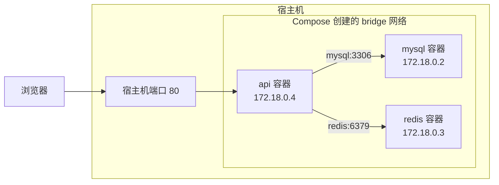

# Compose、网络与进程守护

> 一个后端服务从来不是孤零零跑的。这篇讲清多容器怎么编排、容器之间凭什么能互相访问、数据怎么不丢，以及「容器里到底还要不要 PM2」这个争议问题的答案。

上游是 [Dockerfile 进阶](/guide/dockerfile-practice)（怎么把一个服务打成镜像）和 [Docker 与部署](/guide/docker-deployment)（整体部署链路）。

## 为什么需要 Compose

一套最小可用的后端是「Nest + MySQL + Redis + Nginx」四个容器。纯手工 `docker run` 是这样：

```bash
docker network create app-net
docker run -d --name mysql --network app-net \
  -e MYSQL_ROOT_PASSWORD=... -e MYSQL_DATABASE=bookmarks \
  -v mysql-data:/var/lib/mysql mysql:8.4
# 等它真的能连上……手动 sleep 或者反复 docker logs
docker run -d --name redis --network app-net -v redis-data:/data redis:7-alpine
docker run -d --name api --network app-net -p 3000:3000 \
  -e DB_HOST=mysql -e REDIS_URL=redis://redis:6379 --restart unless-stopped api:1.4.2
docker run -d --name nginx --network app-net -p 80:80 \
  -v ./deploy/nginx.conf:/etc/nginx/conf.d/default.conf:ro nginx:1.27-alpine
```

痛点很具体：

| 痛点 | 表现 |
|---|---|
| 参数记不住 | 端口、卷、环境变量、网络全在命令行里，只存在于某人的 shell 历史里 |
| 启动顺序靠人 | MySQL 起来要十几秒，api 抢跑就连不上，得手动等 |
| 换机器全部重来 | 新同事入职、换服务器，只能靠一份 README 里的命令复制粘贴 |
| 不可版本控制 | 改了个端口没人知道，回滚无从下手 |
| 清理麻烦 | 停一套服务要 `docker stop a b c d && docker rm a b c d` |

Compose 把这一整套变成一个 `compose.yaml`——**它进 git，被 review，能回滚**。命令也塌缩成 `docker compose up -d`。

> ⚠️ 两个版本问题。命令用 `docker compose`（V2，Docker CLI 插件），带横线的 `docker-compose` 是已经停止维护的 Python 版；文件名首选 `compose.yaml`，`docker-compose.yml` 仍然兼容。文件里的 `version: '3.8'` 已经废弃，Compose V2 会忽略它并给个警告，新写的文件直接不要这一行。

---

## compose.yaml 逐字段

| 字段 | 作用 | 关键点 |
|---|---|---|
| `name` | 项目名 | 决定容器、网络、卷的前缀。不写就用目录名——目录改名会导致卷"丢失" |
| `services` | 每个 key 是一个服务 | 服务名同时是**网络里的 DNS 名**，这条最重要 |
| `image` | 用现成镜像 | 生产必须钉版本，别 `mysql:latest` |
| `build` | 现场构建 | 和 `image` 同时写＝构建后打上这个 tag |
| `ports` | 端口映射 | `"宿主:容器"`，写成 `"127.0.0.1:3306:3306"` 只绑本机 |
| `expose` | 仅声明 | 几乎不用写，同网络内本来就能互访 |
| `environment` | 环境变量 | 明文进 git，只放非敏感值 |
| `env_file` | 从文件读 | 敏感值走这里，文件加进 `.gitignore` |
| `volumes` | 挂载 | bind mount 与 named volume 区别见下 |
| `depends_on` | 依赖 | 短语法**只保证启动顺序**，不保证服务就绪 |
| `restart` | 重启策略 | 生产用 `unless-stopped` |
| `networks` | 加入哪些网络 | 用来做服务隔离 |
| `profiles` | 分组 | 区分开发与生产的 service 集合 |
| `healthcheck` | 就绪探针 | 配合 `depends_on` 的长语法才有意义 |
| `init` | 注入 tini 当 PID 1 | 和优雅退出直接相关，见下文 |
| `command` | 覆盖镜像的 `CMD` | 开发环境切 watch 模式常用 |

### build：不只是一个路径

```yaml
build:
  context: .                 # 构建上下文
  dockerfile: Dockerfile     # 相对 context 的路径
  target: runner             # 多阶段里停在哪个阶段
  args:
    BUILD_VERSION: ${BUILD_VERSION:-dev}   # 传给 Dockerfile 的 ARG
```

`target` 是开发和生产共用一个 Dockerfile 的关键——生产用 `runner`，开发用 `builder`（devDependencies 都在，能跑 `start:dev`）。

### ports：那个 `127.0.0.1:` 前缀不是可选的

```yaml
ports:
  - "3306:3306"              # 危险：绑 0.0.0.0，公网可达
  - "127.0.0.1:3306:3306"    # 只有宿主机自己能连
```

不加前缀等于绑 `0.0.0.0`，云服务器上就是**把数据库直接开到公网**。更阴的是：Linux 上 Docker 通过 iptables 的 DNAT 规则实现映射，这些规则插在 `ufw` 的链之前，**你以为防火墙拦住了 3306，其实没有**。

正确姿势：数据库和缓存根本不发布端口，同一个 Compose 网络内用服务名互访就够了；只在本地需要 GUI 客户端连的时候，用 `127.0.0.1:` 前缀发布，再配合 SSH 端口转发访问远端。

### environment vs env_file

```yaml
environment:                  # 明文，进 git，放不敏感的
  NODE_ENV: production
  DB_HOST: mysql
  REDIS_URL: redis://redis:6379
env_file:                     # 敏感值，文件不进 git
  - .env
```

Compose 还支持 shell 风格的默认值和必填校验，比在应用里判空早得多：

```yaml
MYSQL_ROOT_PASSWORD: ${MYSQL_ROOT_PASSWORD:?数据库密码必须设置}   # 没设就直接启动失败
TAG: ${TAG:-dev}                                              # 没设就用 dev
```

`${VAR}` 的取值来源是 shell 环境变量和项目根目录的 `.env` 文件——注意这个 `.env` 和 `env_file` 里那个是两回事：前者给 **Compose 文件自己**做变量替换，后者是**注入容器**的。这是个高频混淆点。

### volumes：bind mount 与 named volume

```yaml
volumes:
  - ./deploy/nginx.conf:/etc/nginx/conf.d/default.conf:ro   # bind mount：宿主机具体路径
  - mysql-data:/var/lib/mysql                               # named volume：Docker 管
```

| | bind mount | named volume |
|---|---|---|
| 写法 | 以 `.` 或 `/` 开头的宿主机路径 | 一个名字（要在顶层 `volumes:` 声明） |
| 存在哪 | 你指定的目录 | Docker 管理的目录（Linux 上是 `/var/lib/docker/volumes/`） |
| 宿主机能直接编辑 | 能 | 不方便 |
| 性能 | Linux 上等于原生，**macOS / Windows 上要跨 VM 边界，慢** |  接近原生 |
| 目录不存在时 | Docker 建一个空目录（不是报错，很坑） | 自动创建 |
| 适合 | 开发时挂源码热更新、挂配置文件（配 `:ro`） | 数据库数据、上传文件、任何需要持久化的 |

**判断标准：这份数据你需要用编辑器直接改吗？** 需要（配置、源码）用 bind mount；不需要（数据库文件）用 named volume。

> ⚠️ 数据库数据卷**不要 bind mount 到 macOS 目录**。macOS 上的 bind mount 要穿过 Docker Desktop 那层 Linux 虚拟机做文件系统转发，VirtioFS 改善了不少，但数据库那种随机小 IO 仍然会慢一个量级，还可能碰到文件锁语义差异导致的数据损坏。用 named volume。

### depends_on：最常见的坑

```yaml
# 只保证「mysql 容器已启动」，不保证「MySQL 能接受连接」
depends_on:
  - mysql

# 等到 mysql 的 healthcheck 变绿才启动 api
depends_on:
  mysql:
    condition: service_healthy
  migrate:
    condition: service_completed_successfully   # 等一次性任务跑完
```

短语法的语义是「容器进入 running 状态」，而 MySQL 容器 running 之后还要十几秒才真正能接受连接。所以只写 `depends_on: [mysql]` 时，api 照样连不上数据库——这大概是 Compose 上最常被问的问题。

三种解法，从好到差：

1. **给依赖方加 `healthcheck` + `condition: service_healthy`**。语义最清晰，编排器也能复用
2. **应用侧重试**。TypeORM 的 `retryAttempts` / `retryDelay`、Prisma 的连接重试。这条其实不可省——生产环境数据库会在运行中重启，光靠启动顺序解决不了
3. 在启动脚本里 `sleep 30`。能跑，但会在最忙的那天失效

现实答案是 1 和 2 一起上：健康检查解决启动期，应用重试解决运行期。

### restart：四种策略

| 策略 | 行为 | 用在 |
|---|---|---|
| `no`（默认） | 退出就不管 | 一次性任务 |
| `on-failure[:N]` | 只在非 0 退出码时重启，可限次数 | 迁移脚本、批处理 |
| `always` | 总是重启，**Docker daemon 重启后连之前手动停掉的也会拉起** | 很少需要 |
| `unless-stopped` | 总是重启，但你手动 stop 过的不会被 daemon 重启拉起 | **长期服务的默认选择** |

`always` 和 `unless-stopped` 的区别只在 Docker daemon 重启（服务器重启）那一刻显现：`always` 会把你昨天特意停掉的容器又拉起来。运维上这是个惊喜，所以默认选 `unless-stopped`。

### profiles：一份文件区分开发与生产

```yaml
services:
  api:            # 没写 profiles，任何时候都启动
    build: .
  nginx:
    image: nginx:1.27-alpine
    profiles: ["proxy"]      # 只有显式启用才起
  adminer:
    image: adminer:4
    profiles: ["debug"]
```

```bash
docker compose up -d                              # 只起 api
docker compose --profile proxy up -d              # api + nginx
COMPOSE_PROFILES=proxy,debug docker compose up -d # 全都起
```

比维护两份 compose 文件干净得多。

---

## 完整实战文件

`compose.yaml`——生产用，四个服务、健康检查、数据卷持久化、密码外置、数据库不发布端口：

```yaml
name: bookmarks

services:
  api:
    build:
      context: .
      target: runner
      args:
        BUILD_VERSION: ${TAG:-dev}
    image: registry.example.com/bookmarks-api:${TAG:-dev}
    restart: unless-stopped
    init: true
    stop_grace_period: 30s
    env_file: [.env]
    environment:
      NODE_ENV: production
      DB_HOST: mysql                      # 服务名，不是 localhost
      DB_PORT: "3306"
      REDIS_URL: redis://redis:6379
      NODE_OPTIONS: --max-old-space-size=768
    depends_on:
      mysql: { condition: service_healthy }
      redis: { condition: service_healthy }
    networks: [edge, data]
    healthcheck:
      test: ["CMD", "node", "-e", "fetch('http://127.0.0.1:3000/health').then(r=>process.exit(r.ok?0:1)).catch(()=>process.exit(1))"]
      interval: 30s
      timeout: 3s
      start_period: 20s
      retries: 3
    deploy:
      resources:
        limits: { memory: 1g, cpus: "1.5" }

  mysql:
    image: mysql:8.4
    restart: unless-stopped
    command: ["--character-set-server=utf8mb4", "--collation-server=utf8mb4_unicode_ci"]
    environment:
      MYSQL_ROOT_PASSWORD: ${MYSQL_ROOT_PASSWORD:?必须在 .env 里设置}
      MYSQL_DATABASE: bookmarks
    volumes:
      - mysql-data:/var/lib/mysql
    networks: [data]
    healthcheck:
      test: ["CMD", "mysqladmin", "ping", "-h", "127.0.0.1"]
      interval: 10s
      timeout: 5s
      start_period: 40s
      retries: 5

  redis:
    image: redis:7-alpine
    restart: unless-stopped
    command: ["redis-server", "--appendonly", "yes"]
    volumes:
      - redis-data:/data
    networks: [data]
    healthcheck:
      test: ["CMD", "redis-cli", "ping"]
      interval: 10s
      timeout: 3s
      retries: 5

  nginx:
    image: nginx:1.27-alpine
    restart: unless-stopped
    ports:
      - "80:80"
      - "443:443"
    volumes:
      - ./deploy/nginx.conf:/etc/nginx/conf.d/default.conf:ro
      - ./deploy/certs:/etc/nginx/certs:ro
    depends_on:
      api: { condition: service_healthy }
    networks: [edge]

volumes:
  mysql-data:
  redis-data:

networks:
  edge:
  data:
```

几处设计说明：

- **`mysql` 和 `redis` 不在 `edge` 网络上**，nginx 就算被攻破也碰不到数据库；api 同时在两个网络里当中间层
- **`mysql` 和 `redis` 完全不发布端口**，宿主机上 `netstat` 看不到 3306
- `start_period: 40s` 给 MySQL 首次初始化数据目录留时间，这期间探测失败不计入 `retries`
- `stop_grace_period` + `init: true` 是优雅退出的两个前提，见下文
- api 的内存同时用 cgroup（`limits.memory`）和 V8（`--max-old-space-size`）设两道，缺一道就会被 OOM Killer 静默杀掉

配套的 `.env`（进 `.gitignore`，仓库里只留 `.env.example`）：

```bash
TAG=1.4.2
MYSQL_ROOT_PASSWORD=换成真密码
JWT_SECRET=换成真密钥
```

### 开发用的 compose.override.yaml

`docker compose up` 会**自动读取并合并** `compose.yaml` + `compose.override.yaml`（后者不进版本控制或者进但只用于开发）。生产部署时显式指定 `-f compose.yaml` 就能跳过它。

```yaml
services:
  api:
    build:
      target: builder                # 停在 builder 阶段，devDependencies 在
    command: ["npm", "run", "start:dev"]
    environment:
      NODE_ENV: development
    ports:
      - "3000:3000"                  # 绕过 nginx 直连，方便调试
      - "9229:9229"                  # Node inspector
    volumes:
      - ./src:/app/src               # 只挂源码
      - ./test:/app/test
      - ./nest-cli.json:/app/nest-cli.json:ro

  mysql:
    ports:
      - "127.0.0.1:3306:3306"        # 本机 GUI 客户端连
  redis:
    ports:
      - "127.0.0.1:6379:6379"

  nginx:
    profiles: ["disabled"]           # 开发时不启动这个服务
```

热更新的关键是**只挂 `./src`，不要把整个项目目录挂到 `/app`**。挂整个目录会用宿主机的 `node_modules` 覆盖容器里的那份，而两者的原生模块二进制、甚至 CPU 架构都可能不一样，症状是各种莫名其妙的 `invalid ELF header`。

非要挂整个目录的话，用一个匿名卷把 `node_modules` 挡回去：

```yaml
volumes:
  - .:/app
  - /app/node_modules      # 匿名卷，优先级比上面那条高，遮住宿主机的 node_modules
```

> ⚠️ macOS 上如果 `start:dev` 检测不到文件变化，是 bind mount 的 inotify 事件传不过来。加 `CHOKIDAR_USEPOLLING=true` 环境变量退化成轮询，代价是 CPU 占用上升。

---

## 容器网络

### localhost 不是你想的那个 localhost

这是从本地开发切到容器部署时**卡住人最多的一处**，值得单独说清。

本地开发时，Nest、MySQL、Redis 都在你的机器上，连接串写 `localhost:3306` 天经地义。打成容器之后，同样的代码报 `ECONNREFUSED 127.0.0.1:3306`。

原因是 net namespace：[每个容器有独立的网络栈](/guide/dockerfile-practice)，独立的网卡、IP、端口空间。**容器里的 `127.0.0.1` 指的是这个容器自己**，而这个容器里只有一个 Node 进程，没有 MySQL。



Compose 会创建一个 bridge 网络并把所有服务接进去，同时在网络里跑一个**内嵌 DNS**（`127.0.0.11`），把**服务名**解析成容器 IP。所以正确写法是用服务名：

```typescript
// 错
{ host: 'localhost', port: 3306 }
// 对：mysql 是 compose.yaml 里的服务名
{ host: 'mysql', port: 3306 }
```

三个配套要点：

- **端口用容器内的端口，不是映射后的端口**。`ports: ["8080:3000"]` 只影响宿主机怎么访问；容器之间访问 api 用的还是 `api:3000`
- 服务名是 DNS 名，所以**服务名不要带下划线以外的奇怪字符**，也不要和真实域名冲突
- 反过来，应用**必须监听 `0.0.0.0`**。监听 `127.0.0.1` 时别的容器和宿主机都连不上，这是同一枚硬币的另一面

配置上的落地方式是让连接地址走环境变量：本地 `.env.local` 里 `DB_HOST=localhost`，Compose 里 `DB_HOST=mysql`，代码只读 `process.env.DB_HOST`。同一份镜像两个环境都能跑。

### 反过来访问宿主机

容器里要访问跑在宿主机上的服务（比如你还没容器化的另一个项目）：

| 平台 | 写法 |
|---|---|
| Docker Desktop（macOS / Windows） | `host.docker.internal` 直接可用 |
| Linux | 需要显式加一行 `extra_hosts: ["host.docker.internal:host-gateway"]` |

这个域名只该出现在开发配置里。生产环境如果需要它，说明架构里有个该容器化但没容器化的东西。

### 四种网络驱动

| 驱动 | 一句话 |
|---|---|
| `bridge` | 默认。容器在一个虚拟交换机上，有独立 IP，靠端口映射对外 |
| `host` | 容器直接用宿主机的网络栈，不做隔离也不需要映射 |
| `none` | 只有 lo，完全没网。用于纯计算的一次性任务 |
| `overlay` | 跨主机的虚拟网络，Swarm / 多机编排才用 |

`network_mode: host` 的取舍：省掉一层 NAT，延迟和吞吐略好，容器里 `listen(3000)` 直接就是宿主机的 3000。代价是**放弃了网络隔离**——端口冲突会直接打架，也没法用服务名 DNS（它不在 Compose 网络里了）。而且在 Docker Desktop 上「宿主机」指的是那个 Linux 虚拟机而不是你的 Mac，行为和 Linux 服务器不一致。只有在做网络性能压测、或者需要抓宿主机流量的场景才值得用。

### 用多个网络做隔离

上面实战文件里 `edge` / `data` 的拆分就是这个思路：**只有需要互相通信的服务才放进同一个网络**。默认单网络时，nginx 容器能直接 `telnet mysql 3306`，一旦 nginx 被打穿，数据库就在射程内。

想更严一点可以给数据网络加 `internal: true`，这个网络里的容器完全没有出站互联网访问，也无法发布端口。数据库和缓存本来不需要访问外网，加上这条能挡掉「被入侵后往外传数据」这类行为。代价是那个网络里的容器不能发布端口，也不能 `apt-get install`，所以要提前确认镜像不在启动时联网。

---

## 数据持久化

容器的可写层随容器一起消失。`docker compose down` 之后重建，容器里写的任何东西都没了——这不是 bug，是无状态容器的前提。所以**所有需要活过容器生命周期的数据都必须落在 volume 上**。

```bash
docker compose down          # 删容器，保留 volume
docker compose down -v       # 连 volume 一起删。生产环境敲这个之前先想三秒
docker volume ls
docker volume inspect bookmarks_mysql-data
```

注意 volume 的真实名字带项目名前缀（`bookmarks_mysql-data`），这也是为什么 `name:` 字段值得显式写——目录改名会让 Compose 认不出旧卷，表现就是"数据库空了"。

### 备份与恢复

named volume 不方便直接 `cp`，标准做法是起个临时容器把卷挂进去打包：

```bash
# 备份
docker run --rm \
  -v bookmarks_mysql-data:/data:ro \
  -v "$PWD":/backup alpine \
  tar czf /backup/mysql-data-$(date +%F).tar.gz -C /data .

# 恢复（先停掉用这个卷的服务）
docker compose stop mysql
docker run --rm \
  -v bookmarks_mysql-data:/data \
  -v "$PWD":/backup alpine \
  sh -c "rm -rf /data/* && tar xzf /backup/mysql-data-2026-08-30.tar.gz -C /data"
docker compose start mysql
```

> ⚠️ 这是**文件级**备份，只有在数据库停止时才保证一致。生产环境的数据库备份应该用 `mysqldump` / `xtrabackup` 这类工具做逻辑或热备份，卷打包只适合开发环境和迁移。

---

## PM2 与容器：结论先说

<!--MORE-->
