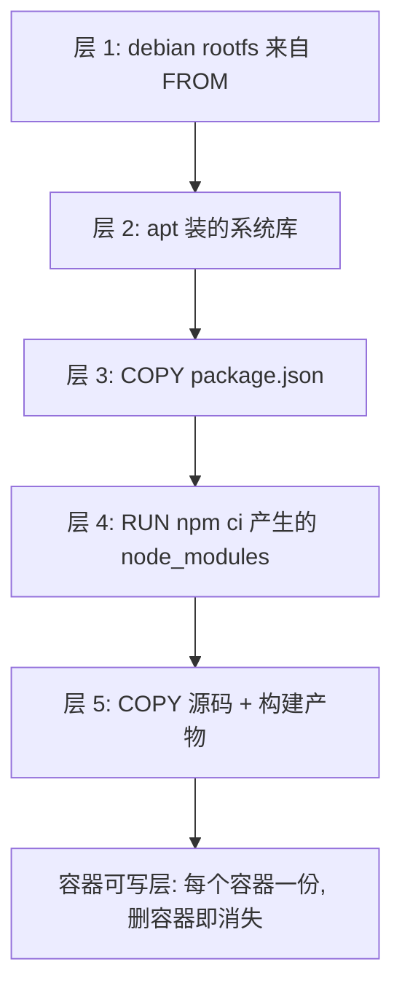

# Dockerfile 进阶：镜像怎么写才对

> [Docker 与部署](/guide/docker-deployment) 给了一份能用的 Dockerfile。这篇回答它后面的问题：为什么这么写、每一行改动让镜像大了多少、构建慢在哪、容器凭什么能跑起来。

## 镜像是一叠只读层，容器是最上面那层可写层

先纠正一个常见误解：镜像不是一个压缩包，而是**一叠有序的、只读的文件系统层**。



`docker build` 时，每条会改动文件系统的指令（`RUN` / `COPY` / `ADD`）产生一个新层，层内只记录**这一步相对上一步的差异**。`docker run` 时 Docker 把这些只读层叠成一个完整文件系统，再在最上面盖一层可写层——这就是容器。

所以「同一个镜像跑 5 个容器」并不会占 5 份磁盘，只多出 5 个可写层。

### 前端已经熟悉这个模型了

| 你熟悉的 | Docker 里的对应 | 共同点 |
|---|---|---|
| `git commit` | 镜像层 | 只存差异，历史不可改，改动只能追加新的一层 |
| 被多个包共用的同一份依赖 | 多个镜像共享的基础层 | 内容相同就只存一份，本地 10 个 Node 镜像不占 10 份 `node:20` |
| Vite / webpack 的构建缓存 | 层缓存 | 输入没变就跳过这一步 |
| CSS 的层叠 | 联合挂载 | 上层覆盖下层的同名内容 |

「`git commit` 只能往后加，不能改历史」这一条类比，就足以解释下面这个坑。

### 为什么删除文件不会让镜像变小

```dockerfile
RUN curl -o toolchain.tgz https://example.com/toolchain.tgz \
 && tar xzf toolchain.tgz && ./toolchain/install.sh
RUN rm -rf toolchain.tgz /tmp/build-cache
```

镜像一点没小。因为第一层里那 300 MB 已经写进历史了，第二层能做的只是记一条「这个路径在我这层不可见」的删除标记，**下层的字节还在，还要跟着镜像一起 push 和 pull**。就像 `git rm` 一个大文件不会让仓库变小。

正确做法是让「产生」和「删除」落在同一层：

```dockerfile
RUN curl -o toolchain.tgz https://example.com/toolchain.tgz \
 && tar xzf toolchain.tgz && ./toolchain/install.sh \
 && rm -rf toolchain.tgz /tmp/build-cache
```

Debian 系的 `apt-get` 同理，`rm -rf /var/lib/apt/lists/*` 必须和 `apt-get install` 串在同一条 `RUN` 里，否则等于白写。

> ⚠️ 更彻底的办法是多阶段构建：脏活全留在 builder 阶段，最终镜像只接收产物。见下文技巧二。

---

## 指令速查表

| 指令 | 作用 | 是否产生文件层 | 最容易踩的点 |
|---|---|---|---|
| `FROM` | 指定基础镜像，可出现多次（多阶段） | 是（继承下来的） | 别用 `latest`，构建结果不可复现 |
| `WORKDIR` | 设置后续指令的工作目录，不存在会自动创建 | 否 | 用它代替 `RUN cd`，`cd` 出了这条指令就失效 |
| `COPY` | 把构建上下文的文件复制进镜像 | 是 | 复制的是**上下文**里的路径，不是你机器上的任意路径 |
| `ADD` | 同上，另外能解压本地 tar 包、能拉 URL | 是 | 行为过多，默认用 `COPY` |
| `RUN` | 构建期执行命令 | 是 | 每条 `RUN` 一层，善用 `&&` 合并 |
| `ENV` | 设置环境变量，构建期和运行期都在 | 否 | 会进镜像元数据，别放密钥 |
| `ARG` | 声明构建参数，**只在构建期存在** | 否 | 运行时 `process.env` 读不到 |
| `EXPOSE` | 声明容器监听哪个端口 | 否 | 只是文档，不等于端口映射 |
| `VOLUME` | 声明一个必须持久化的挂载点 | 否 | 声明之后，后续指令对该目录的写入会被丢弃 |
| `USER` | 切换后续指令和运行时的用户 | 否 | 切了之后再 `COPY` 要注意文件属主 |
| `CMD` | 容器默认命令，可被 `docker run` 的参数覆盖 | 否 | 用 exec form，别用 shell form |
| `ENTRYPOINT` | 容器固定入口，`docker run` 的参数会追加在后面 | 否 | 和 `CMD` 的配合关系见下 |
| `HEALTHCHECK` | 容器内自检命令 | 否 | 它自己不会重启容器 |
| `STOPSIGNAL` | `docker stop` 发哪个信号，默认 `SIGTERM` | 否 | 和优雅退出直接相关 |

下面只挑几组真正会写错的展开。

### ENV vs ARG：构建期和运行期是两个世界

```dockerfile
FROM node:20-alpine

ARG BUILD_VERSION=dev          # 构建期变量，docker build --build-arg BUILD_VERSION=1.4.2 传入
ENV APP_VERSION=$BUILD_VERSION # 想让运行时读到，必须转存成 ENV
ENV NODE_ENV=production

RUN echo "building $BUILD_VERSION"   # 能读到
CMD ["node", "-e", "console.log(process.env.APP_VERSION, process.env.BUILD_VERSION)"]
# 输出：1.4.2 undefined
```

`ARG` 在镜像构建完成的那一刻就消失了，容器里 `process.env.BUILD_VERSION` 一定是 `undefined`。要传到运行时只有两条路：构建期用 `ENV` 固化，或者运行期用 `docker run -e` / Compose 的 `environment` 注入。

选哪条的判断标准很简单：**这个值换了之后需不需要重新构建镜像？** 需要（比如构建产物里嵌入的版本号）用 `ARG`；不需要（数据库地址、密钥）用运行期注入——同一个镜像必须能在测试和生产跑，配置外置是前提。

> ⚠️ `ARG` 和 `ENV` 的值都会明文留在镜像元数据里，`docker history` 就能看到。密钥不要走这两条路，BuildKit 提供了 `RUN --mount=type=secret`。

### EXPOSE 不是端口映射

`EXPOSE 3000` 只做两件事：写进镜像元数据当文档，以及让 `docker run -P`（大写）知道该随机映射哪些端口。它**不打开任何端口，也不做任何映射**。真正决定外部能否访问的是 `docker run -p 8080:3000` 或 Compose 的 `ports`。

反过来也成立：不写 `EXPOSE`，`-p 8080:3000` 照样能用。它的价值只是让读 Dockerfile 的人和编排工具知道「这个镜像的服务在 3000」。

### VOLUME：给数据兜底，但会咬人

`VOLUME /var/lib/mysql` 的意思是「这个目录必须持久化」。用户 `docker run` 时忘了 `-v`，Docker 会自动创建一个匿名卷挂上去，数据仍在宿主机上，删掉容器还能捞回来。官方 MySQL、PostgreSQL 镜像都声明了 `VOLUME`，就是防止有人跑了半年数据库、`docker rm` 一下全没了。

代价是：**声明之后，Dockerfile 里后续指令对该目录的写入会被丢弃**（写入落在被卷覆盖的层里）。所以 `VOLUME /app/uploads` 后面再 `COPY ./seed-images/ /app/uploads/` 是白写的。应用镜像通常不需要写 `VOLUME`，持久化交给 Compose 的 `volumes` 声明更直观。

### CMD vs ENTRYPOINT：这组必须讲透

第一层区别是**写法**：

| 写法 | 形式 | 实际执行 | 后果 |
|---|---|---|---|
| exec form | `CMD ["node", "dist/main.js"]` | 直接 `execve` 这个程序 | 你的进程就是容器的 PID 1，能收到信号 |
| shell form | `CMD node dist/main.js` | `/bin/sh -c "node dist/main.js"` | `sh` 是 PID 1，`docker stop` 的信号被它吞掉 |

**永远用 exec form。** shell form 唯一的好处是能用 `$VAR`、管道、`&&`，代价是多插了一个 `sh` 进程当 PID 1，而 `sh` 默认不把 `SIGTERM` 转发给子进程，于是优雅退出直接失效、`docker stop` 每次都要等满宽限期再被强杀。真需要 shell 特性就显式写 `CMD ["sh", "-c", "exec node dist/main.js"]`，注意那个 `exec`。

第二层区别是**能不能被覆盖**：

| Dockerfile | `docker run img` | `docker run img --port=4000` |
|---|---|---|
| `CMD ["node","main.js"]` | `node main.js` | `--port=4000`（整条命令被替换，直接报错） |
| `ENTRYPOINT ["node","main.js"]` | `node main.js` | `node main.js --port=4000` |
| `ENTRYPOINT ["node","main.js"]` + `CMD ["--port=3000"]` | `node main.js --port=3000` | `node main.js --port=4000` |

结论：

- `docker run` 后面跟的参数**覆盖 `CMD`，追加到 `ENTRYPOINT`**
- 两者同时存在时，`CMD` 退化成 `ENTRYPOINT` 的默认参数——这是给「命令固定、参数可调」的镜像用的
- 想连 `ENTRYPOINT` 一起换掉，只能 `docker run --entrypoint sh -it img`，调试镜像时很常用

Web 服务这种「就一条启动命令」的场景，单写 `CMD` 最省事；CLI 型镜像（比如一个 `prisma` 工具镜像）才适合 `ENTRYPOINT` + `CMD` 的组合。

### HEALTHCHECK 与 STOPSIGNAL

```dockerfile
HEALTHCHECK --interval=30s --timeout=3s --start-period=20s --retries=3 \
  CMD node -e "fetch('http://127.0.0.1:3000/health').then(r=>process.exit(r.ok?0:1)).catch(()=>process.exit(1))"
```

几个要点：

- alpine 和 distroless 镜像里**没有 `curl`，多半也没有 `wget`**，用 Node 20 自带的全局 `fetch` 写探针最省事，还顺便验证了 Node 运行时是活的
- `--start-period` 是启动宽限期，期间探测失败不计入 `--retries`，Nest 这种要连数据库的应用必须给
- 探测地址用 `127.0.0.1` 而不是服务域名，健康检查要测的是「我自己活着吗」
- **`HEALTHCHECK` 本身不会重启容器**，它只把状态标成 `healthy` / `unhealthy`。真正的价值在于 Compose 的 `depends_on: condition: service_healthy` 和编排器的探针会读它

`STOPSIGNAL` 默认就是 `SIGTERM`，绝大多数场景不用改。它和 Node 优雅退出的完整关系（包括那个「PID 1 会忽略没有处理函数的信号」的坑）放在 [Compose、网络与进程守护](/guide/docker-compose-network) 里讲，那边有配套的 Compose 配置。

---

## 一个 Nest 项目的 Dockerfile 演进

下面从一个「能跑但很糟」的版本开始改。示例用 Nest，Express / Fastify / 任何编译型 Node 项目都一样。

### v1：能跑，但每一条都踩了

```dockerfile
FROM node:20

WORKDIR /app
COPY . .
RUN npm install
RUN npm run build

EXPOSE 3000
CMD npm run start:prod
```

问题清单：基础镜像是 1 GB 级的完整 Debian；`COPY . .` 在前导致任何文件改动都要重装依赖；`node_modules` 和 `.git` 被一起打进上下文；devDependencies 和源码全留在最终镜像里；用 root 跑；shell form 的 `CMD`，而且 `npm run` 又多套了一层进程，信号传不下去。

### v2：只调一行顺序，构建时间从 90s 掉到 15s

```dockerfile
FROM node:20
WORKDIR /app

COPY package*.json ./
RUN npm ci                  # 依赖层：只有 package-lock.json 变了才重跑

COPY . .
RUN npm run build

EXPOSE 3000
CMD ["node", "dist/main.js"]
```

### v3：多阶段构建，把源码和构建依赖甩掉

```dockerfile
FROM node:20 AS builder
WORKDIR /app
COPY package*.json ./
RUN npm ci
COPY . .
RUN npm run build

FROM node:20 AS runner
WORKDIR /app
ENV NODE_ENV=production
COPY package*.json ./
RUN npm ci --omit=dev && npm cache clean --force
COPY --from=builder /app/dist ./dist
EXPOSE 3000
CMD ["node", "dist/main.js"]
```

### v4：基础镜像换成 alpine

只把两处 `FROM node:20` 改成 `FROM node:20-alpine`，体积再掉一半以上。前提是项目没有不兼容的原生模块，判断依据见技巧三。

### v5：生产版

在 v4 基础上只动 runner 阶段的四处：

```dockerfile
FROM node:20-alpine AS runner
WORKDIR /app
ENV NODE_ENV=production
COPY package*.json ./
RUN npm ci --omit=dev && npm cache clean --force
COPY --from=builder --chown=node:node /app/dist ./dist   # 1. 复制时就把属主给对
USER node                                                # 2. 非 root 运行
EXPOSE 3000
HEALTHCHECK --interval=30s --timeout=3s --start-period=20s --retries=3 \
  CMD node -e "fetch('http://127.0.0.1:3000/health').then(r=>process.exit(r.ok?0:1)).catch(()=>process.exit(1))"
CMD ["node", "dist/main.js"]                             # 3. exec form
```

第四处不在 Dockerfile 里：配一份 `.dockerignore`（见技巧四），运行时加 `--init`。


### 演进对照表

下面是一个 Nest 脚手架项目 + 十几个依赖的实测量级，你自己项目的绝对值会不同，但相对关系是稳定的：

| 版本 | 关键改动 | 镜像体积 | 改一行业务代码后重建 |
|---|---|---|---|
| v1 | `COPY . .` 后 `npm install`，`node:20` | ~1.5 GB | ~95 s（每次重装依赖） |
| v2 | 依赖层前置 | ~1.5 GB | ~14 s |
| v3 | 多阶段 + `--omit=dev` | ~460 MB | ~14 s |
| v4 | 基础镜像换 alpine | ~185 MB | ~12 s |
| v5 | 加 `.dockerignore` / `USER` / 健康检查 | ~185 MB | ~9 s（上下文小了） |

两个规律值得记住：**改顺序省的是时间，改结构和基础镜像省的是体积**，两件事互不替代。v1 到 v2 体积一点没变，v3 到 v4 时间也几乎没变。

---

## 五个关键优化技巧

### 技巧一：按「变化频率从低到高」排列指令

```dockerfile
# 改前
COPY . .
RUN npm ci

# 改后
COPY package*.json ./
RUN npm ci
COPY . .
```

**为什么**：层缓存的判定规则是「这条指令本身没变，且它依赖的输入没变，就复用」。对 `COPY` 来说输入是被复制文件的内容哈希；对 `RUN` 来说输入只是命令字符串本身。

关键在于**缓存失效是从命中不了的那一层开始，往后全部失效**——后面的层再怎么没变也得重跑，因为它们的基础变了。所以 `COPY . .` 放在最前面，等于宣布「任何一个文件改动都要重装依赖」；改个 README 都要等 90 秒。

把依赖清单单独拎出来先复制，`npm ci` 那层的输入就只有 `package.json` 和 `package-lock.json`。业务代码改一万次，依赖层都稳定命中缓存。

这条规律的推论：**`.dockerignore` 里漏掉的高频变动文件会毒害缓存**。比如没忽略 `dist/`，本地跑一次 `npm run build` 就让 `COPY . .` 那层失效。

> 用 pnpm 或 yarn 的话换成 `COPY package.json pnpm-lock.yaml ./` + `RUN pnpm i --frozen-lockfile`，思路完全一样。monorepo 要把所有 workspace 的 `package.json` 都先复制进去，这一步通常需要单独写几行 `COPY`。

### 技巧二：多阶段构建

改前是上面的 v2：一个阶段干到底，`typescript`、`jest`、`eslint` 和全部源码都留在最终镜像里。改后是 v3 那个结构：

```dockerfile
FROM node:20-alpine AS builder     # 装全量依赖、编译
# ...
FROM node:20-alpine AS runner      # 只装生产依赖、只收产物
RUN npm ci --omit=dev
COPY --from=builder /app/dist ./dist
```

**为什么**：`FROM` 每出现一次就开一个新阶段，最终镜像**只保留最后一个阶段**，前面的阶段只作为构建过程存在。`COPY --from=builder` 从指定阶段的文件系统里取文件。

这是体积从 1 GB 量级降到 200 MB 量级最关键的一步，砍掉三块：源码和测试文件、devDependencies（TypeScript 编译器 + Jest + ESLint 动辄 300 MB）、构建过程的临时文件。附带收益是攻击面变小——最终镜像里没有编译器，也没有 `.git`。

几个实操细节：

- runner 阶段重新 `npm ci --omit=dev`，比从 builder 复制整个 `node_modules` 再 `npm prune` 更干净可靠
- 有原生模块时反过来：`node_modules` 必须在**和 runner 相同的基础镜像**里编译，否则二进制不匹配。这时直接从 builder 复制 `node_modules`，并保证两个阶段 `FROM` 一致
- `COPY --from` 也能引用外部镜像：`COPY --from=nginx:1.27 /etc/nginx/mime.types ./`
- `docker build --target builder` 可以只构建到某个阶段，CI 里跑测试很有用


### 技巧三：选对基础镜像

| 镜像 | 量级 | libc | 适用 |
|---|---|---|---|
| `node:20` | ~1.1 GB | glibc（Debian） | 需要编译原生模块、需要完整工具链的 builder 阶段 |
| `node:20-slim` | ~240 MB | glibc（Debian，裁掉大部分工具） | **默认首选**。兼容性和体积的平衡点 |
| `node:20-alpine` | ~140 MB | musl（Alpine） | 体积敏感、且确认原生模块兼容 |
| `gcr.io/distroless/nodejs20` | ~120 MB | glibc | 安全要求高的生产环境。没有 shell，`exec -it` 进不去 |

**alpine 的坑在 libc**。Alpine 用 musl 而不是 glibc，这不是「功能少一点」，而是另一套 C 标准库实现。后果：

- npm 上的**预编译二进制**大多只提供 glibc 版本，装到 alpine 上要么现场编译（需要 `apk add --no-cache python3 make g++`，构建时间和镜像体积都涨回去），要么直接失败
- `sharp` 需要匹配的 libvips 构建，`bcrypt` 要现场编译（换纯 JS 的 `bcryptjs` 可以绕过），Prisma 需要在 `schema.prisma` 里显式声明 `binaryTargets = ["native", "linux-musl-openssl-3.0.x"]` 才能拿到正确的 query engine
- musl 的 DNS 解析行为和 glibc 有差异，历史上出过一些线上问题
- 部分场景下 musl 的内存分配器在高并发下表现不如 glibc

判断顺序：**先用 `node:20-slim`；只有体积真的成为瓶颈、且项目没有原生依赖时才换 alpine**。为了 100 MB 去和 musl 搏斗通常不划算，而 slim 相对完整镜像已经省了 80%。

无论选哪个，都要**把 tag 钉死**。`FROM node:20` 会随上游滚动，同一份 Dockerfile 上周和这周构建出的镜像不一样。写 `FROM node:20.19-alpine3.21`，最严格的做法是钉 digest：`FROM node:20-alpine@sha256:...`。

### 技巧四：.dockerignore

不写 `.dockerignore` 的后果有两层。

第一层是**构建变慢**：`docker build .` 会先把整个上下文目录打包交给构建器，`node_modules` 动辄几万个文件、几百 MB，光传输就要好几秒；`.git` 里可能还有几百 MB 的历史。

第二层更隐蔽，是**缓存频繁失效**。`node_modules` 和 `dist` 是本地开发中变动最频繁的目录，它们只要在上下文里，`COPY . .` 那层就几乎次次 miss。

第三层是**安全**：`.env`、`*.pem`、`.npmrc`（里面可能有私有仓库 token）如果被 `COPY . .` 带进镜像，任何拿到镜像的人都能读出来。

一份可以直接用的 Node 项目模板：

```text
# 依赖与产物
node_modules
dist
build
coverage
*.tsbuildinfo
# 版本控制与 CI
.git
.github
# 密钥与本地配置
.env
.env.*
!.env.example
*.pem
*.key
.npmrc
# 编辑器与系统
.vscode
.idea
.DS_Store
# 文档与测试
*.md
!README.md
test
**/*.spec.ts
# Docker 自身
Dockerfile*
compose*.yaml
.dockerignore
```

语法和 `.gitignore` 基本一致：`!` 是反向排除，`**` 跨目录匹配，`#` 是注释。

> ⚠️ 注意 `dist` 也被忽略了。多阶段构建里 `dist` 由 builder 阶段在容器内生成，不需要从宿主机复制。如果你的流程是「CI 里先 `npm run build` 再 `docker build` 只复制产物」，那就反过来，别忽略 `dist`。

顺手一个自查命令：`docker build --no-cache --progress=plain . 2>&1 | head -5` 会打印传输的上下文大小，超过几十 MB 就该检查 `.dockerignore` 了。

### 技巧五：用非 root 用户跑

```dockerfile
COPY --from=builder /app/dist ./dist                     # 改前：默认 root
COPY --from=builder --chown=node:node /app/dist ./dist   # 改后
USER node
```

**为什么**：容器的隔离依赖 Linux namespace，不是虚拟机级别的边界。容器里的 root 在默认配置下**和宿主机的 root 是同一个 uid 0**（除非启用了 user namespace remap）。一旦攻击者通过应用漏洞拿到容器内的命令执行，再叠加一个内核提权漏洞、一个被错误挂载的 `docker.sock`、或者一个 `--privileged`，就能横向到宿主机。用 uid 1000 跑，这条路径就断了。顺带的收益：容器内装不了软件包、改不了系统目录，等于给自己加了一道「别在生产容器里手改东西」的约束。

文件权限的处理要点：

- `node:20*` 官方镜像**已内置 `node` 用户**（uid 1000），不用自己 `adduser`。换基础镜像时才需要 `RUN addgroup -S app && adduser -S app -G app`
- `USER` 之前的 `COPY` 属主是 root，切了用户就读不到写不了。用 `COPY --chown` 一步解决，比事后 `RUN chown -R` 好——后者会把整个目录复制一遍到新层，镜像凭空变大
- 要写日志、上传目录时，先 `RUN mkdir -p /app/uploads && chown node:node /app/uploads` 再 `USER node`
- 非 root **不能监听 1024 以下端口**。这不是问题：容器内监听 3000，映射到宿主机 80 就行
- 挂 bind mount 时宿主机目录的 uid 要和容器内用户对得上，否则 permission denied，这是开发环境最常见的摩擦点

---

## 构建上下文与 BuildKit

### `docker build .` 那个点是什么

那个点是**构建上下文**（build context），不是 Dockerfile 的位置。

构建实际发生在 Docker daemon / BuildKit 构建器里，不在你的终端里。所以 `COPY` 能访问的只有被送进去的那份上下文，`COPY ../shared/utils ./` 一定报错。这个约束正是为了让构建可复现：换台机器、在 CI 里跑，输入都是同一份。

```bash
docker build -t app:dev .                                  # 上下文 = 当前目录
docker build -f apps/api/Dockerfile -t api:dev .           # Dockerfile 在子目录，上下文仍是仓库根
docker build -t app:dev https://github.com/user/repo.git#main   # 上下文 = 远端仓库
```

第二种是 monorepo 的标准写法：Dockerfile 放在 `apps/api/` 下，但上下文必须是仓库根，否则 `COPY packages/shared` 拿不到共享包。

### BuildKit

Docker Engine 23 之后 BuildKit 是默认构建器，三个能力直接能用：

```dockerfile
# syntax=docker/dockerfile:1
FROM node:20-slim AS builder
WORKDIR /app
COPY package*.json ./
RUN --mount=type=cache,target=/root/.npm npm ci                          # 下载缓存
RUN --mount=type=secret,id=npmrc,target=/root/.npmrc npm ci --omit=dev   # 密钥
```

- `--mount=type=cache` 和 `.dockerignore` 解决的是不同问题：后者让缓存少失效，前者让缓存失效时的代价变小
- `--mount=type=secret` 配合 `docker build --secret id=npmrc,src=$HOME/.npmrc .`，是唯一正确的私有仓库 token 传法——走 `ARG` 会留在 `docker history` 里
- BuildKit 会**并行构建互不依赖的阶段**

### 跨架构构建：M 系列 Mac 的坑

Apple Silicon 上 `docker build` 默认产出 `linux/arm64`。推到 x86_64 云服务器上一跑，直接 `exec format error`。

```bash
docker buildx build --platform linux/amd64 -t registry.example.com/api:1.4.2 --push .
docker buildx build --platform linux/amd64,linux/arm64 -t registry.example.com/api:1.4.2 --push .
```

- 交叉构建走 QEMU 模拟，**慢得很明显**（`npm ci` 可能从 30 秒变成 5 分钟）
- 多架构镜像必须 `--push` 直接推仓库，不能 `--load` 到本地

**这是「本地 build 推镜像」不如「CI build」的一个硬理由**：CI runner 架构和生产一致，一次就对。

### 在 CI 里复用缓存

CI 容器每次全新，本地层缓存用不上。把缓存导出到镜像仓库：

```bash
docker buildx build \
  --cache-from type=registry,ref=registry.example.com/api:buildcache \
  --cache-to   type=registry,ref=registry.example.com/api:buildcache,mode=max \
  -t registry.example.com/api:$GIT_SHA --push .
```

`mode=max` 导出所有中间层（含 builder 阶段），命中率高但占仓库空间；默认 `mode=min` 只导出最终镜像的层。GitHub Actions 里换成 `type=gha` 用它自带的缓存存储。

---

## Docker 是怎么实现的

容器不是虚拟机。它是**宿主机上一个被限制视野和资源的普通进程**，三件套撑起了这个假象：

| 机制 | 干什么 | 具体 |
|---|---|---|
| namespace | 让进程看不到别人 | 隔离视图 |
| cgroups | 让进程抢不走资源 | 限制配额 |
| UnionFS | 让镜像不重复占磁盘 | 分层合并 |

### namespace：隔离视图

namespace 是 Linux 内核的机制：给一组进程发一份独立的资源命名空间，里面的名字和外面互不干扰。前端类比就是 ES Module 的作用域——同名变量在两个模块里各自独立，不需要复制一份 JS 引擎。

| namespace | 隔离了什么 | 观察到的效果 |
|---|---|---|
| pid | 进程号 | 容器里 `ps` 只看到自己的进程，主进程是 PID 1 |
| net | 网络栈 | 独立的网卡、IP、端口、路由表、iptables，所以容器里的 3000 和宿主机的 3000 互不冲突 |
| mnt | 挂载点 | 独立的文件系统树，容器里的 `/` 是镜像叠出来的那个 |
| uts | 主机名和域名 | 容器有自己的 hostname，默认是容器 ID |
| ipc | 进程间通信 | 共享内存、信号量只在容器内可见 |
| user | 用户和用户组 | 可以把容器内的 root 映射成宿主机的普通用户（Docker 默认不开） |

「容器里的 3000 端口和宿主机的 3000 不是一回事」就是 net namespace 的直接后果，也是后面服务间通信一切困惑的源头——那部分在 [Compose、网络与进程守护](/guide/docker-compose-network) 里展开。

### cgroups：限制资源

namespace 解决「看不见」，但看不见不等于抢不到。一个容器把 CPU 跑满、把内存吃光，同机器上别的容器一样受害。cgroups（control groups）负责配额：

```bash
docker run -d --cpus=1.5 --memory=512m --pids-limit=200 api:1.4.2
```

对应到 Compose 是 `deploy.resources.limits`。注意 Node 应用**必须显式限制内存**：Node 20 会根据宿主机总内存推算堆上限，容器里如果不设 `--memory`，V8 可能以为自己有 64 GB 可用，等到真吃到 cgroup 上限时是被内核 OOM Killer 直接杀掉（退出码 137），不是抛 JS 异常，日志里什么都看不到。生产环境同时设 `--memory` 和 `NODE_OPTIONS=--max-old-space-size`（一般给到 `--memory` 的 70% 左右）。

### UnionFS：分层存储

前面第一节讲的就是它。实现上现在默认是 overlay2：把多个只读目录（lowerdir）和一个可写目录（upperdir）联合挂载成一个视图，写操作走 copy-on-write——改一个下层文件时，先把它整份复制到可写层再改。

这带来一个性能陷阱：**在容器可写层里做数据库那种随机小写入非常慢**，因为每次都可能触发整文件复制。所有需要持久化和高频写入的目录都必须挂 volume 绕过联合文件系统。

### 所以容器不是虚拟机

| | 虚拟机 | 容器 |
|---|---|---|
| 隔离层次 | 硬件虚拟化，各自跑一套完整内核 | 内核共享，靠内核特性隔离 |
| 启动 | 秒到分钟级（要引导内核） | 毫秒到秒级（就是起个进程） |
| 体积 | GB 级（含整个 OS） | MB 级（只有应用和依赖库） |
| 隔离强度 | 强，逃逸需要突破 hypervisor | 弱，内核漏洞 / 错误配置就可能逃逸 |
| 能跑什么系统 | 任意，Windows 上跑 Linux 没问题 | **只能跑和宿主机内核兼容的系统** |

最后一行是最重要的推论：**Linux 容器不能在 Windows 内核上原生运行**。Docker Desktop 之所以在 macOS 和 Windows 上能用，是因为它悄悄起了一个 Linux 虚拟机（Windows 上是 WSL2 或 Hyper-V，macOS 上是自带的轻量 VM），你的容器全都跑在那个 VM 里。

这解释了几件平时莫名其妙的事：Docker Desktop 为什么常驻占几 GB 内存；macOS 上 bind mount 为什么慢（跨 VM 边界的文件系统转发）；`network_mode: host` 在 Docker Desktop 上为什么行为和 Linux 不一样（"宿主机"是那个 VM 而不是你的 Mac）。

隔离强度那一行则解释了为什么多租户场景不敢只靠容器：容器逃逸的历史 CVE 不少，需要更强边界时得上 gVisor、Kata Containers 这类「给容器套个轻量内核」的方案，或者干脆一个租户一台虚拟机。

---

## 调试与排查

### 常用命令

| 命令 | 用途 |
|---|---|
| `docker logs -f --tail 100 <容器>` | 跟踪日志。容器的日志就是 PID 1 的 stdout/stderr |
| `docker exec -it <容器> sh` | 进容器。alpine 里没有 bash，用 `sh` |
| `docker inspect <容器>` | 完整元数据：挂载、网络、环境变量、退出码、健康状态 |
| `docker stats` | 实时 CPU / 内存 / 网络 IO，排查 OOM 前先看这个 |
| `docker history <镜像>` | **逐层看体积**，瘦身第一站 |
| `docker top <容器>` | 容器内的进程列表，验证「一个容器一个进程」 |
| `docker diff <容器>` | 容器可写层相对镜像的改动，排查「谁在往容器里写文件」 |

几个提效写法：

```bash
docker inspect --format '{{.State.ExitCode}} {{.State.Health.Status}}' api  # 只看退出码和健康状态
docker run --rm -it --entrypoint sh api:1.4.2   # 镜像起不来时，换个入口进去看文件对不对
docker cp api:/app/dist ./dist-in-image         # 容器已退出，照样能把文件捞出来
```

### 镜像瘦身排查思路

```bash
docker history --no-trunc --format '{{.Size}}\t{{.CreatedBy}}' api:1.4.2 | sort -h -r | head -10
```

按体积倒序看，然后对号入座：

| 观察到 | 原因 | 处理 |
|---|---|---|
| 最大的层是 `FROM` 继承来的 | 基础镜像选大了 | 换 slim / alpine |
| 某个 `RUN npm ci` 层几百 MB | 装了 devDependencies | 多阶段 + `--omit=dev` |
| 某个 `RUN` 层莫名很大 | 包管理器缓存没清 | 同一条 `RUN` 里 `npm cache clean --force` / `rm -rf /var/lib/apt/lists/*` |
| `COPY . .` 那层很大 | `.dockerignore` 漏了 | 补 `node_modules` / `.git` / `coverage` |
| 有个 `RUN chown -R` 层和目标目录一样大 | copy-on-write 复制了整个目录 | 换成 `COPY --chown` |
| 层数正常但总体积大 | 依赖本身就大（`sharp`、`puppeteer`） | 确认是不是真需要，或者拆成独立服务 |

想看得更细可以用 `dive` 这个开源工具，它能列出每层新增/修改了哪些具体文件。

### 容器一启动就退出

**容器的生命周期等于 PID 1 的生命周期。** 前台进程一结束，容器立刻退出——这不是故障，是设计。绝大多数「容器起不来」都是这一条。

排查顺序：

```bash
docker ps -a                                            # 看 STATUS 里的退出码
docker logs <容器>                                       # 90% 的答案在这里
docker inspect --format '{{json .State}}' <容器> | jq    # 看 OOMKilled、Error
```

退出码对照：

| 退出码 | 含义 | 常见原因 |
|---|---|---|
| 0 | 正常结束 | 命令跑完就退了。比如 `CMD ["npm", "run", "build"]`，或者写了个 `node -e "console.log(1)"` |
| 1 | 应用自己抛错退出 | 配置读不到、端口被占、数据库连不上。看日志 |
| 125 | Docker 自己的参数错误 | `docker run` 的选项写错了 |
| 126 | 命令不可执行 | 复制进去的脚本没有执行权限 |
| 127 | 命令找不到 | 典型：alpine 里写了 `CMD ["bash", ...]`，或者 `dist/main.js` 路径不对 |
| 137 | 收到 SIGKILL | **内存超限被 OOM Killer 杀**（配合 `.State.OOMKilled` 确认），或者 `docker stop` 超时后的强杀 |
| 139 | 段错误 | 原生模块和 libc 不匹配，典型的 alpine 踩坑现场 |
| 143 | 收到 SIGTERM | 正常的 `docker stop` |

两个高频误判：

- **「服务在容器里明明起来了，宿主机访问不到」**：不是容器的问题，是应用监听在 `127.0.0.1` 上。容器内的 `127.0.0.1` 只有容器自己能到，必须监听 `0.0.0.0`。Nest 里写 `await app.listen(3000, '0.0.0.0')`
- **「后台服务写成前台跑不起来」**：不要在 `CMD` 里用 `&` 或 `nohup` 把进程丢到后台，那样 PID 1 立刻结束、容器立刻退出。一个容器只跑一个前台进程，需要多个进程就拆多个容器

---

## 继续读

- [Compose、网络与进程守护](/guide/docker-compose-network)：多容器编排、服务间怎么互相访问、信号与优雅退出、PM2 到底还要不要
- [Nginx：反向代理与流量控制](/guide/nginx-core)：镜像跑起来之后，流量怎么进来、怎么灰度
- [Docker 与部署](/guide/docker-deployment)：整体部署链路、环境变量分层、CI/CD 工作流

---

## 面试问答

**1. COPY 和 ADD 有什么区别？为什么推荐 COPY？**

- COPY 只做一件事：把构建上下文里的文件复制进镜像；ADD 额外能解压本地 tar 包、能拉 URL，行为太多
- 默认用 COPY，确实需要自动解压这类行为时才考虑 ADD
- 注意 COPY 的源路径是**构建上下文**里的路径，不是你机器上的任意路径，`COPY ../xxx` 一定报错——构建发生在 daemon / BuildKit 构建器里，不在你的终端里

**2. EXPOSE 3000 写了，为什么外面还是访问不到？**

- EXPOSE 不打开端口也不做任何映射，它只把「这个服务监听 3000」写进镜像元数据当文档，外加让 `docker run -P`（大写）知道该随机映射谁
- 真正决定外部能否访问的是 `docker run -p 8080:3000` 或 Compose 的 ports
- 反过来也成立：不写 EXPOSE，`-p` 照样能用

**3. 容器一启动就退出，怎么排查？常见退出码什么含义？**

- 容器的生命周期等于 PID 1 的生命周期，前台进程一结束容器立刻退出——这不是故障是设计，90% 的答案在 `docker logs` 里
- 137 是收到 SIGKILL，配合 `.State.OOMKilled` 确认是不是内存超限被 OOM Killer 杀；127 是命令找不到（典型：alpine 里写了 bash）；139 是段错误，典型 alpine 原生模块和 musl 不匹配；143 是正常的 docker stop
- 别踩的坑：不要在 CMD 里用 `&` 或 `nohup` 把进程丢后台——PID 1 立刻结束、容器立刻退出，一个容器只跑一个前台进程

**4. alpine 镜像最小，为什么不能无脑换上去？**

- alpine 用 musl 不是 glibc：npm 上的预编译二进制大多只提供 glibc 版本，sharp、bcrypt 要现场编译或直接失败，Prisma 要显式声明 `binaryTargets` 才能拿到正确的 query engine
- 判断顺序：先用 `node:20-slim`（默认首选），体积真的成为瓶颈且项目没有原生依赖时才换 alpine
- 无论用哪个，tag 都要钉死——`FROM node:20` 会随上游滚动，同一份 Dockerfile 上周和这周构建出的镜像不一样
- 加分：能说出最严格的做法是钉 digest（`FROM node:20-alpine@sha256:...`）

**5. HEALTHCHECK 探测失败会自动重启容器吗？**

- 不会。它只把状态标成 healthy / unhealthy，本身不重启任何东西
- 真正的价值在于被别人消费：Compose 的 `depends_on: condition: service_healthy` 和编排器的探针读的都是这个状态
- `--start-period` 是启动宽限期，期间探测失败不计入 `--retries`，Nest 这种启动时要连数据库的应用必须给
- alpine 和 distroless 里没有 curl，用 Node 20 自带的全局 fetch 写探针最省事，还顺便验证了 Node 运行时是活的


**6. 镜像层的缓存怎么利用才不会失效？**

- 指令按变化频率从低到高排：先 COPY 依赖清单再 `npm ci`，最后才 `COPY . .`——缓存失效从 miss 的那层开始往后全部失效
- 后面的层删文件不会让镜像变小：每层只记差异，文件的产生和清理必须写在同一条 `RUN` 里

**7. CMD 为什么要用 exec form？密钥为什么不能走 ARG？**

- shell form 会让 `sh` 当 PID 1 吞掉 `SIGTERM`，容器停止变成超时强杀；exec form 直接 exec 应用，信号能送达
- 密钥用 BuildKit 的 `--mount=type=secret`；`ARG` 会留在镜像元数据里，`docker history` 能读出来
- `USER node` 跑非 root，`COPY --chown` 一次到位，避免事后 `chown -R` 把镜像撑大

**8. Node 在容器里为什么会被静默杀掉（退出码 137）？**

- 容器是 namespace 隔离视图 + cgroups 限制资源 + UnionFS 分层存储，共享宿主机内核，不是虚拟机——Docker Desktop 在 macOS 上其实跑了个 Linux 虚拟机
- 只设 cgroup 内存上限时，V8 按宿主机内存估算堆上限，超限被 OOM Killer 静默杀掉；要同时设 `--max-old-space-size`，让两个上限对齐
