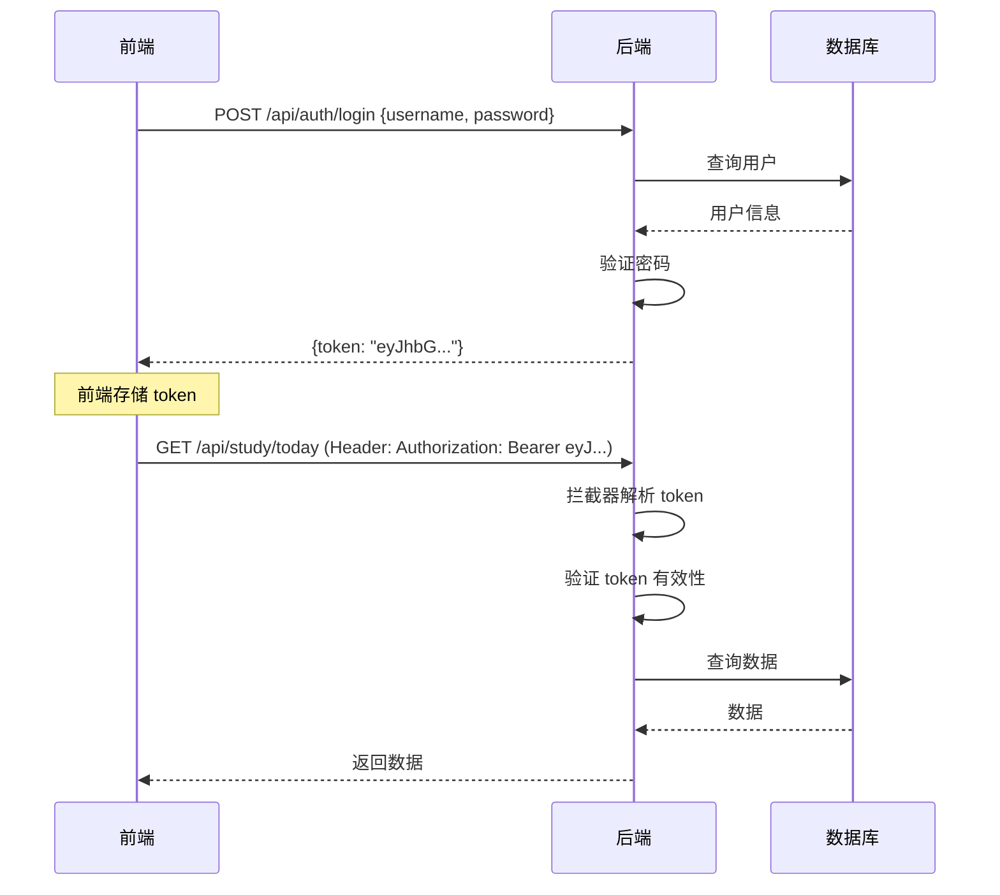

# 第七部分：登录与接口鉴权

## 7.1 本章目标

读完本章后，你应该能：

1. 理解 JWT 鉴权的完整流程
2. 实现登录接口，生成 JWT Token
3. 用拦截器验证请求中的 Token
4. 在 Controller 中获取当前登录用户
5. 了解常见安全问题

---

## 7.2 为什么需要学习这一章

上一章我们实现了 CRUD 接口，但**没有鉴权**——任何人都可以调用。真实项目中，大部分接口都需要登录后才能访问，有些接口还需要特定权限。

本章以"理解完整流程"为主，不构建复杂的权限平台。

---

## 7.3 完整流程图



---

## 7.4 添加依赖

```xml
<!-- pom.xml -->
<dependency>
    <groupId>io.jsonwebtoken</groupId>
    <artifactId>jjwt-api</artifactId>
    <version>0.12.5</version>
</dependency>
<dependency>
    <groupId>io.jsonwebtoken</groupId>
    <artifactId>jjwt-impl</artifactId>
    <version>0.12.5</version>
    <scope>runtime</scope>
</dependency>
<dependency>
    <groupId>io.jsonwebtoken</groupId>
    <artifactId>jjwt-jackson</artifactId>
    <version>0.12.5</version>
    <scope>runtime</scope>
</dependency>

<!-- Spring Security Crypto（密码加密） -->
<dependency>
    <groupId>org.springframework.security</groupId>
    <artifactId>spring-security-crypto</artifactId>
</dependency>
```

---

## 7.5 JWT 工具类

```java
// 文件：src/main/java/com/example/studytracker/util/JwtUtil.java
package com.example.studytracker.util;

import io.jsonwebtoken.Claims;
import io.jsonwebtoken.Jwts;
import io.jsonwebtoken.security.Keys;
import org.springframework.beans.factory.annotation.Value;
import org.springframework.stereotype.Component;

import javax.crypto.SecretKey;
import java.nio.charset.StandardCharsets;
import java.util.Date;

@Component
public class JwtUtil {

    @Value("${app.jwt.secret:my-default-secret-key-that-is-at-least-256-bits-long}")
    private String secret;

    @Value("${app.jwt.expiration:86400000}")
    private long expiration;  // 默认 24 小时

    private SecretKey getKey() {
        return Keys.hmacShaKeyFor(secret.getBytes(StandardCharsets.UTF_8));
    }

    // 生成 Token
    public String generateToken(Long userId, String username) {
        Date now = new Date();
        Date expiryDate = new Date(now.getTime() + expiration);

        return Jwts.builder()
            .subject(userId.toString())           // 存用户 ID
            .claim("username", username)           // 存用户名
            .issuedAt(now)
            .expiration(expiryDate)
            .signWith(getKey())
            .compact();
    }

    // 从 Token 中解析用户 ID
    public Long getUserIdFromToken(String token) {
        Claims claims = parseToken(token);
        return Long.parseLong(claims.getSubject());
    }

    // 验证 Token
    public boolean validateToken(String token) {
        try {
            parseToken(token);
            return true;
        } catch (Exception e) {
            return false;
        }
    }

    private Claims parseToken(String token) {
        return Jwts.parser()
            .verifyWith(getKey())
            .build()
            .parseSignedClaims(token)
            .getPayload();
    }
}
```

**对比 NestJS JWT：**

```typescript
// NestJS
@Injectable()
export class JwtService {
    sign(payload: { sub: number; username: string }): string { }
    verify(token: string): { sub: number; username: string } { }
}
```

---

## 7.6 密码加密

```java
// 文件：src/main/java/com/example/studytracker/config/SecurityConfig.java
package com.example.studytracker.config;

import org.springframework.context.annotation.Bean;
import org.springframework.context.annotation.Configuration;
import org.springframework.security.crypto.bcrypt.BCryptPasswordEncoder;
import org.springframework.security.crypto.password.PasswordEncoder;

@Configuration
public class SecurityConfig {

    @Bean
    public PasswordEncoder passwordEncoder() {
        return new BCryptPasswordEncoder();
    }
}
```

**使用：**

```java
@Service
@RequiredArgsConstructor
public class UserServiceImpl implements UserService {
    private final PasswordEncoder passwordEncoder;
    private final UserMapper userMapper;

    @Override
    public UserVO register(RegisterRequest request) {
        User user = new User();
        user.setUsername(request.getUsername());
        user.setPassword(passwordEncoder.encode(request.getPassword()));  // 加密
        user.setEmail(request.getEmail());
        userMapper.insert(user);
        return toVO(user);
    }

    @Override
    public String login(LoginRequest request) {
        User user = userMapper.selectByUsername(request.getUsername());
        if (user == null) {
            throw new BusinessException("用户名或密码错误");
        }
        if (!passwordEncoder.matches(request.getPassword(), user.getPassword())) {
            throw new BusinessException("用户名或密码错误");
        }
        return jwtUtil.generateToken(user.getId(), user.getUsername());
    }
}
```

**重要：** 永远不要存储明文密码。`BCryptPasswordEncoder` 是单向加密，无法解密，只能通过 `matches` 比较。

---

## 7.7 请求拦截器

### 7.7.1 拦截器代码

```java
// 文件：src/main/java/com/example/studytracker/interceptor/AuthInterceptor.java
package com.example.studytracker.interceptor;

import com.example.studytracker.util.JwtUtil;
import jakarta.servlet.http.HttpServletRequest;
import jakarta.servlet.http.HttpServletResponse;
import lombok.RequiredArgsConstructor;
import org.springframework.stereotype.Component;
import org.springframework.web.servlet.HandlerInterceptor;

@Component
@RequiredArgsConstructor
public class AuthInterceptor implements HandlerInterceptor {

    private final JwtUtil jwtUtil;

    @Override
    public boolean preHandle(HttpServletRequest request, HttpServletResponse response,
                             Object handler) throws Exception {
        // OPTIONS 预检请求直接放行
        if ("OPTIONS".equalsIgnoreCase(request.getMethod())) {
            return true;
        }

        // 获取 Token
        String authHeader = request.getHeader("Authorization");
        if (authHeader == null || !authHeader.startsWith("Bearer ")) {
            response.setStatus(401);
            response.setContentType("application/json;charset=UTF-8");
            response.getWriter().write("{\"code\":401,\"message\":\"未登录\",\"data\":null}");
            return false;
        }

        String token = authHeader.substring(7);  // 去掉 "Bearer "

        // 验证 Token
        if (!jwtUtil.validateToken(token)) {
            response.setStatus(401);
            response.setContentType("application/json;charset=UTF-8");
            response.getWriter().write("{\"code\":401,\"message\":\"Token无效或已过期\",\"data\":null}");
            return false;
        }

        // 将用户 ID 存入 request 属性，供后续使用
        Long userId = jwtUtil.getUserIdFromToken(token);
        request.setAttribute("userId", userId);

        return true;  // 放行
    }
}
```

### 7.7.2 注册拦截器

```java
// 文件：src/main/java/com/example/studytracker/config/WebConfig.java
package com.example.studytracker.config;

import com.example.studytracker.interceptor.AuthInterceptor;
import lombok.RequiredArgsConstructor;
import org.springframework.context.annotation.Configuration;
import org.springframework.web.servlet.config.annotation.InterceptorRegistry;
import org.springframework.web.servlet.config.annotation.WebMvcConfigurer;

@Configuration
@RequiredArgsConstructor
public class WebConfig implements WebMvcConfigurer {

    private final AuthInterceptor authInterceptor;

    @Override
    public void addInterceptors(InterceptorRegistry registry) {
        registry.addInterceptor(authInterceptor)
            .addPathPatterns("/api/**")           // 拦截所有 /api/ 开头的请求
            .excludePathPatterns(
                "/api/auth/login",                 // 登录接口不拦截
                "/api/auth/register",              // 注册接口不拦截
                "/api/health"                      // 健康检查不拦截
            );
    }
}
```

**对比 NestJS Guard：**

```typescript
// NestJS
@Injectable()
export class AuthGuard implements CanActivate {
    canActivate(context: ExecutionContext): boolean {
        const request = context.switchToHttp().getRequest();
        const token = request.headers.authorization?.split(' ')[1];
        // 验证 token...
        request.user = payload;
        return true;
    }
}
```

---

## 7.8 获取当前用户

在 Controller 中获取当前登录用户 ID：

```java
@RestController
@RequestMapping("/api/study")
@RequiredArgsConstructor
public class StudyController {

    private final StudyService studyService;

    @GetMapping("/today")
    public Result<?> getTodayRecords(HttpServletRequest request) {
        Long userId = (Long) request.getAttribute("userId");  // 从拦截器设置的属性获取
        return Result.success(studyService.getTodayRecords(userId));
    }
}
```

**更优雅的方式：自定义注解**

```java
// 定义注解
@Target(ElementType.PARAMETER)
@Retention(RetentionPolicy.RUNTIME)
public @interface CurrentUser {
}

// 参数解析器
@Component
public class CurrentUserResolver implements HandlerMethodArgumentResolver {
    @Override
    public boolean supportsParameter(MethodParameter parameter) {
        return parameter.hasParameterAnnotation(CurrentUser.class);
    }

    @Override
    public Object resolveArgument(MethodParameter parameter, ModelAndViewContainer mav,
                                  NativeWebRequest webRequest, WebDataBinderFactory binder) {
        return webRequest.getAttribute("userId", RequestAttributes.SCOPE_REQUEST);
    }
}

// 使用
@GetMapping("/today")
public Result<?> getTodayRecords(@CurrentUser Long userId) {
    return Result.success(studyService.getTodayRecords(userId));
}
```

---

## 7.9 登录接口完整实现

```java
// DTO
@Data
public class LoginRequest {
    @NotBlank(message = "用户名不能为空")
    private String username;

    @NotBlank(message = "密码不能为空")
    private String password;
}

@Data
public class LoginResponse {
    private String token;
    private Long userId;
    private String username;
}

// Controller
@RestController
@RequestMapping("/api/auth")
@RequiredArgsConstructor
public class AuthController {
    private final UserService userService;

    @PostMapping("/login")
    public Result<LoginResponse> login(@Valid @RequestBody LoginRequest request) {
        return Result.success(userService.login(request));
    }
}

// Service
@Service
@RequiredArgsConstructor
public class UserServiceImpl implements UserService {
    private final UserMapper userMapper;
    private final PasswordEncoder passwordEncoder;
    private final JwtUtil jwtUtil;

    @Override
    public LoginResponse login(LoginRequest request) {
        User user = userMapper.selectByUsername(request.getUsername());
        if (user == null) {
            throw new BusinessException("用户名或密码错误");
        }
        if (!passwordEncoder.matches(request.getPassword(), user.getPassword())) {
            throw new BusinessException("用户名或密码错误");
        }

        String token = jwtUtil.generateToken(user.getId(), user.getUsername());

        LoginResponse response = new LoginResponse();
        response.setToken(token);
        response.setUserId(user.getId());
        response.setUsername(user.getUsername());
        return response;
    }
}
```

**请求示例：**

```bash
# 登录
curl -X POST http://localhost:8080/api/auth/login \
  -H "Content-Type: application/json" \
  -d '{"username":"alice","password":"123456"}'

# 响应
{"code":200,"message":"success","data":{"token":"eyJhbG...","userId":1,"username":"alice"}}

# 使用 Token 访问接口
curl http://localhost:8080/api/study/today \
  -H "Authorization: Bearer eyJhbG..."
```

---

## 7.10 常见安全问题

### 7.10.1 不要在前端存敏感信息

Token 中不要存密码、手机号等敏感信息。JWT 的 payload 是 Base64 编码，**不是加密**，任何人都能解码查看。

### 7.10.2 返回统一的错误信息

```java
// ❌ 不安全：泄露用户是否存在
if (user == null) {
    throw new BusinessException("用户不存在");
}
if (!passwordEncoder.matches(...)) {
    throw new BusinessException("密码错误");
}

// ✅ 安全：统一返回，防止撞库
if (user == null || !passwordEncoder.matches(...)) {
    throw new BusinessException("用户名或密码错误");
}
```

### 7.10.3 Token 过期时间

```yaml
app:
  jwt:
    expiration: 86400000  # 24小时，单位毫秒
```

生产环境建议更短（如 2 小时），配合 Refresh Token 机制。

---

## 7.11 本章速查表

| 步骤 | 实现 |
|------|------|
| 密码加密 | `BCryptPasswordEncoder` |
| 密码比较 | `passwordEncoder.matches(raw, encoded)` |
| 生成 Token | `jwtUtil.generateToken(userId, username)` |
| 验证 Token | `jwtUtil.validateToken(token)` |
| 拦截请求 | `HandlerInterceptor` + `WebMvcConfigurer` |
| 获取当前用户 | `request.getAttribute("userId")` |
| 排除路径 | `excludePathPatterns("/api/auth/**")` |

---

## 7.12 三道小练习

### 练习 1

给 `/api/study/start` 和 `/api/study/end` 接口添加鉴权，只有登录用户才能调用。

### 练习 2

实现 `@CurrentUser` 注解，让 Controller 方法可以直接获取当前用户 ID。

### 练习 3

修改 `AuthInterceptor`，如果 Token 过期，返回 401 和更具体的信息。

---

## 7.13 是否需要深入学习

本章标记为"看懂即可"，但鉴权流程是理解任何一个后端项目的关键。建议：

- 理解 JWT 的生成和验证流程
- 理解拦截器的工作原理
- 实际项目中可能有更复杂的权限模型（RBAC），但核心流程不变

**准备好了吗？** 继续阅读 [第八章：Java 调用 Python Agent 服务 →](./java-call-python)