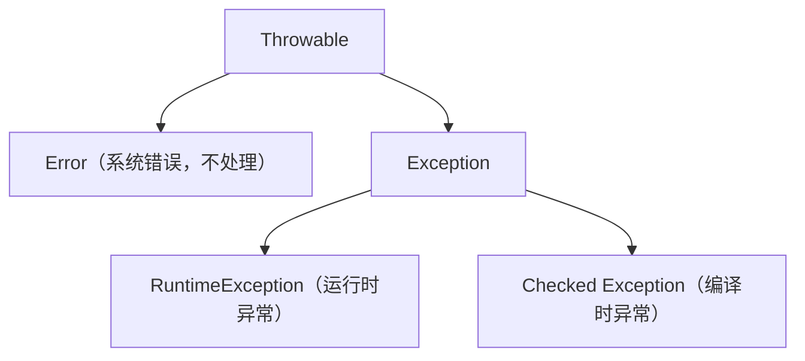

# 第二部分：Java 核心语法

## 2.1 本章目标

读完本章后，你应该能：

1. 声明 Java 变量并理解基本类型和包装类型的区别
2. 使用 String 完成常见操作，避免空指针
3. 写出条件判断、循环、方法定义
4. 定义类、创建对象、使用构造方法
5. 理解封装、继承、多态在 Java 中的具体写法
6. 区分接口和抽象类，知道什么时候用哪个
7. 理解 static、final、访问修饰符的含义
8. 区分重载和重写
9. 写出 try-catch 处理异常
10. 看懂泛型代码并写出简单的泛型方法

---

## 2.2 为什么需要学习这一章

Java 的语法规则比 TypeScript 和 Python 更多、更严格。本章只讲**你会在 Spring Boot 项目中反复遇到的语法**，不讲边缘特性。

**核心心态：** Java 的啰嗦不是缺点，是设计选择。理解它为什么这样设计，比记住语法更重要。

---

## 2.3 变量、基本类型、包装类型

### 2.3.1 声明变量的铁律

Java 声明变量时必须写类型，没有例外：

```java
// 格式：类型 变量名 = 值;
int age = 25;
String name = "Alice";
boolean isActive = true;
double price = 19.99;
```

**对比：**

```typescript
// TypeScript：类型可选
let age = 25;           // 自动推断
let name: string;       // 也可以不赋值
```

```python
# Python：不需要类型
age = 25
name = "Alice"
```

### 2.3.2 八种基本类型

Java 有 8 种基本类型（primitive types），它们**不是对象**，直接存值：

| 类型 | 大小 | 范围 | 例子 | JS/TS 类比 |
|------|------|------|------|-----------|
| `byte` | 1 字节 | -128 ~ 127 | `byte b = 100;` | 无直接对应 |
| `short` | 2 字节 | -32768 ~ 32767 | `short s = 1000;` | 无直接对应 |
| `int` | 4 字节 | ±21 亿 | `int i = 42;` | `number`（但 JS 没有精度区分） |
| `long` | 8 字节 | 很大 | `long l = 100L;` | `BigInt`（近似） |
| `float` | 4 字节 | 单精度 | `float f = 3.14f;` | `number` |
| `double` | 8 字节 | 双精度 | `double d = 3.14;` | `number` |
| `boolean` | — | true/false | `boolean b = true;` | `boolean` |
| `char` | 2 字节 | 单个 Unicode 字符 | `char c = 'A';` | 无直接对应（JS 字符串） |

**日常开发中，你只需要记住这 4 个：**

- `int` — 整数
- `long` — 大整数（比如数据库 ID）
- `double` — 小数
- `boolean` — 真假

### 2.3.3 包装类型（Wrapper）

每个基本类型都有一个对应的**包装类**（首字母大写），它们是对象：

| 基本类型 | 包装类 | 什么时候用包装类 |
|----------|--------|-----------------|
| `int` | `Integer` | 数据库字段可能为 null 时 |
| `long` | `Long` | 同上 |
| `double` | `Double` | 同上 |
| `boolean` | `Boolean` | 同上 |
| `char` | `Character` | 很少用 |

**实际开发中的选择原则：**

```java
// Entity（数据库实体）中：用包装类型，因为数据库字段可能为 NULL
public class User {
    private Long id;        // Long，不是 long
    private Integer age;    // Integer，不是 int
    private String name;    // String 本身就是引用类型，没有基本类型
}

// 方法局部变量：用基本类型，性能更好
public int calculate(int a, int b) {
    return a + b;
}
```

**自动装箱/拆箱：** Java 会自动在基本类型和包装类型之间转换，你一般不需要关心。

```java
Integer num = 42;     // 自动装箱：int → Integer
int value = num;      // 自动拆箱：Integer → int
```

**但要注意：** 自动拆箱时如果包装类是 `null`，会抛出 `NullPointerException`：

```java
Integer count = null;
int x = count;  // ❌ 运行时 NullPointerException！
```

### 2.3.4 类型默认值

| 场景 | 基本类型默认值 | 引用类型默认值 |
|------|--------------|--------------|
| 局部变量 | **没有默认值，必须初始化** | **没有默认值，必须初始化** |
| 类的字段 | `int` → 0, `boolean` → false | `null` |

```java
public class Example {
    int age;          // 默认 0
    String name;      // 默认 null

    public void test() {
        int x;        // 编译错误！局部变量必须初始化
        // System.out.println(x);  // 不允许
    }
}
```

---

## 2.4 String 及常用操作

### 2.4.1 String 是对象

Java 的 `String` 不是基本类型，是引用类型。但你可以像基本类型一样使用它：

```java
String name = "Alice";  // 双引号，不是单引号
```

| 操作 | TypeScript | Python | Java |
|------|-----------|--------|------|
| 拼接 | `` `Hello ${name}` `` | `f"Hello {name}"` | `"Hello " + name` 或 `String.format()` |
| 长度 | `str.length` | `len(str)` | `str.length()` |
| 判等 | `str === "hello"` | `str == "hello"` | `str.equals("hello")` |
| 包含 | `str.includes("he")` | `"he" in str` | `str.contains("he")` |
| 取子串 | `str.slice(0, 3)` | `str[0:3]` | `str.substring(0, 3)` |
| 替换 | `str.replace("a", "b")` | `str.replace("a", "b")` | `str.replace("a", "b")` |
| 分割 | `str.split(",")` | `str.split(",")` | `str.split(",")` |
| 去空格 | `str.trim()` | `str.strip()` | `str.trim()` |
| 转大写 | `str.toUpperCase()` | `str.upper()` | `str.toUpperCase()` |

### 2.4.2 字符串判等：Java 最大的坑

```java
String a = "hello";
String b = "hello";
String c = new String("hello");

System.out.println(a == b);       // true（字符串常量池）
System.out.println(a == c);       // false（不同对象！）
System.out.println(a.equals(c));  // true（值相等）
```

**铁律：** Java 中判断字符串值是否相等，永远用 `equals()`，不要用 `==`。

`==` 比较的是内存地址（引用是否相同），`equals()` 比较的是值。

```typescript
// TypeScript 没有这个坑
const a = "hello";
const b = "hello";
console.log(a === b);  // true，永远比较值
```

### 2.4.3 String 是不可变的

```java
String name = "Alice";
name = name + " Smith";  // 不是修改原字符串，而是创建了新字符串
```

每次对 String 的修改都会创建新对象。在循环中拼接大量字符串时，使用 `StringBuilder`：

```java
// ❌ 低效：每次循环创建新 String
String result = "";
for (int i = 0; i < 1000; i++) {
    result += i;
}

// ✅ 高效
StringBuilder sb = new StringBuilder();
for (int i = 0; i < 1000; i++) {
    sb.append(i);
}
String result = sb.toString();
```

---

## 2.5 null 与空指针问题

### 2.5.1 null 是什么

Java 的 `null` 表示"没有指向任何对象"。它和 TypeScript 的 `null` 类似，但**没有 `undefined`**。

```java
String name = null;  // 合法
// name.length();    // ❌ 运行时 NullPointerException
```

### 2.5.2 空指针是 Java 最常见的运行时错误

```java
// Entity 从数据库查出来的字段可能为 null
User user = userMapper.findById(1L);
String city = user.getAddress().getCity();  
// 如果 address 为 null → NullPointerException
```

**防御方式：**

```java
// 方式一：逐层判空（啰嗦但安全）
if (user != null && user.getAddress() != null) {
    String city = user.getAddress().getCity();
}

// 方式二：使用 Optional（Java 8+）
String city = Optional.ofNullable(user)
    .map(User::getAddress)
    .map(Address::getCity)
    .orElse("未知");
```

### 2.5.3 null 和基本类型的冲突

```java
// 数据库 Entity 中，用包装类型表示"可能为 null 的字段"
public class User {
    private Long id;       // Long 可以为 null
    private Integer age;   // Integer 可以为 null
    private int score;     // ❌ 基本类型 int 不能为 null，默认 0
}
```

**原则：** Entity 中可能为 null 的字段用包装类型，必填字段可以用基本类型。

---

## 2.6 条件判断和循环

### 2.6.1 条件判断

Java 的条件判断和 TypeScript 基本一样，但条件必须是 `boolean`：

```java
// ✅ 正确
int age = 18;
if (age >= 18) {
    System.out.println("成年");
} else if (age >= 12) {
    System.out.println("青少年");
} else {
    System.out.println("儿童");
}
```

**关键区别：** Java 不会自动把其他类型转为 boolean：

```java
int count = 0;
// if (count) { ... }       // ❌ 编译错误！int 不能当 boolean
if (count > 0) { ... }      // ✅ 必须写比较表达式

String name = null;
// if (name) { ... }        // ❌ 编译错误！
if (name != null) { ... }   // ✅ 必须显式判空
```

```typescript
// TypeScript 可以（但通常不推荐）
let count = 0;
if (count) { }  // 可以，0 是 falsy
```

```python
# Python 可以
count = 0
if count:  # 可以，0 是 falsy
    pass
```

### 2.6.2 switch

```java
String day = "周一";
switch (day) {
    case "周一":
        System.out.println("开始工作");
        break;  // 别忘了 break！否则会"穿透"到下一个 case
    case "周六":
    case "周日":  // 多个 case 可以合并
        System.out.println("休息");
        break;
    default:
        System.out.println("工作日");
}
```

Java 14+ 可以用更简洁的 switch 表达式：

```java
String result = switch (day) {
    case "周一" -> "开始工作";
    case "周六", "周日" -> "休息";
    default -> "工作日";
};
```

### 2.6.3 循环

Java 的循环和 TypeScript 几乎一样，就是多了类型声明：

```java
// for 循环
for (int i = 0; i < 10; i++) {
    System.out.println(i);
}

// 增强 for（类似 for...of）
String[] names = {"Alice", "Bob", "Charlie"};
for (String name : names) {
    System.out.println(name);
}

// while 循环
int count = 0;
while (count < 5) {
    System.out.println(count);
    count++;
}
```

---

## 2.7 方法、参数、返回值

### 2.7.1 方法定义

Java 的"方法"就是 TypeScript 的"函数"、Python 的"def"。但 Java 的方法必须在类里。

```java
public class Calculator {
    // 访问修饰符 返回类型 方法名(参数类型 参数名, ...) { }
    public int add(int a, int b) {
        return a + b;
    }

    // void 表示无返回值（类似 TypeScript 的 void、Python 的 None）
    public void printResult(int result) {
        System.out.println("结果是：" + result);
    }
}
```

**三处必须写类型（这是 Java 最啰嗦的地方）：**

| 位置 | 必须写什么 | 类比 |
|------|-----------|------|
| 参数 | 类型 + 名称 | TS: `(a: number)` 也有类型 |
| 返回值 | 返回类型 | TS: `: number` 也有类型 |
| 变量 | 类型 | TS: `let a: number` 可选 |

### 2.7.2 方法重载（Overload）

同一个方法名，可以定义多个版本，参数不同：

```java
public class Printer {
    public void print(String text) {
        System.out.println(text);
    }

    public void print(int number) {
        System.out.println("数字：" + number);
    }

    public void print(String text, int times) {
        for (int i = 0; i < times; i++) {
            System.out.println(text);
        }
    }
}

// 使用
Printer p = new Printer();
p.print("Hello");           // 调用第一个
p.print(42);                // 调用第二个
p.print("Hi", 3);           // 调用第三个
```

**TypeScript 没有真正的重载，** 只能用联合类型模拟：

```typescript
class Printer {
    print(input: string | number, times?: number) { }
}
```

### 2.7.3 可变参数

```java
public int sum(int... numbers) {  // int... 表示可变参数
    int total = 0;
    for (int n : numbers) {
        total += n;
    }
    return total;
}

sum(1, 2, 3);       // 6
sum(1, 2, 3, 4, 5); // 15
```

类比 TypeScript 的 rest 参数：`function sum(...numbers: number[])`

---

## 2.8 类、对象和构造方法

### 2.8.1 定义一个类

```java
// 文件：User.java
public class User {
    // 字段（属性）
    private Long id;
    private String name;
    private Integer age;

    // 构造方法（constructor）
    public User(Long id, String name, Integer age) {
        this.id = id;
        this.name = name;
        this.age = age;
    }

    // 无参构造方法（Java 默认提供，但如果你写了有参构造，就需要手动加）
    public User() {
    }

    // Getter 和 Setter
    public Long getId() {
        return id;
    }

    public void setId(Long id) {
        this.id = id;
    }

    public String getName() {
        return name;
    }

    public void setName(String name) {
        this.name = name;
    }

    public Integer getAge() {
        return age;
    }

    public void setAge(Integer age) {
        this.age = age;
    }
}
```

**对比三种语言：**

```typescript
// TypeScript
class User {
    constructor(
        public id: number,
        public name: string,
        public age: number
    ) {}
}
```

```python
# Python（使用 dataclass）
from dataclasses import dataclass

@dataclass
class User:
    id: int
    name: str
    age: int
```

Java 的 getter/setter 非常啰嗦。**实际开发中，你使用 Lombok 库来简化：**

```java
import lombok.Data;

@Data  // 自动生成 getter、setter、toString、equals、hashCode
public class User {
    private Long id;
    private String name;
    private Integer age;
}
```

### 2.8.2 创建对象

```java
// Java：必须用 new 关键字
User user = new User(1L, "Alice", 25);
User user2 = new User();  // 用无参构造

// 对比 TypeScript
const user = new User(1, "Alice", 25);

// 对比 Python
user = User(1, "Alice", 25)
```

### 2.8.3 this 关键字

```java
public class User {
    private String name;

    public void setName(String name) {
        this.name = name;  // this.name 是字段，name 是参数
    }
}
```

Java 的 `this` 和 TypeScript 的 `this` 作用相同，但 Java 的 `this` 不会丢失上下文（没有 JS 中 `this` 绑定的困扰）。

---

## 2.9 封装、继承和多态

### 2.9.1 封装

封装的核心是：**字段私有，方法公开。**

```java
public class BankAccount {
    private double balance;  // 字段私有，外部不能直接访问

    public double getBalance() {
        return balance;
    }

    public void deposit(double amount) {
        if (amount > 0) {
            balance += amount;
        }
    }

    public void withdraw(double amount) {
        if (amount > 0 && amount <= balance) {
            balance -= amount;
        }
    }
}
```

**为什么要这样写？** 因为 `balance` 不能随便改，必须通过 `deposit`/`withdraw` 方法来保证业务规则。

对比 TypeScript，很多人会用 `private` 关键字，但 JS 运行时其实没有真正的私有字段（除非用 `#`）。

### 2.9.2 继承

```java
// 父类
public class Animal {
    protected String name;

    public Animal(String name) {
        this.name = name;
    }

    public void eat() {
        System.out.println(name + " 在吃东西");
    }
}

// 子类
public class Dog extends Animal {  // extends 关键字
    public Dog(String name) {
        super(name);  // 调用父类构造方法
    }

    @Override  // 注解：表示重写父类方法
    public void eat() {
        System.out.println(name + " 在吃狗粮");
    }

    public void bark() {
        System.out.println(name + " 汪汪叫");
    }
}
```

**使用：**

```java
Dog dog = new Dog("旺财");
dog.eat();   // 旺财 在吃狗粮
dog.bark();  // 旺财 汪汪叫

// 多态：父类引用指向子类对象
Animal animal = new Dog("小黑");
animal.eat();   // 小黑 在吃狗粮（调用的是 Dog 的 eat）
// animal.bark();  // ❌ 编译错误！Animal 类型没有 bark 方法
```

**关键区别：** Java 是单继承，一个类只能有一个父类。这和 TypeScript/Python 相同（Python 支持多继承但实际很少用）。

### 2.9.3 多态

多态的核心：**同一个方法调用，根据实际对象类型执行不同的行为。**

```java
public class Main {
    public static void main(String[] args) {
        Animal[] animals = {
            new Dog("旺财"),
            new Cat("咪咪"),
            new Dog("小黑")
        };

        for (Animal animal : animals) {
            animal.eat();  // 每个动物调用自己的 eat 方法
        }
    }
}
```

输出：

```
旺财 在吃狗粮
咪咪 在吃猫粮
小黑 在吃狗粮
```

---

## 2.10 接口与实现类

### 2.10.1 接口是什么

接口定义了一组方法签名，不提供实现。它和 TypeScript 的 `interface` 类似，但更强大。

```java
// 定义接口
public interface PaymentService {
    void pay(String orderId, double amount);
    boolean refund(String orderId);
}
```

```java
// 实现接口
public class AlipayPaymentService implements PaymentService {
    @Override
    public void pay(String orderId, double amount) {
        System.out.println("支付宝支付：" + orderId + "，金额：" + amount);
    }

    @Override
    public boolean refund(String orderId) {
        System.out.println("支付宝退款：" + orderId);
        return true;
    }
}
```

### 2.10.2 接口 vs 抽象类

这是 Java 面试高频题，但实际开发中很好区分：

| 特性 | 接口（interface） | 抽象类（abstract class） |
|------|------------------|------------------------|
| 关键字 | `implements` | `extends` |
| 多实现 | 可以实现多个接口 | 只能继承一个 |
| 字段 | 只能有常量 | 可以有普通字段 |
| 方法 | 默认都是抽象的（Java 8+ 可以有 default 方法） | 可以有抽象方法，也可以有实现 |
| 构造方法 | 没有 | 有 |
| 使用场景 | "能做什么"（支付、发送消息） | "是什么"（动物、形状） |

**实际开发中：** 接口远比抽象类常用。在 Spring Boot 项目中，Service 通常定义为接口 + 实现类。

### 2.10.3 类比 NestJS

```typescript
// NestJS interface
interface PaymentService {
    pay(orderId: string, amount: number): void;
    refund(orderId: string): boolean;
}

// 实现
@Injectable()
class AlipayPaymentService implements PaymentService {
    pay(orderId: string, amount: number): void { }
    refund(orderId: string): boolean { return true; }
}
```

Java 和 TypeScript 的接口在概念上完全一致，区别在于：
- Java 接口在运行时存在（可以反射获取）
- TypeScript 接口在编译后就消失了

---

## 2.11 static、final

### 2.11.1 static

`static` 表示"属于类，不属于实例"。

```java
public class MathUtils {
    // 静态常量
    public static final double PI = 3.14159;

    // 静态方法：不需要创建对象就能调用
    public static int add(int a, int b) {
        return a + b;
    }
}

// 使用
double pi = MathUtils.PI;             // 类名.常量
int result = MathUtils.add(3, 5);     // 类名.方法
```

**类比 TypeScript：**

```typescript
class MathUtils {
    static readonly PI = 3.14159;
    static add(a: number, b: number): number { return a + b; }
}
```

### 2.11.2 final

`final` 表示"不可改变"：

| 用在哪里 | 含义 | 类比 |
|----------|------|------|
| 变量 | 常量，不能重新赋值 | `const` |
| 方法 | 不能被子类重写 | 没有直接对应 |
| 类 | 不能被继承 | 没有直接对应 |

```java
public final class StringUtils {  // 不能被继承
    private StringUtils() {}      // 私有构造，防止实例化

    public static final int MAX_LENGTH = 100;  // 常量

    public static boolean isEmpty(String str) {
        return str == null || str.isEmpty();
    }
}
```

**注意：** `final` 修饰引用类型时，引用不能变，但对象内容可以变：

```java
final List<String> list = new ArrayList<>();
list.add("hello");  // ✅ 可以修改内容
// list = new ArrayList<>();  // ❌ 不能重新赋值
```

---

## 2.12 public、private、protected

### 2.12.1 访问修饰符

| 修饰符 | 同类 | 同包 | 子类 | 任何地方 | 常用场景 |
|--------|------|------|------|----------|----------|
| `private` | ✅ | ❌ | ❌ | ❌ | Entity 字段 |
| （默认） | ✅ | ✅ | ❌ | ❌ | 很少用 |
| `protected` | ✅ | ✅ | ✅ | ❌ | 父类中给子类用的方法 |
| `public` | ✅ | ✅ | ✅ | ✅ | Controller、Service 方法 |

**实际开发中，你只需要记住：**

```java
public class User {
    private Long id;        // 字段：private
    private String name;    // 字段：private

    public Long getId() {   // getter：public
        return id;
    }

    public void setName(String name) {  // setter：public
        this.name = name;
    }
}
```

**对比 TypeScript：**

```typescript
class User {
    private id: number;      // 相同
    public name: string;     // 相同
    protected age: number;   // 相同
}
```

---

## 2.13 重载与重写

### 2.13.1 一张表区分

| | 重载（Overload） | 重写（Override） |
|------|-----------------|-----------------|
| 发生位置 | 同一个类 | 父子类之间 |
| 方法名 | 相同 | 相同 |
| 参数列表 | **必须不同** | 必须相同 |
| 返回类型 | 可以不同 | 相同或子类型 |
| 注解 | 不需要 | 建议加 `@Override` |
| 目的 | 提供多种调用方式 | 改变父类行为 |

### 2.13.2 重载示例

```java
public class Logger {
    public void log(String message) {
        System.out.println("[INFO] " + message);
    }

    public void log(String message, String level) {
        System.out.println("[" + level + "] " + message);
    }

    public void log(int code, String message) {
        System.out.println("[" + code + "] " + message);
    }
}
```

### 2.13.3 重写示例

```java
public class Parent {
    public void sayHello() {
        System.out.println("Hello from Parent");
    }
}

public class Child extends Parent {
    @Override  // 注解：告诉编译器这是重写，帮你在编译时检查
    public void sayHello() {
        System.out.println("Hello from Child");
    }
}
```

**`@Override` 注解的作用：** 如果你拼错了方法名，或者参数类型不匹配，编译器会报错。不加这个注解，就会悄悄变成"新方法"而不是"重写"。

---

## 2.14 异常处理

### 2.14.1 异常体系



**你只需要关心两类：**

| 类型 | 特点 | 例子 | 必须处理？ |
|------|------|------|-----------|
| RuntimeException | 运行时异常，可以预防 | NullPointerException | 不强制 |
| Checked Exception | 编译期异常，必须处理 | IOException | 必须 try-catch 或 throws |

### 2.14.2 try-catch-finally

```java
public class FileReader {
    public String readFile(String path) {
        try {
            // 可能出错的代码
            String content = java.nio.file.Files.readString(
                java.nio.file.Path.of(path)
            );
            return content;
        } catch (java.io.IOException e) {
            // 处理异常
            System.out.println("读取文件失败：" + e.getMessage());
            return null;
        } finally {
            // 无论是否异常，都会执行
            System.out.println("读取操作结束");
        }
    }
}
```

### 2.14.3 try-with-resources（自动关闭资源）

Java 7+ 的语法糖：

```java
// 传统写法：需要手动 close
BufferedReader reader = null;
try {
    reader = new BufferedReader(new FileReader("file.txt"));
    String line = reader.readLine();
} catch (IOException e) {
    e.printStackTrace();
} finally {
    if (reader != null) {
        try {
            reader.close();
        } catch (IOException e) {
            e.printStackTrace();
        }
    }
}

// try-with-resources：自动关闭
try (BufferedReader reader = new BufferedReader(new FileReader("file.txt"))) {
    String line = reader.readLine();
} catch (IOException e) {
    e.printStackTrace();
}
// reader 自动关闭，不需要 finally
```

### 2.14.4 在 Spring Boot 中的异常处理

后面章节会详细讲，这里先看一个预览：

```java
// Controller 中直接抛异常
@GetMapping("/user/{id}")
public User getUser(@PathVariable Long id) {
    User user = userService.findById(id);
    if (user == null) {
        throw new RuntimeException("用户不存在");  // 暂时这样写
    }
    return user;
}

// 全局异常处理器会统一捕获并返回 JSON
```

---

## 2.15 泛型

### 2.15.1 泛型是什么

泛型让代码可以处理多种类型，同时保持类型安全。它和 TypeScript 的泛型基本一样。

```java
// 没有泛型（Java 1.5 之前）
List list = new ArrayList();
list.add("hello");
list.add(123);  // 可以混放
String s = (String) list.get(0);  // 需要强制转换

// 有泛型
List<String> list = new ArrayList<>();
list.add("hello");
// list.add(123);  // ❌ 编译错误！
String s = list.get(0);  // 不需要强制转换
```

**对比 TypeScript：**

```typescript
// TypeScript 泛型
const list: string[] = ["hello"];
const first: string = list[0];
```

### 2.15.2 泛型方法

```java
// 定义一个泛型方法
public static <T> T getFirst(List<T> list) {
    if (list == null || list.isEmpty()) {
        return null;
    }
    return list.get(0);
}

// 使用
List<String> names = List.of("Alice", "Bob");
String first = getFirst(names);  // 自动推断 T = String

List<Integer> numbers = List.of(1, 2, 3);
Integer firstNum = getFirst(numbers);  // 自动推断 T = Integer
```

### 2.15.3 泛型类

```java
// 泛型类：统一的返回结构
public class Result<T> {
    private int code;
    private String message;
    private T data;  // 泛型字段

    public static <T> Result<T> success(T data) {
        Result<T> result = new Result<>();
        result.code = 200;
        result.message = "success";
        result.data = data;
        return result;
    }

    public static <T> Result<T> error(int code, String message) {
        Result<T> result = new Result<>();
        result.code = code;
        result.message = message;
        return result;
    }

    // getter / setter 省略
}
```

**使用：**

```java
// Controller 中
@GetMapping("/user/{id}")
public Result<User> getUser(@PathVariable Long id) {
    User user = userService.findById(id);
    return Result.success(user);
}

@GetMapping("/users")
public Result<List<User>> getUsers() {
    List<User> users = userService.findAll();
    return Result.success(users);
}
```

### 2.15.4 泛型擦除

Java 的泛型在编译后会"擦除"，运行时不存在泛型信息。这是 Java 泛型最大的限制。

```java
List<String> stringList = new ArrayList<>();
List<Integer> intList = new ArrayList<>();

// 运行时，两个都是 ArrayList，泛型信息消失了
System.out.println(stringList.getClass() == intList.getClass());  // true
```

**对比 TypeScript：** TypeScript 的泛型也是编译期擦除，这点两者一致。

**这意味着：** 你不能在运行时判断泛型类型，比如 `if (data instanceof List<String>)` 是无效的。

---

## 2.16 完整代码示例：一个简单用户管理系统

把前面学的语法串起来，写一个完整的可运行示例：

```java
// 文件：UserManager.java
import java.util.ArrayList;
import java.util.List;
import java.util.Optional;

public class UserManager {
    // 模拟数据库
    private final List<User> users = new ArrayList<>();
    private long nextId = 1;

    // 创建用户
    public User createUser(String name, Integer age) {
        if (name == null || name.isEmpty()) {
            throw new IllegalArgumentException("用户名不能为空");
        }
        User user = new User(nextId++, name, age);
        users.add(user);
        return user;
    }

    // 查找用户
    public Optional<User> findById(Long id) {
        for (User user : users) {
            if (user.getId().equals(id)) {
                return Optional.of(user);
            }
        }
        return Optional.empty();
    }

    // 按名称搜索
    public List<User> searchByName(String keyword) {
        List<User> result = new ArrayList<>();
        for (User user : users) {
            if (user.getName().contains(keyword)) {
                result.add(user);
            }
        }
        return result;
    }

    // 删除用户
    public boolean deleteUser(Long id) {
        return users.removeIf(user -> user.getId().equals(id));
    }

    // 统计
    public int getUserCount() {
        return users.size();
    }

    // 内部类：用户实体
    public static class User {
        private final Long id;
        private String name;
        private Integer age;

        public User(Long id, String name, Integer age) {
            this.id = id;
            this.name = name;
            this.age = age;
        }

        public Long getId() { return id; }
        public String getName() { return name; }
        public void setName(String name) { this.name = name; }
        public Integer getAge() { return age; }
        public void setAge(Integer age) { this.age = age; }

        @Override
        public String toString() {
            return "User{id=" + id + ", name='" + name + "', age=" + age + "}";
        }
    }

    // 运行测试
    public static void main(String[] args) {
        UserManager manager = new UserManager();

        // 创建用户
        User alice = manager.createUser("Alice", 25);
        User bob = manager.createUser("Bob", 30);
        manager.createUser("Charlie", 28);

        System.out.println("总用户数：" + manager.getUserCount());

        // 查找用户
        Optional<User> found = manager.findById(alice.getId());
        found.ifPresent(user -> System.out.println("找到：" + user));

        // 搜索
        List<User> results = manager.searchByName("li");
        System.out.println("搜索 'li' 结果数：" + results.size());

        // 删除
        manager.deleteUser(bob.getId());
        System.out.println("删除后总用户数：" + manager.getUserCount());
    }
}
```

**编译运行：**

```bash
javac UserManager.java
java UserManager
```

**输出：**

```
总用户数：3
找到：User{id=1, name='Alice', age=25}
搜索 'li' 结果数：2
删除后总用户数：2
```

---

## 2.17 在 Spring Boot 项目中的实际位置

| 语法知识 | 在 Spring Boot 中的位置 |
|----------|----------------------|
| 类、字段、构造方法 | Entity 类、DTO 类 |
| getter/setter | Entity 和 DTO 的基本写法（或用 Lombok `@Data`） |
| 接口 + 实现类 | Service 接口 + ServiceImpl |
| 泛型 | `Result<T>` 统一返回结构 |
| 异常处理 | 全局异常处理器 `@ControllerAdvice` |
| 方法重写 | `@Override` 标记重写接口方法 |
| static | 工具类方法（如 `JwtUtil.generateToken()`） |
| final | 常量定义、不可变配置 |
| private/public | Entity 字段 private，Controller 方法 public |

---

## 2.18 常见错误

### 错误一：用 == 比较字符串

```java
String input = "hello";
if (input == "hello") {  // ❌ 可能出错
    // ...
}

// 正确：
if ("hello".equals(input)) {  // 常量放前面，防止 NPE
    // ...
}
```

### 错误二：忘了初始化局部变量

```java
public void test() {
    int x;
    System.out.println(x);  // ❌ 编译错误
}
```

### 错误三：switch 忘了 break

```java
switch (day) {
    case "周一":
        System.out.println("工作日");
        // 忘了 break，会继续执行下一个 case
    case "周六":
        System.out.println("周末");
        break;
}
// 输入"周一"会输出两行！
```

### 错误四：对 null 拆箱

```java
Integer count = null;
int x = count;  // ❌ NullPointerException
```

### 错误五：在 static 方法中访问非 static 字段

```java
public class Example {
    private String name;  // 非 static 字段

    public static void print() {
        System.out.println(name);  // ❌ 编译错误
    }
}
```

---

## 2.19 调试与排查方法

### 编译错误

编译错误是最容易修的，IDE 会在你写代码时标红。

```bash
javac MyFile.java
# 仔细看错误信息，通常指明了行号和原因
```

### 运行时异常

```java
// 添加 try-catch 打印堆栈
try {
    // 可能出错的代码
} catch (Exception e) {
    e.printStackTrace();  // 打印完整堆栈，定位问题
}
```

### 读懂异常堆栈

```
Exception in thread "main" java.lang.NullPointerException
    at com.example.service.UserService.getUser(UserService.java:25)  ← 这里出错
    at com.example.controller.UserController.getUser(UserController.java:15)
    at java.base/jdk.internal.reflect.NativeMethodAccessorImpl.invoke0(Native Method)
```

**从下往上看：** 最上面是出错位置，往下是调用链。找到你自己写的代码（不是 JDK 内部的），那里就是问题根源。

---

## 2.20 三道小练习

### 练习 1：字符串处理

写一个方法 `formatName`，输入 `firstName` 和 `lastName`，返回 `"LastName, FirstName"` 格式。如果任一参数为 null 或空字符串，抛出 `IllegalArgumentException`。

### 练习 2：泛型方法

写一个泛型方法 `findDuplicate`，输入一个 `List<T>`，返回第一个重复出现的元素。如果没有重复，返回 `null`。

### 练习 3：类设计

设计一个 `Task` 类和 `TaskManager` 类：

- `Task`：id（Long）、title（String）、completed（boolean）、createdAt（LocalDateTime）
- `TaskManager`：
  - `addTask(String title)`：创建并返回 Task
  - `completeTask(Long id)`：标记为完成
  - `getPendingTasks()`：返回所有未完成的 Task
  - `getTaskCount()`：返回总任务数

---

## 2.21 参考答案

### 练习 1

```java
public static String formatName(String firstName, String lastName) {
    if (firstName == null || firstName.isEmpty()) {
        throw new IllegalArgumentException("firstName 不能为空");
    }
    if (lastName == null || lastName.isEmpty()) {
        throw new IllegalArgumentException("lastName 不能为空");
    }
    return lastName + ", " + firstName;
}
```

### 练习 2

```java
public static <T> T findDuplicate(List<T> list) {
    for (int i = 0; i < list.size(); i++) {
        for (int j = i + 1; j < list.size(); j++) {
            if (list.get(i).equals(list.get(j))) {
                return list.get(i);
            }
        }
    }
    return null;
}
```

### 练习 3

```java
import java.time.LocalDateTime;
import java.util.ArrayList;
import java.util.List;

public class TaskManager {
    private final List<Task> tasks = new ArrayList<>();
    private long nextId = 1;

    public Task addTask(String title) {
        Task task = new Task(nextId++, title, false, LocalDateTime.now());
        tasks.add(task);
        return task;
    }

    public boolean completeTask(Long id) {
        for (Task task : tasks) {
            if (task.getId().equals(id)) {
                task.setCompleted(true);
                return true;
            }
        }
        return false;
    }

    public List<Task> getPendingTasks() {
        List<Task> pending = new ArrayList<>();
        for (Task task : tasks) {
            if (!task.isCompleted()) {
                pending.add(task);
            }
        }
        return pending;
    }

    public int getTaskCount() {
        return tasks.size();
    }

    public static class Task {
        private final Long id;
        private final String title;
        private boolean completed;
        private final LocalDateTime createdAt;

        public Task(Long id, String title, boolean completed, LocalDateTime createdAt) {
            this.id = id;
            this.title = title;
            this.completed = completed;
            this.createdAt = createdAt;
        }

        public Long getId() { return id; }
        public String getTitle() { return title; }
        public boolean isCompleted() { return completed; }
        public void setCompleted(boolean completed) { this.completed = completed; }
        public LocalDateTime getCreatedAt() { return createdAt; }
    }
}
```

---

## 2.22 本章速查表

| 语法 | Java | TypeScript | Python |
|------|------|------------|--------|
| 声明变量 | `int x = 1;` | `let x = 1;` | `x = 1` |
| 常量 | `final int X = 1;` | `const X = 1;` | `X = 1`（约定大写） |
| 字符串判等 | `a.equals(b)` | `a === b` | `a == b` |
| 空值 | `null` | `null` / `undefined` | `None` |
| 方法定义 | `int add(int a, int b)` | `add(a: number, b: number): number` | `def add(a: int, b: int) -> int` |
| 类 | `class Dog extends Animal` | `class Dog extends Animal` | `class Dog(Animal)` |
| 接口 | `interface PaymentService` | `interface PaymentService` | `class PaymentService(ABC)` |
| 泛型 | `List<String>` | `Array<string>` | `list[str]` |
| 异常 | `try { } catch (Exception e) { }` | `try { } catch (e) { }` | `try: except Exception as e:` |
| 构造方法 | `public User() { }` | `constructor() { }` | `def __init__(self)` |

---

## 2.23 是否需要深入学习

本章所有内容**必须掌握**。这是写任何 Java 代码的基础。

建议：

1. 动手写一遍 UserManager 的完整代码
2. 完成三道练习
3. 重点记住：`equals` 而不是 `==`、局部变量必须初始化、null 安全处理
4. 泛型部分理解即可，后面章节会大量使用，自然就会熟悉

**准备好了吗？** 继续阅读 [第三章：Java 常用数据结构 →](./java-data-structures)