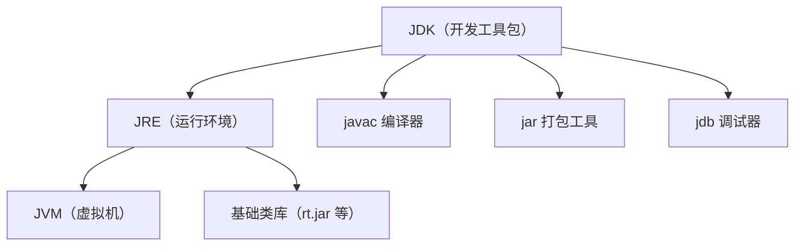

# 第一部分：Java 去陌生化

## 1.1 本章目标

读完本章后，你应该能：

1. 说清楚 JDK、JRE、JVM 是什么，以及它们和 Node.js / Python 的对应关系
2. 理解 Java 的"编写 → 编译 → 运行"流程
3. 知道 Java 相对于 TypeScript 和 Python 的核心差异
4. 理解编译期检查和运行期检查的区别
5. 看懂一个真实 Java 项目的目录结构
6. 在电脑上安装 JDK 并跑通第一个 Java 程序

---

## 1.2 为什么需要学习这一章

很多前端开发者看到 Java 项目的第一反应是：

> "这目录怎么这么多层？pom.xml 是干嘛的？怎么还有编译？为什么不能直接跑？"

本章的目标就是**消除这种陌生感**。你不会在这里学到任何复杂语法，但你会建立一张"Java 世界的地图"——知道每个东西叫什么、放在哪里、起什么作用。

---

## 1.3 Java、JDK、JRE、JVM 分别是什么

这是 Java 新手最容易混淆的概念。我们用 Node.js 和 Python 来类比。

### 1.3.1 四种角色的类比

| Java 概念 | 全称 | Node.js 类比 | Python 类比 | 一句话解释 |
|-----------|------|-------------|------------|-----------|
| **JVM** | Java Virtual Machine | V8 引擎 | CPython 解释器 | 真正"执行代码"的东西 |
| **JRE** | Java Runtime Environment | Node.js 运行时（不含 npm） | Python 解释器 + 标准库 | JVM + 基础类库，只负责"运行" |
| **JDK** | Java Development Kit | Node.js + npm + TypeScript 编译器 | Python + pip + 标准库 | JRE + 开发工具（编译、打包、调试） |
| **Java 语言** | Java Language | JavaScript/TypeScript 语言 | Python 语言 | 语法规范本身 |

**更直观的理解：**



- **JVM** 在最底层，负责把字节码翻译成机器码执行
- **JRE** 包含 JVM + 基础类库，用户电脑上只需要装 JRE 就能运行 Java 程序
- **JDK** 包含 JRE + 开发工具，开发者需要装 JDK

### 1.3.2 具体对应关系

当你写 Node.js 时：

```bash
node index.js     # node 是运行时（相当于 JRE）
npm install xxx   # npm 是包管理（相当于 Maven/Gradle）
tsc index.ts      # tsc 是编译器（相当于 javac）
```

当你写 Java 时：

```bash
java Main         # java 命令启动 JVM 运行 .class 文件（相当于 node index.js）
javac Main.java   # javac 编译 .java → .class（相当于 tsc index.ts）
mvn compile       # Maven 管理依赖 + 编译（相当于 npm install && tsc）
```

**关键区别：** Node.js 的 `node` 命令可以直接跑 `.js` 文件，但 Java 的 `java` 命令只能跑编译后的 `.class` 文件。Java 必须先编译再运行。

---

## 1.4 Java 项目如何编译和运行

### 1.4.1 三阶段对比

| 阶段 | TypeScript | Python | Java |
|------|-----------|--------|------|
| 编写 | `index.ts` | `main.py` | `Main.java` |
| 编译 | `tsc index.ts` → `index.js` | 不需要（解释执行） | `javac Main.java` → `Main.class` |
| 运行 | `node index.js` | `python main.py` | `java Main` |

### 1.4.2 一个完整流程

**第一步：编写源代码**

```java
// 文件：Main.java
public class Main {
    public static void main(String[] args) {
        System.out.println("Hello, Java!");
    }
}
```

**第二步：编译**

```bash
javac Main.java
```

编译成功后，当前目录会生成 `Main.class` 文件。这个文件里的内容是**字节码（bytecode）**，不是机器码，也不是源代码。

**第三步：运行**

```bash
java Main
```

输出：

```
Hello, Java!
```

### 1.4.3 字节码是什么

字节码是 JVM 的"中间语言"。

| 语言 | 中间产物 | 谁执行 |
|------|---------|--------|
| TypeScript | JavaScript（编译后） | V8 引擎 |
| Python | `.pyc` 字节码（自动生成） | CPython 解释器 |
| Java | `.class` 字节码（手动编译） | JVM |

**Java 的"一次编写，到处运行"就是指：** 只要目标机器上有 JVM，同一个 `.class` 文件就能在 Windows、macOS、Linux 上运行，不需要重新编译。

### 1.4.4 类比可能失效的地方

- Python 的 `.pyc` 是解释器自动生成的缓存，你一般不需要关心
- Java 的 `.class` 是必须手动编译的，没有 `.class` 就运行不了
- TypeScript 的 `tsc` 编译后还是文本（JS 代码），Java 的 `javac` 编译后是二进制字节码

---

## 1.5 Java 与 TypeScript、Python 的主要区别

### 1.5.1 一张表看懂

| 特性 | TypeScript | Python | Java |
|------|-----------|--------|------|
| 类型系统 | 结构化类型（structural） | 动态类型（duck typing） | 名义类型（nominal） |
| 类型检查时机 | 编译期 | 运行期 | 编译期 + 运行期 |
| 运行方式 | 通过 V8/Node.js | 解释执行 | JVM 执行字节码 |
| 面向对象 | 基于原型 + class 语法糖 | 一切皆对象 | 纯面向对象，一切在类里 |
| 函数 | 一等公民 | 一等公民 | 不是一等公民（需要 Lambda/接口封装） |
| 空值 | `null` / `undefined` | `None` | `null`（没有 undefined） |
| 泛型 | 编译期擦除 | 运行期保留（通过类型注解） | 编译期擦除 |
| 包管理 | npm/pnpm | pip/poetry | Maven/Gradle |
| 入口文件 | 任意 `.js`/`.ts` 文件 | 任意 `.py` 文件 | 必须是类的 `main` 方法 |
| 多线程 | Worker Threads | GIL 限制 | 原生多线程 |

### 1.5.2 三个最核心的差异

**差异一：一切都在类里**

```typescript
// TypeScript：函数可以独立存在
function greet(name: string): string {
    return `Hello, ${name}`;
}
console.log(greet("World"));
```

```python
# Python：函数可以独立存在
def greet(name: str) -> str:
    return f"Hello, {name}"

print(greet("World"))
```

```java
// Java：函数必须在类里，且必须用 static 修饰才能直接调用
public class Main {
    public static String greet(String name) {
        return "Hello, " + name;
    }

    public static void main(String[] args) {
        System.out.println(greet("World"));
    }
}
```

**差异二：必须声明类型**

```typescript
// TypeScript：类型注解是可选的（有类型推断）
let count = 0;          // 推断为 number
let name: string = "hello";
```

```python
# Python：类型注解完全可选
count = 0
name: str = "hello"
```

```java
// Java：类型声明是强制性的
int count = 0;              // 必须写 int
String name = "hello";      // 必须写 String
// count = "hello";         // 编译报错！类型不匹配
```

**差异三：没有 `undefined`**

```typescript
// TypeScript
let x: string | undefined = undefined;  // 可以
let y: string | null = null;            // 可以
```

```java
// Java：只有 null
String name = null;  // 可以
// 没有 undefined 这个概念
```

### 1.5.3 名义类型 vs 结构化类型

这是 TypeScript 和 Java 最根本的类型哲学差异。

```typescript
// TypeScript（结构化类型）：只要结构相同，就是同一类型
interface User {
    name: string;
    age: number;
}

interface Person {
    name: string;
    age: number;
}

const user: User = { name: "Alice", age: 30 };
const person: Person = user;  // ✅ 没问题！结构相同就可以
```

```java
// Java（名义类型）：名字不同就是不同类型，即使结构相同
public class User {
    public String name;
    public int age;
}

public class Person {
    public String name;
    public int age;
}

User user = new User();
Person person = user;  // ❌ 编译报错！User 和 Person 是不同的类型
```

**这意味着：** 在 Java 中，你不能随随便便把一个对象"当作"另一个类型用，必须显式转换或通过接口实现。

---

## 1.6 强类型、编译期检查和运行期检查

### 1.6.1 什么是编译期检查

编译期检查是指在编译阶段（javac）就能发现的错误。

```java
public class Main {
    public static void main(String[] args) {
        int age = "hello";  // ❌ 编译就报错：类型不兼容
    }
}
```

```bash
$ javac Main.java
Main.java:3: 错误: 不兼容的类型: String无法转换为int
        int age = "hello";
                  ^
1 个错误
```

**对比 TypeScript：**

```typescript
let age: number = "hello";  // ❌ tsc 编译报错
// 但如果你用 any 或 as 绕过，就能编译通过，运行时才会出错
```

**对比 Python：**

```python
age: int = "hello"  # ✅ 不会报错，类型注解只是提示
# 只有运行时用到 age 做数字运算时才会报错
```

### 1.6.2 编译期 vs 运行期检查

| 检查类型 | 发现时机 | Java | TypeScript | Python |
|----------|---------|------|------------|--------|
| 类型不匹配 | 编译期 | ✅ | ✅（严格模式） | ❌ |
| 方法不存在 | 编译期 | ✅ | ✅ | ❌（运行时 AttributeError） |
| 空指针 | 运行期 | ❌ | ❌（严格模式可部分检测） | ❌ |
| 数组越界 | 运行期 | ❌ | ❌ | ❌（运行时 IndexError） |
| 除零 | 运行期 | ❌ | ❌ | ❌（运行时 ZeroDivisionError） |

**Java 的编译期检查非常严格，但也不是万能的。** 空指针（NullPointerException）是 Java 最常见的运行时错误，因为编译器无法判断一个变量是否为 null。

### 1.6.3 为什么 Java 要这样设计

Java 的设计哲学是：**尽量在编译期发现问题，减少运行时崩溃。**

- 你写 TypeScript 时，可能用 `any` 绕过类型检查
- 你写 Python 时，类型注解只是"建议"
- 但在 Java 中，类型系统是"铁律"，编译器会严格执行

**代价：** 代码更啰嗦，你需要写更多类型声明。

**收益：** 重构大型项目时，编译器能帮你找到所有需要修改的地方，而不是靠运行测试来发现。

---

## 1.7 Java 项目的常见目录结构

### 1.7.1 一个标准 Spring Boot 项目

```
study-tracker/                     # 项目根目录
├── pom.xml                        # Maven 配置文件（相当于 package.json）
├── src/
│   ├── main/
│   │   ├── java/                  # Java 源代码
│   │   │   └── com/
│   │   │       └── example/
│   │   │           └── studytracker/
│   │   │               ├── StudyTrackerApplication.java  # 启动类
│   │   │               ├── controller/                   # 控制器层
│   │   │               │   ├── StudyController.java
│   │   │               │   └── AuthController.java
│   │   │               ├── service/                      # 服务层
│   │   │               │   ├── StudyService.java
│   │   │               │   └── impl/
│   │   │               │       └── StudyServiceImpl.java
│   │   │               ├── entity/                       # 实体类
│   │   │               │   ├── User.java
│   │   │               │   └── StudyRecord.java
│   │   │               ├── dto/                          # 数据传输对象
│   │   │               │   ├── StudyStartRequest.java
│   │   │               │   └── StudyRecordVO.java
│   │   │               ├── mapper/                       # 数据库映射
│   │   │               │   ├── UserMapper.java
│   │   │               │   └── StudyRecordMapper.java
│   │   │               ├── config/                       # 配置类
│   │   │               │   └── WebConfig.java
│   │   │               └── common/                       # 公共类
│   │   │                   ├── Result.java               # 统一返回结构
│   │   │                   └── GlobalExceptionHandler.java
│   │   └── resources/              # 配置文件
│   │       ├── application.yml     # 主配置文件（相当于 .env）
│   │       └── mapper/             # MyBatis XML 映射文件
│   │           └── StudyRecordMapper.xml
│   └── test/                       # 测试代码
│       └── java/
│           └── com/
│               └── example/
│                   └── studytracker/
│                       └── StudyTrackerApplicationTests.java
└── target/                         # 编译产物（相当于 dist/）
```

### 1.7.2 目录结构类比

| 概念 | Java | Node.js/NestJS | Python/FastAPI |
|------|------|---------------|----------------|
| 项目配置 | `pom.xml` | `package.json` | `pyproject.toml` |
| 源码目录 | `src/main/java/` | `src/` | `app/` 或 `src/` |
| 包路径 | `com.example.studytracker` | 文件夹路径 | `app.services` |
| 配置文件 | `src/main/resources/application.yml` | `.env` / `config/` | `.env` / `config.py` |
| 编译产物 | `target/` | `dist/` 或 `build/` | `__pycache__/` |
| 测试代码 | `src/test/java/` | `__tests__/` 或 `*.spec.ts` | `tests/` |

### 1.7.3 包路径为什么这么长

```java
package com.example.studytracker.controller;
```

对应目录结构：

```
src/main/java/com/example/studytracker/controller/
```

Java 的包名约定使用**反向域名**（如 `com.example`），这是为了在全局范围内避免命名冲突。就像 npm 的 `@scope/package-name` 一样。

**实际开发中：** 你用 IDE 创建项目时会自动生成，不需要手动敲这个路径。

---

## 1.8 IDE、JDK、Maven 分别负责什么

### 1.8.1 职责划分

| 工具 | 类比 | 负责什么 |
|------|------|----------|
| **IDE**（IntelliJ IDEA） | VS Code | 写代码、调试、代码提示、重构 |
| **JDK** | Node.js / Python 解释器 | 编译和运行 Java 程序 |
| **Maven** | npm / pnpm | 管理依赖、编译、打包、运行测试 |

### 1.8.2 三者如何协作

```
你写代码（IDE）→ Maven 下载依赖 → Maven 调用 javac 编译 → java 命令运行
```

**对比 Node.js 开发流程：**

```
你写代码（VS Code）→ npm 下载依赖 → tsc 编译 → node 运行
```

**对比 Python 开发流程：**

```
你写代码（VS Code）→ pip 下载依赖 → python 直接运行（无需编译）
```

### 1.8.3 你需要安装什么

| 工具 | 是否必须 | 说明 |
|------|----------|------|
| JDK 17+ | ✅ 必须 | 编译和运行的基础 |
| IntelliJ IDEA | ✅ 强烈推荐 | 免费的 Community 版足够，VS Code + Java 插件也可以，但体验差很多 |
| Maven | ✅ 必须 | 通常 IDEA 自带，但建议单独安装 |

---

## 1.9 创建并运行第一个 Java 项目

### 1.9.1 安装 JDK

**macOS：**

```bash
# 安装 Homebrew 后：
brew install openjdk@17

# 验证安装
java --version
# 输出：openjdk 17.0.x ...
javac --version
# 输出：javac 17.0.x ...
```

**Windows：** 去 [Oracle JDK](https://www.oracle.com/java/technologies/downloads/) 或 [Adoptium](https://adoptium.net/) 下载安装包。

### 1.9.2 用命令行创建第一个程序

```bash
# 创建项目目录
mkdir hello-java
cd hello-java

# 创建源文件
cat > Main.java << 'EOF'
public class Main {
    public static void main(String[] args) {
        System.out.println("Hello, Java!");
    }
}
EOF

# 编译
javac Main.java

# 运行
java Main
```

### 1.9.3 用 Maven 创建第一个项目

```bash
# 用 Maven 脚手架生成项目
mvn archetype:generate \
  -DgroupId=com.example \
  -DartifactId=hello-java \
  -DarchetypeArtifactId=maven-archetype-quickstart \
  -DarchetypeVersion=1.5 \
  -DinteractiveMode=false

# 进入项目
cd hello-java

# 编译
mvn compile

# 运行
mvn exec:java -Dexec.mainClass="com.example.App"
```

### 1.9.4 用 IntelliJ IDEA 创建项目

1. 打开 IntelliJ IDEA
2. New Project → Java → 选择 JDK 17
3. 不勾选"Add sample code"（我们手动写）
4. 在 `src/main/java` 下创建 `Main.java`：

```java
public class Main {
    public static void main(String[] args) {
        String name = "Java";
        System.out.println("Hello, " + name + "!");
    }
}
```

5. 右键 `Main.java` → Run 'Main.main()'
6. 底部控制台输出：`Hello, Java!`

### 1.9.5 常见错误排查

**错误一：`java: command not found`**

```bash
# 说明 JDK 没装或没配环境变量
# macOS：检查 /usr/libexec/java_home
/usr/libexec/java_home -V
# 如果没有输出，说明没装 JDK
```

**错误二：`javac: command not found`**

```bash
# 说明只装了 JRE 没装 JDK
# 确认安装的是 JDK 而不是 JRE
java --version  # 能运行不代表有 javac
```

**错误三：`类名与文件名不一致`**

```java
// 文件叫 Main.java
public class Hello {  // ❌ 错误！类名必须和文件名一致
    public static void main(String[] args) {
        System.out.println("Hello!");
    }
}
```

Java 强制要求：**public 类的名字必须和文件名一致。** 一个文件只能有一个 public 类。

**错误四：`找不到或无法加载主类`**

```bash
$ java Main.class
错误: 找不到或无法加载主类 Main.class
# 正确写法：java Main（不要加 .class）
```

---

## 1.10 本章速查表

| 概念 | 一句话 | 类比 |
|------|--------|------|
| JDK | 开发工具包 = JRE + 编译器 + 工具 | Node.js + npm + tsc |
| JRE | 运行环境 = JVM + 基础类库 | Node.js 运行时 |
| JVM | 虚拟机，执行字节码 | V8 引擎 |
| javac | 编译器 | tsc |
| java | 启动 JVM 运行程序 | node |
| `.java` | 源代码文件 | `.ts` / `.py` |
| `.class` | 编译后的字节码 | `.js`（编译后） |
| Maven | 包管理和构建工具 | npm / pnpm |
| pom.xml | 项目配置文件 | package.json |
| 包名 | 组织代码的命名空间 | npm scope |

---

## 1.11 三道小练习

### 练习 1：环境验证

在你的电脑上完成以下操作，并截图：

1. 运行 `java --version` 确认 JDK 已安装
2. 运行 `javac --version` 确认编译器可用
3. 创建一个 `Hello.java`，编译并运行

### 练习 2：概念匹配

将左侧 Java 概念与右侧 Node.js 概念连线：

| Java | Node.js |
|------|---------|
| JDK | A. npm |
| JVM | B. `tsc` |
| javac | C. Node.js 运行时 |
| Maven | D. V8 引擎 |
| JRE | E. Node.js + npm + tsc |

### 练习 3：项目结构识别

看下面的目录结构，回答：

```
my-project/
├── pom.xml
├── src/
│   ├── main/
│   │   ├── java/com/example/app/
│   │   │   ├── AppApplication.java
│   │   │   ├── controller/UserController.java
│   │   │   └── service/UserService.java
│   │   └── resources/application.yml
│   └── test/java/com/example/app/
└── target/
```

1. 项目的启动类是什么？
2. 配置文件在哪里？
3. 编译产物在哪个目录？
4. 如果要找处理用户登录的接口，应该去哪个文件？

---

## 1.12 参考答案

### 练习 1

略（需要实际操作）

### 练习 2

| Java | Node.js |
|------|---------|
| JDK | E. Node.js + npm + tsc |
| JVM | D. V8 引擎 |
| javac | B. `tsc` |
| Maven | A. npm |
| JRE | C. Node.js 运行时 |

### 练习 3

1. `AppApplication.java`
2. `src/main/resources/application.yml`
3. `target/`
4. `controller/UserController.java`（先看 Controller，再跟到 Service）

---

## 1.13 是否需要深入学习

本章内容**必须掌握**。下一章将开始学习 Java 核心语法，建议你：

- 确保环境已安装成功
- 对概念类比有个印象即可，不需要死记硬背
- 后续章节中会反复用到这些概念，自然会熟悉

**准备好了吗？** 继续阅读 [第二章：Java 核心语法 →](./java-core-syntax)