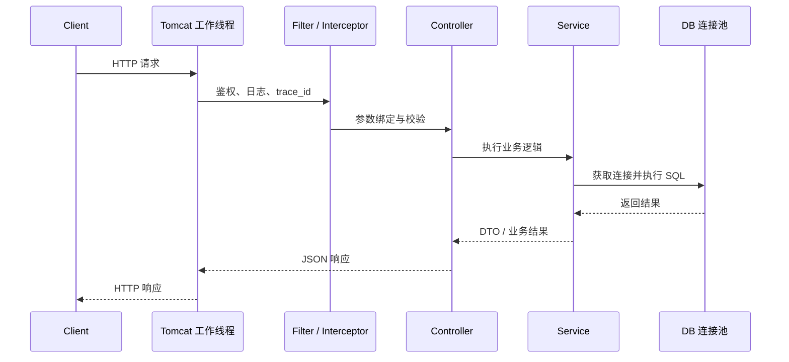

# JVM 与并发基础：给 Node、Python 开发者的 Java 运行模型

这篇接在 [Java 企业级进阶路线](./java-enterprise-path) 的阶段一后面。它不追求把 JVM 参数背完，而是解决一个更实际的问题：当一个 Spring Boot 接口变慢、卡死、内存上涨或偶发失败时，你知道该从线程、内存、GC、锁、连接池还是外部依赖开始查。

如果你来自 Node.js、NestJS、Python 或 FastAPI，先记住一句话：Java Web 服务默认不是“一个事件循环扛所有请求”，而是“请求进来后分配到线程池里的某个工作线程，由这个线程一路执行 Controller、Service、数据库和外部调用”。这会让 Java 的并发能力很强，也让线程数、连接池、锁和阻塞调用变成必须理解的工程边界。

## 你已有的心智，哪些能迁移

| 你熟悉的概念 | Java 中的对应物 | 迁移时要小心 |
|---|---|---|
| Node Event Loop | Servlet 容器工作线程、业务线程池 | Java 一个请求通常占一个线程；阻塞数据库调用会占住线程 |
| Promise / async-await | `CompletableFuture`、响应式框架、消息队列 | `CompletableFuture` 默认线程池不是魔法，阻塞任务要显式放到业务线程池 |
| FastAPI async endpoint | WebFlux / 虚拟线程 / 异步 Servlet | Spring MVC 默认仍是同步阻塞模型 |
| Python GIL 下的线程 | JVM 原生线程、虚拟线程 | Java 线程可以真正并行跑 CPU 任务，但也更容易把 CPU 打满 |
| NestJS Provider | Spring Bean | 单例 Bean 里的可变字段要特别小心线程安全 |

这篇默认讨论最常见的 Spring MVC + Tomcat + JDBC/MyBatis/JPA 组合。它也是企业 Java 项目里最容易遇到的基线。

## 一次请求在 Java 服务里怎样运行

典型链路如下：



这里最重要的是 Tomcat 工作线程。一个请求进入后，如果你的 Controller 里同步查数据库、调用第三方 API 或等待锁，这个线程就会一直被占用。线程被占满后，即使 CPU 还有空，新的请求也只能排队。

所以排查慢接口时不要只看“代码复杂不复杂”，要把等待时间拆开：

- 等线程：Tomcat 工作线程是否被占满。
- 等连接：数据库连接池、Redis 连接池是否被占满。
- 等锁：是否有 `synchronized`、分布式锁、数据库行锁竞争。
- 等外部服务：HTTP 调用是否有超时、重试和熔断。
- 等 GC：是否频繁 Stop-The-World 暂停。

Node 里你常问“有没有阻塞事件循环”，Java 里要问“有没有占住关键线程池”。

## JVM 内存：先抓住四块

不用一上来记所有区域，先理解这四块：

| 区域 | 放什么 | 常见问题 | 排查信号 |
|---|---|---|---|
| 堆 Heap | 业务对象、集合、DTO、缓存对象 | OOM、频繁 GC、内存泄漏 | `java.lang.OutOfMemoryError: Java heap space`、Old 区持续上涨 |
| 线程栈 Stack | 每个线程的方法调用帧、局部变量 | 栈溢出、线程过多占内存 | `StackOverflowError`、线程数异常上涨 |
| 元空间 Metaspace | 类元数据、动态代理类、反射生成类 | 类加载泄漏 | `OutOfMemoryError: Metaspace` |
| 直接内存 Direct Memory | NIO、Netty、文件/网络缓冲 | 容器内存被打爆但堆不高 | RSS 高于 heap 很多、容器 OOMKilled |

面试里常说“堆和栈区别”，工程里更重要的问法是：这个内存增长发生在 JVM 堆内，还是堆外？如果堆不高但容器被杀，继续调 `-Xmx` 没用，要看直接内存、线程栈、JNI 或本地缓存。

## GC 不是背算法，是看信号

GC 的目标不是“越少越好”，而是在吞吐、延迟和内存之间取平衡。一个后端接口最关心三类信号：

| 信号 | 可能含义 | 下一步 |
|---|---|---|
| Young GC 很频繁，但暂停很短 | 短命对象很多，可能正常 | 看 QPS、分配速率、接口是否大量创建临时大对象 |
| Old 区持续上涨，Full GC 后也下不来 | 长生命周期对象堆积或泄漏 | dump heap，看谁持有对象 |
| 单次 GC 暂停几百毫秒到数秒 | 用户请求会明显抖动 | 看 GC 日志、堆大小、对象晋升和大对象分配 |
| CPU 很高但业务吞吐没上去 | GC 线程在忙或锁竞争 | 同时看 GC 日志、线程 dump、CPU 火焰图 |

本地或测试环境常用命令：

```bash
jcmd <pid> VM.flags
jcmd <pid> GC.heap_info
jcmd <pid> Thread.print > thread-dump.txt
jcmd <pid> GC.class_histogram > class-histogram.txt
```

生产环境要遵守公司规范，尤其是 heap dump：它可能很大，也可能包含用户数据。能先看指标、GC 日志和线程 dump，就不要急着 dump 全量堆。

一个实用判断：如果接口整体延迟呈周期性尖刺，所有接口同时抖，很像 GC 或宿主机资源问题；如果只有某个接口慢，更可能是 SQL、锁、外部调用或这个接口创建了过多对象。

## 线程池：先定边界，再谈大小

Java 线程池最容易被误用的地方，是把它当成“异步就会更快”。线程池只能隔离和调度任务，不能消灭阻塞。

常见线程池包括：

- Tomcat 工作线程池：处理 HTTP 请求。
- 数据库连接池：限制同时访问数据库的连接数。
- 业务异步线程池：处理报表、通知、外部 API 调用等后台任务。
- 定时任务线程池：跑 `@Scheduled`。
- `CompletableFuture` 默认公共池：不建议承载业务阻塞任务。

### 安全 sizing 的边界

不要只套公式，先分清任务类型：

| 任务类型 | 线程数倾向 | 边界 |
|---|---|---|
| CPU 密集 | 接近 CPU 核数 | 线程太多只会增加上下文切换 |
| IO 密集 | 可以高于 CPU 核数 | 上限受数据库连接、外部 API、下游限流约束 |
| 混合任务 | 先小规模压测 | 看 CPU、队列长度、连接池等待、p95/p99 |

最危险的配置不是线程数小，而是“无限队列 + 无超时 + 无降级”。线程池满了以后任务无限堆积，用户看到的是服务越来越慢，最后内存也被撑爆。

建议业务线程池至少显式配置：

```java
@Bean
ThreadPoolTaskExecutor reportExecutor() {
    ThreadPoolTaskExecutor executor = new ThreadPoolTaskExecutor();
    executor.setThreadNamePrefix("report-");
    executor.setCorePoolSize(8);
    executor.setMaxPoolSize(16);
    executor.setQueueCapacity(200);
    executor.setAwaitTerminationSeconds(30);
    executor.initialize();
    return executor;
}
```

这段不是推荐所有项目都用 8/16/200，而是强调三个原则：命名、有限队列、可观测。真正的大小要结合压测和下游容量。

## 锁、可见性与线程安全

Spring Bean 默认是单例。单例本身没问题，但单例里的可变字段会被多个请求线程共享。

下面这种写法是错的：

```java
@Service
public class PriceService {
    private BigDecimal lastDiscount; // 多个请求共享，线程不安全

    public BigDecimal calculate(Order order) {
        lastDiscount = loadDiscount(order.userId());
        return order.amount().subtract(lastDiscount);
    }
}
```

应该把请求相关状态放在局部变量、方法参数、数据库、缓存或显式上下文里：

```java
@Service
public class PriceService {
    public BigDecimal calculate(Order order) {
        BigDecimal discount = loadDiscount(order.userId());
        return order.amount().subtract(discount);
    }
}
```

并发问题常见三类：

| 问题 | 例子 | 解决方向 |
|---|---|---|
| 原子性 | `count++` 被多个线程同时执行 | `AtomicInteger`、锁、数据库原子更新 |
| 可见性 | 一个线程改了状态，另一个线程迟迟看不到 | `volatile`、锁、线程安全容器、消息传递 |
| 有序性 | 编译器/CPU 重排导致读到半初始化状态 | 正确发布对象、避免双重检查锁误用 |

业务里更推荐“少共享”而不是“到处加锁”。能用局部变量就不用字段，能用数据库唯一索引保证幂等就不要在内存里自制全局锁，能把长流程拆成消息队列就不要让一个 HTTP 请求拿着锁跑很久。

更多事务和锁的业务视角见 [并发、事务与一致性](./concurrency-transaction) 与 [锁机制与并发控制](./locking)。

## CompletableFuture：异步不是把错误藏起来

`CompletableFuture` 很适合并行查多个慢依赖，例如商品、库存、优惠券三类接口。但它有三个常见坑：

- 没有指定业务线程池，任务跑到公共池。
- 只写成功路径，异常被包在 `CompletionException` 里。
- 没有整体超时，用户请求被拖住。

一个更稳的写法：

```java
@Service
public class CheckoutQueryService {
    private final Executor checkoutExecutor;
    private final ProductClient productClient;
    private final InventoryClient inventoryClient;

    public CheckoutQueryService(
            @Qualifier("checkoutExecutor") Executor checkoutExecutor,
            ProductClient productClient,
            InventoryClient inventoryClient) {
        this.checkoutExecutor = checkoutExecutor;
        this.productClient = productClient;
        this.inventoryClient = inventoryClient;
    }

    public CheckoutView load(String skuId) {
        CompletableFuture<Product> productFuture =
                CompletableFuture.supplyAsync(() -> productClient.getProduct(skuId), checkoutExecutor)
                        .orTimeout(800, TimeUnit.MILLISECONDS);

        CompletableFuture<Inventory> inventoryFuture =
                CompletableFuture.supplyAsync(() -> inventoryClient.getInventory(skuId), checkoutExecutor)
                        .completeOnTimeout(Inventory.unknown(), 500, TimeUnit.MILLISECONDS)
                        .exceptionally(ex -> Inventory.unknown());

        try {
            return productFuture.thenCombine(inventoryFuture, CheckoutView::of)
                    .orTimeout(1, TimeUnit.SECONDS)
                    .join();
        } catch (CompletionException ex) {
            throw new CheckoutUnavailableException("结算页加载失败", ex.getCause());
        }
    }
}
```

这里有两个有意的取舍：

- 商品信息是强依赖，超时就失败。
- 库存是弱依赖，超时返回 unknown，让页面可降级展示。

这就是工程里真正有价值的异步设计：不是“都并发”，而是区分强弱依赖、设置超时、保留错误语义。

## 一个小 Spring Boot 场景

假设有一个接口要返回用户首页概览：用户信息、今日学习时长、推荐任务。可以把数据库读作为主路径，把推荐任务作为可降级异步依赖。

```java
@RestController
@RequestMapping("/api/dashboard")
public class DashboardController {
    private final DashboardService dashboardService;

    public DashboardController(DashboardService dashboardService) {
        this.dashboardService = dashboardService;
    }

    @GetMapping("/{userId}")
    public DashboardView get(@PathVariable Long userId) {
        return dashboardService.load(userId);
    }
}
```

```java
@Service
public class DashboardService {
    private final UserRepository userRepository;
    private final StudyRecordRepository recordRepository;
    private final RecommendClient recommendClient;
    private final Executor dashboardExecutor;

    public DashboardService(
            UserRepository userRepository,
            StudyRecordRepository recordRepository,
            RecommendClient recommendClient,
            @Qualifier("dashboardExecutor") Executor dashboardExecutor) {
        this.userRepository = userRepository;
        this.recordRepository = recordRepository;
        this.recommendClient = recommendClient;
        this.dashboardExecutor = dashboardExecutor;
    }

    public DashboardView load(Long userId) {
        User user = userRepository.findById(userId)
                .orElseThrow(() -> new NotFoundException("用户不存在"));
        Duration today = recordRepository.sumToday(userId);

        List<Task> tasks = CompletableFuture
                .supplyAsync(() -> recommendClient.listTasks(userId), dashboardExecutor)
                .completeOnTimeout(List.of(), 600, TimeUnit.MILLISECONDS)
                .exceptionally(ex -> List.of())
                .join();

        return DashboardView.of(user, today, tasks);
    }
}
```

这个例子体现了几个边界：

- Controller 不持有请求状态，只做参数入口。
- Service 不使用共享可变字段。
- 推荐任务不影响主数据返回。
- 异步任务有专用线程池和超时。
- 异常策略和业务强弱依赖绑定。

如果这个接口后续变慢，排查顺序也比较清楚：先看推荐任务是否拖住，再看数据库查询和连接池，再看线程池队列与 GC。

## 线上排查清单

接口慢：

- p95/p99 是所有接口都慢，还是单个接口慢。
- Tomcat 工作线程是否接近上限。
- 数据库连接池是否有等待。
- 慢 SQL、锁等待、外部 HTTP 调用是否变多。
- 最近是否有对象分配、缓存、批量查询变化。

CPU 高：

- GC 日志是否显示频繁回收。
- 线程 dump 里是否有大量 RUNNABLE 业务线程。
- 是否有死循环、正则灾难、JSON 大对象序列化。
- 是否有锁竞争导致线程不断自旋。

内存高：

- 堆高还是容器 RSS 高。
- Old 区 Full GC 后是否下降。
- 缓存、集合、静态 Map 是否持续增长。
- 线程数是否异常，导致线程栈占用过高。
- 是否使用了大量直接内存或大文件缓冲。

线程卡住：

- `Thread.print` 看是否大量 `BLOCKED`、`WAITING`、数据库驱动等待、HTTP 客户端等待。
- 对照日志里的 trace_id，看卡在业务哪一段。
- 看线程池队列和拒绝次数，而不是只看线程数。

## 学习任务

完成这篇后，建议你做三个小练习：

1. 在现有 Spring Boot 小项目里给一个接口加 `trace_id` 日志，记录开始、数据库返回、外部调用返回、响应结束四个点。
2. 写一个 `CompletableFuture` 并行加载的接口，分别模拟强依赖超时和弱依赖降级。
3. 故意在单例 Service 里加入共享可变字段，用并发请求复现错乱，再改成局部变量。

能完成这三个练习，就可以继续进入 [Spring Boot 入门](./java-springboot-intro)、[登录与接口鉴权](./java-auth)、[Redis 深入](./redis-deep) 和 [消息队列](./message-queue)。

## 和外部路线的关系

这篇吸收了 [`umlink/java-full-stack`](https://github.com/umlink/java-full-stack) 中“从 Node / 前端心智迁移到 Java 企业后端”的学习视角，并把阶段一的 JVM、JMM、并发、GC 与线程池内容压缩成本站的第一篇可操作专题。正文为本站原创组织，不复制外部项目正文。
