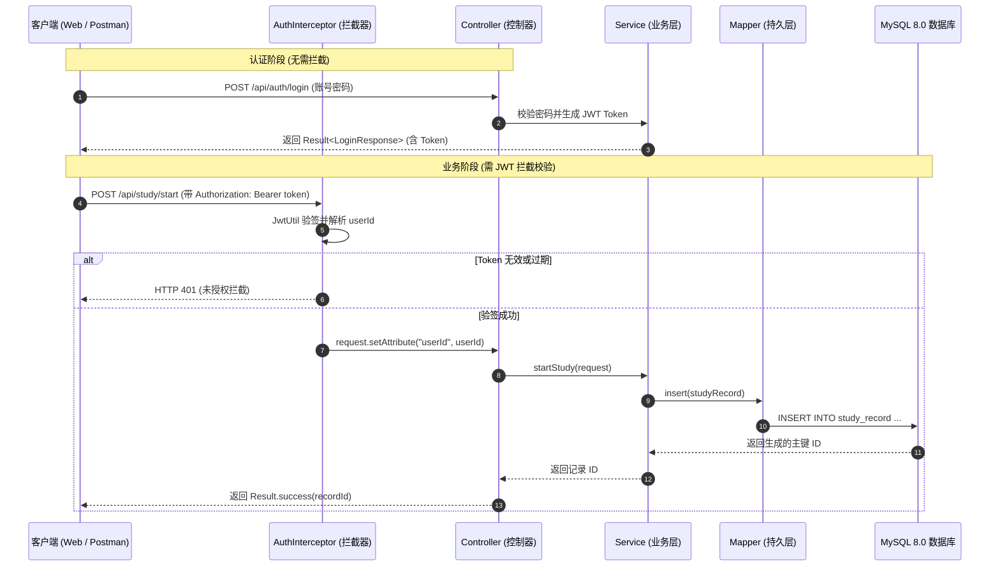

# 第九部分：实战项目 — 学习时间记录系统

本章带你从零落地一个完整的企业级 Spring Boot 3 后端工程。本站不提倡在教程里直接堆砌成百上千行代码让读者肉眼阅读，而是提供了**完整、规范且可直接独立编译运行的工程代码库**。

::: tip 💻 完整工程代码入口
本项目完整源码位于仓库根目录的 [`projects/study-tracker/`](https://github.com/wahahaorg/fullstack-road/tree/main/projects/study-tracker) 目录中。
包含标准的 `pom.xml`、Docker Compose 编排脚本、数据库建表 SQL 以及自动化测试用例，支持一键在本地启动与断点调试。
:::

---

## 9.1 项目定位与业务目标

本实战模拟一个真实的“开发者学习时间打卡与追踪平台”，串联前面八章所学的 Java 语法、面向对象、集合 Stream、Spring Boot 自动装配、MyBatis-Plus 持久化与 JWT 鉴权知识。

### 核心功能清单

| 业务模块 | 功能要点 | 涉及技术与工程规范 |
|---|---|---|
| **用户与认证** | 注册、登录、密码哈希校验、无状态鉴权 | BCryptPasswordEncoder、JJWT 0.12、HandlerInterceptor |
| **学习打卡追踪** | 开始打卡、结束打卡、耗时自动计算 | 状态机校验（`STUDYING` → `COMPLETED`）、MyBatis-Plus 更新 |
| **打卡记录查询** | 今日打卡即时查询、历史记录分页倒序 | CURDATE() 过滤、MyBatis-Plus 分页插件 `PaginationInnerInterceptor` |
| **维度统计聚合** | 累计打卡总时长、各项目学习时长分布 | Java 8 Stream API 分组统计（`Collectors.groupingBy`） |
| **工程通用基础设施** | 统一响应模型、业务异常断言、全局异常兜底 | 泛型返回体 `Result<T>`、`@RestControllerAdvice`、Jakarta Validation |

---

## 9.2 系统架构与请求处理时序

客户端发起请求到数据库落盘的完整链路如下：



---

## 9.3 工程目录与分层职责

查看真实工程 [`projects/study-tracker/`](https://github.com/wahahaorg/fullstack-road/tree/main/projects/study-tracker)：

```text
projects/study-tracker/
├── pom.xml                               # Maven 依赖清单 (Spring Boot 3.2.0 + Java 17)
├── compose.yaml                          # 本地一键拉起 MySQL 8.0 容器
├── README.md                             # 独立项目运行与测试说明
└── src/
    ├── main/
    │   ├── resources/
    │   │   ├── application.yml           # 端口、数据库连接池、MyBatis-Plus 与 JWT 密钥
    │   │   └── schema.sql                # 数据库建表语句与必要索引定义
    │   └── java/com/example/studytracker/
    │       ├── StudyTrackerApplication.java  # Spring Boot 引导启动类
    │       ├── common/                   # 全局统一响应体 Result 与业务异常拦截器
    │       ├── config/                   # 分页插件、密码加密器与 Web 拦截器注册
    │       ├── controller/               # REST API 入口：AuthController, StudyController
    │       ├── dto/                      # 入参校验对象：LoginRequest, StudyStartRequest
    │       ├── vo/                       # 出参视图对象：UserVO, StudyRecordVO, StatisticsVO
    │       ├── entity/                   # MyBatis-Plus 表实体映射：User, StudyRecord
    │       ├── mapper/                   # 数据库访问接口：UserMapper, StudyRecordMapper
    │       ├── service/                  # 业务抽象与实现：UserService, StudyService
    │       ├── interceptor/              # 鉴权拦截器：AuthInterceptor
    │       └── util/                     # 工具类：JwtUtil
    └── test/                             # 自动化上下文集成测试
```

---

## 9.4 核心分层设计与关键实现解析

### 1. 统一响应规范与全局异常处理

在企业接口开发中，最忌讳的是 Controller 中到处充斥着 `try-catch` 或前端接收到无法解析的 500 HTML 报错页。

- **统一包装体 `Result<T>`**：定义了全局标准契约 `{ code: 200, message: "success", data: T }`；
- **业务异常 `BusinessException`**：继承自非受检异常 `RuntimeException`，当参数不合法或状态不一致时直接抛出（如 `throw new BusinessException("该学习打卡已结束");`）；
- **全局异常拦截器 `GlobalExceptionHandler`**：
  - 使用 `@RestControllerAdvice` 声明；
  - 拦截 `@Valid` 校验失败抛出的 `MethodArgumentNotValidException`，拼接可读提示；
  - 拦截 `BusinessException`，向前端返回语义明确的业务状态码（400）；
  - 拦截未知的通用 `Exception`，记录 `log.error` 日志并对外统一响应 `500 服务器内部错误`，防止向外泄露内部堆栈信息。

源码参考：[`common/GlobalExceptionHandler.java`](https://github.com/wahahaorg/fullstack-road/blob/main/projects/study-tracker/src/main/java/com/example/studytracker/common/GlobalExceptionHandler.java)。

### 2. 无状态 JWT 鉴权与上下文传递

微服务与分布式后端通常避免使用内存 Session，而采用无状态 JWT：

1. 用户登录成功后，[`JwtUtil`](https://github.com/wahahaorg/fullstack-road/blob/main/projects/study-tracker/src/main/java/com/example/studytracker/util/JwtUtil.java) 使用 HMAC-SHA256 签名算法（密钥长度需 $\ge 256$ 位）生成包含 `userId` 的 Token 串；
2. 客户端后续请求必须在 Header 中携带 `Authorization: Bearer <token>`；
3. [`AuthInterceptor`](https://github.com/wahahaorg/fullstack-road/blob/main/projects/study-tracker/src/main/java/com/example/studytracker/interceptor/AuthInterceptor.java) 拦截 `/api/study/**` 下的所有受保护接口，对 Token 进行验签与防篡改校验；
4. 校验通过后，通过 `request.setAttribute("userId", userId)` 将解析出的当前用户主键透传至 Controller 与下游业务链。

### 3. MyBatis-Plus 数据访问与分页插件

在 [`config/MyBatisPlusConfig.java`](https://github.com/wahahaorg/fullstack-road/blob/main/projects/study-tracker/src/main/java/com/example/studytracker/config/MyBatisPlusConfig.java) 中注入 `PaginationInnerInterceptor(DbType.MYSQL)` 分页插件后，分页查询无需手写 `LIMIT offset, size`，也无需单独查询 `count(*)`：

```java
// StudyServiceImpl.java
Page<StudyRecord> page = new Page<>(pageNum, pageSize);
LambdaQueryWrapper<StudyRecord> wrapper = new LambdaQueryWrapper<>();
wrapper.eq(StudyRecord::getUserId, userId)
       .orderByDesc(StudyRecord::getStartTime);

// 框架自动重写 SQL 追加分页限制，并执行优化后的 COUNT 语句
IPage<StudyRecord> recordPage = studyRecordMapper.selectPage(page, wrapper);
```

### 4. 基于 Java 8 Stream API 的分组聚合统计

在获取用户打卡统计时，通常需要计算：总分钟数、总记录数、以及按学习项目（如 "Java"、"Python"、"前端"）分别耗费了多少分钟。

利用现代 Java Stream API，可以写出清晰高效的数据汇总逻辑：

```java
// 过滤有效已完成记录
List<StudyRecord> records = studyRecordMapper.selectList(wrapper);

// 按 project 分组，并对每组的耗时 Duration 进行累加求和
Map<String, Long> projectStats = records.stream()
    .collect(Collectors.groupingBy(
        StudyRecord::getProject,
        Collectors.summingLong(r -> Duration.between(r.getStartTime(), r.getEndTime()).toMinutes())
    ));

// 计算全量总学习分钟数
long totalMinutes = records.stream()
    .mapToLong(r -> Duration.between(r.getStartTime(), r.getEndTime()).toMinutes())
    .sum();
```

---

## 9.5 本地运行与验证指南

### 1. 启动本地环境与依赖

进入工程目录，使用 Docker Compose 快速拉起数据库：

```bash
cd projects/study-tracker
docker compose up -d
```

Compose 会在本地 `3306` 端口启动 MySQL 8.0 服务，并自动读取 `src/main/resources/schema.sql` 完成表结构初始化。

### 2. 编译并启动工程

确保本地安装了 JDK 17 与 Maven：

```bash
# 验证编译
mvn clean compile

# 启动 Spring Boot 后端服务
mvn spring-boot:run
```

控制台看到 `Started StudyTrackerApplication in X.XXX seconds` 即代表服务就绪，监听在 `http://localhost:8080`。

---

## 9.6 完整接口联调流程 (cURL)

按照实际用户使用场景，依次执行以下接口进行验证：

### 1. 注册新账号
```bash
curl -X POST http://localhost:8080/api/auth/register \
  -H "Content-Type: application/json" \
  -d '{
    "username": "developer",
    "password": "password123",
    "email": "dev@example.com"
  }'
```
响应示例：
```json
{"code":200,"message":"success","data":{"id":1,"username":"developer","email":"dev@example.com"}}
```

### 2. 登录并获取鉴权 Token
```bash
curl -X POST http://localhost:8080/api/auth/login \
  -H "Content-Type: application/json" \
  -d '{
    "username": "developer",
    "password": "password123"
  }'
```
响应示例：
```json
{
  "code": 200,
  "message": "success",
  "data": {
    "token": "eyJhbGciOiJIUzI1NiJ9.eyJzdWIiOiIxIiwidXNlcm5hbWUiOiJkZXZlbG9wZXIiLCJpYXQiOjE3MjY1Nzc4MDAsImV4cCI6MTcyNjY2NDIwMH0.xxxxxx",
    "userId": 1,
    "username": "developer"
  }
}
```

### 3. 开始打卡学习
保存登录返回的 `token`，并在请求头中透传：
```bash
export TOKEN="<填入上一步返回的实际token>"

curl -X POST http://localhost:8080/api/study/start \
  -H "Content-Type: application/json" \
  -H "Authorization: Bearer $TOKEN" \
  -d '{
    "userId": 1,
    "project": "Spring Boot 实战"
  }'
```
响应示例：
```json
{"code":200,"message":"success","data":1}
```

### 4. 结束打卡
```bash
curl -X POST http://localhost:8080/api/study/end/1 \
  -H "Authorization: Bearer $TOKEN"
```
响应示例：
```json
{"code":200,"message":"success","data":null}
```

### 5. 查询分页打卡记录与时长统计
```bash
# 查询分页历史
curl -X GET "http://localhost:8080/api/study/records?page=1&size=5" \
  -H "Authorization: Bearer $TOKEN"

# 查询聚合统计指标
curl -X GET http://localhost:8080/api/study/statistics \
  -H "Authorization: Bearer $TOKEN"
```
统计接口响应示例：
```json
{
  "code": 200,
  "message": "success",
  "data": {
    "totalMinutes": 45,
    "totalRecords": 1,
    "projectStats": {
      "Spring Boot 实战": 45
    }
  }
}
```

---

## 9.7 生产进阶与面试演进思考

当你完成了该实战项目后，在真实业务和求职面试中，面试官往往会针对此项目进行追问：

1. **并发与重复打卡**：如果用户网络抖动连续点击了两次“开始打卡”，数据库会插入两条重叠的 `STUDYING` 记录吗？
   - *应对策略*：在数据库增加防重唯一约束，或使用 Redis 分布式锁 `SETNX study:user:{userId} ...` 保证同一时刻只能存在一条进行中的记录。
2. **统计性能瓶颈**：随着打卡记录积累到几十万行，每次调 `/statistics` 都从数据库取全量数据再用 Stream 计算，会导致接口响应严重变慢甚至 OOM。
   - *应对策略*：采用“读写分离 + 增量预聚合”。每次结束打卡时，将增加的时长同步或通过 MQ 异步累加到 Redis Hash（`HINCRBY study:stats:{userId} {project} {duration}`），查询直接读取缓存；历史大盘离线定时跑批写入汇总表。
3. **调用 Python AI Agent 联动**：
   - 学习记录积累后，如何利用大模型生成个性化的“每周学习复盘与改进建议”？详见下一章 [第十章：阅读陌生 Java 项目](./java-reading-project) 以及 [第八部分：Java 调用 Python Agent 服务](./java-call-python)。
