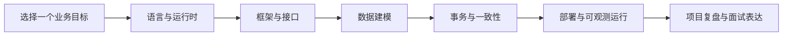

# 全栈知识地图

本站不是按“先学完一门语言，再开始做项目”组织的。你可以从当前任务出发，沿着一条最短路径补齐语言、框架、数据与工程能力。

::: tip 怎么用这张地图
先选一个目标，只读主线文章；遇到不熟悉的概念，再沿“关联能力”横向补课。不要从侧边栏第一篇一路顺序读到底。
:::

## 按目标开始

| 你的目标 | 建议入口 | 接下来读 | 最终产出 |
| --- | --- | --- | --- |
| 前端转 Python 后端 | [Python 快速入门](./python-intro) | [FastAPI 基础](./fastapi-basics) → [项目结构](./fastapi-mysql-project) | 一个分层清晰、可连接 MySQL 的 API |
| 强化 Node.js 面试 | [Node.js 运行时](./node-runtime) | [异步编程](./node-async) → [性能与稳定性](./node-perf) → [实战练习](./node-practice) | 能从运行时原理解释线上问题 |
| 系统掌握 NestJS | [NestJS 架构概览](./nestjs-intro) | [依赖注入](./nestjs-di) → [请求管道](./nestjs-pipeline) → [认证授权](./nestjs-auth) | 一套可维护的企业级接口骨架 |
| 转向 Java / Spring Boot | [Java 学习路线](./java-learning-path) | [核心语法](./java-core-syntax) → [理解工程](./java-engineering) → [Spring Boot](./java-springboot-intro) | 能读懂并参与 Java 后端项目 |
| 学习 Go 高并发服务 | [Go 快速入门](./go-intro) | [类型与泛型](./go-advanced-types) → [并发模式](./go-advanced-concurrency) → [工程化](./go-advanced-engineering) | 能写并解释并发 HTTP 服务 |
| 补齐数据库与一致性 | [后端思维补齐](./backend-thinking) | [表结构设计](./mysql-table-design) → [SQL](./sql-basics) → [事务与一致性](./concurrency-transaction) | 能设计数据模型并处理并发写入 |
| 掌握部署与异步架构 | [Docker 与部署](./docker-deployment) | [Worker](./background-worker) → [Redis](./redis-deep) → [消息队列](./message-queue) | 能拆分 Web、任务与基础设施 |

## 能力分层

### 1. 语言与运行时

- **Python**：[语法入门](./python-intro) · [类与 OOP](./python-class) · [工程进阶](./python-engineering)
- **Node.js**：[运行时](./node-runtime) · [模块系统](./node-module-system) · [异步模型](./node-async) · [Stream](./node-stream)
- **Go**：[快速入门](./go-intro) · [类型系统](./go-advanced-types) · [并发模型](./go-advanced-concurrency)
- **Java**：[去陌生化](./java-intro) · [核心语法](./java-core-syntax) · [数据结构](./java-data-structures) · [工程结构](./java-engineering)

### 2. Web 框架与接口设计

- **FastAPI**：[基础](./fastapi-basics) · [MySQL 项目结构](./fastapi-mysql-project) · [生产级进阶](./fastapi-advanced)
- **NestJS**：[架构](./nestjs-intro) · [装饰器](./nestjs-decorators) · [依赖注入](./nestjs-di) · [请求管道](./nestjs-pipeline) · [DTO 与 Swagger](./nestjs-dto)
- **Spring Boot**：[框架入门](./java-springboot-intro) · [数据库](./java-database) · [鉴权](./java-auth) · [调用 Python Agent](./java-call-python)
- **Node 原生能力**：[HTTP 与 BFF](./node-http) · [性能与稳定性](./node-perf)

### 3. 数据、状态与可靠性

- **建模与查询**：[MySQL 表结构设计](./mysql-table-design) · [SQL 基础与查询](./sql-basics)
- **一致性**：[并发、事务与一致性](./concurrency-transaction) · [Redis 深入](./redis-deep)
- **异步系统**：[Worker 与异步任务](./background-worker) · [消息队列](./message-queue)
- **认证授权**：[NestJS 认证与授权](./nestjs-auth) · [Java 登录与鉴权](./java-auth)

### 4. 工程、部署与实战

- **部署**：[Docker 与部署](./docker-deployment)
- **完整项目**：[FastAPI + MySQL 项目](./fastapi-mysql-project) · [Java 学习时间记录系统](./java-project-practice)
- **代码阅读**：[阅读陌生 Java 项目](./java-reading-project)
- **练习与面试**：[综合练习](./exercises) · [Node.js 实战练习](./node-practice) · [Java 招聘要求判断](./java-job-requirements)

## 跨栈对照

同一个后端概念，在不同技术栈里只是名字和实现方式不同：

| 能力 | FastAPI | NestJS | Spring Boot |
| --- | --- | --- | --- |
| 路由入口 | `APIRouter` | `Controller` | `@RestController` |
| 请求校验 | Pydantic Schema | DTO + Pipe | DTO + Bean Validation |
| 依赖管理 | `Depends` | Provider + DI | Bean + DI |
| 鉴权入口 | 鉴权依赖 | Guard | Security Filter Chain |
| 业务逻辑 | Service 函数 / 类 | Service Provider | `@Service` |
| 数据访问 | SQLAlchemy | TypeORM | JPA / MyBatis |

理解这张表后，迁移技术栈时应优先寻找“职责对应关系”，而不是逐行翻译语法。

## 推荐阅读顺序

如果你还不确定从哪里开始，先读[这套教程怎么学](./learning-path)；如果已经有明确技术方向，直接从上面的目标表进入即可。

## 继续补全的方向

参考成熟的全栈知识库分类后，本站下一阶段更值得补齐的是：

1. HTTP、HTTPS、TCP 与网络排障。
2. Linux、Nginx 与反向代理。
3. JVM、Java 并发与性能诊断。
4. MySQL 索引、执行计划、备份与高可用。
5. 分布式系统基础：CAP、幂等、限流、熔断与可观测性。

这些主题会优先围绕“当前文章需要哪些前置知识”逐步加入，而不是简单扩充文章数量。

> 信息架构参考：[heibaiying/Full-Stack-Notes](https://github.com/heibaiying/Full-Stack-Notes)。本站仅借鉴其按领域组织并为文章补充摘要的方式，未复制其文章与图片。
