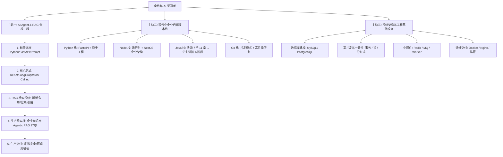

# 这套教程怎么学

本站已收录超百篇深度工程实践与系统性演进路线。**切忌从侧边栏第一篇顺序读到最后一篇。** 建议从你的核心目标出发，选择一条主线贯穿始终；遇到底层概念（如锁、事务、Docker、Redis）再横向切入关联专题。

更细维度的知识索引与能力分层见 [全栈知识地图](./knowledge-map)。

---

## 🎯 读者画像

默认你具备：
- 具备多年 Web 前端或基础后端开发经验，熟悉 HTTP、JSON、前后端鉴权与接口联调；
- 至少熟悉一种现代组件化框架（React / Vue）的状态与副作用模型；
- 正在向 AI 应用工程师转型，或正在补齐企业级服务端架构能力。

不默认你具备：大规模分布式系统架构经验、复杂的数据库底层内核知识、科班深度学习 / 算法背景。

在讲解服务端概念时，本站优先采用前端已有的心智模型进行迁移映射（如：`Spring/NestJS DI ≈ React Context`、`Interceptor ≈ Axios 拦截器`、`Guard ≈ 路由守卫`、`CompletableFuture ≈ Promise`）。

---

## 🗺️ 三大核心学习主轨

---

### 主轨一：AI Agent & RAG 全栈工程（推荐主力线）

> **目标**：能完整讲清并落地一条「可恢复、可审计、带引用、有评测」的 Agentic RAG 生产链路，具备交付真实 AI 应用的能力。

1. **认知与前置底座**：
   - 导航路线：[Python AI Agent 路线融合指南](./python-ai-agent-path)
   - 基础底座：[LLM 与 Prompt 基础](./llm-prompt-foundations) → [Agent 工程总览](./agent-intro) → [Python 快速入门](./python-intro) → [FastAPI 基础](./fastapi-basics)与[生产级进阶](./fastapi-advanced)
2. **核心范式与框架选型**：
   - [Agent 范式与框架选型](./agent-patterns) → [框架生态与进阶能力](./agent-frameworks-and-capabilities) → [LangGraph 状态机](./agent-langgraph) → [Tool Calling 与 MCP](./agent-tool-calling) → [Multi-Agent 与人工兜底](./agent-multi-agent)
3. **RAG 检索系统工程**：
   - [RAG 入库链路](./rag-pipeline) → [混合检索与 Rerank](./rag-retrieval) → [引用溯源与拒答](./rag-citation) → [多模态文档](./rag-multimodal) → [Text2SQL 实践](./agent-text2sql)
4. **生产级综合实战（重点贯穿）**：
   - 深入学习 **[企业知识库 Agentic RAG 实战（十七章全集）](./agentic-rag-project)**，对照配套工程代码 [`projects/agentic-rag/`](https://github.com/wahahaorg/fullstack-road/tree/main/projects/agentic-rag) 进行本地部署与断点调试；
   - 必保重点章：第 3 章权限过滤、第 6 章异步入库、第 7-8 章检索与引用、第 10 章 LangGraph 多轮检索、第 13 章安全测试、第 15 章离线评测。
5. **生产化保障与求职复盘**：
   - [项目阶梯与生产交付](./agent-projects-and-delivery) → [Agent 评测方法](./agent-eval) → [Prompt 注入攻防](./agent-security) → [可观测性与成本](./agent-observability) → [项目复盘与求职表达](./agentic-rag-project-career)

---

### 主轨二：现代化企业后端技术栈

> **目标**：不追求把所有语言刷满，而是按企业求职或业务协作需求，选择 1~2 门语言扎实掌握其企业级工程范式。

#### 🐍 Python 栈（FastAPI + 异步工程）
- [Python 快速入门](./python-intro) → [深入理解类](./python-class) → [Python 工程进阶](./python-engineering)
- [FastAPI 基础](./fastapi-basics) → [FastAPI + MySQL 实战项目](./fastapi-mysql-project) → [FastAPI 生产进阶](./fastapi-advanced)

#### 🟢 Node.js & NestJS 栈（模块化单体与微服务）
- **Node 运行时底座**：[运行时模型](./node-runtime) → [模块系统](./node-module-system) → [异步与错误](./node-async) → [Stream 与 Buffer](./node-stream) → [HTTP 与 BFF](./node-http) → [性能与稳定性](./node-perf)
- **NestJS 企业架构**：[架构概览](./nestjs-intro) → [依赖注入](./nestjs-di) → [生命周期 AOP](./nestjs-pipeline) → [DTO 与数据](./nestjs-dto) → [TypeORM](./nestjs-database) / [Prisma](./nestjs-prisma) → [认证授权](./nestjs-auth) → [项目架构蓝图](./nestjs-project-blueprint)

#### ☕ Java & Spring Boot 栈（接手维护 → 企业级进阶）
- **入门接手阶段（1-11 章）**：
  [Java 学习路线](./java-learning-path) → [去陌生化](./java-intro) → [核心语法](./java-core-syntax) → [工程结构](./java-engineering) → [Spring Boot 入门](./java-springboot-intro) → [数据库](./java-database) → [登录鉴权](./java-auth) → [调用 Python](./java-call-python) → **[学习时间记录系统实战（配套 `projects/study-tracker`）](./java-project-practice)** → [阅读陌生项目](./java-reading-project)
- **企业级进阶阶段（6 阶段深水区）**：
  [Java 企业级进阶路线](./java-enterprise-path) → [JVM 与并发基础](./java-jvm-concurrency) → [Spring、数据与中间件](./java-spring-data-middleware) → [分布式、云原生与架构](./java-distributed-cloud-architecture)

#### 🔵 Go 栈（高性能与高并发服务）
- [Go 学习路线与地图](./go-learning-path) → [Go 快速入门](./go-intro) → [类型系统与泛型](./go-advanced-types) → [并发模式与工程实践](./go-advanced-concurrency) → [工程化实战](./go-advanced-engineering)

---

### 主轨三：系统架构与工程基础设施

> **目标**：解决“接口变慢、数据写乱、服务崩溃、线上故障无法定位”的真实工程问题，为前两条主轨提供底层支撑。

1. **数据库与数据建模**：
   - [MySQL 表结构设计规范](./mysql-table-design) → [SQL 基础与查询](./sql-basics) → [SQL 进阶与优化](./mysql-advanced) → [MySQL 日志与容灾备份](./mysql-recovery) → [PostgreSQL 进阶实战](./postgresql)
2. **高并发与一致性**：
   - [并发、事务与一致性](./concurrency-transaction) → [锁机制与并发控制](./locking) → [分布式一致性与可靠消息](./distributed-consistency)
3. **缓存与中间件**：
   - [Redis 深入原理](./redis-deep) → [Redis 五大业务场景实战](./redis-practice) → [消息队列设计与选型](./message-queue) → [Worker 与异步任务](./background-worker)
4. **容器与运维部署**：
   - [Docker 与部署](./docker-deployment) → [Dockerfile 最佳实践](./dockerfile-practice) → [Compose 与进程守护](./docker-compose-network) → [Nginx 流量治理](./nginx-core) → [网络排障与系统诊断](./network-troubleshooting)

---

## 🛠️ 配套实战项目矩阵 (Projects Matrix)

本站所有实战教程均提供真实、独立、可直接在本地编译运行的代码工程，拒绝纯代码块堆砌：

| 项目名称 | 所属技术栈 | 难度 / 定位 | 代码仓库目录 | 配套教程指引 |
|---|---|---|---|---|
| **企业知识库 Agentic RAG 系统** | Python 3.12, FastAPI, LangGraph, Qdrant, PostgreSQL, Docker | 生产级综合项目 (L5) | [`projects/agentic-rag/`](https://github.com/wahahaorg/fullstack-road/tree/main/projects/agentic-rag) | [企业知识库 RAG 实战 17 章](./agentic-rag-project) |
| **学习时间记录系统 (Study Tracker)** | Java 17, Spring Boot 3, MyBatis-Plus, MySQL 8, JWT | 企业级后端入门实战 | [`projects/study-tracker/`](https://github.com/wahahaorg/fullstack-road/tree/main/projects/study-tracker) | [Java 实战项目教程](./java-project-practice) |

---

## 📊 阶段交付物自检表

走完一条主轨后，你应该能够产出以下可验证交付物，而不是仅仅停留于“我看过了”：

| 主线轨道 | 基础合格交付物 | 进阶专业交付物 |
|---|---|---|
| **主轨一：AI Agent** | 本地跑通带权限过滤的 RAG 问答；能解释召回打分与过滤时序；具备一份离线评测得分报告。 | 手搭最小 ReAct 状态机；能清晰阐明 5 大框架取舍边界；独立完成 L1-L5 中的一个垂直领域可演示项目。 |
| **主轨二：Java / Spring** | 画出现有工程的分层架构图；本地跑通 `projects/study-tracker` 并独立新增一个业务模块（含测试）。 | 产出一份 JVM / GC 慢接口排查笔记；设计一个包含事务、缓存更新与 MQ 异步重试的状态流转链路。 |
| **主轨二：Node / NestJS** | 交付一个模块化单体：包含 JWT 鉴权、DTO 校验、TypeORM 实体迁移、全局日志与健康检查。 | 能够解释 Node.js Event Loop 在高负载下的微任务调度行为，并设计一套微服务跨进程通信方案。 |
| **主轨三：架构与系统** | 熟练使用 `EXPLAIN` 分析慢查询并建复合索引；编写多阶段构建的 Dockerfile 与 Compose 本地环境。 | 面对“超卖”、“重复消费”、“缓存击穿”等典型线上故障，能推演并手写对应的幂等防重与兜底机制。 |

---

## 💡 每一章的高效阅读方法

1. **先看业务痛点**：先思考如果不引入本章技术，系统会出现什么严重缺陷（数据错乱？内存溢出？安全越权？）；
2. **看架构取舍表**：重点研读“为什么选 A 而不是 B”，关注方案的适用场景与代价；
3. **对照工程动手**：在 `projects/` 对应工程里寻找实现，尝试修改一行参数并在本地复现一次失败；
4. **口述复盘**：尝试用自己的话在 3 分钟内向面试官或同事解释方案的核心链路与已知边界。
