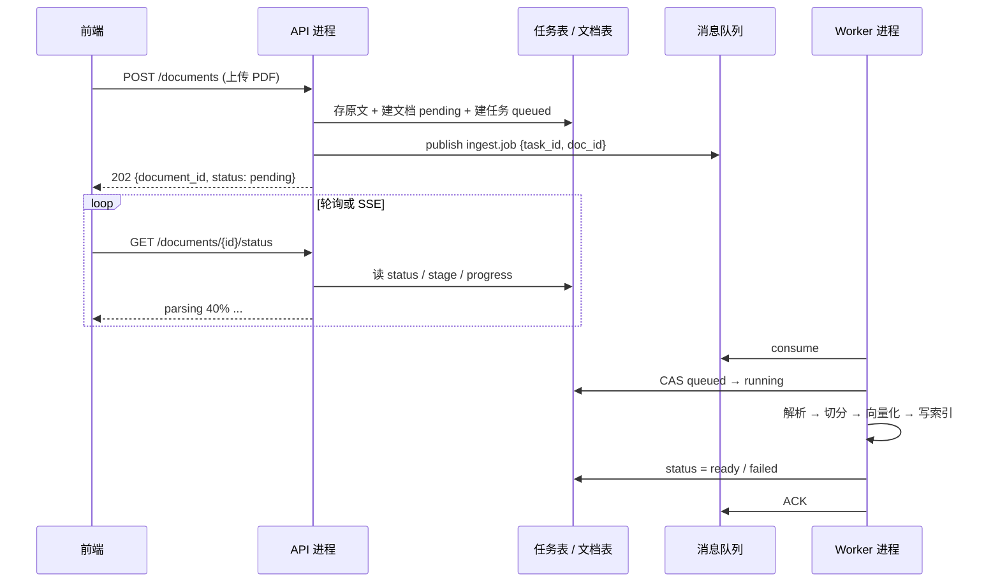

# 消息队列：Agent 异步入库怎么可靠投递

> 本篇管「任务怎么可靠地从 API 传到 Worker」。进程怎么跑、并发上限、租约与心跳，见 [Worker 与异步任务](./background-worker)。写库与发消息的双写、Outbox、Inbox，见 [分布式一致性与可靠消息](./distributed-consistency)。企业知识库项目里的任务表与状态查询，见 [异步入库与任务状态](./agentic-rag-project-async-ingestion)。

前端很少直接碰 MQ，但做 Agent / RAG 后端时绕不开它：PDF 解析、切分、向量化动辄几十秒，不能堵在 HTTP 请求里。本文用「文档异步入库」贯穿全文，把选型、ACK、幂等、重试、死信和积压观测讲到能上面试。

## 为什么需要消息队列

```txt
用户上传一份 200 页 PDF
  → 解析 8 秒、切分、Embedding 20 秒、写向量库 2 秒
  → 放在请求里做完？网关超时、进程被占满、用户一刷新就前功尽弃
  → 正确做法：API 只登记任务并返回 pending，后台慢慢处理
```

MQ 在这条链路上解决四件事：

| 价值 | 入库场景里的含义 |
|------|------------------|
| 异步 | 上传接口立刻返回，解析不占请求线程 |
| 解耦 | API 进程不知道谁在消费；Worker 可以独立扩缩 |
| 削峰 | 早上批量导入 500 份文档，先堆进队列，按 Embedding 配额慢慢吃 |
| 失败重试 | Worker 挂了、Embedding 限流了，消息还能再投 |

它**不是**正确性的替代品。用了 MQ 仍会重复消费，仍会积压，仍要幂等和监控——后面三节专门写厚。

---

## 主案例：文档异步入库

整篇文章默认这条业务链路。先把端到端画面钉死，后面讲 ACK / 幂等 / 死信时都回这里。



状态机最小集合（文档状态与任务状态分开，和 [异步入库实战](./agentic-rag-project-async-ingestion) 对齐）：

```txt
文档：draft → processing → review_pending / failed
任务：queued → running → succeeded / failed / cancelled
阶段：download → parse → chunk → embed → index → finalize
```

前端要的不是「MQ 空了没有」，而是「这份文档走到哪一阶段、进度多少、能否取消或重试」。进度事实来源是数据库，不是队列深度。

API 侧只做三件事：**校验、落原文、入队**。

```python
# API：上传后立刻返回，不在请求里做解析
@app.post("/documents", status_code=202)
async def upload_document(file: UploadFile, user=Depends(current_user)):
    raw = await file.read()
    uri = await object_storage.put(f"docs/{uuid4()}", raw)

    doc = await repo.create_document(
        owner_id=user.id,
        source_uri=uri,
        title=file.filename,
        status="pending",
    )
    task = await repo.create_task(
        document_id=doc.id,
        status="queued",
        stage="download",
    )

    # 消息体尽量小：带业务主键，大字段去对象存储/数据库取
    await mq.publish(
        "ingest.jobs",
        {"task_id": task.id, "document_id": doc.id},
        # 业务幂等键：同一文档重复提交可被去重或覆盖
        headers={"idempotency-key": f"ingest:{doc.id}"},
    )
    return {"document_id": doc.id, "task_id": task.id, "status": "pending"}
```

Worker 侧只做消费循环级的事（进程模型、租约续期见 Worker 篇）：

```python
async def consume_ingest_jobs(mq, repo):
    async for msg in mq.consume("ingest.jobs", prefetch=1):
        payload = msg.body
        try:
            claimed = await repo.claim_task(payload["task_id"])  # CAS
            if not claimed:
                await msg.ack()  # 已被别人领走，当作成功消费
                continue

            await run_ingest_pipeline(claimed)  # 解析/切分/向量化
            await repo.mark_succeeded(claimed.id)
            await msg.ack()
        except RetryableError:
            await msg.nack(requeue=False)  # 交给重试/死信策略，见后文
        except PermanentError as e:
            await repo.mark_failed(payload["task_id"], error=str(e))
            await msg.ack()  # 不可重试：确认掉，避免毒消息循环
```

这条链路里，MQ 的职责是**可靠传递任务意图**；任务当前状态、进度、错误码都写在数据库里。前端轮询 `GET /documents/{id}` 或订阅 SSE，读的是库，不是队列。

---

## 队列模型 vs 发布订阅

### 点对点（Queue）

```txt
Producer → [ingest.jobs] → Worker-1
                          → Worker-2（竞争消费）

一条消息只会被一个消费者拿走
适合：任务队列（入库、导出、发邮件）
```

文档入库几乎总是 Queue：同一份 PDF 不需要被三个 Worker 各解析一遍。

### 发布 / 订阅（Topic）

```txt
Producer → [doc.ready] → 检索缓存失效
                       → 审计日志
                       → 通知订阅者

一条消息会被所有订阅者各消费一次
适合：领域事件广播
```

入库**完成之后**发 `DocumentReady` 可以用 Pub/Sub；**执行入库本身**用 Queue。别把「干活」和「广播事实」混进同一个通道。

| 问题 | 选 Queue | 选 Pub/Sub |
|------|----------|------------|
| 这条消息是一个人干的活吗？ | 是 | 否 |
| 多个消费者要不要都看到？ | 不要（竞争） | 要（扇出） |
| 典型例子 | `ingest.jobs` | `doc.ready`、`user.deleted` |

---

## RabbitMQ vs Kafka 选型

| 对比 | RabbitMQ | Kafka |
|------|----------|-------|
| 定位 | 消息代理 | 分布式日志 / 流平台 |
| 吞吐量 | 万级/秒 | 百万级/秒 |
| 延迟 | 微秒～毫秒 | 毫秒级 |
| 消费模型 | 推 + ACK，消息可删 | 拉 + 位移，消息按保留期留着 |
| 顺序 | 单队列有序 | 分区内有序 |
| 失败重试 | 死信队列 + ACK/NACK | 消费者自己控制位移与重试 Topic |
| 学习成本 | 较低 | 较高 |
| 入库场景 | 任务队列很合适 | 更适合审计流、多下游重放 |

**Agent / RAG 小中型项目**：任务队列优先 RabbitMQ，或更轻的 Redis Stream / 数据库任务表。Kafka 的优势在「同一份事件被多个系统反复消费、要长时间保留」——日志聚合、事件溯源、数据湖入湖。把 Kafka 当 Celery 用，运维成本通常不划算。

新手路线：先把 ACK、幂等、死信在 RabbitMQ 或 Redis Stream 上跑通，再碰 Kafka。

---

## 发消息与消费循环

下面用 `aio-pika` 风格示意（概念通用，换成 Redis Stream / SQS 也是同一套形状）。**不要在这里堆完整 Celery/Arq 框架代码**——框架怎么起进程、怎么配置 broker，是 [Worker 篇](./background-worker) 的事。

### 生产者：声明队列并发布

```python
import json
import aio_pika

async def publish_ingest_job(channel: aio_pika.Channel, task_id: str, document_id: str):
    # durable：broker 重启后队列还在
    queue = await channel.declare_queue("ingest.jobs", durable=True)

    body = json.dumps({"task_id": task_id, "document_id": document_id}).encode()
    await channel.default_exchange.publish(
        aio_pika.Message(
            body=body,
            delivery_mode=aio_pika.DeliveryMode.PERSISTENT,  # 消息落盘
            content_type="application/json",
            headers={"idempotency-key": f"ingest:{document_id}"},
        ),
        routing_key="ingest.jobs",
    )
```

消息体约定：

- 只放主键和必要元数据（`task_id`、`document_id`、可选 `attempt`）。
- 文件路径、原文、切分结果走对象存储 / 数据库，别塞进 MQ。
- 幂等键放 header 或 body 都行，但**创建时生成一次，重投不变**。

### 消费者：prefetch + 手动 ACK

```python
async def start_ingest_consumer(channel: aio_pika.Channel, handler):
    queue = await channel.declare_queue("ingest.jobs", durable=True)
    # 每次只预取 1 条：入库任务重、耗时长，避免一个 Worker 囤一堆消息却处理不过来
    await channel.set_qos(prefetch_count=1)

    async with queue.iterator() as queue_iter:
        async for message in queue_iter:
            async with message.process(requeue=False):  # 退出 with 时自动 ACK；异常则按策略处理
                payload = json.loads(message.body)
                await handler(payload)
```

`prefetch_count` 对入库很关键：Embedding 可能跑几十秒，prefetch=50 会让少量 Worker「占着茅坑」——消息已投递给它们，其他空闲 Worker 却拿不到。轻量通知可以调大；重任务从 1 起步。

### ACK 确认

```txt
消费者收到消息
  → 处理成功 → ACK → broker 删除（或标记已消费）
  → 处理失败且可重试 → NACK / 不 ACK → 重新入队或进重试队列
  → 进程崩溃、连接断开 → 未 ACK 的消息由 broker 重新投递
```

**前端类比**：ACK 像「快递签收」。签收前快递丢了，驿站会再送一次；签收后你把包裹弄坏了，驿站不会再送——所以「业务写成功但还没 ACK」和「ACK 了但业务没写成功」是两种不同故障，幂等要同时防。

---

## 与 Worker 的边界

两篇文章容易糊成一篇，先划清：

| 维度 | 本篇（消息队列） | [Worker 篇](./background-worker) |
|------|------------------|----------------------------------|
| 核心问题 | 任务意图如何可靠传递 | 进程如何领取、执行、恢复 |
| 关键词 | 投递语义、ACK、幂等、死信、积压 | 并发上限、租约、心跳、优雅停机 |
| 代码粒度 | publish / consume 循环 | Celery / Arq / 数据库 Worker 骨架 |
| 状态真相 | 队列里有没有这条消息 | 任务表里 running 了多久、谁持有租约 |

### 为什么 BackgroundTasks 不够

FastAPI 的 `BackgroundTasks` 在**同一进程、请求返回之后**跑一段协程：

```python
from fastapi import BackgroundTasks

@app.post("/documents")
async def upload(file: UploadFile, background_tasks: BackgroundTasks):
    doc = await save_meta(file)
    background_tasks.add_task(parse_and_embed, doc.id)  # 看起来很香
    return {"id": doc.id, "status": "pending"}
```

它适合「发一封欢迎邮件」这种丢了也不致命的事，**不适合文档入库**：

1. 进程重启 / OOM / 发布滚动，内存里的任务直接蒸发，库里永远 `pending`。
2. 无法跨机器扩容：任务绑在接请求的那台 API 上。
3. 没有 ACK、重试次数、死信、积压监控。
4. 重任务会和 API 抢同一事件循环（CPU 密集更糟）。

[FastAPI 进阶](./fastapi-advanced) 里也写了同一句结论：`BackgroundTasks` 不是可靠任务队列。入库请「落库 + 发 MQ（或任务表）」，由独立 Worker 消费。

### API / MQ / Worker 职责表

| 组件 | 负责 | 不负责 |
|------|------|--------|
| API 进程 | 鉴权、校验、存原文、写任务行、publish、返回 202 | 解析 PDF、调 Embedding、长时间重试 |
| 消息队列 | 持久化消息、投递、按策略重投、死信路由 | 业务状态机、进度百分比、权限判断 |
| Worker 进程 | 竞争消费、CAS 领取、执行流水线、写回状态、ACK | 对外 HTTP、直接服务浏览器上传 |

三层拆开之后，才能单独扩 Worker、单独限流 Embedding、单独给 API 做滚动发布，而不把半截入库打断。

---

## 可靠性三件套

投递语义、幂等、重试 + 死信，是面试和应用里最容易被「用了 MQ」一句话糊弄过去的部分。入库场景里必须写清楚。

### 1. 至少一次投递 → 必然可能重复

常见 MQ 在故障模型下提供的是 **at-least-once**：消息不会在「已进入队列且消费者会回来」的前提下被静默丢掉，但**可能投不止一次**。

重复从哪来（对照入库）：

```txt
1. Worker 解析成功、向量写完，准备 ACK 时进程被杀
   → broker 没收到 ACK → 重新投递 → 第二台 Worker 再跑一遍

2. 网络闪断：ACK 丢了，broker 以为没签收

3. 发布端超时重试：API 以为 publish 失败，又发了一条
   （若没有 Outbox / 幂等键去重，队列里直接两条）

4. 消费者 NACK requeue，或死信被人工重放
```

所以：**「用了 MQ」不等于「只执行一次」**。业务效果必须幂等；「exactly once」若要说，必须限定范围（见 [分布式一致性](./distributed-consistency)），不能空口承诺端到端只跑一次。

### 2. 幂等：三种落地手法

目标：同一 `document_id` / `task_id` 被消费 N 次，最终只有一份 chunk、一份向量、一次 `ready`。

#### 手法 A：唯一约束

```sql
CREATE TABLE document_chunks (
  id BIGINT PRIMARY KEY AUTO_INCREMENT,
  document_id BIGINT NOT NULL,
  chunk_index INT NOT NULL,
  content TEXT NOT NULL,
  UNIQUE KEY uk_doc_chunk (document_id, chunk_index)
);
```

```python
async def write_chunks(doc_id: int, chunks: list[str]):
    for i, text in enumerate(chunks):
        try:
            await db.execute(
                "INSERT INTO document_chunks(document_id, chunk_index, content) VALUES (?, ?, ?)",
                (doc_id, i, text),
            )
        except IntegrityError:
            # 已写过：忽略或改为 UPDATE content
            continue
```

向量表同理：`(document_id, chunk_index)` 或稳定的 `chunk_id` 做唯一键；重跑先按 `document_id` 删旧再插，或 upsert。

#### 手法 B：状态机 CAS（条件更新）

领取任务绝不能「先 SELECT 再 UPDATE」。两个 Worker 同时看到 `queued` 就会双跑。

```python
async def claim_task(task_id: str, worker_id: str) -> bool:
    result = await db.execute(
        """
        UPDATE ingestion_tasks
        SET status = 'running',
            worker_id = ?,
            attempt = attempt + 1,
            started_at = NOW(6)
        WHERE id = ? AND status = 'queued'
        """,
        (worker_id, task_id),
    )
    return result.rowcount == 1
```

`rowcount == 0`：已被别人领走，或状态已不是 `queued`。当前消费者应 ACK 并退出，**不要**再跑流水线。成功收尾同样带条件：`WHERE id=? AND status='running' AND worker_id=?`。

#### 手法 C：幂等键表（Inbox）

适合消息带唯一 `idempotency-key`、业务唯一约束又不好挡副作用时：先 `INSERT INTO processed_messages(idempotency_key, ...)`，撞唯一键就直接 return；否则执行业务。更稳的是「处理与写 Inbox 同一本地事务」——细节见一致性篇 Inbox 节。

**入库推荐组合**：任务领取用 CAS（B）+ chunk/向量用唯一约束或按文档覆盖写（A）；幂等键表作跨消息去重补充。

### 3. 重试：退避、上限、异常分类

不是所有失败都该再来一次。

| 类型 | 例子 | 策略 |
|------|------|------|
| 可重试 | Embedding 429 / 超时、DB 短暂连接失败、对象存储 503 | 指数退避，达上限进死信 |
| 不可重试 | 文件加密无法解密、格式不支持、校验失败、权限拒绝 | 标记 `failed`，ACK 掉，给用户明确错误码 |
| 毒消息 | payload 缺字段、JSON 损坏、schema 不认 | 进死信，不要无限 requeue |

```python
import random

def backoff_seconds(attempt: int, base: float = 2.0, cap: float = 300.0) -> float:
    # 全抖动：避免一堆任务同一秒重试（雷群）
    return random.uniform(0, min(cap, base * (2 ** attempt)))

async def handle_with_retry(msg, repo, max_attempts: int = 5):
    attempt = int(msg.headers.get("x-attempt", 0))
    try:
        await run_ingest_pipeline(msg.body)
        await msg.ack()
    except PermanentError as e:
        await repo.mark_failed(msg.body["task_id"], error_code=e.code, detail=str(e))
        await msg.ack()
    except RetryableError as e:
        if attempt + 1 >= max_attempts:
            await repo.mark_failed(msg.body["task_id"], error_code="RETRY_EXHAUSTED", detail=str(e))
            await publish_to_dlq(msg, reason=str(e))
            await msg.ack()
            return
        await publish_retry(msg, attempt=attempt + 1, delay=backoff_seconds(attempt))
        await msg.ack()  # 原消息确认掉，由延迟队列承载下一次
```

要点：最大次数必须有（入库常见 3～5）；退避用指数 + 抖动；计数同时写在消息 header 和任务表 `attempt`；避免「NACK 立刻 requeue」空转，改用延迟插件、重试队列或 `next_attempt_at`。

### 4. 死信队列（DLQ）

```txt
进入 DLQ 的常见条件
  → 重试次数耗尽
  → 消息被拒绝且 requeue=false
  → 消息 TTL 过期
  → 队列长度触顶被丢弃（取决于策略，应避免静默丢）
```

DLQ 不是垃圾桶，是**人工候诊室**：

1. **告警**：DLQ 深度 > 0 持续 N 分钟 → 通知值班（入库失败会影响「知识库能搜到吗」）。
2. **保留现场**：原 payload、最后一次错误、attempt、document_id 一并写入，或在任务表留 `error_code` / `error_detail`。
3. **分类处理**：不可修（坏文件）→ 通知上传者；可修（临时配额、依赖挂了）→ 修复后**人工重放**。
4. **重放**：从 DLQ 读出，重置任务状态为 `queued`，清掉毒字段，再 publish 回主队列；重放也要走幂等。

```python
async def replay_from_dlq(dlq_msg, repo, mq):
    payload = dlq_msg.body
    ok = await repo.requeue_task(payload["task_id"])  # failed → queued，attempt 可保留或清零（按产品策略）
    if not ok:
        await dlq_msg.ack()  # 任务已不在 failed，避免重复重放
        return
    await mq.publish("ingest.jobs", payload)
    await dlq_msg.ack()
```

没有告警的 DLQ ≈ 没有 DLQ：消息安静地堆着，用户只看到「一直 parsing」。

---

## 双写问题点到为止

API 里常见危险写法：

```txt
BEGIN
  INSERT documents / ingestion_tasks
COMMIT
publish(ingest.jobs)   # 若这里进程崩溃 → 库里有任务，队列里没有
```

或反过来先 publish 再 commit：队列里有活，事务却回滚了 → 幽灵任务。

**Outbox** 的思路：在**同一本地事务**里写业务行 + `outbox_events`，另有 dispatcher 扫 Outbox 再发 MQ。这样「任务已受理」至少留下了可靠的发送意图。完整表结构、lease、Inbox 与对账，见 [分布式一致性与可靠消息](./distributed-consistency)，本篇不重写。

小项目过渡方案：以数据库任务表为真相，Worker 直接 `CLAIM` 表行（[Worker 篇的数据库队列](./background-worker)）；MQ 只做唤醒信号，丢了最多延迟，扫表还能兜住。体量上去再上完整 Outbox。

---

## 轻量方案：Redis List / Stream

不需要单独部署 RabbitMQ/Kafka 时，Redis 能撑起步和中小流量入库。

### List + BRPOP（最简）

```python
# 生产者
await redis.lpush("queue:ingest", json.dumps({"task_id": tid, "document_id": did}))

# 消费者
while True:
    item = await redis.brpop("queue:ingest", timeout=0)
    payload = json.loads(item[1])
    await handle(payload)
```

缺点：没有消费确认。`BRPOP` 取出即从 List 删除；Worker 崩在半路，这条任务从队列视角已消失，只能靠任务表扫描把卡住的 `running` 捞回来（又回到 Worker 篇的心跳 / 租约）。

### Stream + 消费者组（推荐的 Redis 形态）

```python
# 生产者
await redis.xadd("stream:ingest", {"task_id": tid, "document_id": did})

# 一次性创建组（已存在则忽略）
try:
    await redis.xgroup_create("stream:ingest", "workers", id="0", mkstream=True)
except Exception:
    pass

# 消费者
while True:
    messages = await redis.xreadgroup(
        groupname="workers",
        consumername=worker_id,
        streams={"stream:ingest": ">"},
        count=1,
        block=5000,
    )
    for stream, entries in messages:
        for msg_id, fields in entries:
            try:
                await handle(fields)
                await redis.xack("stream:ingest", "workers", msg_id)
            except RetryableError:
                # 不 XACK：可由 XAUTOCLAIM / 自研扫描 pending 列表回收
                raise
```

Stream 有 pending 列表，未 XACK 的消息可被认领转移，更接近「至少一次」。仍要在业务层做 CAS + 唯一约束。

**怎么选轻量方案**：

| 条件 | 建议 |
|------|------|
| 单机开发、演示、任务很少 | 数据库任务表即可 |
| 已有 Redis，要多 Worker 竞争 | Redis Stream |
| 需要成熟路由、延迟队列、管理插件 | RabbitMQ |
| 多下游长期留存、回放 | 再评估 Kafka |

---

## 积压与观测

MQ 能缓冲，但不能把「消费者太慢」变成「永远没事」。入库尤其明显：Embedding QPS、解析 CPU、向量库写入，任一环节跟不上，队列深度就爬升。

### 看什么

| 指标 | 含义 | 入库告警思路 |
|------|------|--------------|
| 队列深度（ready） | 等待消费的消息数 | 持续 > N（如 200）且 15 分钟不降 |
| 消费者 lag | 生产位点与消费位点差（Kafka）或未 ACK 数 | lag 上升斜率突然变陡 |
| 消费速率 | 条/分钟 | 低于上传速率的长期均值 |
| DLQ 深度 | 毒消息 / 重试耗尽 | > 0 即告警 |
| 任务表 `queued` / `running` 年龄 | 业务视角积压 | `queued` 超过 10 分钟、`running` 心跳超时 |
| 阶段耗时 | parse / embed p95 | embed p95 飙高优先查配额 |

队列深度是基础设施视角；**任务表年龄**是用户视角。两者一起看：深度为 0 但大量 `running` 心跳停滞 → Worker 死了；深度很大但 `running` 正常 → 该扩容或限流上传。

### 扩容消费者的前提

水平加 Worker 之前先问：

1. **任务可并行吗？** 不同 `document_id` 通常可以；同一文档的 parse→embed→index 有阶段依赖，不要拆成乱序并发。
2. **有没有错误的全局顺序假设？** 「队列里先到的文档一定先 ready」在多 Worker 下不成立。产品若需要公平性，用 per-user 限额或优先级队列，而不是幻想单队列全局 FIFO。
3. **下游撑得住吗？** 10 个 Worker 同时打 Embedding API，可能全体 429；扩容要配套限流（信号量、令牌桶、独立 embed 队列）。
4. **prefetch 与并发上限**：见 Worker 篇；MQ 侧 prefetch 与进程内并发乘数要一起算。

```txt
错误预期：加机器 → 积压线性下降
正确预期：加机器 → 直到撞上 Embedding 配额 / DB 连接 / 磁盘 后再平坦
```

上传侧也可以主动削峰：对同一用户 / 知识库做在途任务上限，超出返回 429 或排队位次，比无限灌进 MQ 更可控。

---

## 面试怎么说

收束到「能讲清文档异步入库」，比背中间件参数有用。别说「用了 MQ 就不丢 / 不并发 / 一定能削峰」——未 ACK 崩溃会重投（可能重复），ACK 后没落库是你自己丢的；削峰只是把尖峰变成积压。

**1. 为什么入库不能放请求里？**

- 解析 + 向量化经常几十秒到分钟级：网关超时、占满 API、用户一刷新就失败
- 接口只做校验、存原文、写 `pending/queued`、publish，返回 202；前端轮询或 SSE 看阶段进度
- 加分：`BackgroundTasks` 进程内、不持久，和独立 Worker + MQ 不是一类东西

**2. Queue 和 Pub/Sub？入库用哪个？**

- Queue：一条消息一个消费者，适合任务；Pub/Sub：人人有份，适合事件
- 入库执行走 Queue（`ingest.jobs`）；完成后可再 Pub/Sub 广播 `DocumentReady`
- 判断句：「一个人干的活，还是所有人要知道的事实」

**3. RabbitMQ 和 Kafka 怎么选？**

- 业务任务、ACK/死信好懂 → RabbitMQ；高吞吐日志、长期保留多下游重放 → Kafka
- Agent 入库中小规模：RabbitMQ 或 Redis Stream / DB 任务表足够
- 加分：RabbitMQ 单队列有序，Kafka 分区内有序；别假设多分区全局 FIFO

**4. 为什么还会重复消费？幂等怎么做？**

- at-least-once：成功后 ACK 前崩溃、ACK 丢失、生产者重发，都会重投
- 入库：`UPDATE ... WHERE status='queued'` 做 CAS；chunk/向量用 `(document_id, chunk_index)` 唯一约束或按文档覆盖写
- 加分：可重试 / 不可重试要分开，毒消息进 DLQ 而不是疯狂 requeue

**5. 重试和死信怎么设计？**

- 指数退避 + 全抖动 + 最大次数；429/超时可重试，坏文件永久失败直接 `failed` 并 ACK
- DLQ 要告警、留错误现场、支持人工重放；重放同样走幂等
- 加分：`attempt` 同时打在消息 header 和任务表，方便对账

**6. 积压了加消费者一定有用吗？**

- 先看深度、lag、DLQ、任务年龄、阶段 p95，区分 Worker 挂了、Embedding 限流还是上传过猛
- 扩容前提：任务可并行、无错误全局顺序假设、下游配额跟得上
- 加分：队列深度是基础设施指标，任务表里 `queued` 太久才是用户痛感

**7. 写库成功但消息没发出去？**

- 经典双写窗口；生产用 Outbox（业务与出箱同一事务，dispatcher 再发）
- 小项目可用「任务表为真相 + 定时扫 queued」兜底；细节见 [分布式一致性](./distributed-consistency)

---

## 延伸阅读

- [Worker 与异步任务](./background-worker)：进程模型、租约、心跳、Celery / BullMQ
- [分布式一致性与可靠消息](./distributed-consistency)：Outbox / Inbox
- [异步入库与任务状态](./agentic-rag-project-async-ingestion)：任务表与 202 接口
- [RAG 入库链路](./rag-pipeline)：四阶段拆分与阶段级队列
- [FastAPI 进阶](./fastapi-advanced)：`BackgroundTasks` 边界
- [RabbitMQ 可靠性指南](https://www.rabbitmq.com/docs/reliability)
- [Redis Streams 介绍](https://redis.io/docs/latest/develop/data-types/streams/)
