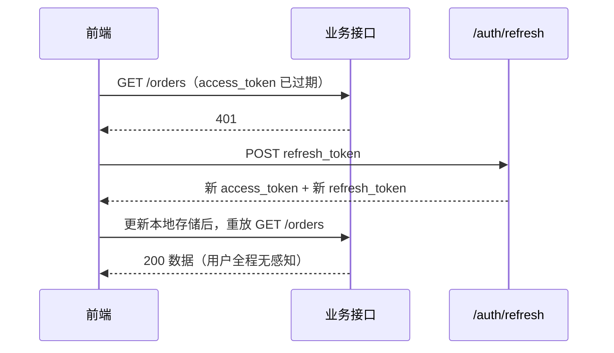

# NestJS 认证与登录状态

> HTTP 是无状态的，登录状态是怎么被「记住」的：Session 与 JWT 的取舍、Passport 策略体系、Token 无感刷新与撤销。

## 认证 vs 授权

| 概念 | 回答的问题 | 典型动作 |
|---|---|---|
| **Authentication（认证）** | 你是谁，怎么证明 | 校验密码 / 验证码 / 三方回调，签发凭证 |
| **Authorization（授权）** | 你能做什么 | 校验角色、权限点、资源归属 |

认证必然先于授权：连你是谁都不知道，就谈不上判断你能做什么。

这篇只讲认证的**凭证机制**——状态存在哪、凭证怎么签发校验、怎么刷新、怎么作废。权限模型（ACL / RBAC / 资源级）和具体的登录方式（OAuth 三方登录、邮箱验证码、扫码登录）见[授权模型与三方登录](/guide/nestjs-authorization)。

---

## Session 还是 JWT

要让服务端「记住」你登录过，只有两条路：**状态放服务端**，或者**状态放客户端**。

Session 走第一条：服务端存一份会话数据，把它的 id 塞进 Cookie；Cookie 每次请求自动携带，服务端拿 id 反查。JWT 走第二条：把用户信息编码进一段带签名的字符串交给客户端，客户端手动放进 `Authorization` header，服务端只验签名、不查任何存储。

| 维度 | Session + Cookie | JWT |
|---|---|---|
| 状态存放位置 | 服务端（内存 / Redis） | 客户端（token 自身） |
| 服务端能否主动失效 | 能，删掉那条记录就行 | **不能**，要额外加黑名单 |
| 水平扩展成本 | 必须外置共享 store | 零成本，任意实例都能验签 |
| 每次请求开销 | 一次 store 读取（网络 I/O） | 一次签名校验（纯 CPU） |
| 携带方式 / 跨域 | 浏览器自动带，但受 domain 限制，跨域要配 `withCredentials` 和精确 origin | 手动加 header，不受跨域限制 |
| 移动端 / 多端 | 要自己管 Cookie jar，不顺手 | 天然合适 |
| 主要风险面 | **CSRF**（Cookie 自动携带） | **XSS**（token 存在 JS 读得到的地方） |
| 踢人 / 改密下线 | 天然支持 | 要额外机制 |

::: warning 纠正一个常见误解
「JWT 比 Session 更安全」是错的。JWT 换来的是**更无状态**，不是更安全：它把 CSRF 风险换成了 XSS 风险，把「服务端能随时踢人」换成了「撤销困难」。两者没有高下，只是风险面的位置不同。
:::

选型建议：单体应用 + 只有浏览器端，**Session 就很好**，踢人和改密下线免费拿到，别因为「JWT 更现代」就无脑上；多端（Web + App + 小程序）、微服务、无状态 API 网关则用 **JWT**，网关不连 Redis 就能鉴权，这个价值很大。生产里最常见的其实是混合：JWT 做无状态鉴权，配一个 Redis 存黑名单或 `refresh_token` 白名单，把撤销能力补回来。

---

## 在 Nest 里实现 Session

Nest 的 HTTP 层默认跑在 Express 上，Session 直接用中间件 `express-session`：

```typescript
// main.ts
import session from 'express-session'

app.use(
  session({
    secret: process.env.SESSION_SECRET,  // 签名 cookie 用，别硬编码
    name: 'sid',
    resave: false,             // 内容没变就不重写 store
    saveUninitialized: false,  // 没往 session 写东西就不创建记录
    cookie: { httpOnly: true, secure: true, sameSite: 'lax', maxAge: 1800_000 },
  }),
)
```

`@Session()` 装饰器取的就是 `request.session`。登录时 `session.userId = user.id` 写进去，`Set-Cookie` 自动返回；登出时 `session.destroy()` ——**服务端说失效就失效**，这是 Session 相对 JWT 最实在的优势。

### Cookie 四个关键选项

| 选项 | 作用 | 生产建议 |
|---|---|---|
| `httpOnly` | JS 读不到这个 Cookie | 必须 `true`，防 XSS 偷 session 的底线 |
| `secure` | 只在 HTTPS 下发送 | 生产必须 `true`（本地 http 调试时置 false） |
| `sameSite` | 跨站请求是否带上 | `lax` 能兜住大部分 CSRF；确实要跨站带才用 `none`，且必须同时配 `secure` |
| `maxAge` | 有效期（毫秒） | 和服务端 store 的 TTL 保持一致 |

### MemoryStore 为什么不能上生产

不配 `store` 时用的是默认 `MemoryStore`，它启动时自己会打印一行警告。三个硬伤：进程重启数据全丢（所有人被登出）；过期记录不会主动清理，内存只增不减；多实例之间完全不共享。

生产换 Redis，装 `connect-redis redis` 后加一行 `store`：

```typescript
import { RedisStore } from 'connect-redis'

const redisClient = createClient({ url: process.env.REDIS_URL })
await redisClient.connect()

// session({ ... }) 的配置里加上
store: new RedisStore({ client: redisClient, prefix: 'sess:', ttl: 1800 }),
```

### 分布式 Session

单机时 session 在进程内存里没问题。一旦扩到多实例，负载均衡把请求轮询到另一台，那台机器上没有这条 session，用户就「莫名其妙」掉线了。两种解法：

- **外置共享 store**（Redis / 数据库）：所有实例读同一份数据，实例回归无状态，随便扩缩容。标准做法。
- **sticky session**：让 LB 按 IP 或 Cookie 把同一用户固定打到同一台。**不推荐**——它把有状态耦合进了负载均衡层：那台实例一挂，落在它上面的用户全部掉线；扩缩容会打乱映射关系；滚动重启和灰度发布都要踩坑。它只是「看起来不用改代码」，代价挪到了运维上。

至于 session 复制（实例之间互相同步），Node 生态基本没人用——实例数一多同步开销就爆炸。

---

## JWT 的结构与安全边界

一个 JWT 就是三段用 `.` 连起来的 base64url 字符串：header 放签名算法，payload 放业务声明（`sub` 用户 id、`exp` 过期时间戳），signature 是对前两段加密钥签名的结果。

```text
eyJhbGciOiJIUzI1NiJ9 . eyJzdWIiOjEsImV4cCI6MTcwMH0 . 4f2Nc0P8pQ...
      header                     payload                signature
```

::: danger base64url 不是加密
前两段任何人都能一行代码解出来——浏览器控制台里 `atob(token.split('.')[1])` 就看见了。签名只保证**没被篡改**，不保证**看不见**。所以 payload 里绝对不能放密码哈希、手机号、身份证号、内部密钥，放个用户 id 加少量必要字段就够。它每个请求都跟着 header 走一遍，塞一大坨权限列表还会白白吃带宽。
:::

**HS256 还是 RS256**：HS256 对称，签发和验签同一个 secret，适合单服务自签自验；RS256 非对称，私钥签、公钥验，适合认证中心签发、多个业务服务各自验签。判断标准很简单——**只要验签方不止一个，就用 RS256**。用 HS256 等于把签发密钥复制给每个服务，任何一个被攻破，攻击者就能伪造任意用户的 token。

**secret 从哪来**：环境变量，用 `JwtModule.registerAsync()` + `useFactory` 从 `ConfigService` 读（和[依赖注入](/guide/nestjs-di)里的工厂 Provider 是同一套机制）。写死在代码里等于把密钥提交进 Git，仓库一泄露所有 token 都可伪造。

### 常见攻击面

| 攻击 | 原理 | 防御 |
|---|---|---|
| `alg: none` | 把 header 改成 `{"alg":"none"}` 并去掉签名，实现宽松的库会当作「无需验签」放行 | 服务端**显式指定**允许的算法，不信 token 自称的 `alg` |
| 算法混淆 RS256 → HS256 | 改成 HS256，拿公开的公钥当 HMAC 密钥去签 | 同上，写死 `algorithms: ['RS256']` |
| 密钥太短 / 抓包 | 短密钥可离线暴破；明文信道可截获 | 至少 32 字节随机密钥，全站 HTTPS，短过期时间 |

前两条的防御落地就是在 `passport-jwt` 策略里加一行 `algorithms: ['HS256']`，见下面的 `JwtStrategy`。

---

## AuthService：签发凭证

```typescript
@Injectable()
export class AuthService {
  constructor(
    private usersService: UsersService,
    private jwtService: JwtService,
    private redis: RedisService,
  ) {}

  async validateUser(email: string, password: string): Promise<User | null> {
    const user = await this.usersService.findByEmail(email)
    // 只存哈希；compare 是恒定时间比较，避免时序攻击
    if (user && (await bcrypt.compare(password, user.passwordHash))) return user
    return null
  }

  async login(user: User) {
    const jti = randomUUID()

    const accessToken = this.jwtService.sign(
      { sub: user.id, email: user.email, ver: user.tokenVersion },
      { expiresIn: '15m' },
    )
    // refresh 的 payload 尽量薄，jti 是后面做轮转检测的抓手
    const refreshToken = this.jwtService.sign(
      { sub: user.id, type: 'refresh', jti },
      { expiresIn: '7d' },
    )

    await this.redis.set(`refresh:${user.id}`, jti, 7 * 24 * 3600)
    return { accessToken, refreshToken }
  }
}
```

---

## Passport 策略体系

如果让你自己设计一个认证库，会发现所有认证方式做的事情惊人地一致：**从 request 里取点东西 → 校验 → 把校验出的用户挂到 `request.user`**。用户名密码取 body，JWT 取 header，OAuth 取回调的 query，仅此而已。Passport 就是把这个共性抽成了策略模式，一种认证方式一个 Strategy 类。

`@nestjs/passport` 负责把它接进 Nest 的 DI 和 Guard 体系，三个点要认清：

- `PassportStrategy(Strategy, 'name')` 是一个 **mixin**，现场生成一个基类给你继承。第二个参数是策略名，省略时用策略包的默认名（`passport-local` 默认 `local`，`passport-jwt` 默认 `jwt`）。
- **`AuthGuard('local')` 里的字符串就是这个策略名**，不是什么魔法常量。
- `validate()` 的返回值会被挂到 `request.user`；抛异常就交给 Exception Filter 返回 401。

```typescript
import { Strategy } from 'passport-local'

@Injectable()
export class LocalStrategy extends PassportStrategy(Strategy) {
  constructor(private authService: AuthService) {
    super({ usernameField: 'email' })  // 默认取 body.username，这里改成 email
  }

  // passport-local 从 body 提取出这两个值交给你
  async validate(email: string, password: string) {
    const user = await this.authService.validateUser(email, password)
    if (!user) throw new UnauthorizedException('邮箱或密码错误')
    return user   // → request.user
  }
}
```

```typescript
import { ExtractJwt, Strategy } from 'passport-jwt'

@Injectable()
export class JwtStrategy extends PassportStrategy(Strategy) {
  constructor(config: ConfigService) {
    super({
      jwtFromRequest: ExtractJwt.fromAuthHeaderAsBearerToken(),
      ignoreExpiration: false,
      secretOrKey: config.get<string>('JWT_SECRET'),
      algorithms: ['HS256'],   // 锁死算法，不接受 token 自称的 alg
    })
  }

  // 签名和过期已由 passport-jwt 验过，这里只把 payload 转成业务 user
  async validate(payload: JwtPayload) {
    return { id: payload.sub, email: payload.email }
  }
}
```

| 场景 | 用什么 |
|---|---|
| 只有 JWT 一种认证，Guard 里手写 `jwtService.verify()` 十行搞定 | 裸用 `@nestjs/jwt` 就够，少一层抽象 |
| 用户名密码 + JWT + 多个三方登录并存 | 上 `@nestjs/passport`，策略一多统一模型才划算 |
| 要接 GitHub / Google / 企业 SSO | 必须上，社区策略包省掉整个 OAuth 流程的手写 |

三方登录的策略实现见[授权模型与三方登录](/guide/nestjs-authorization)。

---

## AuthGuard：保护路由

最直接的用法是 `@UseGuards(AuthGuard('jwt'))` 挂在 handler 上。但实际项目里更该做的是**全局默认开启认证，再用装饰器开白名单**——逐个接口手写迟早会漏，漏掉一个就是一个裸奔的接口。

```typescript
export const IS_PUBLIC = 'isPublic'
export const Public = () => SetMetadata(IS_PUBLIC, true)

@Injectable()
export class JwtAuthGuard extends AuthGuard('jwt') {
  constructor(private reflector: Reflector) {
    super()
  }

  canActivate(context: ExecutionContext) {
    const isPublic = this.reflector.getAllAndOverride<boolean>(IS_PUBLIC, [
      context.getHandler(),
      context.getClass(),
    ])
    if (isPublic) return true
    return super.canActivate(context)
  }

  handleRequest(err: any, user: any) {
    if (err || !user) throw new UnauthorizedException('Token 无效或已过期')
    return user
  }
}
```

注册全局 Guard 必须用 `APP_GUARD` provider（`providers: [{ provide: APP_GUARD, useClass: JwtAuthGuard }]`），不能用 `app.useGlobalGuards()`——后者是手动 `new` 出来的实例，拿不到 DI，注入不了 `Reflector`。

再配个 `createParamDecorator` 做的 `@CurrentUser()` 把 `request.user` 取出来，业务代码就不用碰 `req` 了。Guard 在请求链路里的位置和 `ExecutionContext` 用法见[请求管道](/guide/nestjs-pipeline)；`SetMetadata` 与 `Reflector` 的底层机制见[Metadata 与 Reflector](/guide/nestjs-metadata-reflector)。

---

## 双 token 无感刷新

短过期时间的意义是**缩小 token 泄露后的可利用窗口**，但太短会频繁打断用户，所以拆成两个：

| Token | 建议时长 | 存哪 | 作用 |
|---|---|---|---|
| `access_token` | 15 分钟 ~ 2 小时 | 内存优先，退一步 localStorage | 每个业务请求都带 |
| `refresh_token` | 7 ~ 30 天 | HttpOnly Cookie 最好（XSS 读不到） | 只在刷新接口用 |

核心是一句话：**401 不该弹登录框，该先静默刷新再重放原请求**。



服务端刷新接口的重点不是签发，而是**轮转（rotation）与重放检测**：每次刷新都换发新的 `refresh_token` 并作废旧的。旧的又被用了一次，说明它同时存在于两个地方——最可能是被窃取，此时直接切断该用户所有会话。宁可让人重新登录一次，也不放任攻击者一直续期。

```typescript
async refreshTokens(refreshToken: string) {
  let payload: JwtPayload
  try {
    payload = this.jwtService.verify(refreshToken)
  } catch {
    throw new UnauthorizedException('登录已过期，请重新登录')
  }
  if (payload.type !== 'refresh') throw new UnauthorizedException('token 类型不正确')

  // 这个 jti 是否仍是该用户当前唯一有效的 refresh_token
  const current = await this.redis.get(`refresh:${payload.sub}`)
  if (current !== payload.jti) {
    await this.redis.del(`refresh:${payload.sub}`)   // 按泄露处理
    throw new UnauthorizedException('检测到异常登录，请重新登录')
  }

  const user = await this.usersService.findById(payload.sub)
  return this.login(user)   // 重新签发，并覆盖 redis 里的 jti
}
```

### 前端：并发 401 只能刷一次

这是前端出身最容易踩的坑：页面初始化并发打了 5 个接口，token 恰好过期，5 个请求同时 401，刷新接口就被打了 5 次。后 4 次拿着已经被轮转作废的 `refresh_token`，正好触发上面的重放检测，把用户踢下线。

解法是**用一个 pending promise 排队**：第一个 401 负责刷新，其余的等它。

```typescript
let refreshing: Promise<string> | null = null

function getFreshToken(): Promise<string> {
  if (refreshing) return refreshing   // 已经有人在刷，复用同一个 promise

  refreshing = axios
    .post('/auth/refresh', { refreshToken: localStorage.getItem('refresh_token') })
    .then(({ data }) => {
      localStorage.setItem('access_token', data.accessToken)
      localStorage.setItem('refresh_token', data.refreshToken)
      return data.accessToken as string
    })
    .finally(() => { refreshing = null })   // 无论成败都要清，否则永久卡住

  return refreshing
}

axios.interceptors.response.use(
  (res) => res,
  async (error) => {
    const config = error.config
    const isRefreshCall = config?.url?.includes('/auth/refresh')
    if (error.response?.status !== 401 || isRefreshCall || config._retried) {
      return Promise.reject(error)
    }

    config._retried = true            // 只重放一次，避免死循环
    const token = await getFreshToken()
    config.headers.Authorization = `Bearer ${token}`
    return axios(config)              // 重放原请求
  },
)
```

三个细节缺一不可：排除刷新接口本身（否则刷新失败会递归刷新）、`_retried` 标记（否则新 token 也 401 时无限循环）、`finally` 里清掉 `refreshing`（否则一次失败之后所有请求永久挂起）。

---

## 单 token 无限续期

另一条路：只发一个 token，服务端发现它**快过期时**在响应头里带回一个新的，前端替换掉本地的。只要用户在有效期内访问过系统，登录状态就一直续着。

```typescript
@Injectable()
export class TokenRenewInterceptor implements NestInterceptor {
  constructor(private jwtService: JwtService) {}

  intercept(context: ExecutionContext, next: CallHandler) {
    const req = context.switchToHttp().getRequest()
    const res = context.switchToHttp().getResponse()
    const left = (req.user?.exp ?? 0) - Math.floor(Date.now() / 1000)

    // 只在剩余不足一天时换发，不要每个请求都签一次
    if (left > 0 && left < 24 * 3600) {
      res.setHeader('x-renewed-token', this.jwtService.sign({ sub: req.user.id }))
    }
    return next.handle()
  }
}
```

前端在响应拦截器里接住 `res.headers['x-renewed-token']`，有就写回 localStorage，一行的事。

> ⚠️ 跨域时浏览器默认只让 JS 读到少数几个响应头。自定义头必须加进 `Access-Control-Expose-Headers`（Nest 里 `app.enableCors({ exposedHeaders: ['x-renewed-token'] })`），否则拦截器里永远拿不到，还以为后端没返回。

| | 双 token | 单 token 续期 |
|---|---|---|
| 实现复杂度 | 高：两套签发 + 刷新接口 + 前端排队 | 低：一个 Interceptor + 一个拦截器 |
| 长期凭证能否只放 HttpOnly Cookie | 能，`refresh_token` 不暴露给 JS | 不能，唯一的 token 前端必须能读写 |
| 设备级撤销 | 能，按 `jti` / 设备维度管 refresh 记录 | **做不到**，没有可管理的长期凭证 |
| 泄露后果 | 轮转检测能发现并切断 | 拿到 token 的人可以一直续期 |
| 适用 | 有安全审计要求、要做登录设备管理 | 内部系统、中后台，求快 |

选择标准就一条：**要不要做设备级撤销和会话管理**。要就双 token，不要就单 token。

---

## 登出与撤销

Session 的登出是删一条记录。JWT 的登出天生是个难题：token 在客户端手里，服务端「删」不掉它，只能让服务端**不再认它**。

| 方案 | 怎么做 | 优点 | 代价 |
|---|---|---|---|
| **黑名单** | 登出时把 `jti` 写进 Redis，TTL 设为该 token 的剩余有效期；校验时先查一下 | 精确到单个 token，能只踢一台设备 | 每个请求多一次 Redis 查询，无状态优势打折 |
| **白名单** | 只认 Redis 里登记过的 token（本质是把 JWT 当 session id 用） | 完全可控 | 无状态优势基本没了 |
| **版本号** | 用户表加 `tokenVersion` 写进 payload，改密码或「退出所有设备」时自增，校验时比对 | 只在关键操作时生效，不用逐个 token 记账 | 粒度粗——一次作废该用户**全部** token，做不到只踢一台 |

黑名单的关键是 TTL 只设剩余有效期，过期后 Redis 自动清理，集合不会无限膨胀：

```typescript
async logout(payload: JwtPayload) {
  const ttl = payload.exp - Math.floor(Date.now() / 1000)
  if (ttl > 0) await this.redis.set(`blacklist:${payload.jti}`, '1', ttl)
}
```

版本号方案专治「改密码后所有端下线」：签发时带上 `ver: user.tokenVersion`，`JwtStrategy.validate()` 里查库比对，不一致就抛 401——但这样又把「每请求零查询」丢了。生产里常见的折中是：`access_token` 短过期且不查库（保持无状态），`refresh_token` 存 Redis 白名单（拿回撤销能力），业务请求依然零查询，只有 15 分钟一次的刷新才碰存储。

---

## 完整认证控制器

```typescript
@Controller('auth')
export class AuthController {
  constructor(private authService: AuthService) {}

  @Public()
  @Post('login')
  @UseGuards(AuthGuard('local'))   // LocalStrategy 校验完把 user 挂到 request
  login(@CurrentUser() user: User) {
    return this.authService.login(user)
  }

  @Public()
  @Post('refresh')
  refresh(@Body('refreshToken') token: string) {
    return this.authService.refreshTokens(token)
  }

  @Post('logout')
  logout(@CurrentUser() user: JwtPayload) {
    return this.authService.logout(user)                 // 当前设备
  }

  @Post('logout-all')
  logoutAll(@CurrentUser() user: JwtPayload) {
    return this.authService.bumpTokenVersion(user.sub)    // 全部设备下线
  }
}
```

`@Public()` 加在 login 和 refresh 上是因为全局挂了 `JwtAuthGuard`——不开白名单，登录接口自己也会被拦在门外，可这时用户还没有 token。这是全局 Guard 方案最常见的翻车点。请求体校验（邮箱格式、密码长度）交给 DTO 和 `ValidationPipe`，见[DTO 与数据校验](/guide/nestjs-dto)。

---

## 下一步

认证解决了「你是谁」，接下来是「你能做什么」。权限模型（ACL / RBAC / 资源级 / ABAC）、权限校验的性能取舍，以及 OAuth 三方登录、邮箱验证码、扫码登录这些登录方式的落地，都在[授权模型与三方登录](/guide/nestjs-authorization)。

---

## 面试问答

**1. Session 和 JWT 怎么选？**

- Session 状态在服务端：能随时踢人、改密下线免费拿到，代价是多实例必须外置共享 store，主要风险面是 CSRF。JWT 状态在客户端：验签零存储、多端和跨域顺手，但撤销困难，风险面换成了 XSS。
- 单体应用 + 只有浏览器端，Session 就很好，别因为「JWT 更现代」无脑上；多端（Web + App + 小程序）、微服务、无状态网关用 JWT——网关不连 Redis 就能鉴权。生产里最常见的混合：JWT 做无状态鉴权，配 Redis 存黑名单或 refresh 白名单，把撤销能力补回来。
- 加分：能纠正「JWT 比 Session 更安全」这个误解——JWT 换来的是更无状态，不是更安全，两者只是风险面的位置不同。

**2. JWT 的 payload 里能放什么？**

- base64url 不是加密：浏览器控制台 `atob(token.split('.')[1])` 一行就解出来了，签名只保证没被篡改，不保证看不见。
- 放个用户 id 加少量必要字段就够；塞一大坨权限列表还会白白吃带宽——它每个请求都跟着 header 走一遍。
- 别踩的坑：payload 里放密码哈希、手机号、身份证号、内部密钥。

**3. 什么时候必须用 RS256 而不是 HS256？**

- HS256 对称，签发和验签同一个 secret，适合单服务自签自验；RS256 非对称，私钥签、公钥验。判断标准很简单：验签方不止一个就用 RS256——用 HS256 等于把签发密钥复制给每个服务，任何一个被攻破，攻击者就能伪造任意用户的 token。
- secret 从环境变量读，用 `JwtModule.registerAsync()` + `useFactory` 注入 `ConfigService`；写死在代码里等于把密钥提交进 Git。
- 加分：防 `alg: none` 和 RS256 → HS256 算法混淆——服务端显式写死 `algorithms: ['HS256']`，不信 token 自称的 `alg`。

**4. 双 token 方案里，refresh 接口的重点是什么？前端并发 401 怎么处理？**

- 重点不是签发，是轮转（rotation）与重放检测：每次刷新都换发新 `refresh_token` 并作废旧 `jti`；旧 token 又被用了一次，说明它同时存在于两个地方，最可能是被窃取——直接切断该用户所有会话。
- 前端用一个 pending promise 排队：第一个 401 负责刷新，其余的等它。三个细节缺一不可——排除刷新接口本身（否则失败会递归刷新）、`_retried` 标记只重放一次、`finally` 里清掉 `refreshing`（否则一次失败后所有请求永久挂起）。
- 别踩的坑：页面初始化并发 5 个请求同时 401，刷新接口被打 5 次，后 4 次拿着已被轮转作废的 token，正好触发重放检测把用户踢下线。

**5. JWT 怎么实现登出和改密下线？**

- 三条路：黑名单——登出把 `jti` 写进 Redis，TTL 只设剩余有效期（过期自动清理，集合不膨胀），校验时多一次查询；白名单——只认 Redis 里登记过的，等于把 JWT 当 session id 用；版本号——`tokenVersion` 写进 payload，改密码时自增，一次作废该用户全部 token 但粒度粗。
- 生产常见折中：`access_token` 短过期且不查库（保持无状态），`refresh_token` 存 Redis 白名单（拿回撤销能力），业务请求依然零查询，只有 15 分钟一次的刷新才碰存储。
- 加分：能说清三条方案各自牺牲了什么——黑名单打折无状态优势、白名单基本没有、版本号做不到只踢一台设备。

