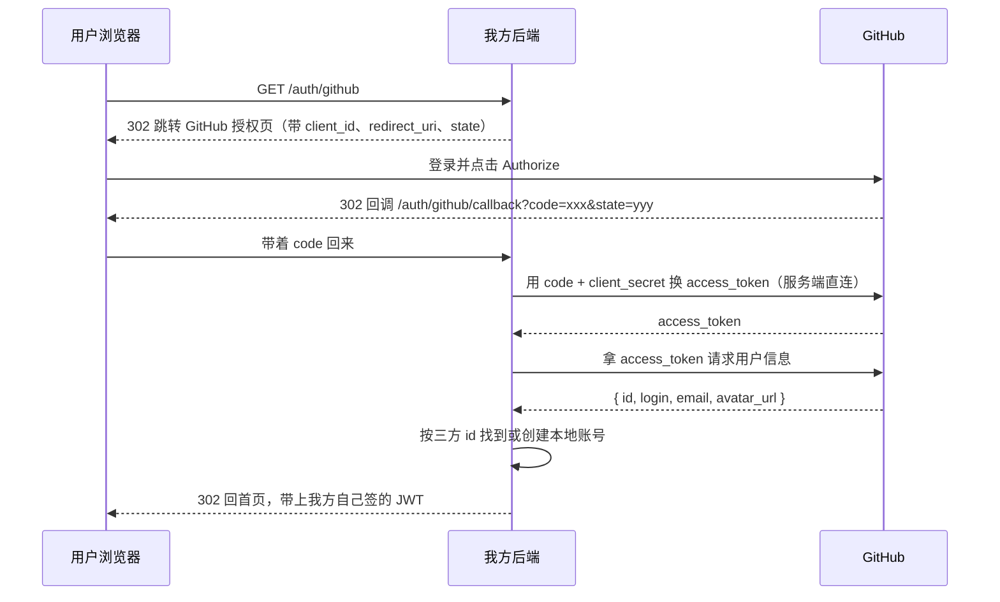
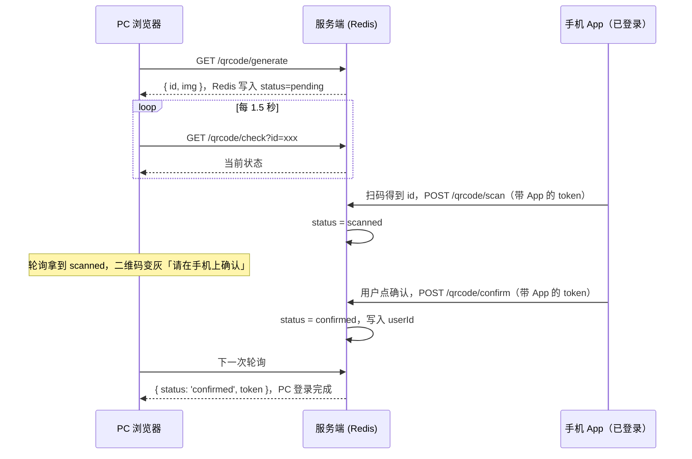

# 授权模型与三方登录

> 认证之后的第二道门：怎么判断「你能做什么」，以及 OAuth、邮箱验证码、扫码这三种免密登录方式怎么落地。

## 权限模型的演进

权限系统没有一步到位的设计，每一层抽象都是被具体需求逼出来的。

| 阶段 | 模型 | 被什么逼出来的 |
|---|---|---|
| 硬编码 | `if (user.isAdmin)` | 只有两种人的时候够用 |
| **ACL** | 用户 ↔ 权限 | 出现了第三种人：既不是管理员也不是普通用户，权限要单独配 |
| **RBAC** | 用户 ↔ 角色 ↔ 权限 | 用户从 3 个涨到 300 个，改一个权限要挨个改 300 遍 |
| RBAC + 资源级 | 角色管「能不能」，代码管「是不是他的」 | 「用户能查订单」不等于「能查别人的订单」 |
| **ABAC** | 按属性动态计算（时间、部门、金额、设备） | 「工作时间内、本部门、金额低于 5 万才能审批」这种规则塞不进任何一张表 |

绝大多数业务在第三、第四层就够了。ABAC 表达力最强，但规则引擎的复杂度和排查成本也最高——真正需要它的场景（金融风控、政务审批）远比想象中少。

---

## ACL：用户直连权限

ACL（Access Control List）的模型最直白：**记录每个用户拥有哪些权限点**。用户和权限是多对多，落到表上是三张：

```sql
user           (id, username, password_hash)
permission     (id, name, description)          -- name 如 'order:read'
user_permission(user_id, permission_id)          -- 中间表
```

Guard 里的逻辑就是「取出 handler 声明需要的权限，和当前用户拥有的权限求交集」：

```typescript
export const RequirePermission = (...perms: string[]) =>
  SetMetadata('require-permission', perms)

@Injectable()
export class AclGuard implements CanActivate {
  constructor(
    private reflector: Reflector,
    private usersService: UsersService,
  ) {}

  async canActivate(context: ExecutionContext): Promise<boolean> {
    const required = this.reflector.getAllAndOverride<string[]>(
      'require-permission',
      [context.getHandler(), context.getClass()],
    )
    if (!required?.length) return true   // 没声明就不管

    const { user } = context.switchToHttp().getRequest()
    if (!user) throw new UnauthorizedException('用户未登录')

    const owned = await this.usersService.findPermissionNames(user.id)
    const missing = required.filter((p) => !owned.includes(p))
    if (missing.length) {
      throw new ForbiddenException(`缺少权限：${missing.join(', ')}`)
    }
    return true
  }
}
```

```typescript
@Delete(':id')
@RequirePermission('order:delete')
remove(@Param('id') id: string) {}
```

**什么时候够用**：权限点少、用户少、而且授权很个性化——每个人的权限组合都不太一样，硬凑角色反而别扭。典型场景是内部小工具、B 端里给单个客户开特例。

**什么时候崩**：人一多就要挨个配。新来 20 个客服，每人 8 个权限，就是 160 次点击；客服岗职责变了要加一个权限，又得改 20 遍，还容易漏。这时候就该上 RBAC。

---

## RBAC：中间加一层角色

RBAC（Role Based Access Control）在用户和权限之间插了一层角色：**权限授给角色，角色授给用户**。管理员岗要多一个权限，改角色一次，所有管理员同时生效。

五张表：

```sql
user            (id, username, password_hash)
role            (id, name)                    -- '管理员' / '客服' / '财务'
permission      (id, name, description)       -- 'order:read' / 'order:delete'
user_role       (user_id, role_id)
role_permission (role_id, permission_id)
```

TypeORM 实体用 `@ManyToMany` + `@JoinTable` 描述这两层多对多，`@JoinTable` 的 `name` 就是中间表名（只写关系字段，其余列略）：

```typescript
@Entity()
export class User {
  @ManyToMany(() => Role)
  @JoinTable({ name: 'user_role' })
  roles: Role[]
}

@Entity()
export class Role {
  @ManyToMany(() => Permission)
  @JoinTable({ name: 'role_permission' })
  permissions: Permission[]
}
```

查询时用 `relations` 把两层一起带出来，得到的是权限点的扁平集合：

```typescript
async findPermissionNames(userId: number): Promise<string[]> {
  const user = await this.repo.findOne({
    where: { id: userId },
    relations: { roles: { permissions: true } },
  })
  const names = user.roles.flatMap((r) => r.permissions.map((p) => p.name))
  return [...new Set(names)]
}
```

Guard 的实现和上面的 `AclGuard` 完全一样——**换模型只换了「用户有哪些权限」的查法，判断逻辑一个字没动**。这里 `getAllAndOverride` 的语义值得留意：它按数组顺序取第一个有值的，`[getHandler(), getClass()]` 意味着**方法级声明覆盖类级声明**，所以可以在 Controller 上声明一个默认权限，再在个别方法上单独收紧或放宽。

而判断逻辑里比对的是权限点，不是角色名，这是有意的。

::: tip 应该校验 permission，不是 role
新手常写成 `@Roles('admin')`，让 Guard 去比对角色名。这条路走不远：**角色是给人看的组织概念，权限点才是给代码判断的原子事实。**

按角色判断的话，业务上新增一个「高级客服」角色，代码里所有 `@Roles('admin', 'support')` 都要翻出来改一遍——本来只是一次配置操作，变成了一次发版。按权限点判断，代码只声明「这个接口需要 `order:delete`」，之后角色怎么增删、谁拥有这个权限点，全在后台配置里解决，代码永远不用动。

角色是**授权时**的组织单位，权限点是**鉴权时**的判断单位，两者不该混。
:::

**角色继承（RBAC1）** 处理「主管拥有组员的所有权限，再加几个自己的」。做法是给 `role` 表加一个自引用的 `parent_id`，取权限时沿着 `parent` 链条往上逐级合并（记得加深度上限防环）。层级不深时够用；真要做树形组织权限，递归查询会很慢，一般改用闭包表或物化路径把祖先关系预存下来。多数系统的角色层级压根不超过三层，别提前上重武器。

### ACL vs RBAC

| | ACL | RBAC |
|---|---|---|
| 粒度 | 每个用户单独配，最细 | 以角色为单位，个体差异要靠多分角色凑 |
| 维护成本 | 随用户数线性增长 | 随角色数增长，用户数几乎不影响 |
| 适用规模 | 几十个用户以内 | 几百到几百万 |
| 典型产品 | 网盘的单文件分享（这个人能看这个文件） | 后台管理系统、CRM、ERP |

实际系统常常是两者混用：RBAC 打底，再留一张 `user_permission` 表给特例开小灶。

---

## 资源级权限

RBAC 只能回答「这个人能不能查订单」，回答不了「**这条**订单是不是他的」。`GET /orders/9527` 带着合法 token、拥有 `order:read` 权限，但 9527 是别人的订单——RBAC 全部放行。这类漏洞（越权访问对象）在真实系统里比权限配错常见得多。

两种落点：

```typescript
// 落点一：Guard 里查库校验 owner
@Injectable()
export class OrderOwnerGuard implements CanActivate {
  constructor(private ordersService: OrdersService) {}

  async canActivate(ctx: ExecutionContext) {
    const req = ctx.switchToHttp().getRequest()
    const order = await this.ordersService.findById(+req.params.id)
    if (order?.userId !== req.user.id) throw new ForbiddenException()
    return true
  }
}

// 落点二：Service 查询时直接把 userId 作为条件（推荐）
async findOne(orderId: number, userId: number) {
  const order = await this.repo.findOneBy({ id: orderId, userId })
  if (!order) throw new NotFoundException('订单不存在')
  return order
}
```

**推荐落点二**，两个原因：

- Guard 查一次库确认归属，Service 还要再查一次拿数据——同一行数据查了两遍。
- Guard 是「加上去」的保护，容易漏。新增一个接口忘了挂 `@UseGuards(OrderOwnerGuard)` 就是一个越权口子；而把 `userId` 写进 `where` 条件是**默认安全**的——忘了带，查不出数据，功能立刻不对，测试就会发现。

顺带一个细节：查不到时返回 404 而不是 403。403 等于告诉攻击者「这条订单存在，只是不属于你」，可以被用来枚举 id。

---

## 权限校验的性能

每个请求都做一次三表关联查询是不能接受的——鉴权是所有接口的公共路径，它的开销会乘上全站 QPS。两种缓存策略：

| | 权限写进 JWT payload | Redis 缓存权限集 |
|---|---|---|
| 校验时的查询 | 零，验签就拿到了 | 一次 Redis 读（亚毫秒） |
| 改权限后何时生效 | **等 token 过期**，最长一个有效期 | 立即，删掉 key 即可 |
| token 体积 | 随权限点数量膨胀，每个请求都传 | 不受影响 |
| 适合 | 权限极少变、权限点数量小 | 大部分业务系统 |

Redis 方案的实现是标准的 cache-aside：

```typescript
async getPermissions(userId: number): Promise<string[]> {
  const key = `perms:${userId}`
  const cached = await this.redis.get(key)
  if (cached) return JSON.parse(cached)

  const perms = await this.usersService.findPermissionNames(userId)
  await this.redis.set(key, JSON.stringify(perms), 1800)   // 兜底 TTL
  return perms
}
```

关键是**改权限时主动删 key**：改角色的权限，要删掉所有拥有该角色的用户的 key；改用户的角色，删这一个用户的 key。TTL 只是兜底，别指望它。如果角色下用户很多，删 key 的成本高，可以把缓存拆成两层——`role:{id}:perms` 和 `user:{id}:roles`，改角色权限时只删一个 role key。

> ⚠️ 别忘了权限点变更后**前端菜单也要刷新**。后端拦住了但按钮还亮着，用户点了报 403，体验上仍然是 bug。

---

## 三方登录（OAuth 2.0）

「用 GitHub 登录」的本质是：你不把密码给我，而是让 GitHub 替你向我证明「这个账号是我的」。标准做法是 OAuth 2.0 的**授权码流程**。



两个容易搞错的点：**`code` 换 token 必须在服务端做**（`client_secret` 不能出现在浏览器里）；**最终发给前端的是我方自己的 JWT，不是 GitHub 的 access_token**——后者只用来拉一次用户信息，之后就没用了。JWT 怎么签见[认证与登录状态](/guide/nestjs-auth)。

### 双路由模式

`passport-github2` 把上面整段流程都封装了，你只写策略 + 两个路由。**同一个 `AuthGuard('github')` 挂在两个路由上，行为完全不同**：挂在发起路由上它执行「302 跳转到 GitHub」，挂在回调路由上它执行「拿 code 换 token 并调 `validate()`」。策略靠请求里有没有 `code` 参数来区分。

```typescript
import { Strategy, Profile } from 'passport-github2'

@Injectable()
export class GithubStrategy extends PassportStrategy(Strategy, 'github') {
  constructor(config: ConfigService) {
    super({
      clientID: config.get('GITHUB_CLIENT_ID'),
      clientSecret: config.get('GITHUB_CLIENT_SECRET'),
      callbackURL: config.get('GITHUB_CALLBACK_URL'),
      scope: ['user:email'],   // 不申请 email 就拿不到邮箱
      state: true,             // 开启 state 防 CSRF
    })
  }

  async validate(accessToken: string, _refresh: string, profile: Profile) {
    return {
      provider: 'github',
      providerId: profile.id,          // 三方唯一 id，这才是身份锚点
      email: profile.emails?.[0]?.value,
      nickname: profile.username,
      avatar: profile.photos?.[0]?.value,
    }
  }
}
```

Google 的策略只有 `scope` 和 profile 字段形状不同，其余一模一样——这就是 Passport 抽象的价值：

```typescript
import { Strategy } from 'passport-google-oauth20'

@Injectable()
export class GoogleStrategy extends PassportStrategy(Strategy, 'google') {
  constructor(config: ConfigService) {
    super({
      clientID: config.get('GOOGLE_CLIENT_ID'),
      clientSecret: config.get('GOOGLE_CLIENT_SECRET'),
      callbackURL: config.get('GOOGLE_CALLBACK_URL'),
      scope: ['email', 'profile'],
    })
  }

  async validate(_at: string, _rt: string, profile: any) {
    return {
      provider: 'google',
      providerId: profile.id,
      email: profile.emails[0].value,
      nickname: profile.displayName,
      avatar: profile.photos?.[0]?.value,
    }
  }
}
```

路由这样写，`github` 换成 `google` 就是 Google 登录：

```typescript
@Controller('auth')
export class OauthController {
  constructor(private oauthService: OauthService) {}

  @Public()
  @Get('github')
  @UseGuards(AuthGuard('github'))
  githubStart() {}   // 空实现，Guard 直接 302 走了

  @Public()
  @Get('github/callback')
  @UseGuards(AuthGuard('github'))
  async githubCallback(@CurrentUser() identity: OauthIdentity, @Res() res: Response) {
    const { accessToken } = await this.oauthService.loginOrRegister(identity)
    // 不要把 token 当 JSON 返回：这是浏览器跳转回来的，得重定向回前端
    res.redirect(`${process.env.WEB_ORIGIN}/oauth/done#token=${accessToken}`)
  }
}
```

### 工程难点

策略代码是最简单的部分，真正的坑在下面四件事上。

**一、别在 `user` 表上加 `githubId` 字段。** 加一个三方就加一列，接第四个三方时这张表已经很难看了，而且没法表达「同一个人绑了 GitHub 和 Google 两个身份」。正确做法是拆成两张表：

```sql
users          (id, email, password_hash NULL, nickname, avatar)
user_identities(id, user_id, provider, provider_uid, UNIQUE(provider, provider_uid))
```

`users` 是「人」，`user_identities` 是「登录凭据」，一个人多条身份记录。`password_hash` 允许为空——纯三方注册的用户就没有密码。登录逻辑变成先查 `user_identities`：

```typescript
async loginOrRegister(identity: OauthIdentity) {
  const found = await this.identityRepo.findOne({
    where: { provider: identity.provider, providerUid: identity.providerId },
    relations: { user: true },
  })
  if (found) return this.authService.login(found.user)

  // 首次用这个三方账号进来：建 user + 建 identity，同一个事务里
  const user = await this.createUserWithIdentity(identity)
  return this.authService.login(user)
}
```

**二、按 email 自动合并账号是有风险的。** 「三方返回的 email 已存在于 `users`，那就自动绑到那个账号上」听起来很顺，但如果那个平台不校验邮箱所有权，攻击者把自己三方账号的邮箱填成受害者的，一次登录就接管了账号。安全做法：只在三方明确标记 `email_verified` 时才考虑自动合并，否则**让用户先用原有方式登录，再在设置页里主动绑定**。多一步操作，换掉一个账号接管漏洞。

**三、回调地址开发和生产不一样，只能走配置。** 它必须和三方平台后台登记的完全一致（协议、端口、路径全都算）：开发 `http://localhost:3000/auth/github/callback`，生产 `https://api.example.com/...`。GitHub 的 OAuth App 只允许配一个回调地址，所以多环境就得建多个 App；Google 可以在同一个凭证里登记多个 redirect URI。

**四、`state` 参数是必须的，不是可选的。** 它是发起时生成、存进 session、回调时比对的随机值。没有它，攻击者可以把自己账号的授权回调链接诱导受害者点开，让受害者的账号被绑到攻击者的三方身份上——OAuth 版的 CSRF。`passport-github2` 传 `state: true` 会自动生成和校验，但前提是**你已经启用了 session 中间件**，这是很多人开了 `state: true` 反而报错的原因。

---

## 邮箱验证码登录

用户输邮箱 → 后端生成验证码存 Redis 并发信 → 用户输验证码 → 后端比对，通过就签发 JWT。逻辑简单，全部难点在防刷。

```typescript
@Injectable()
export class EmailAuthService {
  constructor(private redis: RedisService, private mailer: MailerService) {}

  async sendCode(email: string, ip: string) {
    await this.guardAbuse(email, ip)

    const code = randomInt(100000, 999999).toString()   // 用 crypto，别用 Math.random
    await this.redis.set(`login:code:${email}`, code, 300)      // 5 分钟
    await this.redis.set(`login:sent:${email}`, '1', 60)        // 60 秒发送间隔
    await this.mailer.send(email, '登录验证码', `你的验证码是 ${code}，5 分钟内有效。`)
  }

  async verify(email: string, input: string) {
    const key = `login:code:${email}`
    const expected = await this.redis.get(key)
    if (!expected) throw new UnauthorizedException('验证码已过期，请重新获取')

    if (expected !== input) {
      // 错 5 次直接作废，防止 6 位码被暴力枚举
      const fails = await this.redis.incr(`login:fail:${email}`)
      if (fails === 1) await this.redis.expire(`login:fail:${email}`, 300)
      if (fails >= 5) await this.redis.del(key)
      throw new UnauthorizedException('验证码不正确')
    }

    await this.redis.del(key, `login:fail:${email}`)   // 一次性消费掉
    return this.usersService.findOrCreateByEmail(email)
  }
}
```

**防刷三道闸**，缺一道都会被打：

| 闸 | Redis key | 防的是 |
|---|---|---|
| 同邮箱发送频率 | `login:sent:{email}`，TTL 60s，存在就拒 | 有人拿你的接口给别人邮箱轰炸 |
| 同 IP 限流 | `login:ip:{ip}`，`incr` + TTL 3600，超阈值拒 | 换邮箱绕过第一道，批量消耗你的发信额度 |
| 验证码错误次数 | `login:fail:{email}`，超 5 次删掉验证码 | 6 位数字被暴力枚举（不限次的话期望 50 万次就中） |

```typescript
private async guardAbuse(email: string, ip: string) {
  if (await this.redis.get(`login:sent:${email}`)) {
    throw new BadRequestException('发送太频繁，请稍后再试')
  }
  const ipCount = await this.redis.incr(`login:ip:${ip}`)
  if (ipCount === 1) await this.redis.expire(`login:ip:${ip}`, 3600)
  if (ipCount > 20) throw new BadRequestException('操作过于频繁')
}
```

发信用 `nodemailer`，SMTP 主机、账号、授权码全从环境变量读：

```typescript
const transporter = createTransport({
  host: 'smtp.example.com',
  port: 465,
  secure: true,
  auth: { user: process.env.SMTP_USER, pass: process.env.SMTP_PASS },
})

await transporter.sendMail({ from: process.env.SMTP_USER, to: email, subject, html })
```

::: warning 验证码必须一次性消费
校验通过后**立刻 `del` 掉**，别等 TTL 自然过期。否则 5 分钟内同一个验证码可以反复使用——抓到一次包就能在有效期内任意重放登录。同理，错误次数超限时也要把验证码删掉，而不是只拒绝这一次。
:::

发信是外部 I/O，慢且会失败。生产环境建议把它丢进队列异步发，接口只负责写 Redis 和入队，立刻返回——否则 SMTP 抖动会直接表现为登录接口超时。

---

## 扫码登录

看起来很神奇，原理其实很朴素：**二维码里就是一个唯一 id，扫码和确认只是在改这个 id 在服务端的状态，PC 端一直在轮询这个状态。** 真正做认证的是手机上那个已登录的会话——它替 PC 端完成了身份声明。



Redis 里存一个短命的临时会话，`hash` 结构正好：

```typescript
// key: qrlogin:{uuid}，TTL 120 秒
type QrSession = {
  status: 'pending' | 'scanned' | 'confirmed' | 'canceled'
  userId?: number      // confirmed 之后才有
}
```

状态只允许单向流转，服务端必须校验来源状态，不能无脑赋值：

```text
pending ──scan──> scanned ──confirm──> confirmed（终态，可换 token）
                     └─────cancel───> canceled（终态）
    └── TTL 到期即消失，check 查不到 key 就是「已过期」
```

```typescript
@Post('qrcode/scan')
async scan(@Body('id') id: string, @CurrentUser() user: JwtPayload) {
  const key = `qrlogin:${id}`
  const session = await this.redis.hGetAll(key)
  if (!session.status) throw new GoneException('二维码已过期')
  if (session.status !== 'pending') throw new ConflictException('二维码已被使用')

  await this.redis.hSet(key, { status: 'scanned', scannedBy: user.sub })
  return { ok: true }
}

@Get('qrcode/check')
async check(@Query('id') id: string) {
  const session = await this.redis.hGetAll(`qrlogin:${id}`)
  if (!session.status) return { status: 'expired' }
  if (session.status !== 'confirmed') return { status: session.status }

  // 终态：发 token，并立刻删掉临时会话，防止重复兑换
  await this.redis.del(`qrlogin:${id}`)
  const user = await this.usersService.findById(+session.userId)
  return { status: 'confirmed', ...(await this.authService.login(user)) }
}
```

`/qrcode/scan` 和 `/qrcode/confirm` 都要求手机端已登录，`@CurrentUser()` 就是手机那边 JWT 解出来的用户——这一步就是整个流程的身份来源。`/qrcode/check` 必须是公开接口，因为 PC 端此时还没有任何凭证。

**过期处理**：靠 Redis 的 TTL，不需要定时任务。`check` 查不到 key 就返回 `expired`，前端停止轮询并显示「二维码已失效，点击刷新」。TTL 设 1~2 分钟，长了增加被别人扫到的窗口。轮询间隔 1.5 秒左右，同时给前端加一个总时长上限（比如 2 分钟后停止），否则用户开着页面不管，轮询会一直打。

::: danger 「确认」这一步不能省
技术上完全可以做成「扫到即登录」，但绝对不要。二维码是可以被贴到任何地方的——攻击者把自己网站生成的登录二维码印在「扫码领优惠券」的海报上，用户一扫，自己的账号就登录进了攻击者的浏览器，对方拿到完整会话。

「确认」这一步的价值在于**让用户看清自己在给谁授权**：确认页必须明确写出站点名称，风险高的场景还应该展示设备、地理位置，并提供醒目的取消按钮。这不是产品体验问题，是安全边界。
:::

---

## 小结

| 要解决的问题 | 用什么 |
|---|---|
| 这个接口需要什么权限 | 权限点元数据 + Guard，判断 permission 而不是 role |
| 权限怎么分配 | 用户少且个性化用 ACL，其余一律 RBAC |
| 这条数据是不是他的 | Service 查询带 `userId` 条件，不要在 Guard 里补 |
| 鉴权太慢 | Redis 缓存权限集，改权限时主动删 key |
| 不想让用户记密码 | OAuth 三方登录 / 邮箱验证码 / 扫码，最终都归到签发自己的 JWT |

Guard 的执行时机和 `ExecutionContext` 见[请求管道](/guide/nestjs-pipeline)，`SetMetadata` 与 `Reflector` 见[Metadata 与 Reflector](/guide/nestjs-metadata-reflector)，凭证的签发、刷新与撤销见[认证与登录状态](/guide/nestjs-auth)。

---

## 面试问答

**1. ACL 和 RBAC 怎么选？**

- ACL 用户直连权限，粒度最细但维护成本随用户数线性增长——新来 20 个客服每人 8 个权限就是 160 次配置，职责变了还要挨个改；RBAC 权限授给角色、角色授给用户，成本只随角色数增长。
- 权限点少、用户少、授权个性化（内部小工具、给单个客户开特例）用 ACL；其余一律 RBAC。实际系统常两者混用：RBAC 打底，留一张 `user_permission` 表给特例开小灶。
- 加分：角色继承（RBAC1）给 role 表加自引用 `parent_id` 沿链合并权限即可；多数系统层级不超过三层，别提前上闭包表这类重武器。

**2. Guard 里该比对角色名还是权限点？为什么？**

- 比对权限点。角色是授权时的组织单位，权限点是鉴权时的判断原子；按角色写 `@Roles('admin')`，业务上新增一个「高级客服」角色，代码里所有注解都要翻出来改一遍——本来是配置操作，变成了一次发版。
- 按权限点声明「这个接口需要 `order:delete`」，之后角色怎么增删、谁拥有这个权限点，全在后台配置里解决，代码永远不用动。
- 加分：`getAllAndOverride` 按 `[getHandler(), getClass()]` 顺序取第一个有值的，方法级声明覆盖类级——可以在 Controller 上声明默认权限，个别方法单独收紧或放宽。

**3. 「用户能查订单，但只能查自己的」，这层校验放哪？**

- 推荐落点二：Service 查询时直接把 `userId` 写进 where 条件——这是默认安全的：忘了带就查不出数据，功能立刻不对，测试就会发现。Guard 查库确认归属后 Service 还要再查一次拿数据，同一行查了两遍，而且 Guard 是「加上去」的保护，新接口忘了挂就是越权口子。
- 查不到时返回 404 而不是 403：403 等于告诉攻击者「这条订单存在，只是不属于你」，可以被用来枚举 id。

**4. 权限校验怎么避免每个请求都做三表关联查询？**

- 两条路对比：权限写进 JWT payload 零查询，但改权限要等 token 过期、token 随权限点膨胀；Redis 缓存权限集每次一次亚毫秒读，改权限删 key 立即生效——大部分业务系统选后者，标准的 cache-aside。
- TTL 只是兜底，改权限要主动删 key；角色下用户很多时把缓存拆两层（`role:{id}:perms` + `user:{id}:roles`），改角色权限只删一个 role key。
- 别踩的坑：权限点变更后前端菜单也要刷新——后端拦住了但按钮还亮着，用户点了报 403，体验上仍然是 bug。

**5. OAuth 三方登录有哪些必须做对的安全细节？**

- `code` 换 token 必须在服务端做（`client_secret` 不能出现在浏览器里）；最终发给前端的是我方自己签的 JWT，不是三方的 access_token；`state` 参数是必须的——防的是 OAuth 版 CSRF，且它依赖 session 中间件，很多人开了 `state: true` 反而报错就是这个原因。
- 身份锚点是 `(provider, provider_uid)`，拆出 `user_identities` 表，别在 user 表上加 `githubId` 字段——加一个三方加一列，也没法表达一个人绑多个身份。
- 别踩的坑：按 email 自动合并账号——三方平台不校验邮箱所有权时，攻击者把自己三方账号的邮箱填成受害者的，一次登录就接管了账号；只在明确 `email_verified` 时才考虑自动合并，否则让用户先用原有方式登录再主动绑定。

