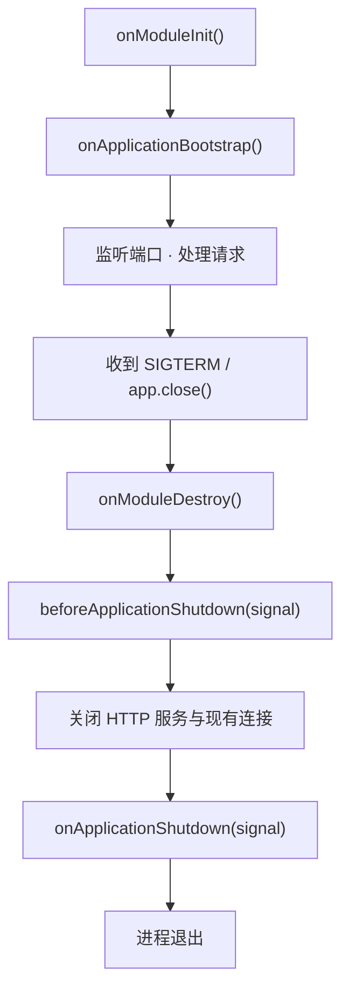

# NestJS 依赖注入

> 后端对象的依赖链很深，手写 `new` 组装很快就会失控。这篇讲清 IoC 容器怎么接管对象的创建、注入、生命周期与销毁。

## 从手写 new 说起：IoC 解决了什么

一个普通接口要串起四层对象：Controller → Service → Repository → DbConnection，连接还要读配置。手写组装是这样：

```typescript
const config = new AppConfig({ host: 'localhost', user: 'root' })
const db = new DbConnection(config)
const repo = new OrderRepository(db)
const controller = new OrderController(new OrderService(repo))
```

问题在后面：

| 痛点 | 表现 |
|---|---|
| 改一处动多处 | `DbConnection` 多一个参数，所有 `new DbConnection(...)` 都要改 |
| 顺序心智负担 | 谁先创建谁后创建要人记，依赖链一深就容易错 |
| 单测无法替换 | 依赖写死在类内部（`private repo = new OrderRepository(...)`），塞不进 Mock |
| 单例难保证 | 连接池只该有一个，但拦不住别的文件再 `new` 一个 |

第三条最致命。前端对这个问题很熟：React 里每个组件自己 `new CartStore()`，状态就各自独立、互相看不见；正确做法是顶层 Provider 提供唯一实例，子组件用 `useContext` 只声明"我要用"。**这就是控制反转：从主动创建依赖，变成被动声明、等待注入。**

NestJS 的 IoC 容器就是这棵 Provider 树的服务端版本，声明方式从 hook 换成了装饰器：

```typescript
@Injectable()
export class OrderService {
  constructor(private readonly repo: OrderRepository) {}   // 只声明，不创建
}

@Module({ controllers: [OrderController], providers: [OrderService, OrderRepository] })
export class OrderModule {}
```

启动时 Nest 从根模块扫描装饰器、算出依赖图、按拓扑顺序实例化并注入，每个 token 默认只保留一个实例——四个痛点一起消失。

> 容器凭什么知道 `repo` 要的是 `OrderRepository`？靠编译期写入的 `design:paramtypes` 元数据，机制见 [Metadata 与 Reflector](/guide/nestjs-metadata-reflector)。

---

## IoC、DI 和依赖倒置

| 概念 | 层级 | 说明 |
|---|---|---|
| IoC（控制反转） | 设计原则 | 控制权交给框架，依赖创建、生命周期管理都算 |
| DI（依赖注入） | 实现手段 | 落地 IoC 的一种方式：容器创建依赖并送进来 |
| DIP（依赖倒置） | 编码约束 | 高层模块依赖抽象，而不是具体实现 |

DI 只是换了"谁来 new"，DIP 才决定代码好不好换实现：

```typescript
export interface OrderRepository { findById(id: number): Promise<Order | null> }
export const ORDER_REPOSITORY = Symbol('ORDER_REPOSITORY')

@Injectable()
export class OrderService {                                            // 依赖抽象
  constructor(@Inject(ORDER_REPOSITORY) private readonly repo: OrderRepository) {}
}

// 模块里绑定实现，换存储只改这一行
providers: [{ provide: ORDER_REPOSITORY, useClass: MysqlOrderRepository }]
```

> ⚠️ TypeScript 的 interface 编译后不存在，**不能当 token 用**。要面向接口编程就得自己给一个运行时存在的 token（`Symbol` 或 class），这是在 Nest 里做 DIP 的固定代价。

---

## @Injectable() vs @Inject()

`@Injectable()` 标记"这个类交给容器管理"，`@Inject(token)` 标记"这个位置注入哪个 token"：

```typescript
@Injectable()
export class ReportService {
  constructor(
    private readonly catsRepo: CatsRepository,                   // 类 token：可推断，不用 @Inject
    @Inject(REDIS_CLIENT) private readonly redis: RedisClient,   // 非类 token：必须显式指定
  ) {}
}
```

Controller 不用写 `@Injectable()`，因为 `@Controller()` 已登记同样的元数据——Controller 只被注入依赖，不会被注入到别处。属性注入 `@Inject(X) private x: X` 只用于不便改构造函数签名的场景。

---

## Provider 不只是 Service

Provider 的完整含义是「一个 token + 怎么得到它的实例」，一共 5 种写法：

```typescript
providers: [
  CatsService,                                    // 1. 简写 = { provide: CatsService, useClass: CatsService }
  {
    provide: MAIL_SENDER,                         // 2. useClass：token 与实现分离
    useClass: isProd ? SesMailSender : ConsoleMailSender,
  },
  { provide: 'APP_VERSION', useValue: '1.4.2' },  // 3. useValue：直接给值，容器不实例化
  {
    provide: REDIS_CLIENT,                        // 4. useFactory：要计算 / 要依赖别人 / 要 await
    useFactory: async (config: ConfigService) => connectRedis(config.get<string>('REDIS_URL')),
    inject: [ConfigService],                      // 数组顺序 = 工厂函数参数顺序
  },
  { provide: 'LOGGER', useExisting: LoggerService },  // 5. useExisting：别名，指向同一个实例
]
```

> ⚠️ async 工厂会**阻塞启动**：所有异步 Provider 都 resolve 完，Nest 才开始监听端口。这通常正是想要的（连不上数据库就别接流量），但工厂里要自己设超时，否则一个卡住的连接会让容器永远起不来。

| 场景 | 选择 |
|---|---|
| 一个 token 对应多个候选实现（环境 / 租户 / Mock） | `useClass` |
| 常量、配置对象、已有的第三方实例 | `useValue` |
| 实例化要依赖其他 Provider、读配置，或需要 `await` | `useFactory` + `inject` |
| 旧 token 兼容、一个实例挂两个名字 | `useExisting`（官方 TypeORM 集成用它兼容旧的 `Connection` token） |

---

## token 该用什么类型

| 形态 | 写法 | 代价 |
|---|---|---|
| class | `providers: [CatsService]` | 无。类型自动推断，改名 IDE 跟着走 |
| 字符串 | `{ provide: 'REDIS', ... }` | 全局命名空间：两个库都用 `'REDIS'` 会静默互相覆盖，拼错要等运行时 |
| `Symbol` | `{ provide: REDIS_CLIENT, ... }` | 不会冲突，但要从模块导出、用的地方 import |

**能用 class 就用 class；注入接口或非类值时用导出的 `Symbol` 常量（集中放在 `tokens.ts`，拼错就是编译期错误），别在代码里散落裸字符串**——动机和前端把事件名、storage key 抽成常量完全一样。

---

## 可选注入与运行时解析

`@Optional()` 让依赖缺失时注入 `undefined` 而不是报错，用于"有就用、没有就降级"，写公共库时最常用——核心功能不该因为使用方少装一个可选依赖就崩掉：

```typescript
constructor(
  @Optional() @Inject(METRICS_CLIENT) private readonly metrics?: MetricsClient,
) {}
// 用的时候 this.metrics?.increment('order.created')，没接监控也照样跑
```

有些实例只有运行时才知道该取哪个（支付渠道路由、插件机制），构造函数没法提前声明，这时注入 `ModuleRef`，在方法里 `this.moduleRef.get<Channel>(CHANNEL_TOKENS[name], { strict: false })` 现取：

| 方法 | 用途 | 注意 |
|---|---|---|
| `get(token)` | 取当前模块内的单例，加 `{ strict: false }` 跨整个应用找 | 取 REQUEST / TRANSIENT 作用域会抛错；跨模块查找等于隐式依赖 |
| `await resolve(token)` | 取非单例作用域的 Provider | 每次调用新建子依赖树、返回新实例，传同一个 `ContextIdFactory.create()` 的 contextId 才共享 |
| `await create(SomeClass)` | 实例化没注册成 Provider 的类 | 依赖照样注入，用完自己丢掉 |

> `ModuleRef` 是逃生舱。构造函数能表达的依赖别挪到运行时——依赖一旦从声明变成埋在方法体里的 token，启动期的依赖校验就失效了。它也能用来打破循环依赖：不在构造函数注入对方，改成方法里现取。

---

## 全局模块 @Global()

正常情况下 B 模块要用 A 模块 `exports` 的 Provider 必须 `imports: [AModule]`；加 `@Global()` 后全应用可直接注入：

```typescript
@Global()
@Module({ providers: [PrismaService], exports: [PrismaService] })
export class PrismaModule {}
```

> ⚠️ `@Global()` 只免掉各处的 imports，模块本身仍要被根模块引入一次才会注册。

代价有三条：**依赖变隐式**，看 `imports` 拼不出真实依赖；**模块边界失效**，本该拆开的耦合会悄悄长回来；**单测更啰嗦**，`Test.createTestingModule` 不带全局模块。

那 `ConfigModule.forRoot({ isGlobal: true })` 为什么可以接受？它同时满足三个条件：属于横切基础设施而非业务逻辑；全应用只该有一个实例；几乎每个模块都要用。这类东西全局化是在减少噪音，和前端把主题、i18n 的 Context 挂在根节点同理。**业务模块永远不要 `@Global()`。** 动态模块怎么让调用方自己决定 `isGlobal`，见 [动态模块与配置管理](/guide/nestjs-dynamic-module)。

---

## 生命周期钩子

启动时逐层解析模块、实例化 Provider，全部就绪才监听端口；关闭时反过来。一共 5 个钩子：



| 钩子 | 时机 | 典型用途 |
|---|---|---|
| `onModuleInit` | 当前模块的依赖解析完 | 建数据库 / Redis 连接、编译模板 |
| `onApplicationBootstrap` | 所有模块初始化完、还没监听端口 | 预热缓存、注册到服务发现 |
| `onModuleDestroy` | 收到终止信号后最先执行 | 摘掉健康检查、停止消费 MQ |
| `beforeApplicationShutdown` | 所有 `onModuleDestroy` 完成后、关连接前 | 排空在途请求、flush 日志 |
| `onApplicationShutdown` | 连接已经关闭 | 关连接池、释放文件句柄 |

同一模块内先执行 controller / provider 的钩子，最后才是 module 自身的；跨模块则是依赖层级更深的先执行。所有钩子都支持 `async`，Nest 会等它 resolve 再往下走，后两个还能拿到 `signal` 参数。

> ⚠️ 别写依赖跨模块精确顺序的初始化逻辑。要"所有模块都好了"这个语义就用 `onApplicationBootstrap`。

前端类比：`onModuleInit` 就是 `useEffect(() => { ... }, [])`，销毁钩子就是它 return 的清理函数——区别是服务端不写清理会真的漏资源。

### enableShutdownHooks 为什么必须显式开

默认情况下 Nest **不监听** `SIGTERM`，三个销毁钩子一个都不会跑：

```typescript
const app = await NestFactory.create(AppModule)
app.enableShutdownHooks()      // 不写这行，onModuleDestroy 及之后的钩子永不触发
await app.listen(3000)
```

给进程挂信号监听器有开销，而且一个进程里可能跑多个 Nest 实例（测试、Monorepo），框架不替你决定谁响应信号。这是线上"连接没关干净"最常见的答案。

### K8s 滚动更新下的优雅退出

Pod 被删除时 kubelet 发出 `SIGTERM`，同时把它从 Service 的 endpoints 摘掉。但摘除是异步广播的，几百毫秒到几秒内**旧流量还会打进来**，所以正确顺序是先让健康检查失败、等流量停掉，再关连接：

```typescript
@Injectable()
export class GracefulShutdown implements OnModuleDestroy, BeforeApplicationShutdown {
  constructor(private readonly health: HealthState) {}

  onModuleDestroy() {
    this.health.markShuttingDown()   // readiness 立刻返回 503，让负载均衡摘流量
  }

  async beforeApplicationShutdown(signal?: string) {
    await sleep(5000)                // 留出 endpoints 传播 + 在途请求收尾的时间
  }
}
```

配套要把 `terminationGracePeriodSeconds` 设得比这里的等待更长，否则没等完就被 `SIGKILL`。

---

## 循环依赖

两个 Provider 互相注入、或两个 Module 互相 imports 就构成循环依赖。Nest 递归创建实例时第二个还没建好就被第一个要走，拿到 `undefined`，报错通常是 `Nest can't resolve dependencies of the XxxService` 或 `imports[0] is undefined`。

**Provider 之间**：两侧都用 `forwardRef` 注入。

```typescript
@Injectable()
export class OrderService {
  constructor(
    @Inject(forwardRef(() => CouponService)) private readonly coupon: CouponService,
  ) {}
}
// CouponService 里同样写 @Inject(forwardRef(() => OrderService))
```

**Module 之间**：两侧都用 `forwardRef` 导入。

```typescript
@Module({ imports: [forwardRef(() => CouponModule)], exports: [OrderService] })
export class OrderModule {}
// CouponModule 里同样 imports: [forwardRef(() => OrderModule)]
```

`forwardRef(() => X)` 把"取 X 这个 class"推迟到函数被调用那一刻，Nest 于是能先各自创建实例、再把引用转发过去。**两边都要加**，只加一侧照样解析失败。

### 大多数循环依赖是设计信号

代价是构造函数体内可能拿到尚未初始化完的引用（立刻调对方方法容易踩 `undefined`），模块之间也说不清谁依赖谁。按优先级排的三条出路：

| 方案 | 适用情形 |
|---|---|
| 抽第三个模块 | 共用逻辑其实属于第三个概念：两个 Service 都在算价 → 抽 `PricingService` |
| 用事件解耦 | 一个方向只是"通知"、不要返回值 → 发事件让对方订阅，依赖变单向 |
| `forwardRef` | 确实是双向业务协作，且短期内不打算重构 |

看到 `forwardRef` 先问一句"这两个模块是不是该合并、或者该拆出第三个"，别加上就当修好了。

---

## 作用域（Scope）

作用域写在 `@Injectable()` 的参数里，共三种：

```typescript
@Injectable()                              // Scope.DEFAULT：单例，全应用共享
@Injectable({ scope: Scope.REQUEST })      // 每个请求一个实例
@Injectable({ scope: Scope.TRANSIENT })    // 每个注入方各拿一个专属实例
```

自定义 Provider 同样可以指定：`{ provide: X, useFactory, scope: Scope.REQUEST }`。

REQUEST scope 的代价是**沿依赖链向上传染**：Controller 注入了 REQUEST 作用域的 Service，Controller 自己和它依赖的其他 Service、Repository 全变成请求级，每个请求都要重走一遍依赖解析和实例化，高 QPS 接口上开销明显；这些 Provider 还只能 `moduleRef.resolve()`，取不到 `get()`。

需要请求上下文时先考虑更便宜的方案：由 Guard / Interceptor 把数据挂到 `request` 上（见 [请求管道](/guide/nestjs-pipeline)），或用 `AsyncLocalStorage` 在单例内部隔离。确实要按请求隔离整棵依赖树（典型是多租户切数据源）再上 REQUEST scope。

TRANSIENT 的常见用途是给每个注入方一个带自己前缀的 Logger，注入方本身仍可以是单例。

---

## 单元测试中的 DI

换掉一个依赖只是换一个 Provider，这是 DI 最直接的回报：

```typescript
const repo = { save: jest.fn() }

const moduleRef = await Test.createTestingModule({
  providers: [OrderService, { provide: ORDER_REPOSITORY, useValue: repo }],
}).compile()

const service = moduleRef.get(OrderService)
```

想复用整个真实模块、只替换其中一两个依赖，用 `.overrideProvider(MAIL_SENDER).useValue(mock)`。

> ⚠️ 取 REQUEST / TRANSIENT 作用域的实例要用 `await moduleRef.resolve(X)`，`get(X)` 会抛错。

---

## 面试问答

**1. IoC、DI、DIP 是什么关系？**

- IoC 是设计原则（控制权交给框架，依赖创建、生命周期管理都算），DI 是落地它的实现手段（容器创建依赖送进来），DIP 是编码约束（高层模块依赖抽象）。
- DI 只是换了「谁来 new」，DIP 才决定代码好不好换实现：`@Inject(ORDER_REPOSITORY)` 依赖接口，换存储只改 providers 里绑定实现的那一行。
- 加分：TypeScript 的 interface 编译后不存在，不能当 token 用，要在 Nest 里做 DIP 得自己给一个运行时存在的 token（`Symbol` 或 class）。

**2. 五种 Provider 写法怎么选？**

- `useClass`：一个 token 对应多个候选实现（环境 / 租户 / Mock）；`useValue`：常量、配置、已有的第三方实例；`useFactory + inject`：实例化要依赖别人或需要 `await`；`useExisting`：别名，一个实例挂两个名字。
- token 能用 class 就用 class；注入接口或非类值时用导出的 `Symbol` 常量。
- 别踩的坑：token 用裸字符串——两个库都用 `'REDIS'` 会静默互相覆盖，拼错要等运行时才炸；async 工厂还会阻塞启动，工厂里要自己设超时，否则一个卡住的连接让容器永远起不来。

**3. 构造函数注入和 `ModuleRef` 运行时取实例有什么区别？**

- 构造函数注入是声明式的：启动期容器按依赖图解析并校验，缺依赖直接起不来。`ModuleRef.get(token)` 是运行时现取，依赖从声明变成埋在方法体里的 token，启动期的依赖校验对它失效——所以它是逃生舱，只在支付渠道路由、插件机制这种「运行时才知道取哪个」的场景用。
- `ModuleRef` 也能打破循环依赖：不在构造函数注入对方，改成方法里现取。
- 加分：循环依赖优先考虑抽第三个模块或用事件解耦；`forwardRef` 是最后的选择，而且两边都要加、只加一侧照样解析失败，加上也不等于修好——构造函数里可能拿到尚未初始化完的引用。

**4. REQUEST 作用域有什么代价？有什么更便宜的替代？**

- 沿依赖链向上传染：Controller 注入了请求级 Service，它自己和整条依赖链全变成请求级，每个请求重走依赖解析和实例化，高 QPS 接口开销明显；这些实例还只能 `moduleRef.resolve()` 取。
- 需要请求上下文时先考虑 Guard / Interceptor 把数据挂到 `request` 上，或用 `AsyncLocalStorage` 在单例内部隔离；确实要按请求隔离整棵依赖树（典型是多租户切数据源）再上 REQUEST scope。

**5. K8s 滚动更新时，Nest 服务怎么优雅退出？**

- `app.enableShutdownHooks()` 必须显式开：默认不监听 `SIGTERM`，三个销毁钩子一个都不会跑，这是线上「连接没关干净」最常见的答案。
- 顺序是 `onModuleDestroy` 先让 readiness 返回 503 摘流量；endpoints 摘除是异步广播的，`beforeApplicationShutdown` 里再等几秒让在途请求收尾；`terminationGracePeriodSeconds` 要设得比等待更长，否则没等完就被 `SIGKILL`。
- 加分：能说出为什么默认不监听信号——挂信号监听器有开销，且一个进程里可能跑多个 Nest 实例（测试、monorepo），框架不替你决定谁响应信号。
