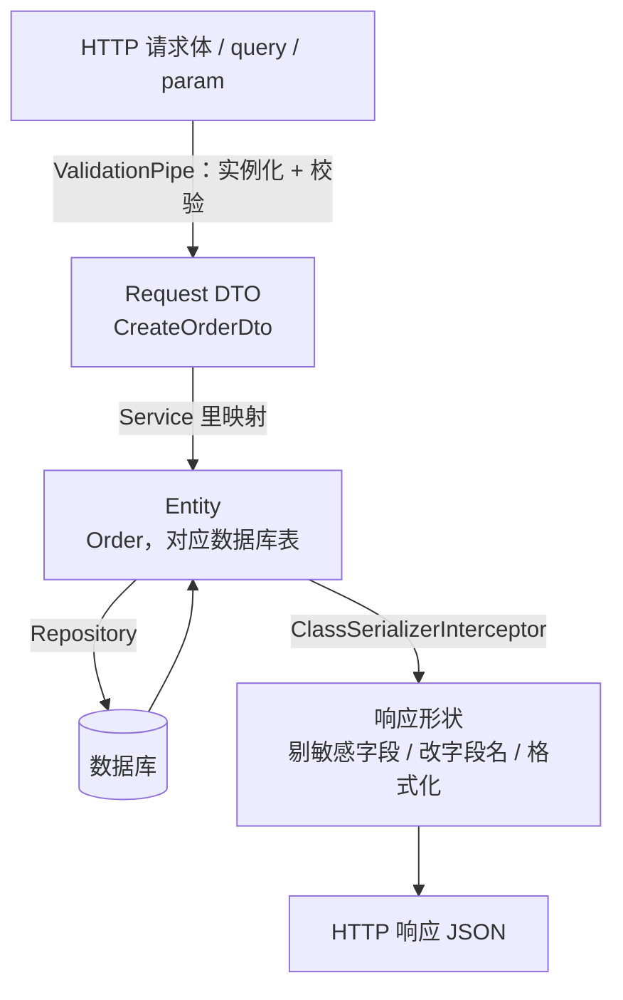

# NestJS DTO、序列化与 Swagger

> 请求进来要校验、响应出去要脱敏、接口文档还得跟着代码走。这三件事共用一套东西：DTO 类 + 一把装饰器。写对了就不需要手写 VO、不需要维护 md 文档。

## DTO 在分层里的位置

DTO（Data Transfer Object）是「跨层传数据用的形状」。一个接口的完整数据流是这样：



前端对这个分层其实很熟：Request DTO 就是表单校验的 schema（zod / yup 那一层），Entity 是后端的数据模型，响应形状就是接口文档里那份 `interface`。三者字段高度重合，所以最容易被偷懒合并成一个类。

### 为什么不能直接把 Entity 当出入参

| 问题 | 具体表现 |
|---|---|
| 暴露内部字段 | `passwordHash`、`inviterId`、`riskScore` 全被序列化出去，泄露一次就是安全事故 |
| 允许客户端写内部字段 | 直接 `repo.save(body)`，攻击者传一个 `{ "role": "admin" }` 就提权了（越权赋值 / mass assignment） |
| 耦合数据库 | 字段改名、拆表、换 ORM 都会连带改接口，前端跟着一起改 |
| 无法独立演进 | 接口要加一个「距今多少天」的计算字段，数据库里并没有这一列 |
| 校验规则没处放 | 「创建时密码必填、更新时不传密码」这种差异，一个 Entity 表达不了 |

结论：**入参必须是独立的 DTO**（这是安全边界，没有商量空间）；**出参可以复用 Entity，但要用 class-transformer 装饰器裁剪**（见下面「你不需要 VO 对象」一节）。

---

## 依赖与基线

```bash
npm install class-validator class-transformer
npm install @nestjs/swagger
```

`main.ts` 里开全局校验管道，DTO 才会生效：

```typescript
app.useGlobalPipes(
  new ValidationPipe({
    transform: true,               // 把 plain object 转成 DTO 实例，装饰器才有意义
    whitelist: true,               // 剔除 DTO 上没声明的字段
    forbidNonWhitelisted: true,    // 出现未声明字段直接 400
  }),
)
```

> `ValidationPipe` 的全部选项、`transformOptions.enableImplicitConversion` 的坑、自定义 Pipe、以及校验失败的错误结构怎么改，都在[参数校验与异常处理](/guide/nestjs-validation-filter)里，这篇不重复。这篇只讲 DTO 类本身怎么写。

`transform: true` 是一切的前提。不开它，`@Body()` 拿到的是 `JSON.parse` 出来的普通对象，不是 `CreateOrderDto` 的实例，class-validator 和 class-transformer 都无从下手。

---

## 用映射类型组合 DTO

一个资源通常需要四五个 DTO：创建、更新、查询、响应。字段大面积重合，手抄一遍等于埋四份将来要同步的重复代码。Nest 提供了四个映射类型（mapped types），从一个基准 DTO 派生出其余全部：

| 工具 | 作用 | 典型用途 |
|---|---|---|
| `PartialType(T)` | 继承 T 的全部字段与校验规则，再给每个字段补上 `@IsOptional()` | Update DTO（PATCH 语义：传什么改什么） |
| `PickType(T, ['a','b'])` | 只保留列出的字段，**不改必填性** | 登录 DTO 从注册 DTO 里挑 email + password |
| `OmitType(T, ['a','b'])` | 去掉列出的字段，其余照搬 | Response DTO 去掉 `password` |
| `IntersectionType(A, B)` | 合并两个 DTO 的字段，各自的必填性保留 | 查询 DTO = 业务过滤条件 + 通用分页 DTO |

```typescript
export class CreateArticleDto {
  @IsString() @Length(1, 120)
  title: string

  @IsString() @IsNotEmpty()
  content: string

  @IsArray() @IsString({ each: true })
  tags: string[]

  @IsEnum(ArticleStatus)
  status: ArticleStatus
}

// PATCH：全字段可选
export class UpdateArticleDto extends PartialType(CreateArticleDto) {}

// 草稿箱只允许改这两个字段，且都必填
export class SaveDraftDto extends PickType(CreateArticleDto, ['title', 'content'] as const) {}

// 列表查询 = 可选的业务过滤 + 必填分页
export class ListArticleDto extends IntersectionType(
  PartialType(PickType(CreateArticleDto, ['status', 'tags'] as const)),
  PaginationDto,
) {}
```

四个工具可以任意嵌套，`as const` 让字段名有编译期检查——字段改名时这里会直接报错，比运行时才发现好得多。

### 高频坑：两套同名映射类型

`PartialType` 这几个名字在**两个包里各有一份实现**：

| 来源 | 继承 class-validator 元数据 | 继承 `@ApiProperty` 元数据 |
|---|---|---|
| `@nestjs/mapped-types` | ✅ | ❌ |
| `@nestjs/swagger` | ✅ | ✅ |

症状很典型：校验一切正常，Swagger 里 `UpdateArticleDto` 的 schema 却是空的，或者只剩你手写在子类里的那几个字段。因为 `@nestjs/mapped-types` 版本压根不认识 `@ApiProperty` 写下的那份元数据，派生类自然带不上。

**只要项目装了 `@nestjs/swagger`，这四个工具就一律从 `@nestjs/swagger` 导入。** 两个包混用是最隐蔽的一种：单独看每处 import 都对，只有文档默默丢字段。

```typescript
// ✅ 项目里有 Swagger 就用这行
import { PartialType, PickType, OmitType, IntersectionType } from '@nestjs/swagger'

// ⚠️ 只在没装 @nestjs/swagger 的项目里用
import { PartialType } from '@nestjs/mapped-types'
```

顺带一个语义坑：`PartialType` 是靠**给每个字段补 `@IsOptional()`** 实现的，所以基类上的 `@IsNotEmpty()` 会「看起来失效」——空 body 也能通过校验。这正是 PATCH 想要的语义；如果某个字段在更新时也必须传，就在子类里重新声明它。

---

## class-validator 装饰器速查

按用途分组，覆盖日常 90% 的需求。

**类型判定**

| 装饰器 | 说明 |
|---|---|
| `@IsString()` / `@IsNumber()` / `@IsBoolean()` / `@IsObject()` / `@IsArray()` | 基础类型 |
| `@IsInt()` | 整数，比 `@IsNumber()` 严 |
| `@IsDate()` / `@IsDateString()` | 前者要 `Date` 实例（配 `@Type(() => Date)`），接口层通常用后者收 ISO 8601 字符串 |
| `@IsEnum(E)` / `@IsIn([...])` / `@IsNotIn([...])` | 枚举、白名单、黑名单 |

**字符串**

| 装饰器 | 说明 |
|---|---|
| `@Length(min, max)` / `@MinLength(n)` / `@MaxLength(n)` | 长度区间 |
| `@Matches(/^1[3-9]\d{9}$/)` | 正则，手机号这类本地化规则用它 |
| `@IsEmail()` / `@IsUrl()` / `@IsUUID('4')` / `@IsJSON()` / `@IsIP()` / `@IsHexColor()` | 常见格式 |
| `@IsAlpha()` / `@IsAlphanumeric()` / `@IsNumberString()` | 字符集约束 |
| `@Contains(s)` / `@NotContains(s)` | 子串 |

**数字**

| 装饰器 | 说明 |
|---|---|
| `@Min(n)` / `@Max(n)` | 取值区间 |
| `@IsPositive()` / `@IsNegative()` | 正负 |
| `@IsDivisibleBy(n)` | 整倍数，比如金额必须是 100 的整数倍 |

**数组与嵌套**

| 装饰器 | 说明 |
|---|---|
| `@ArrayMinSize(n)` / `@ArrayMaxSize(n)` | 元素个数 |
| `@ArrayUnique()` | 元素不重复，可传 `(o) => o.id` 指定比较键 |
| `@ArrayContains([...])` / `@ArrayNotContains([...])` | 必须包含 / 不能包含 |
| `@IsString({ each: true })` | `each: true` 把任意校验器作用到每个元素上 |
| `@ValidateNested()` | 递归校验对象字段，**必须配 `@Type()`** |

**条件与通用**

| 装饰器 | 说明 |
|---|---|
| `@IsOptional()` | 值为 `undefined` / `null` 时跳过该字段的其余校验 |
| `@IsDefined()` | 只拒绝 `undefined` / `null`，空字符串放过 |
| `@IsNotEmpty()` | 同时拒绝 `''`，比 `@IsDefined()` 严 |
| `@ValidateIf((o) => ...)` | 条件成立才校验这个字段 |
| `@Allow()` | 不校验，但在 `whitelist: true` 下保留该字段 |
| 选项 `{ message }` | 自定义错误文案，支持 `$value` `$property` `$constraint1` 占位符 |
| 选项 `{ groups: ['create'] }` | 一个 DTO 两套规则，配 `ValidationPipe` 的 `groups` 使用 |

> ⚠️ 参数顺序容易写错：带自身配置的校验器，**第一个参数是它自己的选项，`ValidationOptions` 排第二**。`@IsEmail({}, { message: '邮箱格式不对' })` 里那个空对象不能省。


---

## 嵌套校验：@ValidateNested 与 @Type 必须成对

```typescript
export class AddressDto {
  @IsString() @IsNotEmpty()
  province: string

  @Matches(/^\d{6}$/)
  zipCode: string
}

export class OrderItemDto {
  @IsInt() @IsPositive()
  skuId: number

  @IsInt() @Min(1) @Max(999)
  quantity: number
}

export class CreateOrderDto {
  @ValidateNested()
  @Type(() => AddressDto)              // 少了这行，province / zipCode 一个都不校验
  address: AddressDto

  @IsArray()
  @ArrayMinSize(1)
  @ValidateNested({ each: true })      // each: true 才会逐个元素递归
  @Type(() => OrderItemDto)
  items: OrderItemDto[]
}
```

分工是这样的：`@Type()` 属于 class-transformer，负责把嵌套的普通对象**实例化成 `AddressDto`**；`@ValidateNested()` 属于 class-validator，负责**递归进去校验**。TypeScript 的类型注解编译后就没了，运行时 class-transformer 不知道该 new 哪个类，所以 `@Type()` 不能省。

漏写 `@Type()` 的表现最坑：不报错，嵌套字段的规则全部静默跳过，你以为校验过了。数组场景漏写 `each: true` 同理——只校验数组本身，不看元素。

---

## 条件校验与入参归一化

`@ValidateIf()` 拿到整个 DTO 对象，返回 `false` 时该字段的其余校验器全部跳过：

```typescript
export class CreatePayoutDto {
  @IsEnum(PayoutChannel)
  channel: PayoutChannel

  @ValidateIf((o: CreatePayoutDto) => o.channel === PayoutChannel.Bank)
  @Matches(/^\d{16,19}$/, { message: '银行卡号格式不正确' })
  cardNo?: string

  @ValidateIf((o: CreatePayoutDto) => o.channel === PayoutChannel.Wallet)
  @IsString() @IsNotEmpty()
  walletId?: string
}
```

和 `@IsOptional()` 的区别：`@IsOptional()` 是「没传就算了」，`@ValidateIf()` 是「按别的字段决定要不要管」。银行卡渠道下 `cardNo` 不传必须报错，这时只能用后者。

`@Transform()` 在校验**之前**加工值，用来把脏输入捏成规范形状，避免每个 Service 都写一遍 `trim()`：

```typescript
export class RegisterDto {
  @Transform(({ value }) => (typeof value === 'string' ? value.trim().toLowerCase() : value))
  @IsEmail()
  email: string

  @Transform(({ value }) => (Array.isArray(value) ? value : String(value ?? '').split(',')))
  @IsString({ each: true })
  tags: string[]                       // 同时兼容 ?tags=a,b 和 ?tags=a&tags=b
}
```

> ⚠️ `@Transform()` 里一定要防御非预期类型。攻击者传 `email: { "$ne": null }` 时 `value.trim()` 会抛 `TypeError`，冒出去就是 500 而不是 400。


---

## 自定义校验器：两种写法

内置装饰器覆盖不到的规则（跨字段比较、查库判重）要自己写。两条路，选择标准只有一条：**要不要注入 Service**。

### 写法一：registerDecorator，纯函数逻辑

适合不依赖任何外部资源的规则。把它包成一个装饰器工厂，用起来和内置的没区别：

```typescript
import { registerDecorator, ValidationArguments, ValidationOptions } from 'class-validator'

/** 校验本字段的日期晚于另一个字段 */
export function IsAfter(otherField: string, options?: ValidationOptions) {
  return function (target: object, propertyName: string) {
    registerDecorator({
      name: 'isAfter',
      target: target.constructor,
      propertyName,
      constraints: [otherField],              // 存进 args.constraints
      options,
      validator: {
        validate(value: unknown, args: ValidationArguments) {
          const other = (args.object as Record<string, unknown>)[args.constraints[0]]
          if (typeof value !== 'string' || typeof other !== 'string') return false
          return new Date(value).getTime() > new Date(other).getTime()
        },
        defaultMessage: (args) => `${args.property} 必须晚于 ${args.constraints[0]}`,
      },
    })
  }
}

// 用法：@IsDateString() @IsAfter('startAt') endAt: string
```

`ValidationArguments` 上有四样东西：`value`（当前值）、`constraints`（注册时传的参数数组）、`property`（字段名）、`object`（整个 DTO 实例，跨字段校验就靠它）。`defaultMessage()` 提供兜底文案，调用方仍可用 `{ message }` 覆盖。


### 写法二：ValidatorConstraint + @Injectable()，可以注入 Service

「这个邮箱是否已注册」必须查库，校验器就得能拿到 `UsersService`。把约束写成一个 Provider：

```typescript
import { Injectable } from '@nestjs/common'
import {
  ValidatorConstraint, ValidatorConstraintInterface,
  ValidationArguments, registerDecorator, ValidationOptions,
} from 'class-validator'

@ValidatorConstraint({ name: 'IsEmailAvailable', async: true })
@Injectable()
export class IsEmailAvailableConstraint implements ValidatorConstraintInterface {
  constructor(private readonly users: UsersService) {}     // 正常注入

  async validate(email: unknown): Promise<boolean> {
    if (typeof email !== 'string') return false
    return !(await this.users.existsByEmail(email))
  }

  defaultMessage(args: ValidationArguments) {
    return `邮箱 ${args.value} 已被注册`
  }
}

export function IsEmailAvailable(options?: ValidationOptions) {
  return (target: object, propertyName: string) =>
    registerDecorator({
      target: target.constructor,
      propertyName,
      options,
      validator: IsEmailAvailableConstraint,      // 传类，由容器实例化
    })
}
```

约束类要在模块里注册成 Provider（`providers: [IsEmailAvailableConstraint]`），否则容器不认识它。

**关键一步：必须在 `main.ts` 里把 class-validator 的实例来源接到 Nest 容器上。**

```typescript
import { useContainer } from 'class-validator'

const app = await NestFactory.create(AppModule)
useContainer(app.select(AppModule), { fallbackOnErrors: true })
await app.listen(3000)
```

class-validator 是个独立库，默认自己 `new` 约束类，不走 IoC 容器——构造函数参数全是 `undefined`，`this.users` 一用就抛 `Cannot read properties of undefined`。`useContainer` 把「谁来创建实例」这件事交给 Nest 之后，依赖注入才生效。`fallbackOnErrors: true` 的意思是容器里找不到时退回默认的 `new`，不加这个会让所有非 Provider 的普通约束类直接报错。

> ⚠️ 查库校验会给每个请求增加一次 IO，而且这个「不存在」的结论在拿到之后立刻就可能过期——高并发下仍然会有两个请求同时通过。它只负责给用户一个友好提示，**数据库上的唯一索引才是真正的保证**。真正的唯一性冲突要在 Service 层捕获数据库错误来处理。


---

## 序列化：你不需要 VO 对象

出参这一侧有两条路。手写 Response 类（有人叫 VO）的那条，要为每个资源维护一个字段几乎重复的类，再手抄一份映射：

```typescript
export class UserVo { id: number; email: string; nickname: string; createdAt: string }

// Service 里逐字段抄一遍
return { id: user.id, email: user.email, nickname: user.nickname ?? '', createdAt: user.createdAt.toISOString() }
```

它能解决问题，代价是每加一个字段要改三处（Entity、VO、映射函数），而且映射是纯手工活——漏抄一个字段编译器也不会管。20 个资源就是 20 份这样的重复。

另一条路：**直接返回 Entity，用装饰器声明「哪些字段不出去、出去时长什么样」**，映射交给 `ClassSerializerInterceptor`。

| | 手写 VO | Entity + 装饰器 |
|---|---|---|
| 加一个字段 | 改 3 处 | 改 1 处 |
| 漏字段 | 静默漏，靠人 review | 默认全出，只需声明例外 |
| 敏感字段 | 靠「记得不要抄」 | `@Exclude()` 一次，全局生效 |
| 一个资源多种视图 | 建多个 VO 类 | 一个 Entity + `groups` |
| 缺点 | 啰嗦、易漏 | 出参形状不写在类型里，得看装饰器 |

除了「一个 Entity 要对应形状差异极大的多个接口」这种情况，第二条路都更划算。

### 常用装饰器

```typescript
import { Exclude, Expose, Transform } from 'class-transformer'

@Entity('users')
export class User {
  @PrimaryGeneratedColumn() id: number

  @Column({ unique: true }) email: string

  @Exclude()                                         // 永不出现在响应里
  @Column({ name: 'password_hash' }) passwordHash: string

  @Expose({ name: 'nick' })                          // 响应里改名成 nick
  @Column({ nullable: true }) nickname: string | null

  @Transform(({ value }) => (value as Date).toISOString())
  @CreateDateColumn({ name: 'created_at' }) createdAt: Date

  @Expose({ groups: ['admin'] })                     // 只有 admin 组能看到
  @Column({ name: 'risk_score' }) riskScore: number

  @Expose()                                          // getter 也能导出成字段
  get isNew(): boolean {
    return Date.now() - this.createdAt.getTime() < 7 * 86400_000
  }
}
```

| 装饰器 / 选项 | 作用 |
|---|---|
| `@Exclude()` | 字段不进入响应；加在类上则「默认全不导出」 |
| `@Expose()` | 显式导出；用于 getter、或类上是 `@Exclude()` 时开白名单 |
| `@Expose({ name })` | 改字段名（`createdAt` → `created_at`） |
| `@Expose({ groups })` | 按角色 / 场景出不同字段 |
| `@Expose({ toPlainOnly })` | 只在「实例 → JSON」方向生效，反向不改 |
| `@Transform(({ value, obj }) => ...)` | 改值：格式化时间、分转元、脱敏手机号；`obj` 是整个实例 |
| `@Type(() => Child)` | 关联对象也按 `Child` 的装饰器序列化 |

启用拦截器：

```typescript
// 局部
@UseInterceptors(ClassSerializerInterceptor)
@Controller('users')
export class UsersController {}

// 全局（推荐，走容器所以能注入依赖）
providers: [{ provide: APP_INTERCEPTOR, useClass: ClassSerializerInterceptor }]
```

按角色出字段用 `@SerializeOptions()`：

```typescript
@Get(':id')
@SerializeOptions({ groups: ['admin'] })     // 只有这个接口带 riskScore
findOneForAdmin(@Param('id', ParseIntPipe) id: number) {
  return this.users.findOne(id)
}
```

`ClassSerializerInterceptor` 内部就是拿到返回值、读它的 class、按装饰器 `instanceToPlain` 一遍。想自己手写一个（加白名单、加字段脱敏），实现思路见 [RxJS 与 Interceptor 实战](/guide/nestjs-rxjs-interceptor)。

### 坑一：返回的不是 Entity 实例，装饰器全部失效

这是最常见的「装饰器没生效」原因。序列化依赖对象的**运行时类**，返回普通对象时 class-transformer 无从查找元数据，于是原样输出——`passwordHash` 就这么泄露了。

```typescript
// ❌ 这些都会绕过 @Exclude()
return { ...user }                                   // 展开成了普通对象
return user.toJSON()
return await this.repo.query('SELECT * FROM users')  // 原生 SQL 返回普通对象
return { list: users, total }                        // 外层是普通对象，users 元素虽是实例，但没有 @Type() 指引
```

三个修法：

```typescript
return this.repo.findOneBy({ id })     // 1. 保持返回实例，Repository 给的就是 Entity 实例
return plainToInstance(User, rows)     // 2. 普通对象手动还原成实例

// 3. 包一层分页壳时，给壳里的字段加 @Type()
export class PagedUsers {
  @Type(() => User) list: User[]
  total: number
}
```

> ⚠️ 单测里一定要断言「响应体里没有敏感字段」，而不是断言「Entity 上有 `@Exclude()`」。前者能抓到这个坑，后者抓不到。

### 坑二：excludeExtraneousValues 白名单模式的取舍

默认是黑名单：**没标注的字段一律导出**，你只声明例外。新加一列忘了标 `@Exclude()`，它就直接出去了。

反过来可以走白名单：类上加 `@Exclude()`（或 `strategy: 'excludeAll'`），只有 `@Expose()` 的字段能出；配 `plainToInstance(User, data, { excludeExtraneousValues: true })` 效果更彻底。

| | 黑名单（默认） | 白名单（`excludeExtraneousValues`） |
|---|---|---|
| 加字段的默认行为 | 自动出现在响应里 | 不出现，要手动 `@Expose()` |
| 安全性 | 漏标一次就泄露 | 漏标只是少个字段，不会泄露 |
| 啰嗦程度 | 低 | 每个字段一行 `@Expose()` |
| 适合 | 内部管理后台、字段稳定的资源 | 对外开放 API、金融 / 医疗等强合规场景 |

选哪个取决于「泄露一个字段的代价」和「多写一行的成本」哪个更高。**对外 API 用白名单**，这条几乎没有例外。

---

## Swagger：让文档跟着代码走

Swagger 是 OpenAPI 标准的一套实现。`@nestjs/swagger` 扫描路由和 DTO，在运行时生成 OpenAPI 文档，顺带给你一个能直接发请求的调试页面——前端不用再等你手写 md。

### DocumentBuilder 配置

```typescript
import { SwaggerModule, DocumentBuilder } from '@nestjs/swagger'

const config = new DocumentBuilder()
  .setTitle('订单服务')
  .setDescription('订单、支付、退款相关接口')
  .setVersion('1.0')
  .addTag('orders', '下单与订单查询')          // 给 @ApiTags('orders') 补一句人话描述
  .addBearerAuth()                             // 页面右上角出现 Authorize 按钮
  .addServer('/api')                           // 有全局前缀时必须写，否则 try it out 打错地址
  .build()

const document = SwaggerModule.createDocument(app, config)
SwaggerModule.setup('docs', app, document, {
  jsonDocumentUrl: 'docs/json',                        // 导给其他文档平台用
  swaggerOptions: { persistAuthorization: true },      // 刷新页面不用重新填 token
})
```

> ⚠️ `@ApiBearerAuth()` 只是给接口打「需要鉴权」的标记，**必须配上 `DocumentBuilder` 里的 `.addBearerAuth()`**，否则页面上没有输入 token 的地方。这两个一个也不能少。

### @ApiProperty 常用选项

| 选项 | 作用 |
|---|---|
| `description` / `example` | 字段说明与示例值，直接决定文档可读性 |
| `required` | 是否必填，`@ApiPropertyOptional()` 等价于 `required: false` |
| `type` | 显式指定类型，泛型 / 联合类型必须手写 |
| `isArray` | 数组，配 `type` 使用 |
| `enum` + `enumName` | 枚举值列表；给了 `enumName` 才会在 schema 里抽成可复用的枚举 |
| `nullable` | 允许为 `null`（和 `required: false` 不是一回事） |
| `default` | 默认值 |
| `minimum` / `maximum` / `minLength` / `maxLength` / `pattern` | 约束，会渲染进文档 |
| `minItems` / `maxItems` / `uniqueItems` | 数组约束 |
| `format` | `'date-time'`、`'binary'`、`'email'` 等 OpenAPI 格式 |
| `readOnly` / `writeOnly` / `deprecated` | 只读（响应有、请求无）、只写、已废弃 |
| `oneOf` / `allOf` | 联合类型与组合，写法参考 OpenAPI schema |

### 接口层装饰器

```typescript
@ApiTags('orders')
@ApiBearerAuth()
@Controller('orders')
export class OrdersController {
  @Post()
  @ApiOperation({ summary: '创建订单', description: '库存不足时返回 409' })
  @ApiCreatedResponse({ description: '创建成功', type: Order })
  @ApiConflictResponse({ description: '库存不足' })
  create(@Body() dto: CreateOrderDto) {}

  @Get(':id')
  @ApiOperation({ summary: '订单详情' })
  @ApiParam({ name: 'id', description: '订单 ID', example: 10086 })
  @ApiOkResponse({ type: Order })
  @ApiNotFoundResponse({ description: '订单不存在' })
  findOne(@Param('id', ParseIntPipe) id: number) {}
}
```

`@ApiOkResponse` / `@ApiCreatedResponse` / `@ApiNotFoundResponse` 这类是 `@ApiResponse({ status: ... })` 的语义化简写，可读性更好。`@ApiTags` 既能加在 controller 上，也能加在单个方法上把它分到另一组。请求体的 `@ApiBody` 一般可以省——`@Body() dto: CreateOrderDto` 已经足够让插件推断出来。


### 泛型分页响应怎么标

`@ApiOkResponse({ type: PagedResult<Order> })` 是写不出来的：装饰器在运行时执行，而 TS 泛型编译后就没了。OpenAPI 侧的解法是手工拼 schema，用 `getSchemaPath()` 引用已注册的模型：

```typescript
export class PagedResult<T> {
  @ApiProperty({ description: '总条数' })
  total: number

  items: T[]              // 泛型字段不标 @ApiProperty，schema 由下面的工厂拼
}

/** 复用的装饰器工厂：ApiPaged(Order) */
export const ApiPaged = <TModel extends Type<unknown>>(model: TModel) =>
  applyDecorators(
    ApiExtraModels(PagedResult, model),          // 让这两个类进 components.schemas
    ApiOkResponse({
      schema: {
        allOf: [
          { $ref: getSchemaPath(PagedResult) },
          { properties: { items: { type: 'array', items: { $ref: getSchemaPath(model) } } } },
        ],
      },
    }),
  )

// 用法
@Get()
@ApiPaged(Order)
list(@Query() query: ListOrderDto) {}
```

`ApiExtraModels` 是必须的：`PagedResult` 和 `Order` 都没有直接出现在任何 `type:` 里，Swagger 扫不到它们，`$ref` 就会指向一个不存在的 schema，页面上表现为一片空白。`applyDecorators`（来自 `@nestjs/common`）把两个装饰器打包成一个，调用方只写一行。

### 文件上传接口

`@Body()` 的推断在 `multipart/form-data` 上不管用，得手写：

```typescript
@Post('avatar')
@UseInterceptors(FileInterceptor('file'))
@ApiConsumes('multipart/form-data')
@ApiBody({
  schema: {
    type: 'object',
    required: ['file'],
    properties: {
      file: { type: 'string', format: 'binary' },     // format: 'binary' 才会渲染出选择文件按钮
      albumId: { type: 'integer', example: 3 },
    },
  },
})
upload(@UploadedFile() file: Express.Multer.File, @Body('albumId') albumId: string) {}
```

注意 `multipart` 里所有非文件字段都是字符串，DTO 上要靠 `@Transform()` 或 `@Type()` 转类型。

### CLI 插件：省掉大部分 @ApiProperty

给每个字段手写 `@ApiProperty()` 很快就会变成负担，而这些信息 TS 类型里本来就有。`@nestjs/swagger` 带一个编译期插件，在 `nest-cli.json` 里打开：

```json
{
  "collection": "@nestjs/schematics",
  "sourceRoot": "src",
  "compilerOptions": {
    "plugins": [
      {
        "name": "@nestjs/swagger",
        "options": {
          "introspectComments": true,
          "classValidatorShim": true,
          "dtoFileNameSuffix": [".dto.ts", ".entity.ts"],
          "controllerFileNameSuffix": [".controller.ts"]
        }
      }
    ]
  }
}
```

原理是**编译期读 TS 类型信息，自动给 DTO / Entity 的每个属性补上 `@ApiProperty`**：

| 插件能自动推出来的 | 依据 |
|---|---|
| 字段类型、是否数组 | TS 类型注解 |
| `required` | 属性上有没有 `?` |
| `description` / `summary` | `introspectComments: true` 时读字段和方法上的 JSDoc 注释 |
| `minLength` / `maximum` / `enum` 等约束 | `classValidatorShim: true` 时把 class-validator 装饰器翻译成 OpenAPI 约束 |
| 响应类型 | handler 的返回类型注解 |

开了插件之后，只有插件推不出来的才需要手写：`example`、复杂泛型、`format: 'binary'`、联合类型。

> ⚠️ 两个前提：插件只对文件名符合 `dtoFileNameSuffix` / `controllerFileNameSuffix` 的文件生效；它挂在 Nest 的编译流程上，用 `nest build` / `nest start` 才会跑，直接 `tsc` 或换成 SWC 时要额外配置。改了配置记得重启，插件产物是编译期写进去的，热重载不一定刷新。

### 生产环境要不要关掉 Swagger

文档页面会完整暴露你的接口清单、参数结构、字段约束，等于给攻击者一份地图。原则：

| 场景 | 做法 |
|---|---|
| 对公网开放的服务 | 生产关掉，或挂在内网域名 / 走网关鉴权 |
| 前后端分离的内部系统 | 可以开，但加一层 Basic Auth 或只允许内网 IP |
| 任何环境 | `jsonDocumentUrl` 产出的 JSON 也要一起管控——很多人只挡了 UI 页面 |

```typescript
if (process.env.NODE_ENV !== 'production') {
  SwaggerModule.setup('docs', app, SwaggerModule.createDocument(app, config))
}
```

更好的做法是把 OpenAPI JSON 在 CI 里生成、推到内部文档平台，生产进程根本不加载 Swagger——省下运行时的扫描开销和一份内存里的文档对象。

---

## compodoc：给陌生项目画依赖图

Swagger 描述的是「接口长什么样」，compodoc 描述的是「代码结构长什么样」——模块之间谁 import 谁、每个模块导出了哪些 Provider、每个 Service 有哪些方法。

```bash
npm install --save-dev @compodoc/compodoc

npx @compodoc/compodoc -p tsconfig.json -s -o          # 生成并启动本地服务、自动开浏览器
npx @compodoc/compodoc -p tsconfig.json -d docs/code   # 只输出静态站到 docs/code
npx @compodoc/compodoc -p tsconfig.json -s --theme postmark --coverageTest 60
```

常用参数：`-p` 指定 tsconfig，`-s` 启本地服务，`-o` 自动开浏览器，`-d` 输出目录，`-w` 监听变更，`--theme` 换主题，`--coverageTest` 设置注释覆盖率门槛（可以放进 CI 卡住没写注释的代码）。它原本是给 Angular 写的，因为项目结构相似所以对 Nest 也管用。

什么项目值得用：**接手一个陌生的 Nest 项目时**。十几个模块互相 import，看代码得跳十几个文件才能拼出全貌，而 compodoc 的模块依赖图一眼就能看出哪个模块是核心、哪个 Provider 被到处依赖、哪里有本不该存在的耦合。反过来，三五个模块的小项目装它意义不大。

---

## 收尾：目录、命名与取舍

| 问题 | 结论 |
|---|---|
| DTO 放哪 | 跟着业务模块走：`src/orders/dto/create-order.dto.ts`。跨模块复用的（`PaginationDto`、`IdParamDto`）放 `src/common/dto/` |
| 命名 | `动词 + 资源 + Dto`：`CreateOrderDto` / `UpdateOrderDto` / `ListOrderDto`。文件名 `create-order.dto.ts`，后缀别省——Swagger 插件靠它识别 |
| 一个操作一个 DTO 吗 | 是。哪怕现在字段完全一样，创建和更新的校验规则迟早会分岔，共用一个类到时候要靠 `groups` 硬拗 |
| 什么时候该拆新 DTO | 出现「这个字段只在某种情况下才允许传」时。`@ValidateIf()` 超过两三处，说明这是两个不同的操作，该拆成两个接口 |
| 出参可以直接用 Entity 吗 | 可以，配 `@Exclude()` + `ClassSerializerInterceptor`。这是默认选择 |
| 什么时候出参要单独建类 | 响应形状和表结构差异大（聚合多张表、字段全部重命名）、或一个 Entity 要服务多个形状差异极大的接口 |
| Entity 上堆装饰器会不会太乱 | 会。TypeORM + class-validator + class-transformer + Swagger 四套装饰器同堂时，把校验装饰器留给 DTO，Entity 上只放持久化和序列化两套 |
| 校验能不能替代 Service 里的判断 | 不能。DTO 只管「格式对不对」，「这个 SKU 存在吗、库存够吗」属于业务规则，放 Service 层 |

> ⚠️ 最后一个容易忘的细节：`@Exclude()` 只影响运行时的响应，**不影响 Swagger schema**——文档里那个字段还在。要让文档也一致，同一个属性上再加一个 `@ApiHideProperty()`。

数据持久化那一侧（Entity 怎么写、关系怎么映射、迁移怎么管）见 [数据库操作与 TypeORM](/guide/nestjs-database)；换 Prisma 的话，schema 就是唯一真源，DTO 的类型可以直接从生成的 client 里取，见 [Prisma：另一条 ORM 路线](/guide/nestjs-prisma)。
