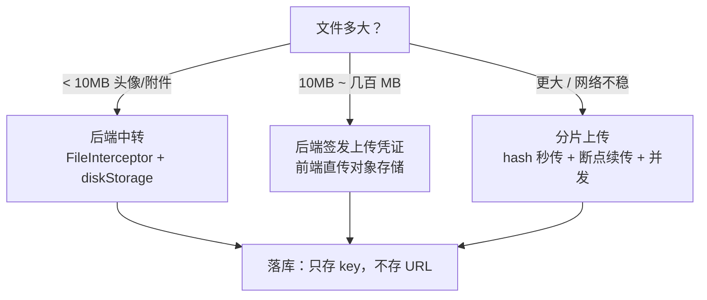
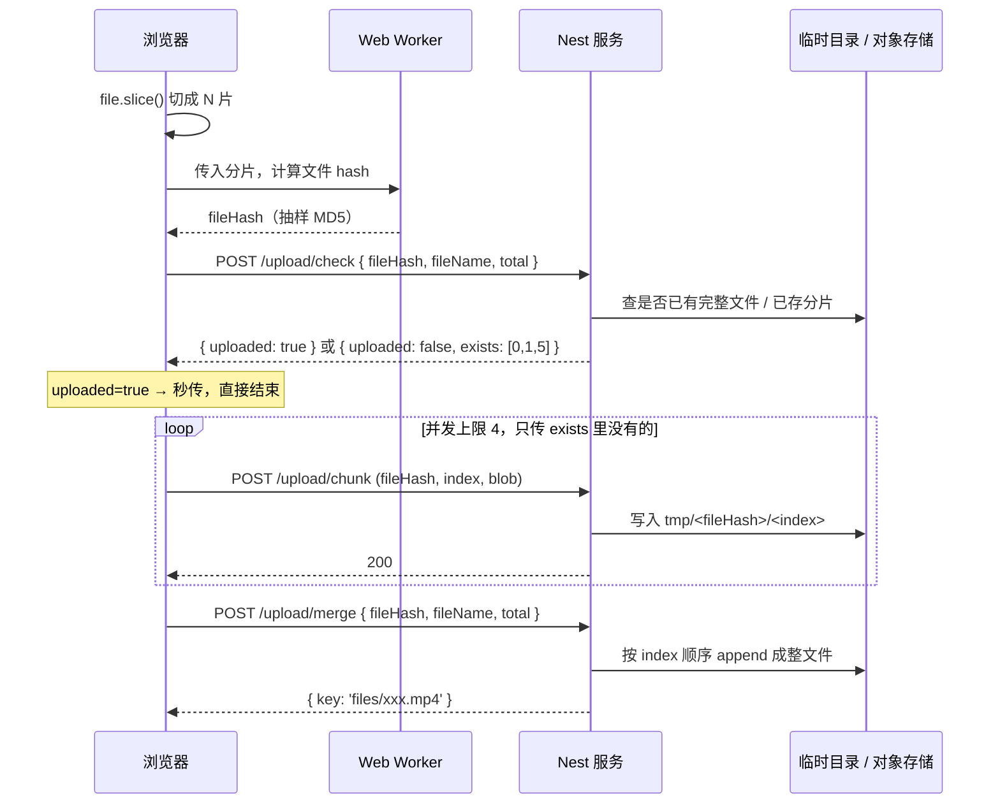
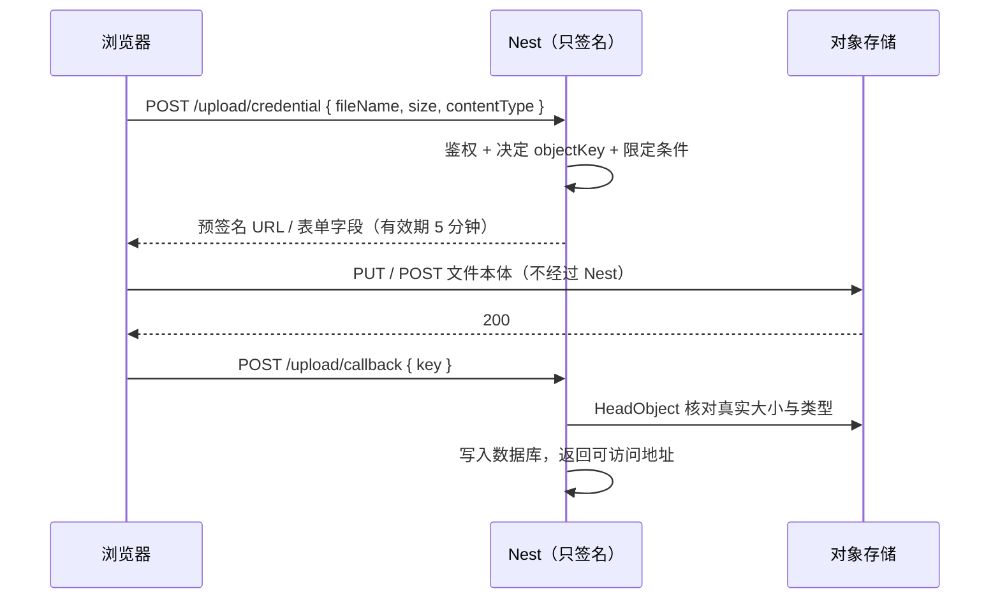

# 文件上传与大文件处理

> 上传看起来只是一个 `<input type="file">`，但从 100KB 的头像到 10GB 的视频，中间要换三套方案。这篇把前后端两侧串起来：multer 到底在做什么、分片上传的协议长什么样、以及为什么生产环境的文件字节流根本不该经过你的 Node 进程。

## 三条路线，先选路再写代码

上传方案的分歧点只有一个：**文件的字节流走不走你的应用服务器**。

| 路线 | 字节流路径 | 适用体积 | 代价 | 复杂度 |
|---|---|---|---|---|
| 后端中转 | 浏览器 → Node → 磁盘 / 对象存储 | < 10MB | 吃应用带宽、内存和连接数；进程重启打断上传 | 最低，一个装饰器 |
| 后端签名 + 前端直传 | 浏览器 → 对象存储 | 10MB ~ 数百 MB | 后端只签名不过流量；要处理 CORS、凭证边界、上传结果登记 | 中等 |
| 分片上传（可叠加直传） | 浏览器切片 → 存储，最后合并 | > 数百 MB，或弱网下的任何大文件 | 要自己实现协议、临时空间、清理与合并；换来秒传、断点续传、并发 | 最高 |



三条路线不是替代关系，是**按体积升级**的关系。真实项目里通常同时存在：头像走中转（顺手要做裁剪压缩），文档附件走直传，视频走分片直传。

> ⚠️ 一条容易犯的错：数据库里存完整 URL。域名换了、从自建 MinIO 迁到云 OSS、从公有读改成签名访问，历史数据全废。**只存 bucket 里的 object key**，URL 在读取时拼。

---

## multer 基础：Nest 的上传其实是 Express 的能力

浏览器上传文件用的是 `multipart/form-data` 编码：请求体被一串随机的 boundary 切成若干段，每段有自己的头（字段名、文件名、类型）和内容。boundary 本身写在 `Content-Type` 头里。

```
Content-Type: multipart/form-data; boundary=----WebKitFormBoundaryX7dK
```

这种格式 Express 的 `body-parser` 不解析，所以需要 multer 这个中间件：它把请求体拆开，文件落到磁盘或内存，然后在 `req.file` / `req.files` 上留下描述对象，普通字段留在 `req.body`。

Nest 的上传能力就是 multer 的一层封装——四个 Interceptor 一对一映射到 multer 的四个方法。**理解这层映射，比记 API 名字有用**：

| 表单结构 | Nest Interceptor | 取值装饰器 | 注入到参数的类型 |
|---|---|---|---|
| 一个字段一个文件 | `FileInterceptor('avatar')` | `@UploadedFile()` | `Express.Multer.File` |
| 一个字段多个文件 | `FilesInterceptor('photos', 9)` | `@UploadedFiles()` | `Express.Multer.File[]` |
| 多个字段各自若干文件 | `FileFieldsInterceptor([{ name: 'cover', maxCount: 1 }, { name: 'attachments', maxCount: 5 }])` | `@UploadedFiles()` | `Record<string, Express.Multer.File[]>` |
| 字段名不确定 | `AnyFilesInterceptor()` | `@UploadedFiles()` | `Express.Multer.File[]`（要自己看 `fieldname`） |

> ⚠️ 第三行的注入类型是**对象**而不是数组，和第二行共用 `@UploadedFiles()` 却形状不同，这是最常踩的一脚。`AnyFilesInterceptor` 反过来把字段结构拍平成数组，字段归属只能从每个元素的 `fieldname` 反推。

```typescript
@Controller('files')
export class FilesController {
  @Post('avatar')
  @UseInterceptors(FileInterceptor('avatar'))
  uploadAvatar(
    @UploadedFile() file: Express.Multer.File,
    @Body() dto: UploadAvatarDto,        // 普通字段照常走 DTO 校验
  ) {
    return { key: file.filename, size: file.size }
  }

  @Post('feedback')
  @UseInterceptors(
    FileFieldsInterceptor([
      { name: 'screenshot', maxCount: 1 },
      { name: 'logs', maxCount: 5 },
    ]),
  )
  uploadFeedback(
    @UploadedFiles() files: { screenshot?: Express.Multer.File[]; logs?: Express.Multer.File[] },
  ) {
    return { shots: files.screenshot?.length ?? 0, logs: files.logs?.length ?? 0 }
  }
}
```

两个环境细节：类型 `Express.Multer.File` 来自 `@types/multer`，要单独装（`npm i -D @types/multer`），否则 TS 报找不到命名空间；`@Body()` 和文件可以共存，multer 已经把非文件字段还原到 `req.body` 上了。

### MulterModule：把配置从装饰器里挪出来

每个 Interceptor 都能接第二个参数传 multer 选项，但把 `dest`、`limits` 抄在十个控制器里显然不对。`MulterModule` 提供模块级默认值：

```typescript
@Module({
  imports: [
    MulterModule.registerAsync({
      inject: [ConfigService],
      useFactory: (config: ConfigService) => ({
        storage: diskStorage({ destination: config.get('UPLOAD_TMP_DIR') }),
        limits: {
          fileSize: 10 * 1024 * 1024,   // 单文件上限，字节
          files: 5,                     // 单请求文件数上限
          fields: 20,                   // 非文件字段数上限
        },
        fileFilter(req, file, cb) {
          // 只做便宜的粗筛，真正的校验交给 Pipe
          cb(null, /\.(png|jpe?g|webp|pdf)$/i.test(file.originalname))
        },
      }),
    }),
  ],
})
export class UploadModule {}
```

`limits` 不是可选项而是必需项。不设 `fileSize`，一个 2GB 的请求就能把磁盘或内存吃满；不设 `files`，一次请求塞一万个空文件也能打满 inode。**超限时 multer 抛的是 `MulterError`（`code` 形如 `LIMIT_FILE_SIZE` / `LIMIT_UNEXPECTED_FILE`），默认会变成 500**，要在 Exception Filter 里翻成 400 并带上人话（见[参数校验与异常处理](/guide/nestjs-validation-filter)）。

---

## 存储策略：diskStorage 与 memoryStorage

multer 有两种落地方式，选错了要么丢文件要么爆内存。

| | `diskStorage` | `memoryStorage` |
|---|---|---|
| 文件去哪 | 写进磁盘临时目录，`file.path` 有值，`file.buffer` 为 `undefined` | 全量读进内存，`file.buffer` 有值，无 `path` |
| 内存占用 | 恒定（流式写盘） | 并发数 × 文件大小 |
| 适合 | 要留在本机、或体积不确定 | 收到后立刻转存对象存储 / 立刻做图片处理，不想产生临时文件 |
| 风险 | 临时文件要有人清理 | 10 个并发 × 100MB = 1GB 常驻堆外内存，OOM 就在这里 |

选 `memoryStorage` 时**必须**把 `limits.fileSize` 压到很小（几 MB），并且清楚同时能有多少并发。容器内存 512MB 却允许 50MB 文件并发上传，就是在等着被 OOMKilled。

### 为什么必须重命名文件

直接用 `file.originalname` 当磁盘文件名，等于把命名权交给攻击者：

| 恶意输入 | 后果 |
|---|---|
| `../../.env` | 路径穿越：`path.join(dest, name)` 跑出上传目录，覆盖配置文件 |
| `报告.pdf` | 不同平台文件系统编码不一致，取回时变成乱码，链接 404 |
| 两个用户都传 `avatar.png` | 后者静默覆盖前者 |
| `shell.php`、`x.html` | 上传目录若被静态服务器直接暴露，就是一个可执行入口或 XSS 落点 |

安全的做法是**完全丢弃原始文件名**，只从它身上取一个白名单校验过的扩展名：

```typescript
const ALLOWED_EXT = new Set(['.png', '.jpg', '.jpeg', '.webp', '.pdf'])

export const safeDiskStorage = diskStorage({
  destination(req, file, cb) {
    const dir = path.join(process.cwd(), 'tmp', 'uploads')
    fs.mkdir(dir, { recursive: true }, (err) => cb(err, dir))   // recursive 已经幂等，不要 try 空 catch
  },
  filename(req, file, cb) {
    const ext = path.extname(file.originalname).toLowerCase()
    if (!ALLOWED_EXT.has(ext)) return cb(new BadRequestException('不支持的文件类型'), '')
    cb(null, `${randomUUID()}${ext}`)                          // 原始名一个字都不用
  },
}
```

原始文件名不是不要，是**只存进数据库当展示用**，下载时再通过 `Content-Disposition` 还给用户（下文有中文文件名的正确写法）。上传目录本身也不该由 Node 直接对外暴露，交给 Nginx 或对象存储，并确保它不在任何脚本解释器的执行路径上。

---

## 校验：ParseFilePipe，和「不要信 mimetype」

Nest 内置了一套文件校验 Pipe，通过 `@UploadedFile()` 的参数传入：

```typescript
@Post('avatar')
@UseInterceptors(FileInterceptor('avatar'))
upload(
  @UploadedFile(
    new ParseFilePipe({
      validators: [
        new MaxFileSizeValidator({ maxSize: 2 * 1024 * 1024, message: '头像不能超过 2MB' }),
        new FileTypeValidator({ fileType: /^image\/(png|jpeg|webp)$/ }),
        new RealFileTypeValidator({ allow: ['png', 'jpg', 'webp'] }),   // 自定义，见下
      ],
      fileIsRequired: true,
    }),
  )
  file: Express.Multer.File,
) {}
```

`ParseFilePipe` 的价值在于它把「校验失败」统一翻成 400 并说清是哪一条不过，不用自己写一串 `if`。但它有个前提要认清。

### `file.mimetype` 是客户端说的，不是事实

`mimetype` 直接来自 multipart 段头里的 `Content-Type`，**这个值由上传方填写**。用 curl 或改一行前端代码，就能把一个 `.exe` 声明成 `image/png`。内置 `FileTypeValidator` 默认比对的就是这个字符串（新版本在能拿到 `file.buffer` 时会附带做一次真实类型探测），用 `diskStorage` 时 buffer 是空的，等于只做了一次君子协定。

真实类型要从文件头几个字节的 magic number 读：

```typescript
const SIGNATURES: Record<string, number[]> = {
  png: [0x89, 0x50, 0x4e, 0x47],
  jpg: [0xff, 0xd8, 0xff],
  gif: [0x47, 0x49, 0x46],
  pdf: [0x25, 0x50, 0x44, 0x46],
  webp: [0x52, 0x49, 0x46, 0x46],   // RIFF，第 8~12 字节还要是 WEBP
}

export class RealFileTypeValidator extends FileValidator<{ allow: string[] }> {
  async isValid(file?: Express.Multer.File): Promise<boolean> {
    if (!file) return false
    const head = file.buffer ?? (await readHead(file.path, 12))
    return this.validationOptions.allow.some((type) =>
      SIGNATURES[type]?.every((byte, i) => head[i] === byte),
    )
  }

  buildErrorMessage(): string {
    return `文件真实类型不在允许范围内：${this.validationOptions.allow.join(', ')}`
  }
}

async function readHead(filePath: string, length: number): Promise<Buffer> {
  const handle = await fs.promises.open(filePath, 'r')
  try {
    const { buffer } = await handle.read(Buffer.alloc(length), 0, length, 0)
    return buffer
  } finally {
    await handle.close()
  }
}
```

生产上更省事的选择是 `file-type` 包，它维护了几百种格式的签名表。要注意 magic number 也只证明「文件头像 PNG」，不证明内容无害——一个合法 PNG 里可以塞任意载荷。**如果这些文件会被别人下载，还要靠 `Content-Type` 白名单 + `Content-Disposition: attachment` + 独立域名，避免被当成脚本在你的主域上执行。**

### 大小限制要在三个地方各设一次

| 层 | 配置 | 超限的表现 |
|---|---|---|
| Nginx | `client_max_body_size 20m;` | 直接 413，请求根本进不到 Node —— 好事，省了带宽 |
| multer | `limits.fileSize` | `MulterError: LIMIT_FILE_SIZE`，要自己翻成 400 |
| 业务校验 | `MaxFileSizeValidator` | 400 + 人话提示，可以按接口/按用户等级给不同上限 |

三层的默认值必须是**外层 ≥ 内层**。Nginx 默认只有 1MB，很多人调完 multer 发现还是 413，原因就在这。反过来，只调 Nginx 不设 multer，就等于没有限制。

---

## Swagger 里怎么描述上传接口

Swagger 默认按 JSON 推断请求体，上传接口要手动声明编码和 schema，否则文档里那个「Try it out」按钮给不出文件选择框：

```typescript
@Post('feedback')
@ApiConsumes('multipart/form-data')
@ApiBody({
  schema: {
    type: 'object',
    required: ['screenshot'],
    properties: {
      title: { type: 'string', description: '问题标题' },
      screenshot: { type: 'string', format: 'binary', description: '截图，≤2MB' },
      logs: {
        type: 'array',
        items: { type: 'string', format: 'binary' },
        description: '日志文件，最多 5 个',
      },
    },
  },
})
@UseInterceptors(FileFieldsInterceptor([{ name: 'screenshot', maxCount: 1 }, { name: 'logs', maxCount: 5 }]))
upload(@UploadedFiles() files: FeedbackFiles, @Body() dto: FeedbackDto) {}
```

`format: 'binary'` 是文件字段的标记，数组文件用 `type: 'array'` 包一层。DTO 上的 `@ApiProperty` 在 `multipart` 下不会自动合并进来，普通字段也要写进这份 schema，这是 multipart 接口文档最啰嗦的地方。DTO 与文档注解的一般写法见 [DTO 与序列化](/guide/nestjs-dto)。

---

## 大文件分片上传

一个 2GB 的文件用单请求上传，会同时撞上四面墙：网关有请求体上限和超时；传到 90% 断网就得从零重来；进度只能靠 `onUploadProgress` 估；单条 TCP 连接吃不满带宽。

分片把它拆成「很多个小上传 + 一次合并」，顺带换来三个能力：**秒传**（服务端已有同 hash 文件，直接登记）、**断点续传**（只补缺失分片）、**并发**（多连接并行跑满带宽）。



### 前端：切片与 hash

切片本身很便宜，`File` 继承自 `Blob`，`slice` 只是改了个视图，不复制数据：

```typescript
const CHUNK_SIZE = 5 * 1024 * 1024

function createChunks(file: File) {
  const chunks: Blob[] = []
  for (let start = 0; start < file.size; start += CHUNK_SIZE) {
    chunks.push(file.slice(start, start + CHUNK_SIZE))
  }
  return chunks
}
```

真正的坑在 hash。文件 hash 是秒传和续传的唯一身份，必须由内容决定（不能用文件名 + 大小，改个名就命中别人的文件）。但对 2GB 文件做全量 MD5 要读完整个文件，在主线程上跑就是几十秒的白屏。两个正交的手段：

- **放进 Web Worker**，主线程不卡。`spark-md5` 的 `ArrayBuffer` 增量接口天生适合：`spark.append(buf)` 逐片喂，最后 `spark.end()`。
- **抽样 hash**：只取首片、尾片，以及中间每片的固定偏移的少量字节，拼成一个小 buffer 再算 MD5。1GB 文件从几十秒降到几十毫秒。

```typescript
// worker.ts —— 抽样 hash：首尾整片 + 中间每片取 2 字节
self.onmessage = async ({ data: { file, chunkSize } }) => {
  const spark = new SparkMD5.ArrayBuffer()
  const chunks = createChunks(file, chunkSize)

  for (const [i, chunk] of chunks.entries()) {
    const isEdge = i === 0 || i === chunks.length - 1
    const sample = isEdge ? chunk : chunk.slice(Math.floor(chunk.size / 2), Math.floor(chunk.size / 2) + 2)
    spark.append(await sample.arrayBuffer())
    self.postMessage({ type: 'progress', value: (i + 1) / chunks.length })
  }

  self.postMessage({ type: 'done', hash: spark.end() })
}
```

抽样是在拿**碰撞概率换时间**：理论上两个不同文件可能采到相同的样本。工程上通常够用，但如果这份 hash 会用来做「秒传即视为拥有」的权限判断，就必须全量——否则等于构造一个 hash 就能拿到别人的文件。

并发要限流。一次 `Promise.all` 扔出 400 个请求，浏览器同域连接数排队、服务端连接被打满、失败重试雪崩。写一个固定并发的调度器，失败的分片单独重试而不是整体重来：

```typescript
async function uploadWithLimit(tasks: (() => Promise<void>)[], limit = 4) {
  let cursor = 0
  const workers = Array.from({ length: Math.min(limit, tasks.length) }, async () => {
    while (cursor < tasks.length) {
      const task = tasks[cursor++]
      await retry(task, 3)          // 单片重试，不影响其他分片
    }
  })
  await Promise.all(workers)
}
```

### 服务端：三个接口

```typescript
@Controller('upload')
export class ChunkUploadController {
  constructor(private readonly service: ChunkUploadService) {}

  // ① 秒传 + 断点续传的关键：告诉前端「哪些不用传」
  @Post('check')
  check(@Body() dto: CheckChunkDto) {
    return this.service.check(dto.fileHash, dto.fileName)
  }

  // ② 存一片。文件名由服务端决定，前端只提供 hash 和序号
  @Post('chunk')
  @UseInterceptors(FileInterceptor('chunk', { storage: memoryStorage(), limits: { fileSize: 6 * 1024 * 1024 } }))
  async saveChunk(@UploadedFile() chunk: Express.Multer.File, @Body() dto: SaveChunkDto) {
    await this.service.saveChunk(dto.fileHash, dto.index, chunk.buffer)
    return { index: dto.index }
  }

  // ③ 合并
  @Post('merge')
  merge(@Body() dto: MergeChunkDto) {
    return this.service.merge(dto.fileHash, dto.fileName, dto.total)
  }
}
```

```typescript
@Injectable()
export class ChunkUploadService {
  private readonly tmpRoot = path.join(process.cwd(), 'tmp', 'chunks')

  async check(fileHash: string, fileName: string) {
    const record = await this.repo.findByHash(fileHash)
    if (record) return { uploaded: true, key: record.key }          // 秒传

    const dir = this.chunkDir(fileHash)
    const exists = fs.existsSync(dir)
      ? (await fs.promises.readdir(dir)).map(Number).filter(Number.isInteger)
      : []
    return { uploaded: false, exists }
  }

  async saveChunk(fileHash: string, index: number, buffer: Buffer) {
    if (!/^[a-f0-9]{32}$/.test(fileHash)) throw new BadRequestException('非法 fileHash')
    const dir = this.chunkDir(fileHash)
    await fs.promises.mkdir(dir, { recursive: true })
    // 先写临时名再 rename，避免半截文件被 check 当成「已存在」
    const target = path.join(dir, String(index))
    const staging = `${target}.part`
    await fs.promises.writeFile(staging, buffer)
    await fs.promises.rename(staging, target)
  }

  async merge(fileHash: string, fileName: string, total: number) {
    const existing = await this.repo.findByHash(fileHash)
    if (existing) return { key: existing.key }                       // 合并幂等

    const dir = this.chunkDir(fileHash)
    const names = await fs.promises.readdir(dir)
    if (names.length !== total) {
      throw new BadRequestException(`分片不完整：期望 ${total}，实际 ${names.length}`)
    }

    const key = `files/${fileHash}${path.extname(fileName)}`
    const dest = path.join(process.cwd(), 'storage', key)
    await fs.promises.mkdir(path.dirname(dest), { recursive: true })

    const out = fs.createWriteStream(dest)
    try {
      // 关键：按序号数值升序，一片一片 pipe，全程不把文件读进内存
      for (let i = 0; i < total; i++) {
        await pipeline(fs.createReadStream(path.join(dir, String(i))), out, { end: false })
      }
    } finally {
      out.end()
    }

    await this.repo.save({ fileHash, key, fileName })
    await fs.promises.rm(dir, { recursive: true, force: true })
    return { key }
  }

  private chunkDir(fileHash: string) {
    return path.join(this.tmpRoot, fileHash)
  }
}
```

三个容易写错的地方，都在上面这段里：

- **必须按序号数值排序**。`readdir` 返回的是字典序，`"10"` 排在 `"2"` 前面，超过 10 片就会拼出一个损坏的文件——而且校验 hash 之前你不会发现。所以循环 `for i in 0..total`，而不是遍历目录结果。
- **合并必须流式**。把每片 `readFile` 进 Buffer 再 `concat`，10GB 文件就是 10GB 内存。`pipeline(..., { end: false })` 让多个读流依次写进同一个写流，内存占用恒定在一个 buffer 的量级。为什么流能做到这一点，见 [Stream 与背压](/guide/node-stream)。
- **`fileHash` 是路径的一部分，必须校验格式**。前端传 `../../etc` 过来就是任意路径写入。用正则把它锁死成 32 位 hex。

### 工程细节

| 问题 | 做法 |
|---|---|
| 分片大小怎么定 | 2~10MB。太小则请求数暴涨（10GB / 1MB = 一万个请求），太大则单片失败重传成本高、也失去了进度粒度。若最终要走对象存储的分片接口，注意 S3 系协议要求除最后一片外每片 ≥5MB、总片数 ≤10000 |
| 临时目录清理 | 用户放弃上传后分片会永久残留。加一个定时任务，扫 `tmp/chunks` 下 `mtime` 超过 24 小时的目录整个删掉（定时任务写法见[定时任务与事件驱动](/guide/nestjs-schedule-events)） |
| 合并幂等 | 前端重试 `/merge` 很常见。先查「这个 hash 是否已登记」，命中就直接返回原 key，别再合并一次 |
| 并发合并 | 两个用户同传一个文件，可能同时触发合并，互相写坏输出。加一把以 `fileHash` 为 key 的分布式锁（`SET NX PX`，见 [Redis 深入](/guide/redis-deep)），拿不到锁的一方轮询等结果 |
| 分片完整性 | 每片可以带上自己的 CRC/MD5，服务端落盘后校验；至少要在合并后核对整文件 hash 与前端声明的一致，不一致就丢弃 |
| 上传次数限制 | `/chunk` 是无状态高频接口，必须鉴权 + 限流，否则等于开放了一个免费网盘 |

---

## 对象存储直传

分片解决了「大」，没解决「流量」。中转方案下用户上传 1GB，你的服务器进 1GB 出 1GB——带宽、连接数、临时磁盘都是白花的钱，而且上传期间这个 Node 进程不能重启。

直传把字节流改成「浏览器 → 对象存储」，后端只做两件事：**上传前签发一张有限制的凭证，上传后登记结果**。



### 两种凭证：预签名 URL 与 STS 临时凭证

| | 预签名 URL / 预签名表单 | STS 临时凭证 |
|---|---|---|
| 是什么 | 一个带签名参数的 URL（或一组表单字段），只对**一个** object key 的**一个**操作有效 | 一套临时 AK/SK/Token，客户端拿它初始化 SDK，能做策略允许的**一批**操作 |
| 有效期 | 分钟级 | 15 分钟 ~ 数小时 |
| 权限粒度 | 最细：key、方法、有时还能限大小和类型 | 靠 policy 描述，可以限到前缀 |
| 适合 | 一次一个文件的普通上传，Web 端首选 | 客户端要分片上传、批量上传、列举自己的目录；移动端 SDK |
| 风险 | 泄露只损失一个 key | 泄露则整个 policy 范围内可写，务必按用户隔离前缀 |

判断标准很简单：**能用预签名就用预签名**，它的爆炸半径最小。只有当客户端需要调用多个存储 API（典型是分片上传要 `UploadPart` 好几十次）时，才上 STS。

### 一份通用实现

对象存储这块的好消息是 S3 协议成了事实标准，阿里云 OSS、腾讯云 COS、Cloudflare R2、MinIO 都提供 S3 兼容接口。用 `@aws-sdk/client-s3` 写一次，换厂商只改 `endpoint` 和 `region`：

```typescript
@Injectable()
export class StorageService {
  private readonly client: S3Client
  private readonly bucket: string

  constructor(config: ConfigService) {
    this.bucket = config.getOrThrow('S3_BUCKET')
    this.client = new S3Client({
      region: config.get('S3_REGION', 'us-east-1'),
      endpoint: config.getOrThrow('S3_ENDPOINT'),   // OSS/COS/R2/MinIO 都在这里换
      forcePathStyle: true,                         // MinIO 必须开；云厂商多用虚拟host风格
      credentials: {
        accessKeyId: config.getOrThrow('S3_ACCESS_KEY'),
        secretAccessKey: config.getOrThrow('S3_SECRET_KEY'),
      },
    })
  }

  /** 方案 A：预签名 PUT —— 最简单，但只能约束 key */
  async presignPut(userId: number, fileName: string, contentType: string) {
    const key = this.buildKey(userId, fileName)
    const url = await getSignedUrl(
      this.client,
      new PutObjectCommand({ Bucket: this.bucket, Key: key, ContentType: contentType }),
      { expiresIn: 300 },
    )
    return { url, key }
  }

  /** 方案 B：预签名 POST 表单 —— 能同时约束大小与类型，生产首选 */
  async presignPost(userId: number, fileName: string) {
    const key = this.buildKey(userId, fileName)
    const { url, fields } = await createPresignedPost(this.client, {
      Bucket: this.bucket,
      Key: key,
      Expires: 300,
      Conditions: [
        ['content-length-range', 1, 20 * 1024 * 1024],       // 1B ~ 20MB，服务端强制
        ['starts-with', '$Content-Type', 'image/'],           // 只准图片
      ],
      Fields: { 'Content-Type': 'image/png' },
    })
    return { url, fields, key }
  }

  /** 上传完的核对：不要信前端报的 size 和 type */
  async confirm(key: string) {
    const head = await this.client.send(new HeadObjectCommand({ Bucket: this.bucket, Key: key }))
    if ((head.ContentLength ?? 0) > 20 * 1024 * 1024) {
      await this.client.send(new DeleteObjectCommand({ Bucket: this.bucket, Key: key }))
      throw new BadRequestException('文件过大')
    }
    return { key, size: head.ContentLength, type: head.ContentType }
  }

  /** key 由服务端生成：按用户隔离 + 随机名 + 日期分片 */
  private buildKey(userId: number, fileName: string) {
    const ext = path.extname(fileName).toLowerCase()
    const day = new Date().toISOString().slice(0, 10)
    return `u/${userId}/${day}/${randomUUID()}${ext}`
  }
}
```

前端拿到凭证后直传，两种方案的写法不同：

```typescript
// 方案 A：PUT 裸文件，不是 FormData
await fetch(url, { method: 'PUT', headers: { 'Content-Type': file.type }, body: file })

// 方案 B：POST 表单，fields 必须在 file 之前 append
const form = new FormData()
Object.entries(fields).forEach(([k, v]) => form.append(k, v as string))
form.append('file', file)
await fetch(url, { method: 'POST', body: form })
```

### 直传的三个安全点

直传把上传入口暴露到了公网，**签名就是你唯一的门禁**。三条不能省：

1. **key 和 content-type 必须由服务端定**。如果签名接口直接拿前端传来的 `key`，攻击者就能签出 `u/999/avatar.png` 覆盖别人的头像，或者签出一个 `.html` 挂钓鱼页。key 里必须带当前登录用户的 id 做前缀，文件名用随机值，扩展名走白名单。上面的 `buildKey` 是最小实现。
2. **有效期要短**。凭证一旦签出就无法撤回，只能等它过期。上传本身是立刻发生的，5 分钟足够；给几小时等于把一个可写入口挂在外面。分片上传要长一点，那就分片各签一次，而不是把整体有效期拉长。
3. **CORS 必须配在存储侧**。浏览器直传是跨域请求，Nest 上的 `enableCors` 完全不起作用——请求根本没到 Nest。要在 bucket 的 CORS 规则里放行你的站点域名、`PUT`/`POST` 方法和必要的头。这是直传第一次调试必踩的坑，浏览器只会告诉你「CORS error」，不会告诉你该去哪配。

补一条不算安全但同样重要的：**上传成功不等于业务完成**。前端可能上传完就关页面，回调没发出去，bucket 里留下一个没有任何数据库记录的孤儿对象。要么用存储服务的事件通知（上传完成推一条消息到你的队列，见[消息队列基础](/guide/message-queue)），要么定期对账清理未登记对象。

---

## 自建 MinIO

MinIO 是一个 S3 兼容的对象存储，一条命令就能起：

```bash
docker run -d --name minio \
  -p 9000:9000 -p 9001:9001 \
  -v ~/minio-data:/data \
  -e MINIO_ROOT_USER=admin \
  -e MINIO_ROOT_PASSWORD='change-me-please' \
  quay.io/minio/minio server /data --console-address ":9001"
```

9000 是 S3 API 端口（代码连这个），9001 是 Web 控制台（建 bucket、建 access key、看对象）。`-v` 把数据挂到宿主机，否则容器一删数据全没。上面用的 `StorageService` 只要把 `S3_ENDPOINT` 指向 `http://localhost:9000`、`forcePathStyle: true`，其余代码一行不用改。

新建的 bucket **默认是私有的**：控制台里的「Share」能生成一个带签名参数的临时链接可以打开，但把签名去掉就 403。要让某个前缀公开可读，得给 bucket 加一条匿名读策略——注意别顺手对整个 bucket 的 `/` 前缀开放，那等于把所有用户的私有文件都公开了。合理做法是分两个 bucket（或两个前缀）：`public/` 放头像、封面这类本就公开的，`private/` 一律靠预签名 GET 临时授权。

| | 自建 MinIO | 云厂商 OSS/COS |
|---|---|---|
| 成本 | 只有机器和硬盘成本，大流量场景显著便宜 | 存储 + 流量 + 请求次数三项计费，出网流量最贵 |
| 可用性 | 自己扛。单机部署就是单点，多副本要自己规划纠删码和监控 | 厂商 SLA，通常三副本以上 |
| 合规 / 内网 | 数据不出机房，适合敏感数据和私有化交付 | 数据在厂商侧 |
| 配套 | CDN、图片处理、视频转码、生命周期规则都要自己接 | 开箱即用 |
| 运维 | 备份、扩容、升级、证书都是你的活 | 不用管 |

实践上最常见的组合是：**本地开发和 CI 用 MinIO 容器**（不用连真实云资源，测试可重放），**生产用云 OSS**。因为接口同构，切换只是改环境变量。容器化部署本身见 [Docker 部署](/guide/docker-deployment)。

---

## 流式下载

下载的第一反应往往是这样：

```typescript
@Get('download')
download(@Res() res: Response) {
  const buffer = fs.readFileSync('storage/report.zip')   // 500MB 文件 = 500MB 内存
  res.set('Content-Disposition', 'attachment; filename="report.zip"')
  res.end(buffer)
}
```

这行代码在小文件上完全正常，在大文件上是定时炸弹：`readFileSync` 把整个文件读进内存，10 个人同时下载 500MB 就是 5GB。而且 Node 的 Buffer 有单个对象的尺寸上限，超大文件直接抛错。

正确做法是让文件以流的形式经过进程，内存占用恒定在一个缓冲区（默认 64KB）的量级：

```typescript
@Get('download/:key')
async download(@Param('key') key: string): Promise<StreamableFile> {
  const { path: filePath, size, fileName } = await this.files.locate(key)
  return new StreamableFile(fs.createReadStream(filePath), {
    type: 'application/octet-stream',
    length: size,
    disposition: contentDisposition(fileName),
  })
}
```

`StreamableFile` 是 Nest 对「返回一个流」的封装：它替你处理流的 `error` 事件、在客户端断开时销毁读流（不处理就是句柄泄漏）、并把 `type` / `length` / `disposition` 翻成响应头。默认 `Content-Type` 是 `application/octet-stream`。

### 客户端怎么知道下载结束了

两种机制，值得分清：

| 机制 | 头 | 场景 |
|---|---|---|
| 声明总长度 | `Content-Length: 524288000` | 长度已知（磁盘文件、`HeadObject` 拿到的大小）。浏览器能显示准确进度和剩余时间 |
| 分块传输 | `Transfer-Encoding: chunked` | 长度未知（边生成边发的导出、转码流）。以一个长度为 0 的块表示结束 |

只要你不设 `Content-Length`，Node 就会自动切到 chunked。**能给长度就给**——否则前端的进度条只能转圈。这也是为什么上面的例子要传 `length`。

### 中文文件名

`Content-Disposition` 头的 `filename` 参数按 RFC 只允许 ASCII，直接塞中文有的浏览器乱码、有的直接丢掉。正确写法是同时给一个 ASCII 兜底名和一个 RFC 5987 编码的真名：

```typescript
function contentDisposition(fileName: string) {
  const fallback = fileName.replace(/[^\x20-\x7e]/g, '_').replace(/"/g, '')
  return `attachment; filename="${fallback}"; filename*=UTF-8''${encodeURIComponent(fileName)}`
}
```

现代浏览器读 `filename*`，老浏览器读 `filename`。别忘了把引号和控制字符清掉——`filename` 的值没转义就是一个头注入点。

### 断点续传下载：Range 与 206

上传的分片要自己实现，下载的分片 HTTP 协议已经内置了。客户端发 `Range: bytes=1048576-`，服务端回 `206 Partial Content` 加 `Content-Range`，就能从中间接着下。视频播放器的拖动进度条、下载工具的多线程下载，靠的都是这个。

```typescript
@Get('stream/:key')
async stream(@Param('key') key: string, @Req() req: Request, @Res() res: Response) {
  const { path: filePath, size, mime } = await this.files.locate(key)
  res.setHeader('Accept-Ranges', 'bytes')          // 先声明「我支持 Range」
  res.setHeader('Content-Type', mime)

  const range = req.headers.range
  if (!range) {
    res.setHeader('Content-Length', size)
    return fs.createReadStream(filePath).pipe(res)
  }

  const [rawStart, rawEnd] = range.replace(/^bytes=/, '').split('-')
  const start = Number(rawStart)
  const end = rawEnd ? Math.min(Number(rawEnd), size - 1) : size - 1

  if (Number.isNaN(start) || start >= size || start > end) {
    return res.status(416).setHeader('Content-Range', `bytes */${size}`).end()
  }

  res.status(206)
  res.setHeader('Content-Range', `bytes ${start}-${end}/${size}`)
  res.setHeader('Content-Length', end - start + 1)
  fs.createReadStream(filePath, { start, end }).pipe(res)      // 只读需要的那一段
}
```

三个细节：`Accept-Ranges: bytes` 不发，客户端不会尝试续传；范围非法要回 **416** 而不是 400；`createReadStream` 的 `end` 是**包含**的，所以 `Content-Length` 是 `end - start + 1`，差一就会让客户端一直等最后一个字节。

进度和限速也在这一层。进度是客户端的事（有 `Content-Length` 就够）；限速是服务端的事，在读流和响应之间插一个按时间放行字节数的 Transform 流即可——目的通常不是抠带宽，而是**防止一个下载请求把整台机器的磁盘 IO 和出网带宽吃光**。真正的下载加速交给 CDN，Node 只负责签发地址。

> ⚠️ 更进一步：能不下载就别下载。文件在对象存储上时，正确做法是返回一个**预签名 GET URL**（几分钟有效期）让浏览器直接去存储取，Node 连流量都不过。只有需要按请求做权限判断且文件不大时，才让文件穿过应用。

---

## 图片处理：sharp

`sharp` 基于 libvips，比纯 JS 方案快一个数量级，是 Node 侧图片处理的默认选择。最小实战：

```typescript
@Injectable()
export class ImageService {
  /** 生成缩略图并转 webp */
  async thumbnail(input: Buffer, width: number) {
    return sharp(input)
      .rotate()                                       // 按 EXIF 方向纠正，不写这行手机照片会躺着
      .resize({ width, withoutEnlargement: true })    // 不放大小图，避免糊
      .webp({ quality: 80 })
      .toBuffer()
  }

  /** 压缩 GIF：动图必须显式声明，否则只会处理第一帧 */
  async compressGif(input: Buffer) {
    return sharp(input, { animated: true })
      .gif({ colours: 64 })                           // 调色板从 256 降到 64，体积显著下降
      .toBuffer()
  }

  async metadata(input: Buffer) {
    const { width, height, format, pages } = await sharp(input).metadata()
    return { width, height, format, frames: pages ?? 1 }
  }
}
```

几个非直觉点：

- **`animated: true` 不写就只处理第一帧**，输出会变成静态图，而且不报错。
- `resize` 默认 `fit: 'cover'` 会裁剪，要完整保留用 `fit: 'inside'`。
- `sharp` 有个 `limitInputPixels` 选项，默认值是一道**保护**：拦住「解压炸弹」——一个几十 KB 的 PNG 可以声明成 5 万 × 5 万像素，解码时要几十 GB 内存。网上很多示例顺手写 `limitInputPixels: false` 把它关掉，对处理用户上传的图片来说这是个漏洞。真要放开就设一个明确的上限值，别设 `false`。
- `sharp` 是原生模块，Docker 里构建平台和运行平台必须一致（Mac 上 `npm i` 出来的二进制拷进 linux/amd64 镜像会直接报找不到模块）。装依赖要在目标平台的镜像里做。

### 为什么要在上传时就生成多尺寸

| 策略 | 首次请求 | 后续请求 | 适合 |
|---|---|---|---|
| 每次请求现算 | 慢，且 CPU 峰值不可控 | 一样慢 | 几乎没有合理场景 |
| 现算 + 缓存 | 慢 | 快 | 尺寸组合多、无法穷举时（比如支持任意宽度参数） |
| 上传时预生成固定几档 | 上传慢一点 | 快，纯静态分发 | 绝大多数业务：头像、封面、列表缩略图 |
| 交给存储/CDN 的图片处理服务 | — | 快 | 已经在用云 OSS，URL 后面挂参数就出图 |

预生成的核心理由是**把不可控的读请求 CPU 消耗，换成可控的一次写请求消耗**。一张商品图被浏览十万次，现算就是十万次解码编码；预生成三档（缩略图 / 列表图 / 详情图）只算三次，之后全是静态文件分发，还能进 CDN。

代价是尺寸档位要提前定，改档要刷历史数据——这个代价比线上因为一个热门列表页把 CPU 打满值得多。

> ⚠️ 图片处理是 **CPU 密集**任务。Node 是单线程事件循环，一个 20MB 的 GIF 压缩能把整个进程卡住几秒，期间所有请求都在排队。正确做法是上传接口只落盘 + 入队，处理在独立的 worker 里做完再回写状态，前端轮询或用 SSE 等结果。任务系统的角色划分、并发上限、可靠性要点见 [Worker 与异步任务](/guide/background-worker)。

---

## 面试怎么说

- **三条路线**：小文件后端中转，大文件后端签名前端直传，超大文件分片。判断依据是「字节流要不要经过应用服务器」——中转吃带宽、内存和连接数，还让上传和部署互相牵制。
- **multer 与 Nest 的关系**：Nest 的四个上传 Interceptor 是 multer `single`/`array`/`fields`/`any` 的封装，`@UploadedFile(s)` 只是把 multer 已经解析好的结果从 request 上取下来注入。
- **为什么必须重命名文件**：原始文件名可控，带来路径穿越、编码乱码、重名覆盖和可执行文件落地四类风险。只从原名取一个白名单扩展名，主名用 UUID。
- **为什么不能信 `mimetype`**：它来自客户端填的 multipart 段头，随便改。真实类型要读文件头的 magic number；大小限制要在 Nginx、multer、业务校验三层各设一次，且外层不小于内层。
- **分片上传的协议**：切片 → 算内容 hash（抽样 + Web Worker）→ `/check` 问哪些已存（秒传与断点续传都出自这一步）→ 限并发补传缺失片 → `/merge` 按序号流式 append。三个坑：按数值而非字典序排序、合并必须流式、hash 参与路径拼接必须校验格式。
- **直传的三个安全点**：objectKey 与 content-type 由服务端决定且带用户前缀、凭证有效期分钟级、CORS 配在存储侧（配在 Nest 上没用，请求根本不到 Nest）。预签名 POST 还能强制 `content-length-range`，预签名 PUT 不能。
- **大文件下载**：不能 `readFileSync` 后 `send`，要 `createReadStream` + `StreamableFile`；能给 `Content-Length` 就给，否则走 chunked；中文名要 `filename*=UTF-8''` + ASCII 兜底名；续传靠 `Accept-Ranges` + `Range` + 206 + `Content-Range`，注意 `end` 是闭区间。
