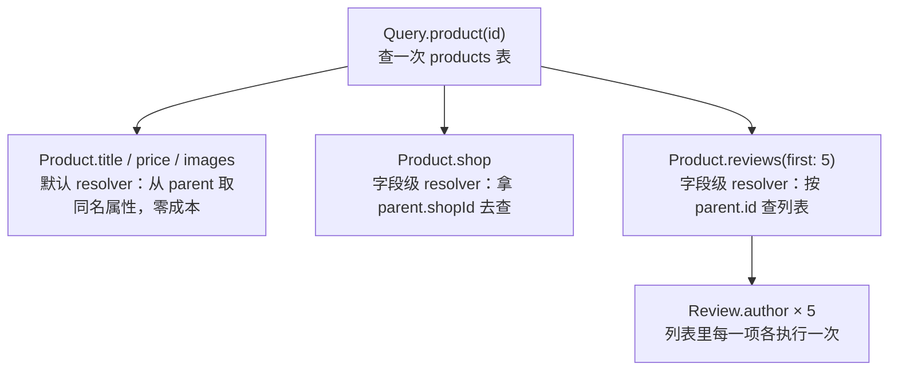
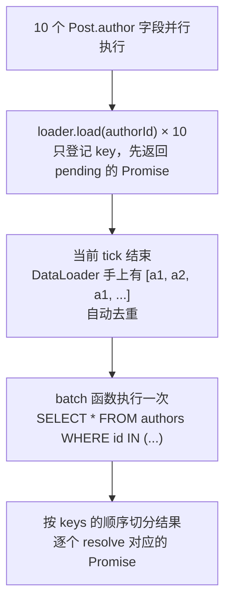

# GraphQL：另一种接口契约

> 前端调过 GraphQL 客户端，但没写过服务端。这篇讲清 GraphQL 到底替 REST 解决了什么、代价在哪，以及在 Nest 里用 code-first 写出一套带 DataLoader、限流和字段级鉴权的可上线服务。

## REST 的两个痛点：从一个商品详情页说起

商品详情页要渲染四块东西：商品本身、所属店铺、最近 5 条评价、5 个推荐商品。REST 下典型的请求序列是这样：

| 顺序 | 请求 | 返回 | 页面实际用到 |
|---|---|---|---|
| ① | `GET /products/:id` | 42 个字段 | 6 个 |
| ② | `GET /shops/:shopId` | 店铺全量信息 | 店名、logo、评分（依赖 ① 的 `shopId`） |
| ③ | `GET /products/:id/reviews?limit=5` | 评价列表 | 全部 |
| ④ | `GET /users?ids=1,2,3` | 用户全量信息 | 昵称、头像（依赖 ③ 的 `userId`） |
| ⑤ | `GET /products/:id/recommends` | 推荐列表 | 标题、价格、封面 |

两个病症：

- **over-fetching**：① 返回 42 个字段，页面用 6 个。多出来的字节在弱网移动端是实打实的成本，而服务端为了拼出那 42 个字段，可能还多查了两张表。
- **under-fetching**：一个页面 5 个请求，其中 ② 和 ④ 必须等前一个返回才能发出，形成瀑布。首屏时间被串行的往返次数拖住。

常规解法是让后端开一个 `GET /products/:id/detail-page`，一次把数据拼好。这确实快，但每来一个新页面就要开一个新的「页面接口」，接口数量随页面数增长；更麻烦的是 App 老版本还在用旧的字段组合，这些接口删不掉。

GraphQL 换了个分工：服务端只声明**能提供什么**（schema），客户端声明**这次要什么**（query），一个请求拿完。

```graphql
query ProductDetail($id: ID!) {
  product(id: $id) {
    title price images
    shop { name logo rating }
    reviews(first: 5) { content rating author { nickname avatar } }
    recommends(first: 5) { id title price cover }
  }
}
```

一次往返，返回的 JSON 结构和查询结构一模一样，没有一个多余字段。页面要多显示一个字段，前端改 query 就行，后端不动。

### 代价要一起认下来

灵活性不是免费的，这几条在选型时就要摊在桌面上：

| 代价 | 具体表现 |
|---|---|
| HTTP 缓存失效 | 请求全部落到 `POST /graphql` 一个端点，URL 不再代表资源，CDN、浏览器缓存、`ETag`、Nginx 的 `proxy_cache` 一起失效。要缓存只能自己在应用层做（客户端归一化缓存 + 服务端字段级缓存） |
| 查询复杂度可被滥用 | 客户端能自由组合，就能构造出嵌套十层、笛卡尔积式的查询。REST 里单个接口的最坏开销是可估的，GraphQL 不设限等于把慢查询的开关交给了调用方 |
| N+1 天然存在 | 字段级 resolver 各自取数，列表里每一项的关联字段都会触发一次查询。这不是实现缺陷，是执行模型的直接结果 |
| 监控与限流粒度变粗 | 网关只看到一个 URL，按接口维度的 QPS、P99、错误率、限流规则全部失去意义，要按 `operationName` 甚至字段重新建一套可观测性 |
| schema 演进要小心 | 没有 `/v2` 可用。字段一旦发布就无法确知谁在用，删除前得先靠字段级埋点观察调用量，再走 `@deprecated` 长周期下线 |
| 文件传输不自然 | 上传要靠 multipart 扩展规范外挂，大文件流式下载基本还得单独开 REST 接口 |

### 什么项目该用、什么项目不该用

| 场景 | 建议 | 理由 |
|---|---|---|
| 内部管理后台 | ✅ 最受益 | 实体多、页面组合多、调用方可信、不靠 CDN 扛量。「加个筛选条件不用改后端」直接变成迭代速度 |
| BFF / 多端聚合层 | ✅ 最受益 | 本来就要聚合多个下游、按端裁剪字段，这正是 GraphQL 的形状 |
| 字段需求差异大的 C 端页面 | ✅ 可以 | 但要配合持久化查询（persisted query）把可执行的 query 收敛成白名单 |
| 对外开放 API | ❌ 用 REST | 调用方不可信，复杂度攻击面大；REST 的按接口计费、限流、文档、缓存生态成熟得多 |
| 简单 CRUD / 内部小工具 | ❌ 用 REST | 三五张表的项目里，schema、resolver、DataLoader、复杂度插件全是净成本 |
| 靠缓存扛量的读接口 | ❌ 用 REST | 一个能被 CDN 缓存 60 秒的 GET 接口，性能上限比任何 GraphQL 优化都高 |
| 文件上传下载、Webhook、OAuth 回调 | ❌ 用 REST | 这些场景本身就是面向 HTTP 语义的 |

一句话判据：**调用方是自己人、查询形状多变、缓存不是主要手段 → GraphQL；调用方不可控、查询形状固定、靠缓存扛量 → REST。**

---

## 核心概念：schema 就是接口契约

### 三种根类型

| 根类型 | 语义 | 执行方式 | 传输 |
|---|---|---|---|
| `Query` | 读 | 同层字段**并行**执行 | HTTP POST |
| `Mutation` | 写 | 同层字段**串行**执行（规范要求，避免同一请求里两个写操作互相干扰） | HTTP POST |
| `Subscription` | 订阅 | 建立长连接，服务端主动推 | WebSocket |

> 「Query 只读」是约定，规范并不强制。但客户端库、缓存、复杂度插件都按这个约定工作——Apollo 会缓存 Query 结果、会在 Mutation 之后重新拉取。在 Query 里写数据只会换来一堆难查的诡异行为。

### 类型系统

| 概念 | 写法 | 要注意的 |
|---|---|---|
| 标量 | `Int` `Float` `String` `Boolean` `ID` | 内置只有这 5 个。日期、`BigInt`、`JSON` 都要注册自定义标量（Nest 内置了 `GraphQLISODateTime`） |
| object type | `type Product { ... }` | 输出专用。字段本身可以带参数，比如 `reviews(first: Int)` |
| 非空 | `String!` | GraphQL 默认可空，和 TS 相反。标错方向的代价是客户端类型全变成 `\| null`，到处要判空 |
| 列表 | `[Review!]!` | 三种写法含义不同：`[R]` 列表和元素都可空、`[R!]` 元素非空、`[R!]!` 都非空。列表字段一般用 `[R!]!`，空结果返回 `[]` |
| input type | `input CreateProductInput { ... }` | 入参专用，不能和 object type 混用 |
| enum | `enum OrderStatus { PAID SHIPPED }` | 值是标识符不是字符串字面量，在 schema 里自带文档 |
| interface | `interface Node { id: ID! }` | 多个类型共享字段，客户端可以直接在 interface 上查公共字段 |
| union | `union SearchResult = Product \| Shop` | 结果可能是几种完全不同的类型，客户端用 `... on Product { }` 分支取 |

### input type 为什么不能复用 output type

规范把输入和输出分成两套类型系统，不是洁癖，有三个实际原因：

1. **output type 的字段可以带参数**，也可以是 interface / union。这些东西作为入参没有意义——`shop(currency: String)` 当参数传上来要怎么解释？
2. **可空性天然相反**。`Product.id` 输出时一定非空，创建时却不该传；`createdAt` 输出必有，输入根本不该出现。硬要共用只能得到一个「所有字段都可空」的类型，校验能力归零。
3. **演进方向相反**。给 output 加字段对老客户端无害；给 input 加一个必填字段会直接打断老客户端。混在一起就分不清哪种变更是破坏性的。

所以一个实体在 schema 里通常有三个类型：`Product`（输出）、`CreateProductInput`、`UpdateProductInput`。别为了少写代码去共用，`@nestjs/graphql` 导出的 `PartialType` / `PickType` / `OmitType` / `IntersectionType` 能省掉大部分重复。

### resolver 的四个参数

| 参数 | Nest 装饰器 | 是什么 | 典型用途 |
|---|---|---|---|
| parent（root） | `@Parent()` | 上一层 resolver 的返回值 | 字段级 resolver 从这里取外键：`parent.authorId` |
| args | `@Args()` | 当前字段上的参数 | 分页、筛选条件 |
| context | `@Context()` | 每个请求一个的共享对象 | 放 `req`、当前用户、DataLoader 实例 |
| info | `@Info()` | 本次查询的 AST、字段路径、返回类型 | 按客户端真正要的字段裁剪 SQL 的 `select`；采集字段级调用量 |

> `info` 很强，也很容易写出没人敢改的代码。真要做按需 select，用 `graphql-parse-resolve-info` 这类库解析，别自己遍历 AST。

### 字段级 resolver 是自上而下逐层执行的

一次查询不是「一个函数返回整棵树」，而是**每个字段都由一个 resolver 负责**，父字段返回什么，子字段就拿着它继续解析。没有显式写 resolver 的字段用默认实现：从 parent 上取同名属性。



两个直接结论：**客户端没查的字段，它的 resolver 根本不执行**（`{ product { title } }` 只有一条 SQL）；**列表里的关联字段会执行 N 次**——这就是下面 N+1 一节的全部来源。

---

## Nest 的两种开发模式

| | schema-first | code-first |
|---|---|---|
| 真源 | 手写 `.graphql` 文件 | TS class + 装饰器 |
| TS 类型从哪来 | 靠 codegen 生成，要记得跑 | 你写的 class 本身就是类型 |
| 一致性风险 | schema 改了忘记 generate，或 resolver 返回值和 schema 不匹配，编译期发现不了 | 返回类型对不上直接编译报错 |
| 复用现有 class | 要再手写一份 `.graphql` 重复描述一遍 | 在现有 model / DTO 上加装饰器即可 |
| 语言无关 | ✅ 同一份 schema 可以给别的语言实现 | ❌ 绑定 TypeScript |
| 契约先行 | ✅ schema 文件可以先定、单独评审 | 需要 build 一次才产出 schema |
| 适合 | 多语言团队、schema 先行的强契约流程 | 单一 TS 后端，也就是绝大多数 Nest 项目 |

**推荐 code-first**，三个理由：单一真源，不会出现 schema 和实现漂移；类型天然对齐，少了 codegen 这一步也就不会忘记跑；和 Nest 的风格一致——Controller 用装饰器声明路由，Resolver 用装饰器声明字段，心智模型不用来回切。

契约评审的诉求并没有丢：code-first 生成的 `schema.gql` 照样可以提交进仓库，在 CI 里跑 schema diff 拦住误删字段。

---

## code-first 完整 CRUD

```bash
npm i @nestjs/graphql @nestjs/apollo @apollo/server graphql
```

### 模块配置

```typescript
// app.module.ts
@Module({
  imports: [
    GraphQLModule.forRoot<ApolloDriverConfig>({
      driver: ApolloDriver,
      autoSchemaFile: join(process.cwd(), 'src/schema.gql'),   // 生成的 schema 落盘，方便 diff
      sortSchema: true,                                        // 字段排序稳定，否则每次生成都是一坨乱 diff
      playground: false,                                       // 老的 GraphQL Playground 已停止维护
      plugins: [ApolloServerPluginLandingPageLocalDefault()],  // 换成 Apollo Sandbox
      introspection: process.env.NODE_ENV !== 'production',
    }),
    PostModule,
  ],
})
export class AppModule {}
```

`autoSchemaFile: true` 只在内存里生成 schema；给一个路径能把它写成文件提交进 Git——这样 code-first 也有一份可评审、可比对的契约产物。

### ObjectType：输出类型

```typescript
// post.model.ts
@ObjectType({ description: '文章' })
export class Post {
  @Field(() => ID)
  id: string
  @Field()                            // string / boolean 能靠反射推断，类型可以省
  title: string
  @Field({ nullable: true })          // 对应 schema 里的 String（可空）
  summary?: string
  @Field(() => Int)                   // 必须显式：反射只知道它是 Number
  viewCount: number
  @Field(() => PostStatus)            // 枚举要单独注册，见下面一行
  status: PostStatus
  @Field(() => [String])              // 数组必须显式：编译后元素类型就丢了
  tags: string[]
  @Field(() => GraphQLISODateTime)    // Nest 内置的日期标量
  createdAt: Date
  @Field(() => Author)                // 关联字段：类型声明在这里，取值交给 @ResolveField
  author: Author
  authorId: string                    // 不加 @Field 就不进 schema，但 resolver 里照样拿得到
}

registerEnumType(PostStatus, { name: 'PostStatus' })
```

**为什么 `number` 必须显式声明成 `Int` 或 `Float`**：装饰器能读到的类型元数据由 `emitDecoratorMetadata` 写入，TS 只会写一个 `Number`。而 GraphQL 有 `Int`（32 位整数，超范围直接报错）和 `Float` 两个数字标量，语义不同。Nest 在没有显式声明时按 `Float` 处理，所以 id、计数、分页参数一律要写 `() => Int`——漏写的后果是 schema 里长出一堆 `Float` 类型的 id，前端拿到的类型也跟着错。数组同理：反射只知道是 `Array`，元素类型必须自己写。

> 在 `nest-cli.json` 里启用 `@nestjs/graphql` 的 CLI 插件可以省掉大部分 `@Field()`，它会读 TS 类型自动补。方便，但 `Int` / `Float` 这种歧义它也解决不了，而且会让「schema 长什么样」变得不明显。团队协作时我倾向显式写。

### InputType：入参类型

```typescript
@InputType()
export class CreatePostInput {
  @Field()
  @IsString()
  @Length(1, 120)                     // class-validator 的规则照常生效
  title: string
  @Field({ nullable: true })
  @IsOptional()
  @IsString()
  summary?: string
  @Field(() => [String], { defaultValue: [] })
  tags: string[]
}

@InputType()
export class UpdatePostInput extends PartialType(CreatePostInput) {
  @Field(() => ID)
  id: string
}
```

校验靠 `main.ts` 里的全局 `ValidationPipe`，和 REST 完全一样——GraphQL 的参数同样要过 Pipe，规则见 [DTO 与序列化](/guide/nestjs-dto)。

### Resolver

```typescript
@Resolver(() => Post)                 // 声明这个 resolver 负责 Post 类型
export class PostResolver {
  constructor(
    private readonly postService: PostService,
    private readonly authorService: AuthorService,
  ) {}

  @Query(() => [Post], { name: 'posts' })
  findAll(@Args('keyword', { nullable: true }) keyword?: string) {
    return this.postService.findAll(keyword)
  }

  @Query(() => Post, { nullable: true })
  post(@Args('id', { type: () => ID }) id: string) {
    return this.postService.findOne(id)
  }

  @Mutation(() => Post)
  createPost(@Args('input') input: CreatePostInput) {
    return this.postService.create(input)
  }

  @Mutation(() => Post)
  updatePost(@Args('input') input: UpdatePostInput) {
    return this.postService.update(input)
  }

  @Mutation(() => Boolean)
  removePost(@Args('id', { type: () => ID }) id: string) {
    return this.postService.remove(id)
  }

  // 字段级 resolver：客户端查了 author 才会执行
  @ResolveField(() => Author)
  author(@Parent() post: Post) {
    return this.authorService.findOne(post.authorId)
  }
}
```

三个细节：`@Resolver(() => Post)` 的参数决定 `@ResolveField` 挂在哪个类型上，写成 `@Resolver()` 会直接报错；`@Query` 的字段名默认取方法名，`{ name: 'posts' }` 用来在方法名和 schema 字段名不一致时对齐；Resolver 和 Controller 一样是 Provider，注册在模块的 `providers` 里，依赖注入行为完全一致（见[依赖注入](/guide/nestjs-di)）。

---

## N+1 问题

### 它是怎么发生的

上面这个 resolver 已经埋好了坑。查 10 篇文章连带作者，打开 ORM 的 SQL 日志会看到：

```text
SELECT `posts`.* FROM `posts` LIMIT 10
SELECT `authors`.* FROM `authors` WHERE `authors`.`id` = 'a1'
SELECT `authors`.* FROM `authors` WHERE `authors`.`id` = 'a2'
SELECT `authors`.* FROM `authors` WHERE `authors`.`id` = 'a1'
...（一共 10 条，重复的作者也重复查）
```

1 次列表查询 + N 次关联查询 = 11 条 SQL。把 `first` 改成 100 就是 101 条，再嵌套一层 `author { posts { author } }` 就开始指数放大。

**为什么不能直接 join 掉？** 因为执行计划是客户端决定的。写 `posts` 这个 resolver 的时候，你不知道客户端会不会查 `author`。无条件预先 join，只查 title 的请求也要白付一次 join 的成本，GraphQL 的好处就丢了。

### DataLoader 的原理

正确解法是**批处理**：让这一层的 10 个 `author` 字段先各自登记「我要 id=x 的作者」，等这一轮全部登记完，合成一次 `WHERE id IN (...)`。

DataLoader 是这件事的标准实现，靠的是事件循环的一个性质——**同一个 microtask tick 内产生的所有 `load()` 调用可以被攒到一起**，到 tick 末尾再统一执行批量函数。前端把多次 `setState` 合成一次渲染，用的是同一个套路。



### 实现

批量函数写成一个可注入的工厂，因为它要用到 Service / ORM：

```typescript
// loader.factory.ts
@Injectable()
export class LoaderFactory {
  constructor(private readonly prisma: PrismaService) {}

  createLoaders() {
    return {
      authorById: new DataLoader<string, Author | null>(async (ids) => {
        const rows = await this.prisma.author.findMany({
          where: { id: { in: [...ids] } },
        })
        const map = new Map(rows.map((row) => [row.id, row]))
        // ⚠️ 返回值必须和 ids 等长、同序，查不到的位置补 null
        return ids.map((id) => map.get(id) ?? null)
      }),
    }
  }
}

export type Loaders = ReturnType<LoaderFactory['createLoaders']>
```

挂到 GraphQL context 上，**每个请求调用一次 `createLoaders()`**：

```typescript
GraphQLModule.forRootAsync<ApolloDriverConfig>({
  driver: ApolloDriver,
  imports: [LoaderModule],
  inject: [LoaderFactory],
  useFactory: (loaderFactory: LoaderFactory) => ({
    autoSchemaFile: join(process.cwd(), 'src/schema.gql'),
    sortSchema: true,
    // 这个工厂每个请求执行一次，返回值就是 @Context() 拿到的东西
    context: ({ req }) => ({ req, loaders: loaderFactory.createLoaders() }),
  }),
})
```

resolver 改成从 context 取 loader：

```typescript
@ResolveField(() => Author)
author(@Parent() post: Post, @Context() ctx: { loaders: Loaders }) {
  return ctx.loaders.authorById.load(post.authorId)
}
```

11 条 SQL 变 2 条，重复的作者 id 还被自动去重了。

### 坑一：DataLoader 必须是请求级实例

DataLoader 除了批处理，还自带一层以 key 为键的缓存，而且这层缓存**没有过期机制**。做成单例 Provider 会立刻踩两个雷：

- 数据永远不刷新。改了作者昵称，要重启进程才生效。
- 更严重的是**串数据**。如果批量函数里带了权限过滤（「只返回当前用户可见的文章」），A 用户填进缓存的结果会被 B 用户直接读走，这是实打实的越权，而且不报错。

所以要么像上面这样在 `context` 工厂里每请求 new 一份，要么把 loader 声明成 `@Injectable({ scope: Scope.REQUEST })`。**前者更好**：`Scope.REQUEST` 会沿依赖链把注入它的 resolver 也变成请求级，每个请求都要重走一遍依赖解析（作用域传染的代价见[依赖注入](/guide/nestjs-di)）；而 context 方案里 resolver 本身仍然是单例，只有 loader 是请求级的。

### 坑二：返回数组必须和入参 keys 一一对应

DataLoader 是**按下标**把结果分发给对应的 `load()` 调用的。三条硬性要求：长度必须相等、顺序必须一致、查不到的 key 要在那个位置放 `null` 或 `Error` 实例，不能跳过。

```typescript
// ❌ 最常见的错误：直接返回查询结果
return this.prisma.author.findMany({ where: { id: { in: [...ids] } } })
```

`WHERE id IN ('a3','a1','a2')` 返回的顺序通常是按主键排的 `a1,a2,a3`，于是每个字段都拿到别人的数据；如果有 id 查不到，数组还会变短，后面全体错位。**而且它不抛异常**，只是静默返回错的数据——这类 bug 在测试环境几乎发现不了，因为测试数据往往刚好有序。

固定写法就是三步：**查回来 → 建 Map → 按 keys 映射**。顺带一提第三个坑：mutation 改完数据，同一个请求里后续读到的可能还是 loader 缓存里的旧值，写完记得 `ctx.loaders.authorById.clear(id)`。

如果某个关联字段几乎总是被一起查（`Post.author` 就是典型），还有一条更便宜的路：在 `posts` 这一层用 `@Info()` 判断客户端有没有请求 `author`，请求了就直接 join 取回，让默认 resolver 从 parent 上读同名属性，字段级 resolver 根本不执行。代价是 resolver 里多一段读 AST 的逻辑，**只在压测出来的热点查询上做**，别当默认方案。

---

## 安全与限流

### 为什么必须加

REST 接口的最坏开销是写死的，GraphQL 不是。下面这条查询在 schema 里完全合法：

```graphql
query Bomb {
  posts {
    author { posts { author { posts { author { posts { title } } } } } }
  }
}
```

每往下一层，要查的行数就乘一次。加了 DataLoader 也只是把 SQL 条数压下来，行数照样爆炸，内存先扛不住。攻击者不需要任何额外权限，一个几百字节的请求就能把库和进程打满。**对外暴露的 GraphQL 端点，深度限制和复杂度限制不是优化项，是上线前提。**

### 深度限制

```typescript
import depthLimit from 'graphql-depth-limit'

GraphQLModule.forRoot<ApolloDriverConfig>({
  driver: ApolloDriver,
  autoSchemaFile: true,
  validationRules: [depthLimit(7)],   // 超过 7 层在校验阶段就拒掉，不进任何 resolver
})
```

### 复杂度计算

深度好懂但不够用：`{ posts(first: 10000) { title } }` 只有两层，照样能打死库。所以要再算一个复杂度预算——给每个字段标成本，带分页参数的字段把成本乘以条数，超预算就拒。Nest 的做法是写一个 Apollo 插件：

```typescript
@Plugin()
export class ComplexityPlugin implements ApolloServerPlugin {
  constructor(private readonly schemaHost: GraphQLSchemaHost) {}

  async requestDidStart(): Promise<GraphQLRequestListener<any>> {
    const maxComplexity = 200
    const { schema } = this.schemaHost

    return {
      async didResolveOperation({ request, document }) {
        const complexity = getComplexity({
          schema,
          operationName: request.operationName,
          query: document,
          variables: request.variables,
          estimators: [
            fieldExtensionsEstimator(),                   // 读字段上标注的 complexity
            simpleEstimator({ defaultComplexity: 1 }),    // 没标注的字段算 1
          ],
        })
        if (complexity > maxComplexity) {
          throw new GraphQLError(`查询过于复杂：${complexity}，上限 ${maxComplexity}`)
        }
      },
    }
  }
}
```

字段上这样标，让分页条数进入计算：

```typescript
@Query(() => [Post], {
  complexity: ({ args, childComplexity }) => args.first * childComplexity,
})
posts(@Args('first', { type: () => Int, defaultValue: 20 }) first: number) {}
```

`@Plugin()` 和 `GraphQLSchemaHost` 来自 Nest 的 GraphQL 包，`getComplexity` 等函数来自 `graphql-query-complexity`——Nest 本身不内置复杂度插件，这段是要自己维护的代码。想少写可以用 `graphql-armor` 这类聚合方案，把深度、复杂度、别名数量、schema 探测防护打包在一起。

### 生产环境的开关

| 配置 | 生产环境 | 原因 |
|---|---|---|
| `introspection` | `false` | introspection 会把完整 schema 吐出来，等于把内网所有实体、字段名和关联关系交给攻击者做侦察 |
| `playground` / Sandbox 落地页 | 关掉 | 同上，而且是一个可交互的攻击入口 |
| 错误堆栈 | 不返回 | 默认在非生产环境会返回 `extensions.stacktrace`，泄露文件路径和目录结构 |
| 持久化查询白名单 | 强烈建议 | 客户端只传 query 的 hash，服务端只执行构建期收集到的那批 query。上了这个，复杂度攻击直接从威胁模型里消失 |
| 分页上限 | 强制校验 | 每个列表字段的 `first` 都要有 `@Max()`，别信 `defaultValue` |

> ⚠️ 关掉 introspection 之后，前端的类型 codegen 会拿不到 schema。做法是让 codegen 读 CI 里生成的 `schema.gql` 文件，而不是去线上 introspect。

### 字段级鉴权

Guard、Interceptor、Pipe、Filter 在 GraphQL 上照常工作，唯一的区别是取请求对象的方式——GraphQL 的执行上下文里没有 `switchToHttp()` 那套参数可用：

```typescript
@Injectable()
export class GqlAuthGuard implements CanActivate {
  constructor(private readonly jwtService: JwtService) {}

  async canActivate(context: ExecutionContext): Promise<boolean> {
    const gqlCtx = GqlExecutionContext.create(context)   // 通用上下文 → GraphQL 上下文
    const req = gqlCtx.getContext().req                  // getContext() 返回的就是 context 工厂造的那个对象
    const token = req.headers.authorization?.replace(/^Bearer\s+/i, '')
    if (!token) throw new UnauthorizedException('缺少访问凭证')
    req.user = await this.jwtService.verifyAsync(token)
    return true
  }
}
```

贴的位置有三层，粒度依次变细：

```typescript
@Resolver(() => Post)
@UseGuards(GqlAuthGuard)                            // ① 整个 resolver
export class PostResolver {
  @Mutation(() => Post)
  @UseGuards(RolesGuard) @Roles('editor')           // ② 单个 Query / Mutation
  createPost() {}

  @ResolveField(() => Float)
  @UseGuards(RolesGuard) @Roles('admin')            // ③ 单个字段：只有管理员能查 Post.revenue
  revenue(@Parent() post: Post) {}
}
```

③ 是 GraphQL 独有的能力，REST 里想让同一个接口对不同角色返回不同字段，得靠序列化分组绕。但代价要清楚：**字段级 Guard 会在列表里执行 N 次**，查 100 条就是 100 次鉴权。所以字段级 Guard 里绝对不能查库——权限信息在入口 Guard 一次性挂到 `req.user` 上，字段级只做内存判断。元数据怎么读见 [Metadata 与 Reflector](/guide/nestjs-metadata-reflector)，RBAC 的完整实现见[权限控制](/guide/nestjs-authorization)。

> 一个真实陷阱：`@nestjs/passport` 的 `AuthGuard('jwt')` 默认按 HTTP 参数位置取 request，在 GraphQL 上会拿到 `undefined`。要继承它并覆写 `getRequest()`，返回 `GqlExecutionContext.create(context).getContext().req`。

---

## 错误处理

只要请求本身格式正确，GraphQL 的 **HTTP 状态码永远是 200**。业务错误放在响应体的 `errors` 数组里，`data` 中对应字段置 `null`：

```json
{
  "data": { "post": null },
  "errors": [
    { "message": "文章不存在", "path": ["post"], "extensions": { "code": "POST_NOT_FOUND" } }
  ]
}
```

这件事对前端的影响必须在联调之前说清楚：

| 前端习惯 | 在 GraphQL 里会怎样 | 改成 |
|---|---|---|
| 拦截器按 `status >= 400` 判失败 | 永远不触发 | 检查 `response.errors` 是否非空 |
| 401 自动跳登录 | 拿不到 401 | 按 `extensions.code === 'UNAUTHENTICATED'` 判断 |
| 一个请求非黑即白 | 可以**部分成功**：列表拿到了，其中一条的 `author` 失败，`data.posts[3].author` 是 `null`，`errors` 里多一条 | UI 要能渲染局部缺失的数据 |

> 非空传播是个容易被忽略的机制：一个声明为 `T!` 的字段 resolve 失败时，`null` 会沿 schema 往上冒泡，直到遇见第一个可空的祖先字段，把那一整块置空。所以把关键字段标成非空，语义是「这个字段拿不到，整块数据就不该展示」；标可空的语义是「拿不到就降级」。**可空性是在设计降级策略，不只是在写类型。**

业务错误码用 `GraphQLError` 的 `extensions` 传，客户端按 `code` 分支，不要去 `message` 里做字符串匹配：

```typescript
throw new GraphQLError('库存不足', {
  extensions: { code: 'OUT_OF_STOCK', skuId, remain: 2 },
})
```

如果项目里已经在抛 `HttpException`（比如 Service 层同时被 REST 复用），加一个 Filter 翻译过来：

```typescript
@Catch(HttpException)
export class GqlHttpExceptionFilter implements GqlExceptionFilter {
  catch(exception: HttpException, host: ArgumentsHost) {
    GqlArgumentsHost.create(host)     // GraphQL 场景拿不到 response，不要去 res.json()
    return new GraphQLError(exception.message, {
      extensions: { code: HttpStatus[exception.getStatus()], status: exception.getStatus() },
    })
  }
}
```

和 HTTP 版 Filter 的关键区别：**GraphQL 的 Filter 是 `return` 一个错误对象，而不是往 `response` 上写**，返回值会被收进 `errors` 数组。HTTP 版怎么写见[参数校验与异常处理](/guide/nestjs-validation-filter)。

想做统一脱敏（把未知异常一律换成「服务异常」、原文只进日志），放在 `forRoot` 的 `formatError` 里更集中——它是所有错误出站前的最后一道。

---

## Subscription

`Subscription` 是第三种根类型，底层是 WebSocket 长连接：客户端订阅一次，服务端在事件发生时主动推。

```typescript
GraphQLModule.forRoot<ApolloDriverConfig>({
  driver: ApolloDriver,
  autoSchemaFile: true,
  subscriptions: {
    'graphql-ws': true,     // 现行协议；老的 subscriptions-transport-ws 已废弃，只为兼容老客户端才开
  },
})
```

```typescript
const pubSub = new PubSub()

@Resolver(() => Comment)
export class CommentResolver {
  @Mutation(() => Comment)
  async addComment(@Args('input') input: AddCommentInput) {
    const comment = await this.commentService.create(input)
    await pubSub.publish('commentAdded', { commentAdded: comment })  // 载荷 key 要和订阅字段名一致
    return comment
  }

  @Subscription(() => Comment, {
    // 每个订阅者各跑一次 filter，只把自己关心的那篇文章的评论推给他
    filter: (payload, variables) => payload.commentAdded.postId === variables.postId,
  })
  commentAdded(@Args('postId', { type: () => ID }) postId: string) {
    return pubSub.asyncIterableIterator('commentAdded')
  }
}
```

> `graphql-subscriptions` 2.x 把方法名从 `asyncIterator` 改成了 `asyncIterableIterator`，抄老代码会得到一个 `is not a function`。

### 上线前必须处理的三件事

| 问题 | 内存版 `PubSub` 的表现 | 生产做法 |
|---|---|---|
| 多实例不通 | 内存版只在当前进程里广播。两台机器时，连在 A 上的客户端收不到 B 处理的 mutation 发出的事件——而且**单机开发环境完全测不出来** | 换 `graphql-redis-subscriptions` 的 `RedisPubSub`，事件走 Redis 的 pub/sub 频道 |
| 订阅鉴权 | 默认不校验，任何人连上就能订阅 | 在 `subscriptions['graphql-ws'].onConnect` 里校验 `connectionParams` 带的 token，失败抛异常断连。WebSocket 只在握手时校验一次，长连接要自己做定期复验 |
| filter 的成本 | 每个事件 × 每个订阅者跑一次，广播 1 条消息给 1 万个订阅者就是 1 万次比较 | 高频事件不要靠 `filter` 兜，按维度拆频道名（`commentAdded:${postId}`），让 Redis 只推给相关订阅者 |

### 什么时候不如直接用 SSE

Subscription 的复杂度不低：连接管理、心跳、断线重连、鉴权复验、跨实例广播、扩容时的连接迁移，一样都不能省。判断标准很简单：

| 场景 | 选择 |
|---|---|
| 只是服务端单向推（站内通知、任务进度、大模型流式输出、日志 tail） | **SSE**。一个 `GET` 接口加浏览器原生的 `EventSource`，自带重连，能被 Nginx 直接代理，不需要 schema、不需要 PubSub |
| 客户端也要频繁上行（聊天输入、协同编辑、在线状态） | WebSocket。至于用不用 GraphQL Subscription 是另一回事，裸 WebSocket 或 Socket.IO 往往更直接 |
| 已经全站 GraphQL，且希望推来的数据和查询结果**共用同一份归一化缓存** | Subscription。这是它相对 SSE 的真实优势：推过来的实体能自动更新客户端缓存，不用手写 `refetch` |
| 全项目只有一两个实时场景 | 别为它引入整套 Subscription 设施 |

单向推送场景上 Subscription，基本都属于过度设计。Nest 里的 WebSocket Gateway、Socket.IO 房间广播、多实例 Redis adapter 这些实现细节，见 WebSocket 实时通信那篇。

---

## 和 REST 共存

现实项目很少是纯 GraphQL。最稳定的形态是**对内 GraphQL、对外 REST**：管理后台和自家 App 的 BFF 走 GraphQL 拿聚合能力，开放平台、Webhook 回调、文件上传下载、健康检查走 REST。

两套在 Nest 里天然共存——`GraphQLModule` 只是往应用上挂了一个 `/graphql` 路由，Controller 该怎么写还怎么写：

```typescript
@Module({
  imports: [
    GraphQLModule.forRoot<ApolloDriverConfig>({
      driver: ApolloDriver,
      path: '/graphql',
      autoSchemaFile: join(process.cwd(), 'src/schema.gql'),
    }),
    PostModule,   // 里面同时注册 PostController 和 PostResolver
  ],
})
export class AppModule {}
```

配置要点：

| 事项 | 做法 |
|---|---|
| 业务逻辑归属 | 业务全部留在 Service，Controller 和 Resolver 都只做「取参数 → 调 Service → 返回」。共用一套领域逻辑是共存方案不腐烂的唯一前提 |
| DTO 复用 | REST 的 DTO 和 GraphQL 的 InputType 可以是同一个 class，同时加 `@ApiProperty()` 和 `@Field()`，两套装饰器互不干扰 |
| 全局切面 | 全局 Guard / Interceptor / Filter 会同时作用于两套。**凡是写了 `context.switchToHttp()` 的切面，在 GraphQL 上会取到不对的东西**——按 `context.getType()` 分支，或者干脆写两份。这一点上线前必须回归一遍，细节见[请求生命周期](/guide/nestjs-pipeline) |
| 响应包装 | REST 常见的 `{ code, data, message }` 包装**不要**套到 GraphQL 上，它会破坏 schema 契约。Interceptor 里先判断 `context.getType() !== 'graphql'` 再包 |
| 路由冲突 | `path` 默认 `/graphql`，别让 Controller 占用同名前缀 |
| Fastify | 换成 `FastifyAdapter` 时可以继续用 `ApolloDriver`，也可以换 `@nestjs/mercurius` 的 `MercuriusDriver`（Fastify 原生，性能更好，但生态和 Apollo 插件不通） |

一个提醒：**不要为了「统一」把已有的 REST 接口全迁成 GraphQL。** 迁移期两套并存是常态，按新需求增量走 GraphQL，老接口等到它自然要重构的时候再动。

---

## 面试问答

**1. code-first 和 schema-first 怎么选？**

- code-first 单一真源：TS class + 装饰器就是 schema，resolver 返回类型对不上直接编译报错；schema-first 改了 schema 忘跑 codegen、或 resolver 和 schema 不匹配，编译期发现不了。
- 和 Nest 的心智模型一致：Controller 用装饰器声明路由，Resolver 用装饰器声明字段。契约评审的诉求没丢——`autoSchemaFile` 把 `schema.gql` 落盘提交进仓库，CI 里跑 schema diff 拦住误删字段。
- schema-first 仍然适合多语言团队：同一份 schema 可以给别的语言实现，这是 code-first 给不了的。
- 加分：知道 code-first 靠反射生成 schema 的局限——`number` 反射只得到 `Number`，`@Field(() => Int)` 必须显式写，漏了 schema 里会长出一堆 `Float` 类型的 id，数组元素类型同理。

**2. GraphQL 的 N+1 为什么不能靠 join 一劳永逸？DataLoader 有哪两个致命坑？**

- 执行计划是客户端决定的：写 `posts` resolver 的时候不知道客户端会不会查 `author`，无条件预先 join，只查 title 的请求也要白付一次 join 的成本。
- 坑一：DataLoader 自带一层无过期缓存，必须做成请求级实例。单例会导致数据永不刷新，批量函数带权限过滤时直接把 A 用户的结果发给 B 用户——越权且不报错。在 context 工厂里每请求 new 一份比 `Scope.REQUEST` 好，后者会把注入它的 resolver 也传染成请求级。
- 坑二：batch 返回值必须和入参 keys 等长、同序。`WHERE id IN` 返回的顺序通常按主键排，DataLoader 按下标分发，静默返回错的数据且不抛异常。固定写法三步：查回来 → 建 Map → 按 keys 映射。
- 加分：几乎总是被一起查的热点关联（`Post.author`），可以在上一层用 `@Info()` 判断客户端要不要它，要就直接 join 取回让字段级 resolver 根本不执行——只在压测出来的热点上做。

**3. GraphQL 的 HTTP 状态码永远是 200，前端和异常处理要怎么配合？**

- 业务错误在响应体的 `errors` 数组里，`data` 对应字段置 null。前端拦截器改查 `response.errors` 是否非空，401 按 `extensions.code === 'UNAUTHENTICATED'` 判断，不要去 `message` 里做字符串匹配。
- 可以部分成功：列表里一条的 `author` 解析失败，`data.posts[3].author` 是 null、`errors` 里多一条——UI 要能渲染局部缺失的数据。
- 非空传播决定了降级语义：`T!` 字段 resolve 失败时 null 沿 schema 往上冒，直到遇见第一个可空的祖先字段把那一整块置空。可空性是在设计降级策略，不只是在写类型。
- GraphQL 的 Filter 是 `return` 一个错误对象（被收进 `errors` 数组），不是往 response 上写。别踩的坑：把 REST 的 `{ code, data, message }` 响应包装套到 GraphQL 上，会破坏 schema 契约。

**4. GraphQL 独有的字段级鉴权，能力和代价分别是什么？**

- 能力：在 `@ResolveField` 上贴 `@Roles('admin')`，就能让 `Post.revenue` 只有管理员能查；REST 里想让同一个接口对不同角色返回不同字段，得靠序列化分组绕。
- 代价：字段级 Guard 会在列表里执行 N 次，查 100 条就是 100 次鉴权，所以里面绝对不能查库——权限信息在入口 Guard 一次性挂到 `req.user` 上，字段级只做内存判断。
- 别踩的坑：`@nestjs/passport` 的 `AuthGuard('jwt')` 默认按 HTTP 参数位置取 request，在 GraphQL 上拿到 `undefined`，要继承它并覆写 `getRequest()`，返回 `GqlExecutionContext.create(context).getContext().req`。

**5. 对外暴露 GraphQL 端点，安全上必须做哪几件事？**

- 深度限制（`depthLimit(7)` 挂在 `validationRules`，在校验阶段就拒掉）加复杂度预算——给字段标成本、分页字段把成本乘以条数，超预算就拒。Nest 不内置复杂度插件，要自己写 Apollo 插件或用 `graphql-armor` 这类聚合方案。
- 生产关掉 `introspection` 和落地页：introspection 会把完整 schema 吐出来，等于把所有实体、字段名和关联关系交给攻击者做侦察；关掉后前端 codegen 读 CI 里生成的 `schema.gql` 文件，不去线上 introspect。
- 每个列表字段的 `first` 都要 `@Max()` 强制上限，别信 `defaultValue`；终极手段是持久化查询白名单——客户端只传 query 的 hash，复杂度攻击直接从威胁模型里消失。
- 别踩的坑：深度限制挡不住 `{ posts(first: 10000) { title } }`——只有两层照样能打死库，所以深度和复杂度缺一不可。

**6. GraphQL 解决了 REST 的什么问题？代价和选型怎么判断？**

- 解决 over-fetching（商品接口返回 42 个字段页面用 6 个）和 under-fetching（一个页面五个请求还形成瀑布）；服务端声明能提供什么、客户端声明这次要什么，一个请求拿完，页面加字段前端改 query 后端不动。
- 代价：所有请求落到 `POST /graphql` 一个端点，URL 不再代表资源，CDN、浏览器缓存、ETag 一起失效，要缓存只能在应用层自己做；查询复杂度由调用方决定，等于把慢查询的开关交出去；N+1 是字段级 resolver 执行模型的固有结果；监控和限流粒度从接口级退化到端点级，要按 operationName 甚至字段重建一套。
- 选型一句话：调用方是自己人、查询形状多变、缓存不是主要手段 → GraphQL（内部管理后台、BFF 聚合层最受益）；调用方不可控、查询形状固定、靠缓存扛量 → REST（对外开放 API、简单 CRUD、文件上传 / Webhook 这些本身面向 HTTP 语义的场景）。
- 加分：schema 演进没有 `/v2` 可用——字段一旦发布就无法确知谁在用，删除前先靠字段级埋点观察调用量，再走 `@deprecated` 长周期下线。
