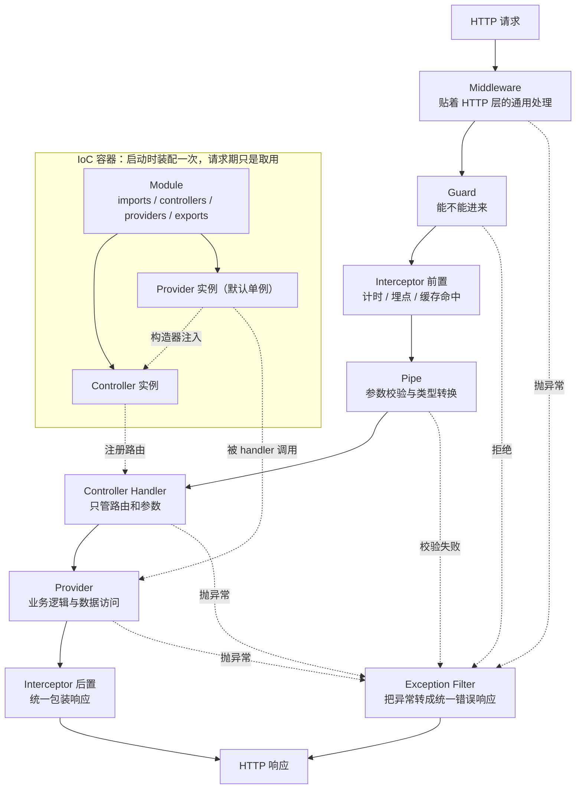

# NestJS 简介与架构概览

> Nest 是 Node 生态里的 Spring。它不让接口变快，它让第 20 个接口和第 1 个接口长得一样。这篇是整个 Nest 板块的入口和地图。

## NestJS 是什么

用 Node 写 HTTP 服务有三层选择：裸 `node:http`（路由、参数、错误处理全手写）、Express / Koa（有中间件了，但分层和依赖管理靠团队自觉）、Nest（框架规定装配方式，ORM / 校验 / WebSocket / 微服务都有官方适配）。

Nest 用 TypeScript 编写，默认跑在 Express 上（可切 Fastify），核心就两件事：

- **IoC**（控制反转）接管对象创建与依赖组装 → [依赖注入](/guide/nestjs-di)
- **AOP**（面向切面）抽取横切逻辑 → [请求管道](/guide/nestjs-pipeline)

它还深度绑定 TypeScript：类型不只给人看，运行时真的会读它 → [元数据与 Reflector](/guide/nestjs-metadata-reflector)。

| 对比 | Express | NestJS |
|---|---|---|
| 定位 | 极简请求处理库 | 意见性全栈框架 |
| 结构约束 | 无 | 强约束（Module / Controller / Provider） |
| 依赖管理 | 手写 `require` 和 `new` | IoC 容器自动装配 |
| 横切逻辑 | 中间件一把梭 | 五种切面各司其职 |
| 适合场景 | 小应用、BFF、网关 | 中大型业务系统、多人协作 |
| 学习曲线 | 低 | 前两周陡，之后很平 |

::: tip 给前端读者的类比
Express 像「只给你一个 router」，Nest 像 Angular —— 它有意见，而且意见落在目录结构和装饰器上。
:::

---

## 核心概念全景图

Nest 的概念分两组：**启动期**由 IoC 容器按 Module 树装配对象，**请求期**由若干切面层层包住 Controller 的 handler。



- Module 只在启动期起作用。它是给容器看的装配清单，请求进来时没有一行代码在「执行 Module」。
- 五种切面的顺序由框架固定，不是你写装饰器的顺序决定的。
- Exception Filter 不在主链路上，它是异常出口。这是业务代码里能直接 `throw` 的原因。

| 概念 | 一句话职责 | 详见 |
|---|---|---|
| Module | 装配清单：有什么、用别人什么、对外给什么 | [依赖注入](/guide/nestjs-di)、[动态模块](/guide/nestjs-dynamic-module) |
| Controller | 路由声明 + 参数提取，不写业务逻辑 | 本文下方、[装饰器体系](/guide/nestjs-decorators) |
| Provider | 容器管理的一切可注入对象，Service 只是最常见的一种 | [依赖注入](/guide/nestjs-di) |
| Middleware | 贴着 HTTP 层，可复用 Express 中间件生态 | [请求管道](/guide/nestjs-pipeline) |
| Guard | 放行或拒绝，认证与授权在这层 | [认证](/guide/nestjs-auth)、[授权](/guide/nestjs-authorization) |
| Interceptor | 包住调用前后，基于 RxJS，可改写响应 | [RxJS 与 Interceptor](/guide/nestjs-rxjs-interceptor) |
| Pipe | 参数的校验与转换 | [请求管道](/guide/nestjs-pipeline)、[DTO 与校验](/guide/nestjs-dto) |
| Exception Filter | 异常统一出口 | [校验与异常过滤](/guide/nestjs-validation-filter) |
| 元数据机制 | 装饰器为什么能生效、DI 为什么能靠类型工作 | [元数据与 Reflector](/guide/nestjs-metadata-reflector) |

---

## Nest CLI 实战

`@nestjs/cli` 相当于前端的 `create-vite` + `vite build` + 一个自带模板的代码生成器。

```bash
npm i -g @nestjs/cli              # 偶尔 npm update -g，否则生成的项目版本会落后
nest new shop-api -p pnpm --strict --skip-git
```

`--strict` 决定生成的 `tsconfig.json` 是否开 TS 严格模式（默认不开）。建议开，后补类型比一开始写对贵得多。

### 生成器

```bash
nest g resource orders            # 一条命令生成整个模块，最省事
nest g module orders
nest g service orders --no-spec
nest g guard auth --flat --no-spec
nest g interceptor logging --flat
```

`nest g resource orders` 会问传输层（REST / GraphQL / 微服务 / WebSocket）和是否生成 CRUD 骨架，然后一次产出 module、controller、service、`dto/`、`entities/`，并自动往 `AppModule` 的 `imports` 里加一行。

| 选项 | 作用 | 什么时候用 |
|---|---|---|
| `--no-spec` | 不生成 `*.spec.ts` | 暂时不写单测，测试文件后补很容易 |
| `--flat` | 不为生成物新建同名目录 | Guard / Interceptor / Filter 这类零散文件 |
| `--skip-import` | 不自动改上层 Module 的 `imports` | monorepo，或想手动决定挂在哪个 Module |
| `--dry-run` | 只打印会生成什么，不落盘 | 不确定路径时先试一次 |

模板本身在 `@nestjs/schematics` 里，实现就是模板引擎填变量，没有魔法 —— 生成的代码随便改，CLI 不会回来纠正你。

### 目录约定为什么长这样

```text
src/
├── main.ts                      入口，只负责创建并启动应用
├── app.module.ts                根模块，装配清单的根
└── orders/
    ├── orders.module.ts         本模块的装配清单
    ├── orders.controller.ts     路由与参数
    ├── orders.service.ts        业务逻辑
    ├── dto/create-order.dto.ts  入参形状 + 校验规则
    └── entities/order.entity.ts 数据库表映射
```

这套约定服务于三件事：**文件名后缀就是架构角色**（`.controller.ts` 里出现 SQL 一眼就知道不对）；**CLI 靠后缀决定往哪注册**；**一个模块一个目录，下线时删目录加一行 import 即可**。前端本来也有 `Foo.tsx` / `useFoo.ts` 这类习惯，Nest 只是把它固化进了 CLI。

### `nest build` 与 `nest start`

| 命令 | 做了什么 | 用在哪 |
|---|---|---|
| `nest build` | 编译到 `dist/` 后退出 | CI、Docker 镜像构建 |
| `nest start` | build + `node dist/main.js` | 本地跑一次看看 |
| `nest start --watch` | 改文件后增量重编译并重启进程 | 日常开发，`npm run start:dev` 就是它 |
| `nest start --debug` | 等价于加 `node --inspect`，开 9229 端口 | 需要断点时 |

两个坑：`--watch` 默认只盯 `.ts` / `.js`，模板和 `.yaml` 改了不会重新拷贝，要加 `--watchAssets` 并在 `nest-cli.json` 的 `compilerOptions.assets` 里声明；`--webpack` 会打成单文件（冷启动略快、可配 HMR），但 Node 本来不需要打包，别为了前端习惯默认开，它会让 sourcemap 和调试变复杂。

### `nest-cli.json`

命令行选项基本都能固化到这里，团队不用每次记参数：

```json
{
  "sourceRoot": "src",
  "entryFile": "main",
  "compilerOptions": {
    "deleteOutDir": true,
    "assets": [{ "include": "mail-templates/**/*.hbs", "watchAssets": true }]
  },
  "generateOptions": { "spec": false, "flat": false }
}
```

`deleteOutDir` 建议开，否则删掉的源文件会在 `dist/` 里留一份僵尸产物，跑起来行为诡异。`assets` 只支持 `src` 下的文件，`src` 外的资源要自己写脚本拷。排查版本冲突时先跑 `nest info`。

---

## 应用入口 main.ts

```typescript
// main.ts
import { NestFactory } from '@nestjs/core'
import { ValidationPipe } from '@nestjs/common'
import { AppModule } from './app.module'

async function bootstrap() {
  const app = await NestFactory.create(AppModule)

  // whitelist 会剥掉 DTO 里没声明的字段
  app.useGlobalPipes(new ValidationPipe({ whitelist: true, transform: true }))
  app.setGlobalPrefix('api/v1')
  app.enableCors({ origin: process.env.ALLOWED_ORIGINS?.split(',') })
  app.enableShutdownHooks()  // 收到 SIGTERM 时走完生命周期钩子再退出

  await app.listen(process.env.PORT ?? 3000)
}

bootstrap()
```

`NestFactory.create(AppModule)` 是整个应用的起点：从 `AppModule` 开始递归解析 Module 树、实例化 Provider 和 Controller、依次调用生命周期钩子，最后把路由注册到底层 HTTP 库上。

---

## 三大核心组成

### Module

装配清单，四个字段各有明确含义：

```typescript
@Module({
  imports: [TypeOrmModule.forFeature([Order])],  // 我要用别的模块导出的东西
  controllers: [OrdersController],               // 我这里有哪些路由
  providers: [OrdersService],                    // 我这里有哪些可注入对象
  exports: [OrdersService],                      // 我允许别人注入我的哪些东西
})
export class OrdersModule {}
```

`exports` 最容易忽略：**不写 `exports`，别的模块 `imports` 了你也注入不到**。这个「默认封闭」的设计避免了大项目里所有 Provider 全局可见的混乱。

根模块把业务模块串起来。`forRoot` / `forFeature` 这种带方法调用的 import 是**动态模块**，运行时根据参数构造出 Module 对象，见 [动态模块](/guide/nestjs-dynamic-module)。

### Controller

只做两件事：声明路由、提取参数。业务逻辑一行不写。

```typescript
@Controller('orders')
export class OrdersController {
  constructor(private readonly ordersService: OrdersService) {}

  @Get(':id')
  findOne(@Param('id', ParseIntPipe) id: number) {
    return this.ordersService.findOne(id)
  }

  @Post()
  create(@Body() dto: CreateOrderDto) {
    return this.ordersService.create(dto)
  }
}
```

`return` 一个对象或 Promise，Nest 会自动序列化成 JSON 并发送，不需要 `res.json()`。完整装饰器清单见 [装饰器体系](/guide/nestjs-decorators)。

### Provider

业务逻辑的落脚点。加 `@Injectable()` 并在 Module 的 `providers` 里注册，容器就会管它的生命周期：

```typescript
@Injectable()
export class OrdersService {
  constructor(
    @InjectRepository(Order) private readonly orderRepo: Repository<Order>,
  ) {}

  async findOne(id: number): Promise<Order> {
    const order = await this.orderRepo.findOneBy({ id })
    if (!order) throw new NotFoundException(`订单 ${id} 不存在`)
    return order
  }
}
```

这里直接 `throw new NotFoundException(...)`，不用管状态码 —— 内置 Exception Filter 会转成 404 和统一错误体。值 Provider、工厂 Provider、作用域都在 [依赖注入](/guide/nestjs-di) 里。

---

## 5 种 HTTP 数据传输方式

前后端联调最高频的摩擦点。五种方式的差别只有两个维度：**数据放在哪**（URL 还是 body）、**怎么编码**（urlencode / boundary / JSON）。

### url param

参数是路径的一部分，用来定位资源。

```http
GET /api/orders/1024 HTTP/1.1
Host: shop.example.com
```

```typescript
@Get(':id')
findOne(@Param('id') id: string) { return `订单 ${id}` }
```

```typescript
await axios.get('/api/orders/1024')
```

### query

`?` 后面的键值对，描述筛选、分页这类「同一资源的不同视图」，非 ASCII 字符必须 urlencode。

```http
GET /api/orders/search?keyword=%E8%8C%B6%E5%8F%B6&page=2 HTTP/1.1
```

```typescript
@Get('search')
search(@Query('keyword') keyword: string, @Query('page') page: string) {
  return { keyword, page }
}
```

```typescript
// axios 自动对 params 做 urlencode，不用手动 encodeURIComponent
await axios.get('/api/orders/search', { params: { keyword: '茶叶', page: 2 } })
```

> ⚠️ `@Get('search')` 必须写在 `@Get(':id')` **前面**。Nest 按声明顺序匹配路由，反过来写 `/orders/search` 会被 `:id` 吃掉，`id` 的值变成字符串 `'search'`。

### form-urlencoded

就是「把 query 字符串搬到 body 里」。原生 `<form>` 默认用这个。

```http
POST /api/orders HTTP/1.1
Content-Type: application/x-www-form-urlencoded

keyword=%E8%8C%B6%E5%8F%B6&quantity=2
```

Nest 侧就是 `@Body()`，不需要额外配置 —— 内置 body 解析会按 `Content-Type` 自动选解析器。

```typescript
// URLSearchParams 传给 axios 时会自动带上正确的 Content-Type
await axios.post('/api/orders', new URLSearchParams({ keyword: '茶叶', quantity: '2' }))
```

### application/json

日常接口的默认选择：保留数据类型，支持嵌套结构。Nest 侧代码和 form-urlencoded 完全一样，仍然是 `@Body()`。

```http
POST /api/orders HTTP/1.1
Content-Type: application/json

{"keyword":"茶叶","quantity":2,"gift":false}
```

```typescript
@Post()
create(@Body() dto: CreateOrderDto) { return dto }
```

```typescript
// axios 传对象时默认就是 JSON，不用手动设 header
await axios.post('/api/orders', { keyword: '茶叶', quantity: 2, gift: false })
```

### form-data

不用 `&` 分隔，而是用一串随机 boundary 分隔每个字段，因此不需要 urlencode，适合传二进制。

```http
POST /api/orders/attachment HTTP/1.1
Content-Type: multipart/form-data; boundary=----WebKitFormBoundaryK7pQ

----WebKitFormBoundaryK7pQ
Content-Disposition: form-data; name="remark"

发票请开公司
----WebKitFormBoundaryK7pQ
Content-Disposition: form-data; name="invoice"; filename="invoice.pdf"
Content-Type: application/pdf

%PDF-1.4 ...二进制...
----WebKitFormBoundaryK7pQ--
```

文件部分需要一个拦截器来解析，用 `@UploadedFile()` 取，其余字段照旧 `@Body()`：

```typescript
import { FileInterceptor } from '@nestjs/platform-express'

@Post('attachment')
@UseInterceptors(FileInterceptor('invoice', { dest: 'uploads/' }))
upload(
  @UploadedFile() file: Express.Multer.File,
  @Body('remark') remark: string,
) {
  return { filename: file.originalname, size: file.size, remark }
}
```

`Express.Multer.File` 这个类型来自 `npm i -D @types/multer`，不装 TS 会报找不到命名空间。多文件、大小限制、存储策略见 [文件上传](/guide/nestjs-file-upload)。前端侧关键是**不要手动设 Content-Type**：

```typescript
const form = new FormData()
form.append('remark', '发票请开公司')
form.append('invoice', fileInput.files[0])

await axios.post('/api/orders/attachment', form)  // ✅ 让浏览器自己填 header
// headers: { 'Content-Type': 'multipart/form-data' }  ❌ boundary 丢了
```

### 对照表

| 方式 | Content-Type | 数据在哪 | Nest 侧 | axios 侧 | 典型用途 |
|---|---|---|---|---|---|
| url param | 无 | URL 路径 | `@Param('id')` | 拼进 URL | 定位单个资源 |
| query | 无 | URL `?` 之后 | `@Query('key')` | `{ params }` | 筛选、分页、排序 |
| form-urlencoded | `application/x-www-form-urlencoded` | body，`&` 分隔 | `@Body()` | 传 `URLSearchParams` | 老系统、原生表单 |
| JSON | `application/json` | body，JSON 文本 | `@Body()` | 直接传对象（默认） | 绝大多数接口 |
| form-data | `multipart/form-data; boundary=…` | body，boundary 分隔 | `@UploadedFile()` + `@Body()` | 传 `FormData`，不设 header | 文件上传、混合表单 |

### 最容易踩的四个坑

1. **form-data 手动设 `Content-Type`**。boundary 是浏览器随机生成后拼进 header 的，手写就把它覆盖了，服务端拿不到分隔符，报 `Multipart: Boundary not found`。
2. **把 JSON 和 form-urlencoded 混为一谈**。Nest 侧写法一样，所以前端发错也可能「看起来能跑」，但 urlencoded 里所有值都是字符串：`quantity=2` 到手是 `'2'`，`gift=false` 到手是字符串 `'false'`，而它是 truthy 的。要类型就发 JSON。
3. **`@Param` / `@Query` 拿到的永远是 string**，哪怕 URL 里写的是数字。要么加 `ParseIntPipe`，要么在 DTO 里用 `@Type(() => Number)`。
4. **DTO 上不写校验装饰器等于没校验**。`@Body() dto: CreateOrderDto` 只是把解析出的对象交给你，类型标注在运行时不产生任何检查 —— 原因见 [元数据与 Reflector](/guide/nestjs-metadata-reflector)，做法见 [DTO 与校验](/guide/nestjs-dto)。

---

## Nest 与 Express / Fastify 的关系

Nest 默认跑在 Express 上，但**没有依赖 Express**。它内部只依赖一层抽象：一个 `HttpServer` 接口声明「一个 HTTP 库要提供哪些能力」（注册路由、读请求、写响应、设状态码），一个 `AbstractHttpAdapter` 抽象类把这些能力包成统一形状，然后由 `@nestjs/platform-express`（默认装）和 `@nestjs/platform-fastify` 分别实现。

这就是适配器模式。Nest 的价值在 IoC 和 AOP，HTTP 库只是「怎么读请求、怎么写响应」的实现细节，抽一层就换得动。

### 怎么切

```bash
npm i fastify @nestjs/platform-fastify
```

```typescript
import { FastifyAdapter, NestFastifyApplication } from '@nestjs/platform-fastify'

const app = await NestFactory.create<NestFastifyApplication>(
  AppModule,
  new FastifyAdapter(),
)
await app.listen(3000, '0.0.0.0')
```

两个参数职责不同：`new FastifyAdapter()` 是**运行时**真正换平台的东西；`<NestFastifyApplication>` 只是**类型参数**，决定 `app.` 后面能提示出哪些平台专有方法。这也解释了为什么在 Express 平台上调 `app.useStaticAssets()` 要写 `NestFactory.create<NestExpressApplication>(AppModule)` —— 不写泛型，TS 只知道基础的 `INestApplication`。

### 切了之后哪些代码要改

Module / Controller / Provider / Guard / Pipe 完全不用动，要动的全是**碰到底层对象**的地方：

| 受影响的地方 | Express 平台 | Fastify 平台 |
|---|---|---|
| `@Res()` 的类型与 API | `Response`（`res.json()`） | `FastifyReply`（`reply.send()`） |
| 文件上传 | `FileInterceptor` + multer | 换 `@fastify/multipart`，`FileInterceptor` 用不了 |
| 静态资源 | `app.useStaticAssets('public')` | 注册 `@fastify/static` 插件 |
| Session / Cookie | `express-session`、`cookie-parser` | `@fastify/session`、`@fastify/cookie` |
| 模板引擎 | `app.setViewEngine('hbs')` | `@fastify/view` |
| 中间件 | 直接 `app.use(mw)` | 大部分 Express 中间件不兼容 |

`@Res()` 的行为在两个平台一致：**一旦注入响应对象，Nest 就不再拿 handler 的返回值当响应**，你必须自己发。想两者兼得用 `@Res({ passthrough: true })`，见 [装饰器体系](/guide/nestjs-decorators)。

### 什么时候值得切

| 情况 | 建议 |
|---|---|
| 压测显示瓶颈在 HTTP 解析 / JSON 序列化，QPS 高且响应体小 | 值得试，Fastify 的优势只在这种负载下看得出来 |
| 需要 Fastify 的 JSON Schema 校验与响应序列化 | 值得 |
| 瓶颈在数据库、外部 API、业务计算（绝大多数项目） | 不值得，换了没有可测量收益 |
| 依赖若干 Express 中间件，或团队只熟 Express | 不值得，迁移成本集中在上传和静态资源这些边角 |

一句话：**先压测定位瓶颈再决定动不动平台**，别照着 benchmark 图迁移。

---

## 调试

`console.log` 只能看到某个点的值，看不到调用栈和执行路线 —— 而 Nest 的调用栈里有大量框架代码，恰恰最需要断点。

### VS Code

配一个「用 npm 跑 dev 脚本」的调试配置，直接在编辑器里打断点，这是最省事的方式：

```json
{
  "version": "0.2.0",
  "configurations": [
    {
      "type": "node",
      "request": "launch",
      "name": "debug nest",
      "runtimeExecutable": "npm",
      "runtimeArgs": ["run", "start:dev"],
      "console": "integratedTerminal",
      "skipFiles": ["<node_internals>/**"]
    }
  ]
}
```

`console` 一定要设成 `integratedTerminal`，否则日志跑到 Debug Console 里，Nest 的彩色日志全变纯文本。如果服务已经用 `nest start --debug` 起着了，也可以换成 `"request": "attach", "port": 9229` 挂上去。

三种断点类型值得记住：

| 类型 | 作用 | 场景 |
|---|---|---|
| Logpoint | 只打印不断住，表达式用 `{}` 包裹 | 想加日志但不想污染代码 |
| 条件断点 | 表达式为真才断 | 循环里只想抓 `id === 1024` 那次 |
| 异常断点 | 未捕获异常处自动断住 | 只知道 500 了，不知道哪抛的 |

### Chrome DevTools

Node 的调试协议通过 WebSocket 暴露，任何实现了这套协议的客户端都能连：

```bash
nest start --debug                 # 内部就是 node --inspect，端口 9229
node --inspect-brk dist/main.js    # 在第一行就断住
```

`--inspect` 不在首行断住，所以刚连上往往「什么都没有」—— 要么写一句 `debugger`，要么用 `--inspect-brk`。然后打开 `chrome://inspect`，看不到目标就在 Network targets 里手动加 `localhost:9229`。

### REPL 模式：不发请求直接调 Provider

想验证一个 Service 方法，起服务、拼 URL、开 Postman 太重。Nest 提供了 REPL：

```typescript
// src/repl.ts
import { repl } from '@nestjs/core'
import { AppModule } from './app.module'

async function bootstrap() {
  const replServer = await repl(AppModule)
  // 把命令历史落盘，重启后按上下键还能翻出来
  replServer.setupHistory('.nestjs_repl_history', (err) => err && console.error(err))
}
bootstrap()
```

```bash
nest start --watch --entryFile repl
```

| 命令 | 作用 |
|---|---|
| `debug()` | 列出所有 Module 及其 controllers / providers |
| `debug('OrdersModule')` | 只看某个 Module |
| `methods(OrdersService)` | 列出这个类的方法 |
| `get(OrdersService)` / `$(OrdersService)` | 从容器里取出实例，直接调方法 |

```text
> await get(OrdersService).findOne(1024)
```

> ⚠️ REPL 只是**从容器取实例然后普通函数调用**，不走 Pipe / Guard / Interceptor。`ValidationPipe` 在 REPL 里不会触发，用它验证校验逻辑会得到错误结论。测 Service 很顺手，测 Controller 的入参校验不行。

### 调试 Nest 源码

调试自己项目时，调用栈里那些 `@nestjs/core` 的帧是**编译后的 JS**。想读源码级调用栈，得自己 build 一份带 sourcemap 的：

```bash
git clone --depth=1 --single-branch https://github.com/nestjs/nest
# 先给 packages/tsconfig.build.json 加上 "sourceMap": true 和 "inlineSources": true
cd nest && npm install && npm run build   # 产物落到仓库自己的 node_modules/@nestjs
```

`inlineSources` 是关键：默认 sourcemap 不含 `sourcesContent`，调试器找不到源文件内容。

把这份 `node_modules/@nestjs` 覆盖到要调试的项目里（仓库 `sample/` 下有现成示例），再给 launch.json 加一条 `"resolveSourceMapLocations": ["${workspaceFolder}/**"]` —— 默认值里有 `!**/node_modules/**`，会把 node_modules 的 sourcemap 全排除。之后打断点，调用栈里就是 Nest 的 TS 源码了，想搞清 Guard / Interceptor / Pipe 的真实调用顺序，这是最直接的办法。

---

## 与 Angular 的对比

Nest 的概念几乎是 Angular 的服务端映射：

| NestJS | Angular | 说明 |
|---|---|---|
| `@Module()` | `@NgModule()` | 组织应用结构 |
| `@Injectable()` | `@Injectable()` | 可注入对象 |
| `@Controller()` | `@Component()` | 处理请求 / 渲染视图 |
| IoC 容器 | IoC 容器 | 同一套依赖注入思路 |
| Interceptor | HTTP Interceptor | 拦截请求 / 响应 |
| Guard | Route Guard | 访问控制 |
| Pipe | Pipe | 数据转换 |

没写过 Angular 也不用补。React 侧的对应心智模型是：Provider 树 ≈ 多层 Context Provider，注入 ≈ `useContext`，只是 Nest 把它挪到构造函数上，并且在启动时一次性静态解析完。

---

## 与其他语言 / 服务集成

Nest 只运行 JavaScript。做 AI 应用时常见分工是「Nest 管业务和网关，Python 管模型」：

| 方式 | 适合场景 | 代价 |
|---|---|---|
| HTTP / REST | 最常见，Nest 作为 BFF 调 FastAPI | 序列化开销，超时重试要自己处理 |
| gRPC | 内部服务间高频调用，需要强 schema | 要维护 proto，调试不如 HTTP 直观 |
| 消息队列 | 耗时任务、削峰、允许异步 | 引入中间件运维成本 |
| `child_process.spawn` | 一次性脚本、离线任务 | 进程和并发全靠自己管，不适合线上高频调用 |

```typescript
@Injectable()
export class EmbeddingService {
  async embed(text: string): Promise<number[]> {
    const res = await fetch(`${process.env.EMBED_SERVICE_URL}/embed`, {
      method: 'POST',
      headers: { 'Content-Type': 'application/json' },
      body: JSON.stringify({ text }),
      signal: AbortSignal.timeout(5000),   // 一定要设超时
    })
    if (!res.ok) throw new ServiceUnavailableException('向量服务不可用')
    return (await res.json()).embedding
  }
}
```

跨进程调用必须显式设超时并把失败转成 Nest 的异常，否则一个卡住的下游会把事件循环上的其他请求一起拖住。gRPC 和消息队列的完整写法见 [微服务](/guide/nestjs-microservice)。

