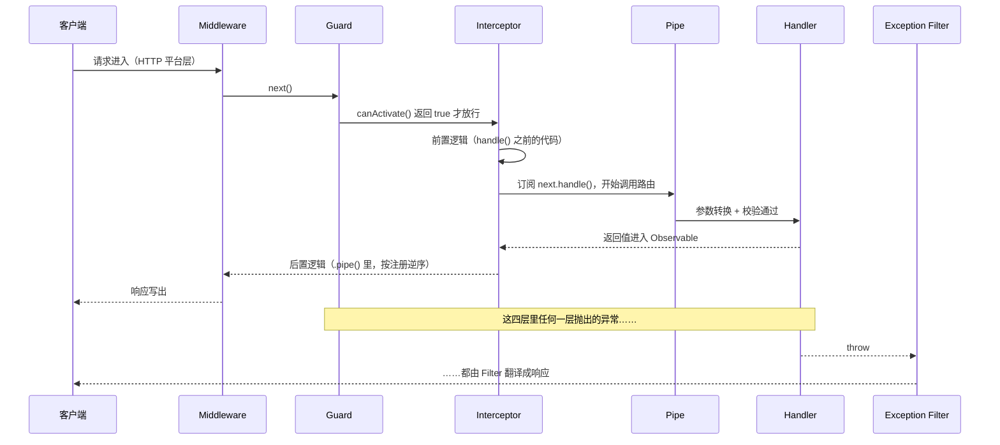

# NestJS 请求生命周期

> 一个请求从进入到返回，要穿过 Middleware、Guard、Interceptor、Pipe、Exception Filter 五层切面。这篇讲清它们的执行顺序、各自的职责边界，以及什么逻辑该放在哪一层。

## 横切关注点：业务代码是怎么烂掉的

一个「创建订单」的接口，真正的业务只有一行。但没有 AOP 的时候，它往往长成这样：

```typescript
@Post()
async create(@Req() req: Request, @Body() body: any) {
  const user = this.jwtService.verify(req.headers.authorization?.slice(7))   // 鉴权
  if (!user) throw new UnauthorizedException()

  if (!body.skuId || typeof body.quantity !== 'number' || body.quantity < 1) {
    throw new BadRequestException('参数错误')                                // 校验
  }

  const start = Date.now()
  this.logger.log(`create order, user=${user.id}`)                          // 日志

  try {
    const order = await this.orderService.create(user.id, body)             // ← 真正的业务
    this.logger.log(`create order done in ${Date.now() - start}ms`)
    return { code: 0, data: order }                                        // 响应包装
  } catch (e) {
    this.logger.error(e)                                                   // 错误处理
    return { code: 500, message: '下单失败' }
  }
}
```

问题不在于长，在于：

- 鉴权、校验、日志、包装这四段会在每个接口里复制一遍，复制 20 次就有 20 处可能漏
- 想统一改响应格式，得改遍所有 controller
- 想写单元测试，得先伪造一个能通过 `jwt.verify` 的 token
- 真正的业务逻辑被埋在噪音里，review 的时候看不清重点

日志、鉴权、校验、缓存、错误处理、事务这些逻辑有个共同特征：**和具体业务无关，却会散落进所有业务**。这类逻辑叫横切关注点（cross-cutting concern）。把它们从业务里剥出来集中定义、再声明式地贴回去，就是 AOP（Aspect Oriented Programming，面向切面编程）。

### 这套思想你在前端已经用过了

| 前端里的东西 | 干的事 | Nest 里的对应物 |
|---|---|---|
| axios 请求拦截器 | 统一加 token、加 traceId | Middleware / Guard |
| axios 响应拦截器 | 统一解包 `res.data`、401 跳登录 | Interceptor / Exception Filter |
| Koa、Redux 的 middleware 洋葱模型 | 包住 `next()`，前后各做一段 | Interceptor |
| 高阶组件 / 自定义 hook | 把 loading、异常处理抽出业务组件 | Interceptor |
| React ErrorBoundary | 兜住子树抛出的异常，渲染兜底 UI | Exception Filter |

Nest 把这套思路做成了框架级能力：**五种切面 + 装饰器绑定**。上面那段代码用 Nest 写是这样：

```typescript
@Post()
@UseGuards(JwtAuthGuard)                // 鉴权 → Guard
create(
  @CurrentUser() user: UserPayload,     // 取用户 → 自定义参数装饰器
  @Body() dto: CreateOrderDto,          // 校验 → DTO + 全局 ValidationPipe
) {
  return this.orderService.create(user.id, dto)
}
```

日志、计时、响应包装、异常兜底全都搬进了全局切面，一处定义、全局生效。装饰器是怎么把切面「贴」上去的，见[装饰器体系](/guide/nestjs-decorators)和 [Metadata 与 Reflector](/guide/nestjs-metadata-reflector)。

### 收益与代价

| 收益 | 具体表现 |
|---|---|
| 关注点分离 | controller 里只剩业务，切面逻辑单独成文件 |
| 可组合 | `@UseGuards(AuthGuard, RolesGuard)` 叠加，顺序即语义 |
| 可复用 | 同一个 Guard 贴到 100 个路由上，改一次全部生效 |
| 可测试 | 切面能单独测；测 controller 时不必再过鉴权 |
| 可插拔 | 临时关掉某个切面只需删一行装饰器，业务代码不动 |

代价也得认：

| 代价 | 表现 | 怎么缓解 |
|---|---|---|
| 执行顺序变隐式 | 代码里看不出「先鉴权还是先校验」，得知道框架约定 | 记住下一节的顺序表；全局切面清单集中写在 `AppModule` 一处 |
| 调试链路变长 | 一个 400 响应可能来自 Pipe、Guard、Interceptor 或 Filter | 错误响应里带上业务 `code`，一眼看出是哪层抛的 |
| 隐式依赖 | Guard 往 `request.user` 上挂东西，controller 依赖它却看不见 | 用自定义参数装饰器（`@CurrentUser()`）把这层依赖显式化 |
| 过度切面 | 什么都往全局塞，最后每个请求空跑八层 | 只把「真正到处都要」的放全局，其余局部绑定 |

---

## 完整执行顺序



每一层内部还有「全局 → 控制器 → 方法」三个层级，同层多个装饰器按书写顺序执行：

| 阶段 | 同阶段内的顺序 | 绑定方式 |
|---|---|---|
| Middleware | 按 `configure()` 里 `apply()` 的调用顺序，`app.use()` 的排在最前 | `consumer.apply().forRoutes()` / `app.use()` |
| Guard | 全局 → 控制器 → 方法 | `APP_GUARD` / `useGlobalGuards()` / `@UseGuards()` |
| Interceptor（前置） | 全局 → 控制器 → 方法 | `APP_INTERCEPTOR` / `useGlobalInterceptors()` / `@UseInterceptors()` |
| Pipe | 全局 → 控制器 → 方法 → 参数 | `APP_PIPE` / `@UsePipes()` / `@Body(pipe)` |
| Handler | — | — |
| Interceptor（后置） | 方法 → 控制器 → 全局（**逆序**） | 同前置 |
| Exception Filter | 方法 → 控制器 → 全局，命中第一个匹配的就停 | `@UseFilters()` / `APP_FILTER` |

两种链条形态要分清：

- **Guard 是短路链**：`@UseGuards(A, B)` 里 A 返回 `false` 或抛异常，B 和后面的一切都不执行。「先认证再授权」靠的就是这个顺序。
- **Interceptor 是洋葱**：`@UseInterceptors(A, B)` 的执行是 `A前 → B前 → handler → B后 → A后`。前置按注册顺序，后置逆序，和 Koa 中间件一模一样。所以「响应包装」这种要包在最外面的 Interceptor 必须最先注册，否则它的输出会被别人再套一层。

**为什么 Filter 能接住前面所有层抛的异常？** 因为 Nest 把「Guard → Interceptor → Pipe → Handler」整条链包在同一个执行上下文里，任何一层的同步 `throw` 或 Observable 的 error 通知都会冒泡到路由最外层，再交给匹配的 Filter。你在 Pipe 里抛的 `BadRequestException` 和 service 深处抛的异常，走的是同一个出口。

两个例外：Middleware 里抛的异常在 HTTP 平台层就被截住了，可能绕过你的 Filter（表现为返回一坨默认错误页）；handler 里用 `@Res()` 手动写完响应后再抛异常，Filter 也改不动已经发出的响应头。

---

## Middleware

最外层的切面，跑在 HTTP 平台层（默认 Express）。有函数式和类式两种写法：

```typescript
// 函数式：不需要注入依赖时够用，和 Express 中间件完全一样
export function requestId(req: Request, res: Response, next: NextFunction) {
  req.headers['x-request-id'] ??= randomUUID()
  next()
}

// 类式：能注入 Provider —— 这是 Nest 版 Middleware 存在的主要理由
@Injectable()
export class AccessLogMiddleware implements NestMiddleware {
  constructor(private readonly metrics: MetricsService) {}

  use(req: Request, res: Response, next: NextFunction) {
    const start = process.hrtime.bigint()

    // 拿不到响应体，但能等到响应结束
    res.on('finish', () => {
      const ms = Number(process.hrtime.bigint() - start) / 1e6
      this.metrics.record(req.method, req.route?.path ?? req.path, res.statusCode, ms)
    })

    next()
  }
}
```

绑定发生在模块里，不是装饰器：

```typescript
@Module({ controllers: [OrdersController] })
export class OrdersModule implements NestModule {
  configure(consumer: MiddlewareConsumer) {
    consumer
      .apply(requestId, AccessLogMiddleware)   // 多个中间件按参数顺序执行
      .exclude('health', { path: 'orders/export', method: RequestMethod.GET })
      .forRoutes(OrdersController)             // ① 控制器级：该控制器下全部路由

    consumer
      .apply(IdempotencyMiddleware)
      .forRoutes({ path: 'orders', method: RequestMethod.POST })   // ② 方法级：路径 + 方法
  }
}
```

`forRoutes()` 接三种参数：控制器类、路径字符串、`{ path, method }` 对象；`exclude()` 接后两种。

> ⚠️ Nest 11 默认跑在 Express 5 上，路径通配符必须命名。想匹配 `admin` 下所有路由要写 `'admin/*path'`，光写 `'admin/*'` 会直接报错。想无条件拦全部请求，在 `main.ts` 里 `app.use()` 更省事。

`app.use()` 和模块里的 `configure()` 的区别：

| | `app.use(fn)` | `consumer.apply(X).forRoutes(...)` |
|---|---|---|
| 能否注入依赖 | ❌ 只能传函数或手动 new 的实例 | ✅ 类式中间件走 IoC 容器 |
| 能否限定路由 | ❌ 全部请求 | ✅ 控制器 / 路径 / 方法级 |
| 执行时机 | 初始化前就挂到平台实例上，通常排在模块中间件前面 | 应用初始化时按模块顺序注册 |
| 适合什么 | `helmet`、`compression`、`cookie-parser` 这类现成中间件 | 需要读配置、写指标、依赖 Provider 的自研中间件 |

### 为什么 `next()` 之后拿不到响应体

写过 Koa 的人会以为 `next()` 之后就能改响应，实际不行：

```typescript
use(req: Request, res: Response, next: NextFunction) {
  next()
  console.log('这行跑得比 handler 还早，而且手上没有响应数据')
}
```

两个原因：

1. Express 的 `next()` 只是把控制权交给下一层，**它不返回 Promise**。handler 基本都是 async 的，Nest 要等 Promise / Observable 完成才写响应，而 `next()` 早就返回了——所以 `next()` 后面那行日志会先打出来。
2. 响应体不经过中间件。handler 的返回值由 Nest 直接序列化写进 socket，中间件手上只有 `res` 对象，没有「即将返回的数据」。想拿到只能猴子补丁 `res.write` / `res.end`，脏且容易和流式响应打架。

要在响应前后做事，正确姿势是 Interceptor：它拿到的是「handler 执行」这条 Observable，天然能在前后插逻辑。

### 什么时候不该用 Middleware

| 场景 | 为什么不行 | 换成 |
|---|---|---|
| 需要读路由上的元数据（`@Roles('admin')`） | Middleware 拿不到目标 class / handler，也没有 `ExecutionContext` | Guard 或 Interceptor |
| 需要改写响应内容 | 见上一节 | Interceptor |
| 需要在 WebSocket、微服务里也生效 | Middleware 只存在于 HTTP 平台层 | Guard / Interceptor / Filter |
| 需要抛业务异常并返回统一格式 | 它的异常走平台层的错误处理，可能绕过你的 Filter | Guard 里抛，或推迟到 handler |

---

## Guard

只回答一个问题：**这个请求能不能继续**。实现 `CanActivate`，返回 `true` 放行，`false` 拒绝。

```typescript
@Injectable()
export class JwtAuthGuard implements CanActivate {
  constructor(
    private readonly jwtService: JwtService,
    private readonly reflector: Reflector,
  ) {}

  async canActivate(context: ExecutionContext): Promise<boolean> {
    // 用元数据给公开接口开后门，比在 Guard 里维护一份路径白名单可靠得多
    const isPublic = this.reflector.getAllAndOverride<boolean>(IS_PUBLIC, [
      context.getHandler(),
      context.getClass(),
    ])
    if (isPublic) return true

    const request = context.switchToHttp().getRequest<Request>()
    const token = request.headers.authorization?.replace(/^Bearer\s+/i, '')
    if (!token) throw new UnauthorizedException('缺少访问凭证')

    try {
      request.user = await this.jwtService.verifyAsync(token)
      return true
    } catch {
      throw new UnauthorizedException('凭证无效或已过期')   // 比 return false 的 403 更准确
    }
  }
}
```

两个细节：

- `return false` 一律是 403。想返回 401、想带上具体原因，就自己抛异常——Guard 抛的异常同样会被 Filter 接住。
- `canActivate` 可以返回 `boolean | Promise<boolean> | Observable<boolean>`，所以查库、调远程鉴权服务都没问题。完整的认证授权实现见[认证与授权](/guide/nestjs-auth)。

### 什么时候不该用 Guard

| 场景 | 为什么不行 | 换成 |
|---|---|---|
| 想在 Guard 实例上存请求级状态 | 全局和控制器级 Guard 是单例，并发请求会互相覆盖 | 挂到 `request` 对象上，或用 `Scope.REQUEST` 的 Provider（见[依赖注入](/guide/nestjs-di)） |
| 想改参数、补默认值 | Guard 跑在 Pipe 之前，此时参数还没转换 | Pipe |
| 想包装响应或统计耗时 | Guard 只能决定放行，看不到返回值 | Interceptor |
| 想判断「这条订单是不是他的」 | 能做，但要在 Guard 里查库，且拿不到 Pipe 转换后的参数 | service 层的领域校验 |

---

## Interceptor

包住 handler 的执行，前后都能插逻辑。实现 `NestInterceptor`，第二个参数是 `CallHandler`：

```typescript
@Injectable()
export class ResponseWrapInterceptor implements NestInterceptor {
  intercept(context: ExecutionContext, next: CallHandler): Observable<unknown> {
    // ① handle() 之前 = 前置逻辑，此刻 handler 还没跑
    return next
      .handle()                     // ② 这条 Observable 代表「handler 的执行」
      .pipe(
        map((data) => ({ code: 0, data, timestamp: Date.now() })),   // ③ pipe 里 = 后置逻辑
      )
  }
}
```

不调用 `next.handle()` 就等于短路：缓存命中时直接 `return of(cached)`，handler 根本不执行。RxJS operator 怎么选、六个能直接抄的实战 Interceptor（响应包装、慢接口告警、超时熔断、异常转换、缓存、字段脱敏），都在 [RxJS 与 Interceptor 实战](/guide/nestjs-rxjs-interceptor)。

### 什么时候不该用 Interceptor

| 场景 | 为什么不合适 | 换成 |
|---|---|---|
| 纯参数格式转换（字符串转数字、trim 空格） | 转换的语义属于入参，在 Interceptor 里改了 handler 也拿不到 | Pipe |
| 挂 `helmet`、压缩、静态资源 | 这些是 HTTP 平台层的活，Interceptor 已经在路由内部 | Middleware（`app.use`） |
| 决定「能不能访问」 | 技术上能（不调 `handle()` 即拒绝），但语义不清，而且它在 Guard 之后 | Guard |
| handler 里用了 `@Res()` 手写响应 | 响应已经发出，`map` 改不动任何东西 | 改用 `@Res({ passthrough: true })`，或让 handler 直接返回值 |
| 统一格式化异常响应 | `catchError` 能转换异常，但「异常 → 响应」的收口在 Filter | Exception Filter |

---

## Pipe

在参数交给 handler 之前做**转换**和**校验**。两件事共用一个接口，因为它们的形状一样：对入参加工一次，不合格就抛异常。

```typescript
@Get(':id')
findOne(
  @Param('id', ParseIntPipe) id: number,                               // 参数级
  @Query('page', new DefaultValuePipe(1), ParseIntPipe) page: number,  // 多个 Pipe 从左到右串
) {}

@Post()
create(@Body() dto: CreateOrderDto) {}   // 全局 ValidationPipe 按 DTO 上的规则校验
```

绑定位置从粗到细是全局 → 控制器 → 方法 → 参数。`ParseIntPipe` 这样**传类**由 Nest 实例化（因此能注入依赖），`new ParseIntPipe({ ... })` 这样**传实例**用于传配置。内置 Pipe 清单、`ValidationPipe` 的全部选项、`ArgumentMetadata` 三个字段怎么用，见[参数校验与异常处理](/guide/nestjs-validation-filter)。

### 什么时候不该用 Pipe

| 场景 | 为什么不合适 | 换成 |
|---|---|---|
| 跨字段关联校验（结束时间要晚于开始时间） | `@Body()` 上的 Pipe 虽然能拿到整个对象，但规则藏在 Pipe 里没人找得到 | DTO 上的自定义校验器（见 [DTO 与序列化](/guide/nestjs-dto)） |
| 查库判断「这个 skuId 存在吗」 | 能做，但 Pipe 变成带 IO 的重逻辑，失败语义还是 400 而不是 404 | service 层的领域校验 |
| 读 `request.user` 做权限判断 | Pipe 只拿到参数值和元数据，拿不到请求对象（除非声明成 `Scope.REQUEST` 注入 `REQUEST`，那已经是绕路了） | Guard |
| 加工响应 | Pipe 只管入参 | Interceptor |

---

## Exception Filter

最后一层：把异常翻译成响应。

```typescript
@Catch(HttpException)
export class HttpExceptionFilter implements ExceptionFilter<HttpException> {
  catch(exception: HttpException, host: ArgumentsHost) {
    const response = host.switchToHttp().getResponse<Response>()
    response.status(exception.getStatus()).json({
      code: exception.getStatus(),
      message: exception.message,
      timestamp: new Date().toISOString(),
    })
  }
}
```

你平时看到的 404、400、500 响应体，都是 Nest 内置全局 Filter 生成的；自定义 Filter 只是把这份默认实现替换掉。`@Catch()` 的匹配规则、三个层级的优先级、能直接抄进项目的全局兜底 Filter，见[参数校验与异常处理](/guide/nestjs-validation-filter)。

### 什么时候不该用 Filter

| 场景 | 为什么不合适 | 换成 |
|---|---|---|
| 用异常表达正常分支（「查不到就抛异常，让 Filter 返回空数组」） | 异常当控制流，链路难追踪，还会污染错误监控 | handler 里直接返回 |
| 改写成功响应的格式 | Filter 只在异常路径上被调用 | Interceptor |
| 在 Filter 里重试、补偿、发消息 | Filter 的职责是「翻译成响应」，副作用放这里很难测 | service 层，或 Interceptor 的 `catchError` |
| 想让多个 Filter 依次处理同一个异常 | 一个异常只会命中一个 Filter | 在一个 Filter 里做完，或把异常上报放 Interceptor |

---

## ExecutionContext 与 ArgumentsHost

Nest 的切面不只服务 HTTP：WebSocket Gateway、TCP/gRPC 微服务、GraphQL resolver 用的是同一套 Guard、Interceptor、Filter。但这些场景的「请求参数」完全不同——HTTP 有 `req` / `res`，WebSocket 只有 socket 和消息体，微服务只有一个 payload。

`ArgumentsHost` 就是为此存在的抽象：它包着当前上下文的原始参数，让你按上下文类型去取。`ExecutionContext` 是它的子类，多了 `getClass()` 和 `getHandler()`。

| 用在哪 | 参数类型 | 能用的 API |
|---|---|---|
| Exception Filter 的 `catch()` | `ArgumentsHost` | `getType()` / `switchToHttp()` / `switchToWs()` / `switchToRpc()` / `getArgs()` |
| Guard 的 `canActivate()`、Interceptor 的 `intercept()` | `ExecutionContext` | 以上全部，外加 `getClass()` / `getHandler()` |

```typescript
switch (context.getType<'http' | 'ws' | 'rpc'>()) {
  case 'http': {
    const http = context.switchToHttp()
    http.getRequest<Request>()
    http.getResponse<Response>()
    break
  }
  case 'ws': {
    const ws = context.switchToWs()
    ws.getClient()   // socket 实例
    ws.getData()     // 消息体
    break
  }
  case 'rpc': {
    context.switchToRpc().getData()
    break
  }
}
```

> GraphQL 场景下 `getType<GqlContextType>()` 会返回 `'graphql'`，参数得用 `GqlExecutionContext.create(context)` 取，不能直接 `switchToHttp()`。

**为什么通用切面要写成上下文无关的？** 只要你在 Guard 里直接写 `context.switchToHttp().getRequest()`，这个 Guard 就绑死在 HTTP 上了——同一份鉴权逻辑挪到 WebSocket Gateway 上会拿到 `undefined`，而且是运行时才炸。做法是把「从上下文里取凭证 / 挂用户信息」收进私有方法，主体逻辑保持与上下文无关：

```typescript
@Injectable()
export class TokenGuard implements CanActivate {
  constructor(
    private readonly jwtService: JwtService,
    private readonly reflector: Reflector,
  ) {}

  async canActivate(context: ExecutionContext): Promise<boolean> {
    if (this.reflector.getAllAndOverride<boolean>(IS_PUBLIC, [
      context.getHandler(),
      context.getClass(),
    ])) {
      return true
    }

    // 主体逻辑：不关心自己跑在 HTTP 还是 WebSocket 上
    const token = this.extractToken(context)
    if (!token) throw new UnauthorizedException('缺少访问凭证')

    const payload = await this.jwtService.verifyAsync<UserPayload>(token)
    this.attachUser(context, payload)
    return true
  }

  private extractToken(context: ExecutionContext): string | undefined {
    switch (context.getType<'http' | 'ws' | 'rpc'>()) {
      case 'http': {
        const req = context.switchToHttp().getRequest<Request>()
        return req.headers.authorization?.replace(/^Bearer\s+/i, '')
      }
      case 'ws': {
        // socket.io 握手时带上：io(url, { auth: { token } })
        return context.switchToWs().getClient().handshake?.auth?.token
      }
      default:
        return undefined   // 微服务走内网凭证，这个 Guard 不负责
    }
  }

  private attachUser(context: ExecutionContext, user: UserPayload) {
    if (context.getType() === 'http') {
      context.switchToHttp().getRequest().user = user
    } else {
      context.switchToWs().getClient().data.user = user
    }
  }
}
```

同一个 Guard 现在既能贴在 `@Controller()` 的路由上，也能贴在 `@WebSocketGateway()` 的 `@SubscribeMessage()` 上。注意 WebSocket 只在建立连接时握手一次，token 过期不会自动生效，长连接场景要自己做定期校验。

### `getClass()` / `getHandler()` 配合 Reflector

`getHandler()` 返回即将执行的那个方法，`getClass()` 返回它所在的控制器类。它们的用途几乎只有一个：**拿去 Reflector 里查元数据**，让切面的行为由装饰器决定。

```typescript
const roles = this.reflector.getAllAndOverride<Role[]>(ROLES_KEY, [
  context.getHandler(),   // 方法上的 @Roles() 优先
  context.getClass(),     // 方法上没有就取控制器上的
])
if (!roles?.length) return true   // 没标注 = 不限制
```

这是 Nest 里最重要的一个组合技：装饰器写元数据、切面读元数据。`getAllAndOverride`（就近覆盖）、`getAllAndMerge`（合并）、`get`（单点读取）的区别和 `SetMetadata` 的底层机制，见 [Metadata 与 Reflector](/guide/nestjs-metadata-reflector)。

---

## 五件套职责对比

| | Middleware | Guard | Interceptor | Pipe | Exception Filter |
|---|---|---|---|---|---|
| 执行时机 | 最外层，平台层 | Interceptor 之前 | 包住 handler | handler 调用前处理参数 | 异常发生后、响应前 |
| 能否注入依赖 | 类式可以，函数式不行 | ✅ | ✅ | ✅ 传类时 | ✅ 用 `APP_FILTER` 注册时 |
| 能否短路请求 | ✅ 不调 `next()` | ✅ 返回 false 或抛异常 | ✅ 不调 `handle()` | ✅ 抛异常 | 它本身就是终点 |
| 能否改响应体 | ❌ | ❌ | ✅ | ❌ | ✅ 但只在异常路径 |
| 能否捕获异常 | ❌ | ❌ | ✅ `catchError` 可转换后再抛 | ❌ | ✅ 这是它的唯一职责 |
| 能否拿到 class / handler | ❌ | ✅ | ✅ | ❌ | ❌ 只有 `ArgumentsHost` |
| 支持的上下文 | 仅 HTTP | http / ws / rpc / graphql | http / ws / rpc / graphql | 全部 | 全部 |
| 典型用途 | helmet、压缩、traceId、访问日志 | 认证、授权、功能开关 | 响应包装、耗时、缓存、超时 | 参数转换与校验 | 统一错误响应、异常上报 |

选型时按这个顺序问自己：需要读路由元数据吗（不需要 → Middleware 也行）→ 要决定放行还是要加工数据（放行 → Guard）→ 加工入参还是出参（入参 → Pipe，出参 → Interceptor）→ 只在出错时才做 → Filter。

---

## 面试怎么说

- **顺序**：Middleware → Guard → Interceptor（前置）→ Pipe → Handler → Interceptor（后置）→ Exception Filter。每层内部按「全局 → 控制器 → 方法」生效，Interceptor 的后置部分逆序。
- **Middleware 和 Interceptor 的区别**：Middleware 在 HTTP 平台层，拿不到 `ExecutionContext`，读不到路由元数据也改不了响应体；Interceptor 在 Nest 内部，能读元数据、能用 RxJS 加工响应、能短路。
- **为什么全局切面推荐用 `APP_GUARD` 这类 token 注册**：`useGlobalXxx(new X())` 传的是手动 new 的实例，不在 IoC 容器里，注入不了 Provider。

---

## 面试问答

**1. 说一下一个请求的完整执行顺序。**

- Middleware → Guard → Interceptor（前置）→ Pipe → Handler → Interceptor（后置）→ 异常统一由 Exception Filter 收口；每层内部按「全局 → 控制器 → 方法」生效，Interceptor 的后置部分逆序。
- 加分：Guard 是短路链——`@UseGuards(A, B)` 里 A 返回 false 或抛异常，B 和后面的一切都不执行，「先认证再授权」靠的就是这个顺序；Interceptor 是洋葱，执行是 `A前 → B前 → handler → B后 → A后`，所以「响应包装」这种要包在最外面的必须最先注册。

**2. Middleware 和 Interceptor 的区别是什么？**

- Middleware 跑在 HTTP 平台层：拿不到 `ExecutionContext`，读不到路由元数据；`next()` 不返回 Promise，之后也拿不到响应体，handler 的返回值由 Nest 直接写进 socket。
- Interceptor 拿到的是「handler 执行」这条 Observable，天然能在前后插逻辑、能用 RxJS 改写响应、能短路（缓存命中直接 `return of(cached)`，handler 根本不执行）。
- 加分：Middleware 里抛的异常在 HTTP 平台层就被截住了，可能绕过你定义的 Filter（表现为一坨默认错误页）——需要抛业务异常走统一错误格式的逻辑，放 Guard 或更里层。

**3. Guard 里 `return false` 和抛异常有什么区别？**

- `return false` 一律是 403；想返回 401、想带上具体原因，就自己抛异常——token 无效或过期用 401 比 403 准确。
- Guard 抛的异常同样会被 Exception Filter 接住，和 Pipe、service 深处的异常走同一个出口。

**4. 为什么不能在 Guard 实例上存请求级状态？**

- 全局和控制器级 Guard 是单例，并发请求会互相覆盖——把 user 存在实例字段上，两个用户的数据就串了。
- 请求级数据挂到 `request` 对象上，或用 `Scope.REQUEST` 的 Provider；后者代价是每个请求都要重新构造依赖树，高 QPS 接口要掂量。

**5. 同一个 Guard 怎么同时服务 HTTP 和 WebSocket？**

- 靠 `ExecutionContext` / `ArgumentsHost` 抽象：`getType()` 判断上下文，`switchToHttp()` / `switchToWs()` 各取所需；把「从上下文取凭证、挂用户信息」收进私有方法，主体逻辑保持与上下文无关。
- 别踩的坑：Guard 里直接写死 `switchToHttp().getRequest()`，挪到 WebSocket 上会拿到 `undefined`，而且是运行时才炸；另外 WebSocket 只在建立连接时握手一次，token 过期不会自动生效，长连接场景要自己做定期校验。
