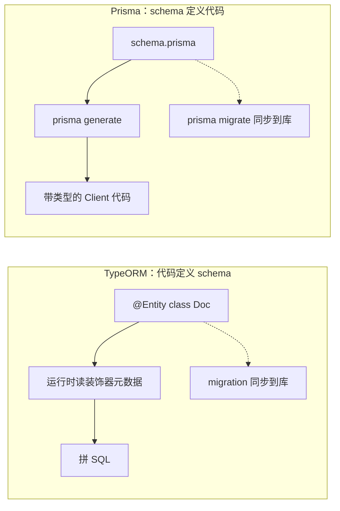

# Prisma：另一种 ORM 思路

> TypeORM 用装饰器在代码里定义表，Prisma 反过来——先写 schema 文件，再由它生成代码。这一个方向的翻转，决定了两者在类型安全、迁移体验和查询能力上的全部差异。

## 根本差异：谁定义谁

站里已经讲过 [TypeORM 实战](/guide/nestjs-database)，它的模型是**代码定义 schema**：你写 Entity 类、加装饰器，TypeORM 在运行时读元数据拼 SQL，再靠 `synchronize` 或 migration 把类的形状同步到数据库。Prisma 是**schema 定义代码**：你写一个 `.prisma` 文件（Prisma 自己的 DSL），跑一次 `generate`，它输出一整套带精确类型的 Client。你调用的 `prisma.doc.findMany()` 不是「通用方法 + 泛型」，而是**按你的表结构生成出来的具体方法**。



前端对这个区别很熟：TypeORM 像手写类型声明，类型和运行时行为都摆在代码里；Prisma 像 `graphql-codegen` / `openapi-typescript`——**契约在别处，类型是生成物**。你不手写类型，所以类型不会和真实结构对不上。后面全部差异都是这一条衍生出来的：

| 现象 | 原因 |
|---|---|
| 类型极准：`select` 了哪几个字段，返回值类型就只有那几个字段 | 类型是按 schema 生成的，不是泛型推断出来的 |
| 没有装饰器，也不依赖 `reflect-metadata` | 不需要运行时读元数据，形状在生成阶段已经写死进代码 |
| 不会因为 lazy loading 意外触发 N+1 | 根本没有 lazy loading，关联必须显式 `include`，发几条 SQL 是你写出来的 |
| 改了 schema 忘了 `generate`，类型就是旧的 | 生成物本质是一份缓存，和源头之间隔着一个显式步骤 |
| 复杂查询容易撞墙 | 没有 QueryBuilder，超出 Client 表达力就得写裸 SQL |

---

## 上手流程

```bash
npm i -D prisma && npm i @prisma/client
npx prisma init --datasource-provider mysql   # 生成 prisma/schema.prisma 和 .env
# 编辑 schema.prisma，写 model
npx prisma migrate dev --name init            # 生成并执行迁移 SQL，顺带 generate
npx prisma studio                             # 想肉眼看数据时
```

五步：装包 → `init` → 写 model → `migrate dev` → 用 Client。`migrate dev` 内部已经调过 `generate`，所以本地开发通常不用单独跑它。

### 命令速查
| 命令 | 干什么 | 什么时候用 |
|---|---|---|
| `prisma init` | 建 `schema.prisma` 和 `.env` 骨架 | 项目第一次接 Prisma |
| `prisma migrate dev` | 按 schema 差异生成迁移 SQL、执行、再 `generate`（还会跑 seed） | **只在本地开发** |
| `prisma migrate deploy` | 只按文件名顺序执行 `migrations/` 里还没跑过的 SQL，不生成、不比对、不重置 | **CI / 预发 / 生产的唯一选择** |
| `prisma migrate reset` | 删库重建、重跑全部迁移、重跑 seed | 本地迁移历史乱了，想推平重来 |
| `prisma migrate status` | 报告库里的迁移记录和本地文件差在哪 | 部署前检查、排查「生产为什么没这列」 |
| `prisma db push` | 不产生迁移文件，直接把 schema 拍到库上 | 原型阶段、临时库；**不进生产** |
| `prisma db pull` | 反向：把现有库的结构写回 schema | 接手存量库，或 Prisma 之外的人改过表 |
| `prisma generate` | 只重新生成 Client 代码 | CI 装完依赖后、拉到别人改的 schema 后 |
| `prisma db seed` | 跑 `package.json` 里配的 seed 脚本 | 初始化字典表、造本地测试数据 |
| `prisma studio` | 本地图形界面看 / 改数据 | 调试时比开 SQL 客户端快 |
| `prisma validate` / `format` | 检查语法 / 格式化 schema | 提交前，或配成 pre-commit |

::: danger migrate dev 绝对不能对生产库执行
`migrate dev` 是「开发态」命令：它会比对 schema 和库的差异，一旦检测到迁移历史不一致或者库被人手工改过（drift），就会**提示重置整个数据库**，重置后还会重跑 seed。CI 里没有交互终端，配上 `--force` 之类的参数更是直接把库清空。生产只用 `migrate deploy`，它只做一件事：把还没执行过的迁移文件按顺序跑完。迁移文件是纯 SQL，**要进 git、要进 code review**，破坏性变更（删列、改类型、加 NOT NULL）自己在里面补好数据搬迁语句。
:::

`db push` 和 `migrate dev` 的区别值得单独说：`db push` 不留迁移文件，本质等于 TypeORM 的 `synchronize`。两个都很方便，但**没有迁移文件就没有可回溯、可 review、可在另一个环境重放的变更记录**。判断标准很简单：这个库的数据丢了你会不会心疼——会，就用 migrate。

---

## schema 语法

一个 schema 文件由三类块组成：`datasource`（连哪个库）、`generator`（生成什么）、`model` / `enum`（表和枚举）。下面这份 schema 后面全篇都会用到——一个知识库：空间下面有文档，文档可以打标签。

```prisma
datasource db {
  provider = "mysql"
  url      = env("DATABASE_URL")      // 只能从环境变量读，写死会被 validate 拦下来
}

generator client {
  provider = "prisma-client-js"       // 不指定 output 就生成到 node_modules 里
}

enum DocStatus { DRAFT  PUBLISHED  ARCHIVED }

model Space {
  id        Int      @id @default(autoincrement())
  name      String   @db.VarChar(60)
  slug      String   @unique
  docQuota  Int      @default(200)     @map("doc_quota")
  createdAt DateTime @default(now())   @map("created_at")
  updatedAt DateTime @updatedAt        @map("updated_at")
  docs      Doc[]                                 // 关系字段，不产生列
  @@map("spaces")
}

model Doc {
  id        Int       @id @default(autoincrement())
  publicId  String    @unique @default(uuid())  @map("public_id")
  title     String    @db.VarChar(200)
  body      String?   @db.Text                   // ? = 可空
  status    DocStatus @default(DRAFT)
  wordCount Int       @default(0)      @map("word_count")
  viewCount Int       @default(0)      @map("view_count")
  spaceId   Int                        @map("space_id")
  space     Space     @relation(fields: [spaceId], references: [id], onDelete: Cascade)
  tags      Tag[]                                 // 隐式多对多
  createdAt DateTime  @default(now())  @map("created_at")
  deletedAt DateTime?                  @map("deleted_at")

  @@index([spaceId, status])
  @@map("docs")
}

model Tag {
  id   Int     @id @default(autoincrement())
  name String  @unique @db.VarChar(30)
  hot  Boolean @default(false)
  docs Doc[]
  @@map("tags")
}
```

### 字段：类型、修饰符、属性

| 类别 | 写法 | 说明 |
|---|---|---|
| 标量类型 | `Int` `BigInt` `Float` `Decimal` `String` `Boolean` `DateTime` `Json` `Bytes` | 到数据库类型的映射由 provider 决定 |
| 修饰符 | `String?` / `Doc[]` | `?` 可空；`[]` 列表（关系字段，或 PostgreSQL 的数组列——MySQL 不支持标量数组） |
| 精确类型 | `@db.VarChar(200)` `@db.Text` `@db.Decimal(12, 2)` | 不写就用默认映射。MySQL 下 `String` 默认 `VARCHAR(191)`，所以几乎总要显式指定 |
| 字段属性 | `@id` `@unique` `@default(...)` `@updatedAt` `@map("col")` `@relation(...)` `@ignore` | 作用于单个字段 |
| 块属性 | `@@id([a, b])` `@@unique([a, b])` `@@index([a, b])` `@@map("table")` | 作用于整个 model |

`@default()` 支持字面量和几个函数：`autoincrement()` / `uuid()` / `cuid()` / `now()` / `dbgenerated("...")`。其中 **`uuid()` 和 `cuid()` 只能用在 `String` 字段上，而且是由 Client 在应用侧生成、不是数据库默认值**——绕过 Prisma 插数据（裸 SQL、DBA 手工）时不会自动填；`autoincrement()` 和 `now()` 才是真的写进 DDL。

命名习惯：**Prisma 里用 camelCase，数据库里用 snake_case，中间靠 `@map` / `@@map` 搭桥**。别为了省几个 `@map` 让库里出现 `wordCount` 这种列名，写 SQL 排查问题的人会难受。`Decimal` 在 Prisma 里是 Decimal 对象而不是 `number`，比 TypeORM 映射成 `string` 友好一些，但仍然不能直接 `+`——金额字段要么全程用它的方法运算，要么用 `Int` 存「分」。

### 关系：外键写在哪一侧

`@relation` 的规则一句话说完：**`fields` 写在有外键的那一侧，`references` 指向对方的唯一列；另一侧只写一个数组或可空对象字段，不产生任何列。**

```prisma
// 一对多：外键永远在「多」的一侧
model Space { docs Doc[] }                        // 「一」侧：纯虚拟字段
model Doc {
  spaceId Int   @map("space_id")                  // 「多」侧：真实的外键列
  space   Space @relation(fields: [spaceId], references: [id], onDelete: Cascade)
}
```

一对一就是**在上面的外键列上再加一个 `@unique`**，把「多」压成「一」；「一」侧的字段写成可空（`setting UserSetting?`）表示允许暂时没有。多对多则有两种写法：

```prisma
// ① 隐式：两侧都写数组，Prisma 自己建并维护中间表
model Doc { tags Tag[] }
model Tag { docs Doc[] }

// ② 显式：自己声明中间 model —— 中间表要存额外字段时唯一的选择
model DocTag {
  docId     Int      @map("doc_id")
  tagId     Int      @map("tag_id")
  addedById Int      @map("added_by_id")      // 谁打的这个标签
  createdAt DateTime @default(now()) @map("created_at")
  doc       Doc      @relation(fields: [docId], references: [id], onDelete: Cascade)
  tag       Tag      @relation(fields: [tagId], references: [id], onDelete: Cascade)

  @@id([docId, tagId])                        // 联合主键，天然防重复
  @@map("doc_tags")
}
```

| | 隐式 | 显式 |
|---|---|---|
| 中间表 | Prisma 生成并管理，表名列名按它的约定 | 你自己命名，进 schema 和迁移 |
| 操作方式 | `connect` / `disconnect` / `set` 直接操作对方 | 当成一张普通表来增删 |
| 能加字段吗 | 不能 | 能（打标签的人、时间、排序权重） |
| 什么时候选 | 纯粹的「贴标签」，中间表永远只有两个外键 | 中间表有业务含义，或者要给它单独建索引 |

> ⚠️ 隐式改显式没有平滑路径，要写数据搬迁迁移。中间表**有可能**长出字段的话，一开始就用显式。

`onDelete` / `onUpdate` 决定外键约束里带什么动作，由数据库执行，任何途径的删除都会触发：

| 动作 | 行为 | 什么时候用 |
|---|---|---|
| `Cascade` | 父行删除，子行一起删 | 子行离开父行就没有意义（文档的段落、订单的明细） |
| `Restrict` | 有子行就禁止删父行 | 强制业务先处理干净（空间下还有文档就不许删空间） |
| `SetNull` | 外键置 `NULL`，要求字段可空 | 弱引用（作者被注销，文档还留着） |
| `NoAction` | 交给数据库的默认行为 | 极少显式写 |

不指定时的默认值容易记错：**必填关系默认 `Restrict`，可空关系默认 `SetNull`，`onUpdate` 一律默认 `Cascade`**。级联删除范围大且不可撤销，重要业务表宁可用 `Restrict` 配软删除（Prisma 没有内置软删除，本篇最后给实现）。

`@@index([spaceId, status])` 生成的是复合索引，最左前缀规则和手写 DDL 完全一样，怎么设计见 [MySQL 表结构设计](/guide/mysql-table-design)。Prisma 的一个便利是**默认会给外键列建索引**，不用自己补。

---

## Client 单表 CRUD

所有方法都挂在 `prisma.<model 的小驼峰名>` 上，参数是一个对象，字段名固定：`where` / `data` / `select` / `include` / `orderBy` / `skip` / `take` / `cursor` / `distinct`。

### 查

```typescript
await prisma.doc.findUnique({ where: { id: 7 } })        // 只能按唯一键查，查不到返回 null
await prisma.doc.findUnique({ where: { publicId } })
await prisma.doc.findUniqueOrThrow({ where: { id: 7 } }) // 查不到直接抛错，省掉一层 if

await prisma.doc.findFirst({                             // 任意条件 + 排序，取第一条
  where: { spaceId: 1, status: 'PUBLISHED' },
  orderBy: { createdAt: 'desc' },
})

await prisma.doc.findMany({
  where: {
    spaceId: 1,
    deletedAt: null,
    title: { contains: '检索' },
    status: { in: ['PUBLISHED', 'ARCHIVED'] },
    wordCount: { gte: 500, lt: 20000 },
    OR: [{ viewCount: { gt: 1000 } }, { tags: { some: { name: 'RAG' } } }],
    NOT: { status: 'DRAFT' },
  },
  orderBy: [{ status: 'asc' }, { createdAt: 'desc' }],
  select: { id: true, title: true, createdAt: true },
  take: 20,
})
```

`where` 常用操作符：`equals` / `not` / `in` / `notIn` / `lt` / `lte` / `gt` / `gte` / `contains` / `startsWith` / `endsWith`，加三个组合器 `AND`（同级多个条件默认就是 AND）/ `OR` / `NOT`。

> ⚠️ `mode: 'insensitive'`（忽略大小写）只有 PostgreSQL 和 MongoDB 支持。MySQL 的大小写敏感性取决于列的 collation，不是 Prisma 能控制的。

### select vs include

| | 作用 | 冲突 |
|---|---|---|
| `select` | **白名单**：只返回列出的字段，返回值类型跟着收窄 | 同一层里不能和 `include` 并存 |
| `include` | 在默认返回全部标量字段的基础上，**额外**带上关联 | 同上 |
| `omit` | 黑名单：返回全部字段但排除列出的（较新版本才有） | 和 `select` 互斥 |

`select` 里也能嵌套关联，所以它其实是 `include` 的超集——需要「部分标量 + 部分关联」时只能用 `select`：

```typescript
await prisma.doc.findMany({
  select: {
    id: true,
    title: true,
    space: { select: { name: true } },
    _count: { select: { tags: true } },     // 只要数量，不要列表
  },
})
```

**password、内部备注这类字段，靠 `select` 白名单挡住比靠黑名单或序列化层可靠得多**——白名单漏一个字段只是少返回，黑名单漏一个字段就是泄露。序列化层的做法见 [DTO 与序列化](/guide/nestjs-dto)，两层一起上最稳。

### 两种分页

```typescript
// offset 分页：直观，页码可跳转
await prisma.doc.findMany({ where: { spaceId: 1 }, orderBy: { id: 'desc' }, skip: (page - 1) * 20, take: 20 })

// cursor 分页：用上一页最后一条的唯一值定位
await prisma.doc.findMany({
  where: { spaceId: 1 },
  orderBy: { id: 'desc' },
  cursor: { id: lastId },
  skip: 1,                 // 跳过游标本身那一条
  take: 20,
})
```

| | offset（`skip` / `take`） | cursor |
|---|---|---|
| 底层 SQL | `LIMIT 20 OFFSET 10000` | `WHERE id < ? LIMIT 20` |
| 深翻页 | 差，数据库要扫过并丢掉前 10000 行 | 稳定，永远走索引定位 |
| 数据变动时 | 有人插入 / 删除会导致重复或漏项 | 不受影响 |
| 能跳到第 N 页吗 | 能 | 不能，只有上一页 / 下一页 |
| 总条数 | 配一次 `count` 就有 | 一般不给，改成「还有更多」 |

后台管理列表用 offset（产品要页码），信息流、消息记录、批量导出这类只往一个方向走的场景用 cursor。**`orderBy` 的字段必须唯一，否则同值行的相对顺序不稳定，游标会跳过或重复**；按 `createdAt` 排序时补一个 `id` 兜底。

### 写

```typescript
await prisma.doc.create({ data: { title: 'RAG 入库链路', spaceId: 1 }, select: { id: true } })

// createMany：一条 INSERT 带多组 VALUES，快很多，但拿不到生成的行
await prisma.tag.createMany({ data: [{ name: 'RAG' }, { name: 'Agent' }], skipDuplicates: true })

// update：where 必须能唯一定位，匹配不到抛 P2025
await prisma.doc.update({ where: { id: 7 }, data: { status: 'PUBLISHED' } })
// 原子自增，避免「读出来 +1 再写回」的竞态
await prisma.doc.update({ where: { id: 7 }, data: { viewCount: { increment: 1 } } })
// updateMany：按条件批量，返回 { count }
await prisma.doc.updateMany({ where: { spaceId: 1, status: 'DRAFT' }, data: { status: 'ARCHIVED' } })

// upsert：存在就更新，不存在就插入
await prisma.tag.upsert({ where: { name: 'RAG' }, update: { hot: true }, create: { name: 'RAG', hot: true } })

await prisma.doc.delete({ where: { id: 7 } })
await prisma.doc.deleteMany({ where: { deletedAt: { not: null } } })
```

两个坑：**`upsert` 的 `where` 必须命中唯一约束，否则并发下会插出两条**——它不是一条原子 SQL，而是「查 → 插或改」，靠唯一索引兜底才安全。`skipDuplicates` 同样依赖唯一索引，而且只在 MySQL / PostgreSQL 上可用。

### 统计

```typescript
await prisma.doc.count({ where: { spaceId: 1, status: 'PUBLISHED' } })

await prisma.doc.aggregate({
  where: { spaceId: 1 },
  _count: { _all: true },
  _sum: { wordCount: true },
  _avg: { wordCount: true },
  _max: { createdAt: true },
})

await prisma.doc.groupBy({
  by: ['spaceId', 'status'],
  _count: { _all: true },
  having: { wordCount: { _sum: { gt: 10000 } } },   // 对聚合结果过滤，即 SQL 的 HAVING
  orderBy: { spaceId: 'asc' },
})
```

`groupBy` 的约束和 SQL 一致：`by` 里没有的字段不能裸着出现在结果里，只能出现在聚合函数中；分组**前**的过滤用 `where`，分组**后**的过滤用 `having`。

---

## Client 多表操作

### 嵌套写入
一次调用建主表 + 子表，Prisma 自动包在一个事务里；三个关联动作要分清：

```typescript
await prisma.space.create({
  data: {
    name: 'AI 应用',
    slug: 'ai-app',
    docs: { create: [{ title: 'RAG 入库链路' }, { title: 'Agent 评测' }] },   // 新建关联行
  },
  include: { docs: { select: { id: true, title: true } } },
})
```

| 动作 | 语义 | 典型场景 |
|---|---|---|
| `create` | 新建一条关联行 | 建空间时顺手建默认文档 |
| `connect` | 关联到**已存在**的行，对方不存在直接抛错 | 文档挂到已有空间下 |
| `connectOrCreate` | 按唯一键找，找到就连、没有就建 | 打标签：标签可能是新的 |

```typescript
await prisma.doc.create({
  data: {
    title: '向量检索调优',
    space: { connect: { slug: 'ai-app' } },                  // 断定它存在
    tags: {
      connectOrCreate: [
        { where: { name: 'RAG' },    create: { name: 'RAG' } },
        { where: { name: '向量库' }, create: { name: '向量库' } },
      ],
    },
  },
})
```

`update` 里还能用 `set`（整体替换关联集合）、`disconnect`（解除关联但不删对方）、`delete` / `deleteMany`（真删对方）、`update` / `updateMany`（改对方）。**`set: []` 是清空关联，`deleteMany: {}` 是删掉对方的行**，写错一个词就从「取消标签」变成「删掉标签」。

### 关联查询与关系过滤

```typescript
await prisma.space.findMany({
  where: { docs: { some: { status: 'PUBLISHED' } } },   // some 至少一条；every 全部；none 一条都没有
  include: {
    docs: {
      where: { deletedAt: null },                       // 关联也能带条件、排序、分页
      orderBy: { createdAt: 'desc' },
      take: 5,
      include: { tags: true },                          // 深层嵌套
    },
  },
})
```

多对一方向用 `is` / `isNot`：`where: { space: { is: { slug: 'ai-app' } } }`。

> ⚠️ `every` 和 `none` 对「关联集合为空」的行也判定为 true。「所有文档都已发布的空间」这个查询会把**一篇文档都没有的空间**一起捞出来，要额外加一个 `docs: { some: {} }`。这是关系过滤最常见的 bug。

### $transaction 的两种形态

```typescript
// ① 数组批量：互不依赖的多个写操作，打成一个事务发出去
const [space, tagCount] = await prisma.$transaction([
  prisma.space.create({ data: { name: 'AI 应用', slug: 'ai-app' } }),
  prisma.tag.count(),
])

// ② 交互式回调：后一步要用前一步的结果，或者中间要跑业务判断
await prisma.$transaction(
  async (tx) => {
    const space = await tx.space.findUniqueOrThrow({ where: { slug }, select: { id: true, docQuota: true } })
    const used = await tx.doc.count({ where: { spaceId: space.id } })
    if (used >= space.docQuota) throw new ForbiddenException('该空间文档数已达上限')

    return tx.doc.create({ data: { title, spaceId: space.id } })
  },
  { timeout: 5000, isolationLevel: Prisma.TransactionIsolationLevel.RepeatableRead },
)
```

| | 数组形态 | 交互式回调 |
|---|---|---|
| 步骤间能否依赖 | 不能，参数在发起前就要定好 | 能，正常写 `await` |
| 回滚条件 | 任一条失败，全部回滚 | 回调抛异常就回滚 |
| 事务占用时长 | 短，一批发完就结束 | 取决于回调，默认 5 秒超时 |
| 主要坑 | 无 | 回调里**必须全程用 `tx`**，写成 `prisma` 就跑在事务外面了 |

交互式事务是长事务的常见来源。回调里只放数据库操作，发邮件、调模型、上传文件全部挪到事务提交之后——事务开着的时候，连接和行锁都被占着。隔离级别怎么选、锁等待和死锁怎么看，见[并发与事务](/guide/concurrency-transaction)。

---

## N+1 与性能

Prisma 的关联查询默认**不生成 JOIN**，而是拆成多条 SQL 再在内存里拼装：先查主表（`SELECT ... FROM spaces WHERE ...`），再用 `SELECT ... FROM docs WHERE space_id IN (1, 2, 3, ...)` 一次性把关联捞回来。好处是没有 JOIN 的行膨胀（一对多 JOIN 会把主表字段重复 N 遍传回来），坏处是多一次网络往返。关键在于：**SQL 条数只和关联层数有关，不随记录条数增长**，所以它不是 N+1。

真正的 N+1 在 Prisma 里只有一个来源——**你自己在循环里查**：

```typescript
// 反例：100 个 space 就是 101 条 SQL
for (const space of spaces) {
  space.docs = await prisma.doc.findMany({ where: { spaceId: space.id } })
}
// 正解：一次 include，或者一次 findMany 之后在内存里按 spaceId 分组
const spaces = await prisma.space.findMany({ include: { docs: true } })
```

想换回 JOIN 策略，可以在 generator 里打开 `relationJoins` 预览特性，之后按查询指定 `relationLoadStrategy: 'join' | 'query'`。哪个更快取决于数据形状（关联行少 → join 划算；一对多且主表字段很宽 → query 划算），**属于实测项，不是默认最佳实践**。GraphQL 层的 N+1 是另一个问题，那是 resolver 逐字段解析导致的，解法是 DataLoader，见 [GraphQL](/guide/nestjs-graphql)。

### 什么时候必须写裸 SQL

Client 覆盖不到的场景：窗口函数、CTE、`GROUP BY` 里带表达式、跨多表的复杂聚合、数据库特有函数（全文检索、JSON 函数、地理函数）。

```typescript
// 标签模板写法：参数自动变成占位符，没有注入风险
const rows = await prisma.$queryRaw<{ spaceId: number; total: number }[]>`
  SELECT space_id AS spaceId, SUM(word_count) AS total
  FROM docs
  WHERE created_at > ${since} AND deleted_at IS NULL
  GROUP BY space_id ORDER BY total DESC LIMIT 10
`
```

`$queryRaw` 读、`$executeRaw` 写，**返回类型要自己写，Prisma 不校验也不映射 `@map`**——裸 SQL 里必须用真实列名。绝不要用 `$queryRawUnsafe` 去拼字符串，那是 SQL 注入的标准入口。另外 MySQL 的 `COUNT()` / `SUM()` 经 Prisma 返回的是 `BigInt`，直接 `JSON.stringify` 会抛错，接口层记得转成 `Number`。

### 连接池与 serverless

Prisma 自己管连接池，大小由连接串参数控制：`?connection_limit=10&pool_timeout=20&connect_timeout=10`。不指定时默认是 `物理核数 × 2 + 1`。算总量的时候要记住**每个进程一个池**：4 个 Pod × 每个 10 条 = 40 条连接，别超过数据库的 `max_connections`。`pool_timeout` 是「等不到空闲连接就报错」的时间，宁可快速失败也不要让请求无限排队。

serverless（云函数、边缘运行时）是重灾区：每个实例独立进程、独立连接池，并发一上来瞬间打满数据库连接；实例还频繁冷启动和回收，建连开销被反复付。三条出路——把 `connection_limit` 压到 1、在中间加一层外部连接池（PgBouncer、RDS Proxy、Prisma 自家的托管连接池）、或者干脆不把持有连接池的服务放进 serverless。**这不是 Prisma 的毛病，任何带连接池的 ORM 在 serverless 上都一样。**

---

## 在 Nest 里集成

`PrismaClient` 本身就是一个要建连接、要关连接的长生命周期对象——正好是 Provider 的形状。做法是继承它，然后接上生命周期钩子：

```typescript
// prisma.service.ts
@Injectable()
export class PrismaService extends PrismaClient implements OnModuleInit, OnModuleDestroy {
  constructor(config: ConfigService) {
    super({
      datasources: { db: { url: config.getOrThrow<string>('DATABASE_URL') } },
      log: config.get('NODE_ENV') === 'production'
        ? [{ emit: 'event', level: 'error' }]
        : [{ emit: 'stdout', level: 'query' }, { emit: 'stdout', level: 'warn' }],
    })
  }

  // 不写 $connect 也能跑（首次查询时懒连接），但那样启动期发现不了配错的连接串
  async onModuleInit() { await this.$connect() }

  // 关连接池，让进程能干净退出
  async onModuleDestroy() { await this.$disconnect() }
}
```

配套在 `main.ts` 里 `app.enableShutdownHooks()`，否则 `SIGTERM` 到来时 `onModuleDestroy` 根本不会执行。

> ⚠️ 网上大量教程写的是在 `PrismaService` 里加一个 `enableShutdownHooks(app)` 方法、内部监听 `this.$on('beforeExit', ...)`。**Prisma 5 之后 `beforeExit` 已经不适用于默认的 library engine**，那份代码在新版本上是死代码。现在的正确形态就是上面这样：`OnModuleDestroy` 里 `$disconnect()`，加 `app.enableShutdownHooks()`。钩子的完整执行顺序和优雅退出细节见[依赖注入](/guide/nestjs-di)。

包成模块。全应用只该有一个连接池，且几乎每个业务模块都要用，属于典型的横切基础设施——这是少数适合 `@Global()` 的情况：

```typescript
@Global()
@Module({ providers: [PrismaService], exports: [PrismaService] })
export class PrismaModule {}
```

业务 Service 直接注入，不需要 TypeORM 那样按 Entity 逐个 `forFeature` 注册：

```typescript
@Injectable()
export class DocService {
  constructor(private readonly prisma: PrismaService) {}

  findPublished(spaceId: number) {
    return this.prisma.doc.findMany({
      where: { spaceId, status: 'PUBLISHED', deletedAt: null },
      select: { id: true, title: true, viewCount: true },
      orderBy: { createdAt: 'desc' },
    })
  }
}
```

方便的另一面是**边界消失了**：任何 Service 都能读写任何表。TypeORM 至少还要 `forFeature([Doc])` 才拿得到 `Repository<Doc>`，Prisma 连这道摩擦都没有。约束只能靠纪律——**一张表只由拥有它的模块直接读写，别的模块调它的 Service**。这条纪律在拆微服务时会变成硬约束，见[微服务与跨语言通信](/guide/nestjs-microservice)。

### 单元测试怎么 mock

`PrismaClient` 的方法是生成的、两层结构（`prisma.doc.findMany`），mock 只要提供用到的那几个：

```typescript
const prismaMock = { doc: { findMany: jest.fn().mockResolvedValue([{ id: 1 }]), create: jest.fn() } }

const moduleRef = await Test.createTestingModule({
  providers: [DocService, { provide: PrismaService, useValue: prismaMock }],
}).compile()

await moduleRef.get(DocService).findPublished(1)
expect(prismaMock.doc.findMany).toHaveBeenCalledWith(
  expect.objectContaining({ where: { spaceId: 1, status: 'PUBLISHED', deletedAt: null } }),
)
```

手写 mock 的类型不完整，社区常用 `jest-mock-extended` 的 `mockDeep<PrismaService>()` 拿到全量类型提示。

但要清楚这类测试**验的是「参数拼对了没有」，不是「SQL 对不对」**。`where` 条件写错、索引没命中、事务边界不对，mock 一律测不出来。真正有价值的是对着真实数据库跑的集成测试：起一个容器化的 MySQL，跑 `migrate deploy` + seed，每个用例前后清表。**Prisma 在这件事上比 TypeORM 顺手，因为迁移文件本来就是现成的纯 SQL。**

### 用 $extends 做软删除

Prisma 的扩展点是 `$extends`，四个维度：`model`（给某个 model 加方法）、`client`（给 client 加方法）、`query`（拦截查询，这是原中间件的替代品）、`result`（给返回结果加计算字段）。

```typescript
export function withSoftDelete(prisma: PrismaClient) {
  return prisma.$extends({
    name: 'softDelete',
    query: {
      doc: {
        async delete({ args, query }) {                // 删除改成打标记
          return query({ ...args, data: { deletedAt: new Date() } } as never)
        },
        async findMany({ args, query }) {              // 查询自动带上 deletedAt: null
          args.where = { deletedAt: null, ...args.where }
          return query(args)
        },
      },
    },
  })
}
```

::: warning 别写 $use
Prisma 4 时代的 `prisma.$use(async (params, next) => ...)` 中间件已经被 `$extends` 取代，在 Prisma 5 里废弃、之后移除。老教程里 `params.action === 'delete'` 那套写法不要再抄。
:::

两个必须知道的代价。第一，`$extends` 返回的是**一个新的 client 实例**，原实例不受影响——所以要么在 Provider 的 `useFactory` 里包装完再交给容器，要么把包装结果挂成 `PrismaService` 上的一个属性，直接在 `PrismaService` 里调一下 `$extends` 是没用的。第二，`query` 扩展是**逐个方法生效**的：只改了 `findMany`，那 `findFirst`、`findUnique`、`count`、以及别人 `include` 里的嵌套查询照样能看见已删除的行。软删除想做严密，成本比想象中高——动手前先问一句：这张表是不是真的需要软删除，还是只需要一张操作日志表？

---

## TypeORM vs Prisma 怎么选

| 维度 | TypeORM | Prisma |
|---|---|---|
| 类型安全 | 泛型 + 手写 Entity，`select` 之后返回值类型仍是完整实体，容易骗自己 | 生成式，`select` / `include` 精确反映在返回类型上 |
| 迁移体验 | 能 diff 出 migration，但属性改名之类的语义它看不出来；`synchronize` 是常见事故源 | `migrate dev` / `deploy` 分工清晰，迁移是纯 SQL 文件，可 review 可重放 |
| 复杂查询 | QueryBuilder 表达力强，子查询、窗口函数、复杂 JOIN 都能拼 | Client 覆盖常见 90%，超出就得 `$queryRaw`，裸 SQL 没有类型 |
| 编程风格 | Active Record（`entity.save()`）和 Data Mapper（Repository）都支持 | 只有一种：`prisma.model.method()`，没有实体对象 |
| 多数据库 | MySQL / PG / SQLite / MSSQL / Oracle / MongoDB | MySQL / PG / SQLite / MSSQL / MongoDB / CockroachDB，部分特性按 provider 有差异 |
| 和 Nest DI 的贴合度 | 官方 `@nestjs/typeorm`：`forRootAsync` / `forFeature` / `@InjectRepository` 一整套 | 没有官方包，自己写十几行 `PrismaService`——反而更简单、更透明 |
| 生态与资料 | 老牌，中文资料多，遗留项目多 | 文档质量高，工具链（studio / 迁移 / 类型）完整，社区更活跃 |
| 学习曲线 | 隐式规则多：拥有方、`cascade` vs `onDelete`、`eager` 的传染性 | 多学一门 DSL，但规则少而显式，上手更快 |
| 额外心智负担 | Entity 和真实表结构可能悄悄偏离 | 改完 schema 必须 `generate`；生成物要不要进 git 得团队定 |

结论：

- **新项目、查询以 CRUD 加中等复杂度过滤为主 → Prisma。** 类型准、迁移干净、集成代码少，这些收益每天都在。
- **需要 Active Record 风格、要大量 QueryBuilder 拼复杂查询、或者已有 TypeORM 存量 → TypeORM。** 为了类型好一点去重写整个数据访问层，收益远小于风险。
- **报表类、重分析的系统**，两个 ORM 都不是答案。直接写 SQL，或者上专门的查询层。

> ⚠️ **一个项目里不要同时用两套 ORM。** 两套连接池、两套迁移历史、两边都能改同一张表却互不知情——「表结构由谁定义」这个问题会永远说不清，事务也没法跨两套。真要迁移就整体迁移：先用 `db pull` 从现有库反推出 schema，逐模块替换数据访问层，全程只让一套负责迁移。

---

## 面试怎么说

- **Prisma 和 TypeORM 的本质区别**：一个是 schema 定义代码（DSL → 代码生成 → Client），一个是代码定义 schema（装饰器 + 运行时元数据）。类型精确、没有 lazy loading、没有 QueryBuilder，全是这一条的推论。
- **`migrate dev` 和 `migrate deploy`**：前者是开发命令，会 diff、会生成迁移文件，检测到 drift 会提示重置数据库并重跑 seed；后者只按顺序执行已有迁移。生产只能用 deploy。
- **Prisma 会不会 N+1**：`include` 是固定条数的多条查询（不是 JOIN，也不是 N+1），真正的 N+1 来自在循环里查询。需要 JOIN 可以开 `relationJoins` 预览特性，用 `relationLoadStrategy` 按查询指定。
- **在 Nest 里怎么接**：`PrismaService extends PrismaClient`，`onModuleInit` 里 `$connect`、`onModuleDestroy` 里 `$disconnect`，`main.ts` 里 `app.enableShutdownHooks()`，包成 `@Global()` 的 `PrismaModule`。
- **软删除怎么做**：`$extends` 的 `query` 扩展（不是已废弃的 `$use`），并且要说清它逐方法生效、嵌套查询覆盖不到这两个局限。

---

## 面试问答

**1. Prisma 和 TypeORM 最本质的区别是什么？**

- 方向相反：TypeORM 是代码定义 schema（写 Entity 装饰器，运行时读元数据拼 SQL）；Prisma 是 schema 定义代码（写 `.prisma`，`generate` 输出一整套带精确类型的 Client）。
- 由此推出的现象：Prisma `select` 了哪几个字段，返回值类型就只有哪几个；没有 lazy loading，不会因属性访问意外触发 N+1；没有装饰器、不依赖 `reflect-metadata`。
- 加分：前端类比——TypeORM 像手写类型声明，Prisma 像 `graphql-codegen`，契约在别处、类型是生成物；代价是改了 schema 忘了 `generate`，类型就是旧的。

**2. 为什么生产只能用 `migrate deploy`？**

- `migrate dev` 是开发态命令：比对 schema 和库的差异生成迁移，一旦检测到迁移历史不一致或库被手工改过（drift），会提示重置整个数据库并重跑 seed；CI 里没有交互终端，配上 `--force` 更是直接清库。
- `deploy` 只做一件事：把还没执行过的迁移文件按顺序跑完。`db push` 不产生迁移文件，本质等于 TypeORM 的 `synchronize`，不进生产。
- 加分：迁移文件是纯 SQL，要进 git、进 code review，破坏性变更自己在里面补好数据搬迁语句；判断标准——这个库的数据丢了你会不会心疼，会就用 migrate。

**3. Prisma 有 N+1 问题吗？**

- `include` 不是 JOIN 也不是 N+1：它默认拆成多条 SQL 在内存里拼装——先查主表，再用一条 `WHERE space_id IN (...)` 把关联捞回来，SQL 条数只和关联层数有关、不随记录条数增长；代价是多一次网络往返，换来没有 JOIN 的行膨胀。
- 真正的 N+1 只有一个来源：你自己在循环里查（100 个 space 循环查 docs 就是 101 条 SQL）。解法是一次 `include`，或一次 `findMany` 之后在内存里按 spaceId 分组。
- 想换 JOIN 策略，在 generator 里开 `relationJoins` 预览特性，之后按查询指定 `relationLoadStrategy: 'join' | 'query'`——哪个更快取决于数据形状，属于实测项，不是默认最佳实践。

**4. 交互式事务最大的坑是什么？**

- 回调里必须全程用 `tx`，写成 `prisma` 就跑在事务外面了——不报错，数据一致性悄悄坏掉。
- 默认 5 秒超时；回调里只放数据库操作，发邮件、调模型、上传文件全部挪到事务提交之后——事务开着的时候，连接和行锁都被占着。
- 加分：互不依赖的多个写操作用数组形态，一批发完就结束、占用短；后一步要用前一步的结果或中间有业务判断，才用交互式回调。

**5. 在 Nest 里怎么集成 Prisma？软删除呢？**

- `PrismaService extends PrismaClient`，`onModuleInit` 里 `$connect`（懒连接也能跑，但那样启动期发现不了配错的连接串）、`onModuleDestroy` 里 `$disconnect`，`main.ts` 里 `app.enableShutdownHooks()`，包成 `@Global()` 的 `PrismaModule`——横切基础设施正是少数适合全局的情况。
- 软删除用 `$extends` 的 `query` 扩展，不是已废弃的 `$use`；它返回的是一个新 client 实例（直接在 `PrismaService` 里调一下没用，要在 `useFactory` 里包装完再交给容器），而且逐方法生效——只拦 `findMany`，`findFirst`、`count`、嵌套查询照样能看见已删除的行。
- 别踩的坑：网上教程里 `$on('beforeExit', ...)` 那套，在 Prisma 5 之后的默认 library engine 上是死代码。
