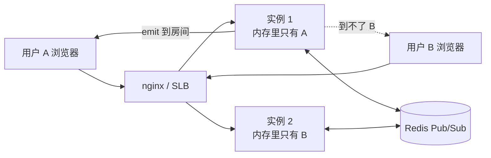

# 实时通信：WebSocket 与 SSE

> 服务端想主动把数据推给浏览器，有四条路。这篇先帮你选对路，再把 WebSocket 协议拆到字节级别手写一遍，然后落到 Nest 的 Gateway：鉴权、房间、多实例广播、消息不丢。最后是 SSE —— AI 流式回复现在几乎都走它。

## 先选型：四种「服务端推送」

HTTP 的默认形态是一问一答，客户端不问，服务端就没有说话的机会。要让服务端主动出声，只有这四种做法。

| | 短轮询 | 长轮询 | SSE | WebSocket |
|---|---|---|---|---|
| 连接方向 | 客户端反复拉 | 客户端拉，服务端挂住不回 | 服务端单向推 | 双向 |
| 底层协议 | HTTP | HTTP | HTTP，响应类型 `text/event-stream` | ws / wss，握手后是另一套二进制协议 |
| 协议开销 | 每次都带完整 header + Cookie，空轮询占绝大多数 | 比短轮询省，但每条消息仍是一次完整响应 | 一次 header，之后每条消息几个字节 | 一次 header，之后每帧 2–14 字节 |
| 实时性 | 取决于轮询间隔，天然有延迟 | 接近实时 | 实时 | 实时 |
| 断线重连 | 不需要，本来就是一次次独立请求 | 要自己重发 | **浏览器自动重连**，还会带上 `Last-Event-ID` | 要自己写重连 + 退避 |
| 代理与防火墙 | 无障碍 | 无障碍，但要留意网关超时 | 无障碍，但要关掉反向代理的响应缓冲 | 代理必须显式支持 Upgrade，老网关容易掐断 |
| 浏览器兼容 | 全部 | 全部 | 除 IE 外全部 | 除 IE 9 以下全部 |
| 实现复杂度 | 最低 | 中等，服务端要挂住请求 | 低 | 高：心跳、重连、房间、多实例广播都得自己管 |
| 典型场景 | 订单状态查询、低频看板 | 老系统里的消息通知 | 通知、构建日志、任务进度、AI 逐字回复 | 聊天、协同编辑、游戏、行情 |

结论直接给：**只要数据是服务端单向推给客户端的，用 SSE。** 它就是一个普通 HTTP 响应，能复用现有的鉴权、限流、日志、网关和链路追踪，浏览器还免费送你自动重连。只有需要双向高频交互——聊天要发也要收、协作要同步光标、游戏要上报操作——才值得付 WebSocket 那份复杂度。两种轮询今天只在两种情况下还成立：客户端环境实在不支持流式响应，或者「实时」的真实要求是「30 秒内知道就行」。


---

## WebSocket 协议原理

### 握手：一次性从 HTTP 借道

WebSocket 和 HTTP 的关系只有一次握手。客户端发一个普通的 GET 请求，带上这几个头：

```text
GET /chat HTTP/1.1              ← 客户端：一个普通 GET，只是多了四个头
Host: example.com
Upgrade: websocket
Connection: Upgrade
Sec-WebSocket-Version: 13
Sec-WebSocket-Key: dGhlIHNhbXBsZSBub25jZQ==

HTTP/1.1 101 Switching Protocols  ← 服务端：注意是 101，不是 200
Upgrade: websocket
Connection: Upgrade
Sec-WebSocket-Accept: s3pPLMBiTxaQ9kYGzzhZRbK+xOo=
```

`Sec-WebSocket-Key` 是客户端随机生成的 16 字节 base64。服务端把它和协议里写死的魔法字符串拼起来，做 SHA1 再转 base64，结果放进 `Sec-WebSocket-Accept`：

```typescript
import { createHash } from 'crypto'

const MAGIC = '258EAFA5-E914-47DA-95CA-C5AB0DC85B11'   // 协议常量，不是谁的私有约定

const acceptKey = (key: string) =>
  createHash('sha1').update(key + MAGIC).digest('base64')

// acceptKey('dGhlIHNhbXBsZSBub25jZQ==') === 's3pPLMBiTxaQ9kYGzzhZRbK+xOo='
```

这一步不是加密，也防不了任何人——魔法字符串是公开的。它的作用是**证明对面真的懂 WebSocket**：万一某个缓存或不相关的服务恰好返回了 101，客户端能立刻发现算出来的值不对然后断开，而不是傻等一个永远不会来的消息。

握手成功后，这条 TCP 连接上再也没有 HTTP 了。`Content-Length`、Cookie、状态码全部作废，两端开始按帧收发。想看这个过程，DevTools 的 Network 面板过滤 WS，Messages 标签页里就是解析好的帧。


### 帧结构：为什么每帧只要 2 个字节头

HTTP 是文本协议，可读性换来的是体积。WebSocket 反过来，头部压到位级别：

| 位置 | 字段 | 含义 |
|---|---|---|
| 第 1 字节 bit 0 | FIN | 1 = 这是一条消息的最后一帧。分片发送时中间帧为 0 |
| 第 1 字节 bit 1–3 | RSV1–3 | 保留位，协商了扩展（如 `permessage-deflate` 压缩）才会用 |
| 第 1 字节 bit 4–7 | opcode | 帧类型，见下表 |
| 第 2 字节 bit 0 | MASK | payload 是否被掩码 |
| 第 2 字节 bit 1–7 | payload len | 7 位长度，值 ≤ 125 时它就是真实长度 |
| 接下来 0 / 2 / 8 字节 | 扩展长度 | 7 位值 = 126 时取后续 16 位为长度；= 127 时取后续 64 位 |
| 接下来 0 / 4 字节 | masking key | 仅当 MASK = 1 时存在 |
| 剩余 | payload | 有掩码就逐字节异或还原 |

三段式长度的设计意图很直白：绝大多数消息都很短，让它们只花 7 位；长消息才升到 16 位、64 位。一条 5 字节的心跳文本，整帧只有 7 个字节，同样内容用 HTTP 至少几百字节。

| opcode | 类型 | 说明 |
|---|---|---|
| `0x0` | continuation | 分片消息的后续帧 |
| `0x1` | text | payload 是 UTF-8 文本 |
| `0x2` | binary | payload 是二进制 |
| `0x8` | close | 关闭帧，前 2 字节是状态码（如 1000 正常、1001 离开） |
| `0x9` | ping | 探针 |
| `0xA` | pong | 探针回应，payload 必须原样带回 |

### 掩码：为什么只有一个方向要做

规则不对称：**客户端发给服务端的每一帧都必须掩码，服务端发给客户端的每一帧都禁止掩码。** 违反了对方应该直接关连接。

原因不是加密——掩码 key 就在帧里明文躺着，任何人都能还原。它防的是**代理缓存投毒**。设想链路里有个老式透明代理，它不认识 WebSocket，仍然按 HTTP 去理解这条连接上的字节。攻击者可以在页面里用 `new WebSocket()` 发一段精心构造的 payload，内容看起来就是一个完整的 `GET /jquery.js HTTP/1.1` 请求，诱导代理把攻击者控制的响应缓存成那个 URL 的内容，于是同一个网络里所有人都中毒。掩码 key 每帧随机、由客户端生成，攻击者无法预测最终落在线路上的字节，这条攻击就不成立了。反方向没有这个风险，所以省掉这 4 个字节和一轮异或。

### ping / pong 与一个关键限制

`0x9` / `0xA` 这对帧是协议内置的探活机制：一端发 ping，另一端必须尽快回一个 payload 相同的 pong。它同时还能给 NAT 和中间设备「这条连接还活着」的信号，避免被静默回收。

但有个限制影响所有前端方案：**浏览器的 JS API 发不出 ping 帧**。`WebSocket` 对象只有 `send()`，收到的 ping 由浏览器自动回 pong，你既看不见也控制不了。所以「客户端主动探活」只能在应用层自己发一条业务消息来模拟——这正是 socket.io 要在协议之上再造一套心跳的原因。

### 手写一个最小服务端

下面这段用 `net` 直接起 TCP 服务，自己解析握手、自己解帧编帧。它能跑，能和浏览器原生 `new WebSocket()` 通信。看完这一节，WebSocket 就不再是黑盒了。

```typescript
// tiny-ws.ts —— 只为看清协议，不要用在生产。acceptKey 复用上面那个
import { createServer, Socket } from 'net'

const OPCODE = { TEXT: 0x1, BINARY: 0x2, CLOSE: 0x8, PING: 0x9, PONG: 0xa }

function encode(opcode: number, payload: Buffer): Buffer {
  const len = payload.length
  const head = Buffer.alloc(len < 126 ? 2 : len < 65536 ? 4 : 10)

  head[0] = 0b1000_0000 | opcode           // FIN = 1，不分片
  if (len < 126) {
    head[1] = len                          // 服务端发出的帧 MASK 位必须是 0
  } else if (len < 65536) {
    head[1] = 126
    head.writeUInt16BE(len, 2)
  } else {
    head[1] = 127
    head.writeBigUInt64BE(BigInt(len), 2)
  }
  return Buffer.concat([head, payload])
}

// 每条连接：先握手，之后进入解帧循环
createServer((socket) => {
  socket.once('data', (chunk) => {
    // 握手报文还是 ASCII 文本，仅此一次
    const key = /sec-websocket-key: *(\S+)/i.exec(chunk.toString('latin1'))?.[1]
    if (!key) return socket.destroy()

    socket.write([
      'HTTP/1.1 101 Switching Protocols',
      'Upgrade: websocket',
      'Connection: Upgrade',
      `Sec-WebSocket-Accept: ${acceptKey(key)}`,
      '\r\n',
    ].join('\r\n'))

    let pending = Buffer.alloc(0)
    socket.on('data', (data) => {
      pending = drain(socket, Buffer.concat([pending, data]))
    })
    socket.on('error', () => socket.destroy())
  })
}).listen(8080)

function drain(socket: Socket, buf: Buffer): Buffer {
  // TCP 是字节流：一次 data 可能是半个帧，也可能是三个帧，必须循环 + 留存
  while (buf.length >= 2) {
    const fin = (buf[0] & 0b1000_0000) !== 0
    const opcode = buf[0] & 0b0000_1111
    const masked = (buf[1] & 0b1000_0000) !== 0
    let len = buf[1] & 0b0111_1111
    let offset = 2

    if (len === 126) {
      if (buf.length < offset + 2) break
      len = buf.readUInt16BE(offset)
      offset += 2
    } else if (len === 127) {
      if (buf.length < offset + 8) break
      len = Number(buf.readBigUInt64BE(offset))
      offset += 8
    }
    if (!masked) {
      socket.destroy()                                     // 客户端不掩码 = 违反协议
      return Buffer.alloc(0)
    }

    const maskKey = buf.subarray(offset, offset + 4)
    offset += 4
    if (buf.length < offset + len) break                   // 半包，等下一批数据

    const payload = Buffer.from(buf.subarray(offset, offset + len))
    for (let i = 0; i < payload.length; i++) payload[i] ^= maskKey[i % 4]
    buf = buf.subarray(offset + len)                       // 粘包，继续解下一帧

    if (opcode === OPCODE.TEXT && fin) {
      const text = payload.toString('utf8')
      console.log('收到:', text)
      socket.write(encode(OPCODE.TEXT, Buffer.from(`echo: ${text}`, 'utf8')))
    } else if (opcode === OPCODE.PING) {
      socket.write(encode(OPCODE.PONG, payload))            // payload 必须原样带回
    } else if (opcode === OPCODE.CLOSE) {
      socket.write(encode(OPCODE.CLOSE, payload))           // 回一个 close 帧，这叫关闭握手
      socket.end()
    }
  }
  return buf
}
```

配一个测试页，用浏览器原生 API 连它——**不需要任何客户端库**，因为我们实现的是标准协议：

```html
<label for="text">消息</label>
<input id="text" />
<button id="send" type="button">发送</button>
<ul id="log" aria-live="polite"></ul>
<script>
  const ws = new WebSocket('ws://localhost:8080')
  const log = (line) => {
    const li = document.createElement('li')
    li.textContent = line
    document.getElementById('log').append(li)
  }
  ws.onopen = () => log('已连接')
  ws.onmessage = (e) => log(`收到 ${e.data}`)
  ws.onclose = (e) => log(`已断开 code=${e.code}`)
  document.getElementById('send').onclick = () =>
    ws.send(document.getElementById('text').value)
</script>
```

这段代码没做的事，恰好就是生产库存在的理由：

| 缺什么 | 后果 |
|---|---|
| 分片消息拼接、UTF-8 跨帧边界 | 大消息收到一半就丢；一个中文字被切在两帧里就是乱码 |
| 关闭状态码、超时、`permessage-deflate` | 连接半开着两端都以为对方还在；文本不压缩，带宽多花几倍 |
| 帧长度上限校验与背压 | 对方声称 payload 有 8 GB 你就真去 `alloc`；`write` 返回 false 还不停手就 OOM |


所以生产上用 `ws`（裸协议、最省）或 `socket.io`（房间、重连、降级都给你）。但把上面这段亲手跑通之后，排查「握手 400」「连上就断」「消息乱码」时你会有的放矢，而不是重启试试看。


---

## Nest 的 WebSocket Gateway

```bash
npm install @nestjs/websockets @nestjs/platform-socket.io socket.io
```

Gateway 是 Controller 在长连接世界里的对应物：Controller 按 URL 分发请求，Gateway 按事件名分发消息。

```typescript
@WebSocketGateway({
  namespace: 'chat',                                    // 只有 socket.io 支持；不传就挂在根命名空间
  cors: { origin: ['http://localhost:5173'], credentials: true },
  transports: ['websocket'],                            // 跳过 HTTP 长轮询，后面讲为什么
})
export class ChatGateway implements OnGatewayInit, OnGatewayConnection, OnGatewayDisconnect {
  @WebSocketServer() private server: Server             // 整个命名空间的 server 实例

  afterInit(server: Server) {}                          // server 刚建好，适合挂 socket.io 中间件
  handleConnection(client: Socket) {}                   // 有人连上来了，鉴权就在这里做
  handleDisconnect(client: Socket) {}                   // 断开了，清理在线状态

  @SubscribeMessage('chat:send')
  handleSend(
    @MessageBody() dto: SendMessageDto,                 // 消息体，等价于 HTTP 的 @Body()
    @ConnectedSocket() client: Socket,                  // 当前这一条连接
  ): WsResponse<{ id: string }> {
    return { event: 'chat:ack', data: { id: dto.clientMsgId } }
  }
}
```

`@WebSocketGateway()` 的第一个参数还能传端口：`@WebSocketGateway(3001, { ... })` 会让它独立监听 3001，不传则复用 `app.listen()` 的那个端口。绝大多数情况下复用就好——多开一个端口意味着多一条要在防火墙、SLB、Ingress 上配置的链路。

handler 的返回值有三种形态，语义完全不同：

| 返回 | 客户端怎么收 | 用在哪 |
|---|---|---|
| 普通值 / Promise | socket.io 的 ack 回调：`socket.emit('chat:send', dto, (res) => ...)` | 请求-响应式的调用，比如「拉一下历史消息」 |
| `WsResponse`，即 `{ event, data }` | `socket.on(event, ...)` | 回发的事件名和收到的不一样时 |
| `Observable<WsResponse>` | 同上，会收到多次 | 一次请求要陆续推多条，比如订阅一个变化中的值 |

### 两种适配器：socket.io 还是裸 ws

Nest 把「底层用什么实现 WebSocket」抽象成了 adapter，Gateway 的代码基本不用改就能换。

| | socket.io（默认） | 原生 ws |
|---|---|---|
| 包 | `@nestjs/platform-socket.io` | `@nestjs/platform-ws` + `ws` |
| 客户端 | 必须用 `socket.io-client`，协议是私有的，`new WebSocket()` 连不上 | 任何标准 WebSocket 客户端 |
| namespace / room | 内置 | 没有，自己维护 |
| 重连与心跳 | 内置 | 自己写 |
| 降级 | 先 HTTP 长轮询握手再升级到 WebSocket | 无 |
| 多实例广播 | 换个 adapter 就行 | 自己接 Redis Pub/Sub |
| 报文体积 | 外面还包了一层 Engine.IO 协议 | 裸帧，最省 |
| 适合 | 浏览器端聊天、协作，要房间和自动重连 | 服务间长连接、IoT、非浏览器客户端 |

```typescript
// main.ts
const app = await NestFactory.create(AppModule)
app.useWebSocketAdapter(new WsAdapter(app))    // 换成裸 ws；换回来就是 new IoAdapter(app)
await app.listen(3000)
```

> ⚠️ 换成 `WsAdapter` 之后消息格式被固定成 `{ "event": "...", "data": ... }` 的 JSON，`@SubscribeMessage` 匹配的是 `event` 字段。同时 `namespace`、房间、`client.data` 这些 socket.io 特性全部消失——它们不是 Nest 提供的，是 socket.io 提供的。选型要一开始就定，中途换代价不小。

---

## Gateway 的鉴权：很多人卡在这里

第一个坑是浏览器 API 的限制：`new WebSocket(url, protocols)` 只有两个参数，**没有地方放请求头**。所以 HTTP 里那套 `Authorization: Bearer xxx` 在这里直接用不了。四条出路：

| 方案 | 写法 | 代价 |
|---|---|---|
| query 参数 | `ws://host/chat?token=xxx` | token 会进 nginx access log、进代理日志、进浏览器历史 |
| socket.io 的 `auth` | `io(url, { auth: { token } })` | 只有 socket.io 有；它放在握手包体里，不进 URL。**推荐** |
| Cookie | 同域时握手请求自动带上 | 跨域要 `SameSite=None; Secure`，还要防 CSRF |
| 连上后第一条消息发 token | 自己实现「未认证」状态 | 多一次往返；裸 `ws` 只能这么做 |

鉴权动作放在 `handleConnection` 里，**不通过就当场断开**，别让未认证的连接进来占资源：

```typescript
async handleConnection(client: Socket) {
  try {
    const raw = client.handshake.auth?.token ?? client.handshake.query.token
    const user = await this.jwt.verifyAsync<UserPayload>(String(raw))

    client.data.user = user                      // 挂在 socket 上，后面每条消息都能拿到
    await client.join(`user:${user.sub}`)        // 每个用户一个私有房间，下一节要用
  } catch {
    client.emit('auth:error', { message: '凭证无效或已过期' })
    client.disconnect(true)
  }
}
```

如果某些事件还要额外的权限判断，就用 Guard。关键是取上下文的方式变了：

```typescript
@Injectable()
export class WsRoleGuard implements CanActivate {
  constructor(private readonly reflector: Reflector) {}

  canActivate(context: ExecutionContext): boolean {
    const client = context.switchToWs().getClient<Socket>()      // 不是 switchToHttp()
    const user = client.data?.user as UserPayload | undefined
    if (!user) throw new WsException('未认证')

    const roles = this.reflector.get<string[]>(ROLES_KEY, context.getHandler())
    if (roles?.length && !roles.includes(user.role)) {
      throw new WsException(`需要 ${roles.join(' / ')} 角色`)
    }
    return true
  }
}
```

`switchToWs()` 拿到的是 `{ getClient(), getData() }`——前者是 socket，后者是这条消息的 payload。`ExecutionContext` 的完整用法和「怎么写出 HTTP / WS 都能用的 Guard」见[请求生命周期](/guide/nestjs-pipeline)；JWT 的签发与刷新见[认证与授权](/guide/nestjs-auth)。


五件套在 WS 上下文里的差异，逐条对齐一下：

| | HTTP | WebSocket Gateway |
|---|---|---|
| Middleware | 生效 | **不生效**，它属于 HTTP 平台层 |
| Guard | `switchToHttp().getRequest()` | `switchToWs().getClient()`，凭证通常在握手时已验过 |
| Interceptor | 包住 handler，能改响应 | 一样能用，`map` 改的是回发的 payload |
| Pipe | 全局 `ValidationPipe` 自动校验 `@Body()` | 校验 `@MessageBody()`，全局 Pipe 同样生效，但 DTO 得自己定义好 |
| Exception Filter | 抛 `HttpException` → 状态码 + JSON | 抛 `WsException` → 客户端 `socket.on('exception')`；自定义 filter 继承 `BaseWsExceptionFilter` |
| 校验粒度 | 每个请求都验一次 | **握手时验一次**，之后长期有效 |

最后一行是真正的隐患：**token 过期不会让已建立的连接自动失效**。一条连接开着 8 小时，中途改了权限、封了号，它照样在收消息。两种补法：

```typescript
// 按 token 的 exp 定时踢下线，让客户端拿新 token 重连
const timer = setTimeout(() => client.disconnect(true), Math.max(user.exp * 1000 - Date.now(), 0))
client.on('disconnect', () => clearTimeout(timer))
```

另一种是关键事件（发消息、改数据）在 handler 里再查一次授权状态：不用重新验签，读 `client.data.user` 里的 `exp` 和一个权限版本号就够。

---

## Socket.io 的 room：群聊、私聊、多端在线

room 是 socket.io 在服务端维护的一个「连接分组」，纯服务端概念——客户端不知道自己在哪些房间里，也无法自己加入房间（否则任何人都能偷听别人的会话）。

```typescript
@SubscribeMessage('room:join')
async join(@MessageBody('roomId') roomId: string, @ConnectedSocket() client: Socket) {
  await this.rooms.assertMember(client.data.user.sub, roomId)   // 先查权限，再 join
  await client.join(`room:${roomId}`)
  client.to(`room:${roomId}`).emit('room:joined', { userId: client.data.user.sub })
}
```

投递范围由用谁来 emit 决定，这四个写法经常被搞混：

| 写法 | 谁收到 |
|---|---|
| `client.emit(...)` | 只有当前这一条连接 |
| `client.to(room).emit(...)` | 房间里**除自己以外**的人 |
| `server.to(room).emit(...)` | 房间里所有人，包括自己 |
| `client.broadcast.emit(...)` | 除自己以外的全部连接 |

「新成员加入」用 `client.to()`（自己不需要被通知自己进来了），「有新消息」用 `server.to()`（自己的其它设备也要同步收到）。

### 私聊也是房间

不需要为一对一聊天设计第二套机制。房间名用两个 userId **排序后**拼接，保证 A→B 和 B→A 算出同一个名字：

```typescript
function dmRoom(a: string, b: string) {
  return `dm:${[a, b].sort().join(':')}`     // 不排序的话就成了两个房间，各说各话
}
```

更常用的其实是上面 `handleConnection` 里那个 `user:${userId}` 房间：给某个人投递就 `server.to('user:B').emit()`，完全不用关心他有几个设备在线、socket.id 是什么。`dm:` 这种会话房间适合需要给会话本身挂状态的场景（正在输入、已读位点）。

### socket.id 会变，所以别存它

每次重连都是一个全新的 `socket.id`。任何「给某个用户发消息」的能力如果建立在存 socket.id 上，就会在用户切个网络之后失效。

| 做法 | 多实例 | 多端在线 | 进程重启 |
|---|---|---|---|
| 让 socket 加入 `user:${userId}` 房间，投递用 `server.to()` | 换个 adapter 就支持 | 天然支持，同一用户 3 个设备都在这个房间 | 无状态，重连自动重建 |
| 自己维护 `Map<userId, Set<socketId>>` | 只在单实例成立，多实例要搬去 Redis | 要自己管集合的增删 | 崩溃后 Redis 里全是脏数据，得靠 TTL 兜 |

在线状态用房间的成员数来判断，而不是维护计数器：

```typescript
async handleDisconnect(client: Socket) {
  const userId = client.data.user?.sub
  if (!userId) return

  // 注意时序：'disconnecting' 时 socket 还在房间里，到 'disconnect' 已经退干净了
  const rest = await this.server.in(`user:${userId}`).fetchSockets()
  if (rest.length === 0) await this.presence.markOffline(userId)
}
```

`fetchSockets()` 在接了 Redis adapter 之后会跨实例统计，所以这段代码从单机到集群不用改。

---

## 多实例：一扩容就有一半消息收不到

这是从 demo 走向生产时最容易被打脸的地方。本地单进程一切正常，上线扩到两个 Pod，用户开始反馈「有时候收得到有时候收不到」。



原因很简单：`server.to(room).emit()` 遍历的是**当前进程内存里的连接表**。实例 1 完全不知道实例 2 上还有谁在同一个房间。A 和 B 在同一个聊天室，但分别连在两个实例上，A 发的消息就只在实例 1 内部转了一圈。

解法是换掉 socket.io 的 adapter。adapter 负责「把一次 emit 投递给目标连接」，默认实现只管本进程；`@socket.io/redis-adapter` 把每次 emit 通过 Redis Pub/Sub 广播给所有实例，各实例再投给自己手上的连接。

```bash
npm install @socket.io/redis-adapter redis
```

```typescript
// redis-io.adapter.ts
export class RedisIoAdapter extends IoAdapter {
  private adapterConstructor: ReturnType<typeof createAdapter>

  async connectToRedis(url: string) {
    const pubClient = createClient({ url })
    const subClient = pubClient.duplicate()          // 必须两条连接
    await Promise.all([pubClient.connect(), subClient.connect()])
    this.adapterConstructor = createAdapter(pubClient, subClient)
  }

  createIOServer(port: number, options?: ServerOptions) {
    const server = super.createIOServer(port, options)
    server.adapter(this.adapterConstructor)
    return server
  }
}

// main.ts：起服务之前换掉默认 adapter
const adapter = new RedisIoAdapter(app)
await adapter.connectToRedis(process.env.REDIS_URL!)
app.useWebSocketAdapter(adapter)
```

为什么要两条 Redis 连接：进入订阅模式的连接不能再发普通命令。Redis Pub/Sub 是 fire-and-forget，**不持久化**——实例挂掉那几秒的广播就是没了。所以 adapter 解决的是「广播能到达所有实例」，不解决「消息不丢」，后者靠落库，下一节讲。Redis 本身见 [Redis 深入](/guide/redis-deep)。

### 代理层：两行配置和一个粘性会话问题

```nginx
location /socket.io/ {
    proxy_pass http://nest_upstream;
    proxy_http_version 1.1;              # 默认 1.0 不支持 Upgrade，少这行永远握手失败
    proxy_set_header Upgrade $http_upgrade;
    proxy_set_header Connection "upgrade";
    proxy_read_timeout 3600s;            # 默认 60s，空闲连接会被静默掐断
}
```

`proxy_http_version 1.1` 漏掉的表现是「本地好的，上了测试环境连不上」，而且日志里只有一个 400。`proxy_read_timeout` 默认 60 秒，只要心跳间隔比它短就没事——但有人为了省流量把心跳关了，然后困惑为什么连接总是正好一分钟断一次。完整的 nginx 与部署配置见 [Docker 与部署](/guide/docker-deployment)。

还有个更隐蔽的：socket.io 默认先用 HTTP 长轮询握手、再升级到 WebSocket，握手那几个 HTTP 请求**必须落到同一个实例**，否则报 `Session ID unknown`。要么在负载均衡上开会话保持（`ip_hash` 或 cookie），要么像本文的 Gateway 配置那样直接 `transports: ['websocket']` 跳过长轮询。后者更干净，代价是放弃对不支持 WebSocket 的环境降级——2026 年这个代价基本为零。

---

## 可靠性：心跳、重连、消息不丢

socket.io 的心跳是**服务端发起的应用层心跳**（Engine.IO 的 ping 包），不是协议级的 ping 帧——原因就是上面说的，浏览器 JS 发不出 ping 帧。

| 参数 | 默认值 | 作用 |
|---|---|---|
| `pingInterval` | 25000 | 服务端每隔多久发一次探针 |
| `pingTimeout` | 20000 | 发出探针后等回应的时限，超时判定为断开 |
| 最坏感知延迟 | 两者之和，约 45 秒 | 要更快感知掉线就一起调小，代价是流量和误判 |
| `connectionStateRecovery` | 关闭 | 开启后短暂断线重连能恢复房间、补发断线期间漏掉的包 |

用裸 `ws` 时这套要自己写：服务端定时 `socket.ping()`，标记一个 `isAlive`，收到 pong 置回 true，下一轮还是 false 就 `terminate()`。

前端重连交给 socket.io，但参数要调：

```typescript
const socket = io(url, {
  auth: { token },
  reconnectionDelay: 1000,        // 首次等 1s
  reconnectionDelayMax: 30000,    // 指数增长的上限
  randomizationFactor: 0.5,       // 抖动
})
```

抖动这件事值得单独强调：一次发布让 5000 个连接同时断开，如果重连间隔完全一致，它们会在同一毫秒回来，形成你自己制造的 DDoS——服务刚起来就被打挂，然后再断开、再同时重连，形成正反馈。加上随机因子把重连打散是必须项，不是优化项。

### WebSocket 不保证送达

这是最需要纠正的直觉。TCP 保证字节不丢不乱序，但**连接一断，内核发送缓冲区里的帧和业务层还没发出的消息全部消失，而发送方通常不会收到任何错误**。三种丢法：

| 丢在哪 | 场景 | 对策 |
|---|---|---|
| 推的时候对方已不在线 | 用户断网、App 被系统杀掉 | 消息先落库，推送只是「顺便快一点」 |
| 推出去了但在路上丢了 | 连接已断而服务端还没感知（最长 45 秒的窗口） | 客户端重连后带上最后收到的消息 id 拉增量 |
| 收到了但没落地 | 渲染前用户刷新了页面 | 服务端不擅自标记「已投递」，靠客户端 ack 推进已读位点 |

正确顺序永远是先落库、再推送：

```typescript
async send(userId: string, dto: SendMessageDto) {
  // 1. 落库，拿到单调递增的 id —— 这是唯一可信的真相
  const message = await this.repo.save({
    conversationId: dto.conversationId,
    senderId: userId,
    clientMsgId: dto.clientMsgId,          // 客户端生成的幂等键，唯一索引兜住重发
    content: dto.content,
  })
  // 2. 推送只是加速，失败也只是慢一点，不影响正确性
  this.server.to(`conv:${dto.conversationId}`).emit('message:new', message)
  return message
}

@SubscribeMessage('message:sync')
sync(@MessageBody() dto: { conversationId: string; lastMessageId: number }) {
  return this.repo.findAfter(dto.conversationId, dto.lastMessageId, 200)   // 重连补拉增量
}
```

去重靠 `clientMsgId`：客户端发消息前自己生成一个 uuid，数据库上建唯一索引。网络抖动导致客户端重发时，第二次写入直接命中索引冲突，返回已存在的那条即可。这和 HTTP 接口的幂等键是同一套设计，只是换了传输通道。

---

## SSE：单向推送的正确答案

协议格式简单到可以背下来：一个 `Content-Type: text/event-stream` 的响应，body 是不断追加的纯文本。

```text
event: token           ← 事件名，前端 addEventListener('token') 收；不写就走 onmessage
id: 42                 ← 浏览器会记住，断线重连时用 Last-Event-ID 请求头带回来
retry: 3000            ← 告诉浏览器重连前等多少毫秒
data: {"delta":"你"}    ← 消息体，可以写多行，浏览器收到时用 \n 拼接
                       ← 空行是唯一的消息分隔符，漏了它前端就永远收不到东西
: 注释行，可以拿来给空闲连接保活
```

Nest 里用 `@Sse()` 取代 `@Get()`，返回 `Observable<MessageEvent>`，序列化和格式拼接都由框架做：


```typescript
@Sse('notifications')
notifications(@CurrentUser() user: UserPayload): Observable<MessageEvent> {
  return this.notify.observe(user.sub).pipe(
    map((n) => ({ id: String(n.id), type: 'notification', data: n })),   // type → event: 字段
  )
}
```

`MessageEvent` 的四个字段 `data` / `id` / `type` / `retry` 正好对应上面协议里的四行。想支持断线续传，就在 handler 里读 `Last-Event-ID` 请求头，从那个 id 之后开始发。

### AI 流式回复：SSE 现在最主流的用途

```typescript
@Sse('chat')
chat(@Query('conversationId') id: string): Observable<MessageEvent> {
  return new Observable<MessageEvent>((subscriber) => {
    const controller = new AbortController()
    let answer = ''

    void (async () => {
      try {
        for await (const delta of this.llm.stream(id, { signal: controller.signal })) {
          answer += delta
          subscriber.next({ type: 'token', data: { delta } })
        }
        await this.repo.saveAnswer(id, answer)              // 流完了整条落库
        subscriber.next({ type: 'done', data: { length: answer.length } })
      } catch {
        subscriber.next({ type: 'error', data: { message: '生成失败，请重试' } })
      } finally {
        subscriber.complete()
      }
    })()

    return () => controller.abort()      // 浏览器一断开就取消上游请求，别白烧 token
  })
}
```

三个容易漏的点，每一个都出过事故：

- **teardown 里必须 abort**。用户关掉页面，Observable 的清理函数触发，如果不取消上游 LLM 请求，模型会继续生成到结束，钱照付。
- **异常走 `next` 而不是 `error`**。SSE 的错误没有 body，前端只会收到一个空洞的 `onerror`，拿不到原因也分不清是网络抖动还是业务失败。把失败当成一种事件推下去，前端才能显示「生成失败」而不是转圈。
- **`done` 之后前端必须自己 `close()`**。Observable complete 会关闭响应，而 `EventSource` 看到流结束会**自动重连**——等于把刚才那句话重新生成一遍，token 翻倍。

```typescript
const source = new EventSource(`/chat?conversationId=${id}`, { withCredentials: true })
source.addEventListener('token', (e) => append(JSON.parse(e.data).delta))
source.addEventListener('done', () => source.close())     // 不 close 就会无限重来
```

### 局限，以及现实里怎么绕

| 限制 | 细节 | 绕法 |
|---|---|---|
| 只能单向 | 客户端要说话得另开一个 HTTP 请求 | 上行走普通 REST，下行走 SSE，配起来完全够用 |
| 只能文本 | 规范只定义 UTF-8 文本，二进制要 base64（体积 +33%） | 大文件走单独的下载接口 |
| 同域连接数 | HTTP/1.1 下浏览器每域最多 6 个连接，开 3 条 SSE 就占掉一半 | 上 HTTP/2 靠多路复用解决；或整站只开一条连接分发所有事件 |
| 不能带请求头 | `EventSource` 只能 GET，没有 headers 参数，token 只能放 query 或 Cookie | 改用 `fetch` + `ReadableStream` 自己解析，代价是重连和 `Last-Event-ID` 得自己实现 |
| 代理缓冲 | nginx 默认 `proxy_buffering on`，攒够一块才转发，表现为「前端一直没数据，最后一次性全出来」 | 见下面的配置 |
| 中间设备超时 | 空闲连接被网关回收 | 定时发一行注释 `: ping` 保活 |

```nginx
location /api/chat {
    proxy_pass http://nest_upstream;
    proxy_buffering off;                 # 关键：否则前端拿不到增量
    proxy_read_timeout 3600s;
}
```

倒数第三行那条限制在 AI 应用里几乎总会遇到：对话请求要 POST 一大段上下文、还要带 `Authorization` 头，`EventSource` 两样都做不到。所以现在多数 AI 前端已经不用 `EventSource`，改成自己解析 `fetch` 的流。这条链路的事件协议设计、前端消费方式和错误降级在 [Agent 流式输出](/guide/agent-streaming) 里有更细的展开——那篇是 Python 服务端的视角，和这里的 Nest 实现互补。


---

## 面试怎么说

- **为什么选 SSE 不选 WebSocket**：需求是服务端单向推。SSE 就是一个 HTTP 响应，鉴权、限流、网关、日志、链路追踪全部复用，浏览器自带重连和 `Last-Event-ID` 续传。WebSocket 要自己管心跳、重连、房间、多实例广播，只有双向高频交互才值这个成本。
- **WebSocket 握手**：客户端带 `Upgrade: websocket` 和随机的 `Sec-WebSocket-Key`，服务端拼上协议规定的 GUID 做 SHA1 + base64 放进 `Sec-WebSocket-Accept`，返回 101。这不是加密，是证明对端真的实现了协议。之后走二进制帧，头部最少 2 字节。
- **为什么客户端到服务端必须掩码**：防代理缓存投毒。不掩码的话攻击者能构造出让老式代理误认为是 HTTP 请求的 payload。
- **多实例为什么会丢消息**：`server.to(room).emit()` 只遍历本进程内存里的连接表。解法是换 `@socket.io/redis-adapter`，用 Redis Pub/Sub 把 emit 广播到所有实例。另外 socket.io 默认要粘性会话，除非直接 `transports: ['websocket']`。
- **消息怎么保证不丢**：WebSocket 本身不保证送达。消息先落库拿到自增 id，再推送；客户端重连时带最后收到的 id 拉增量；用客户端生成的 msgId 加唯一索引做幂等去重。


