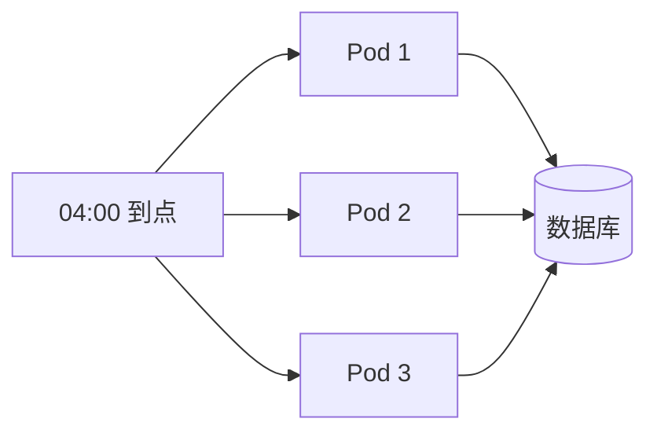

# 定时任务与事件驱动

> 「这件事晚点做」有三条完全不同的路：定时任务、进程内事件、消息队列。选错的代价通常要到线上才暴露。这篇讲清怎么选，以及定时任务在多副本部署下必须处理的那个坑。

## 三种「延后执行」先分清

| | 定时任务 | 事件（同进程） | 消息队列 |
|---|---|---|---|
| 谁触发 | 到点自动触发 | 业务代码里 `emit` | 生产者投递给中间件 |
| 在哪执行 | 同进程 | 同进程 | 另一个进程 / 另一台机器 |
| 重启会不会丢 | 任务不丢，但错过的那次不会补 | **会丢**，它只存在于内存 | 不丢，中间件持久化 |
| 失败重试 | 自己实现 | 没有 | 中间件内置，配死信队列 |
| 发起方等不等 | 没有发起方 | 默认**同步等着**（见后文） | 不等 |
| 典型用途 | 对账、清理、快照、批量回写 | 注册后发信、加积分、写审计 | 发短信、转码、导出、跨服务通知 |

误用的代价各不相同：

- **用事件做「必须送达」的事**：进程在监听器执行前挂掉，这件事就彻底消失了。用户注册成功但优惠券没发，你连「系统试过」这个痕迹都查不到——没有记录、没有重试、没有告警。
- **用定时任务轮询做实时的事**：轮询间隔就是延迟下限。想把延迟压到 100ms，就是对数据库做持续压测。
- **用消息队列做同进程内的解耦**：多一个中间件要运维、要监控、要处理消息格式版本兼容，换来的只是省掉一个 import。

一句话判断：**丢了要不要紧？** 不要紧用事件，要紧用队列；跟业务动作无关、只跟时间点有关的用定时任务。

---

## @nestjs/schedule 的三种定时任务

```bash
npm i @nestjs/schedule
```

```typescript
@Module({ imports: [ScheduleModule.forRoot()] })
export class AppModule {}
```

```typescript
@Injectable()
export class ReportTask {
  constructor(private readonly reportService: ReportService) {}   // 正常注入依赖

  // 六段表达式，最前面一段是秒
  @Cron('0 0 4 * * *', { name: 'dailyReport', timeZone: 'Asia/Shanghai' })
  async daily() { await this.reportService.build() }

  // 常用间隔有枚举，不用背表达式
  @Cron(CronExpression.EVERY_30_MINUTES)
  async halfHourly() {}

  @Interval('heartbeat', 10_000)      // 每 10 秒，起点是应用启动那一刻
  heartbeat() {}

  @Timeout('warmup', 5_000)           // 启动 5 秒后执行一次
  warmup() {}
}
```

| 装饰器 | 语义 | 底层 | 适合 |
|---|---|---|---|
| `@Cron` | 按**日历时间**触发 | `cron` 包 | 「每天 4 点」「每周一 9 点」这类和自然时间绑定的任务 |
| `@Interval` | 按**固定间隔**触发 | `setInterval` | 心跳、缓存刷新，不关心具体时刻 |
| `@Timeout` | 启动后延迟触发一次 | `setTimeout` | 预热、一次性迁移 |

`@Interval(3600_000)` 和 `@Cron('0 0 * * * *')` 看着都是「每小时」，区别在于前者的触发时刻取决于**进程什么时候启动**：三个副本在不同时间重启，就会在一小时内的三个不同时刻各跑一次。要对齐自然时间、或者要让执行时刻可预测，只能用 `@Cron`。

`timeZone` 也不是可选项。服务器通常跑 UTC，写 `'0 0 4 * * *'` 却不指定时区，「凌晨 4 点」实际会落在北京时间正午。凡是和业务日历相关的任务（日报、对账、月结）都要显式写上。

### cron 表达式速查

```text
秒     分     时     日     月     周
0-59   0-59   0-23   1-31   1-12   0-7（0 和 7 都是周日）
```

| 表达式 | 含义 |
|---|---|
| `*/10 * * * * *` | 每 10 秒 |
| `0 */5 * * * *` | 每 5 分钟的第 0 秒 |
| `0 30 3 * * *` | 每天 03:30:00 |
| `0 0 9 * * 1-5` | 周一到周五 9 点整 |
| `0 0 2 1 * *` | 每月 1 号 2 点 |
| `0 0 12 * * mon,wed,fri` | 周一三五中午 |
| `0 0 0,12 * * *` | 每天 0 点和 12 点 |

> ⚠️ 网上大量 cron 速查表其实是 **Quartz（Java）** 语法。里面的 `?`、`L`（月末）、`W`（工作日）、`4#3`（第三个周三）以及第七段「年」在 Node 的 `cron` 包里**都不支持**，写上去会直接抛解析错误。这个包只支持 `*`、范围 `1-5`、步长 `*/2`、枚举 `1,3,5`，外加月份和星期的三字母缩写。要「每月最后一天执行」只能在任务体里自己判断当天是不是月末，让表达式每天都触发。

另一个从旧项目抄表达式时的坑：`cron` 包 v3 起月份改成 `1-12`（老版本是 `0-11`），照抄会整体偏移一个月。写完的表达式建议用 `validateCronExpression()` 或 `new CronTime(expr).sendAt()` 打印下一次执行时间验证一遍。

---

## 动态调度：SchedulerRegistry

装饰器上的表达式是编译期写死的。「用户自己配的定时提醒」——每周一早上 9 点提醒我写周报——表达式来自数据库，只能在运行时注册。注入 `SchedulerRegistry`：

```typescript
@Injectable()
export class ReminderScheduler implements OnApplicationBootstrap {
  constructor(
    private readonly registry: SchedulerRegistry,
    private readonly repo: ReminderRepository,
    private readonly notifier: NotifierService,
  ) {}

  // 注册表只在内存里，重启后必须从数据库重新装载
  async onApplicationBootstrap() {
    for (const reminder of await this.repo.findAllEnabled()) this.add(reminder)
  }

  add(reminder: Reminder) {
    const { valid, error } = validateCronExpression(reminder.cron)   // cron 包导出
    if (!valid) throw new BadRequestException(`表达式非法：${error?.message}`)

    const name = `reminder:${reminder.id}`
    this.remove(name)                       // 先删旧的，否则同名任务会叠加执行

    const job = CronJob.from({
      cronTime: reminder.cron,
      timeZone: reminder.timeZone ?? 'Asia/Shanghai',
      onTick: () => this.notifier.push(reminder.userId, reminder.text),
    })

    this.registry.addCronJob(name, job)
    job.start()                             // addCronJob 不会自动启动
  }

  remove(name: string) {
    if (!this.registry.doesExist('cron', name)) return
    this.registry.getCronJob(name).stop()    // 先停再删
    this.registry.deleteCronJob(name)
  }
}
```

三条纪律：

1. **用户输入的表达式必须校验**。非法表达式会在注册时抛错，更麻烦的是 `* * * * * *` 这种每秒执行会瞬间把服务打满——除了语法校验，还要限制最小间隔。
2. **注册表是内存态**，进程重启就空了。真正的数据源是数据库表，`onApplicationBootstrap` 里重新装载。
3. **先 `stop()` 再 `deleteCronJob()`**。只从注册表里删掉，定时器还挂在事件循环上继续触发，现象是「删了还在跑」。`@Interval` / `@Timeout` 同理，对应 `deleteInterval` / `deleteTimeout`。

`@Cron` 声明了 `name` 之后还可以用 `@InjectCronRef('dailyReport')` 把 job 对象注入进来，做「运维后台里临时停掉某个任务」很方便。

---

## 多实例陷阱：本篇最重要的一节

线上服务不会只有一个副本。一份代码部署三个 Pod，`@Cron('0 0 4 * * *')` 就会在凌晨 4 点被执行**三次**——每个进程都有一套完整的调度器，它们互相不知道对方存在。



后果取决于任务是否幂等：回写阅读量跑三次可能只是白跑两次；「给昨天下单的用户各发一张券」跑三次就是发了三张，「批量扣费」跑三次就是三倍账单。**这是定时任务上线后最常见的生产事故，而且在单实例的本地环境里永远复现不出来。**

| 方案 | 做法 | 代价 | 适合 |
|---|---|---|---|
| Redis 分布式锁 | 每个副本到点都醒，抢一把锁，抢到的才执行 | 依赖 Redis；锁的边界情况要处理 | 大多数业务任务 |
| 选主 | 副本间选出一个 leader，只有它跑调度 | 要引入选举机制（Etcd、K8s Lease）或额外组件 | 任务多且密集、已有协调服务 |
| 拆独立 worker | 定时任务从 API 服务拆出来，单独部一个 `replicas: 1` 的 Deployment | 多一个部署单元；单点，滚动更新期间任务不跑 | 任务重、跑得久、要独立扩缩容 |

**推荐从分布式锁起步。** 改动只是在任务入口包一层，不动部署结构，也不需要新组件（Redis 基本都有）。等定时任务多到互相抢 CPU、或者单次执行长到几十分钟，再拆成独立 worker——那时它已经是个后台任务系统了，见 [Worker 与异步任务](/guide/background-worker)。选主的复杂度只有在「几十个任务要均衡分配到多个实例」时才划算。

```typescript
const UNLOCK = `
  if redis.call('GET', KEYS[1]) == ARGV[1] then return redis.call('DEL', KEYS[1]) end
  return 0
`

@Injectable()
export class CronLock {
  private readonly logger = new Logger(CronLock.name)

  constructor(@Inject(REDIS_CLIENT) private readonly redis: RedisClientType) {}

  async run(name: string, ttlMs: number, task: () => Promise<void>) {
    const key = `cron:lock:${name}`
    const token = randomUUID()

    // NX：只有一个副本能写进去；PX：进程猝死后锁会自己过期，不会永久死锁
    const acquired = await this.redis.set(key, token, { NX: true, PX: ttlMs })
    if (!acquired) {
      this.logger.debug(`${name} 已被其他实例执行，本轮跳过`)
      return
    }

    try {
      await task()
    } finally {
      // 必须「比对 token 再删」，而且这两步要原子，所以只能走 Lua
      const released = await this.redis.eval(UNLOCK, { keys: [key], arguments: [token] })
      if (released === 0) this.logger.error(`${name} 执行超过锁 TTL，可能已被并发执行`)
    }
  }
}
```

**误删**是这里最隐蔽的问题。假设直接 `DEL key`：任务实际跑了 12 秒而 TTL 只有 10 秒，第 10 秒锁自动过期、另一个副本拿到锁开始执行，第 12 秒你删掉的是**它的**锁，于是第三个副本也能进来——互斥彻底失效，而且没有任何报错。所以释放前必须确认这把锁还是自己的，释放返回 0 要当成告警信号而不是忽略。

**续期**处理的是另一半：任务耗时超过 TTL。首选做法不是续期，而是把 TTL 设成预估耗时的两三倍、同时给任务本身加超时——绝大多数场景到这里就够了。确实无法预估耗时（全量对账、批量导入）才上看门狗后台续期，续期同样要校验归属，且续期失败必须中断业务，因为锁已经不属于你了。完整的看门狗实现和 Redis 锁的失效边界（主从切换、GC 停顿、时钟漂移）见 [Redis 实战](/guide/redis-practice)。

> ⚠️ 锁只保证「同一时刻最多一个在跑」，不保证「一定有人跑完」。抢不到锁的副本跳过是对的，但**抢到锁的那个副本执行中途崩溃，这一轮就整个丢了**——锁到期释放，没人补跑。关键任务必须配执行记录表和补偿手段，见下一节。

---

## 定时任务工程纪律

| 纪律 | 不做的后果 |
|---|---|
| 任务体整个包 try/catch | 定时器回调抛出的异常没有调用方接，变成 `unhandledRejection`；轻则本轮静默失败，重则进程退出 |
| 防重入 | 上一轮五分钟没跑完、下一轮又开始，两轮同时处理同一批数据 |
| 长任务分批 + 进度断点 | 一次查询百万行把内存和数据库一起拖垮；中途失败又要从头来 |
| 执行记录表 | 「昨天的对账到底跑了没」只能翻日志，日志过期就无从考证 |
| 手动触发接口 | 一次失败只能等明天，或者上服务器改系统时间 |

单进程内的防重入有现成开关，不用自己维护布尔标记：

```typescript
@Cron('0 */5 * * * *', { name: 'settle', waitForCompletion: true })
async settle() {}
```

`waitForCompletion: true` 会让本轮回调结束前的所有调度**直接跳过**，注意是跳过而不是排队——对账任务积压十轮没有意义。它只管当前进程，跨副本的重入还得靠上一节的锁，两者要一起用。

把这些纪律都落地的骨架：

```typescript
@Injectable()
export class SettleTask {
  private readonly logger = new Logger(SettleTask.name)

  constructor(
    private readonly lock: CronLock,
    private readonly runs: TaskRunRepository,
    private readonly settle: SettleService,
  ) {}

  @Cron('0 0 3 * * *', { name: 'settle', timeZone: 'Asia/Shanghai', waitForCompletion: true })
  handle() {
    return this.lock.run('settle', 30 * 60_000, () => this.execute('cron'))
  }

  async execute(trigger: 'cron' | 'manual') {
    const run = await this.runs.start('settle', trigger)     // 先落一条 running 记录
    try {
      let cursor = run.lastCursor ?? 0                       // 断点续跑
      for (;;) {
        const batch = await this.settle.nextBatch(cursor, 500)
        if (!batch.length) break
        await this.settle.handleBatch(batch)
        cursor = batch.at(-1)!.id
        await this.runs.checkpoint(run.id, cursor)           // 每批更新进度
      }
      await this.runs.succeed(run.id)
    } catch (err) {
      // 关键：异常必须在这里落地，不能让它冒出定时器回调
      this.logger.error(`settle 执行失败 runId=${run.id}`, (err as Error).stack)
      await this.runs.fail(run.id, (err as Error).message)
    }
  }
}
```

手动触发入口放在 Controller 里，调用**同一个** `execute`，不要复制一份逻辑：

```typescript
@Post('admin/tasks/settle')
@Roles('admin')
rerun() {
  return this.lock.run('settle', 30 * 60_000, () => this.settleTask.execute('manual'))
}
```

几个设计动机：

- **手动入口同时是最好的测试入口**，不用等到点、不用改服务器时间。但它能改数据，必须挂权限（见 [权限与授权](/guide/nestjs-authorization)），而且要走同一把锁——否则手动重跑会和定时执行撞在一起。
- **执行记录表**至少要有 `task_name / trigger / status / started_at / finished_at / cursor / error`。它的价值全在事后：跑没跑、跑到哪断的、是不是越跑越慢，都靠它回答。
- **游标必须落库**，只存在内存里的话进程一挂就白跑。批大小几百到几千之间，太小则每批的往返开销占比过高。
- 任务里的日志要自己开一个 traceId，否则这一轮的几十条日志串不起来；做法见 [日志与可观测性](/guide/nestjs-logging)。

---

## 事件通信：@nestjs/event-emitter

```bash
npm i @nestjs/event-emitter
```

```typescript
@Module({
  imports: [
    EventEmitterModule.forRoot({
      wildcard: true,      // 允许 order.* 这样的通配符订阅
      delimiter: '.',      // 命名空间分隔符
      maxListeners: 20,
    }),
  ],
})
export class AppModule {}
```

发布方只关心「这件事发生了」，不关心谁在听：

```typescript
@Injectable()
export class OrderService {
  constructor(private readonly events: EventEmitter2) {}

  async pay(orderId: number) {
    const order = await this.repo.markPaid(orderId)     // 主流程只做必须做的
    this.events.emit('order.paid', new OrderPaidEvent(order.id, order.userId, order.amount))
    return order
  }
}

@Injectable()
export class RewardListener {
  @OnEvent('order.paid')
  async addPoints(event: OrderPaidEvent) {
    try { await this.points.grant(event.userId, event.amount) }
    catch (err) { /* 自己兜住，见下 */ }
  }

  @OnEvent('order.*')          // 通配符：一个方法接一族事件
  audit(event: unknown) {}
}
```

### 为什么事件不等于异步

这是最容易误解的一点：**`emit()` 是同步的**。它在当前调用栈里依次执行所有监听器，全部返回后 `emit()` 才返回。两个直接后果：

- 监听器里的耗时操作**直接拖慢发布方**。以为「发个事件就返回了」的人会发现下单接口因为发邮件慢了 800ms。
- 监听器里同步抛出的异常会**冒泡到 `emit()` 的调用点**，把主流程一起打断。订单其实已经支付成功，只因为加积分的监听器报错，接口返回了 500。

`@OnEvent` 支持 `{ suppressErrors: true }`（对 async 监听器默认开启），`forRoot` 也能配全局 `errorHandler`。但**别把它当解决方案**：错误被吞掉不等于事情做完了，只是变成了没人知道的失败。正确做法是监听器自己 try/catch，失败要落库、要告警、要能重试。

| 写法 | 行为 |
|---|---|
| `emit()` + 同步监听器 | 全部同步执行完才返回，异常直接冒泡到发布方 |
| `emit()` + `async` 监听器 | 监听器返回的 Promise **没人 await**，发布方不等；内部异常变成 unhandled rejection（除非被 suppress） |
| `await emitAsync()` | 等所有监听器 settle 并拿到返回值数组；这时它等于「拆开写的顺序调用」，除了解耦没有别的收益 |

所以「主流程不等」这件事是靠**监听器写成 async 并自己兜住错误**实现的，不是靠 `emit` 本身。

### 什么该用事件，什么不该

| 场景 | 用事件？ | 原因 |
|---|---|---|
| 注册成功后发欢迎信、发新人券、加积分 | ✅ | 主流程不该为这些等待，也不该因为它们失败而失败 |
| 状态变化时写审计日志、刷新缓存、推送站内消息 | ✅ | 纯旁路，偶尔丢一条影响有限 |
| 打破两个 Service 的循环依赖（一个方向只是「通知」） | ✅ | 依赖从双向变单向，比 `forwardRef` 干净（见 [依赖注入](/guide/nestjs-di)） |
| 扣库存、扣余额、创建必须存在的关联记录 | ❌ | 这是业务本身，必须和主操作同事务、失败要回滚 |
| 必须送达的通知（支付短信、审批提醒） | ❌ | 进程重启就丢，且没有重试 |
| 跨服务通信 | ❌ | 它只在单进程内广播，别的进程收不到 |

**「拿事件替代事务」是其中最危险的一种。** 在 `order.paid` 的监听器里扣库存看着很解耦，实际上订单和库存不在一个事务里：进程在两者之间挂掉就是永久的数据不一致，而且没有任何记录能告诉你哪些订单漏扣了。事务边界见 [数据库集成](/guide/nestjs-database)。

折中做法是**事务内先落一条待发事件记录、事务提交后再投递**（本地消息表），这样「事件一定会被投出去」有了持久化保证——但走到这一步，你其实已经在实现队列了，不如直接用队列。

---

## 事件 vs 直接调用 vs 队列

| | 直接调用 Service | 事件（同进程） | 消息队列 |
|---|---|---|---|
| 耦合 | 编译期依赖，要 imports + 注入 | 只依赖事件名这个约定 | 只依赖消息格式 |
| 执行位置 | 同进程同调用栈 | 同进程 | 另一个进程 |
| 主流程是否等待 | 等 | 不等（async 监听器） | 不等 |
| 失败是否影响调用方 | 直接影响 | 同步监听器会影响 | 不影响 |
| 重启是否丢 | 不涉及 | **丢** | 不丢 |
| 重试与死信 | 自己写 | 没有 | 中间件内置 |
| 可观测性 | 调用栈清楚 | **调用关系隐式**，重构容易漏 | 有队列深度、消费延迟等指标 |
| 能否同事务 | ✅ | ❌ | ❌ |

事件的主要代价是**调用关系变隐式**：看 `OrderService` 的代码看不出 `order.paid` 有几个监听器，改 payload 时容易漏。缓解办法是把事件名和 payload 类型集中在一个文件里（`events/order.events.ts`），改动时靠类型报错找到所有订阅方。

选择顺序：默认直接调用（最简单、最好调试）→ 只有「通知语义 + 允许丢 + 同进程」才升级成事件 → 「要可靠、要重试、要跨进程、要削峰」一律用队列。队列的模型、幂等消费和死信见 [消息队列基础](/guide/message-queue) 与 [Worker 与异步任务](/guide/background-worker)。

---

## 案例一：阅读量计数

最直觉的写法是每次浏览执行一条 SQL：

```sql
UPDATE article SET view_count = view_count + 1 WHERE id = 123;
```

三个问题让它上不了量：

- **行锁串行化**。这条语句会锁住 id=123 那一行直到事务提交。一篇爆款文章同时被几千人打开，所有请求都排在同一行上等待，接口耗时从几毫秒涨到几百毫秒。
- **写放大**。一次浏览换来一次磁盘写、一条 binlog、一份主从复制流量，而这个数字的精确度其实没有人在意。
- **统计本身就不对**。同一个人刷新十次算十次阅读。

改成 Redis 累加 + 定时批量回写：

```typescript
@Injectable()
export class ArticleViewService {
  constructor(@Inject(REDIS_CLIENT) private readonly redis: RedisClientType) {}

  async view(articleId: number, viewerKey: string) {
    // 10 分钟内同一个人不重复计数：SET NX EX 一条命令搞定「判断 + 写入 + 过期」
    const fresh = await this.redis.set(`viewed:${articleId}:${viewerKey}`, 1, {
      NX: true,
      EX: 600,
    })
    if (!fresh) return

    await this.redis.hIncrBy('article:views:pending', String(articleId), 1)
  }
}
```

用一个 hash 装所有待写增量，而不是每篇文章一个 key：回写时一次 `HGETALL` 就能拿全，不需要 `KEYS` 扫描——生产环境执行 `KEYS` 会阻塞整个 Redis 实例。`viewerKey` 登录用户用 userId，匿名用 IP 加 UA 的 hash。

### 回写必须原子且幂等

```typescript
// 取出与清零要一步完成，否则中间新增的浏览会被一起清掉
const FLUSH = `
  local data = redis.call('HGETALL', KEYS[1])
  if #data > 0 then redis.call('DEL', KEYS[1]) end
  return data
`

@Cron('0 */10 * * * *', { name: 'flushViews', waitForCompletion: true })
async flush() {
  await this.lock.run('flushViews', 60_000, async () => {
    const flat = (await this.redis.eval(FLUSH, { keys: ['article:views:pending'] })) as string[]

    for (let i = 0; i < flat.length; i += 2) {
      const id = Number(flat[i])
      const delta = Number(flat[i + 1])
      // 写增量而不是写绝对值，两次回写重叠也不会互相覆盖
      await this.repo.increment({ id }, 'viewCount', delta)
    }
  })
}
```

三个关键点：

- **「先读后清」不能拆成两条命令。** `HGETALL` 到 `DEL` 之间新增的浏览会被一起删掉，用户会看到阅读量倒退。单个 key 的场景用 `GETDEL` 就够，hash 只能靠 Lua。
- **写增量而不是写绝对值。** `view_count = view_count + delta` 允许多次回写并存；写「我算出来的总数」则会互相覆盖，多副本或重跑时必错。
- **拿到增量后写库失败，这批数据就真的丢了。** 不能丢的话，先把增量落到一张待处理表、写入文章表成功后再删除——代价是一次额外写入。阅读量这种场景通常不值得，但「余额变动」「计费」绝对值得。

热点 key：单篇文章 QPS 上万时，这个 hash 会集中打在一个 Redis 分片上。做法是按 id 分桶（`article:views:pending:{id % 16}`），回写时遍历所有桶；或者在应用进程内先做几百毫秒的本地聚合，再批量打给 Redis。

周榜月榜不是定时任务的活，那是 Redis ZSET 的活（见 [Redis 实战](/guide/redis-practice)）。定时任务在这里只负责**什么时候给榜单打快照**——每天 0 点把当日榜固化成一条历史记录，之后查历史榜就不用重算。

---

## 案例二：短链服务

### 短码怎么生成

| 方案 | 做法 | 问题 |
|---|---|---|
| 自增 id 转 62 进制 | 插一行拿到 id，`base62(id)` | 短码**连续可枚举**。拿到 `3k9` 就能试 `3k8`、`3ka`，把全站短链遍历出来。用在兑奖链接、内部文档分享上是直接的安全漏洞 |
| hash 截断 | `md5(url)` 取前若干位再编码 | 有碰撞概率，撞了要改写规则重试，逻辑分叉；且相同 url 永远得到相同短码，能被用来反查「某个地址有没有被人分享过」 |
| 发号器预生成 | 低峰期批量生成随机码入库，用时直接领一个 | 多一张表和一个定时任务，还要处理「池子领空了」的兜底 |

选第三种：随机码天然不可枚举，唯一性校验发生在生成阶段而不是请求路径上，领码只是一次条件更新。62 的 6 次方约 568 亿，六位足够用很久。

```typescript
const ALPHABET = '0123456789abcdefghijklmnopqrstuvwxyzABCDEFGHIJKLMNOPQRSTUVWXYZ'

function randomCode(len = 6) {
  const bytes = randomBytes(len)        // 用 crypto，不要用 Math.random
  let code = ''
  for (const b of bytes) code += ALPHABET[b % 62]
  return code
}

@Injectable()
export class CodePoolService {
  // 每天低峰期把池子补到水位线
  @Cron('0 0 4 * * *', { name: 'refillCodePool', timeZone: 'Asia/Shanghai' })
  async refill() {
    await this.lock.run('refillCodePool', 10 * 60_000, async () => {
      const need = Math.max(0, 100_000 - (await this.repo.countIdle()))

      for (let done = 0; done < need; done += 1000) {
        const rows = Array.from({ length: Math.min(1000, need - done) }, () => ({
          code: randomCode(),
          status: 'idle',
        }))
        // code 列上有唯一索引，重复的让数据库丢掉，不要先查再插
        await this.repo.insertIgnore(rows)
      }
    })
  }
}
```

**唯一性靠唯一索引 + `INSERT IGNORE`，不要靠「先 SELECT 查重再 INSERT」**——后者在并发下依然会撞，而且每插一条多一次查询。一万条的正确姿势是分批批量插入、让数据库拒掉重复的，这一轮少插几条无所谓，下一轮会补上。

领码同样要原子，用条件更新而不是「先查再改」：

```typescript
const taken = await this.repo.update({ code, status: 'idle' }, { status: 'used' })
if (taken.affected === 0) { /* 被别人抢走了，换一个码重试 */ }
```

这和「扣库存」是同一个模式，取舍见 [并发、事务与一致性](/guide/concurrency-transaction)。池子空了要能降级：现场生成随机码直接插映射表，靠唯一索引冲突重试几次。

### 301 还是 302

| | 301 永久重定向 | 302 临时重定向 |
|---|---|---|
| 浏览器行为 | **强缓存**，之后直接跳目标地址，不再请求你 | 每次都先请求你的服务 |
| 服务压力 | 小 | 每次点击都是一次请求 |
| 点击统计 | 只能统计到第一次 | 每次都能统计 |
| 改目标地址 | **改不掉**：已缓存 301 的浏览器永远到不了新地址，且没有办法让它失效 | 改一行数据库记录即可 |
| 过期 / 下线 | 做不到 | 可以 |

短链服务**一律用 302**。301 省下的那点流量，换来的是「内容不可更改、不可下线、点击数据拿不到」——而短链的核心价值恰恰是可管理和可统计。真正适合 301 的是「站点永久换域名」这种场景。

```typescript
@Get(':code')
async redirect(@Param('code') code: string, @Req() req: Request, @Res() res: Response) {
  const link = await this.links.findByCode(code)
  if (!link || (link.expiresAt && link.expiresAt < new Date())) {
    throw new NotFoundException('短链不存在或已过期')
  }

  // 统计走事件：丢一条点击记录不要紧，让用户多等 20ms 才要紧
  this.events.emit('shortlink.visited', {
    code,
    ip: req.ip,
    referer: req.headers.referer,
    at: new Date(),
  })

  res.redirect(HttpStatus.FOUND, link.longUrl)     // 302
}
```

监听方拿到事件后先 `INCR` 到 Redis，再由定时任务批量落库——和上一个案例是同一套模式。两个补充：

- **过期靠字段判断，不要靠定时任务删数据。** 库里存 `expires_at`，查询时比较。删掉记录之后就无法区分「过期」和「从来不存在」，访问记录也一起没了。
- **自定义短码**（`/spring-sale`）直接插映射表，靠唯一索引拒绝重复。必须有保留字黑名单，否则用户能注册 `api`、`admin`、`health` 这类和真实路由冲突的短码，把自己的接口盖掉。

---

## 面试问答

**1. `@Interval` 和 `@Cron` 都写成「每小时」，有什么区别？为什么 `timeZone` 不是可选项？**

- `@Interval` 底层是 `setInterval`，起点是进程启动那一刻：三个副本在不同时间重启，就会在一小时内的三个不同时刻各跑一次。
- `@Cron` 按日历时间触发，要对齐自然时间、让执行时刻可预测只能用它；服务器通常跑 UTC，不指定 `timeZone`，「凌晨 4 点」实际会落在北京时间正午。
- 别踩的坑：网上大量 cron 速查表是 Quartz（Java）语法，`?`、`L`、`W` 在 Node 的 `cron` 包里不支持，写上去直接抛解析错误；这个包 v3 起月份是 `1-12`，从旧项目照抄会整体偏移一个月。

**2. 三个副本，`@Cron('0 0 4 * * *')` 会执行三次，怎么解决？**

- 每个进程都有一套完整的调度器，互相不知道对方存在——非幂等任务就是发三张券、三倍账单，而且单实例的本地环境永远复现不出来。
- 推荐从 Redis 分布式锁起步：`SET NX PX` 抢锁；释放必须用 Lua 比对 token 再删，否则任务实际耗时超过 TTL 后会误删别人的锁，互斥彻底失效且没有任何报错。
- 锁只保证「同一时刻最多一个在跑」，不保证「一定有人跑完」——抢到锁的副本中途崩溃，这一轮就整个丢了，关键任务必须配执行记录表和补偿手段。
- 加分：能说出升级路径——任务多到互相抢 CPU 再拆 `replicas: 1` 的独立 worker；选主的复杂度只在「几十个任务要均衡分配到多个实例」时才划算。

**3. `emit()` 是异步的吗？监听器里的异常去哪了？**

- 是同步的：它在当前调用栈里依次执行所有监听器，全部返回后 `emit()` 才返回，监听器耗时直接拖慢发布方（下单接口因为发邮件慢了 800ms）。
- 同步监听器抛出的异常会冒泡到 `emit()` 的调用点，把主流程一起打断——订单其实已支付成功，加积分的监听器报错，接口却返回 500。
- async 监听器返回的 Promise 没人 await，内部异常变成 unhandled rejection；`suppressErrors` 别当解决方案，正确做法是监听器自己 try/catch，失败要落库、要告警、要能重试。
- 加分：能说出「主流程不等」是靠监听器写成 async 且自己兜住错误实现的，不是 `emit` 本身给的。

**4. 什么该用进程内事件，什么必须上消息队列？**

- 事件只在单进程内广播、重启就丢、没有重试，只承载「丢了不要紧」的旁路：发欢迎信、写审计、刷新缓存；它还能打破两个 Service 的循环依赖。
- 扣库存、扣余额这类必须和主操作同事务的逻辑不能用事件——订单和库存不在一个事务里，进程在两者之间挂掉就是永久的数据不一致，而且没有任何记录能告诉你哪些订单漏扣了。
- 必须送达的通知（支付短信）、跨服务通信一律用队列；折中的本地消息表（事务内先落待发记录、提交后投递）已经是在自己实现队列了，不如直接用队列。

**5. 阅读量回写时，「先读后清」为什么不能拆成两条 Redis 命令？**

- `HGETALL` 和 `DEL` 之间新增的浏览会被一起清掉，用户会看到阅读量倒退；单个 key 用 `GETDEL` 就够，hash 只能靠 Lua 把取与清合成一步。
- 回写要写增量（`view_count + delta`）而不是算出来的绝对值，写增量允许两次回写并存，写绝对值会互相覆盖，多副本或重跑时必错。
- 拿到增量后写库失败，这批数据就真的丢了；阅读量通常不值得补救，但「余额变动」「计费」必须先把增量落到待处理表、写成功后再删。
- 加分：热点 key 按 id 分桶（`id % 16`）散开，或在进程内先做几百毫秒本地聚合再批量打给 Redis；生产上不用 `KEYS` 扫描，它会阻塞整个 Redis 实例。

**6. 定时任务上线前要落实哪些工程纪律？**

- 任务体整个包 try/catch：定时器回调抛出的异常没有调用方接，变成 unhandledRejection，轻则本轮静默失败，重则进程退出；异常要落执行记录表，不能让它冒出回调。
- `waitForCompletion: true` 防同进程重入——上一轮没跑完，下一轮的调度直接跳过（是跳过不是排队，对账任务积压十轮没有意义）；它只管当前进程，跨副本的重入还得靠分布式锁，两者一起用。
- 长任务分批 + 游标断点，游标必须落库（只存内存的话进程一挂就白跑），批大小几百到几千；执行记录表至少有 task_name / trigger / status / started_at / finished_at / cursor / error，跑没跑、断在哪、是不是越跑越慢全靠它回答。
- 留一个手动触发接口，调**同一个** execute、走**同一把**锁——它同时是最好的测试入口，不用等到点、不用改服务器时间，但能改数据，必须挂权限。
- 加分：任务里的日志自己开一个 traceId（`cron-${randomUUID()}`），否则这一轮的几十条日志串不起来。
