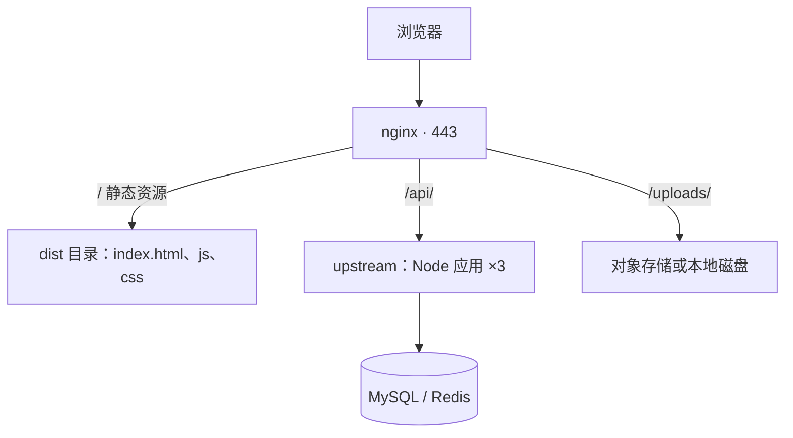
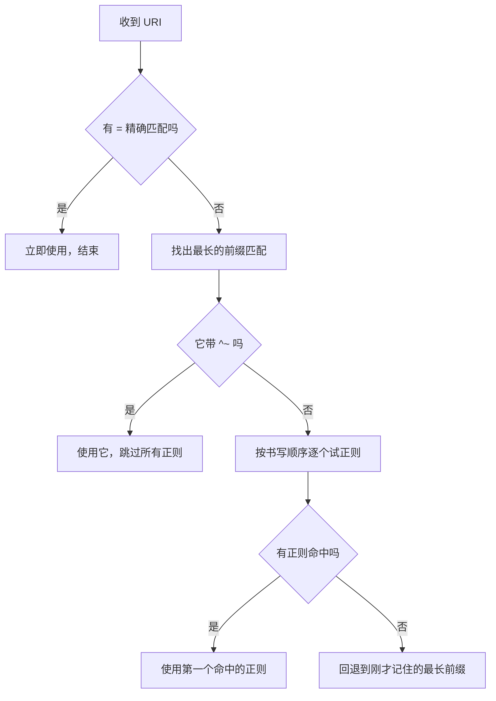
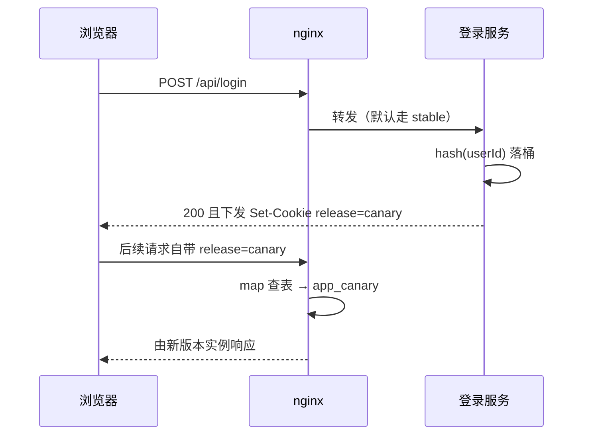

# Nginx：反向代理与流量治理

> 应用跑在 3000 端口不等于能上线。这篇讲清 nginx 的配置怎么组织、反代要配哪几行才不出错，以及怎么把它当成流量治理的控制面：灰度、限流、慢请求定位。

## nginx 在一次请求里站在哪

浏览器发出的请求几乎不会直接打到 Node 进程，中间那一层通常就是 nginx：



多这一层换来的东西：

| 能力 | 没有 nginx 时的窘境 |
|---|---|
| TLS 终结 | 每个应用进程各自装证书、各自续期 |
| 同源部署 | 前端和 API 域名不同，要额外处理 CORS 和 Cookie 跨域 |
| 静态资源 | Node 用 `express.static` 读磁盘，白占事件循环 |
| 横向扩容 | 加一台机器就得改前端的 baseURL |
| 灰度、限流、封禁 | 每个应用重复实现一遍 |
| 无损发布 | 重启应用期间请求直接失败 |

顺手把"正向 / 反向"分清：代理**替客户端**发请求叫正向代理，客户端知道自己在用代理、服务端不知道真实来源；代理**替服务端**收请求叫反向代理，客户端以为它就是服务端。判断方法是看代理在为谁隐藏身份。

---

## 配置文件的结构与继承

配置是一棵由 block 组成的树，主干四层：

```nginx
worker_processes  auto;              # main 上下文：进程、日志、pid，全局生效
error_log  /var/log/nginx/error.log warn;

events {                             # 连接层
    worker_connections  10240;       # 单个 worker 能持有的连接数
}

http {                               # HTTP 协议层：所有站点的公共配置
    sendfile on;
    keepalive_timeout 65;
    client_max_body_size 1m;         # 会被下层 server / location 覆盖

    include /etc/nginx/conf.d/*.conf;

    server {                         # 虚拟主机 = 一组 listen + server_name
        listen 80;
        server_name api.example.com;

        location /api/ {             # 路由：按 URI 决定怎么处理
            client_max_body_size 20m;    # 只放开这一条路由的上传体积
        }
    }
}
```

**继承规则一句话**：大部分指令沿 `http → server → location` 向内继承，内层出现同名指令就**整体覆盖**外层，不是合并。两个坑：内层写一次 `add_header`，外层所有 `add_header` 全部失效；同理，随手加一个 `proxy_set_header X-Trace-Id` 会把外层的 `Host`、`X-Real-IP` 一起冲掉——这就是"我明明配了 Host 怎么没生效"的答案。

组织习惯：`nginx.conf` 只放全局和 `http` 层公共配置，每个域名一个 `conf.d/api.example.com.conf`，反代公共头抽成 `snippets/proxy.conf` 供各站点 `include`。改一个站点不用碰主配置，回滚粒度小。

### 校验与热加载

```bash
nginx -t          # 只校验语法与路径，不加载。改完必跑
nginx -T          # 校验并打印展开 include 之后的完整配置
nginx -s reload   # 热加载
```

reload 不断连接的原因在进程模型：master 进程只管配置解析和 worker 管理，真正收请求的是多个 worker。收到 reload 信号后 master 先校验新配置，**校验失败就原地放弃、旧 worker 照常服务**；校验通过则用新配置 fork 出新 worker 接管新连接，同时通知旧 worker 停止 accept、把手上的请求处理完再退出。全程监听套接字没有中断——所以线上永远是 `nginx -t && nginx -s reload`，不要 restart，restart 有空窗期，期间连接会被直接拒。

> ⚠️ 修改 `worker_processes`、`user`、`listen` 端口这类启动期才生效的指令，reload 无效，仍然需要重启。

---

## location 匹配规则

五种形态：

| 写法 | 含义 | 例子 |
|---|---|---|
| `location = /health` | 精确匹配，URI 完全相等才命中 | 只匹配 `/health` |
| `location ^~ /assets/` | 前缀匹配，命中后**不再尝试正则** | `/assets/app.js` |
| `location ~ \.php$` | 正则匹配，区分大小写 | 匹配 `/a.php`，不匹配 `/a.PHP` |
| `location ~* \.(jpg\|png)$` | 正则匹配，忽略大小写 | `/a.JPG` 也命中 |
| `location /api/` | 普通前缀匹配，优先级最低 | `/api/users` |

优先级**不是**按配置文件里的书写顺序，而是固定的判定流程：



两个容易记混的点：**前缀匹配之间比的是"谁更长"而不是"谁在前"，正则之间比的才是"谁在前"**；正则整体优先级高于普通前缀，但低于 `^~` 前缀。

给一份配置验证一下：

```nginx
location = /            { return 200 "A"; }
location /              { return 200 "B"; }
location /images/       { return 200 "C"; }
location ^~ /images/raw/ { return 200 "D"; }
location ~ \.png$       { return 200 "E"; }
```

| 请求 URI | 命中 | 为什么 |
|---|---|---|
| `/` | A | 精确匹配一票通过 |
| `/about` | B | 只有 `/` 这一个前缀命中，没有正则命中 |
| `/images/a.jpg` | C | 最长前缀是 `/images/`，无正则命中 |
| `/images/a.png` | E | 最长前缀 `/images/` 不带 `^~`，继续试正则，命中 |
| `/images/raw/a.png` | D | 最长前缀是 `^~ /images/raw/`，直接结束，正则不再参与 |

::: tip 实用结论
把静态资源目录写成 `^~`（省掉每个请求的正则回溯），把 `/health`、`/favicon.ico` 这类高频固定路径写成 `=`，其余用普通前缀。正则 location 数量越少越好。
:::

### root 与 alias

```nginx
location /static/ { root  /var/www; }   # /static/a.js → /var/www/static/a.js
location /static/ { alias /var/www/; }  # /static/a.js → /var/www/a.js
```

`root` 把**完整 URI** 拼在后面，`alias` 先**剥掉 location 前缀**再拼。目录结构和 URL 路径一致时用 `root`，要把 URL 前缀映射到别的目录名时用 `alias`——注意 `alias` 的末尾斜杠必须和 location 一致，否则会拼出 `/var/wwwa.js` 这种路径。

### proxy_pass 结尾那个斜杠

这是反代最贵的一个字符。规则：**`proxy_pass` 的地址带路径部分（哪怕只有一个 `/`），nginx 就把 location 的前缀替换掉；不带路径部分则原样透传完整 URI。**

假设请求是 `GET /api/users/1`：

| 配置 | 后端实际收到 | 说明 |
|---|---|---|
| `proxy_pass http://127.0.0.1:3000;` | `/api/users/1` | 无路径部分，原样转发 |
| `proxy_pass http://127.0.0.1:3000/;` | `/users/1` | `/api/` 被替换成 `/`，前缀被剥掉 |
| `proxy_pass http://127.0.0.1:3000/v2/;` | `/v2/users/1` | `/api/` 被替换成 `/v2/` |
| `proxy_pass http://backend;` | `/api/users/1` | upstream 名字后没路径，同样原样转发 |

对应到实践：应用里配了全局前缀（Nest 的 `app.setGlobalPrefix('api')`）就**不要**斜杠，让 `/api/` 一路带到后端；应用路由本身是 `/users`、`/api` 只是给 nginx 分流用的，就**要**斜杠把前缀剥掉。

> ⚠️ 正则 location 里 nginx 无法确定"前缀"是什么，`proxy_pass` 不允许带路径，只能配合 `rewrite ^/api/(.*)$ /$1 break;` 改写。需要复杂改写时也优先用 `rewrite`，比依赖斜杠的隐式规则更容易读懂。

---

## 反向代理必配的那几行

默认转发会把请求"洗干净"，后端因此丢失所有客户端信息。这是最小可用的一组：

```nginx
location /api/ {
    proxy_pass http://backend;

    proxy_http_version 1.1;                 # 默认 1.0，会让 keepalive 和 WebSocket 失效
    proxy_set_header Host              $host;
    proxy_set_header X-Real-IP         $remote_addr;
    proxy_set_header X-Forwarded-For   $proxy_add_x_forwarded_for;
    proxy_set_header X-Forwarded-Proto $scheme;
    proxy_set_header X-Forwarded-Host  $host;
}
```

不配的后果：

| 缺哪个头 | 症状 |
|---|---|
| `Host` | 后端收到的 Host 是 upstream 地址（`backend` 或 `127.0.0.1:3000`）。基于域名的多租户路由、重定向、生成的绝对 URL 全错 |
| `X-Real-IP` / `X-Forwarded-For` | 后端看到的客户端 IP **全是 nginx 的内网 IP**。风控、按 IP 限流、登录日志、地域统计集体失效 |
| `X-Forwarded-Proto` | 后端以为自己在跑 http，生成的绝对 URL 是 `http://`，浏览器混合内容拦截；OAuth 回调地址对不上；Cookie 的 `secure` 判断出错 |

`$proxy_add_x_forwarded_for` 会在已有的 `X-Forwarded-For` 后追加 `$remote_addr`，多层代理时形成 `客户端, LB, nginx` 这样的链。

### Node 侧必须显式信任

Express / Nest 默认**不信任**这些头，直接读 `req.ip` 拿到的还是 nginx 的 IP：

```typescript
const app = await NestFactory.create<NestExpressApplication>(AppModule)
app.set('trust proxy', 1)   // 只信任最靠外的 1 跳代理
```

开启后 `req.ip` 取 `X-Forwarded-For` 里的客户端地址，`req.protocol` 认 `X-Forwarded-Proto`，`req.secure` 也随之正确。

> ⚠️ 别写 `trust proxy: true`。它表示"无条件相信整条链"，而 `X-Forwarded-For` 是客户端可以随便伪造的请求头——攻击者带一个假 XFF 就能绕过按 IP 的限流和封禁。数字表示信任几跳、从右往左数，这是唯一安全的用法。Fastify 适配器用 `{ trustProxy: 1 }` 传给构造函数。

### 超时、缓冲与流式响应

| 指令 | 默认值 | 含义 |
|---|---|---|
| `proxy_connect_timeout` | 60s | 与 upstream 建立 TCP 连接的超时，配大没意义，连不上就是连不上 |
| `proxy_send_timeout` | 60s | 向 upstream 写请求体的两次写操作间隔上限 |
| `proxy_read_timeout` | 60s | **两次读到数据之间**的间隔上限，不是整个请求的总时长 |
| `proxy_buffering` | on | nginx 先把后端响应攒在缓冲区，攒够或结束才发给客户端 |

`proxy_read_timeout` 的语义是"沉默多久算超时"。所以一个流式接口只要**持续有数据**，跑一小时也不会超时；而一个 90 秒才吐出第一个字节的报表接口，会稳定挂在 60 秒。

`proxy_buffering on` 是 nginx 的默认值，也是做 AI 流式输出时最常踩的坑：后端已经在一个 token 一个 token 地 `write`，nginx 却攒在缓冲区里，前端要么什么都收不到、要么最后一次性收到全部——看起来像"后端没流式"，其实是代理层攒住了。SSE / chunked 流式接口要单独关掉：

```nginx
location /api/chat/stream {
    proxy_pass http://backend;
    proxy_http_version 1.1;
    proxy_set_header Host $host;
    proxy_set_header Connection '';       # 清掉 Connection，避免影响 keepalive 复用

    proxy_buffering off;                  # 必须：来一块转一块
    proxy_cache off;
    chunked_transfer_encoding on;
    proxy_read_timeout 600s;              # 模型思考期间可能长时间无输出
    gzip off;                             # gzip 也会攒 buffer，破坏实时性
}
```

后端还要配合发 `X-Accel-Buffering: no` 响应头，nginx 见到它会对**这一个响应**关闭缓冲，比在配置里写死更灵活（同一个 location 既有普通 JSON 又有流式响应时尤其有用）。

大文件上传下载则相反，`proxy_request_buffering off` 让 nginx 边收边转，避免大请求体先落磁盘再转发。

WebSocket 是同一类问题的另一面：它靠 HTTP 升级握手，所以除了 `proxy_http_version 1.1`，还必须透传 `proxy_set_header Upgrade $http_upgrade;` 和 `proxy_set_header Connection "upgrade";`，并把 `proxy_read_timeout` 配得比心跳间隔长。多实例下还要注意握手和后续请求必须落到同一个实例，否则 Socket.IO 的轮询降级会失败——解决办法是 `ip_hash` 或给 Socket.IO 接 Redis adapter，见 [WebSocket 与实时通信](/guide/nestjs-realtime)。

---

## 部署前端 SPA

```nginx
server {
    listen 80;
    server_name app.example.com;
    root /var/www/app/dist;

    location ^~ /assets/ {                 # 带 hash 的构建产物：一年强缓存
        expires 1y;
        add_header Cache-Control "public, max-age=31536000, immutable";
        access_log off;
    }

    location = /index.html {               # 入口文件绝不缓存
        add_header Cache-Control "no-cache, must-revalidate";
    }

    location / {                           # 前端路由兜底
        try_files $uri $uri/ /index.html;
    }
}
```

`try_files $uri $uri/ /index.html` 按顺序找：先当文件找、再当目录找、都没有就返回 `index.html`。为什么必须有：SPA 的 `/orders/123` 在磁盘上并不存在对应文件，它是前端路由在浏览器里解析的。用户直接输入地址或刷新页面时，请求会真的打到 nginx，没有兜底就是 404。**这就是"刷新页面 404"这个经典问题的唯一答案。**

缓存策略必须**两条一起配**，只配一条都会出事：

| 配置 | 后果 |
|---|---|
| 全部长缓存（含 `index.html`） | 发版后用户拿到旧 `index.html`，它引用的旧 hash 文件已被删除，白屏 |
| 全部不缓存 | 每次访问重下几 MB 的 js，首屏慢、CDN 白花钱 |
| `index.html` 不缓存 + hash 资源长缓存 | 正确：入口每次校验，资源靠文件名变化天然失效 |

其余几条：

```nginx
gzip on;
gzip_comp_level 5;                 # 6 以上收益递减、CPU 明显上升
gzip_min_length 1k;                # 小文件压完可能更大
gzip_vary on;                      # 让 CDN 按 Accept-Encoding 分别缓存
gzip_types text/plain text/css application/javascript application/json
           image/svg+xml application/wasm;

client_max_body_size 20m;          # 默认仅 1m，超了直接 413，请求根本到不了后端
```

`gzip_types` 里**不要**加图片和视频，它们已经是压缩格式，再压是纯浪费 CPU。Brotli 压缩率比 gzip 高 15% 到 20%，但官方镜像不自带，要额外的 `ngx_brotli` 模块（`brotli on; brotli_types ...;`）。更省事的做法是构建时就生成 `.js.gz` 和 `.js.br`，运行时用 `gzip_static on;` / `brotli_static on;` 直接发预压缩文件，把 CPU 开销从每次请求挪到构建一次。

> ⚠️ `client_max_body_size` 和应用层的上传限制是两套。两边都要放开，且 nginx 的值不小于应用侧，否则大文件在 nginx 就被 413 掉，后端连日志都看不到。

---

## 负载均衡

```nginx
upstream backend {
    server 10.0.1.11:3000 weight=3 max_fails=2 fail_timeout=10s;
    server 10.0.1.12:3000 weight=1 max_fails=2 fail_timeout=10s;
    server 10.0.1.13:3000 backup;          # 只在上面全挂时才启用

    keepalive 64;                          # 与后端保持的空闲长连接数
}
```

四种策略：

| 策略 | 写法 | 适用 | 代价 |
|---|---|---|---|
| 轮询 | 默认，不写 | 无状态服务、实例配置一致 | 不感知实例负载，慢实例照样分到同样多请求 |
| 加权轮询 | `weight=3` | 实例配置不一致（4 核 vs 2 核）、灰度按比例放量 | 权重要手工维护 |
| IP 哈希 | `ip_hash;` | 需要会话粘性、长连接 | 见下 |
| 最少连接 | `least_conn;` | 请求耗时差异大（有的 10ms 有的 10s） | 需要 nginx 维护连接计数 |

`least_conn` 常常比轮询更适合真实业务：轮询假设每个请求耗时相近，一旦有慢接口（导出报表、调大模型），慢请求会在某个实例上堆积而轮询仍在往里塞。

`keepalive 64` 很容易被漏掉。不配的话 nginx 每转发一个请求就和后端建一次 TCP 连接，高 QPS 下 TIME_WAIT 堆成山。配了它就必须同时有 `proxy_http_version 1.1;` 和 `proxy_set_header Connection "";`，否则 HTTP/1.0 不支持长连接、或者 `Connection: close` 头把连接关掉。

### 被动健康检查

`max_fails=2 fail_timeout=10s` 的含义是：10 秒内连续失败 2 次，就把这个实例摘掉 10 秒，之后再放一个请求试探。这是**被动**检查——靠真实用户请求当探针，所以摘除之前一定有真实用户吃到错误。

开源版 nginx 没有主动健康检查（定时请求 `/health`），那是商业版 `health_check` 指令或 Tengine / OpenResty 的能力。开源版能做的补偿：把 `max_fails` 调小、`fail_timeout` 调短，并且配上 `proxy_next_upstream error timeout http_502 http_504;` 让失败请求自动重试到下一台。

> ⚠️ 重试要小心非幂等请求。`proxy_next_upstream` 默认包含 `error timeout`，如果一个 POST 已经发到后端、后端处理完但响应超时，重试会造成**重复下单**。对写接口应显式加 `proxy_next_upstream off;`，或者在应用层用幂等键兜底（见 [并发、事务与一致性](/guide/concurrency-transaction)）。

### ip_hash 做会话保持是个将就的方案

`ip_hash` 让同一来源 IP 固定落到同一实例，于是内存里的 session 能被读到。它能用，但代价不小：

| 问题 | 说明 |
|---|---|
| 分布不均 | 一个公司出口 NAT 后成千上万用户共用一个 IP，全压在一台实例 |
| 扩缩容重新洗牌 | 实例数量变化会让哈希结果大面积改变，用户集体掉登录 |
| 实例挂了会话就没了 | 会话在进程内存里，实例重启即丢，发版等于强制全员重新登录 |
| 灰度失效 | 无法按用户维度分流，只能按 IP 段 |

真正的解法是让服务**无状态**：会话数据放 Redis 或改用 JWT，任何实例都能处理任何请求，nginx 就可以自由轮询。取舍与实现见 [认证与登录状态](/guide/nestjs-auth) 里 Session 和 JWT 的对比，以及 [Redis 深入](/guide/redis-deep)。`ip_hash` 只适合两种情况：遗留系统来不及改造，以及 WebSocket 这类天然粘在一个连接上的场景。

---

## HTTPS

最小可用配置：

```nginx
server {
    listen 80;
    server_name app.example.com;
    return 301 https://$host$request_uri;      # 80 端口只做跳转
}

server {
    listen 443 ssl;
    http2 on;                                  # nginx 1.25.1+ 的写法
    server_name app.example.com;

    ssl_certificate     /etc/letsencrypt/live/app.example.com/fullchain.pem;
    ssl_certificate_key /etc/letsencrypt/live/app.example.com/privkey.pem;
    ssl_protocols       TLSv1.2 TLSv1.3;       # 1.0 / 1.1 已不安全
    ssl_session_cache   shared:SSL:10m;        # 握手复用，明显降延迟
    ssl_session_timeout 1d;

    add_header Strict-Transport-Security "max-age=31536000; includeSubDomains" always;
}
```

几个细节：

- **跳转用 `return 301` 而不是 `rewrite`**。`rewrite ^(.*)$ https://$host$1 permanent;` 效果一样，但它要跑正则引擎、属于 rewrite 阶段的指令，`return` 是直接短路返回。老配置里的 `rewrite` 写法多半是抄来的。
- **证书必须用 `fullchain.pem`**（证书 + 中间 CA）。只放 `cert.pem` 时浏览器能过、部分 Android 客户端和 curl 会报证书链不完整——这个 bug 特别难查，因为你自己的浏览器一切正常。
- **HSTS 要谨慎**：`max-age=31536000` 意味着一年内浏览器**拒绝**用 http 访问这个域名，回退不了。上线前先用小 `max-age`（如 300）验证，`includeSubDomains` 更要确认所有子域都已支持 HTTPS。
- `http2 on;` 是 1.25.1 之后的独立指令，老版本写在 listen 行里（`listen 443 ssl http2;`）。

### 证书放 nginx 还是放云负载均衡

| 维度 | 证书在 nginx | 证书在云 LB / CDN |
|---|---|---|
| 续期 | 自己跑 certbot + reload 钩子，机器多要同步分发 | 平台托管，自动续期 |
| 加解密开销 | 占你自己的 CPU | 由平台承担 |
| 加密范围 | 端到端到你的机器 | LB 到源站默认可能是明文，需另配回源加密 |
| 灵活性 | 想配什么密码套件、mTLS 都行 | 受平台支持范围限制 |
| 适合 | 自建机房、单机部署、需要 mTLS | 多实例、有 CDN、团队没有运维专职 |

有云 LB 就把证书放 LB，nginx 只处理 80 端口的内网流量，同时通过 `X-Forwarded-Proto` 感知外层协议。自建部署用 certbot 配合 `--deploy-hook "nginx -s reload"` 自动化。

---

## 灰度发布

上线新版本不该是"切一刀，全量生效"。灰度的目标是让 5% 的用户先承担风险，出问题只影响 5%，并且能在一分钟内退回去。nginx 站在流量入口，天然就是做这件事的地方。

三种分流依据：

| 依据 | 实现 | 同一用户是否稳定 | 适用 |
|---|---|---|---|
| 权重 | `upstream` 里给新版本 `weight=1`、旧版本 `weight=19` | ❌ 每次请求重新掷骰子 | 纯无状态接口的容量验证 |
| 用户标识 | `map` + cookie / header 映射到不同 upstream | ✅ 只要标识不变就恒定 | **业务灰度和 AB 实验的正确做法** |
| IP 段 | `geo` 模块按网段映射 | ✅（IP 不变的前提下） | 先在公司内网 / 特定地区放量 |

权重分流的问题不是"不准"，而是**同一个用户在两个版本之间来回跳**：第一个请求走新版返回了新字段，第二个请求走旧版没有这个字段，前端直接报错；更糟的是新版写进去的数据格式旧版读不懂。所以除了纯读、无状态、响应结构完全一致的接口，都不要用权重分流。

### 用 map 按 cookie 分流

```nginx
# http 上下文
upstream app_stable {
    server 10.0.1.11:3000;
    server 10.0.1.12:3000;
    keepalive 32;
}

upstream app_canary {
    server 10.0.1.21:3000;
    keepalive 32;
}

# 把 cookie 值映射成 upstream 名字。map 只做查表，不执行逻辑
map $cookie_release $target_pool {
    default   app_stable;      # 没有 cookie 的一律走稳定版
    "canary"  app_canary;
    "stable"  app_stable;
}

server {
    listen 443 ssl;
    server_name app.example.com;

    location /api/ {
        proxy_pass http://$target_pool;
        proxy_http_version 1.1;
        proxy_set_header Host              $host;
        proxy_set_header X-Real-IP         $remote_addr;
        proxy_set_header X-Forwarded-For   $proxy_add_x_forwarded_for;
        proxy_set_header X-Forwarded-Proto $scheme;
        proxy_set_header X-Release        $target_pool;   # 让后端日志能区分版本
    }
}
```

再加一个 `map $http_x_release $forced_pool { ... }`，就能让同事用请求头强制指定版本来验证，不必先去改自己的 cookie。

> ⚠️ 用 `map` 而不是一串 `if ($http_cookie ~* "release=canary")`。`if` 在 location 里有大量反直觉的边界（和 `proxy_pass`、`try_files` 混用会失效甚至崩溃，社区称之为 "if is evil"），而且每个请求都要跑一次正则；`map` 是启动时构建的哈希表，查表是常数时间且行为确定。另外 `$cookie_release` 是 nginx 内置变量，直接取名为 `release` 的 cookie，不需要自己去 `$http_cookie` 里抠正则。

### 流量染色：谁来发这个 cookie

nginx 只负责"看标识、转流量"，标识得有人打上去。这一步叫流量染色，通常放在登录成功那一刻，因为那时才知道用户是谁：

```typescript
@Post('login')
async login(@Body() dto: LoginDto, @Res({ passthrough: true }) res: Response) {
  const user = await this.authService.validate(dto)
  const tokens = await this.authService.issueTokens(user)

  res.cookie('release', this.canary.bucketOf(user.id), {
    httpOnly: false,   // 前端也要读它来决定加载哪套资源，所以不能 httpOnly
    sameSite: 'lax',
    maxAge: 7 * 24 * 3600 * 1000,
    path: '/',
  })
  return tokens
}
```

分桶函数要满足"同一个用户永远同一个桶"，所以不能用随机数，要用 ID 的哈希：

```typescript
@Injectable()
export class CanaryService {
  constructor(private readonly config: ConfigService) {}

  bucketOf(userId: number): 'canary' | 'stable' {
    const percent = this.config.get<number>('CANARY_PERCENT', 0)   // 0~100，存配置中心
    if (percent <= 0) return 'stable'
    if (percent >= 100) return 'canary'

    // 加盐是为了换一批灰度用户时不必总命中同一批人
    const salt = this.config.get<string>('CANARY_SALT', 'v2')
    const h = createHash('md5').update(`${salt}:${userId}`).digest()
    return h.readUInt32BE(0) % 100 < percent ? 'canary' : 'stable'
  }
}
```

用取模而不是 `Math.random()` 的意义：比例从 5% 提到 10% 时，原来那 5% 的用户**仍然在灰度组里**，只是新增了 5%，不会出现"上一批用户被换出去"的抖动。内部员工可以在这个函数里直接白名单返回 `canary`，让新版本先被自己人用一天。

完整链路：



### 配套的四个工程问题

**1. 前后端一起灰度还是分开？**

| 改动类型 | 做法 |
|---|---|
| 只有后端改（性能优化、SQL 重写、修 bug） | 只灰后端。前端无感 |
| 只有前端改（文案、样式、交互） | 只灰前端。CDN 按同一个 cookie 返回不同版本的 `index.html` |
| 前后端联动的新接口 | **必须一起灰**，且两侧读同一个 cookie。否则新前端调到旧后端，接口 404 |

联动灰度的实操是：静态资源按版本发到 `dist/stable/` 和 `dist/canary/`，nginx 用同一个 `map` 决定 `root` 指向哪个目录。要点是**新前端只能调新接口或兼容接口**，不能假设后端一定是新版。

**2. 数据库 schema 变更必须向前兼容**

灰度期间新旧代码**同时**在读写同一个库。这条约束比灰度本身更硬：

| 操作 | 安全吗 | 正确做法 |
|---|---|---|
| 加新表、加可空新列 | ✅ 旧代码看不见就等于不存在 | 直接加 |
| 加 `NOT NULL` 无默认值的列 | ❌ 旧代码的 INSERT 不带这列，直接报错 | 先加可空列 → 双写 → 回填 → 最后才加约束 |
| 删列 / 改列名 | ❌ 旧代码还在 `SELECT` 它 | 分三次发布：新代码停止使用 → 全量上线并观察 → 再删列 |
| 改列的类型或长度变小 | ❌ 旧数据可能截断 | 新建列迁移，不原地改 |

一句话原则：**扩展在前、收缩在后，两次发布之间必须夹一次全量上线。** 灰度做得再好，一个 `DROP COLUMN` 就能让旧版本实例全线 500。

**3. 怎么快速回滚**

回滚要比发布更快。按代价从低到高：

```bash
# 一、把灰度比例调回 0（改配置中心，秒级，无需碰 nginx）
CANARY_PERCENT=0

# 二、nginx 层把 canary 指回稳定版（改 map 的一行，reload 无损）
map $cookie_release $target_pool {
    default  app_stable;
    "canary" app_stable;      # 临时全部拉回
}

# 三、真正回滚镜像版本
docker compose up -d --no-deps app
```

前两种手段之所以有效，是因为**新旧版本实例一直并存**。这也是灰度相比"停服升级"最实际的价值：回滚不需要重新部署。

**4. 灰度期间看什么指标**

对比两个池子的错误率、P99 延迟、关键业务转化率。前面 `proxy_set_header X-Release $pool;` 就是为此准备的——后端日志里带上版本标记，才能把指标按版本拆开看。只看总体指标，5% 的流量出问题会被平均掉，等你发现时已经全量了。

---

## 限流与防护

### 请求速率：limit_req

```nginx
# http 上下文：定义一个共享内存区，记录每个 key 的令牌状态
limit_req_zone $binary_remote_addr zone=per_ip:10m  rate=10r/s;
limit_req_zone $cookie_uid         zone=per_user:10m rate=30r/s;
limit_req_status 429;                       # 默认返回 503，429 语义更准确

server {
    location /api/ {
        limit_req zone=per_ip burst=20 nodelay;
        proxy_pass http://backend;
    }

    location /api/login {
        limit_req zone=per_ip burst=3;      # 登录接口收紧，且故意不加 nodelay
        proxy_pass http://backend;
    }
}
```

`$binary_remote_addr` 而不是 `$remote_addr`：前者是 4 字节二进制，后者是字符串，10MB 的 zone 能存的 IP 数量差好几倍。

nginx 的限流是**漏桶**：桶按 `rate` 匀速漏水（`10r/s` 等价于"每 100ms 放行一个"），`burst` 是桶的容量。`nodelay` 决定桶里的请求怎么处理：

| 配置 | 瞬间来 15 个请求（rate=10r/s, burst=20） | 用户感受 |
|---|---|---|
| 不加 `nodelay` | 第 1 个立即处理，其余排队，每 100ms 放一个，第 15 个等约 1.4 秒 | 慢，但都成功 |
| 加 `nodelay` | 15 个全部立即处理，占用 15 个 burst 槽位，槽位按 10/s 恢复 | 快，但持续高压会撞 429 |
| 超出 `burst` | 直接 429，不排队 | 报错 |

**`nodelay` 几乎总是你想要的**：真实用户的请求是突发的（打开一个页面并发 8 个接口），不加 `nodelay` 会把正常突发拖成人为的慢请求。不加 `nodelay` 的价值在于对付爬虫和暴力破解——故意让对方变慢，比直接报错更有效，因为报错会让脚本立刻重试。

### 并发连接与带宽

```nginx
limit_conn_zone $binary_remote_addr zone=conn_per_ip:10m;

location /download/ {
    limit_conn conn_per_ip 5;    # 单 IP 最多 5 个并发连接
    limit_rate 2m;               # 每连接限速 2MB/s
    limit_rate_after 10m;        # 前 10MB 不限速，保证小文件秒开
}
```

`limit_req` 管"多久来几个请求"，`limit_conn` 管"同时占着几个连接"。下载、上传、SSE 这类长连接场景要靠 `limit_conn`，因为它们请求数很少但一直占着连接。

### 按 IP 还是按用户

| 维度 | 按 IP | 按用户 |
|---|---|---|
| 未登录接口（注册、发短信、文档站） | ✅ 只有这个选择 | 拿不到用户身份 |
| 登录后的业务接口 | 会误伤 NAT 后的整栋写字楼 | ✅ 更精确 |
| 防刷 / 防爬 | ✅ 攻击者换账号比换 IP 容易 | 攻击者批量注册就绕过了 |
| 计费和配额（AI 接口调用次数） | 无意义 | ✅ 必须按用户，还要按 token 数 |

结论是两层都要有：nginx 按 IP 做粗粒度兜底，应用层按用户做精确配额。

> ⚠️ 站在 CDN 或云 LB 后面时，`$remote_addr` 是 CDN 节点的 IP，按它限流等于给所有用户共用一个额度。必须先用 real_ip 模块还原真实来源：
> ```nginx
> set_real_ip_from 10.0.0.0/8;          # 只信任你自己的 LB 网段
> real_ip_header   X-Forwarded-For;
> real_ip_recursive on;
> ```
> `set_real_ip_from` 一定要写具体网段。写成 `0.0.0.0/0` 等于允许任何客户端伪造自己的 IP。

### 两层限流各自该拦什么

| 层 | 拦什么 | 为什么在这层 |
|---|---|---|
| nginx | 单 IP 请求洪水、并发连接数、超大 body、恶意 UA、扫描路径 | 请求还没进入应用，不消耗 Node 的事件循环和数据库连接 |
| 应用（`@nestjs/throttler`） | 按用户 / 按接口的业务配额，如"每人每分钟发 1 条短信"、"免费用户每天 20 次对话" | 需要用户身份、需要读数据库里的套餐信息，nginx 拿不到 |

应用层的写法：

```typescript
ThrottlerModule.forRoot([
  { name: 'short', ttl: 1_000,  limit: 5 },     // 防连点
  { name: 'long',  ttl: 60_000, limit: 100 },   // 防刷
])

@Throttle({ short: { ttl: 60_000, limit: 1 } })
@Post('sms/code')
sendCode(@Body() dto: SendCodeDto) { /* ... */ }
```

> ⚠️ `@nestjs/throttler` 默认把计数存在**单进程内存**里。多实例部署时每个实例各算一份，实际额度会被放大成 N 倍，必须换成 Redis 存储适配器。这个坑和 session 放内存是同一类问题。

---

## 排查：让日志能回答问题

默认的 `combined` 日志格式没有耗时字段，等于放弃了 nginx 最有价值的观测能力。换成这个：

```nginx
log_format main escape=json
  '{"time":"$time_iso8601",'
  '"remote_addr":"$remote_addr",'
  '"method":"$request_method","uri":"$uri","status":$status,'
  '"body_bytes":$body_bytes_sent,'
  '"request_time":$request_time,'                 # nginx 视角的总耗时
  '"upstream_time":"$upstream_response_time",'    # 后端视角的耗时
  '"upstream_addr":"$upstream_addr",'             # 实际转发到了哪台
  '"upstream_status":"$upstream_status",'
  '"release":"$cookie_release",'
  '"trace_id":"$http_x_trace_id",'
  '"ua":"$http_user_agent"}';

access_log /var/log/nginx/access.log main;
error_log  /var/log/nginx/error.log warn;
```

`escape=json` 很重要，否则 UA 里的引号会把 JSON 撑破，日志采集直接解析失败。

### 两个耗时字段的差值就是答案

| 字段 | 覆盖范围 |
|---|---|
| `$request_time` | 从读到客户端请求的第一个字节，到最后一个响应字节写完 |
| `$upstream_response_time` | 从 nginx 与后端建连开始，到读完后端响应 |

差值 = 读客户端请求体的时间 + nginx 自身处理 + 把响应写回客户端的时间。于是"后端说自己很快、用户说很慢"这类争论可以直接定案：

| 观察 | 结论 |
|---|---|
| 两者都大 | 后端真的慢。去查慢 SQL、外部调用 |
| `request_time` 大、`upstream_time` 小 | 后端不背锅。通常是客户端网络慢（移动端上传大图）、响应体过大、或 nginx 与客户端之间带宽不足 |
| `upstream_time` 有多段值（如 `0.001, 2.500`） | 发生了重试。第一台失败后转到了第二台，去查 `$upstream_addr` 里那台实例 |
| `upstream_time` 是 `-` | 请求根本没到后端，被 nginx 自己拦了（限流、413、找不到 upstream） |

后端应用日志里也打同一个 `trace_id`，两边就能对齐到单个请求。

### 常见错误码的真实含义

| 码 | 谁返回的 | 原因 | 先查什么 |
|---|---|---|---|
| 502 Bad Gateway | nginx | 连不上后端，或后端返回了非法响应。进程挂了、端口没监听、容器还没起来、后端崩溃重启中 | `docker ps`、应用进程状态、`upstream` 地址是否写错 |
| 504 Gateway Timeout | nginx | 后端**连上了但不回话**，超过 `proxy_read_timeout` | 慢 SQL、外部 API 卡住、事件循环被同步代码堵死、流式接口忘了关 buffering |
| 413 Request Entity Too Large | nginx | 请求体超过 `client_max_body_size`（默认仅 1MB） | 调大该指令，并同步调大应用侧限制 |
| 499 | nginx | **客户端主动断开**。用户关页面、前端设了比后端更短的超时、重复点击触发取消 | 不是服务端 bug，但大量 499 说明接口太慢 |
| 400 Request Header Or Cookie Too Large | nginx | header 超过 `large_client_header_buffers` | 通常是 Cookie 塞了整个 JWT 甚至用户对象 |
| 403 / 404 在静态资源上 | nginx | `root` / `alias` 路径拼错，或容器里没挂载到文件 | `nginx -T` 看展开后的真实路径，再进容器 `ls` |

`error_log` 里对应的原文也值得认一下：`connect() failed (111: Connection refused)` 是后端没监听；`upstream timed out (110: Connection timed out)` 对应 504；`no live upstreams` 说明所有实例都被被动健康检查摘掉了。

> ⚠️ 502 和 504 的区别决定排查方向完全不同：502 是"敲门没人应"，去看进程和网络；504 是"人在里面但不出来"，去看代码和依赖。把两者混为一谈会浪费大量时间。

---

## 面试怎么说

> nginx 我主要用它做三件事：静态资源托管、反向代理和流量治理。反代必须配 `Host`、`X-Real-IP`、`X-Forwarded-For`、`X-Forwarded-Proto` 四个头，并在 Node 侧开 `trust proxy`，否则拿不到真实客户端 IP 和协议；做 AI 流式输出时要关 `proxy_buffering` 并放大 `proxy_read_timeout`，不然 SSE 会被缓冲住。灰度我用 `map` 加 cookie 做，登录时按用户 ID 哈希染色，保证同一用户稳定落在同一版本；灰度期间数据库变更必须向前兼容，只做加列不做删列。排查性能问题时我会在 `log_format` 里加 `$request_time` 和 `$upstream_response_time`，两者的差值能直接区分是后端慢还是客户端网络慢。

配套阅读：[Docker 与部署](/guide/docker-deployment)、[Dockerfile 实践](/guide/dockerfile-practice)、[Docker Compose 与网络](/guide/docker-compose-network)。

---

## 面试问答

**1. location 的匹配优先级是怎么走的？**

- 先看 `=` 精确匹配，命中立即结束；然后找最长前缀匹配，它带 `^~` 就直接用它、不再试正则
- 没带 `^~` 就按书写顺序逐个试正则，第一个命中的生效；正则全不中再回退到刚才记住的最长前缀
- 关键差异：前缀之间比「谁更长」，正则之间比的才是「谁写在前面」
- 加分：能给出优化习惯——静态资源目录写成 `^~` 省掉每个请求的正则回溯，`/health` 这类高频固定路径写成 `=`，正则 location 数量越少越好

**2. proxy_pass 结尾的斜杠怎么影响转发的路径？**

- proxy_pass 的地址带路径部分（哪怕只有一个 `/`），nginx 就把 location 前缀替换掉；不带路径部分则原样透传完整 URI
- 例：请求 `/api/users/1`，写 `proxy_pass http://127.0.0.1:3000;` 后端收到 `/api/users/1`，写成 `http://127.0.0.1:3000/;` 后端收到 `/users/1`
- 应用配了全局前缀（`app.setGlobalPrefix('api')`）就不加斜杠，让 `/api/` 一路带到后端；`/api` 只是给 nginx 分流用就加斜杠剥掉
- 别踩的坑：正则 location 里 proxy_pass 不允许带路径，只能配合 rewrite 改写；需要复杂改写时也优先用 rewrite，比隐式斜杠规则更容易读懂

**3. 反向代理不配 proxy_set_header 会出什么事故？**

- 缺 `Host`：后端收到的 Host 是 upstream 地址，基于域名的多租户路由、重定向、生成的绝对 URL 全错
- 缺 `X-Real-IP` / `X-Forwarded-For`：后端看到的客户端 IP 全是 nginx 内网 IP，风控、按 IP 限流、登录日志、地域统计集体失效
- 缺 `X-Forwarded-Proto`：后端以为自己在跑 http，生成的绝对 URL 是 `http://`，OAuth 回调对不上、Cookie 的 secure 判断出错
- Node 侧还要显式 `trust proxy`，而且只能写数字跳数（如 1）——写 true 等于无条件信整条链，而 XFF 是客户端可以随便伪造的头

**4. 开源版 nginx 的负载均衡健康检查是什么机制？失败重试有什么风险？**

- 只有被动检查：`max_fails=2 fail_timeout=10s` 表示 10 秒内连续失败 2 次就摘掉 10 秒——靠真实用户请求当探针，摘除之前一定有真实用户吃到错误
- 主动健康检查（定时请求 `/health`）是商业版 `health_check` 指令或 Tengine / OpenResty 的能力；开源版靠调小 max_fails、fail_timeout 加 `proxy_next_upstream` 补偿
- 别踩的坑：`proxy_next_upstream` 默认包含 error timeout，POST 已经发到后端、处理完但响应超时时，重试就是重复下单——写接口要显式 `proxy_next_upstream off` 或在应用层用幂等键兜底
- `ip_hash` 做会话保持是将就的方案：NAT 后大量用户共享出口 IP 会压垮单实例，扩缩容哈希洗牌集体掉登录；正解是会话放 Redis 或用 JWT 让服务无状态

**5. gzip 怎么配置才不出问题？**

- `gzip_comp_level` 5 左右就够，6 以上收益递减、CPU 明显上升；`gzip_min_length 1k`，小文件压完可能更大
- `gzip_types` 不要加图片和视频——它们已经是压缩格式，再压是纯浪费 CPU
- `gzip_vary on` 让 CDN 按 Accept-Encoding 分别缓存
- 加分：能说出更省 CPU 的路子——构建时预生成 `.js.gz` / `.js.br`，运行时 `gzip_static on` / `brotli_static on` 直接发预压缩文件，把压缩开销从每次请求挪到构建一次


